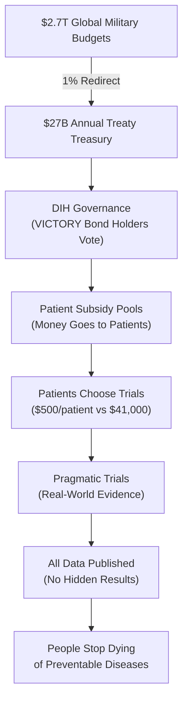

> **The 1% Treaty:** Every nation redirects just 1% of global military spending to fund 80X more efficient medical research, creating the most profitable investment in history while saving millions of lives.

 

## The Problem in Numbers

| What We Waste Money On | Annual Cost | What We Get |
|----------------|------------|-------------|
| War & Conflict | $9.7T | Destruction, refugees, and disabilities |
| Disease Burden | $109.1T | Suffering and lost potential |
| **Total Waste** | **$118.8T** | **The dumbest possible use of our limited resources** |
| **Medical Research** | **$0.068T** | Actual cures and treatments |

## The 1% Solution

We've created a system where:

1. **Nations redirect 1%** of military budgets to cure disease
2. **Patients get paid** to participate in clinical trials
3. **Research becomes 80x more efficient** using proven methods
4. **EVERYONE profits** from the $16.5T annual peace dividend

[How It Works](#how-it-works) | [The Math](#the-math) | [Get Involved](#join-the-war)

## Why This Works

✅ **Proven Model:** The Oxford RECOVERY trial showed we can run trials for $500 instead of $41,000 per patient  
✅ **Massive Leverage:** $1 in lobbying produces $1,813 in government contracts
✅ **Aligned Incentives:** Everyone gets rich by curing disease instead of killing people and  
✅ **No Losers:** Even partial success means 1% less war and nuclear bombs and more cures

## How It Works

### The Market Revolution in Medical Research

1. **Replace Central Planning**: NIH's Soviet-style committees → DIH's prediction markets and wisdom of crowds
2. **Amazon for Trials**: dFDA creates an open marketplace where treatments compete on real results, not lobbying
3. **Universal Integration**: One-click trial enrollment from any EHR, health app, or doctor's office
4. **80X Efficiency**: Market competition drives costs from $41,000 to $500/patient (Oxford proved it)
5. **Radical Transparency**: All data public, all results ranked - like Amazon reviews but for staying alive
6. **Pay for Success**: Researchers get rich by curing diseases, not by writing grant proposals

### Central Planning vs. Free Markets

**Current System (NIH/FDA Central Planning):**
- $2.2B per drug (committees pick losers)
- 17 years to market (bureaucracy moves at bureaucracy speed)
- 90% grant rejection rate (200 reviewers play god with $48B)
- 95% of diseases have 0 treatments (committees don't care about rare diseases)
- 15% patient access (gatekeepers everywhere)

**New System (DIH/dFDA Free Markets):**
- ~$27M per treatment (competition drives efficiency)
- 2-3 years to market (markets move at market speed)
- Fund everything, measure results (let data pick winners)
- 1,000X more treatments tested (markets find every niche)
- 100% patient access (Amazon doesn't turn away customers)

## The Math

### Investment Required vs. Returns

**Total Implementation Cost:** $1.2-2.5B over 36 months

**Annual Returns Once Operational:** $27B+ per year from 1% military budget redirections

**The Math:** We're asking for $2.5B to redirect $27B annually. That's a 10:1 return ratio - better than most venture capital investments, except this one saves millions of lives.

## The Plan: From Idea to Treaty

1.  **Prove the Mandate (The Global Referendum):** We will mobilize 3.5% of humanity (280 million people) through a global referendum. This creates an undeniable political mandate that no leader can ignore.

2.  **Fund the Mission (VICTORY Bonds):** We will raise the required $2.5B by selling **VICTORY Bonds**—an investment vehicle designed to offer ~40% annual returns, making peace more profitable than war.

3.  **Ratify the Treaty:** With a clear public mandate and a powerful financial engine, we will co-opt the existing political system to ratify the 1% Treaty and begin redirecting funds.

## Join the War on Disease

- **[Participate in the Referendum](mailto:hello@dih.earth)**: Signal your support and become part of the 3.5%.
- **[Join the Coalition](mailto:hello@dih.earth)**: We partner with institutions, companies, and non-profits.

See [Book Outline](./OUTLINE.MD)
