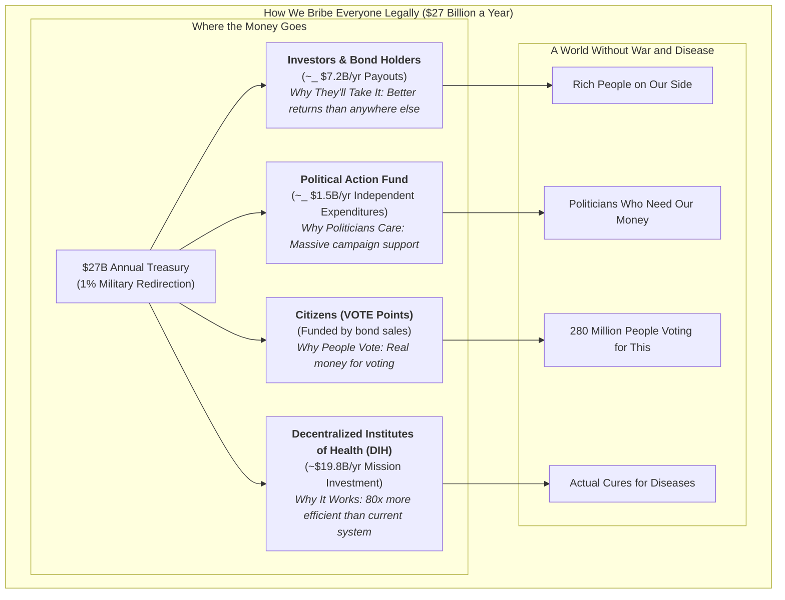
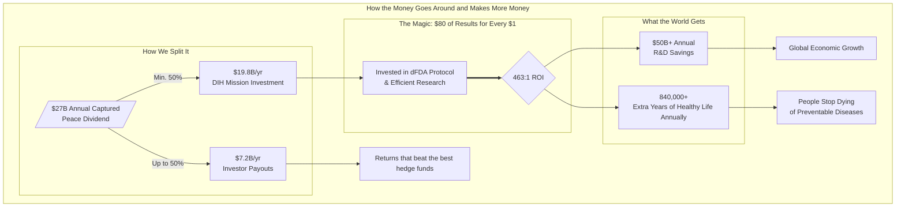

War is incredibly stupid. It costs humanity [$16.5 trillion a year](./brain/book/references.md#global-violence-costs) in wasted time, blown-up buildings, and general human misery.

Yet, we spend [$2.72 trillion](./brain/book/references.md#sipri-2024-spending) per year on this idiocy.

Meanwhile, aging, death and disease are very gradually destroying the lives of you and everyone you love. Yet we spend 40 times less ([$67.5 billion](./brain/book/reference/global-government-medical-research-spending.md)) on discovering cures for all diseases combined.

We spend 40 times more on killing people than on curing them.

RESULT: We haven't eradicated a single disease in over 50 years! :(

BEST IDEA IN THE WORLD: Humans instead spend that $2.7 trillion on helping each other instead of murdering each other. 

Problem: This makes far too much sense to ever become government policy. 

SECOND BEST IDEA IN THE WORLD: Take just 1% of our murder budget—$27 billion—and spent it on not dying instead? Just 1%. 

We'd still have $2.69 trillion/year left over. That's still enough to kill 67.25 billion people (and we only have 8 billion).

### But how do we do it?

Simple. We bribe EVERYONE.

For every $1 the military-industrial complex spends on lobbying politicians, it receives over [$1,813 in government contracts](./brain/book/references.md#lobbying-roi-calc). 

So here's the plan: We do exactly the same thing in reverse.

We create a [1% Treaty](./brain/book/strategy/1-percent-treaty/1-percent-treaty.md) that says "Dear World Leaders: Please use 1% of your weapons budget to [Decentralized Institutes of Health (DIH)](./brain/book/strategy/1-percent-treaty/decentralized-institutes-of-health.md) that pays for patients to participate in super-efficient [pragmatic clinical trials](./brain/book/reference/recovery-trial.md) for the most promising new treatments."

Getting every government to ratify the treaty requires two things:

1. Prove [3.5% of humanity](./brain/book/references.md#3-5-rule) wants this (that's the magic number for unstoppable political movements).
2. Spend [\$1-2.5 billion](./brain/book/economic-models/fundraising-and-budget-plan.md) bribing the right people legally.

### Q: How do we get \$2 billion and persuade the military industrial complex to help?

**A: We sell bonds designed to be the most profitable investment in the world.**

Remember World War II? America sold war bonds to fund the fight against fascism. We're doing the same thing, but for disease.

The military industrial complex is composed of humans that are not evil, they just like money. So we offer **[VICTORY bonds](./brain/book/strategy/1-percent-treaty/victory-bonds-tokenomics.md)** to anyone with the ability to influence the ratification of the 1% treaty by any particular nation.

**The result:** Everyone gets richer by funding cures instead of destruction.

---

## II. THE PROBLEM

## We're Doing This Backwards

Governments spend [\$2.72 trillion](https://www.sipri.org/publications/2025/sipri-fact-sheets/trends-world-military-expenditure-2024) on ways to kill people and [\$67.5 billion](./brain/book/reference/global-government-medical-research-spending.md) on ways to save them.

That's 40 to 1. Forty times more money for death than for life.

The Pentagon alone [can't account for \$2.5 trillion](./brain/book/references.md#pentagon-unaccounted-2-5t) in assets—250 times larger than what we're asking them to redirect. **They lose more money by accident than we need to cure cancer.**

We haven't eradicated a single disease in [50 years](./brain/book/references.md#smallpox-eradicated). But we have [enough nuclear weapons to end civilization](./brain/book/references.md#nuke-winter-150tg) several times over. (Just in case the first apocalypse doesn't take.)

In our evolutionary past, when resources were scarce, violence was necessary for survival. But today we live in a world with enough food for everyone. In fact, nearly all starvation today is actually the RESULT of violent conflict.

## Why We Keep Being Idiots

War is profitable. 

Military contractors make billions. Politicians get campaign donations. Everyone's getting paid except the people getting shot.

No amount of "war is bad" speeches will fix this. Money talks louder than morals.

## The Choice

Humanity has two options:

1. Keep building bigger bombs, autonomous weapons systems until we accidentally blow ourselves up or die of one of our many fine diseases.
2. Eradicate said disease instead.

Pick one.

See [1% Treaty](./brain/book/strategy/1-percent-treaty/1-percent-treaty.md) for quantified savings and ROI. For a detailed breakdown of direct and indirect costs of war, see [Quantified Costs of War](./brain/book/reference/costs-of-war.md).

---

## III. THE SOLUTION

## How It Works: From $27 Billion to Curing Cancer

We can't change human nature. But we can change what pays.

Here's the complete system that makes curing people more profitable than killing them:

### The 6-Step Process:

1. **Get the Money**: The 1% Treaty redirects $27B/year from weapons to cures
2. **Allocate Efficiently**: The DIH uses democratic voting to fund what matters most  
3. **Pay Patients**: Subsidies go directly to patients who join trials
4. **Run Cheap Trials**: Pragmatic trials cost $500/patient instead of $41,000
5. **Publish Everything**: The dFDA shows real effectiveness data for every treatment
6. **Label Outcomes**: Every food and drug gets honest labels about what it actually does

### The Speed and Cost Revolution:

**Current System:**
- **$2.2 billion** to develop one new treatment
- **17 years** from discovery to patients  
- **95% of diseases** have 0 FDA-approved treatments 

**New System:**
- **~$27 million** to develop one new treatment (80X cheaper)
- **2-3 years** from discovery to patients (Oxford RECOVERY speed)
- **1,000X more treatments** tested with same global budget
- **Every disease** gets attention (patients pay to participate)

**Result**: We know what works, what doesn't, people get paid to help us find out, and we do it 80X faster and cheaper.

## The Plan

**Goal:** Make curing people more profitable than killing them.

**Step 1:** Give everyone on Earth a stake in the outcome. Reward every person who votes on the global referendum with **VOTE points**—your proof that you'll get paid from the [$16.5 trillion annual peace dividend](./brain/book/economic-models/peace-dividend-value-capture.md) you help create (see [How to Stay Out of Prison](./brain/book/strategy/legal-compliance-framework.md)).

**Step 2:** When we hit [3.5% of humanity](./brain/book/references.md#3-5-rule), we have proof the world wants this.

**Step 3:** After the treaty is ratified, VOTE points become convertible to VICTORY bonds—you get to own part of the **$27B+ annual health treasury** and vote on how the money gets spent (see [VICTORY Bonds — Incentive Mechanics](./brain/book/strategy/1-percent-treaty/victory-bonds-tokenomics.md)).

**Step 4:** Build a legal political engine: independent‑expenditure committees that pledge massive support for candidates who vote with their district's referendum result—and fund challengers against those who defy it.

**Step 5:** The treasury funds EVERYONE in health - universities, pharma, nonprofits, government agencies - through democratically controlled funding pools.

---

## IV. THE FINANCIAL ENGINE (Why This Works)

## VICTORY Bonds: Bootstrap Funding Model

**[VICTORY Bonds](./brain/book/strategy/1-percent-treaty/victory-bonds-tokenomics.md):** Bootstrap funding now, repaid by treaty inflows.

Here are our two simple rules:

1. **We're Going to Try to Make You Filthy Rich:** About 40% returns per year, which beats just about everything. That's ~28x your money back over 10 years.
2. **But We Won't Forget Why We're Here:** No matter how much money we make, we'll never give more than half to investors. The other half goes to actually curing diseases. Because what's the point of getting rich if everyone you love is dead?

We pay investors most of their money up front (~$7.23B per year when everything works) as fast as the treaty money comes in. The 40% annual return is spread over 10 years, but we front-load it so investors get their money quickly and don't have to worry about us disappearing.

## The DIH Treasury: 80X More Efficient Research

**[Decentralized Institutes of Health (DIH)](./brain/book/strategy/1-percent-treaty/decentralized-institutes-of-health.md):** A treasury that funds research 80X cheaper. The DIH doesn't fund the [old, broken system](./brain/book/problems/problems-in-clinical-research.md)—it funds a **decentralized FDA (dFDA) system** with proven results:

- **[80X Greater Efficiency](./brain/book/reference/recovery-trial.md):** The dFDA model cuts per-patient trial costs from [$41,000](./brain/book/references.md#trial-cost-41k) to as low as [$500](./brain/book/references.md#recovery-cost-500), an 80X efficiency gain **already proven** by the [Oxford RECOVERY trial](./brain/book/reference/recovery-trial.md), which saved over 1 million lives globally.
- **[$50 Billion in Annual Savings](./brain/book/economic-models/dfda-cost-benefit-analysis.md):** By making research cheaper and faster, the dFDA system is projected to save the global R&D industry ~$50 billion annually—**based on actual performance data, not projections**.
- **[840,000+ Extra Years of Healthy Life](./brain/book/economic-models/dfda-cost-benefit-analysis.md):** The system is projected to generate over 840,000 extra years of healthy life annually through faster drug access and new therapies—**This isn't some pie-in-the-sky idea. The Oxford RECOVERY trial already proved you can run medical trials for $500 per patient instead of $41,000. We're just going to do more of that**.

**Specialized programs fund existing institutions:**

- Decentralized Institute of Mental Health → funds universities, pharma, nonprofits working on depression, anxiety, etc.
- Decentralized Institute of Cancer Research → funds MD Anderson, pharmaceutical companies, patient advocacy groups
- Decentralized Institute of Aging → funds longevity research at every institution

**Everyone gets more money, powered by a system that actually works. No one gets displaced.**

## Investment Required vs. Returns

**Total Implementation Cost:** $1.2-2.5B over 36 months

**What This Buys:** For a detailed breakdown of our multi-phase fundraising strategy and a line-item budget, see our full [Fundraising & Budget Plan](./brain/book/economic-models/fundraising-and-budget-plan.md).

- Global referendum "Proof-of-Vote" points platform (~$5-10M)
- Independent expenditures in priority elections (~$800M-1.5B)
- Targeted legal bribes to co-opt the MIC (~$100-200M)
- Building the system and testing it (~$250-400M)
- Staying out of prison and writing the treaty (~$100-200M)

**Annual Returns Once Operational:** $27B+ per year from 1% military budget redirections

**ROI Timeline:** 18-36 months after first treaty ratification

**Break-even Analysis:** Even in a conservative partial success scenario where only the **US, EU, & UK** participate (generating **$13B annually**), the system generates a **cash payout of $6.5B (2.6X the initial $2.5B investment)** in the first year of operation alone.

**The Math:** We're asking for $2.5B to redirect $27B annually. That's a 10:1 return ratio - better than most venture capital investments, except this one saves millions of lives.

This simple model ensures that even in conservative scenarios, the DIH remains massively well-funded while providing returns that beat the best hedge funds. For a complete breakdown, see our [Dynamic Cash Flow Model](./brain/book/economic-models/dih-treasury-cash-flow-model.md).

---

## V. THE BRIBERY STRATEGY (How to Bribe Literally Everyone)

## The Core Strategy: Co-opt, Don't Compete

**We don't fight the military-industrial complex. We make them a better offer.**

We turn today's **War Contractors** into tomorrow's **Peace Contractors** by paying them more.

**Current Military Contractor Economics:**

- [$1.1 billion lobbying](./brain/book/references.md#lobbying-1-1b) (2001-2021) → [$2.02 trillion contracts](./brain/book/references.md#contracts-2-02t)
- **Return: $1,813 per $1 spent on lobbying**
- Politicians get modest campaign donations and revolving door jobs

## The Order in Which We Bribe People

*We start with rich people who want to get richer, then move on to politicians. It's depressingly predictable, but it works.*

### Phase 1: Seed Investors ($250-400M Initial Investment)

- **Who:** Wealthy individuals, funds, Anchor Investors
- **The Bribe:**
  - **Targeting a >40% CAGR (~28x Return):** We designed this to make you more money than the fanciest hedge funds run by Harvard guys in expensive suits. The math works because we're taking money that's currently being wasted on bombs and using it to cure cancer instead. Two rules about payouts: a target to deliver a ~28x return to early investors, and a guarantee that at least 50% of annual income is always reserved for our health mission. See our [Investment Thesis](./brain/book/economic-models/victory-bond-investment-thesis.md) and [Cash Flow Model](./brain/book/economic-models/dih-treasury-cash-flow-model.md).
  - **VICTORY bonds** that grant governance control over the $27B annual DIH treasury.
  - **De-Risked Investment:** Initial funds are protected by an [Assurance Contract](./brain/book/economic-models/fundraising-strategy.md), guaranteeing a full refund if fundraising goals are not met.

### Phase 2: VICTORY Bond Buyers ($100-200M Referendum Funding)

- **Who:** Early Backers, health advocates, institutions
- **The Bribe\*:**
  - VICTORY bonds representing earned ownership of real economic value created by the [peace dividend](./brain/book/economic-models/peace-dividend-value-capture.md)
  - Governance control over $27B annually in captured value from military budget redirection
  - Voting rights on patient subsidies and research funding allocation
  - Bond value backed by actual treasury growth from when the treaty actually happens ($0 → $27B)

### Phase 3: Citizens (Global Population)

- **Who:** Global population (targeting 3.5% = 280M people)
- **The Bribe:** A large grant of **VOTE points** for each referendum vote—your proof that you'll get paid real money. These represent your earned share of the [$16.5 trillion annual peace dividend](./brain/book/economic-models/peace-dividend-value-capture.md) unlocked by redirecting military spending, convertible to **VICTORY bonds** after the 1% Treaty is ratified.

### Phase 4: Politicians ($800M-1.5B Independent Expenditures)

- **Who:** Key legislators in target countries
- **The Bribe\*:**
  - **Personal Wealth Creation:** Early access to [VICTORY Bonds](./brain/book/economic-models/victory-bond-investment-thesis.md) with better returns than defense stocks and traditional political corruption
  - **Campaign Dominance:** Massive campaign support for treaty supporters, equivalent opposition funding for defectors
  - **Family Security:** Their families get diseases too—profit from funding cures rather than weapons

## Why Everyone Will Take Our Deal

*We're offering arms dealers more money to save lives than they currently make blowing things up. Turns out most people aren't actually evil—they just respond to incentives.*

**Our Better Offer to Military Contractors:**

1. **More Money:** VICTORY bonds pay >40% returns, better than anything else they can find
2. **Better Security:** A world without disease is safer than a world with 13,000 nukes
3. **Their Families Too:** Defense contractors get cancer just like everyone else. They can profit from funding cures instead of bombs
4. **Same Lobbyists:** We pay their existing lobbyists better returns to push for the treaty instead of against it

**Our Better Offer to Politicians:**

- **Personal Investment:** Politicians can invest in [VICTORY Bonds](./brain/book/economic-models/victory-bond-investment-thesis.md) that pay better than defense stocks
- **Campaign Money:** Massive campaign support for treaty supporters; massive opposition funding for those who vote against it
- **Political Safety:** When 3.5% of your voters demand this, supporting it becomes the safer political choice
- **Easy Win:** Politicians get to claim credit for curing cancer and extending lifespans

**How Each Step Pays for the Next Step:** Rich people fund the global vote. The vote creates political pressure. Politicians pass treaties. Treaties create the $27 billion treasury. The treasury makes everyone even richer. And around we go.

**The Math:** We offer everyone more personal wealth than the current system, PLUS better campaign support, PLUS the moral high ground of saving lives, PLUS reduced existential risk. When the math favors peace, rational actors choose peace.

**Bottom Line:** By making peace and health more profitable than war and disease, we give every rational actor a clear financial incentive to support the treaty. We legally bribe our way to a better world.

---

## VI. PROOF & PRECEDENTS (Why This Isn't as Insane as it Sounds)

### "A $2.5B investment to capture $27B annually? Come on."

Fair skepticism. Here's why the math actually works:

### 1. We're Redirecting Waste, Not Raising New Money

- The Pentagon [cannot account for $2.5 trillion](./brain/book/references.md#pentagon-unaccounted-2-5t) in existing assets—our US ask is 0.4% of their unaccounted waste
- This isn't "find new money"—it's "stop losing the money you already have"
- Global military waste is the largest pool of misallocated capital on the planet

### 2. The 80X Efficiency Gain Is Already Proven

- Oxford RECOVERY trial: [$500 per patient vs. $41,000 traditional](./brain/book/references.md#recovery-cost-500)—saved over 1 million lives globally
- NIH RECOVER: [$1.6 billion, zero completed trials in 4 years](./brain/book/reference/recovery-trial.md)
- **This isn't theoretical. The efficiency gain already happened and saved millions.**

### 3. Mass Political Mobilization Works

- [3.5% mobilization has never failed](./brain/book/references.md#3-5-rule) in recorded history (Chenoweth, Harvard)
- War bonds: [$185 billion raised from 85 million Americans](./brain/book/references.md#wwii-war-bonds) during WWII
- Our referendum creates the largest political mandate in human history—when 280 million people vote for something, politicians listen

### 4. Financial Enforcement Is Stronger Than Legal Enforcement

- [$16.5 trillion annual cost of violence](./brain/book/references.md#global-violence-costs)—we capture 0.16% of this waste
- Leaders of nations that default face immediate political consequences. We don't enforce this through international courts. We enforce it by giving massive campaign support to leaders who comply and funding their opponents if they don't.
- Bribing politicians works better than suing them in international court.

### 5. We Co-opt Rather Than Compete

- Military contractors' current ROI: [$1,813 per $1 spent on lobbying](./brain/book/references.md#lobbying-roi-calc)
- Our offer: >40% CAGR bonds + governance of $27B treasury + personal wealth creation
- **When peace pays better than war, rational actors choose peace**

**The Bottom Line:** We're not creating money out of thin air. We're redirecting money that's already being wasted into a system that produces 80X better results with mathematical precision.

## Historical Precedents (Why This Could Actually Work)

- Decentralized coalitions can create binding law: the International Campaign to Ban Landmines led to the 1997 Ottawa Treaty (see [ICBL](./brain/book/references.md#icbl-ottawa-treaty)).
- Mobilizing private capital for public missions works: [World War II war bonds](./brain/book/references.md#wwii-war-bonds) financed national efforts at scale.
- New global health institutions can marshal billions effectively: the [Global Fund to Fight AIDS, Tuberculosis and Malaria](./brain/book/references.md#global-fund) proves rapid, coordinated international funding is achievable.

## Why 1% Less Military = More Security

**Modern weapons make everyone less safe:**

- Nuclear weapons: [1% fewer = ~120 fewer nukes worldwide](./brain/book/references.md#world-warheads)
- AI weapons systems: Reduce global AI arms race escalation
- Cyber warfare tools: Less proliferation of attack capabilities

**Real security threats are health-based:**

- [Pandemics kill more people than wars](./brain/book/references.md#pandemics-vs-wars) (COVID-19: 7M+ deaths vs. annual conflict deaths ~100K)
- Antibiotic resistance could kill [10M/year by 2050](./brain/book/references.md#amr-10m-2050)
- [Mental health crises destabilize societies](./brain/book/references.md#mental-health-burden) more than foreign armies

**1% reallocation = stronger nations:**

- Healthier populations are more productive
- Medical breakthroughs boost economic competitiveness
- Reduced healthcare costs free up MORE budget for military spending if needed

### The Ultimate Failsafe: The Worst-Case Scenario is Still a Win

Even if the Decentralized Institutes of Health were a completely inefficient failure and or we just dumped the $27B into the ocean, the world would _still_ be better off.

Why?

We would still have a **1% reduction in the global capacity for wanton death and destruction.**

The worst possible outcome of this plan is still a net gain for global security. The best possible outcome is that we cure your cancer.

### The Peace Dividend: The Economic Engine of Victory

Here's where our money comes from: Violence costs humanity **$16.5 trillion every year**. That's the biggest pile of wasted money on the planet.

- **The Captured Dividend (What we get):** We redirect **$27 billion annually** from military spending to curing disease. That's our actual cash flow that pays for everything.
- **The Societal Dividend (What everyone gets):** When we reduce global violence by just 1%, everyone else gets **$165 billion in annual economic value** back through less destruction and more stability.

We capture the first $27B to unlock the full $165B for everyone. For a detailed breakdown, see [The Peace Dividend: Value Capture & Distribution Model](./brain/book/economics/peace-dividend-value-capture.md).

---

## VII. OBJECTIONS & RESPONSES

We have answers to the tough questions. For a detailed list of common objections and our responses, please see our [FAQ](./brain/book/FAQ.md).

## VIII. SECURITY & GOVERNANCE

A $27B treasury is a massive target. Our security model is designed to be uncorruptible by eliminating human targets and relying on transparent, automated, and battle-tested protocols that already secure billions.

For a detailed breakdown of the multi-layered defense, AI-powered fraud detection, and technical architecture, see the full **[Governance & Security Protocol](./brain/book/governance.md)**.

---

## IX. CALL TO ACTION 

## Join the Movement

**[Get your referendum link](./brain/book/strategy/referendum/global-referendum-implementation.md)** → Earn VOTE points for each person who votes via your link. After the treaty passes, your points become convertible to VICTORY bonds.

**[Request an organization link](./brain/book/strategy/referendum/global-referendum-implementation.md#organization-links)** → Mobilize your organization to earn rewards for verified votes. Access pooled bonus funds for building coalitions.

**[Buy VICTORY bonds](./brain/book/strategy/1-percent-treaty/victory-bonds-tokenomics.md)** → Fund the treasury, get repaid with interest when treaties pass.

**[Calculate your institution's allocation](./brain/book/strategy/1-percent-treaty/institutional-funding-calculator.md)** → See how much your university/company/nonprofit would receive.

**[Join the coalition](./brain/book/strategy/coalition-building.md)** → Help coordinate health institutions to support the treaty.

---

## For Institutions

**Pharmaceutical companies:** Get 2-5X more R&D funding for the same work. **Plus:** Executives can personally invest in [VICTORY Bonds](./brain/book/economic-models/victory-bond-investment-thesis.md) and profit while their companies benefit.

**Universities:** Way more research money for all your health departments. And your administrators can personally profit from the system that's funding their institutions.

**Patient groups:** Direct funding for whatever disease you're fighting. And your leadership and members can invest in the treasury that funds your cause.

**Government health agencies:** Bigger budgets without having to beg Congress. And officials can personally invest in the system that's boosting their agency's funding.

**Two Things at Once:** Your Organization Gets More Funding, You Get Rich

*Why choose between doing good and doing well when you can do both? Your cancer research center gets more money, and you personally profit from the system that funds it.*

**Contact us:** [institutions@warondisease.org](mailto:institutions@warondisease.org) to calculate your potential funding increase and personal investment opportunities.

---

## Learn More

**Key Solutions:** Address the main objections that could kill this proposal:

- [Free Rider Problem Solution](./brain/book/strategy/free-rider-solution.md) - How we make them pay
- [How to Stay Out of Prison](./brain/book/strategy/legal-compliance-framework.md) - Election and securities law compliance
- [Impact Securities and Digital Public Goods Financing Act (Draft)](./brain/book/regulatory/impact-securities-reform.md) - Model law to enable compliant, low‑friction financing via on‑chain reporting and impact securities
- [Verification & Fraud Prevention](./brain/book/strategy/verification-and-fraud-prevention.md) - Scale verification for 280M people

**Strategy:** [The War on Disease: A New Strategy for a New Era](./brain/book/strategy/war-on-disease-strategy.md)

**Treasury:** [DIH funding model](./brain/book/strategy/1-percent-treaty/decentralized-institutes-of-health.md)

**Coalition:** [How institutions can work with us](./brain/book/strategy/coalition-building.md)

**Treaty:** [Full 1% Treaty text](./brain/book/strategy/1-percent-treaty/1-percent-treaty.md)

---

## Table of Contents: The Book of the DIH

This repository is structured as a book that tells the story of the Decentralized Institutes of Health. The root-level files are the "Chapters" that form the core narrative, and the subdirectories are the "Sections" containing detailed supporting information.

### The Chapters

- **[README.md](./brain/book/README.md)**: (This File) High-level executive summary.
- **[problem.md](./brain/book/problem.md)**: **Chapter 1: Problem → We're Doing This Backwards**
- **[solution.md](./brain/book/solution.md)**: **Chapter 2: Solution → The Complete System** (Overview)
- **[1-percent-treaty.md](./brain/book/1-percent-treaty.md)**: **Chapter 3: The 1% Treaty → How We Get the Money**
- **[dih.md](./brain/book/dih.md)**: **Chapter 4: The DIH → How to Spend $27 Billion Without Wasting It**
- **[dfda.md](./brain/book/dfda.md)**: **Chapter 5: The dFDA → How We Prove What Works**
- **[vision.md](./brain/book/vision.md)**: **Chapter 6: Vision → A World Without War and Disease**
- **[economics.md](./brain/book/economics.md)**: **Chapter 7: Economics → The Money**
- **[strategy.md](./brain/book/strategy.md)**: **Chapter 8: Strategy → How to Bribe Literally Everyone**
- **[proof.md](./brain/book/proof.md)**: **Chapter 9: Proof → Why This Isn't as Insane as it Sounds**
- **[legal.md](./brain/book/legal.md)**: **Chapter 10: Legal → How to Stay Out of Prison**
- **[governance.md](./brain/book/governance.md)**: **Chapter 11: Governance → How We Make Decisions**
- **[operations.md](./brain/book/operations.md)**: **Chapter 12: Operations → How We Build This Thing**
- **[roadmap.md](./brain/book/roadmap.md)**: **Chapter 13: Roadmap → Timeline to Global Impact**
- **[FAQ.md](./brain/book/FAQ.md)**: **Chapter 14: FAQ → Objections & Responses**
- **[call-to-action.md](./brain/book/call-to-action.md)**: **Chapter 15: Call-to-Action → I Want You**
- **[CONTRIBUTING.md](./brain/book/CONTRIBUTING.md)**: Contributor guidelines and project standards.

### The Sections (Supporting Details)

- **[/economics/](./brain/book/economics/)**: Contains detailed financial models, investment theses, and ROI calculations.
- [investment-thesis.md](./brain/book/economics/investment-thesis.md)
- [peace-dividend-value-capture.md](./brain/book/economics/peace-dividend-value-capture.md)
- [dfda-cost-benefit-analysis.md](./brain/book/economics/dfda-cost-benefit-analysis.md)
- [fundraising/](./brain/book/economics/fundraising/)
- **[/strategy/](./brain/book/strategy/)**: Contains detailed execution plans, political strategies, and game-theoretic analyses.
- [1-percent-treaty.md](./brain/book/strategy/1-percent-treaty.md)
- [dih-model.md](./brain/book/strategy/dih-model.md)
- [co-opting-defense-contractors.md](./brain/book/strategy/co-opting-defense-contractors.md)
- [free-rider-solution.md](./brain/book/strategy/free-rider-solution.md)
- [global-referendum/](./brain/book/strategy/global-referendum/)
- **[/legal/](./brain/book/legal/)**: Contains detailed legal frameworks, compliance strategies, and governance models.
- [multi-entity-strategy.md](./brain/book/legal/multi-entity-strategy.md)
- [impact-securities-reform.md](./brain/book/legal/impact-securities-reform.md)
- **[/operations/](./brain/book/operations/)**: Contains detailed operational plans, hiring documents, and standard operating procedures (SOPs).
- [hiring-plan.md](./brain/book/operations/hiring-plan.md)
- [pre-seed-strategy.md](./brain/book/operations/pre-seed-strategy.md)
- [communications-and-messaging-playbook.md](./brain/book/operations/communications-and-messaging-playbook.md)
- **[/reference/](./brain/book/reference/)**: Contains supporting data, studies, citations, and other third-party evidence.
- [costs-of-war.md](./brain/book/reference/costs-of-war.md)
- [recovery-trial.md](./brain/book/reference/recovery-trial.md)
- [organizational-precedents.md](./brain/book/reference/organizational-precedents.md)
- **[/assets/](./brain/book/assets/)**: Contains images, diagrams, and other static assets used throughout the knowledge base.
- **[/archive/](./brain/book/archive/)**: Contains all legacy files from the previous structure for historical reference.

---
