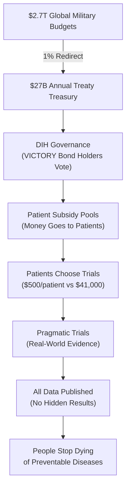

> **The 1% Treaty:** Every nation redirects just 1% of global military spending to fund 80X more efficient medical research, creating the most profitable investment in history while saving millions of lives.

 

## The Problem in Numbers

| What We Waste Money On | Annual Cost | What We Get |
|----------------|------------|-------------|
| War & Conflict | $9.7T | Destruction, refugees, and disabilities |
| Disease Burden | $109.1T | Suffering and lost potential |
| **Total Waste** | **$118.8T** | **The dumbest possible use of our limited resources** |
| **Medical Research** | **$0.068T** | Actual cures and treatments |

## The 1% Solution

We've created a system where:

1. **Nations redirect 1%** of military budgets to cure disease
2. **Patients get paid** to participate in clinical trials
3. **Research becomes 80x more efficient** using proven methods
4. **EVERYONE profits** from the $16.5T annual peace dividend

[How It Works](#how-it-works) | [The Math](#the-math) | [Get Involved](#join-the-war)

## Why This Works

✅ **Proven Model:** The Oxford RECOVERY trial showed we can run trials for $500 instead of $41,000 per patient  
✅ **Massive Leverage:** $1 in lobbying produces $1,813 in government contracts
✅ **Aligned Incentives:** Everyone gets rich by curing disease instead of killing people and  
✅ **No Losers:** Even partial success means 1% less war and nuclear bombs and more cures

## How It Works

### The Market Revolution in Medical Research

1. **Replace Central Planning**: NIH's Soviet-style committees → DIH's prediction markets and wisdom of crowds
2. **Amazon for Trials**: dFDA creates an open marketplace where treatments compete on real results, not lobbying
3. **Universal Integration**: One-click trial enrollment from any EHR, health app, or doctor's office
4. **80X Efficiency**: Market competition drives costs from $41,000 to $500/patient (Oxford proved it)
5. **Radical Transparency**: All data public, all results ranked - like Amazon reviews but for staying alive
6. **Pay for Success**: Researchers get rich by curing diseases, not by writing grant proposals

### Central Planning vs. Free Markets

**Current System (NIH/FDA Central Planning):**
- $2.2B per drug (committees pick losers)
- 17 years to market (bureaucracy moves at bureaucracy speed)
- 90% grant rejection rate (200 reviewers play god with $48B)
- 95% of diseases have 0 treatments (committees don't care about rare diseases)
- 15% patient access (gatekeepers everywhere)

**New System (DIH/dFDA Free Markets):**
- ~$27M per treatment (competition drives efficiency)
- 2-3 years to market (markets move at market speed)
- Fund everything, measure results (let data pick winners)
- 1,000X more treatments tested (markets find every niche)
- 100% patient access (Amazon doesn't turn away customers)

## The Math

### Investment Required vs. Returns

**Total Implementation Cost:** $1.2-2.5B over 36 months

**Annual Returns Once Operational:** $27B+ per year from 1% military budget redirections

**The Math:** We're asking for $2.5B to redirect $27B annually. That's a 10:1 return ratio - better than most venture capital investments, except this one saves millions of lives.

## The Plan: From Idea to Treaty

1.  **Prove the Mandate (The Global Referendum):** We will mobilize 3.5% of humanity (280 million people) through a global referendum. This creates an undeniable political mandate that no leader can ignore.

2.  **Fund the Mission (VICTORY Bonds):** We will raise the required $2.5B by selling **VICTORY Bonds**—an investment vehicle designed to offer ~40% annual returns, making peace more profitable than war.

3.  **Ratify the Treaty:** With a clear public mandate and a powerful financial engine, we will co-opt the existing political system to ratify the 1% Treaty and begin redirecting funds.

## Join the War on Disease

- **[Participate in the Referendum](mailto:hello@dih.earth)**: Signal your support and become part of the 3.5%.
- **[Join the Coalition](mailto:hello@dih.earth)**: We partner with institutions, companies, and non-profits.

## Book Outline

> **This is the complete skeleton of the book showing the exact narrative structure.**
>
> **Hierarchy:**
> - **Parts** = Major thematic sections (I, II, III, etc.)
> - **Chapters** = Main arguments/topics (1, 2, 3, etc.)
> - **Sections** = Key points within chapters (1.1, 1.2, etc.)
> - **Subsections** = Supporting details (1.1.1, 1.1.2, etc.)
>
> **Format:** "[Core Concept]: [Dark Humor Description]" for memorability
>

### Part I: The Problem (Everyone You Love Is Dying While We Build Better Bombs)

#### Chapter 1: The $119 Trillion We Waste on Killing Ourselves
*   1.1 [Evolutionary Trap: Why Your Brain Wants You Dead](./brain/book/problem/the-evolutionary-trap.qmd)
*   1.2 [The Cost of War: Humanity's Most Expensive Hobby](./brain/book/problem/cost-of-war.qmd)
*   1.3 [The Cost of Disease: A Slow-Motion Apocalypse](./brain/book/problem/cost-of-disease.qmd)

#### Chapter 2: Central Planning Kills (Whether Soviet or American)
*   2.1 [The NIH: How Soviet-Style Science Wastes $48B/Year](./brain/book/problem/nih-funding-is-broken.qmd)
*   2.2 [The FDA: Killing You Safely Since 1962](./brain/book/problem/fda-approvals-are-broken.qmd)
*   2.3 [Regulatory Capture: How Pharma and Lockheed Bought Your Government](./brain/book/problem/regulatory-capture.qmd)

#### Chapter 3: Why Democracy Can't Fix This (Public Choice Theory)
*   3.1 [Democratic Failure: Why 535 People Can't Fix 335 Million Problems](./brain/book/problem/democracy-is-broken.qmd)
*   3.2 [Reform History: A Century of Reasonable Ideas That Failed](./brain/book/problem/why-reforms-failed.qmd)

### Part II: The Solution (Bribe Everyone Until They Stop Killing People)

#### Chapter 4: The 1% Treaty (Trading Murder Money for Medical Miracles)
*   4.1 [Treaty Design: How to Redirect $27B Without Starting Wars](./brain/book/solution/1-percent-treaty.qmd)
*   4.2 [Treaty Enforcement: Making Countries Keep Their Promises](./brain/book/solution/treaty-enforcement.qmd)

#### Chapter 5: The Market Revolution in Medical Research
*   5.1 [Decentralized Institutes (DIH): The Money Router That Replaces Committees](./brain/book/solution/dih.qmd)
    *   5.1.1 [Money Flow: Treaty → DIH → Patients → Cures](./brain/book/solution/dih-money-flow.qmd)
    *   5.1.2 [VICTORY Bond Governance: Investors Vote, Not Bureaucrats](./brain/book/solution/dih-governance.qmd)
    *   5.1.3 [Insurance Model: Why We're Not "Paying Patients"](./brain/book/solution/dih-insurance-model.qmd)
*   5.2 [Decentralized FDA (dFDA): Amazon for Clinical Trials](./brain/book/solution/dfda.qmd)
    *   5.2.1 [Outcome Labels: Like Nutrition Labels But For Not Dying](./brain/book/solution/dfda-outcome-labels.qmd)
    *   5.2.2 [Treatment Rankings: Prescribing the Optimal Treatment Based on the Universe of Data Instead of Vague Intuition](./brain/book/solution/dfda-treatment-rankings.qmd)
    *   5.2.3 [Global Registry: Every Treatment, Every Result, No Hiding](./brain/book/solution/dfda-registry.qmd)
    *   5.2.4 [Digital Twin Safe: Sharing Health Data Anonymously](./brain/book/solution/dfda-digital-twin.qmd)
    *   5.2.5 [FDAi Agent: Free 24/7 AI Doctor (Powered by 8 Billion Twins)](./brain/book/solution/dfda-ai-doctor.qmd)

#### Chapter 6: Governance That Actually Works
*   6.1 [Wishocracy: Democracy Using Tinder Logic](./brain/book/solution/wishocracy.qmd)
*   6.2 [Procurement: Why Prizes Beat Cost-Plus Contracts](./brain/book/solution/procurement-revolution.qmd)

### Part III: The Theory and The Money (Why This Works and Makes Everyone Rich)

#### Chapter 7: Why Markets Save Lives and Committees Kill
*   7.1 [Public Choice Theory: Everyone's a Selfish Bastard (And That's Good)](./brain/book/theory/public-choice-framework.qmd)
*   7.2 [Concentrated Benefits: Why Defense Contractors Always Win](./brain/book/theory/concentrated-benefits.qmd)
*   7.3 [The Knowledge Problem: 8 Billion Brains Beat 200 Bureaucrats](./brain/book/theory/hayek-knowledge-problem.qmd)
*   7.4 [Biology Is Engineering: Your Body Is Just a Meat Robot](./brain/book/proof/body-as-repairable-machine.qmd)

#### Chapter 8: The Investment Opportunity of the Century
*   8.1 [VICTORY Bonds: War Profiteering But For Peace](./brain/book/economics/victory-bonds.qmd)
*   8.2 [The Returns: Why 40% Annual Is Conservative](./brain/book/economics/economic-impact-summary.qmd)
    *   8.2.1 [Peace Dividend: $92B from 1% Less War](./brain/book/economics/1-percent-treaty-peace-dividend-analysis.qmd)
    *   8.2.2 [Trial Efficiency: 463:1 ROI from Competition](./brain/book/economics/dfda-roi-breakdown.qmd)
    *   8.2.3 [Market Allocation: Why Crowds Beat Committees](./brain/book/economics/dih-market-returns.qmd)
    *   8.2.4 [Total Impact: $16.5T Annual Value Creation](./brain/book/economics/total-economic-impact.qmd)
*   8.3 [Risk Analysis: Why This Beats Venture Capital](./brain/book/economics/investor-risk-analysis.qmd)

### Part IV: The Implementation (How to Actually Pull This Off)

#### Chapter 9: How to Steal $27 Billion Dollars
*   9.1 [Co-option Strategy: Buying the Military-Industrial Complex](./brain/book/strategy/co-opt-dont-compete.qmd)
*   9.2 [Global Referendum: Getting 3.5% of Humanity to Click Yes](./brain/book/strategy/global-referendum.qmd)
*   9.3 [Legal Bribery: How to Buy Politicians Without Prison](./brain/book/strategy/legal-compliance-framework.qmd)
*   9.4 [Fundraising: The $2.5B Bootstrap Fund](./brain/book/strategy/fundraising-strategy.qmd)

#### Chapter 10: The Execution Playbook
*   10.1 [Executive Action: Bypassing Congress Legally](./brain/book/strategy/dfda-implementation-via-executive-action.qmd)
*   10.2 [Free Rider Solution: Making Individual Incentives Beat National Interests](./brain/book/strategy/free-rider-solution.qmd)
*   10.3 [Integration Strategy: Making Big Tech Build Our Infrastructure](./brain/book/strategy/integration-strategy.qmd)

### Part V: The Evidence (This Already Works)

#### Chapter 11: Historical Proof Markets Beat Planning
*   11.1 [RECOVERY Trial: How Oxford Cured COVID for $500/Patient](./brain/book/proof/recovery-trial.qmd)
*   11.2 [Pre-1962: When Doctors Decided, Not Bureaucrats](./brain/book/proof/pre-1962-golden-age.qmd)
*   11.3 [Citizen Movements: How We Banned Landmines, Can Ban Disease](./brain/book/proof/historical-precedents.qmd)
*   11.4 [Case Studies: Diseases We Could Cure Tomorrow](./brain/book/proof/case-studies.qmd)

### Part VI: The Future (Pick Your Dystopia)

#### Chapter 12: Choose Your Own Adventure
*   12.1 [Path A: AI Overlords + Cancer + Nuclear Winter](./brain/book/futures/dystopia-skynet-wins.qmd)
*   12.2 [Path B: Live to 150 and Complain About Being Bored](./brain/book/futures/utopia-health-and-happiness.qmd)

### Part VII: Call to Action (Join or Die, Literally)

#### Chapter 13: What You Do Now
*   13.1 [Sign the Referendum: Your Click Saves Lives](./brain/book/call-to-action.qmd#referendum)
*   13.2 [Buy VICTORY Bonds: 40% Returns Beat Dying](./brain/book/call-to-action.qmd#bonds)
*   13.3 [Spread the Word: Make This Viral (The Good Kind)](./brain/book/call-to-action.qmd#spread)

#### Chapter 14: Objection Handling
*   14.1 [Common Objections: Why They're All Wrong](./brain/book/objections/all-objections.qmd)

### Appendix: Supporting Evidence

*   A.1 [FAQ: Quick Answers for Skeptics](./brain/book/reference/faq.qmd)
*   A.2 [Financial Models: The Math That Proves It Works](./brain/book/reference/financial-models.qmd)
*   A.3 [References: Citations for Academics](./brain/book/references.md)
