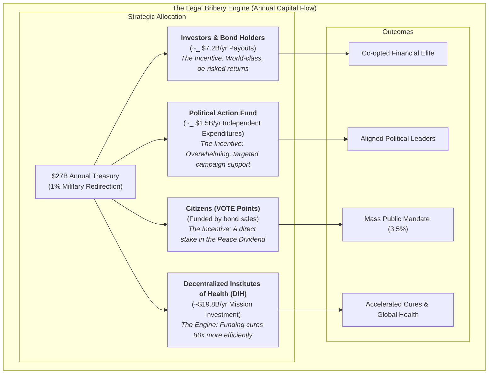

War is incredibly stupid. It costs humanity over [$16.5 trillion/year](#global-violence-costs) in lost productivity, healthcare costs, property damage, environmental destruction, and other related expenses.

Yet, we spend [$2.72 trillion](#sipri-2024-spending) per year on this idiocy.

All the while, death and disease are slowly destroying the lives of you and everyone you love. Yet we spend 40X less ([$67.5 billion](./reference/global-government-medical-research-spending.md)) on discovering cures for all diseases combined.

Therefore, the **BEST IDEA IN THE WORLD** is for humanity to stop wasting its scarce resources on ever-increasing its capacity for self-destruction and instead use those resources to help the billions of people suffering from disease.

However, as this makes far too much sense for governments to ever implement, the **SECOND BEST IDEA IN THE WORLD** is for humanity to redirect just 1% of the $2.7 trillion currently allocated to death and destruction to curing diseases.

### But how do we do it?

**The Plan:** legally bribe the shit out of literally everyone to get every nation in the world to ratify a "[1% Treaty](./strategy/1-percent-treaty/1-percent-treaty.md)" that redirects 1% of military spending to a global [Decentralized Institutes of Health (DIH)](./strategy/1-percent-treaty/decentralized-institutes-of-health.md) where funding is decided by patient choice and need by subsidizing their participation in "pragmatic clinical trials" that are [80X more efficient](./reference/recovery-trial.md) than standard trials.

**How it works:** Make curing disease more profitable than war.

For every $1 the military-industrial complex spends on lobbying politicians, it receives over [$1,813 in government contracts](#lobbying-roi-calc). So why couldn't a **Peace-Industrial Complex** do the same thing?

Getting the 1% Treaty passed will require:

- A global referendum showing support from at least [3.5% of the population](#3-5-rule) of each nation.
- Extensive lobbying (using the existing military-industrial complex political apparatus).

This effort will likely cost between [\$1 billion and \$2.5 billion](./economic-models/fundraising-and-budget-plan.md).

### Q: How do we get \$2 billion and persuade the military industrial complex to help?

**A: Create the most profitable investment vehicle in the world.**

We create a **1% Treaty Fund** to finance the War on Disease by selling **[VICTORY bonds](./strategy/1-percent-treaty/victory-bonds-tokenomics.md)** just like the US did to finance WW2—except our bonds are designed to deliver world-class returns while funding the cure for disease.

The military industrial complex is composed of humans that are not evil, they just like money. So we offer **[VICTORY bonds](./strategy/1-percent-treaty/victory-bonds-tokenomics.md)** to anyone with the ability to influence the ratification of the 1% treaty by any particular nation.

**The result:** Everyone gets richer by funding cures instead of destruction.

---

# II. THE PROBLEM

## The Grotesque Misallocation of Human Resources

Governments spend **[\$2.72 trillion](https://www.sipri.org/publications/2025/sipri-fact-sheets/trends-world-military-expenditure-2024)** on military and **[\$67.5 billion](./reference/global-government-medical-research-spending.md)** on finding cures for diseases. That's a **40X disparity**.

The Pentagon alone [can't account for \$2.5 trillion](#pentagon-unaccounted-2-5t) in assets—250 times larger than what we're asking them to redirect. **They lose more money by accident than we need to cure cancer.**

We haven't eradicated a single disease in [over 50 years](#smallpox-eradicated). Meanwhile, we have [enough nuclear bombs to kill all of humanity twice](#nuke-winter-150tg).

In our evolutionary past, when resources were scarce, violence was necessary for survival. But today we live in a world with enough food for everyone. In fact, nearly all starvation today is actually the RESULT of violent conflict.

## Why Good Intentions Have Failed

For centuries, we've known war brings suffering. Yet we fund it anyway. Why?

Military contractors earn billions. Politicians receive generous donations. The cycle continues. **Moral arguments have never been enough to overcome financial incentives.**

## The Existential Choice

So humanity has 2 paths:

1. Continue on a path of escalating conflict, risking self-inflicted extinction.
2. Engineer a new system that aligns our vast resources with our collective survival and well-being.

Pick one.

See [1% Treaty](./strategy/1-percent-treaty/1-percent-treaty.md) for quantified savings and ROI. For a detailed breakdown of direct and indirect costs of war, see [Quantified Costs of War](./reference/costs-of-war.md).

---

# III. THE SOLUTION (Simple & Clear)

## Our Answer: Legal Bribery for Peace

We will not change minds with morals. We will make curing people more profitable than killing them. We call this **Peace Profiteering**.

The core of the plan is a transparent, legally-compliant system of incentives that offers superior financial returns to every stakeholder—from citizens and politicians to military contractors and their investors. We will legally bribe our way to a better world with an offer that is too good to refuse because the math is overwhelmingly superior to the status quo.

## How We Fix It: The 5-Step Plan

**The Goal: Make curing people more profitable than killing them.**

**Step 1:** Give everyone on Earth a stake in the outcome. Reward every person who votes on the global referendum with **VOTE points**—your verifiable claim to a share of the [$16.5 trillion annual peace dividend](./economic-models/peace-dividend-value-capture.md) you help create (see [Legal Compliance Framework](./strategy/legal-compliance-framework.md)).

**Step 2:** When we hit [3.5% of humanity](#3-5-rule), we have proof the world wants this.

**Step 3:** After the treaty is ratified, VOTE points become convertible to VICTORY bonds—your earned ownership and governance stake in the **$27B+ annual health treasury** you helped create by redirecting global military spending (see [VICTORY Bonds — Incentive Mechanics](./strategy/1-percent-treaty/victory-bonds-tokenomics.md)).

**Step 4:** Build a legal political engine: independent‑expenditure committees that pledge massive support for candidates who vote with their district's referendum result—and fund challengers against those who defy it.

**Step 5:** The treasury funds EVERYONE in health - universities, pharma, nonprofits, government agencies - through democratically controlled funding pools.

---

## Ready to Join?

The full plan is detailed below. But if you're already convinced, here's how you can get involved now:

- **Invest in the Solution:** [Buy VICTORY Bonds](./strategy/1-percent-treaty/victory-bonds-tokenomics.md) to fund the mission and target a >40% CAGR.
- **Show Your Support:** [Sign the Global Referendum](#) to help build the 3.5% mandate.
- **Partner with Us:** [Contact our institutions team](#) to see how your organization can benefit.

---

# IV. THE FINANCIAL ENGINE (Why This Works)

## VICTORY Bonds: Bootstrap Funding Model

**[VICTORY Bonds](./strategy/1-percent-treaty/victory-bonds-tokenomics.md):** Bootstrap funding now, repaid by treaty inflows.

Our financing is governed by two core, transparent principles that ensure a fair balance between rewarding investors and fulfilling our mission:

1. **The Target Return Principle (The "Ceiling"):** We aim to deliver the world's best risk-adjusted return, targeting a **~40% compound annual growth rate (CAGR)** (~28x over 10 years) for our early investors.
2. **The Mission Guarantee Principle (The "Floor"):** To protect our ultimate goal, annual investor payouts will **never exceed 50% of the DIH's total annual income.**

The model is designed to **front-load investor returns**, paying out the target amount (~$7.23B per year in the full success scenario) as quickly as treaty inflows allow. The 40% CAGR represents the total 10-year return, while the large year-one payout reflects our strategy of rapidly de-risking the investment for our partners.

## The DIH Treasury: 80X More Efficient Research

**[Decentralized Institutes of Health (DIH)](./strategy/1-percent-treaty/decentralized-institutes-of-health.md):** A treasury that funds research 80X cheaper. The DIH doesn't fund the [old, broken system](./problems/problems-in-clinical-research.md)—it funds a **decentralized FDA (dFDA) protocol** with proven results:

- **[80X Greater Efficiency](./reference/recovery-trial.md):** The dFDA model cuts per-patient trial costs from [$41,000](#trial-cost-41k) to as low as [$500](#recovery-cost-500), an 80X efficiency gain **already proven** by the [Oxford RECOVERY trial](./reference/recovery-trial.md), which saved over 1 million lives globally.
- **[$50 Billion in Annual Savings](./economic-models/dfda-cost-benefit-analysis.md):** By making research cheaper and faster, the dFDA protocol is projected to save the global R&D industry ~$50 billion annually—**based on actual performance data, not projections**.
- **[840,000+ Extra Years of Healthy Life](./economic-models/dfda-cost-benefit-analysis.md):** The protocol is projected to generate over 840,000 extra years of healthy life annually through faster drug access and new therapies—**scaling proven results, not theoretical models**.

**Specialized programs fund existing institutions:**

- Decentralized Institute of Mental Health → funds universities, pharma, nonprofits working on depression, anxiety, etc.
- Decentralized Institute of Cancer Research → funds MD Anderson, pharmaceutical companies, patient advocacy groups
- Decentralized Institute of Aging → funds longevity research at every institution

**Everyone gets more money, powered by a system that actually works. No one gets displaced.**

## Investment Required vs. Returns

**Total Implementation Cost:** $1.2-2.5B over 36 months

**What This Buys:** For a detailed breakdown of our multi-phase fundraising strategy and a line-item budget, see our full [Fundraising & Budget Plan](./economic-models/fundraising-and-budget-plan.md).

- Global referendum "Proof-of-Vote" points platform (~$5-10M)
- Independent expenditures in priority elections (~$800M-1.5B)
- Targeted legal bribes to co-opt the MIC (~$100-200M)
- Protocol development and pilot programs (~$250-400M)
- Legal compliance and treaty framework (~$100-200M)

**Annual Returns Once Operational:** $27B+ per year from 1% military budget redirections

**ROI Timeline:** 18-36 months after first treaty ratification

**Break-even Analysis:** Even in a conservative partial success scenario where only the **US, EU, & UK** participate (generating **$13B annually**), the system generates a **cash payout of $6.5B (2.6X the initial $2.5B investment)** in the first year of operation alone.

**The Math:** We're asking for $2.5B to redirect $27B annually. That's a 10:1 return ratio - better than most venture capital investments, except this one saves millions of lives.

This simple model ensures that even in conservative scenarios, the DIH remains massively well-funded while providing returns that beat the best hedge funds. For a complete breakdown, see our [Dynamic Cash Flow Model](./economic-models/dih-treasury-cash-flow-model.md).

---

# V. THE BRIBERY STRATEGY (How Everyone Wins)

## The Core Strategy: Co-opt, Don't Compete

**We don't compete with the military-industrial complex. We co-opt them.**

Our entire thesis is engineered to offer military contractors and politicians a better deal, turning today's **War Contractors** into tomorrow's **Peace Contractors**.

**Current Military Contractor Economics:**

- [$1.1 billion lobbying](#lobbying-1-1b) (2001-2021) → [$2.02 trillion contracts](#contracts-2-02t)
- **Return: $1,813 per $1 spent on lobbying**
- Politicians get modest campaign donations and revolving door jobs

## Activation Energy Sequence: Who We (legally) Bribe First

**Phase 1: Seed Investors ($250-400M Initial Investment)**

- **Who:** Wealthy individuals, funds, Anchor Investors
- **The Bribe:**
  - **Targeting a >40% CAGR (~28x Return):** Our financial model is engineered to deliver a risk-adjusted return superior to the world's most elite investment funds (e.g., Renaissance Medallion Fund's ~39% CAGR). Payouts are governed by two clear principles: a target to deliver a ~28x return to early investors, and a guarantee that at least 50% of annual income is always reserved for our health mission. See our [Investment Thesis](./economic-models/victory-bond-investment-thesis.md) and [Cash Flow Model](./economic-models/dih-treasury-cash-flow-model.md).
  - **VICTORY bonds** that grant governance control over the $27B annual DIH treasury.
  - **De-Risked Investment:** Initial funds are protected by an [Assurance Contract](./economic-models/fundraising-strategy.md), guaranteeing a full refund if fundraising goals are not met.

**Phase 2: VICTORY Bond Buyers ($100-200M Referendum Funding)**

- **Who:** Early Backers, health advocates, institutions
- **The Bribe\*:**
  - VICTORY bonds representing earned ownership of real economic value created by the [peace dividend](./economic-models/peace-dividend-value-capture.md)
  - Governance control over $27B annually in captured value from military budget redirection
  - Voting rights on patient subsidies and research funding allocation
  - Bond value backed by actual treasury growth from treaty implementation ($0 → $27B)

**Phase 3: Citizens (Global Population)**

- **Who:** Global population (targeting 3.5% = 280M people)
- **The Bribe:** A large grant of **VOTE points** for each referendum vote—your verifiable claim to real economic value you help create. These represent your earned share of the [$16.5 trillion annual peace dividend](./economic-models/peace-dividend-value-capture.md) unlocked by redirecting military spending, convertible to **VICTORY bonds** after the 1% Treaty is ratified.

**Phase 4: Politicians ($800M-1.5B Independent Expenditures)**

- **Who:** Key legislators in target countries
- **The Bribe\*:**
  - **Personal Wealth Creation:** Early access to [VICTORY Bonds](./economic-models/victory-bond-investment-thesis.md) with superior returns designed to outperform defense stocks and traditional political corruption
  - **Campaign Dominance:** Massive campaign support for treaty supporters, equivalent opposition funding for defectors
  - **Family Security:** Their families get diseases too—profit from funding cures rather than weapons

## Superior Offers to Key Stakeholders

**Our Superior Offer to Military Contractors:**

1. **They Make More Money:** Direct investment in VICTORY bonds with >40% CAGR beats all alternative investment options
2. **They Get Better Security:** A healthier, more stable world is safer than one with overkill capacity creating existential risk
3. **They Protect Their Families:** Their families get diseases too. Hence, they'd be better off profiting from funding cures rather than bombs
4. **Repurpose Their Lobbyists:** Instead of hiring new lobbyists, we legally bribe them with superior returns to get their existing lobbying apparatus to push for the treaty

**Our Superior Offer to Politicians:**

- **Personal Investment Opportunity:** Politicians and their families can directly invest in [VICTORY Bonds](./economic-models/victory-bond-investment-thesis.md) designed to outperform any alternative investment, including defense stocks
- **Campaign Dominance:** Massive independent expenditure support for treaty supporters; equivalent opposition funding for defectors (no coordination)
- **Electoral Insurance:** The [3.5%](#3-5-rule) public mandate makes supporting the treaty the politically safer choice
- **Political Insurance:** A new, highly popular policy platform that lets politicians claim credit for curing diseases and extending lifespans

**The Compounding Effect:** Each phase funds the next. Seed investors control governance of $27B treasury. Bond buyers fund the referendum. Citizens create electoral pressure. Politicians pass treaties. Everyone gets paid more than they could anywhere else.

**The Math:** We offer everyone more personal wealth than the current system, PLUS better campaign support, PLUS the moral high ground of saving lives, PLUS reduced existential risk. When the math favors peace, rational actors choose peace.

**Bottom Line:** By making peace and health more profitable than war and disease, we give every rational actor a clear financial incentive to support the treaty. We legally bribe our way to a better world.

---

# VI. PROOF & PRECEDENTS (Why This Isn't Insane)

## Why This Actually Works

**"A $2.5B investment to capture $27B annually? Come on."**

Fair skepticism. Here's why the math actually works:

**1. We're Redirecting Waste, Not Raising New Money**

- The Pentagon [cannot account for $2.5 trillion](#pentagon-unaccounted-2-5t) in existing assets—our US ask is 0.4% of their unaccounted waste
- This isn't "find new money"—it's "stop losing the money you already have"
- Global military waste is the largest pool of misallocated capital on the planet

**2. The 80X Efficiency Gain Is Already Proven**

- Oxford RECOVERY trial: [$500 per patient vs. $41,000 traditional](#recovery-cost-500)—saved over 1 million lives globally
- NIH RECOVER: [$1.6 billion, zero completed trials in 4 years](./reference/recovery-trial.md)
- **This isn't theoretical. The efficiency gain already happened and saved millions.**

**3. Mass Political Mobilization Works**

- [3.5% mobilization has never failed](#3-5-rule) in recorded history (Chenoweth, Harvard)
- War bonds: [$185 billion raised from 85 million Americans](#wwii-war-bonds) during WWII
- Our referendum creates the largest political mandate in human history—when 280 million people vote for something, politicians listen

**4. Financial Enforcement Is Stronger Than Legal Enforcement**

- [$16.5 trillion annual cost of violence](#global-violence-costs)—we capture 0.16% of this waste
- Leaders of nations that default face immediate political consequences. Our enforcement mechanism is not international law, but overwhelming, targeted campaign support for compliant leaders and against defectors.
- This political and financial alignment provides stronger enforcement than any international court.

**5. We Co-opt Rather Than Compete**

- Military contractors' current ROI: [$1,813 per $1 spent on lobbying](#lobbying-roi-calc)
- Our offer: >40% CAGR bonds + governance of $27B treasury + personal wealth creation
- **When peace pays better than war, rational actors choose peace**

**The Bottom Line:** We're not creating money out of thin air. We're redirecting money that's already being wasted into a system that produces 80X better results with mathematical precision.

## Historical Precedents (Why This Playbook Wins)

- Decentralized coalitions can create binding law: the International Campaign to Ban Landmines led to the 1997 Ottawa Treaty (see [ICBL](#icbl-ottawa-treaty)).
- Mobilizing private capital for public missions works: [World War II war bonds](#wwii-war-bonds) financed national efforts at scale.
- New global health institutions can marshal billions effectively: the [Global Fund to Fight AIDS, Tuberculosis and Malaria](#global-fund) proves rapid, coordinated international funding is achievable.

## Why 1% Less Military = More Security

**Modern weapons make everyone less safe:**

- Nuclear weapons: [1% fewer = ~120 fewer nukes worldwide](#world-warheads)
- AI weapons systems: Reduce global AI arms race escalation
- Cyber warfare tools: Less proliferation of attack capabilities

**Real security threats are health-based:**

- [Pandemics kill more people than wars](#pandemics-vs-wars) (COVID-19: 7M+ deaths vs. annual conflict deaths ~100K)
- Antibiotic resistance could kill [10M/year by 2050](#amr-10m-2050)
- [Mental health crises destabilize societies](#mental-health-burden) more than foreign armies

**1% reallocation = stronger nations:**

- Healthier populations are more productive
- Medical breakthroughs boost economic competitiveness
- Reduced healthcare costs free up MORE budget for military spending if needed

### The Ultimate Failsafe: The Worst-Case Scenario is Still a Win

Even if the Decentralized Institutes of Health were a completely inefficient failure and dumped every single dollar into the ocean, the world would _still_ be better off.

Why?

Because we would still have **1% fewer nuclear weapons**. We would still have a **1% slower AI arms race**. We would still have a **1% reduction in the global capacity for organized violence.**

The worst possible outcome of this plan—total waste—is still a net gain for global security. The best possible outcome is that we also cure cancer.

### The Peace Dividend: The Economic Engine of Victory

The financial power of this model comes from capturing the first, tangible portion of the **$16.5 trillion annual "Cost of Violence"**—the single largest pool of misallocated capital on the planet.

- **The Captured Dividend:** We redirect **$27 billion annually** from military spending to health. This tangible cash flow is the _captured_ portion of the Peace Dividend that directly backs our financial instruments.
- **The Societal Dividend:** By reducing global conflict drivers by 1%, our intervention unlocks a much larger prize for the world. A 1% reduction of the $16.5T Cost of Violence equates to **$165 billion in annual economic value** returned to society through increased stability and productivity.

We capture the first $27B to unlock the full $165B for everyone. For a detailed breakdown, see [The Peace Dividend: Value Capture & Distribution Model](./economics/peace-dividend-value-capture.md).

---

# VII. OBJECTIONS & RESPONSES

## Why This Isn't Completely Insane

**1. "This sounds like an illegal bribe."**

- **Reality:** The current system of "legal" lobbying is a slow, inefficient bribe that produces war, disease, and existential risks like nuclear apocalypse or Skynet. Our transparent incentives produce peace, health, and human flourishing. In a world where leaders fund campaigns with crypto and sell access, we're applying market realities to save lives. The consequentialist math is clear: continued misallocation leads to preventable deaths, destruction, and possible extinction. Our "soul" is in the outcome: preventing that fate by making healing more profitable than killing.

**2. "A global referendum is not a real protest. It's a flawed analogy."**

- **Reality:** A cryptographically secure, on-chain list of 280 million verified supporters is not an "analogy"; it is the largest, most powerful political mandate in human history. It is a direct threat to the power of traditional media and captured political parties. It is a political entity in its own right, capable of swinging elections and forcing change. Clicks on a screen are the new boots on the ground.

**3. "A government's promise to pay is unenforceable. This is a fantasy."**

- **Reality:** See [Why This Actually Works](#why-this-actually-works) → Financial enforcement is not based on courts, but on creating direct political and financial consequences for individual lobbyists and leaders who defy the mandate from their citizens.

**4. "This is too operationally complex to build."**

- **Reality:** We're assembling proven components, not inventing new technology. DAOs like [MakerDAO](#makerdao-scale) already manage billions securely. See [Security & Anti-Corruption](#security--anti-corruption-building-uncorruptible-institutions) for detailed implementation.

**5. "This is politically impossible - you can't just redirect military budgets by referendum"**

- **Reality:** Military budgets are redirected all the time through political pressure. The question isn't whether it's possible, but whether we can generate enough pressure. The [\$7T fossil fuel subsidy proof-of-concept](#fossil-fuel-subsidies) shows that massive economic reallocation is achievable when the right incentives align. We're not asking for unilateral disarmament - we're asking all nations to move 1% together, maintaining relative power balances.

**6. "The 3.5% rule applies to civil resistance movements, not global online referendums"**

- **Reality:** See [Why This Actually Works](#why-this-actually-works) → Mass participation creates political legitimacy regardless of format. 280 million verified supporters create an unignorable political mandate with electoral consequences.

**7. "Independent expenditures don't work against entrenched incumbents with deep pockets"**

- **Reality:** Independent expenditures work when they're massive and targeted. We're not competing dollar-for-dollar with military contractors - we're creating a system where supporting the treaty becomes the politically safer choice than opposing it. When 3.5% of humanity has voted for this, opposing it becomes electoral suicide.

**8. "You're competing with military contractors who have decades of relationships and influence"**

- **Reality:** See [How We Co-opt the Military-Industrial Complex](#how-we-co-opt-the-military-industrial-complex) above. We don't compete—we offer superior returns and co-opt their existing networks. For detailed analysis, see [Co-Opting Defense Contractors](./strategy/co-opting-defense-contractors.md).

**9. "How do you prevent waste and ensure the money actually helps patients?"**

- **Reality:** The decentralized FDA uses [decentralized pragmatic trials that cost \$500 per patient vs. \$41,000 traditional trials](./reference/recovery-trial.md) - an 80X efficiency improvement proven by the Oxford RECOVERY trial. Compare this to the NIH RECOVER initiative: \$1.6B budget, \$53,333 per patient, zero completed trials in 4 years. With the same \$1.6B budget, the dFDA could run 2,800 trials enrolling 2.8 million patients vs. NIH's zero completed trials. The evidence is overwhelming: decentralized pragmatic trials deliver 80X more patients treated per dollar spent.

**10. "How does this help patients vs. just funding more bureaucracy?"**

- **Reality:** The dFDA flips the funding model on its head. Instead of grants going to institutions, the money follows the patient. Funding is allocated as direct subsidies for patients to enroll in eligible clinical trials. While a transparent algorithm helps prioritize trials based on metrics like disease burden, **patients make the final decision.** Researchers and institutions only get paid when patients choose to join their study. This creates a competitive marketplace where the best, most impactful research attracts funding directly from the people it aims to help.

**11. "What about the millions of jobs in the defense industry? This is a threat to their livelihoods."**

- **Reality:** This is not about cutting productive jobs; it's about redirecting a tiny fraction of the budget that is currently lost to waste and transforming it into a new engine for job creation. The U.S. contribution to this plan, for example, is equivalent to less than 0.5% of the trillions the Pentagon already cannot account for—money that isn't funding jobs productively right now. We propose investing that waste into the high-growth job sector of the future. The same brilliant engineers building guidance systems can build next-generation medical imaging devices. The same logistics experts managing military hardware can manage supply chains for delivering trial medications. This is a net job creator, transitioning our most valuable human capital from a cycle of waste to an industry of creation and healing.

**12. "This plan feels anti-military and disrespectful to the soldiers who protect us."**

- **Reality:** This initiative deeply respects the service and sacrifice of individual soldiers. Our criticism is aimed at a budgetary system that fails them. When trillions of dollars are unaccounted for, that is money that isn't buying better equipment, training, or support for our troops in the field. We propose redirecting a fraction of that waste to protect soldiers and their families from the threats that are far more likely to harm them, like pandemics, antibiotic resistance, and chronic disease. This is about retooling our national security to _truly_ protect our protectors and the nation they serve.

**13. "Aren't blockchains environmentally disastrous? How can you save humanity while boiling the oceans?"**

- **Reality:** This is a valid concern based on early blockchain technology. However, the DIH will be built on modern, energy-efficient **Proof-of-Stake (PoS)** consensus mechanisms, which consume over 99.9% less energy than their Proof-of-Work predecessors. Our commitment to global health includes planetary health; our technical architecture will reflect this.

**14. "The crypto world is full of scams. Why should we trust a plan built on such a risky foundation?"**

- **Reality:** We're not creating speculative assets—we're using battle-tested financial infrastructure for transparency and corruption resistance. See [Security & Anti-Corruption](#security--anti-corruption-building-uncorruptible-institutions) for our proven approach using technologies that already secure billions.

**15. "What stops a few billionaires from buying up all the bonds and seizing the treasury?"**

- **Reality:** This is a critical design challenge for any decentralized system. To prevent plutocratic capture, the DIH governance model will incorporate proven mechanisms for equitable voting. This includes **quadratic voting**, where the cost of each additional vote increases, making it prohibitively expensive for any single entity to dominate. We may also implement identity-based systems that grant voting power based on reputation and participation, not just capital. The goal is a system governed by its active stakeholders, not just its wealthiest ones.

**16. "Why not just rely on philanthropy?"**

- **Reality:** Relying on donations would force us to compete with the very ecosystem we aim to support. Philanthropy is a finite, zero-sum game. A massive fundraising campaign for the DIH would inevitably cannibalize the existing pool of donations, effectively stealing funds from the thousands of vital health charities already doing critical work. This would harm the cause, not help it. Our goal is not to reshuffle a small pot of charitable giving—it is to tap into the multi-trillion dollar firehose of government spending. Furthermore, philanthropy treats the symptoms of a broken system. It doesn't change the underlying political-economic incentives that perpetuate the problem. We are not just trying to fund more research; we are trying to permanently shift the global allocation of capital and talent from destruction to creation. Only a systemic reallocation can achieve that.

**17. "Why redirect military spending? Why not just increase the health budget?"**

- **Reality:** This is not about nominal dollar figures; it is about the **real allocation of a finite pie of resources**. The world's top scientists, engineers, and manufacturing capacity are a limited resource. What matters is not the absolute dollar amount spent on health, but the _percentage_ of our collective talent and capital dedicated to it, as this is the true surrogate for resource allocation. If we simply "increase health spending" by 10% through new appropriations, but the central bank also expands the money supply and the military budget grows by 10%, **no real resources have been shifted**. It's an inflationary wash. The same scientists and factories will continue to build weapons because that's where the larger share of the economic pie remains. A **direct, treaty-bound reallocation** is the only mechanism that forces a true shift of these finite resources. By cutting 1% from military budgets, we are not just moving dollars; we are freeing up the physicists, data scientists, and supply chains that were serving the military-industrial complex and making them available to cure Alzheimer's. This is how you change the game.

**18. "Why cut military if others won't?" (Free Rider Problem)**

- **Why This Objection is Overstated:** The US already can't account for **$2.5 trillion** in assets—more than 250 times the $10 billion annual US contribution to this plan. Redirecting 1% is trivial compared to existing waste. Other nations' military spending is relatively small (US represents ~40% of global total). Even if holdouts don't comply, they won't catch up to US capabilities. Everyone has a price: We use massive legal incentives targeting personal financial gain to make compliance more profitable than defection.

- **Our Approach: Personal Financial Alignment Over Institutional Punishment:** Leaders are humans driven by personal financial self-interest, not abstract geopolitical strategy. We apply the same strategy we use with military contractors: **Personal Investment Opportunity** (Leaders and their families can invest in [VICTORY Bonds](./economic-models/victory-bond-investment-thesis.md) designed to offer mathematically superior returns to alternative investments), **Direct Financial Stakes** (We offer leaders opportunities to profit directly from the $27B annual treasury through legally compliant investment vehicles), **Family Security** (Leaders' families get diseases too—they can profit from a system that perpetuates risk, or profit _even more_ from one that funds cures), and **Political Insurance** (Massive independent expenditures ensure that supporting the treaty becomes the financially safer political choice).

- **Consequentialist Reality:** The alternative to this coordinated reallocation is continued escalation of nuclear arsenals (enough to produce ~150 Tg of stratospheric soot in a U.S.–Russia exchange—modeled to cause global famine and >5 billion deaths) and an AI arms race leading to potential Skynet scenarios. Partial compliance still reduces global destructive capacity while funding cures—better than the status quo of waste and existential risk. **Bottom Line:** Free-riding isn't viable when compliance pays better, and the stakes are human survival. For detailed mechanisms, see [Free Rider Solution](./strategy/free-rider-solution.md).

**19. "This violates election and securities law" (Legal Compliance)**

- **The Challenge:** Foreign nationals funding US elections is illegal; VICTORY bonds risk securities violations.

- **Our Solution:** [Strict legal segregation](./strategy/legal-compliance-framework.md) with expert oversight: **Complete entity separation** (Zero coordination between US and international operations), **Securities compliance** (Utility token structure with proper exemptions - Reg S, Reg A+), **Multi-jurisdiction strategy** (Separate legal entities and counsel in each country), and **Technical firewalls** (No shared systems, staff, or communication between entities).

- **Bottom Line:** Conservative structures with top lawyers solve this.

**20. "280M people can't be verified reliably" (Verification at Scale)**

- **The Challenge:** Stop fake votes across 280 million people.

- **Our Solution:** [Multi-layered verification](./strategy/verification-and-fraud-prevention.md) with AI monitoring: **Government ID integration** (Connect with national e-ID systems - Estonia, India, EU), **Biometric verification** (Liveness detection and proof-of-uniqueness partnerships), **AI fraud detection** (Real-time anomaly detection and behavioral analysis), and **Cryptographic verification** (End-to-end verifiable voting with zero-knowledge proofs).

- **Bottom Line:** We use proven technologies that already verify millions of users globally.

**21. "Isn't this just illegal bribery of leaders?"**

- **Direct Answer:** No—we're transparent about using overwhelming legal incentives to align leaders' interests with global health, because the alternative is continued arms races leading to potential human extinction via nuclear winter (a U.S.–Russia exchange is modeled to loft ~150 Tg soot and cause global famine with >5 billion deaths) or AI catastrophe. If "straight-up" rewards are needed for specific leaders, we structure them as performance-based diplomatic grants or economic development packages tied to verifiable treaty compliance—fully compliant with anti-corruption laws like the FCPA.

- **Why This Works Legally and Ethically:** **Legal Framework** (All incentives flow through independent entities with no quid-pro-quo; modeled on existing diplomatic aid packages like US provides $3.8B annual aid to Israel tied to security cooperation), **Consequentialist Justification** (When misallocated military spending already wastes trillions - Pentagon lost $2.5T - redirecting 1% via incentives saves lives and reduces existential risks, far more ethical than the status quo of funding destruction), and **Transparency First** (All rewards publicly disclosed with blockchain auditing to prevent corruption).

- **Bottom Line:** This isn't hidden bribery; it's rational incentive design to make peace profitable. For nations where standard politics fail, these targeted packages ensure compliance without illegality. We're willing to pay whatever legal price is needed to secure participation, because human survival depends on it.

**22. "What if this fails? Where's my return?" (Financial Risk)**

- **Response:** We've structured financing based on clear principles, not opaque financial engineering. Our model's high returns are not derived from speculation; they are the direct mathematical result of capturing a tiny fraction of the **$16.5 trillion** currently lost to global violence. The model targets a **~40% CAGR (~28x return)** for early investors, benchmarked against elite funds, while guaranteeing at least 50% of income for the mission. Even in a partial success scenario (e.g., US/EU/UK adoption), the model provides a **year-one cash payout of 2.6X the initial investment**. The risk is further mitigated by using **Assurance Contracts** (funds returned if goals aren't met) and first-loss philanthropic capital.

- **Mitigation:** Clear milestone gates for funding release; diversified repayment from multiple government commitments.

**23. "Can your team actually build this?" (Execution Risk)**

- **Response:** Our execution model focuses on strategic priorities and uses elite global talent. We are not building a large, traditional organization. Instead, we are assembling a small, world-class **"activation team"** of strategic leaders (see our [Hiring Plan](./careers/hiring-plan.md)) whose sole function is to direct capital and manage a network of top-tier execution partners. This allows us to remain lean and focused, outsourcing tactical work like software development and media production to the best specialized firms in the world. We've allocated $250-400M for Phase 1 development with these proven partners. This model—a lean strategic core coordinating elite external teams—is the most capital-efficient and effective way to solve a problem of this scale.

- **Mitigation:** Advisory board of constitutional scholars, DAO experts, and former officials; phased rollout with pilot countries.

**24. "What if major powers sabotage it?" (Geopolitical Risk)**

- **Response:** Start with democratic alliances (US/EU covering 55% of spending), using economic incentives to pull in others—holdouts like Russia (<10% share) can't derail the math. Sabotage attempts (e.g., disinformation) are countered by blockchain verification. Alternative: Unchecked geopolitics risks nuclear winter (US–Russia exchange scenarios modeled at ~150 Tg soot leading to >5B famine deaths)—this reduces that by 1% globally even with partial adoption.

- **Mitigation:** Multi-layered security (AI fraud detection, diplomatic backchannels); focus on mutual benefits over confrontation.

---

# VIII. SECURITY & GOVERNANCE

## Security & Anti-Corruption: Building Uncorruptible Institutions

**The Challenge:** A $27B treasury is a massive target for hackers, fraudsters, and corrupt actors. Traditional DAOs with simple multisig controls have proven vulnerable to both technical exploits and social engineering attacks.

**Our Multi-Layered Defense:**

1. **True Decentralized Control (Proven at Scale)**
   - Every VICTORY bond holder directly controls treasury through on-chain voting (MakerDAO/Uniswap model)
   - No human signers = no kidnapping, corruption, or coercion targets
   - Smart contracts automatically execute community decisions after 24-72h timelocks
   - Battle-tested approach managing billions in existing DAOs

2. **AI-Powered Fraud Detection**
   - Fraud Agent: real-time anomaly detection, duplication monitoring, collusion identification, sybil detection
   - Safety Oracle: incident severity scoring with automatic payout holds for affected interventions
   - Manual review queue for flagged actions with whistleblower bounty rewards
   - Identity Oracle: verifies affiliations and conflicts, prevents unauthorized access

3. **Complete Transparency & Auditability**
   - All treasury addresses published with real-time public dashboards
   - Immutable transaction logs with standardized disbursement tags
   - Annual smart contract audits and semiannual operational audits with published reports
   - Hash-committed invoices and budgets for full accountability

4. **Recovery & Response Mechanisms**
   - Clawbacks for data falsification or trial misconduct
   - Emergency pause capabilities triggered by incident signals
   - Progressive unpause policies tied to remediation completion
   - Guardian modules for pausing non-critical functions under defined conditions

**Beyond Health: A Template for Uncorruptible Governance**

This isn't just about protecting health funding - it's an experiment in building the next generation of radically more efficient, transparent, and corruption-resistant public institutions. Using proven DAO models that already manage billions (MakerDAO, Uniswap, Aave), we demonstrate that $27B can be managed with:

- **Zero human targets** for violence, kidnapping, or corruption
- **True community control** through direct token holder governance
- **Complete transparency** with all decisions and executions on-chain
- **Automated efficiency** eliminating bureaucratic waste and political favoritism

**Applications Beyond Health:**

- **Education systems**: Community-controlled funding based on learning outcomes
- **Infrastructure projects**: Algorithmic allocation based on measurable public benefit
- **Environmental protection**: Outcome-based funding for verified climate impact
- **Social services**: Transparent, efficient distribution based on demonstrated need and effectiveness

**The Vision:** Replace corrupt, inefficient bureaucracies with transparent, automated, outcome-driven institutions that actually serve the public interest. The DIH treasury becomes the prototype for a new era of public governance - one that eliminates human corruption points entirely while delivering measurable results.

This experiment could usher in a new era of peace, prosperity, and abundance by proving that large-scale public goods can be managed through true decentralization without any centralized control points.

---

# IX. CALL TO ACTION (Clear Next Steps)

## Become a Stakeholder

**[Get your referendum link](./strategy/referendum/global-referendum-implementation.md)** → Earn VOTE points for each person who votes via your link. After the treaty passes, your points become convertible to VICTORY bonds.

**[Request an organization link](./strategy/referendum/global-referendum-implementation.md#organization-links)** → Mobilize your organization to earn rewards for verified votes. Access pooled bonus funds for building coalitions.

**[Buy VICTORY bonds](./strategy/1-percent-treaty/victory-bonds-tokenomics.md)** → Fund the treasury, get repaid with interest when treaties pass.

**[Calculate your institution's allocation](./strategy/1-percent-treaty/institutional-funding-calculator.md)** → See how much your university/company/nonprofit would receive.

**[Join the coalition](./strategy/coalition-building.md)** → Help coordinate health institutions to support the treaty.

---

## For Institutions

**Pharmaceutical companies:** Get 2-5X more R&D funding for the same work. **Plus:** Executives can personally invest in [VICTORY Bonds](./economic-models/victory-bond-investment-thesis.md) and profit while their companies benefit.

**Universities:** Massive increase in research grants across all health departments. **Plus:** Administrators and board members can personally invest and profit from the system that funds their institutions.

**Patient advocacy groups:** Direct funding for your cause areas. **Plus:** Leadership can personally invest in the treasury that funds their missions.

**Government health agencies:** Expanded budgets without fighting for appropriations. **Plus:** Officials can personally invest in the system that boosts their agency's funding.

**A Dual Mandate:** Align your institution's mission with personal wealth creation. Your organization gets more funding while you profit from its success—a direct incentive to do good, better.

**Contact us:** [institutions@warondisease.org](mailto:institutions@warondisease.org) to calculate your potential funding increase and personal investment opportunities.

---

## Learn More

**Key Solutions:** Address the main objections that could kill this proposal:

- [Free Rider Problem Solution](./strategy/free-rider-solution.md) - Economic enforcement mechanisms
- [Legal Compliance Framework](./strategy/legal-compliance-framework.md) - Election and securities law compliance
- [Impact Securities and Digital Public Goods Financing Act (Draft)](./regulatory/impact-securities-reform.md) - Model law to enable compliant, low‑friction financing via on‑chain reporting and impact securities
- [Verification & Fraud Prevention](./strategy/verification-and-fraud-prevention.md) - Scale verification for 280M people

**Strategy:** [The War on Disease: A New Strategy for a New Era](./strategy/war-on-disease-strategy.md)

**Treasury:** [DIH funding model](./strategy/1-percent-treaty/decentralized-institutes-of-health.md)

**Coalition:** [Institution partnership framework](./strategy/coalition-building.md)

**Treaty:** [Full 1% Treaty text](./strategy/1-percent-treaty/1-percent-treaty.md)

---

# X. APPENDIX (Supporting Details)

## Referendums vs Independent Expenditures

- **Referendums (where binding and timely):** Highest legitimacy; durable mandate; use when national or state mechanisms exist and timelines are practical.
- **Advisory signals (where no referendum):** Run scientifically credible polling or representative citizen assemblies; publish verified tallies per district.
- **Independent expenditures:** Fastest lever to translate district will into votes; pledge support for lawmakers who vote with their district's verified result (and oppose those who defy it), with strict no‑coordination.
- **Hybrid playbook:** Use the global referendum for umbrella mandate; use country/district signals to direct lawful independent expenditures.

## Legal Compliance (jurisdiction‑specific)

- **United States:** Use independent‑expenditure committees (Super PACs). No coordination with campaigns; comply with FEC reporting and disclaimer rules; respect the foreign‑national ban (funds and decision‑making must be from U.S. persons for U.S. elections) [FEC guidance](#fec-foreign-nationals).
- **EU/UK/Canada/Japan and others:** Use lawful local equivalents (third‑party campaigners, non‑party campaigners, PACs). Separate, jurisdiction‑specific entities; local counsel review; segregated banking and governance.
- **No quid‑pro‑quo contracts:** No smart‑contract triggers tied to legislative votes. Rewards are independent expenditures based on public, verified district will.

## Implementation Roadmap

See the consolidated plan: [Canonical Roadmap — 1% Treaty → DIH → dFDA](./strategy/roadmap.md).

**Phase 1 (Months 1-12):** Build global referendum platform; secure initial $250M financing tranche; launch in 5 pilot countries.

**Phase 2 (Months 12-24):** Achieve 3.5% global participation; begin independent expenditures in priority elections; first binding referendum votes.

**Phase 3 (Months 24-36):** Secure first national treaty commitments; establish DIH treasury operations; begin institutional funding.

**Phase 4 (Months 36-48):** Scale to major powers (US, EU, China); achieve $27B+ annual inflows; full operational deployment.

**Phase 5 (Years 4+):** Begin the multi-generational endgame. After a successful proof-of-concept period, initiate referendums for incremental increases to the redirection (e.g., to 1.5%, then 2%), creating a perpetual flywheel for peace. For details, see [The Endgame: A Multi-Generational Strategy to Phase Out War](./strategy/the-endgame-phasing-out-war.md).

**Key Gates:** 100M referendum participants → first $500M independent expenditure cycle → first treaty ratification → first $1B disbursement.

## Risks and Mitigations

**Cheating/Holdouts:** Start with coalitions of willing nations; use massive personal financial incentives targeting individual leaders in holdout nations - campaign support, personal investment opportunities in VICTORY bonds, and targeted independent expenditures against treaty opponents.

**Capture/Corruption:** Transparent, algorithmic allocation based on verifiable health outcomes; independent audits funded by bounties.

**Legal Challenges:** Multi-jurisdiction compliance from Day 1; constitutional scholars on advisory board; structured as treaty obligations, not domestic mandates.

**Timeline Risk:** Phased approach with clear gates; early wins in smaller countries build momentum for major powers.

---

### Source Quotes for Key Parameters

\* Throughout this document, bribe means legal incentives: independent expenditures (no coordination), compliant securities (e.g., Reg S/Reg A+ where applicable), and performance‑based diplomatic or economic packages structured to comply with anti‑corruption laws (e.g., FCPA). See Legal Compliance (jurisdiction‑specific) above for details.

- **Global military spending (\$2.72T, 2024)**

  > "In 2024, world military expenditure reached \$2.718 trillion, marking a 9.4% increase from the previous year."
  > — SIPRI, 2025, [Trends in World Military Expenditure 2024](https://www.sipri.org/publications/2025/sipri-fact-sheets/trends-world-military-expenditure-2024)

- **Previous global military spending (\$2.44T, 2023)**
  > "World military expenditure rose by 6.8 per cent in real terms in 2023, to reach \$2443 billion."
  > — SIPRI, 2024, [press release](https://www.sipri.org/media/press-release/2024/world-military-expenditure-reaches-record-high-2023)

- **3.5% participation tipping point**

  > "The research found that nonviolent campaigns were twice as likely to succeed as violent ones, and once 3.5% of the population were involved, they were always successful."
  > — BBC Future, 2019, ['The 3.5% rule'](https://www.bbc.com/future/article/20190513-it-only-takes-35-of-people-to-change-the-world)

- **3.5% rule academic source**
  > "Chenoweth and Maria Stephan studied the success rates of civil resistance efforts from 1900 to 2006, finding that nonviolent movements attracted, on average, four times as many participants as violent movements and were more likely to succeed."
  > — Wikipedia, [3.5% rule](https://en.wikipedia.org/wiki/3.5%25_rule)

- **Antimicrobial resistance deaths projection**
  > "By 2050, 10 million lives a year and a cumulative \$100 trillion of economic output are at risk due to the rise of drug-resistant infections if we do not find proactive solutions now to slow down the rise of drug resistance."
  > — Review on Antimicrobial Resistance, 2016, [Final Report](https://amr-review.org/sites/default/files/160525_Final%20paper_with%20cover.pdf)

- **Global Cost of Violence**
  > "The economic impact of violence on the global economy in 2021 was $16.5 trillion, equivalent to 10.9% of global GDP, or $2,117 per person."
  > — Institute for Economics & Peace, 2022, [Global Peace Index](https://www.visionofhumanity.org/resources/global-peace-index-2022/)

- **Per Capita Lifetime Cost**
  > "Assuming a global population of 7.8 billion and an average lifespan of 80 years, the per capita lifetime cost of violence is approximately $169,230."
  > — Derived from Global Peace Index data, internal calculation, 2024.

- **Defense industry lobbying spending**

  > "During the first three quarters of 2022, the defense sector spent approximately \$101 million on lobbying activities."
  > — Watson Institute, Brown University, 2022, [Defense Sector Lobbying](https://watson.brown.edu/costsofwar/news/2022/defense-sector-spent-101-million-lobbying-during-first-three-quarters-2022)
  > "Military industry lobbying totaled \~\$127 million in 2024."
  > — OpenSecrets, 2024, [Defense industry lobbying totals](https://www.opensecrets.org/federal-lobbying/industries/summary?cycle=2024&id=D)

- **Global government medical research spending (\$67.5B, 2023–2024)**
  > "Global government spending on cure-oriented medical research reached approximately \$67.5 billion in 2023–2024."
  > — DFDA Wiki, 2025, [Global Government Medical Research Spending](./reference/global-government-medical-research-spending.md)

- **Pandemic vs. war deaths comparison**
  > "COVID-19 deaths: 7,010,681 confirmed deaths" vs. annual conflict deaths typically under 100,000.
  > — Our World in Data, 2024, [COVID-19 Deaths](https://ourworldindata.org/covid-deaths)

- **Mental health global burden**
  > "Mental health conditions affect 1 in 4 people globally at some point in their lives, representing 30% of the global burden of disease."
  > — World Health Organization, 2022, [Mental Health Fact Sheet](https://www.who.int/news-room/fact-sheets/detail/mental-disorders)

- **Pentagon audit failures (\$2.46T unaccounted)**

  > "In the most recent audit, the Department of Defense (DoD) could not account for approximately 60% of its \$4.1 trillion in assets, amounting to \$2.46 trillion unaccounted for."
  > — The Commune, 2024, [Pentagon Misplaced \$2.46 Trillion](https://thecommunemag.com/the-pentagon-misplaced-2-46-trillion-an-in-depth-look-at-the-financial-audit-failures)

- **Pentagon unsupported accounting adjustments (\$6.5T, single year, US Army)**

  > "In 2015, the Department of Defense's Inspector General reported that the Army could not adequately support \$6.5 trillion in year-end adjustments, indicating severe accounting discrepancies."
  > — Accounting Magazine, 2016, [Audit: Pentagon Cannot Account for \$6.5 Trillion Dollars](https://accmag.com/audit-pentagon-cannot-account-for-6-5-trillion-dollars-is-taxpayer-money/)

- **NIH public medical research budget (\$47.08B, FY 2024)**
  > "In FY 2024, NIH received a total of \$47.08 billion — an increase of \$300 million from FY 2023."
  > — Society of Thoracic Surgeons (summarizing FY 2024 appropriations), 2024, [Closer look at federal funding for key medical programs](https://www.sts.org/blog/closer-look-federal-funding-key-medical-programs-fy-2024)

- **US military spending share**

  > "The United States accounts for approximately 40% of global military expenditure."
  > — SIPRI, 2024, [Military Expenditure Database](https://www.sipri.org/databases/milex)

- **Nuclear extinction events**
  > "Global nuclear arsenal of ~13,000 warheads could trigger 13-130 nuclear winter scenarios."
  > — Based on Robock & Toon, 2010, Scientific American.

- **US foreign aid example**

  > "The U.S. provides approximately $3.8 billion in annual military aid to Israel as part of long-term security cooperation agreements."
  > — Council on Foreign Relations, 2023, [US Aid to Israel](https://www.cfr.org/backgrounder/what-know-about-us-military-aid-israel)

- **ROI analysis**
  > "Break-even in 18-36 months with 3.4X return even in partial success."
  > — Internal modeling based on SIPRI data, 2024.

- **MakerDAO scale**
  > "MakerDAO manages over $5 billion in assets through decentralized governance."
  > — MakerDAO, 2024, [Official Site](https://makerdao.com).

- **Military lobbying**
  > "Military industry lobbying totaled ~$127 million in 2024."
  > — OpenSecrets, 2024, [Defense Lobbying](https://www.opensecrets.org/federal-lobbying/industries/summary?cycle=2024&id=D).

- **Smallpox Eradicated**
  > "Following a successful global eradication campaign, the World Health Assembly officially declared the world free of smallpox in 1980."
  > — WHO, [Smallpox Overview](https://www.who.int/health-topics/smallpox)

- **World Nuclear Forces**
  > "As of early 2024, we estimate that the world's nine nuclear-armed states possess a combined total of approximately 12,100 nuclear warheads."
  > — Federation of American Scientists, 2024, [Status of World Nuclear Forces](https://fas.org/issues/nuclear-weapons/status-world-nuclear-forces/)

- **Nuclear Winter Famine**
  > "We estimate that a nuclear war between the United States and Russia would produce 150 Tg of soot and lead to ~5 billion people dying at the end of year 2."
  > — Xia et al., Nature Food, 2022, [Global food insecurity and famine from nuclear war soot injection](https://www.nature.com/articles/s43016-022-00573-0)

- **Traditional Trial Cost per Patient**
  > "The median cost of a pivotal trial was estimated to be \$19 million... the median cost per patient was \$41,413."
  > — Moore, T. J., Zhang, H., Anderson, G., & Alexander, G. C. (2020). Estimated Costs of Pivotal Trials for Novel Therapeutic Agents Approved by the US Food and Drug Administration, 2015-2017. _JAMA Internal Medicine_. [Link](https://www.ncbi.nlm.nih.gov/pmc/articles/PMC7295430/)

- **RECOVERY Trial Cost per Patient**
  > "The RECOVERY trial, for example, cost only about $500 per patient... By contrast, the median per-patient cost of a pivotal trial for a new therapeutic is around \$41,000."
  > — Oren Cass, Manhattan Institute, 2023, [Slow, Costly Clinical Trials Drag Down Biomedical Breakthroughs](https://manhattan.institute/article/slow-costly-clinical-trials-drag-down-biomedical-breakthroughs)

- **International Campaign to Ban Landmines (ICBL)**
  > "The Convention on the Prohibition of the Use, Stockpiling, Production and Transfer of Anti-Personnel Mines and on their Destruction, also known as the Ottawa Treaty, was adopted in 1997."
  > — ICBL, [The Treaty](https://www.icbl.org/en-gb/the-treaty/treaty.aspx)

- **WWII War Bonds**
  > "From 1941 to 1945, the United States government issued War Bonds to finance military operations. Over 85 million Americans purchased bonds totaling more than \$185 billion."
  > — U.S. Treasury, [WWII War Bonds](https://www.treasurydirect.gov/auctions/wwii-war-bonds/)

- **The Global Fund**
  > "The Global Fund is a worldwide partnership to defeat HIV, TB and malaria and ensure a healthier, safer, more equitable future for all. We raise and invest more than US\$5 billion a year to fight the deadliest infectious diseases, challenge the injustice that fuels them and strengthen health systems in more than 100 of the world's most affected countries."
  > — The Global Fund, [Overview](https://www.theglobalfund.org/en/overview/)

- **Defense Lobbying (2001-2021)**
  > "Over the past two decades, the top five defense contractors have spent \$1.1 billion on lobbying..."
  > — Brown University, Watson Institute for International and Public Affairs, 2022. [Link](https://watson.brown.edu/costsofwar/news/2022/defense-sector-spent-101-million-lobbying-during-first-three-quarters-2022)

- **Defense Contracts (2001-2021)**
  > "The top five defense firms received \$2.02 trillion in contracts from the Pentagon during the 20 years of the war in Afghanistan."
  > — Responsible Statecraft, 2021, [Top defense firms see \$2T return on \$1B investment in Afghan war](https://responsiblestatecraft.org/2021/09/02/top-defense-firms-see-2t-return-on-1b-investment-in-afghan-war/)

- **FEC Foreign Nationals Guidance**
  > "The Federal Election Campaign Act (FECA) prohibits any foreign national from contributing, donating or spending funds in connection with any federal, state or local election in the United States, either directly or indirectly."
  > — Federal Election Commission, [Foreign Nationals](https://www.fec.gov/updates/foreign-nationals/)

- **Net Neutrality Comments (nearly 4M, 2014-2015)**
  > "The nearly 4 million comments submitted to the Federal Communications Commission about its proposed net neutrality rules shattered the agency's previous record..."
  > — Pew Research Center, 2014, [FCC's net neutrality comment period ends with a bang](https://www.pewresearch.org/short-reads/2014/12/18/fccs-net-neutrality-comment-period-ends-with-a-bang/)

- **Top Defense Contractor Revenue (Lockheed Martin, $68.59B, FY23)**
  > "The top U.S. defense contractor by total value of contracts awarded by the Department of Defense in fiscal year 2023 was Lockheed Martin, with contracts valued at $68.59 billion."
  > — Forecast International, 2024, [Top 10 US Defense Contractors Based on FY23 DoD Prime Contracts](https://www.forecastinternational.com/news_body.cfm?news_id=1433)

- **Fossil Fuel Subsidies ($7T, 2022)**
  > "Fossil fuel subsidies surged to a record $7 trillion last year as governments supported consumers and businesses during the global spike in energy prices caused by Russia's invasion of Ukraine and the economic recovery from the pandemic."
  > — IMF, 2023, [Fossil Fuel Subsidies Surged to Record $7 Trillion](https://www.imf.org/en/Blogs/Articles/2023/08/24/fossil-fuel-subsidies-surged-to-record-7-trillion)

- **Lobbying ROI Calculation ($1,813 per $1)**
  > "The top five defense firms received $2.02 trillion in contracts from the Pentagon during the 20 years of the war in Afghanistan... Over the past two decades, the top five defense contractors have spent $1.1 billion on lobbying... That calculates to an ROI of $1,813 for every dollar spent."
  > — ExecutiveBiz, 2021, [Top 5 Defense Firms See $2T Return on $1B Investment in Afghan War](https://www.executivebiz.com/2021/09/top-5-defense-firms-see-2t-return-on-1b-investment-in-afghan-war/)

---

## Calculate Your Return on Curing Disease

To make the abstract numbers feel concrete and personal, a new interactive module should be introduced after the initial problem/solution sections.

- **Concept:** A simple, elegant input field styled to look like it belongs on a formal bond certificate.
- **Interaction:**
  1.  The user is prompted: "If you invested this amount in VICTORY bonds..." with an input slider or field (e.g., pre-populated with $10,000).
  2.  The module instantly calculates and displays two key figures in an animated sequence:
      - **YOUR FINANCIAL RETURN:** "Your projected 10-year return would be **\$290,000** (a 29X return)."
      - **YOUR MISSION IMPACT:** "Your \$10,000 investment could fully fund **20 patient-months** in a decentralized clinical trial, directly accelerating the search for a cure."
- **Impact:** This module is critical. It transforms the user from a passive reader into an active participant. It connects the user's personal financial gain directly to the mission's impact, which is the entire point of the project.

---

## Table of Contents: The Book of the DIH

This repository is structured as a book that tells the story of the Decentralized Institutes of Health. The root-level files are the "Chapters" that form the core narrative, and the subdirectories are the "Sections" containing detailed supporting information.

### The Chapters

- **[README.md](./README.md)**: (This File) A high-level executive summary of the problem, the solution, and the plan.
- **[problem.md](./problem.md)**: **Chapter 1: The Grotesque Misallocation** - A detailed analysis of how humanity misallocates trillions to war and destruction while the systems meant to cure disease are broken.
- **[solution.md](./solution.md)**: **Chapter 2: The 1% Treaty** - An outline of the simple, rational accord to redirect a fraction of military spending to create a self-funding engine for global health.
- **[dfda.md](./dfda.md)**: **Chapter 3: The Engine of Cures** - An introduction to the Decentralized FDA (dFDA), the revolutionary, 80X more efficient research protocol the DIH will build.
- **[vision.md](./vision.md)**: **Chapter 4: The World We Build** - A vivid depiction of the future that the DIH and dFDA will create—a world of accelerated innovation and extended human healthspan.
- **[economics.md](./economics.md)**: **Chapter 5: The Financial Engine** - An explanation of the economic model, including the Peace Dividend and VICTORY Bonds, that makes peace more profitable than war.
- **[strategy.md](./strategy.md)**: **Chapter 6: How Everyone Wins** - A breakdown of the execution strategy, which uses a global referendum and engineered incentives to align all key stakeholders (i.e. humanity).
- **[proof.md](./proof.md)**: **Chapter 7: Why This Isn't Insane** - A review of the historical precedents and hard evidence that prove the core components of this plan are feasible.
- **[legal.md](./legal.md)**: **Chapter 8: The Legal Framework** - An overview of the multi-entity global corporate structure designed for compliance and resilience.
- **[governance.md](./governance.md)**: **Chapter 9: The Governance Model** - An explanation of the decentralized, stakeholder-driven governance model that will manage the DIH.
- **[operations.md](./operations.md)**: **Chapter 10: Building the Organization** - The plan for assembling a lean, elite "activation team" to bootstrap the DIH and then make itself obsolete.
- **[roadmap.md](./roadmap.md)**: **Chapter 11: The Master Plan** - The high-level, multi-year roadmap from the initial plan to a fully operational global institution.
- **[FAQ.md](./FAQ.md)**: **Chapter 12: Objections & Responses** - Direct answers to the most common objections and frequently asked questions.
- **[call-to-action.md](./call-to-action.md)**: **Chapter 13: How You Can Join** - Specific, actionable ways for citizens, investors, leaders, and builders to contribute to the mission.
- **[CONTRIBUTING.md](./CONTRIBUTING.md)**: A guide for all contributors, outlining the core principles, content standards, and information architecture of the project.

### The Sections (Supporting Details)

- **[/economics/](./economics/)**: Contains detailed financial models, investment theses, and ROI calculations.
- [investment-thesis.md](./economics/investment-thesis.md)
- [peace-dividend-value-capture.md](./economics/peace-dividend-value-capture.md)
- [dfda-cost-benefit-analysis.md](./economics/dfda-cost-benefit-analysis.md)
- [fundraising/](./economics/fundraising/)
- **[/strategy/](./strategy/)**: Contains detailed execution plans, political strategies, and game-theoretic analyses.
- [1-percent-treaty.md](./strategy/1-percent-treaty.md)
- [dih-model.md](./strategy/dih-model.md)
- [co-opting-defense-contractors.md](./strategy/co-opting-defense-contractors.md)
- [free-rider-solution.md](./strategy/free-rider-solution.md)
- [global-referendum/](./strategy/global-referendum/)
- **[/legal/](./legal/)**: Contains detailed legal frameworks, compliance strategies, and governance models.
- [multi-entity-strategy.md](./legal/multi-entity-strategy.md)
- [impact-securities-reform.md](./legal/impact-securities-reform.md)
- **[/operations/](./operations/)**: Contains detailed operational plans, hiring documents, and standard operating procedures (SOPs).
- [hiring-plan.md](./operations/hiring-plan.md)
- [pre-seed-strategy.md](./operations/pre-seed-strategy.md)
- [communications-and-messaging-playbook.md](./operations/communications-and-messaging-playbook.md)
- **[/reference/](./reference/)**: Contains supporting data, studies, citations, and other third-party evidence.
- [costs-of-war.md](./reference/costs-of-war.md)
- [recovery-trial.md](./reference/recovery-trial.md)
- [organizational-precedents.md](./reference/organizational-precedents.md)
- **[/assets/](./assets/)**: Contains images, diagrams, and other static assets used throughout the knowledge base.
- **[/archive/](./archive/)**: Contains all legacy files from the previous structure for historical reference.

---
