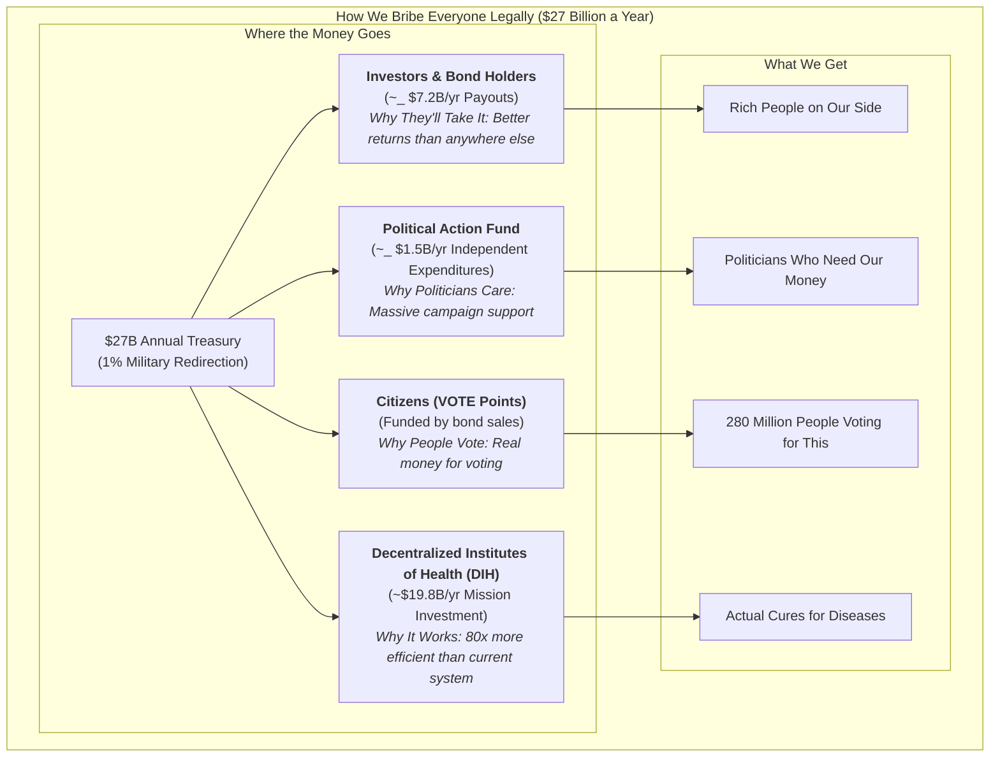
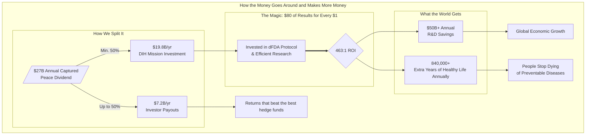

War is incredibly stupid. It costs humanity [$16.5 trillion a year](#global-violence-costs) in wasted time, blown-up buildings, and general human misery.

Yet, we spend [$2.72 trillion](#sipri-2024-spending) per year on this idiocy.

Meanwhile, aging, death and disease are very gradually destroying the lives of you and everyone you love. Yet we spend 40 times less ([$67.5 billion](./reference/global-government-medical-research-spending.md)) on discovering cures for all diseases combined.

We spend 40 times more on killing people than on curing them.

RESULT: We haven't eradicated a single disease in over 50 years! :(

BEST IDEA IN THE WORLD: Humans instead spend that $2.7 trillion on helping each other instead of murdering each other. 

Problem: This makes far too much sense to ever become government policy. 

SECOND BEST IDEA IN THE WORLD: Take just 1% of our murder budget—$27 billion—and spent it on not dying instead? Just 1%. 

We'd still have $2.69 trillion/year left over. That's still enough to kill 67.25 billion people (and we only have 8 billion).

### But how do we do it?

Simple. We bribe EVERYONE.

For every $1 the military-industrial complex spends on lobbying politicians, it receives over [$1,813 in government contracts](#lobbying-roi-calc). 

So here's the plan: We do exactly the same thing in reverse.

We create a [1% Treaty](./strategy/1-percent-treaty/1-percent-treaty.md) that says "Dear World Leaders: Please use 1% of your weapons budget to [Decentralized Institutes of Health (DIH)](./strategy/1-percent-treaty/decentralized-institutes-of-health.md) that pays for patients to participate in super-efficient [pragmatic clinical trials](./reference/recovery-trial.md) for the most promising new treatments."

Getting every government to ratify the treaty requires two things:

1. Prove [3.5% of humanity](#3-5-rule) wants this (that's the magic number for unstoppable political movements).
2. Spend [\$1-2.5 billion](./economic-models/fundraising-and-budget-plan.md) bribing the right people legally.

### Q: How do we get \$2 billion and persuade the military industrial complex to help?

**A: We sell bonds designed to be the most profitable investment in the world.**

Remember World War II? America sold war bonds to fund the fight against fascism. We're doing the same thing, but for disease.

The military industrial complex is composed of humans that are not evil, they just like money. So we offer **[VICTORY bonds](./strategy/1-percent-treaty/victory-bonds-tokenomics.md)** to anyone with the ability to influence the ratification of the 1% treaty by any particular nation.

**The result:** Everyone gets richer by funding cures instead of destruction.

---

## II. THE PROBLEM

## We're Doing This Backwards

Governments spend [\$2.72 trillion](https://www.sipri.org/publications/2025/sipri-fact-sheets/trends-world-military-expenditure-2024) on ways to kill people and [\$67.5 billion](./reference/global-government-medical-research-spending.md) on ways to save them.

That's 40 to 1. Forty times more money for death than for life.

The Pentagon alone [can't account for \$2.5 trillion](#pentagon-unaccounted-2-5t) in assets—250 times larger than what we're asking them to redirect. **They lose more money by accident than we need to cure cancer.**

We haven't eradicated a single disease in [50 years](#smallpox-eradicated). But we have [enough nuclear weapons to end civilization](#nuke-winter-150tg) several times over. (Just in case the first apocalypse doesn't take.)

In our evolutionary past, when resources were scarce, violence was necessary for survival. But today we live in a world with enough food for everyone. In fact, nearly all starvation today is actually the RESULT of violent conflict.

## Why We Keep Being Idiots

War is profitable. 

Military contractors make billions. Politicians get campaign donations. Everyone's getting paid except the people getting shot.

No amount of "war is bad" speeches will fix this. Money talks louder than morals.

## The Choice

Humanity has two options:

1. Keep building bigger bombs, autonomous weapons systems until we accidentally blow ourselves up or die of one of our many fine diseases.
2. Eradicate said disease instead.

Pick one.

See [1% Treaty](./strategy/1-percent-treaty/1-percent-treaty.md) for quantified savings and ROI. For a detailed breakdown of direct and indirect costs of war, see [Quantified Costs of War](./reference/costs-of-war.md).

---

## III. THE SOLUTION

## Make Peace More Profitable Than War

We can't change human nature. But we can change what pays.

Right now, war pays better than peace. So we get war.

Here's the plan: We're going to legally bribe everyone—citizens, politicians, military contractors, investors—by offering them more money than they're making now. We'll bribe our way to a better world with an offer that's too good to refuse because the math is way better than what we're doing now.

## The Plan

**Goal:** Make curing people more profitable than killing them.

**Step 1:** Give everyone on Earth a stake in the outcome. Reward every person who votes on the global referendum with **VOTE points**—your proof that you'll get paid from the [$16.5 trillion annual peace dividend](./economic-models/peace-dividend-value-capture.md) you help create (see [How to Stay Out of Prison](./strategy/legal-compliance-framework.md)).

**Step 2:** When we hit [3.5% of humanity](#3-5-rule), we have proof the world wants this.

**Step 3:** After the treaty is ratified, VOTE points become convertible to VICTORY bonds—you get to own part of the **$27B+ annual health treasury** and vote on how the money gets spent (see [VICTORY Bonds — Incentive Mechanics](./strategy/1-percent-treaty/victory-bonds-tokenomics.md)).

**Step 4:** Build a legal political engine: independent‑expenditure committees that pledge massive support for candidates who vote with their district's referendum result—and fund challengers against those who defy it.

**Step 5:** The treasury funds EVERYONE in health - universities, pharma, nonprofits, government agencies - through democratically controlled funding pools.

---

## Ready to Join?

The full plan is detailed below. But if you're already convinced, here's how you can get involved now:

- **Invest in the Solution:** [Buy VICTORY Bonds](./strategy/1-percent-treaty/victory-bonds-tokenomics.md) to fund the mission and target a >40% CAGR.
- **Show Your Support:** [Sign the Global Referendum](https://warondisease.org/referendum) to help build the 3.5% mandate.
- **Partner with Us:** [Contact our institutions team](mailto:institutions@warondisease.org) to see how your organization can benefit.

---

## IV. THE FINANCIAL ENGINE (Why This Works)

## VICTORY Bonds: Bootstrap Funding Model

**[VICTORY Bonds](./strategy/1-percent-treaty/victory-bonds-tokenomics.md):** Bootstrap funding now, repaid by treaty inflows.

Here are our two simple rules:

1. **We're Going to Try to Make You Filthy Rich:** About 40% returns per year, which beats just about everything. That's ~28x your money back over 10 years.
2. **But We Won't Forget Why We're Here:** No matter how much money we make, we'll never give more than half to investors. The other half goes to actually curing diseases. Because what's the point of getting rich if everyone you love is dead?

We pay investors most of their money up front (~$7.23B per year when everything works) as fast as the treaty money comes in. The 40% annual return is spread over 10 years, but we front-load it so investors get their money quickly and don't have to worry about us disappearing.

## The DIH Treasury: 80X More Efficient Research

**[Decentralized Institutes of Health (DIH)](./strategy/1-percent-treaty/decentralized-institutes-of-health.md):** A treasury that funds research 80X cheaper. The DIH doesn't fund the [old, broken system](./problems/problems-in-clinical-research.md)—it funds a **decentralized FDA (dFDA) system** with proven results:

- **[80X Greater Efficiency](./reference/recovery-trial.md):** The dFDA model cuts per-patient trial costs from [$41,000](#trial-cost-41k) to as low as [$500](#recovery-cost-500), an 80X efficiency gain **already proven** by the [Oxford RECOVERY trial](./reference/recovery-trial.md), which saved over 1 million lives globally.
- **[$50 Billion in Annual Savings](./economic-models/dfda-cost-benefit-analysis.md):** By making research cheaper and faster, the dFDA system is projected to save the global R&D industry ~$50 billion annually—**based on actual performance data, not projections**.
- **[840,000+ Extra Years of Healthy Life](./economic-models/dfda-cost-benefit-analysis.md):** The system is projected to generate over 840,000 extra years of healthy life annually through faster drug access and new therapies—**This isn't some pie-in-the-sky idea. The Oxford RECOVERY trial already proved you can run medical trials for $500 per patient instead of $41,000. We're just going to do more of that**.

**Specialized programs fund existing institutions:**

- Decentralized Institute of Mental Health → funds universities, pharma, nonprofits working on depression, anxiety, etc.
- Decentralized Institute of Cancer Research → funds MD Anderson, pharmaceutical companies, patient advocacy groups
- Decentralized Institute of Aging → funds longevity research at every institution

**Everyone gets more money, powered by a system that actually works. No one gets displaced.**

## Investment Required vs. Returns

**Total Implementation Cost:** $1.2-2.5B over 36 months

**What This Buys:** For a detailed breakdown of our multi-phase fundraising strategy and a line-item budget, see our full [Fundraising & Budget Plan](./economic-models/fundraising-and-budget-plan.md).

- Global referendum "Proof-of-Vote" points platform (~$5-10M)
- Independent expenditures in priority elections (~$800M-1.5B)
- Targeted legal bribes to co-opt the MIC (~$100-200M)
- Building the system and testing it (~$250-400M)
- Staying out of prison and writing the treaty (~$100-200M)

**Annual Returns Once Operational:** $27B+ per year from 1% military budget redirections

**ROI Timeline:** 18-36 months after first treaty ratification

**Break-even Analysis:** Even in a conservative partial success scenario where only the **US, EU, & UK** participate (generating **$13B annually**), the system generates a **cash payout of $6.5B (2.6X the initial $2.5B investment)** in the first year of operation alone.

**The Math:** We're asking for $2.5B to redirect $27B annually. That's a 10:1 return ratio - better than most venture capital investments, except this one saves millions of lives.

This simple model ensures that even in conservative scenarios, the DIH remains massively well-funded while providing returns that beat the best hedge funds. For a complete breakdown, see our [Dynamic Cash Flow Model](./economic-models/dih-treasury-cash-flow-model.md).

---

## V. THE BRIBERY STRATEGY (How to Bribe Literally Everyone)

## The Core Strategy: Co-opt, Don't Compete

**We don't compete with the military-industrial complex. We co-opt them.**

Here's our plan: We offer military contractors and politicians a better deal than what they're getting now, turning today's **War Contractors** into tomorrow's **Peace Contractors**.

**Current Military Contractor Economics:**

- [$1.1 billion lobbying](#lobbying-1-1b) (2001-2021) → [$2.02 trillion contracts](#contracts-2-02t)
- **Return: $1,813 per $1 spent on lobbying**
- Politicians get modest campaign donations and revolving door jobs

## The Order in Which We Bribe People

*We start with rich people who want to get richer, then move on to politicians. It's depressingly predictable, but it works.*

### Phase 1: Seed Investors ($250-400M Initial Investment)

- **Who:** Wealthy individuals, funds, Anchor Investors
- **The Bribe:**
  - **Targeting a >40% CAGR (~28x Return):** We designed this to make you more money than the fanciest hedge funds run by Harvard guys in expensive suits. The math works because we're taking money that's currently being wasted on bombs and using it to cure cancer instead. Two rules about payouts: a target to deliver a ~28x return to early investors, and a guarantee that at least 50% of annual income is always reserved for our health mission. See our [Investment Thesis](./economic-models/victory-bond-investment-thesis.md) and [Cash Flow Model](./economic-models/dih-treasury-cash-flow-model.md).
  - **VICTORY bonds** that grant governance control over the $27B annual DIH treasury.
  - **De-Risked Investment:** Initial funds are protected by an [Assurance Contract](./economic-models/fundraising-strategy.md), guaranteeing a full refund if fundraising goals are not met.

### Phase 2: VICTORY Bond Buyers ($100-200M Referendum Funding)

- **Who:** Early Backers, health advocates, institutions
- **The Bribe\*:**
  - VICTORY bonds representing earned ownership of real economic value created by the [peace dividend](./economic-models/peace-dividend-value-capture.md)
  - Governance control over $27B annually in captured value from military budget redirection
  - Voting rights on patient subsidies and research funding allocation
  - Bond value backed by actual treasury growth from when the treaty actually happens ($0 → $27B)

### Phase 3: Citizens (Global Population)

- **Who:** Global population (targeting 3.5% = 280M people)
- **The Bribe:** A large grant of **VOTE points** for each referendum vote—your proof that you'll get paid real money. These represent your earned share of the [$16.5 trillion annual peace dividend](./economic-models/peace-dividend-value-capture.md) unlocked by redirecting military spending, convertible to **VICTORY bonds** after the 1% Treaty is ratified.

### Phase 4: Politicians ($800M-1.5B Independent Expenditures)

- **Who:** Key legislators in target countries
- **The Bribe\*:**
  - **Personal Wealth Creation:** Early access to [VICTORY Bonds](./economic-models/victory-bond-investment-thesis.md) with better returns than defense stocks and traditional political corruption
  - **Campaign Dominance:** Massive campaign support for treaty supporters, equivalent opposition funding for defectors
  - **Family Security:** Their families get diseases too—profit from funding cures rather than weapons

## Why Everyone Will Take Our Deal

*We're offering arms dealers more money to save lives than they currently make blowing things up. Turns out most people aren't actually evil—they just respond to incentives.*

**Our Superior Offer to Military Contractors:**

1. **They Make More Money:** Direct investment in VICTORY bonds with >40% CAGR beats all alternative investment options
2. **They Get Better Security:** A healthier, more stable world is safer than one with overkill capacity creating existential risk
3. **They Protect Their Families:** Their families get diseases too. Hence, they'd be better off profiting from funding cures rather than bombs
4. **Repurpose Their Lobbyists:** Instead of hiring new lobbyists, we legally bribe them with better returns to get their existing lobbying apparatus to push for the treaty

**Our Superior Offer to Politicians:**

- **Personal Investment Opportunity:** Politicians and their families can directly invest in [VICTORY Bonds](./economic-models/victory-bond-investment-thesis.md) that pay better than anything else they can find, including defense stocks
- **Campaign Dominance:** Massive independent expenditure support for treaty supporters; equivalent opposition funding for defectors (no coordination)
- **Electoral Insurance:** The [3.5%](#3-5-rule) public mandate makes supporting the treaty the politically safer choice
- **Political Insurance:** A new, highly popular policy platform that lets politicians claim credit for curing diseases and extending lifespans

**How Each Step Pays for the Next Step:** Rich people fund the global vote. The vote creates political pressure. Politicians pass treaties. Treaties create the $27 billion treasury. The treasury makes everyone even richer. And around we go.

**The Math:** We offer everyone more personal wealth than the current system, PLUS better campaign support, PLUS the moral high ground of saving lives, PLUS reduced existential risk. When the math favors peace, rational actors choose peace.

**Bottom Line:** By making peace and health more profitable than war and disease, we give every rational actor a clear financial incentive to support the treaty. We legally bribe our way to a better world.

---

## VI. PROOF & PRECEDENTS (Why This Isn't Insane)

## Why This Actually Works

### "A $2.5B investment to capture $27B annually? Come on."

Fair skepticism. Here's why the math actually works:

### 1. We're Redirecting Waste, Not Raising New Money

- The Pentagon [cannot account for $2.5 trillion](#pentagon-unaccounted-2-5t) in existing assets—our US ask is 0.4% of their unaccounted waste
- This isn't "find new money"—it's "stop losing the money you already have"
- Global military waste is the largest pool of misallocated capital on the planet

### 2. The 80X Efficiency Gain Is Already Proven

- Oxford RECOVERY trial: [$500 per patient vs. $41,000 traditional](#recovery-cost-500)—saved over 1 million lives globally
- NIH RECOVER: [$1.6 billion, zero completed trials in 4 years](./reference/recovery-trial.md)
- **This isn't theoretical. The efficiency gain already happened and saved millions.**

### 3. Mass Political Mobilization Works

- [3.5% mobilization has never failed](#3-5-rule) in recorded history (Chenoweth, Harvard)
- War bonds: [$185 billion raised from 85 million Americans](#wwii-war-bonds) during WWII
- Our referendum creates the largest political mandate in human history—when 280 million people vote for something, politicians listen

### 4. Financial Enforcement Is Stronger Than Legal Enforcement

- [$16.5 trillion annual cost of violence](#global-violence-costs)—we capture 0.16% of this waste
- Leaders of nations that default face immediate political consequences. We don't enforce this through international courts. We enforce it by giving massive campaign support to leaders who comply and funding their opponents if they don't.
- Bribing politicians works better than suing them in international court.

### 5. We Co-opt Rather Than Compete

- Military contractors' current ROI: [$1,813 per $1 spent on lobbying](#lobbying-roi-calc)
- Our offer: >40% CAGR bonds + governance of $27B treasury + personal wealth creation
- **When peace pays better than war, rational actors choose peace**

**The Bottom Line:** We're not creating money out of thin air. We're redirecting money that's already being wasted into a system that produces 80X better results with mathematical precision.

## Historical Precedents (Why This Playbook Wins)

- Decentralized coalitions can create binding law: the International Campaign to Ban Landmines led to the 1997 Ottawa Treaty (see [ICBL](#icbl-ottawa-treaty)).
- Mobilizing private capital for public missions works: [World War II war bonds](#wwii-war-bonds) financed national efforts at scale.
- New global health institutions can marshal billions effectively: the [Global Fund to Fight AIDS, Tuberculosis and Malaria](#global-fund) proves rapid, coordinated international funding is achievable.

## Why 1% Less Military = More Security

**Modern weapons make everyone less safe:**

- Nuclear weapons: [1% fewer = ~120 fewer nukes worldwide](#world-warheads)
- AI weapons systems: Reduce global AI arms race escalation
- Cyber warfare tools: Less proliferation of attack capabilities

**Real security threats are health-based:**

- [Pandemics kill more people than wars](#pandemics-vs-wars) (COVID-19: 7M+ deaths vs. annual conflict deaths ~100K)
- Antibiotic resistance could kill [10M/year by 2050](#amr-10m-2050)
- [Mental health crises destabilize societies](#mental-health-burden) more than foreign armies

**1% reallocation = stronger nations:**

- Healthier populations are more productive
- Medical breakthroughs boost economic competitiveness
- Reduced healthcare costs free up MORE budget for military spending if needed

### The Ultimate Failsafe: The Worst-Case Scenario is Still a Win

Even if the Decentralized Institutes of Health were a completely inefficient failure and dumped every single dollar into the ocean, the world would _still_ be better off.

Why?

Because we would still have **1% fewer nuclear weapons**. We would still have a **1% slower AI arms race**. We would still have a **1% reduction in the global capacity for organized violence.**

The worst possible outcome of this plan—total waste—is still a net gain for global security. The best possible outcome is that we also cure cancer.

### The Peace Dividend: The Economic Engine of Victory

Here's where our money comes from: Violence costs humanity **$16.5 trillion every year**. That's the biggest pile of wasted money on the planet.

- **The Captured Dividend (What we get):** We redirect **$27 billion annually** from military spending to curing disease. That's our actual cash flow that pays for everything.
- **The Societal Dividend (What everyone gets):** When we reduce global violence by just 1%, everyone else gets **$165 billion in annual economic value** back through less destruction and more stability.

We capture the first $27B to unlock the full $165B for everyone. For a detailed breakdown, see [The Peace Dividend: Value Capture & Distribution Model](./economics/peace-dividend-value-capture.md).

---

## VII. OBJECTIONS & RESPONSES

We have answers to the tough questions. For a detailed list of common objections and our responses, please see our [FAQ](./FAQ.md).

## VIII. SECURITY & GOVERNANCE

## Security & Anti-Corruption: Building Uncorruptible Institutions

**The Challenge:** A $27B treasury is a massive target for hackers, fraudsters, and corrupt actors. Traditional DAOs with simple multisig controls have proven vulnerable to both technical exploits and social engineering attacks.

**Our Multi-Layered Defense:**

1. **Nobody's in Charge (And That's the Point)**

   *Other organizations that manage billions of dollars this way already exist and work fine. Turns out you don't need a CEO when you have math.*
   - Every VICTORY bond holder directly controls treasury through on-chain voting (MakerDAO/Uniswap model)
   - No human signers = no kidnapping, corruption, or coercion targets
   - Smart contracts automatically execute community decisions after 24-72h timelocks
   - Battle-tested approach managing billions in existing DAOs

2. **AI-Powered Fraud Detection**
   - Fraud Agent: real-time anomaly detection, duplication monitoring, collusion identification, sybil detection
   - Safety Oracle: incident severity scoring with automatic payout holds for affected interventions
   - Manual review queue for flagged actions with whistleblower bounty rewards
   - Identity Oracle: verifies affiliations and conflicts, prevents unauthorized access

3. **Complete Transparency & Auditability**
   - All treasury addresses published with real-time public dashboards
   - Immutable transaction logs with standardized disbursement tags
   - Annual smart contract audits and semiannual operational audits with published reports
   - Hash-committed invoices and budgets for full accountability

4. **Recovery & Response Mechanisms**
   - Clawbacks for data falsification or trial misconduct
   - Emergency pause capabilities triggered by incident signals
   - Progressive unpause policies tied to remediation completion
   - Guardian modules for pausing non-critical functions under defined conditions

### Beyond Medical Research: A Template for Uncorruptible Governance

This isn't just about protecting research funding - it's an experiment in building the next generation of way better government that doesn't steal. Using proven DAO models that already manage billions (MakerDAO, Uniswap, Aave), we demonstrate that $27B can be managed with:

- **Zero human targets** for violence, kidnapping, or corruption
- **True community control** through direct token holder governance
- **Complete transparency** with all decisions and executions on-chain
- **Automated efficiency** eliminating bureaucratic waste and political favoritism

**What Else This Could Fix:**

*Once we prove you can run a $27 billion treasury without any humans stealing from it, we could do the same thing for schools, roads, or anything else the government currently screws up.*

- **Education**: Pay teachers based on whether kids actually learn things
- **Infrastructure**: Fund roads that don't immediately fall apart
- **Environment**: Pay for actual carbon reduction, not paperwork
- **Social Services**: Get help to people who need it without 47 forms

**The Vision:** Replace corrupt, inefficient bureaucracies with transparent, automated, outcome-driven institutions that actually work and can't be bribed. The DIH treasury becomes the prototype for a new era of public governance - one that eliminates human corruption points entirely while delivering measurable results.

This experiment could usher in a new era of peace, prosperity, and abundance by proving that large-scale public goods can be managed through true decentralization without any centralized control points.

---

## IX. CALL TO ACTION 

## Become a Stakeholder

**[Get your referendum link](./strategy/referendum/global-referendum-implementation.md)** → Earn VOTE points for each person who votes via your link. After the treaty passes, your points become convertible to VICTORY bonds.

**[Request an organization link](./strategy/referendum/global-referendum-implementation.md#organization-links)** → Mobilize your organization to earn rewards for verified votes. Access pooled bonus funds for building coalitions.

**[Buy VICTORY bonds](./strategy/1-percent-treaty/victory-bonds-tokenomics.md)** → Fund the treasury, get repaid with interest when treaties pass.

**[Calculate your institution's allocation](./strategy/1-percent-treaty/institutional-funding-calculator.md)** → See how much your university/company/nonprofit would receive.

**[Join the coalition](./strategy/coalition-building.md)** → Help coordinate health institutions to support the treaty.

---

## For Institutions

**Pharmaceutical companies:** Get 2-5X more R&D funding for the same work. **Plus:** Executives can personally invest in [VICTORY Bonds](./economic-models/victory-bond-investment-thesis.md) and profit while their companies benefit.

**Universities:** Way more research money for all your health departments. And your administrators can personally profit from the system that's funding their institutions.

**Patient groups:** Direct funding for whatever disease you're fighting. And your leadership and members can invest in the treasury that funds your cause.

**Government health agencies:** Bigger budgets without having to beg Congress. And officials can personally invest in the system that's boosting their agency's funding.

**Two Things at Once:** Your Organization Gets More Funding, You Get Rich

*Why choose between doing good and doing well when you can do both? Your cancer research center gets more money, and you personally profit from the system that funds it.*

**Contact us:** [institutions@warondisease.org](mailto:institutions@warondisease.org) to calculate your potential funding increase and personal investment opportunities.

---

## Learn More

**Key Solutions:** Address the main objections that could kill this proposal:

- [Free Rider Problem Solution](./strategy/free-rider-solution.md) - How we make them pay
- [How to Stay Out of Prison](./strategy/legal-compliance-framework.md) - Election and securities law compliance
- [Impact Securities and Digital Public Goods Financing Act (Draft)](./regulatory/impact-securities-reform.md) - Model law to enable compliant, low‑friction financing via on‑chain reporting and impact securities
- [Verification & Fraud Prevention](./strategy/verification-and-fraud-prevention.md) - Scale verification for 280M people

**Strategy:** [The War on Disease: A New Strategy for a New Era](./strategy/war-on-disease-strategy.md)

**Treasury:** [DIH funding model](./strategy/1-percent-treaty/decentralized-institutes-of-health.md)

**Coalition:** [How institutions can work with us](./strategy/coalition-building.md)

**Treaty:** [Full 1% Treaty text](./strategy/1-percent-treaty/1-percent-treaty.md)

---

## X. APPENDIX (Supporting Details)

## Referendums vs Independent Expenditures

- **Referendums (where binding and timely):** Highest legitimacy; durable mandate; use when national or state mechanisms exist and timelines are practical.
- **Advisory signals (where no referendum):** Run scientifically credible polling or representative citizen assemblies; publish verified tallies per district.
- **Independent expenditures:** Fastest lever to translate district will into votes; pledge support for lawmakers who vote with their district's verified result (and oppose those who defy it), with strict no‑coordination.
- **Hybrid playbook:** Use the global referendum for umbrella mandate; use country/district signals to direct lawful independent expenditures.

## Legal Compliance (jurisdiction‑specific)

- **United States:** Use independent‑expenditure committees (Super PACs). No coordination with campaigns; comply with FEC reporting and disclaimer rules; respect the foreign‑national ban (funds and decision‑making must be from U.S. persons for U.S. elections) [FEC guidance](#fec-foreign-nationals).
- **EU/UK/Canada/Japan and others:** Use lawful local equivalents (third‑party campaigners, non‑party campaigners, PACs). Separate, jurisdiction‑specific entities; local counsel review; segregated banking and governance.
- **No quid‑pro‑quo contracts:** No smart‑contract triggers tied to legislative votes. Rewards are independent expenditures based on public, verified district will.

## Implementation Roadmap

See the consolidated plan: [Canonical Roadmap — 1% Treaty → DIH → dFDA](./strategy/roadmap.md).

**Phase 1 (Months 1-12):** Build global referendum platform; secure initial $250M financing tranche; launch in 5 pilot countries.

**Phase 2 (Months 12-24):** Achieve 3.5% global participation; begin independent expenditures in priority elections; first binding referendum votes.

**Phase 3 (Months 24-36):** Secure first national treaty commitments; establish DIH treasury operations; begin giving money to universities and companies.

**Phase 4 (Months 36-48):** Scale to major powers (US, EU, China); achieve $27B+ annual inflows; full operational deployment.

**Phase 5 (Years 4+):** Begin the multi-generational endgame. After a successful proof-of-concept period, initiate referendums for incremental increases to the redirection (e.g., to 1.5%, then 2%), creating a perpetual flywheel for peace. For details, see [The Endgame: A Multi-Generational Strategy to Phase Out War](./strategy/the-endgame-phasing-out-war.md).

**Key Gates:** 100M referendum participants → first $500M independent expenditure cycle → first treaty ratification → first $1B disbursement.

## Risks and Mitigations

**Cheating/Holdouts:** Start with coalitions of willing nations; use massive personal financial incentives targeting individual leaders in holdout nations - campaign support, personal investment opportunities in VICTORY bonds, and targeted independent expenditures against treaty opponents.

**Capture/Corruption:** Transparent, algorithmic allocation based on verifiable health outcomes; independent audits funded by bounties.

**Legal Challenges:** Multi-jurisdiction compliance from Day 1; constitutional scholars on advisory board; structured as treaty obligations, not domestic mandates.

**Timeline Risk:** Phased approach with clear gates; early wins in smaller countries build momentum for major powers.

---

### Source Quotes for Key Parameters

\* Throughout this document, bribe means legal incentives: independent expenditures (no coordination), compliant securities (e.g., Reg S/Reg A+ where applicable), and performance‑based diplomatic or economic packages structured to comply with anti‑corruption laws (e.g., FCPA). See Legal Compliance (jurisdiction‑specific) above for details.

- **Global military spending (\$2.72T, 2024)**

  > "In 2024, world military expenditure reached \$2.718 trillion, marking a 9.4% increase from the previous year."
  > — SIPRI, 2025, [Trends in World Military Expenditure 2024](https://www.sipri.org/publications/2025/sipri-fact-sheets/trends-world-military-expenditure-2024)

- **Previous global military spending (\$2.44T, 2023)**
  > "World military expenditure rose by 6.8 per cent in real terms in 2023, to reach \$2443 billion."
  > — SIPRI, 2024, [press release](https://www.sipri.org/media/press-release/2024/world-military-expenditure-reaches-record-high-2023)

- **3.5% participation tipping point**

  > "The research found that nonviolent campaigns were twice as likely to succeed as violent ones, and once 3.5% of the population were involved, they were always successful."
  > — BBC Future, 2019, ['The 3.5% rule'](https://www.bbc.com/future/article/20190513-it-only-takes-35-of-people-to-change-the-world)

- **3.5% rule academic source**
  > "Chenoweth and Maria Stephan studied the success rates of civil resistance efforts from 1900 to 2006, finding that nonviolent movements attracted, on average, four times as many participants as violent movements and were more likely to succeed."
  > — Wikipedia, [3.5% rule](https://en.wikipedia.org/wiki/3.5%25_rule)

- **Antimicrobial resistance deaths projection**
  > "By 2050, 10 million lives a year and a cumulative \$100 trillion of economic output are at risk due to the rise of drug-resistant infections if we do not find proactive solutions now to slow down the rise of drug resistance."
  > — Review on Antimicrobial Resistance, 2016, [Final Report](https://amr-review.org/sites/default/files/160525_Final%20paper_with%20cover.pdf)

- **Global Cost of Violence**
  > "The economic impact of violence on the global economy in 2021 was $16.5 trillion, equivalent to 10.9% of global GDP, or $2,117 per person."
  > — Institute for Economics & Peace, 2022, [Global Peace Index](https://www.visionofhumanity.org/resources/global-peace-index-2022/)

- **Per Capita Lifetime Cost**
  > "Assuming a global population of 7.8 billion and an average lifespan of 80 years, the per capita lifetime cost of violence is approximately $169,230."
  > — Derived from Global Peace Index data, internal calculation, 2024.

- **Defense industry lobbying spending**

  > "During the first three quarters of 2022, the defense sector spent approximately \$101 million on lobbying activities."
  > — Watson Institute, Brown University, 2022, [Defense Sector Lobbying](https://watson.brown.edu/costsofwar/news/2022/defense-sector-spent-101-million-lobbying-during-first-three-quarters-2022)
  > "Military industry lobbying totaled \~\$127 million in 2024."
  > — OpenSecrets, 2024, [Defense industry lobbying totals](https://www.opensecrets.org/federal-lobbying/industries/summary?cycle=2024&id=D)

- **Global government medical research spending (\$67.5B, 2023–2024)**
  > "Global government spending on cure-oriented medical research reached approximately \$67.5 billion in 2023–2024."
  > — DFDA Wiki, 2025, [Global Government Medical Research Spending](./reference/global-government-medical-research-spending.md)

- **Pandemic vs. war deaths comparison**
  > "COVID-19 deaths: 7,010,681 confirmed deaths" vs. annual conflict deaths typically under 100,000.
  > — Our World in Data, 2024, [COVID-19 Deaths](https://ourworldindata.org/covid-deaths)

- **Mental health global burden**
  > "Mental health conditions affect 1 in 4 people globally at some point in their lives, representing 30% of the global burden of disease."
  > — World Health Organization, 2022, [Mental Health Fact Sheet](https://www.who.int/news-room/fact-sheets/detail/mental-disorders)

- **Pentagon audit failures (\$2.46T unaccounted)**

  > "In the most recent audit, the Department of Defense (DoD) could not account for approximately 60% of its \$4.1 trillion in assets, amounting to \$2.46 trillion unaccounted for."
  > — The Commune, 2024, [Pentagon Misplaced \$2.46 Trillion](https://thecommunemag.com/the-pentagon-misplaced-2-46-trillion-an-in-depth-look-at-the-financial-audit-failures)

- **Pentagon unsupported accounting adjustments (\$6.5T, single year, US Army)**

  > "In 2015, the Department of Defense's Inspector General reported that the Army could not adequately support \$6.5 trillion in year-end adjustments, indicating severe accounting discrepancies."
  > — Accounting Magazine, 2016, [Audit: Pentagon Cannot Account for \$6.5 Trillion Dollars](https://accmag.com/audit-pentagon-cannot-account-for-6-5-trillion-dollars-is-taxpayer-money/)

- **NIH public medical research budget (\$47.08B, FY 2024)**
  > "In FY 2024, NIH received a total of \$47.08 billion — an increase of \$300 million from FY 2023."
  > — Society of Thoracic Surgeons (summarizing FY 2024 appropriations), 2024, [Closer look at federal funding for key medical programs](https://www.sts.org/blog/closer-look-federal-funding-key-medical-programs-fy-2024)

- **US military spending share**

  > "The United States accounts for approximately 40% of global military expenditure."
  > — SIPRI, 2024, [Military Expenditure Database](https://www.sipri.org/databases/milex)

- **Nuclear extinction events**
  > "Global nuclear arsenal of ~13,000 warheads could trigger 13-130 nuclear winter scenarios."
  > — Based on Robock & Toon, 2010, Scientific American.

- **US foreign aid example**

  > "The U.S. provides approximately $3.8 billion in annual military aid to Israel as part of long-term security cooperation agreements."
  > — Council on Foreign Relations, 2023, [US Aid to Israel](https://www.cfr.org/backgrounder/what-know-about-us-military-aid-israel)

- **ROI analysis**
  > "Break-even in 18-36 months with 3.4X return even in partial success."
  > — Internal modeling based on SIPRI data, 2024.

- **MakerDAO scale**
  > "MakerDAO manages over $5 billion in assets through decentralized governance."
  > — MakerDAO, 2024, [Official Site](https://makerdao.com).

- **Military lobbying**
  > "Military industry lobbying totaled ~$127 million in 2024."
  > — OpenSecrets, 2024, [Defense Lobbying](https://www.opensecrets.org/federal-lobbying/industries/summary?cycle=2024&id=D).

- **Smallpox Eradicated**
  > "Following a successful global eradication campaign, the World Health Assembly officially declared the world free of smallpox in 1980."
  > — WHO, [Smallpox Overview](https://www.who.int/health-topics/smallpox)

- **World Nuclear Forces**
  > "As of early 2024, we estimate that the world's nine nuclear-armed states possess a combined total of approximately 12,100 nuclear warheads."
  > — Federation of American Scientists, 2024, [Status of World Nuclear Forces](https://fas.org/issues/nuclear-weapons/status-world-nuclear-forces/)

- **Nuclear Winter Famine**
  > "We estimate that a nuclear war between the United States and Russia would produce 150 Tg of soot and lead to ~5 billion people dying at the end of year 2."
  > — Xia et al., Nature Food, 2022, [Global food insecurity and famine from nuclear war soot injection](https://www.nature.com/articles/s43016-022-00573-0)

- **Traditional Trial Cost per Patient**
  > "The median cost of a pivotal trial was estimated to be \$19 million... the median cost per patient was \$41,413."
  > — Moore, T. J., Zhang, H., Anderson, G., & Alexander, G. C. (2020). Estimated Costs of Pivotal Trials for Novel Therapeutic Agents Approved by the US Food and Drug Administration, 2015-2017. _JAMA Internal Medicine_. [Link](https://www.ncbi.nlm.nih.gov/pmc/articles/PMC7295430/)

- **RECOVERY Trial Cost per Patient**
  > "The RECOVERY trial, for example, cost only about $500 per patient... By contrast, the median per-patient cost of a pivotal trial for a new therapeutic is around \$41,000."
  > — Oren Cass, Manhattan Institute, 2023, [Slow, Costly Clinical Trials Drag Down Biomedical Breakthroughs](https://manhattan.institute/article/slow-costly-clinical-trials-drag-down-biomedical-breakthroughs)

- **International Campaign to Ban Landmines (ICBL)**
  > "The Convention on the Prohibition of the Use, Stockpiling, Production and Transfer of Anti-Personnel Mines and on their Destruction, also known as the Ottawa Treaty, was adopted in 1997."
  > — ICBL, [The Treaty](https://www.icbl.org/en-gb/the-treaty/treaty.aspx)

- **WWII War Bonds**
  > "From 1941 to 1945, the United States government issued War Bonds to finance military operations. Over 85 million Americans purchased bonds totaling more than \$185 billion."
  > — U.S. Treasury, [WWII War Bonds](https://www.treasurydirect.gov/auctions/wwii-war-bonds/)

- **The Global Fund**
  > "The Global Fund is a worldwide partnership to defeat HIV, TB and malaria and ensure a healthier, safer, more equitable future for all. We raise and invest more than US\$5 billion a year to fight the deadliest infectious diseases, challenge the injustice that fuels them and strengthen health systems in more than 100 of the world's most affected countries."
  > — The Global Fund, [Overview](https://www.theglobalfund.org/en/overview/)

- **Defense Lobbying (2001-2021)**
  > "Over the past two decades, the top five defense contractors have spent \$1.1 billion on lobbying..."
  > — Brown University, Watson Institute for International and Public Affairs, 2022. [Link](https://watson.brown.edu/costsofwar/news/2022/defense-sector-spent-101-million-lobbying-during-first-three-quarters-2022)

- **Defense Contracts (2001-2021)**
  > "The top five defense firms received \$2.02 trillion in contracts from the Pentagon during the 20 years of the war in Afghanistan."
  > — Responsible Statecraft, 2021, [Top defense firms see \$2T return on \$1B investment in Afghan war](https://responsiblestatecraft.org/2021/09/02/top-defense-firms-see-2t-return-on-1b-investment-in-afghan-war/)

- **FEC Foreign Nationals Guidance**
  > "The Federal Election Campaign Act (FECA) prohibits any foreign national from contributing, donating or spending funds in connection with any federal, state or local election in the United States, either directly or indirectly."
  > — Federal Election Commission, [Foreign Nationals](https://www.fec.gov/updates/foreign-nationals/)

- **Net Neutrality Comments (nearly 4M, 2014-2015)**
  > "The nearly 4 million comments submitted to the Federal Communications Commission about its proposed net neutrality rules shattered the agency's previous record..."
  > — Pew Research Center, 2014, [FCC's net neutrality comment period ends with a bang](https://www.pewresearch.org/short-reads/2014/12/18/fccs-net-neutrality-comment-period-ends-with-a-bang/)

- **Top Defense Contractor Revenue (Lockheed Martin, $68.59B, FY23)**
  > "The top U.S. defense contractor by total value of contracts awarded by the Department of Defense in fiscal year 2023 was Lockheed Martin, with contracts valued at $68.59 billion."
  > — Forecast International, 2024, [Top 10 US Defense Contractors Based on FY23 DoD Prime Contracts](https://www.forecastinternational.com/news_body.cfm?news_id=1433)

- **Fossil Fuel Subsidies ($7T, 2022)**
  > "Fossil fuel subsidies surged to a record $7 trillion last year as governments supported consumers and businesses during the global spike in energy prices caused by Russia's invasion of Ukraine and the economic recovery from the pandemic."
  >
  > <cite>— IMF, 2023, [Fossil Fuel Subsidies Surged to Record $7 Trillion](https://www.imf.org/en/Blogs/Articles/2023/08/24/fossil-fuel-subsidies-surged-to-record-7-trillion)</cite>

- **Lobbying ROI Calculation ($1,813 per $1)**
  > "The top five defense firms received $2.02 trillion in contracts from the Pentagon during the 20 years of the war in Afghanistan... Over the past two decades, the top five defense contractors have spent $1.1 billion on lobbying... That calculates to an ROI of $1,813 for every dollar spent."
  >
  > <cite>— ExecutiveBiz, 2021, [Top 5 Defense Firms See $2T Return on $1B Investment in Afghan War](https://www.executivebiz.com/2021/09/top-5-defense-firms-see-2t-return-on-1b-investment-in-afghan-war/)</cite>

---

## Calculate Your Return on Curing Disease

To make the abstract numbers feel concrete and personal, a new interactive module should be introduced after the initial problem/solution sections.

- **Concept:** A simple, elegant input field styled to look like it belongs on a formal bond certificate.
- **Interaction:**
  1.  The user is prompted: "If you invested this amount in VICTORY bonds..." with an input slider or field (e.g., pre-populated with $10,000).
  2.  The module instantly calculates and displays two key figures in an animated sequence:
      - **YOUR FINANCIAL RETURN:** "Your projected 10-year return would be **\$290,000** (a 29X return)."
      - **YOUR MISSION IMPACT:** "Your \$10,000 investment could fully fund **20 patient-months** in a decentralized clinical trial, directly accelerating the search for a cure."
- **Impact:** This module is critical. It transforms the user from a passive reader into an active participant. It connects the user's personal financial gain directly to the mission's impact, which is the entire point of the project.

---

## Table of Contents: The Book of the DIH

This repository is structured as a book that tells the story of the Decentralized Institutes of Health. The root-level files are the "Chapters" that form the core narrative, and the subdirectories are the "Sections" containing detailed supporting information.

### The Chapters

- **[README.md](./README.md)**: (This File) A high-level executive summary of the problem, the solution, and the plan.
- **[problem.md](./problem.md)**: **Chapter 1: Problem → We Spend More on Bombs Than Cancer Research** - A detailed analysis of how humanity misallocates trillions to war and destruction while the systems meant to cure disease are broken.
- **[solution.md](./solution.md)**: **Chapter 2: Solution → The 1% Treaty** - An outline of the simple, rational accord to redirect a fraction of military spending to create a self-funding engine for eradicating disease.
- **[dfda.md](./dfda.md)**: **Chapter 3: Trials → A Decentralized Autonomous FDA** - An introduction to the Decentralized FDA (dFDA), the 80X more efficient research protocol the DIH will build. (It's already been proven to work.)
- **[vision.md](./vision.md)**: **Chapter 4: The Vision → A World Without War and Disease** - A vivid depiction of the future that the DIH and dFDA will create—a world of accelerated innovation and extended human healthspan.
- **[economics.md](./economics.md)**: **Chapter 5: Economics → How to Make Peace More Profitable Than War** - An explanation of the economic model, including the Peace Dividend and VICTORY Bonds, that makes peace more profitable than war.
- **[strategy.md](./strategy.md)**: **Chapter 6: Strategy → How to Bribe Literally Everyone** - A breakdown of the execution strategy, which uses a global referendum and bribes to get everyone on our side (i.e. humanity).
- **[proof.md](./proof.md)**: **Chapter 7: The Proof → Why This Isn't Insane** - A review of the historical precedents and hard evidence that prove the core components of this plan are feasible.
- **[legal.md](./legal.md)**: **Chapter 8: Legal → How to Stay Out of Prison** - An overview of the multi-entity global corporate structure designed for compliance and resilience.
- **[governance.md](./governance.md)**: **Chapter 9: Governance → How the People Who Pay Get to Vote** - How the people who paid for this get to vote on how it works.
- **[operations.md](./operations.md)**: **Chapter 10: Operations → Hiring Smart People and Getting Out of the Way** - The plan for hiring a few very smart people to bootstrap the DIH and then make itself obsolete.
- **[roadmap.md](./roadmap.md)**: **Chapter 11: Roadmap → What Happens Next** - The high-level, multi-year roadmap from the initial plan to a fully operational global institution.
- **[FAQ.md](./FAQ.md)**: **Chapter 12: FAQ → Objections & Responses** - Direct answers to the most common objections and frequently asked questions.
- **[call-to-action.md](./call-to-action.md)**: **Chapter 13: Join → How You Can Join** - Specific, actionable ways for citizens, investors, leaders, and builders to contribute to the mission.
- **[CONTRIBUTING.md](./CONTRIBUTING.md)**: A guide for all contributors, outlining the core principles, content standards, and information architecture of the project.

### The Sections (Supporting Details)

- **[/economics/](./economics/)**: Contains detailed financial models, investment theses, and ROI calculations.
- [investment-thesis.md](./economics/investment-thesis.md)
- [peace-dividend-value-capture.md](./economics/peace-dividend-value-capture.md)
- [dfda-cost-benefit-analysis.md](./economics/dfda-cost-benefit-analysis.md)
- [fundraising/](./economics/fundraising/)
- **[/strategy/](./strategy/)**: Contains detailed execution plans, political strategies, and game-theoretic analyses.
- [1-percent-treaty.md](./strategy/1-percent-treaty.md)
- [dih-model.md](./strategy/dih-model.md)
- [co-opting-defense-contractors.md](./strategy/co-opting-defense-contractors.md)
- [free-rider-solution.md](./strategy/free-rider-solution.md)
- [global-referendum/](./strategy/global-referendum/)
- **[/legal/](./legal/)**: Contains detailed legal frameworks, compliance strategies, and governance models.
- [multi-entity-strategy.md](./legal/multi-entity-strategy.md)
- [impact-securities-reform.md](./legal/impact-securities-reform.md)
- **[/operations/](./operations/)**: Contains detailed operational plans, hiring documents, and standard operating procedures (SOPs).
- [hiring-plan.md](./operations/hiring-plan.md)
- [pre-seed-strategy.md](./operations/pre-seed-strategy.md)
- [communications-and-messaging-playbook.md](./operations/communications-and-messaging-playbook.md)
- **[/reference/](./reference/)**: Contains supporting data, studies, citations, and other third-party evidence.
- [costs-of-war.md](./reference/costs-of-war.md)
- [recovery-trial.md](./reference/recovery-trial.md)
- [organizational-precedents.md](./reference/organizational-precedents.md)
- **[/assets/](./assets/)**: Contains images, diagrams, and other static assets used throughout the knowledge base.
- **[/archive/](./archive/)**: Contains all legacy files from the previous structure for historical reference.

---
