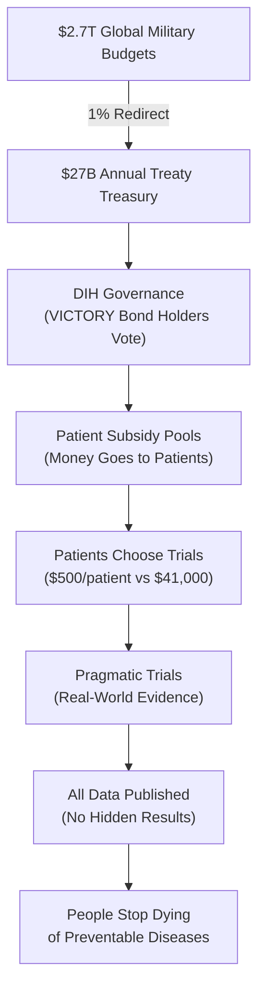

> **The 1% Treaty:** Every nation redirects just 1% of global military spending to fund 80X more efficient medical research, creating the most profitable investment in history while saving millions of lives.

 

## The Problem in Numbers

| What We Waste Money On | Annual Cost | What We Get |
|----------------|------------|-------------|
| War & Conflict | $9.7T | Destruction, refugees, and disabilities |
| Disease Burden | $109.1T | Suffering and lost potential |
| **Total Waste** | **$118.8T** | **The dumbest possible use of our limited resources** |
| **Medical Research** | **$0.068T** | Actual cures and treatments |

## The 1% Solution

We've created a system where:

1. **Nations redirect 1%** of military budgets to cure disease
2. **Patients get paid** to participate in clinical trials
3. **Research becomes 80x more efficient** using proven methods
4. **EVERYONE profits** from the $16.5T annual peace dividend

[How It Works](#how-it-works) | [The Math](#the-math) | [Get Involved](#join-the-war)

## Why This Works

✅ **Proven Model:** The Oxford RECOVERY trial showed we can run trials for $500 instead of $41,000 per patient  
✅ **Massive Leverage:** $1 in lobbying produces $1,813 in government contracts
✅ **Aligned Incentives:** Everyone gets rich by curing disease instead of killing people and  
✅ **No Losers:** Even partial success means 1% less war and nuclear bombs and more cures

## How It Works

### The Market Revolution in Medical Research

1. **Replace Central Planning**: NIH's Soviet-style committees → DIH's prediction markets and wisdom of crowds
2. **Amazon for Trials**: dFDA creates an open marketplace where treatments compete on real results, not lobbying
3. **Universal Integration**: One-click trial enrollment from any EHR, health app, or doctor's office
4. **80X Efficiency**: Market competition drives costs from $41,000 to $500/patient (Oxford proved it)
5. **Radical Transparency**: All data public, all results ranked - like Amazon reviews but for staying alive
6. **Pay for Success**: Researchers get rich by curing diseases, not by writing grant proposals

### Central Planning vs. Free Markets

**Current System (NIH/FDA Central Planning):**
- $2.2B per drug (committees pick losers)
- 17 years to market (bureaucracy moves at bureaucracy speed)
- 90% grant rejection rate (200 reviewers play god with $48B)
- 95% of diseases have 0 treatments (committees don't care about rare diseases)
- 15% patient access (gatekeepers everywhere)

**New System (DIH/dFDA Free Markets):**
- ~$27M per treatment (competition drives efficiency)
- 2-3 years to market (markets move at market speed)
- Fund everything, measure results (let data pick winners)
- 1,000X more treatments tested (markets find every niche)
- 100% patient access (Amazon doesn't turn away customers)

## The Math

### Investment Required vs. Returns

**Total Implementation Cost:** $1.2-2.5B over 36 months

**Annual Returns Once Operational:** $27B+ per year from 1% military budget redirections

**The Math:** We're asking for $2.5B to redirect $27B annually. That's a 10:1 return ratio - better than most venture capital investments, except this one saves millions of lives.

## The Plan: From Idea to Treaty

1.  **Prove the Mandate (The Global Referendum):** We will mobilize 3.5% of humanity (280 million people) through a global referendum. This creates an undeniable political mandate that no leader can ignore.

2.  **Fund the Mission (VICTORY Bonds):** We will raise the required $2.5B by selling **VICTORY Bonds**—an investment vehicle designed to offer ~40% annual returns, making peace more profitable than war.

3.  **Ratify the Treaty:** With a clear public mandate and a powerful financial engine, we will co-opt the existing political system to ratify the 1% Treaty and begin redirecting funds.

## Join the War on Disease

- **[Participate in the Referendum](mailto:hello@dih.earth)**: Signal your support and become part of the 3.5%.
- **[Join the Coalition](mailto:hello@dih.earth)**: We partner with institutions, companies, and non-profits.

## Table of Contents

### Part I: Everyone You Love Is Dying (While We Build Better Bombs)
*   1.1 [Why Your Brain Wants You Dead (Evolution's Sick Joke)](./brain/book/problem/the-evolutionary-trap.qmd)
*   1.2 [The Cost of War: Humanity's Most Expensive Hobby](./brain/book/problem/cost-of-war.qmd)
*   1.3 [The Cost of Disease: A Slow-Motion Apocalypse](./brain/book/problem/cost-of-disease.qmd)
*   1.4 [The NIH: How Soviet-Style Science Wastes $48B/Year](./brain/book/problem/nih-funding-is-broken.qmd)
*   1.5 [The FDA: Killing You Safely Since 1962](./brain/book/problem/fda-approvals-are-broken.qmd)
*   1.6 [How Big Pharma and Lockheed Martin Bought Your Government](./brain/book/problem/regulatory-capture.qmd)
*   1.7 [Democracy's Failure: Why Voters Can't Fix This](./brain/book/problem/democracy-is-broken.qmd)
*   1.8 [A Century of Failed Reforms (Or: Why Being Reasonable Doesn't Work)](./brain/book/problem/why-reforms-failed.qmd)

### Part II: The Solution (Bribe Everyone Until They Stop Killing People)
*   2.1 [The 1% Treaty: Trade 1% of Murder Budget for Not Dying](./brain/book/solution/1-percent-treaty.qmd)
*   2.2 [The DIH: The Money Router That Funds Everything](./brain/book/solution/dih.qmd)
    *   2.2.1 [Payment Rails: How $27B Gets to the Right People](./brain/book/solution/dih-payment-system.qmd)
    *   2.2.2 [The 2% Solution: Self-Funding Infrastructure](./brain/book/solution/dih-funding-model.qmd)
*   2.3 [The dFDA: Amazon But For Not Dying](./brain/book/solution/dfda.qmd)
    *   2.3.1 [Outcome Labels: Like Nutrition Labels But For Not Dying](./brain/book/solution/dfda-outcome-labels.qmd)
    *   2.3.2 [The Global Registry: Every Treatment, Every Result, Forever](./brain/book/solution/dfda-registry.qmd)
    *   2.3.3 [Standards and Interoperability: Making Everything Talk](./brain/book/solution/dfda-standards.qmd)
*   2.4 [Wishocracy: 8 Billion Brains Making Tiny Decisions That Add Up to Genius](./brain/book/solution/wishocracy.qmd)
*   2.5 [How to Build This in 36 Months Without Going to Prison](./brain/book/solution/transition-plan.qmd)
*   2.6 [Making Treaties That Countries Can't Weasel Out Of](./brain/book/solution/treaty-enforcement.qmd)

### Part III: Why This Actually Works (Besides "Markets Good, Government Bad")
*   3.1 [The Knowledge Problem: 8 Billion People Know Their Pain Better Than 200 Bureaucrats](./brain/book/theory/hayek-knowledge-problem.qmd)
*   3.2 [Your Body Is Just a Meat Robot (And We Know How to Fix Robots)](./brain/book/proof/body-as-repairable-machine.qmd)
*   3.3 [Why Everyone Gets Rich](./brain/book/theory/incentive-alignment.qmd)

### Part IV: The Money (Making Everyone Rich)
*   4.1 [VICTORY Bonds: War Profiteering for Peace](./brain/book/economics/victory-bonds.qmd)
*   4.2 [The Economics: Breaking Down the Returns](./brain/book/economics/economic-impact-summary.qmd)
    *   4.2.1 [Treaty Peace Dividend: $92B from 1% Less War](./brain/book/economics/1-percent-treaty-peace-dividend-analysis.qmd)
    *   4.2.2 [dFDA ROI: 463:1 from Trial Efficiency](./brain/book/economics/dfda-roi-breakdown.qmd)
    *   4.2.3 [DIH Market Allocation: Wisdom > Committees](./brain/book/economics/dih-market-returns.qmd)
    *   4.2.4 [Combined Impact: $16.5T Annual Value](./brain/book/economics/total-economic-impact.qmd)
*   4.3 [The Business Model: Insurance, Not Charity](./brain/book/economics/business-model.qmd)
*   4.4 [The Two-Layer Architecture: DIH Moves Money, dFDA Moves Data](./brain/book/economics/two-layer-architecture.qmd)
    *   4.4.1 [Why Epic/Cerner Build the Platforms: They're Getting $26B](./brain/book/economics/treaty-creates-infrastructure.qmd)
    *   4.4.2 [How Everything Connects: APIs, Standards, and Market Forces](./brain/book/economics/ecosystem-emergence.qmd)
*   4.5 [Risk Analysis: Political Arbitrage vs VC](./brain/book/economics/investor-risk-analysis.qmd)

### Part V: The Heist (How to Steal the World and Give It Back to Itself)
*   5.1 [Step 1: We're Not Fighting the Military-Industrial Complex, We're Buying It](./brain/book/strategy/co-opt-dont-compete.qmd)
*   5.2 [Step 2: Get 280 Million People to Click "Yes" to Not Dying](./brain/book/strategy/global-referendum.qmd)
*   5.3 [Step 3: How to Bribe Politicians Without Going to Federal Prison](./brain/book/strategy/legal-compliance-framework.qmd)
*   5.4 [Step 4: The $2.5B Slush Fund for Completely Legal Bribes](./brain/book/strategy/fundraising-strategy.qmd)
*   5.5 [Step 5: Executive Order Our Way to Victory (Bypass Congress Completely)](./brain/book/strategy/dfda-implementation-via-executive-action.qmd)
*   5.6 [Step 6: Make It Personal (Bribe the Actual Humans, Not the Countries)](./brain/book/strategy/free-rider-solution.qmd)

### Part VI: Proof This Isn't Completely Insane
*   6.1 [That Time Oxford Cured COVID for $500/Patient While America Spent $41,000 on Forms](./brain/book/proof/recovery-trial.qmd)
*   6.2 [Citizens Banned Landmines, We Can Ban Disease](./brain/book/proof/historical-precedents.qmd)
*   6.3 [Pre-1962: When Doctors > Bureaucrats](./brain/book/proof/pre-1962-golden-age.qmd)
*   6.4 [Diseases We Could Cure Tomorrow (But Won't Because Paperwork)](./brain/book/proof/case-studies.qmd)

### Part VII: Pick Your Future (Spoiler: One Has Killer Robots)
*   7.1 [Option A: Skynet + Cancer + Nuclear Winter](./brain/book/futures/dystopia-skynet-wins.qmd)
*   7.2 [Option B: Live to 150 and Get Bored](./brain/book/futures/utopia-health-and-happiness.qmd)

### Part VIII: Join or Die (Literally)
*   8.1 [Sign the Damn Referendum](./brain/book/call-to-action.qmd#referendum)
*   8.2 [Buy VICTORY Bonds (40% Returns > Dying)](./brain/book/call-to-action.qmd#bonds)
*   8.3 [Spread This Like COVID But Good](./brain/book/call-to-action.qmd#spread)

### Appendix: Boring Stuff for Nerds
*   A.1 [FAQ for People Who Skipped to the End](./brain/book/reference/faq.qmd)
*   A.2 [Technical Specs for Engineers](./brain/book/reference/technical-specs.qmd)
*   A.3 [Legal Architecture So We Don't Go to Prison](./brain/book/reference/legal-framework.qmd)
*   A.4 [Spreadsheets That Prove We're Right](./brain/book/reference/financial-models.qmd)
*   A.5 [Citations Because Academics Need Jobs](./brain/book/references.md)
