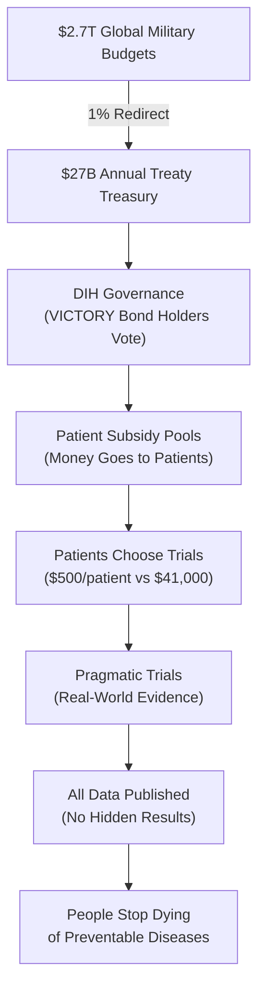

> **The 1% Treaty:** Every nation redirects just 1% of global military spending to fund 80X more efficient medical research, creating the most profitable investment in history while saving millions of lives.

 

## The Problem in Numbers

| What We Waste Money On | Annual Cost | What We Get |
|----------------|------------|-------------|
| War & Conflict | $9.7T | Destruction, refugees, and disabilities |
| Disease Burden | $109.1T | Suffering and lost potential |
| **Total Waste** | **$118.8T** | **The dumbest possible use of our limited resources** |
| **Medical Research** | **$0.068T** | Actual cures and treatments |

## The 1% Solution

We've created a system where:

1. **Nations redirect 1%** of military budgets to cure disease
2. **Patients get paid** to participate in clinical trials
3. **Research becomes 80x more efficient** using proven methods
4. **EVERYONE profits** from the $16.5T annual peace dividend

[How It Works](#how-it-works) | [The Math](#the-math) | [Get Involved](#join-the-war)

## Why This Works

✅ **Proven Model:** The Oxford RECOVERY trial showed we can run trials for $500 instead of $41,000 per patient  
✅ **Massive Leverage:** $1 in lobbying produces $1,813 in government contracts
✅ **Aligned Incentives:** Everyone gets rich by curing disease instead of killing people and  
✅ **No Losers:** Even partial success means 1% less war and nuclear bombs and more cures

## How It Works

### The 6-Step Process

1. **Get the Money**: The 1% Treaty redirects $27B/year from weapons to cures
2. **Allocate Efficiently**: The DIH uses democratic voting to fund what matters most  
3. **Pay Patients**: Subsidies go directly to patients who join trials
4. **Run Cheap Trials**: Pragmatic trials cost $500/patient instead of $41,000
5. **Publish Everything**: The dFDA shows real effectiveness data for every treatment
6. **Outcome Labels**: Every food and drug gets honest labels about what it actually does

### Current System vs. New System

**Current System:**
- $2.2B to develop one new treatment
- 17 years from discovery to patients  
- 95% of diseases have 0 FDA-approved treatments 

**New System:**
- ~$27M to develop one new treatment (80X cheaper)
- 2-3 years from discovery to patients 
- 1,000X more treatments tested with same global budget
- Every disease gets attention (patients pay to participate)

## The Math

### Investment Required vs. Returns

**Total Implementation Cost:** $1.2-2.5B over 36 months

**Annual Returns Once Operational:** $27B+ per year from 1% military budget redirections

**The Math:** We're asking for $2.5B to redirect $27B annually. That's a 10:1 return ratio - better than most venture capital investments, except this one saves millions of lives.

## The Plan: From Idea to Treaty

1.  **Prove the Mandate (The Global Referendum):** We will mobilize 3.5% of humanity (280 million people) through a global referendum. This creates an undeniable political mandate that no leader can ignore.

2.  **Fund the Mission (VICTORY Bonds):** We will raise the required $2.5B by selling **VICTORY Bonds**—an investment vehicle designed to offer ~40% annual returns, making peace more profitable than war.

3.  **Ratify the Treaty:** With a clear public mandate and a powerful financial engine, we will co-opt the existing political system to ratify the 1% Treaty and begin redirecting funds.

## Join the War on Disease

- **[Participate in the Referendum](mailto:hello@dih.earth)**: Signal your support and become part of the 3.5%.
- **[Join the Coalition](mailto:hello@dih.earth)**: We partner with institutions, companies, and non-profits.

## Table of Contents

### Part I: The $119 Trillion Central Planning Disaster
*   1.1 [Evolution Trapped Us in Violence](./brain/book/problem/the-evolutionary-trap.md)
*   1.2 [The NIH: How Soviet-Style Science Wastes $48B/Year](./brain/book/problem/nih-funding-is-broken.md)
*   1.3 [The FDA: Central Planning's Body Count](./brain/book/problem/fda-approvals-are-broken.md)
*   1.4 [Democracy's Failure: Why Voters Can't Fix This](./brain/book/problem/democracy-is-broken.md)

### Part II: Markets > Committees (The Solution)
*   2.1 [The DIH: Prediction Markets for Medical Research](./brain/book/solution/dih.qmd)
*   2.2 [The dFDA: Competition Beats Regulation](./brain/book/solution/dfda.md)
*   2.3 [The 1% Treaty: Redirecting Resources to What Works](./brain/book/solution/1-percent-treaty.md)
*   2.4 [Wishocracy: Democratic Markets for Public Goods](./brain/book/solution/wishocracy.md)

### Part III: Why Markets Win (The Theory)
*   3.1 [Hayek Was Right: The Knowledge Problem in Medicine](./brain/book/theory/hayek-knowledge-problem.md)
*   3.2 [Wisdom of Crowds: 280 Million Brains > 200 NIH Reviewers](./brain/book/theory/wisdom-of-crowds.md)
*   3.3 [Incentive Alignment: Why Everyone Wins](./brain/book/theory/incentive-alignment.md)
*   3.4 [Your Body is Just a Machine (And Markets Fix Machines)](./brain/book/proof/body-as-repairable-machine.md)

### Part IV: The Money (Making It Real)
*   4.1 [VICTORY Bonds: War Profiteering for Peace](./brain/book/economics/victory-bonds.qmd)
*   4.2 [The ROI: $27B → $16.5T Annual Returns](./brain/book/economics/economic-impact-summary.md)
*   4.3 [The Business Model: Insurance, Not Charity](./brain/book/solution/dih-integration-model.md)

### Part V: The Heist (Strategy)
*   5.1 [We're Not Fighting, We're Buying](./brain/book/strategy/co-opt-dont-compete.md)
*   5.2 [The Global Referendum: 280M Signatures = Unstoppable](./brain/book/strategy/global-referendum.md)
*   5.3 [Legal CYA: How Not to Go to Prison](./brain/book/strategy/legal-compliance-framework.md)
*   5.4 [The $2.5B Bribe Fund](./brain/book/strategy/fundraising-strategy.md)

### Part VI: Proof This Works
*   6.1 [RECOVERY Trial: Markets Already Won (80X Efficiency)](./brain/book/reference/recovery-trial.md)
*   6.2 [Historical Wins: When Decentralization Crushed Central Planning](./brain/book/proof/historical-precedents.md)
*   6.3 [Pre-1962: When Doctors > Bureaucrats](./brain/reference/historical-evidence-supporting-decentralized-efficacy-trials.md)

### Part VII: Pick Your Future
*   7.1 [Option A: Skynet + Cancer (Status Quo)](./brain/book/futures/dystopia-skynet-wins.md)
*   7.2 [Option B: Markets Cure Everything](./brain/book/futures/utopia-health-and-happiness.md)

### Part VIII: Join or Die (Literally)
*   8.1 [Sign the Referendum](./brain/book/call-to-action.md#referendum)
*   8.2 [Buy VICTORY Bonds](./brain/book/call-to-action.md#bonds)
*   8.3 [Spread the Virus (Information, Not Disease)](./brain/book/call-to-action.md#spread)

### Appendix: Reference Materials
*   A.1 [Frequently Asked Questions](./brain/book/reference/faq.md)
*   A.2 [Operations and Roadmap](./brain/book/reference/operations-roadmap.md)
