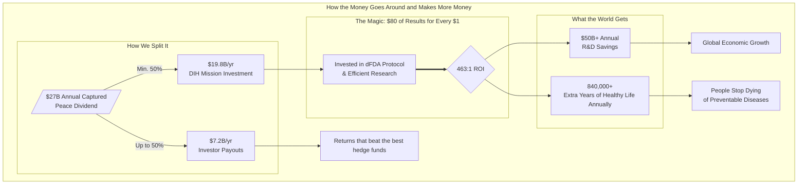

# The Complete Idiot's Guide to Ending War and Disease

If you're anything like me, you probably harbor some disdain for war and disease.
And you might have at one point found yourself muttering in a empty bus station, "But I'm just one complete idiot, what can I do?"

Well this is the book for you!  

We'll tell you how to persuade your species to stop murdering each other and destroying stuff and instead cure your grandma's dementia, lickety split!

## I. The Problem

### Problem 1. The Cost of War

War is:

1. incredibly stupid

AND 

2. _very expensive_! 

Indeed, humanity directly spends [\$2.72 trillion](./brain/book/references.md#sipri-2024-spending) per year on implements of its own destruction. 

These include many fine products such as nuclear bombs, bullets, autonomous AI weapon systems, hypersonic missiles, laser death rays, tanks that cost more than small countries, invisible fighter jets, cyberwarfare unicorns, and probably a secret orbital mind control satellite or two.

And if you consider the indirect costs, the bill is actually quite a bit larger.  

i.e. 
1. factories and power plants get blown up, so entire industries grind to a halt, wasting an ungodly amount of money
2. roads, bridges, and hospitals reduced to rubble, making it impossible for people to get to work, school, or even the doctor, also causing the loss of an ungodly amount of money
3. millions of children missing years of education, which means a less skilled workforce for decades (again costing everyone)
4. businesses are destroyed and and GDPs shrinking by double digits
5. millions forced to flee their homes, losing all their assets and starting over at zero.  (And moving is such a headache, am I right?)
6. outbreaks of disease and famine in the chaos
7. farmland get poisoned or mined, so food production collapses
 and, most insidiously, 
8. millions of people left with traumatic brain injuries, amputations, PTSD, and/or a plethora chronic illnesses (we aren't curing). So they can’t work, can’t support their families, and instead need lifelong care, draining public resources (welfare queens)

All in all, humanity is wasting [\$9.7 trillion every year](./brain/book/problem/cost-of-war.md) on this very weird hobby.

[Learn More](./brain/book/problem/cost-of-war.md)

### Problem 2. The Cost of Disease

And all the while, aging, disease, and entropy are very gradually destroying the cells you and everyone you've ever loved...

Despite this moderate concern, our species spends 40X less ([$67.5 billion](./brain/reference/global-government-medical-research-spending.md)) searching for cures to all diseases COMBINED. 

This is quite strange given that the average member of the species would say that preventing the complete dissolution of their mind and body would be 40X cooler than creating a nuclear winter. 

The Pentagon alone [can't account for $2.5 trillion](./brain/book/references.md#pentagon-unaccounted-2-5t) in assets—250 times larger than what we're asking them to redirect. **They lose more money by accident than we need to cure cancer.**

We haven't eradicated a single disease in [50 years](./brain/book/references.md#smallpox-eradicated). But we have [enough nuclear weapons to end civilization](./brain/book/references.md#nuke-winter-150tg) several times over. (Just in case the first apocalypse doesn't take.)

In our evolutionary past, when resources were scarce, violence was necessary for survival. But today we live in a world with enough food for everyone. In fact, nearly all starvation today is actually the RESULT of violent conflict.

### Why We Keep Being Idiots

War is profitable. 

Military contractors make billions. Politicians get campaign donations. Everyone's getting paid except the people getting shot.

---

## II. THE SOLUTION

So, if you're one of those guys who likes to think "outside the box", you might feel:

THE BEST IDEA IN THE WORLD: Instead of spending [$2.72 trillion](./brain/book/references.md#sipri-2024-spending) on enhancing our capacity to murder one and other and destroy everything, how about we use that money to do research to cure the diseases that will eventually cause your untimely demise?

PROBLEM: The logic concentration in that idea exceeds the maximum allowable limit for federal policy.

Back to the drawing board... 😖

SECOND BEST IDEA IN THE WORLD: 
Take just *1%* of our murder budget ($27 billion) and spent it helping people with diseases instead? Just 1%. 

We'd still have $2.69 trillion/year left over. 

That's still enough to kill 67.25 billion people (and we only have 8 billion).

### But how do we do it?

Simple. We bribe EVERYONE.

For every $1 the military-industrial complex spends on lobbying politicians, it receives over [$1,813 in government contracts](./brain/book/references.md#lobbying-roi-calc). 

So here's the plan: We do exactly the same thing in reverse.

We create a [1% Treaty](./brain/book/solution/1-percent-treaty.md) that says "Dear World Leaders: Please use 1% of your weapons budget to [Decentralized Institutes of Health (DIH)](./brain/book/solution/dih.md) that pays for patients to participate in super-efficient [pragmatic clinical trials](./brain/reference/recovery-trial.md) for the most promising new treatments."

Getting every government to ratify the treaty requires two things:

1. Prove [3.5% of humanity](./brain/book/references.md#3-5-rule) wants this (that's the magic number for unstoppable political movements).
2. Spend [$1-2.5 billion](./brain/book/economics/fundraising/fundraising-budget-breakdown.md) bribing the right people legally.

### Q: How do we get $2 billion and persuade the military industrial complex to help?

**A: We sell bonds designed to be the most profitable investment in the world.**

Remember World War II? America sold war bonds to fund the fight against fascism. We're doing the same thing, but for the War on Disease.

The military industrial complex is composed of humans that are not evil, they just like money. So we offer **[VICTORY bonds](./brain/book/economics/victory-bonds.md)** to anyone with a an ability to influence the ratification of the 1% treaty by any particular nation.

**The result:** Everyone gets richer by funding cures instead of destruction.

### How It Works: From $27 Billion to Curing Cancer

We can't change human nature. But we can change what pays.

Here's the complete system that makes curing people more profitable than killing them:

### The 6-Step Process:

1. **Get the Money**: The 1% Treaty redirects $27B/year from weapons to cures
2. **Allocate Efficiently**: The DIH uses democratic voting to fund what matters most  
3. **Pay Patients**: Subsidies go directly to patients who join trials
4. **Run Cheap Trials**: Pragmatic trials cost $500/patient instead of $41,000
5. **Publish Everything**: The dFDA shows real effectiveness data for every treatment
6. **Label Outcomes**: Every food and drug gets honest labels about what it actually does

### What's Possible:

**Current System:**
- **$2.2 billion** to develop one new treatment
- **17 years** from discovery to patients  
- **95% of diseases** have 0 FDA-approved treatments 

**New System:**
- **~$27 million** to develop one new treatment (80X cheaper)
- **2-3 years** from discovery to patients (Oxford RECOVERY speed)
- **1,000X more treatments** tested with same global budget
- **Every disease** gets attention (patients pay to participate)

**Result**: We know what works, what doesn't, people get paid to help us find out, and we do it 80X faster and cheaper.

```mermaid
graph TD;
    subgraph "The Complete System: From Killing to Curing";
        A["$2.7T Global Military Budgets"];
        
        A -->|"1% Redirect"| B["$27B Annual Treaty Treasury"];
        
        subgraph "Democratic Allocation";
            B --> C["DIH Governance<br/>(VICTORY Bond Holders Vote)"];
            C --> D["Patient Subsidy Pools<br/>(Money Goes to Patients)"];
        end
        
        subgraph "80X More Efficient Research";
            D --> E["Patients Choose Trials<br/>($500/patient vs $41,000)"];
            E --> F["Pragmatic Trials<br/>(Real-World Evidence)"];
            F --> G["All Data Published<br/>(No Hidden Results)"];
        end
        
        subgraph "What Everyone Gets";
            G --> H["Treatment Effectiveness Rankings<br/>(What Actually Works)"];
            H --> I["Outcome Labels<br/>(Showing Effects of All Foods & Drugs)"];
            I --> J["People Stop Dying<br/>of Preventable Diseases"];
        end
        
        subgraph "The Flywheel";
            J --> K["More People Want This"];
            K --> L["Politicians Support It"];
            L --> M["More Countries Join"];
            M --> B;
        end
    end
```

---

## III. A World Without War and Disease

Here's what happens when we stop wasting money on bombs and start spending it on not dying:

### Your Life in 2035

Your kid gets diagnosed with some rare genetic disease. Instead of bankruptcy and death, the doctor sequences her DNA, finds the problem, and designs a treatment. It gets made at the local pharmacy. The whole thing costs you nothing because the research was funded by the health budget we redirected from buying bombs.

Cancer becomes treatable, like strep throat is now. Alzheimer's gets cured. Heart disease becomes optional. You live as long as you want to live, and you stay healthy while you do it.

Your great-grandchildren will read about people dying of cancer the way you read about people dying of polio. It will seem primitive and tragic and completely unnecessary.

### The Economics of a World Without War and Disease

When we stop spending [$2.72 trillion per year](./brain/book/references.md#sipri-2024-spending) on ways to kill each other and start spending it on reducing suffering and improving the human condition:

- **Healthcare costs approach zero.** With diseases cured and aging reversed, the multi-trillion dollar burden of "sick care" disappears.
- **The $16.5 trillion annual cost of violence gets repurposed.** This money, once wasted on destruction, now gets invested in clean energy, space exploration, and making life better.
- **Human potential becomes unlimited.** When people can choose how long to live and stay healthy while doing it, we can finally see what humans are actually capable of.

This is the world we can start creating today.

## The Plan

**Goal:** Make curing people more profitable than murdering them.

**Step 1:** Give everyone on Earth a stake in the outcome. Reward every person who votes on the global referendum with **VOTE points**—your proof that you'll get paid from the [$16.5 trillion annual peace dividend](./brain/book/economics/peace-dividend-value-capture.md) you help create (see [How to Stay Out of Prison](./brain/book/strategy/legal-compliance-framework.md)).

**Step 2:** When we hit [3.5% of humanity](./brain/book/references.md#3-5-rule), we have proof the world wants this.

**Step 3:** After the treaty is ratified, VOTE points become convertible to VICTORY bonds—you get to own part of the **$27B+ annual health treasury** and vote on how the money gets spent (see [VICTORY Bonds — Incentive Mechanics](./brain/book/economics/victory-bonds.md)).

**Step 4:** Build a legal political engine: independent‑expenditure committees that pledge massive support for candidates who vote with their district's referendum result—and fund challengers against those who defy it.

**Step 5:** The treasury funds EVERYONE in health - universities, pharma, nonprofits, government agencies - through democratically controlled funding pools.

---

## IV. THE FINANCIAL ENGINE (Why This Works)

## VICTORY Bonds: Bootstrap Funding Model

**[VICTORY Bonds](./brain/book/economics/victory-bonds.md):** Bootstrap funding now, repaid by treaty inflows.

Here are our two simple rules:

1. **We're Going to Try to Make You Filthy Rich:** About 40% returns per year, which beats just about everything. That's ~28x your money back over 10 years.
2. **But We Won't Forget Why We're Here:** No matter how much money we make, we'll never give more than half to investors. The other half goes to actually curing diseases. Because what's the point of getting rich if everyone you love is dead?

We pay investors most of their money up front (~$7.23B per year when everything works) as fast as the treaty money comes in. The 40% annual return is spread over 10 years, but we front-load it so investors get their money quickly and don't have to worry about us disappearing.

## The DIH Treasury: 80X More Efficient Research

**[Decentralized Institutes of Health (DIH)](./brain/book/solution/dih.md):** A treasury that funds research 80X cheaper. The DIH doesn't fund the [old, broken system](./brain/book/problem/problems-in-clinical-research.md)—it funds a **decentralized FDA (dFDA) system** with proven results:

- **[80X Greater Efficiency](./brain/reference/recovery-trial.md):** The dFDA model cuts per-patient trial costs from [$41,000](./brain/book/references.md#trial-cost-41k) to as low as [$500](./brain/book/references.md#recovery-cost-500), an 80X efficiency gain **already proven** by the [Oxford RECOVERY trial](./brain/reference/recovery-trial.md), which saved over 1 million lives globally.
- **[$50 Billion in Annual Savings](./brain/book/economics/dfda-cost-benefit-analysis.md):** By making research cheaper and faster, the dFDA system is projected to save the global R&D industry ~$50 billion annually—**based on actual performance data, not projections**.
- **[840,000+ Extra Years of Healthy Life](./brain/book/economics/dfda-cost-benefit-analysis.md):** The system is projected to generate over 840,000 extra years of healthy life annually through faster drug access and new therapies—**This isn't some pie-in-the-sky idea. The Oxford RECOVERY trial already proved you can run medical trials for $500 per patient instead of $41,000. We're just going to do more of that**.

**Specialized programs fund existing institutions:**

- Decentralized Institute of Mental Health → funds universities, pharma, nonprofits working on depression, anxiety, etc.
- Decentralized Institute of Cancer Research → funds MD Anderson, pharmaceutical companies, patient advocacy groups
- Decentralized Institute of Aging → funds longevity research at every institution

**Everyone gets more money, powered by a system that actually works. No one gets displaced.**

## Investment Required vs. Returns

**Total Implementation Cost:** $1.2-2.5B over 36 months

**What This Buys:** For a detailed breakdown of our multi-phase fundraising strategy and a line-item budget, see our full [Fundraising & Budget Plan](./brain/book/economics/fundraising/fundraising-budget-breakdown.md).

- Global referendum "Proof-of-Vote" points platform (~$5-10M)
- Independent expenditures in priority elections (~$800M-1.5B)
- Targeted legal bribes to co-opt the MIC (~$100-200M)
- Building the system and testing it (~$250-400M)
- Staying out of prison and writing the treaty (~$100-200M)

**Annual Returns Once Operational:** $27B+ per year from 1% military budget redirections

**ROI Timeline:** 18-36 months after first treaty ratification

**Break-even Analysis:** Even in a conservative partial success scenario where only the **US, EU, & UK** participate (generating **$13B annually**), the system generates a **cash payout of $6.5B (2.6X the initial $2.5B investment)** in the first year of operation alone.

**The Math:** We're asking for $2.5B to redirect $27B annually. That's a 10:1 return ratio - better than most venture capital investments, except this one saves millions of lives.

This simple model ensures that even in conservative scenarios, the DIH remains massively well-funded while providing returns that beat the best hedge funds. For a complete breakdown, see our [Dynamic Cash Flow Model](./brain/book/economics/dih-treasury-cash-flow-model.md).

---

## V. THE BRIBERY STRATEGY (How to Bribe Literally Everyone)

## The Core Strategy: Co-opt, Don't Compete

**We don't fight the military-industrial complex. We make them a better offer.**

We turn today's **War Contractors** into tomorrow's **Peace Contractors** by paying them more.

**Current Military Contractor Economics:**

- [$1.1 billion lobbying](./brain/book/references.md#lobbying-1-1b) (2001-2021) → [$2.02 trillion contracts](./brain/book/references.md#contracts-2-02t)
- **Return: $1,813 per $1 spent on lobbying**
- Politicians get modest campaign donations and revolving door jobs

## How We Bribe Everyone

We start with rich people who want to get richer, then move on to politicians. It's depressingly predictable, but it works.

### 1. Rich People Get Richer
We offer **[VICTORY Bonds](./brain/book/economics/victory-bonds.md)** that pay better returns than the best hedge funds (~40% annually) plus governance control over the $27 billion treasury. Rich people like making money. We help them make more money by funding cures instead of bombs.

### 2. Regular People Get Paid
Citizens get **VOTE points** for participating in the global referendum. After the treaty passes, these become real ownership in the health treasury they helped create. 280 million people with skin in the game create unstoppable political pressure.

### 3. Politicians Get Everything
Leaders who support the treaty get: popular support from millions of voters, campaign money, the ability to direct research funding to their districts, and personal investment opportunities. Leaders who oppose it get voted out by people who want their money.

For the full bribery playbook, see **[Chapter 7: Strategy](./brain/book/strategy.md)**.

## Why Everyone Will Take Our Deal

*We're offering arms dealers more money to save lives than they currently make blowing things up. Turns out most people aren't actually evil—they just respond to incentives.*

**Simple Math:** We offer everyone more money than they're making now, plus the moral high ground of saving lives instead of ending them. When peace pays better than war, rational people choose peace.

**The Cycle:** Rich people fund the referendum. The referendum creates political pressure. Politicians pass the treaty. The treaty creates the $27 billion treasury. The treasury makes everyone richer and cures diseases. More people want this. The cycle accelerates.

We legally bribe our way to a world without war and disease.

---

## VI. PROOF & PRECEDENTS (Why This Isn't Insane)

Why the math actually works:

### 1. We're Redirecting Waste, Not Raising New Money

- The Pentagon [cannot account for $2.5 trillion](./brain/book/references.md#pentagon-unaccounted-2-5t) in existing assets—our US ask is 0.4% of their unaccounted waste
- This isn't "find new money"—it's "stop losing the money you already have"
- Global military waste is the largest pool of misallocated capital on the planet

### 2. The 80X Efficiency Gain Is Already Proven

- Oxford RECOVERY trial: [$500 per patient vs. $41,000 traditional](./brain/book/references.md#recovery-cost-500)—saved over 1 million lives globally
- NIH RECOVER: [$1.6 billion, zero completed trials in 4 years](./brain/reference/recovery-trial.md)
- **This isn't theoretical. The efficiency gain already happened and saved millions.**

### 3. Mass Political Mobilization Works

- [3.5% mobilization has never failed](./brain/book/references.md#3-5-rule) in recorded history (Chenoweth, Harvard)
- War bonds: [$185 billion raised from 85 million Americans](./brain/book/references.md#wwii-war-bonds) during WWII
- Our referendum creates the largest political mandate in human history—when 280 million people vote for something, politicians listen

### 4. Financial Incentives Is Stronger Than Legal Enforcement

- [$16.5 trillion annual cost of violence](./brain/book/references.md#global-violence-costs)—we capture 0.16% of this waste
- Leaders of nations that default face immediate political consequences. We don't enforce this through international courts. We enforce it by giving massive campaign support to leaders who comply and funding their opponents if they don't.
- Bribing politicians works better than suing them in international court.

### 5. We Co-opt Rather Than Compete

- Military contractors' current ROI: [$1,813 per $1 spent on lobbying](./brain/book/references.md#lobbying-roi-calc)
- Our offer: >40% CAGR bonds + governance of $27B treasury + personal wealth creation
- **When peace pays better than war, rational actors choose peace**

**The Bottom Line:** We're not creating money out of thin air. We're redirecting money that's already being wasted into a system that produces 80X better results with mathematical precision.

## Historical Precedents (Evidence This Could Actually Work)

- Decentralized coalitions can create binding law: the International Campaign to Ban Landmines led to the 1997 Ottawa Treaty (see [ICBL](./brain/book/references.md#icbl-ottawa-treaty)).
- Mobilizing private capital for public missions works: [World War II war bonds](./brain/book/references.md#wwii-war-bonds) financed national efforts at scale.
- New global health institutions can marshal billions effectively: the [Global Fund to Fight AIDS, Tuberculosis and Malaria](./brain/book/references.md#global-fund) proves rapid, coordinated international funding is achievable.

## Why 1% Less Military = More Security

**Modern weapons make everyone less safe:**

- Nuclear weapons: [1% fewer = ~120 fewer nukes worldwide](./brain/book/references.md#world-warheads)
- AI weapons systems: Reduce global AI arms race escalation
- Cyber warfare tools: Less proliferation of attack capabilities

**Real security threats are health-based:**

- [Pandemics kill more people than wars](./brain/book/references.md#pandemics-vs-wars) (COVID-19: 7M+ deaths vs. annual conflict deaths ~100K)
- Antibiotic resistance could kill [10M/year by 2050](./brain/book/references.md#amr-10m-2050)
- [Mental health crises destabilize societies](./brain/book/references.md#mental-health-burden) more than foreign armies

**1% reallocation = stronger nations:**

- Healthier populations are more productive
- Medical breakthroughs boost economic competitiveness
- Reduced healthcare costs free up MORE budget for military spending if needed

### The Ultimate Failsafe: The Worst-Case Scenario is Still a Win

Even if the Decentralized Institutes of Health were a completely inefficient failure and or we just dumped the $27B into the ocean, the world would _still_ be better off.

Why?

We would still have a **1% reduction in the global capacity for wanton death and destruction.**

The worst possible outcome of this plan is still a net gain for global security. The best possible outcome is that we cure your cancer.

### The Peace Dividend: The Economic Engine of Victory

Here's where our money comes from: Violence costs humanity **$16.5 trillion every year**. That's the biggest pile of wasted money on the planet.

- **The Captured Dividend (What we get):** We redirect **$27 billion annually** from military spending to curing disease. That's our actual cash flow that pays for everything.
- **The Societal Dividend (What everyone gets):** When we reduce global violence by just 1%, everyone else gets **$165 billion in annual economic value** back through less destruction and more stability.

We capture the first $27B to unlock the full $165B for everyone. For a detailed breakdown, see [The Peace Dividend: Value Capture & Distribution Model](./brain/book/economics/peace-dividend-value-capture.md).

---

## VII. OBJECTIONS & RESPONSES

For a detailed list of common objections and our responses, please see our [FAQ](./brain/book/FAQ.md).

## VIII. SECURITY & GOVERNANCE

A $27B treasury is a massive target. Our security model is designed to be uncorruptible by eliminating human targets and relying on transparent, automated, and battle-tested protocols that already secure billions.

For a detailed breakdown of the multi-layered defense, AI-powered fraud detection, and technical architecture, see the full **[Governance & Security Protocol](./brain/book/governance.md)**.

---

## IX. HOW YOU CAN HELP: Join the War on Disease

**[Get your referendum link](./brain/book/strategy/referendum/global-referendum-implementation.md)** → Earn VOTE points for each person who votes via your link. After the treaty passes, your points become convertible to VICTORY bonds.

**[Request an organization link](./brain/book/strategy/referendum/global-referendum-implementation.md#organization-links)** → Mobilize your organization to earn rewards for verified votes. Access pooled bonus funds for building coalitions.

**[Buy VICTORY bonds](./brain/book/economics/victory-bonds.md)** → Fund the treasury, get repaid with interest when treaties pass.

**[Calculate your institution's allocation](./brain/book/strategy/institutional-funding-calculator.md)** → See how much your university/company/nonprofit would receive.

**[Join the coalition](./brain/book/strategy/coalition-building.md)** → Help coordinate health institutions to support the treaty.

---

## For Institutions

**Pharmaceutical companies:** Get 2-5X more R&D funding for the same work. **Plus:** Executives can personally invest in [VICTORY Bonds](./brain/book/economics/victory-bonds.md) and profit while their companies benefit.

**Universities:** Way more research money for all your health departments. And your administrators can personally profit from the system that's funding their institutions.

**Patient groups:** Direct funding for whatever disease you're fighting. And your leadership and members can invest in the treasury that funds your cause.

**Government health agencies:** Bigger budgets without having to beg Congress. And officials can personally invest in the system that's boosting their agency's funding.

**Two Things at Once:** Your Organization Gets More Funding, You Get Rich

*Why choose between doing good and doing well when you can do both? Your cancer research center gets more money, and you personally profit from the system that funds it.*

**Contact us:** [institutions@warondisease.org](mailto:institutions@warondisease.org) to calculate your potential funding increase and personal investment opportunities.

---

## Learn More

**Solutions:** Address the main objections that could kill this proposal:

- [Free Rider Problem Solution](./brain/book/strategy/free-rider-solution.md) - How we make them pay
- [How to Stay Out of Prison](./brain/book/strategy/legal-compliance-framework.md) - Election and securities law compliance
- [Impact Securities and Digital Public Goods Financing Act (Draft)](./brain/book/legal/impact-securities-reform.md) - Model law to enable compliant, low‑friction financing via on‑chain reporting and impact securities
- [Verification & Fraud Prevention](./brain/book/strategy/verification-and-fraud-prevention.md) - Scale verification for 280M people

**Strategy:** [The War on Disease: A New Strategy for a New Era](./brain/book/strategy/war-on-disease-strategy.md)

**Treasury:** [DIH funding model](./brain/book/solution/dih.md)

**Coalition:** [How institutions can work with us](./brain/book/strategy/coalition-building.md)

**Treaty:** [Full 1% Treaty text](./brain/book/solution/1-percent-treaty.md)

---

# The Complete Idiot's Guide to Ending War and Disease

## Table of Contents

### Chapter 1: Problems
a. [The Cost of War](./brain/book/problem/cost-of-war.md)  
b. [The Cost of Disease](./brain/book/problem/cost-of-disease.md)  
c. [Why NIH is Terrible at Funding Research](./brain/book/problem/nih-funding-is-broken.md)  
d. [Why FDA is Unsafe and Ineffective](./brain/book/problem/fda-approvals-are-broken.md)  
e. [Why Representative Democracy is Unrepresentative](./brain/book/problem/democracy-is-broken.md)

### Chapter 2: Solution
- [The 1% Treaty](./brain/book/solution/1-percent-treaty.md) 
- [The Global Referendum on War and Disease](./brain/book/solution/1-percent-treaty.md) 
- [VICTORY Bonds: The Most Profitable Investment in the History of the World](./brain/book/economics/victory-bonds.md)  
- [The Decentralized Institutes of Health](./brain/book/solution/dih.md)  
- [Wishocracy: Quantifying Collective Preferences](./brain/book/solution/wishocracy.md)
- [The Decentralized FDA](./brain/book/solution/dfda.md)  

### Chapter 3: Economics
a. [The $16.5T Peace Dividend](./brain/book/economics/peace-dividend-value-capture.md)  
b. [Why This Is The Best Investment in the History of the Universe](./brain/book/economics/investment-thesis.md)  
c. [Math Says It's Good](./brain/book/economics/economic-impact-summary.md)  

### Chapter 4: Legal
- [How to Stay Out of Prison](./brain/book/strategy/legal-compliance-framework.md)  

### Chapter 5: Proof (Why This Isn't Completely Insane)
a. [We Already Proved the 80X Efficiency Thing Works](./brain/book/reference/recovery-trial.md)  
b. [How Humans Have Done This Before](./brain/book/proof/historical-precedents.md)  
c. [Historical Evidence for Decentralized Efficacy Trials](./brain/reference/historical-evidence-supporting-decentralized-efficacy-trials.md)
d. [The Economic Proof: Why the Math Actually Works](./brain/book/proof/economic-proof.md)  
e. [Political Proof: How Mass Movements Win](./brain/book/proof/political-proof.md)  

### Chapter 6: Join the War on Disease
a. [Get Started Here: Your Next Steps to Join the War on Disease](./brain/book/call-to-action.md)  
b. [Contributing Guide: How to Help Write This Book](./CONTRIBUTING.md)  
c. [Evidence Library: All the Data That Proves We're Right](./brain/reference/)  

