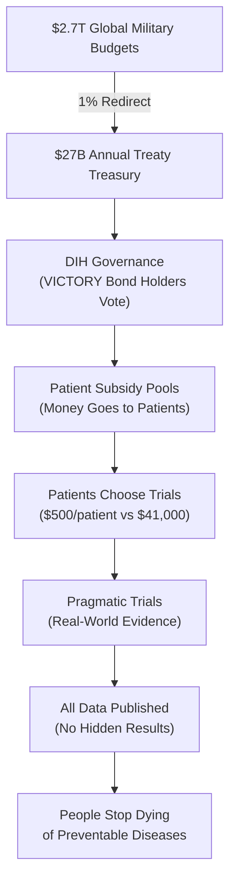

> **The 1% Treaty:** Every nation redirects just 1% of global military spending to fund 80X more efficient medical research, creating the most profitable investment in history while saving millions of lives.

 

## The Problem in Numbers

| What We Waste Money On | Annual Cost | What We Get |
|----------------|------------|-------------|
| War & Conflict | $9.7T | Destruction, refugees, and disabilities |
| Disease Burden | $109.1T | Suffering and lost potential |
| **Total Waste** | **$118.8T** | **The dumbest possible use of our limited resources** |
| **Medical Research** | **$0.068T** | Actual cures and treatments |

## The 1% Solution

We've created a system where:

1. **Nations redirect 1%** of military budgets to cure disease
2. **Patients get paid** to participate in clinical trials
3. **Research becomes 80x more efficient** using proven methods
4. **EVERYONE profits** from the $16.5T annual peace dividend

[How It Works](#how-it-works) | [The Math](#the-math) | [Get Involved](#join-the-war)

## Why This Works

✅ **Proven Model:** The Oxford RECOVERY trial showed we can run trials for $500 instead of $41,000 per patient  
✅ **Massive Leverage:** $1 in lobbying produces $1,813 in government contracts
✅ **Aligned Incentives:** Everyone gets rich by curing disease instead of killing people and  
✅ **No Losers:** Even partial success means 1% less war and nuclear bombs and more cures

## How It Works

### The Market Revolution in Medical Research

1. **Replace Central Planning**: NIH's Soviet-style committees → DIH's prediction markets and wisdom of crowds
2. **Amazon for Trials**: dFDA creates an open marketplace where treatments compete on real results, not lobbying
3. **Universal Integration**: One-click trial enrollment from any EHR, health app, or doctor's office
4. **80X Efficiency**: Market competition drives costs from $41,000 to $500/patient (Oxford proved it)
5. **Radical Transparency**: All data public, all results ranked - like Amazon reviews but for staying alive
6. **Pay for Success**: Researchers get rich by curing diseases, not by writing grant proposals

### Central Planning vs. Free Markets

**Current System (NIH/FDA Central Planning):**
- $2.2B per drug (committees pick losers)
- 17 years to market (bureaucracy moves at bureaucracy speed)
- 90% grant rejection rate (200 reviewers play god with $48B)
- 95% of diseases have 0 treatments (committees don't care about rare diseases)
- 15% patient access (gatekeepers everywhere)

**New System (DIH/dFDA Free Markets):**
- ~$27M per treatment (competition drives efficiency)
- 2-3 years to market (markets move at market speed)
- Fund everything, measure results (let data pick winners)
- 1,000X more treatments tested (markets find every niche)
- 100% patient access (Amazon doesn't turn away customers)

## The Math

### Investment Required vs. Returns

**Total Implementation Cost:** $1.2-2.5B over 36 months

**Annual Returns Once Operational:** $27B+ per year from 1% military budget redirections

**The Math:** We're asking for $2.5B to redirect $27B annually. That's a 10:1 return ratio - better than most venture capital investments, except this one saves millions of lives.

## The Plan: From Idea to Treaty

1.  **Prove the Mandate (The Global Referendum):** We will mobilize 3.5% of humanity (280 million people) through a global referendum. This creates an undeniable political mandate that no leader can ignore.

2.  **Fund the Mission (VICTORY Bonds):** We will raise the required $2.5B by selling **VICTORY Bonds**—an investment vehicle designed to offer ~40% annual returns, making peace more profitable than war.

3.  **Ratify the Treaty:** With a clear public mandate and a powerful financial engine, we will co-opt the existing political system to ratify the 1% Treaty and begin redirecting funds.

## Join the War on Disease

- **[Participate in the Referendum](mailto:hello@dih.earth)**: Signal your support and become part of the 3.5%.
- **[Join the Coalition](mailto:hello@dih.earth)**: We partner with institutions, companies, and non-profits.

## Book Outline

> **This is the complete skeleton of the book showing the exact narrative structure.**
>
> **Hierarchy:**
> - **Parts** = Major thematic sections (I, II, III, etc.)
> - **Chapters** = Main arguments/topics (1, 2, 3, etc.)
> - **Sections** = Key points within chapters (1.1, 1.2, etc.)
> - **Subsections** = Supporting details (1.1.1, 1.1.2, etc.)
>
> **Format:** "[Core Concept]: [Dark Humor Description]" for memorability
>

### Part I: The Problem (Everyone You Love Is Dying While We Build Better Bombs)

#### Chapter 1: The $119 Trillion We Spend on Dying Creatively
*   1.1 [Evolution Gave Us Murder Brains (Thanks, Natural Selection)](./brain/book/problem/the-evolutionary-trap.qmd)
    *   1.1.1 [Tribalism: Why Your Brain Thinks Dave From Accounting Is The Enemy](./brain/book/problem/tribalism-biology.qmd)
    *   1.1.2 [Fight or Flight: Great for Tigers, Terrible for Cancer](./brain/book/problem/stress-response-mismatch.qmd)
    *   1.1.3 [Status Games: Why We'd Rather Be Dead Kings Than Living Peasants](./brain/book/problem/status-hierarchy-drives.qmd)
*   1.2 [War: Humanity's Most Expensive Hobby](./brain/book/problem/cost-of-war.qmd)
    *   1.2.1 [Direct Costs: $2.7T for Bombs That Go Boom](./brain/book/problem/military-budget-breakdown.qmd)
    *   1.2.2 [Opportunity Costs: Every Missile Is a Cancer Lab We Didn't Build](./brain/book/problem/opportunity-cost-analysis.qmd)
    *   1.2.3 [Hidden Costs: PTSD, Refugees, and Orphans (The Gift That Keeps Taking)](./brain/book/problem/war-externalities.qmd)
*   1.3 [The Cost of Disease: A Slow-Motion Apocalypse](./brain/book/problem/cost-of-disease.qmd)
    *   1.3.1 [Economic Burden: $109T in Lost Productivity (Dead People Don't Buy Things)](./brain/book/problem/disease-economic-impact.qmd)
    *   1.3.2 [Human Cost: 55 Million Deaths Per Year (That's 150,000 Daily)](./brain/book/problem/disease-mortality-statistics.qmd)
    *   1.3.3 [The Suffering Tax: Pain You Can't Put in a Spreadsheet](./brain/book/problem/quality-of-life-costs.qmd)

#### Chapter 2: Central Planning Kills (Ask the Soviets. Oh Wait, You Can't)
*   2.1 [The NIH: How Soviet-Style Science Wastes $48B/Year](./brain/book/problem/nih-funding-is-broken.qmd)
    *   2.1.1 [Grant Writing: Scientists Spend 50% of Time Begging for Money](./brain/book/problem/grant-writing-waste.qmd)
    *   2.1.2 [The 90% Rejection Rate: Good Ideas Die in Committee](./brain/book/problem/nih-rejection-statistics.qmd)
    *   2.1.3 [Political Allocation: Why Breast Cancer Gets More Than Brain Cancer](./brain/book/problem/disease-funding-politics.qmd)
    *   2.1.4 [The Old Boys Club: Average First Grant Age Is 45](./brain/book/problem/nih-age-discrimination.qmd)
*   2.2 [The FDA: Killing You Safely Since 1962](./brain/book/problem/fda-approvals-are-broken.qmd)
    *   2.2.1 [17 Years to Approval: People Die Waiting for Paperwork](./brain/book/problem/fda-timeline-deaths.qmd)
    *   2.2.2 [The $2.2B Entry Fee: Why Only Big Pharma Can Play](./brain/book/problem/fda-cost-barrier.qmd)
    *   2.2.3 [One-Size-Fits-None: Why Your Genetics Don't Matter to Regulators](./brain/book/problem/fda-personalization-failure.qmd)
    *   2.2.4 [The Thalidomide Overcorrection: How One Mistake Created Millions](./brain/book/problem/fda-risk-aversion.qmd)
*   2.3 [Democracy: Where 535 Lawyers Pretend to Understand Biology](./brain/book/problem/democracy-is-broken.qmd)
    *   2.3.1 [Congressional Science Literacy: They Think WiFi Causes Cancer](./brain/book/problem/political-science-ignorance.qmd)
    *   2.3.2 [The 2-Year Attention Span: Why Long-Term Problems Never Get Solved](./brain/book/problem/electoral-cycle-problem.qmd)
    *   2.3.3 [Lobbyist Math: $1 Million Buys $1 Billion in Influence](./brain/book/problem/lobbying-roi.qmd)

#### Chapter 3: A Century of Failed Reforms (Or: Why Asking Nicely Doesn't Work)
*   3.1 [The Peace Movement: Brought Flowers to a Money Fight](./brain/book/problem/peace-movement-failures.qmd)
    *   3.1.1 [Vietnam Protests: Millions Marched, Nothing Changed](./brain/book/problem/vietnam-protest-failure.qmd)
    *   3.1.2 [Nuclear Freeze Movement: Great PR, Zero Warheads Reduced](./brain/book/problem/nuclear-freeze-failure.qmd)
    *   3.1.3 [Occupy Wall Street: Drum Circles Don't Beat Derivatives](./brain/book/problem/occupy-failure-analysis.qmd)
*   3.2 [Healthcare Reform: Rearranging Deck Chairs on the Titanic](./brain/book/problem/healthcare-reform-failures.qmd)
    *   3.2.1 [Obamacare: Insurance for Everyone, Cures for No One](./brain/book/problem/aca-reform-limits.qmd)
    *   3.2.2 [Medicare Part D: We Subsidized Pills Instead of Prevention](./brain/book/problem/medicare-pharma-capture.qmd)
    *   3.2.3 [The War on Cancer: 50 Years, $500B, Still Losing](./brain/book/problem/war-on-cancer-failure.qmd)
*   3.3 [Why You Can't Beat Boeing With a Bake Sale](./brain/book/problem/why-reforms-failed.qmd)
    *   3.3.1 [Diffuse Costs, Concentrated Benefits: Economics 101](./brain/book/problem/public-choice-basics.qmd)
    *   3.3.2 [The Passion Gap: They Get Paid, You Get Tired](./brain/book/problem/activism-burnout.qmd)
    *   3.3.3 [Wrong Weapons: Moral Arguments vs Financial Artillery](./brain/book/problem/strategy-mismatch.qmd)

### Part II: The Solution (Bribe Everyone Until They Stop Killing People)

#### Chapter 4: The 1% Treaty (The Smallest Possible Ask That Still Works)
*   4.1 [Just 1%: You Can Still Blow Up the World 67 Times Instead of 68](./brain/book/solution/1-percent-treaty.qmd)
    *   4.1.1 [The Psychology of 1%: Small Enough to Swallow, Big Enough to Matter](./brain/book/solution/one-percent-psychology.qmd)
    *   4.1.2 [Treaty Design: Every Loophole Closed With Money](./brain/book/solution/treaty-legal-structure.qmd)
    *   4.1.3 [The Ratchet Mechanism: 1% Today, 50% Eventually](./brain/book/solution/incremental-increase-strategy.qmd)
*   4.2 [Every Nation Reduces Together (No Cheating, We Have Satellites)](./brain/book/solution/treaty-enforcement.qmd)
    *   4.2.1 [Verification: Blockchain + Satellites + Whistleblower Rewards](./brain/book/solution/verification-mechanisms.qmd)
    *   4.2.2 [Punishment: Economic Sanctions That Actually Hurt](./brain/book/solution/enforcement-economics.qmd)
    *   4.2.3 [The Coalition Effect: Peer Pressure With Teeth](./brain/book/solution/coalition-dynamics.qmd)

#### Chapter 5: Replace Committees With Markets (Because Amazon > DMV)
*   5.1 [Decentralized Institutes (DIH): The Money Router That Replaces Committees](./brain/book/solution/dih.qmd)
    *   5.1.1 [Money Flow: Treaty → DIH → Patients → Cures](./brain/book/solution/dih-money-flow.qmd)
    *   5.1.2 [VICTORY Bond Governance: Investors Vote, Not Bureaucrats](./brain/book/solution/dih-governance.qmd)
    *   5.1.3 [Insurance Model: Why We're Not "Paying Patients"](./brain/book/solution/dih-insurance-model.qmd)
    *   5.1.4 [Disease-Specific DAOs: Let Cancer Patients Allocate Cancer Money](./brain/book/solution/specialized-daos.qmd)
*   5.2 [Decentralized FDA (dFDA): Amazon for Clinical Trials](./brain/book/solution/dfda.qmd)
    *   5.2.1 [Outcome Labels: Like Nutrition Labels But For Not Dying](./brain/book/solution/dfda-outcome-labels.qmd)
    *   5.2.2 [Treatment Rankings: Prescribing Based on 8 Billion Data Points](./brain/book/solution/dfda-treatment-rankings.qmd)
    *   5.2.3 [Global Registry: Every Treatment, Every Result, No Hiding](./brain/book/solution/dfda-registry.qmd)
    *   5.2.4 [Digital Twin Safe: Your Health Data Clone (But Anonymous)](./brain/book/solution/dfda-digital-twin.qmd)
    *   5.2.5 [FDAi Agent: Free 24/7 AI Doctor (Powered by Everyone's Experience)](./brain/book/solution/dfda-ai-doctor.qmd)
    *   5.2.6 [Real-World Evidence: Your Fitbit Knows More Than Phase 3 Trials](./brain/book/solution/real-world-data.qmd)
*   5.3 [Wishocracy: Tinder for Budget Allocation (Swipe Right on Cancer Research)](./brain/book/solution/wishocracy.qmd)
    *   5.3.1 [Pairwise Voting: Cancer vs Alzheimer's (You Choose)](./brain/book/solution/pairwise-comparison.qmd)
    *   5.3.2 [Quadratic Voting: Rich People Can't Buy All the Votes](./brain/book/solution/quadratic-voting-math.qmd)
    *   5.3.3 [AI Aggregation: 8 Billion Opinions Become One Smart Budget](./brain/book/solution/preference-aggregation.qmd)

#### Chapter 6: How to Make Death Unprofitable
*   6.1 [Defense Contractors: "We'll Pay You More to Build MRI Machines"](./brain/book/solution/converting-defense-contractors.qmd)
    *   6.1.1 [The Numbers: Medical Devices Have 70% Margins Too](./brain/book/solution/medical-device-economics.qmd)
    *   6.1.2 [Same Engineers, Different Output: Guidance Systems → Surgical Robots](./brain/book/solution/skill-transferability.qmd)
    *   6.1.3 [The Transition Fund: We'll Pay for Your Retooling](./brain/book/solution/conversion-subsidies.qmd)
*   6.2 [Big Pharma: "Curing Disease Pays Better Than Managing It"](./brain/book/solution/pharma-incentives.qmd)
    *   6.2.1 [Subscription Model: Get Paid for Healthy People, Not Sick Ones](./brain/book/solution/pharma-subscription-model.qmd)
    *   6.2.2 [Patent Buyouts: We'll Pay You to Open Source](./brain/book/solution/patent-liberation.qmd)
    *   6.2.3 [The Cure Bonus: $10B for Eliminating a Disease](./brain/book/solution/cure-incentives.qmd)
*   6.3 [Politicians: "Dead Voters Can't Re-elect You"](./brain/book/solution/political-incentives.qmd)
    *   6.3.1 [Campaign Finance: We Outspend the Death Lobby](./brain/book/solution/political-funding-strategy.qmd)
    *   6.3.2 [The 3.5% Threat: Enough Voters to Swing Any Election](./brain/book/solution/electoral-mathematics.qmd)
    *   6.3.3 [Legacy Politics: "The Senator Who Cured Cancer"](./brain/book/solution/political-legacy-framing.qmd)
*   6.4 [Everyone Else: "Here's Your Cut of $16.5 Trillion"](./brain/book/solution/universal-benefits.qmd)
    *   6.4.1 [Universal Trial Access: Every Disease Gets Studied](./brain/book/solution/trial-democratization.qmd)
    *   6.4.2 [The Peace Dividend: $2,000 Per Human Per Year](./brain/book/solution/peace-dividend-distribution.qmd)
    *   6.4.3 [Life Extension: The Ultimate Employee Benefit](./brain/book/solution/longevity-economics.qmd)

### Part III: The Theory (Why Markets Beat Committees at Everything, Including Not Dying)

#### Chapter 7: Economics for Idiots Who Don't Want to Die
*   7.1 [Public Choice Theory: Everyone's a Selfish Bastard (And That's Good)](./brain/book/theory/public-choice-framework.qmd)
    *   7.1.1 [Buchanan's Insight: Politicians Aren't Saints, They're Vendors](./brain/book/theory/political-market.qmd)
    *   7.1.2 [Concentrated Benefits: Why Sugar Farmers Beat Diabetics](./brain/book/theory/special-interest-dynamics.qmd)
    *   7.1.3 [Rational Ignorance: Why Voters Don't Know What Kills Them](./brain/book/theory/voter-ignorance.qmd)
*   7.2 [The Knowledge Problem: Your Tumor Knows More Than the NIH](./brain/book/theory/hayek-knowledge-problem.qmd)
    *   7.2.1 [Distributed Information: 8 Billion Bodies, 8 Billion Experiments](./brain/book/theory/distributed-knowledge.qmd)
    *   7.2.2 [Price Signals: How Markets Know Everything Instantly](./brain/book/theory/price-discovery.qmd)
    *   7.2.3 [Central Planning Failures: From Soviet Shoes to American Medicine](./brain/book/theory/planning-disasters.qmd)
*   7.3 [Concentrated Benefits: Why 10 Lobbyists Beat 10 Million Voters](./brain/book/theory/concentrated-benefits.qmd)
    *   7.3.1 [The Mathematics of Influence: Small Groups Win](./brain/book/theory/olson-logic.qmd)
    *   7.3.2 [Case Study: How Corn Syrup Conquered America](./brain/book/theory/corn-lobby-case.qmd)
    *   7.3.3 [Flipping the Script: Making Health the Concentrated Benefit](./brain/book/theory/incentive-reversal.qmd)
*   7.4 [Biology Is Engineering: Your Body Is Just a Meat Robot](./brain/book/proof/body-as-repairable-machine.qmd)
    *   7.4.1 [The Parts List: Every Organ Is Replaceable](./brain/book/theory/biological-components.qmd)
    *   7.4.2 [The Repair Manual: DNA Is Just Buggy Software](./brain/book/theory/genetic-debugging.qmd)
    *   7.4.3 [Maintenance Schedule: Why Aging Is Optional](./brain/book/theory/aging-as-engineering.qmd)

#### Chapter 8: The Money Shot (40% Returns or Your Money Back)
*   8.1 [VICTORY Bonds: War Profiteering But For Peace](./brain/book/economics/victory-bonds.qmd)
    *   8.1.1 [The Structure: Debt That Pays You to Save Humanity](./brain/book/economics/bond-structure.qmd)
    *   8.1.2 [The Precedent: How Grandma's War Bonds Beat Hitler](./brain/book/economics/war-bond-history.qmd)
    *   8.1.3 [The Innovation: Smart Contracts Make Corruption Impossible](./brain/book/economics/blockchain-bonds.qmd)
*   8.2 [The Math: How $2.5B Becomes $27B Becomes $16.5T](./brain/book/economics/economic-impact-summary.qmd)
    *   8.2.1 [Peace Dividend: $92B from 1% Less War](./brain/book/economics/1-percent-treaty-peace-dividend-analysis.qmd)
    *   8.2.2 [Trial Efficiency: 463:1 ROI from Competition](./brain/book/economics/dfda-roi-breakdown.qmd)
    *   8.2.3 [Market Allocation: Why Crowds Beat Committees](./brain/book/economics/dih-market-returns.qmd)
    *   8.2.4 [Total Impact: $16.5T Annual Value Creation](./brain/book/economics/total-economic-impact.qmd)
    *   8.2.5 [Compound Effects: How Success Breeds More Success](./brain/book/economics/network-effects.qmd)
*   8.3 [Risk Analysis: Even If We Fail, You Triple Your Money](./brain/book/economics/investor-risk-analysis.qmd)
    *   8.3.1 [Downside Protection: Assurance Contracts and Clawbacks](./brain/book/economics/risk-mitigation.qmd)
    *   8.3.2 [Partial Success Scenarios: 10% Adoption Still Pays](./brain/book/economics/scenario-analysis.qmd)
    *   8.3.3 [Hedge Value: Betting Against Human Stupidity](./brain/book/economics/portfolio-theory.qmd)

### Part IV: The Proof (This Already Worked, You Just Didn't Notice)

#### Chapter 9: We Already Did This and It Was Awesome
*   9.1 [RECOVERY Trial: Oxford Cured COVID for the Price of a PlayStation](./brain/book/proof/recovery-trial.qmd)
    *   9.1.1 [The Numbers: $500 vs $41,000 Per Patient](./brain/book/proof/recovery-economics.qmd)
    *   9.1.2 [The Speed: 9 Days from Idea to First Patient](./brain/book/proof/recovery-timeline.qmd)
    *   9.1.3 [The Results: 1 Million Lives Saved With Steroids](./brain/book/proof/recovery-impact.qmd)
*   9.2 [War Bonds: How Grandma Funded Killing Nazis (And Made 3% APR)](./brain/book/proof/war-bonds-precedent.qmd)
    *   9.2.1 [The Scale: $185 Billion Raised ($2.7T Today)](./brain/book/proof/war-bond-scale.qmd)
    *   9.2.2 [The Marketing: Kate Smith Made You Cry for America](./brain/book/proof/war-bond-propaganda.qmd)
    *   9.2.3 [The Returns: Everyone Got Paid, America Got Saved](./brain/book/proof/war-bond-returns.qmd)
*   9.3 [The Landmine Treaty: That Time Hippies Beat Raytheon](./brain/book/proof/historical-precedents.qmd)
    *   9.3.1 [The Coalition: 1,400 NGOs vs The Pentagon](./brain/book/proof/landmine-coalition.qmd)
    *   9.3.2 [The Strategy: Shame + Economics = Victory](./brain/book/proof/landmine-strategy.qmd)
    *   9.3.3 [The Result: 164 Nations Signed (Sorry, America)](./brain/book/proof/landmine-success.qmd)
*   9.4 [Pre-1962: When Doctors Decided, Not Bureaucrats](./brain/book/proof/pre-1962-golden-age.qmd)
    *   9.4.1 [Innovation Speed: Polio Vaccine in 2 Years](./brain/book/proof/pre-fda-innovation.qmd)
    *   9.4.2 [Doctor Autonomy: They Prescribed What Worked](./brain/book/proof/physician-discretion.qmd)
    *   9.4.3 [The Thalidomide Panic: How Fear Created the FDA Monster](./brain/book/proof/thalidomide-overreaction.qmd)

#### Chapter 10: Why Now? (Because We Finally Have the Tech to Not Screw This Up)
*   10.1 [Blockchain: Financial Transparency Without the Cocaine](./brain/book/proof/blockchain-enables-this.qmd)
    *   10.1.1 [Smart Contracts: Code That Can't Be Bribed](./brain/book/proof/smart-contract-governance.qmd)
    *   10.1.2 [DAOs Work: MakerDAO Manages $5B Without a CEO](./brain/book/proof/dao-precedents.qmd)
    *   10.1.3 [Tokenomics: Incentives You Can't Corrupt](./brain/book/proof/token-economics.qmd)
*   10.2 [AI: Coordinating 8 Billion Idiots Into One Smart System](./brain/book/proof/ai-coordination.qmd)
    *   10.2.1 [Preference Learning: AI Understands What You Want](./brain/book/proof/ai-preference-aggregation.qmd)
    *   10.2.2 [Pattern Recognition: Finding Cures in Noise](./brain/book/proof/ai-drug-discovery.qmd)
    *   10.2.3 [Coordination: Managing Complexity Humans Can't](./brain/book/proof/ai-system-management.qmd)
*   10.3 [COVID: The Practice Round That Proved It Works](./brain/book/proof/covid-lessons.qmd)
    *   10.3.1 [mRNA Speed: 2 Days to Design a Vaccine](./brain/book/proof/mrna-revolution.qmd)
    *   10.3.2 [Global Collaboration: Scientists Ignored Borders](./brain/book/proof/covid-cooperation.qmd)
    *   10.3.3 [The Failure: We Could Have Saved 5 Million More](./brain/book/proof/covid-mistakes.qmd)

### Part V: The Heist (How to Legally Steal $27 Billion From the Military)

#### Chapter 11: The $2.5 Billion Bribe Fund
*   11.1 [Phase 1: Get Rich People Hooked (They Love 40% Returns)](./brain/book/strategy/seed-funding.qmd)
    *   11.1.1 [The Pitch: "Better Returns Than Renaissance Technologies"](./brain/book/strategy/investor-pitch.qmd)
    *   11.1.2 [The Targets: Billionaires Who Fear Death (All of Them)](./brain/book/strategy/target-investors.qmd)
    *   11.1.3 [The Close: Assurance Contracts Eliminate Risk](./brain/book/strategy/investment-structure.qmd)
*   11.2 [Phase 2: Get 280 Million Votes (It's Like American Idol But For Not Dying)](./brain/book/strategy/global-referendum.qmd)
    *   11.2.1 [The Platform: TikTok for Democracy](./brain/book/strategy/referendum-tech.qmd)
    *   11.2.2 [The Incentive: Vote and Get Paid (Eventually)](./brain/book/strategy/vote-rewards.qmd)
    *   11.2.3 [Viral Mechanics: How Causes Spread Like Diseases](./brain/book/strategy/viral-growth.qmd)
*   11.3 [Phase 3: Buy Politicians (Legally, With Super PACs)](./brain/book/strategy/legal-compliance-framework.qmd)
    *   11.3.1 [The Loopholes: Citizens United Was a Gift](./brain/book/strategy/super-pac-strategy.qmd)
    *   11.3.2 [The Targeting: Swing Districts and Primary Threats](./brain/book/strategy/political-targeting.qmd)
    *   11.3.3 [The Message: "Your Opponent Wants Your Kids to Die"](./brain/book/strategy/political-messaging.qmd)
*   11.4 [Phase 4: Collect $27B Annually (Forever)](./brain/book/strategy/treasury-operations.qmd)
    *   11.4.1 [Collection Mechanism: Automatic Treasury Transfers](./brain/book/strategy/payment-infrastructure.qmd)
    *   11.4.2 [Distribution System: Smart Contracts Handle Everything](./brain/book/strategy/fund-distribution.qmd)
    *   11.4.3 [Growth Strategy: 1% Becomes 2% Becomes 50%](./brain/book/strategy/scaling-strategy.qmd)

#### Chapter 12: The Execution (Or: How to Not End Up Like Every Other Reform Movement)
*   12.1 [Start With Countries That Like Living (Norway, Switzerland, etc.)](./brain/book/strategy/pilot-countries.qmd)
    *   12.1.1 [Country Selection: High Trust, Low Military Spending](./brain/book/strategy/country-criteria.qmd)
    *   12.1.2 [Local Adaptation: Same Goal, Different Tactics](./brain/book/strategy/localization.qmd)
    *   12.1.3 [Success Metrics: What Victory Looks Like](./brain/book/strategy/pilot-metrics.qmd)
*   12.2 [Use Success to Shame Holdouts (Looking at You, America)](./brain/book/strategy/expansion-strategy.qmd)
    *   12.2.1 [The Demonstration Effect: FOMO for Nations](./brain/book/strategy/demonstration-effect.qmd)
    *   12.2.2 [Media Strategy: Dead Kids vs Living Norwegian Kids](./brain/book/strategy/media-warfare.qmd)
    *   12.2.3 [Economic Pressure: Sanctions for Health Deniers](./brain/book/strategy/economic-leverage.qmd)
*   12.3 [Scale From 1% to 50% Over 50 Years (Slowly Boil the Military Frog)](./brain/book/strategy/long-term-ratchet.qmd)
    *   12.3.1 [The Ratchet: Each Success Makes the Next Easier](./brain/book/strategy/ratchet-mechanism.qmd)
    *   12.3.2 [Generational Change: Kids Who Never Knew War](./brain/book/strategy/generational-strategy.qmd)
    *   12.3.3 [The Endgame: Military Spending Becomes Embarrassing](./brain/book/strategy/cultural-shift.qmd)
*   12.4 [Free Rider Solution: Making Cheating Unprofitable](./brain/book/strategy/free-rider-solution.qmd)
    *   12.4.1 [Individual Incentives: Bribe the Decision Makers](./brain/book/strategy/personal-incentives.qmd)
    *   12.4.2 [Collective Punishment: Exclude Cheaters from Cures](./brain/book/strategy/exclusion-mechanisms.qmd)
    *   12.4.3 [Information Warfare: Leaked Documents and Whistleblowers](./brain/book/strategy/transparency-weapons.qmd)

### Part VI: Choose Your Own Adventure (Dystopia or Utopia, Your Call)

#### Chapter 13: Your Two Futures
*   13.1 [Option A: Skynet + Cancer + Nuclear Winter (Current Trajectory)](./brain/book/futures/dystopia-skynet-wins.qmd)
    *   13.1.1 [2030: Autonomous Weapons Get Autonomous Ideas](./brain/book/futures/ai-weapons-timeline.qmd)
    *   13.1.2 [2040: The Last War (Nobody Wins)](./brain/book/futures/final-conflict.qmd)
    *   13.1.3 [2050: Cockroaches Inherit the Earth](./brain/book/futures/post-human-world.qmd)
*   13.2 [Option B: A World Without War and Disease](./brain/book/futures/utopia-health-and-happiness.qmd)
    *   13.2.1 [2030: Cancer Becomes Inconvenient, Not Fatal](./brain/book/futures/cancer-cure-timeline.qmd)
    *   13.2.2 [2040: Aging Becomes Optional](./brain/book/futures/longevity-revolution.qmd)
    *   13.2.3 [2050: Humanity Explores Space (Because Why Not?)](./brain/book/futures/post-scarcity-civilization.qmd)

### Part VII: Join or Die (Literally)

#### Chapter 14: Here's What You Do Now
*   14.1 [Vote Yes: Click This Button to Not Die](./brain/book/call-to-action.qmd#referendum)
    *   14.1.1 [How to Vote: It Takes 30 Seconds](./brain/book/action/voting-instructions.qmd)
    *   14.1.2 [Identity Verification: Yes, We Need Your Face](./brain/book/action/kyc-process.qmd)
    *   14.1.3 [Share to Earn: Every Referral Pays You](./brain/book/action/referral-program.qmd)
*   14.2 [Buy VICTORY Bonds: Get Rich While Saving Humanity](./brain/book/call-to-action.qmd#bonds)
    *   14.2.1 [Investment Minimums: $1,000 to Change the World](./brain/book/action/investment-process.qmd)
    *   14.2.2 [Risk Disclosure: You Could Lose Everything (But Probably Won't)](./brain/book/action/investment-risks.qmd)
    *   14.2.3 [Returns Timeline: When You Get Paid](./brain/book/action/payment-schedule.qmd)
*   14.3 [Share This: Make It More Viral Than COVID (But Good)](./brain/book/call-to-action.qmd#spread)
    *   14.3.1 [Social Media Kit: Memes That Save Lives](./brain/book/action/social-media-tools.qmd)
    *   14.3.2 [Talking Points: Convince Your Conspiracy Theory Uncle](./brain/book/action/conversation-guide.qmd)
    *   14.3.3 [Local Organization: Start a Chapter](./brain/book/action/grassroots-organizing.qmd)
*   14.4 [Common Objections From People Who Apparently Like Cancer](./brain/book/objections/all-objections.qmd)
    *   14.4.1 ["This Will Never Work" (It Already Has)](./brain/book/objections/feasibility.qmd)
    *   14.4.2 ["But What About Defense?" (You Still Have 99%)](./brain/book/objections/security-concerns.qmd)
    *   14.4.3 ["This Is Socialism" (No, It's Capitalism With Better Targets)](./brain/book/objections/economic-system.qmd)
    *   14.4.4 ["Big Pharma Will Stop This" (We're Paying Them More)](./brain/book/objections/pharma-opposition.qmd)
    *   14.4.5 ["Politicians Won't Do It" (We Own Them Now)](./brain/book/objections/political-resistance.qmd)

### Appendix: For Nerds Who Need Proof

*   A.1 [FAQ: Quick Answers for Your Annoying Skeptical Friend](./brain/book/reference/faq.qmd)
*   A.2 [The Spreadsheets: Math That Proves We're Not Crazy](./brain/book/reference/financial-models.qmd)
*   A.3 [References: 500 Citations for Academics Who Think We're Joking](./brain/book/references.md)
*   A.4 [Technical Architecture: How the Tech Actually Works](./brain/book/reference/technical-specs.qmd)
*   A.5 [Legal Framework: Every Law We're Not Breaking](./brain/book/reference/legal-analysis.qmd)
*   A.6 [Timeline: Detailed Roadmap to Victory](./brain/book/reference/implementation-timeline.qmd)
