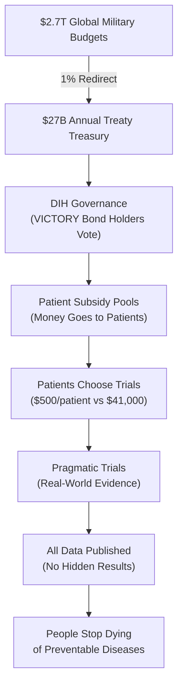

> **The 1% Treaty:** Every nation redirects just 1% of global military spending to fund 80X more efficient medical research, creating the most profitable investment in history while saving millions of lives.

 

## The Problem in Numbers

| What We Waste Money On | Annual Cost | What We Get |
|----------------|------------|-------------|
| War & Conflict | $9.7T | Destruction, refugees, and disabilities |
| Disease Burden | $109.1T | Suffering and lost potential |
| **Total Waste** | **$118.8T** | **The dumbest possible use of our limited resources** |
| **Medical Research** | **$0.068T** | Actual cures and treatments |

## The 1% Solution

We've created a system where:

1. **Nations redirect 1%** of military budgets to cure disease
2. **Patients get paid** to participate in clinical trials
3. **Research becomes 80x more efficient** using proven methods
4. **EVERYONE profits** from the $16.5T annual peace dividend

[How It Works](#how-it-works) | [The Math](#the-math) | [Get Involved](#join-the-war)

## Why This Works

✅ **Proven Model:** The Oxford RECOVERY trial showed we can run trials for $500 instead of $41,000 per patient  
✅ **Massive Leverage:** $1 in lobbying produces $1,813 in government contracts
✅ **Aligned Incentives:** Everyone gets rich by curing disease instead of killing people and  
✅ **No Losers:** Even partial success means 1% less war and nuclear bombs and more cures

## How It Works

### The 6-Step Process

1. **Get the Money**: The 1% Treaty redirects $27B/year from weapons to cures
2. **Allocate Efficiently**: The DIH uses democratic voting to fund what matters most  
3. **Pay Patients**: Subsidies go directly to patients who join trials
4. **Run Cheap Trials**: Pragmatic trials cost $500/patient instead of $41,000
5. **Publish Everything**: The dFDA shows real effectiveness data for every treatment
6. **Outcome Labels**: Every food and drug gets honest labels about what it actually does

### Current System vs. New System

**Current System:**
- $2.2B to develop one new treatment
- 17 years from discovery to patients  
- 95% of diseases have 0 FDA-approved treatments 

**New System:**
- ~$27M to develop one new treatment (80X cheaper)
- 2-3 years from discovery to patients 
- 1,000X more treatments tested with same global budget
- Every disease gets attention (patients pay to participate)

## The Math

### Investment Required vs. Returns

**Total Implementation Cost:** $1.2-2.5B over 36 months

**Annual Returns Once Operational:** $27B+ per year from 1% military budget redirections

**The Math:** We're asking for $2.5B to redirect $27B annually. That's a 10:1 return ratio - better than most venture capital investments, except this one saves millions of lives.

## The Plan: From Idea to Treaty

1.  **Prove the Mandate (The Global Referendum):** We will mobilize 3.5% of humanity (280 million people) through a global referendum. This creates an undeniable political mandate that no leader can ignore.

2.  **Fund the Mission (VICTORY Bonds):** We will raise the required $2.5B by selling **VICTORY Bonds**—an investment vehicle designed to offer ~40% annual returns, making peace more profitable than war.

3.  **Ratify the Treaty:** With a clear public mandate and a powerful financial engine, we will co-opt the existing political system to ratify the 1% Treaty and begin redirecting funds.

## Join the War on Disease

- **[Participate in the Referendum](mailto:hello@dih.earth)**: Signal your support and become part of the 3.5%.
- **[Invest in VICTORY Bonds](mailto:hello@dih.earth)**: Fund the mission and earn a share of the peace dividend.
- **[Join the Coalition](mailto:hello@dih.earth)**: We partner with institutions, companies, and non-profits.

## Table of Contents

### Chapter 1: Problems
a. [The Cost of War](./brain/book/problem/cost-of-war.md)  
b. [The Cost of Disease](./brain/book/problem/cost-of-disease.md)  
c. [Why NIH is Terrible at Funding Research](./brain/book/problem/nih-funding-is-broken.md)  
d. [Why FDA is Unsafe and Ineffective](./brain/book/problem/fda-approvals-are-broken.md)  
e. [Why Representative Democracy is Unrepresentative](./brain/book/problem/democracy-is-broken.md)

### Chapter 2: Solution
- [The 1% Treaty](./brain/book/solution/1-percent-treaty.md) 
- [The Global Referendum on War and Disease](./brain/book/solution/1-percent-treaty.md) 
- [VICTORY Bonds: The Most Profitable Investment in the History of the World](./brain/book/economics/victory-bonds.md)  
- [The Decentralized Institutes of Health](./brain/book/solution/dih.md)  
- [Wishocracy: Quantifying Collective Preferences](./brain/book/solution/wishocracy.md)
- [The Decentralized FDA](./brain/book/solution/dfda.md)  

### Chapter 3: Economics
a. [The $16.5T Peace Dividend](./brain/book/economics/peace-dividend-value-capture.md)  
b. [Why This Is The Best Investment in the History of the Universe](./brain/book/economics/investment-thesis.md)  
c. [Math Says It's Good](./brain/book/economics/economic-impact-summary.md)  

### Chapter 4: Legal
- [How to Stay Out of Prison](./brain/book/strategy/legal-compliance-framework.md)  

### Chapter 5: Proof (Why This Isn't Completely Insane)
a. [We Already Proved the 80X Efficiency Thing Works](./brain/book/reference/recovery-trial.md)  
b. [How Humans Have Done This Before](./brain/book/proof/historical-precedents.md)  
c. [Historical Evidence for Decentralized Efficacy Trials](./brain/reference/historical-evidence-supporting-decentralized-efficacy-trials.md)
d. [The Economic Proof: Why the Math Actually Works](./brain/book/proof/economic-proof.md)  
e. [Political Proof: How Mass Movements Win](./brain/book/proof/political-proof.md)  

### Chapter 6: Join the War on Disease
a. [Get Started Here: Your Next Steps to Join the War on Disease](./brain/book/call-to-action.md)  
b. [Contributing Guide: How to Help Write This Book](./CONTRIBUTING.md)  
c. [Evidence Library: All the Data That Proves We're Right](./brain/reference/)

