### [The 1% Treaty: Harnessing Greed to Eradicate Disease](https://impact.warondisease.org)

[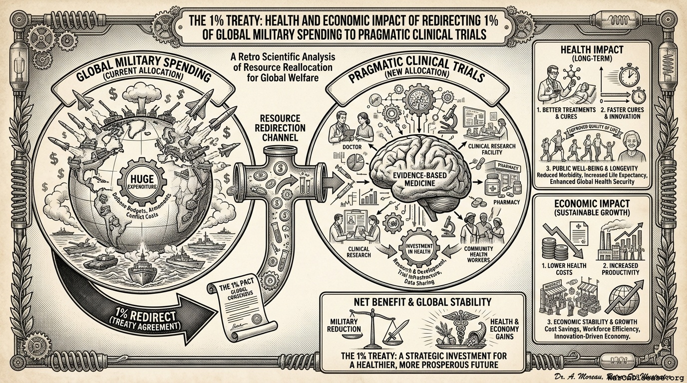](https://impact.warondisease.org)

> 6.65 thousand diseases have 0 FDA-approved treatments. At current trial capacity (15 diseases/year), exploring the therapeutic search space takes ~443 years. Redirect 1% of military spending ($27.2B/year) to pragmatic clinical trials. Trial capacity jumps 12.3x. Search space explored in ~36 years instead of centuries. Average treatment reaches patients 212 years sooner. Timeline shift saves 10.7 billion deaths, valued at $84.8 quadrillion. Cost-effectiveness: $0.0018/DALY, 50.3kx better than bed nets. Even at 1% probability of treaty adoption, risk-adjusted cost-effectiveness remains superior to the best existing global health interventions. Incentive Alignment Bonds address political feasibility by tying legislators' career incentives to a public voting scorecard.

### [Decentralized FDA Impact Analysis: How to Prevent a Year of Death and Suffering for 84 Cents](https://dfda-impact.warondisease.org)

[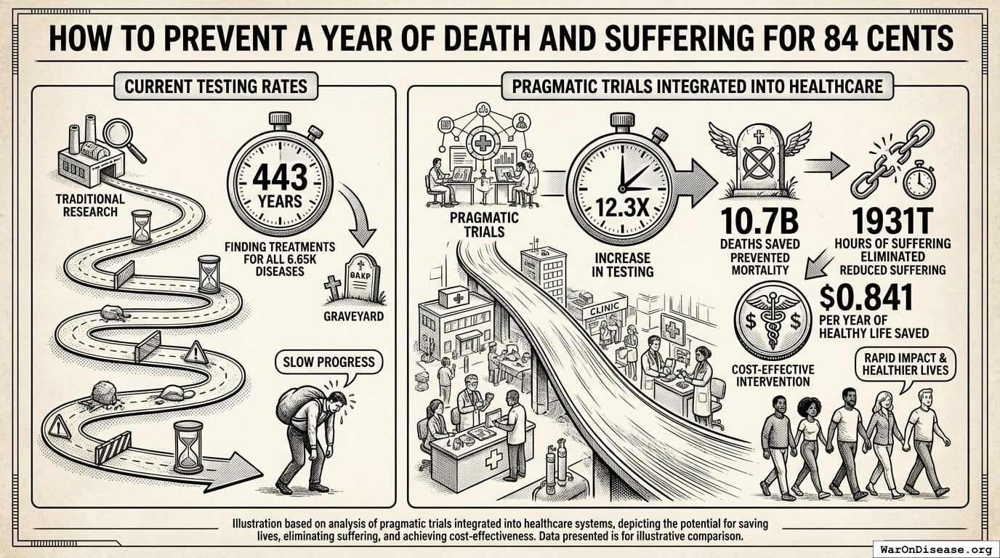](https://dfda-impact.warondisease.org)

> Of 9.50 million combinations plausible drug-disease pairings, only 0.342% have been clinically tested. At the current discovery rate of 15 diseases/year, clearing this backlog would take ~443 years. A decentralized FDA integrating pragmatic clinical trials into standard healthcare at $929/patient (vs. $41K traditional) increases trial capacity 12.3x, reducing backlog clearance to 36 years. Combined with eliminating the 8.2 years post-safety efficacy delay through opt-in trial participation after Phase I, treatments arrive 212 years earlier on average. This timeline shift saves 10.7 billion deaths, averts 565 billion DALYs, and eliminates 1.93 quadrillion hours of suffering at $0.841/DALY, competitive with bed nets ($89/DALY) at vastly greater scale. Full impact yields $84.8 quadrillion in value (178k:1 ROI).

### [Incentive Alignment Bonds: Making Public Goods Financially and Politically Profitable](https://iab.warondisease.org)

[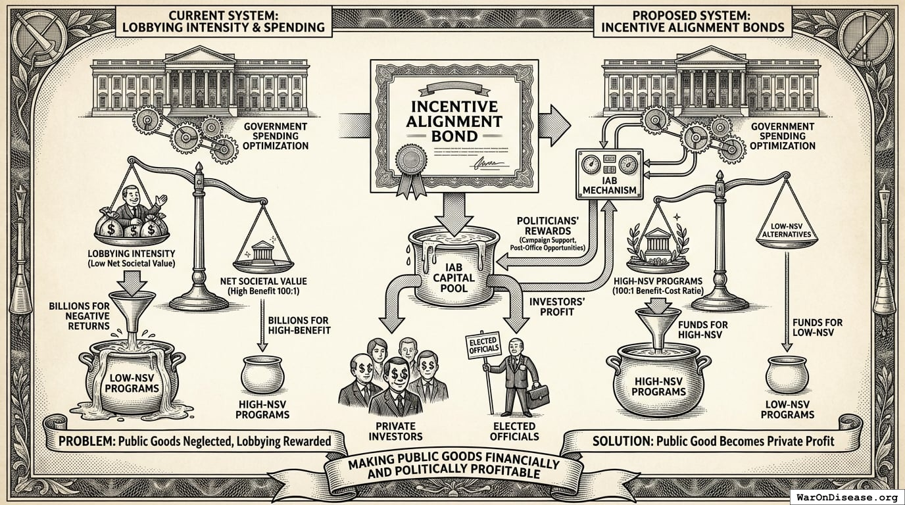](https://iab.warondisease.org)

> Government spending correlates with lobbying intensity, not marginal societal value. Programs with benefit-cost ratios exceeding 100:1 (vaccines, e-governance) receive single-digit billions while programs with negative net returns (military beyond deterrence, fossil fuel subsidies) receive hundreds of billions. This paper introduces Incentive Alignment Bonds (IABs), financial instruments that realign politician incentives with net societal value optimization. IABs create a capital pool that rewards politicians (via campaign support and post-office career opportunities) for funding high-NSV programs over low-NSV alternatives. The mechanism requires no legislative change: existing PAC infrastructure, impact bonds, and prediction markets can deploy it today. Analysis of a proposed 1% Treaty redirecting $27.2B/year from military spending to medical research shows expected returns exceeding 100:1 for early investors. The 90:1 capital asymmetry ($454T in household wealth vs. $5T for concentrated interests) means diffuse beneficiaries can outspend incumbent lobbies once coordination problems are solved. IABs solve that coordination problem by turning political change into an investable asset class.

### [Optimocracy: Causal Inference on Cross-Jurisdictional Policy Data to Maximize Median Health and Wealth](https://optimocracy.warondisease.org)

[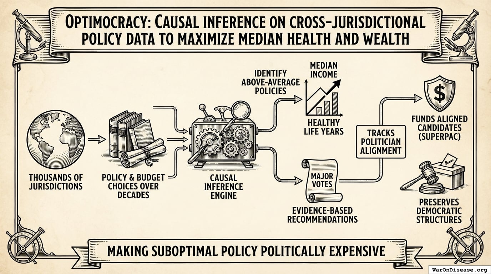](https://optimocracy.warondisease.org)

> Thousands of jurisdictions (municipal, state, federal, international) have exposed populations to different policies over decades. This cross-jurisdictional variation is a natural experiment. Optimocracy: (1) Apply causal inference to this historical policy data, (2) Identify which policies predict above-average median income and healthy life years, (3) Publish recommendations for every major vote, (4) Track politician alignment with evidence, (5) Algorithmically fund the campaigns of the most aligned policymakers via SuperPAC. Politicians still decide; the algorithm just makes ignoring evidence expensive.

### [Right to Trial & FDA Upgrade Act](https://right-to-trial.warondisease.org)

[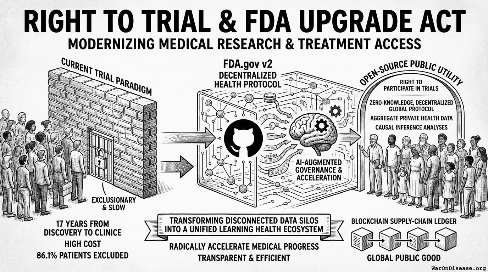](https://right-to-trial.warondisease.org)

> Act to modernize medical research and treatment access through an open-source FDA.gov v2, giving patients the right to participate in trials.

### [The Decentralized FDA Protocol: Two-Stage Validation (RWE → Pragmatic Trials)](https://dfda-spec.warondisease.org)

[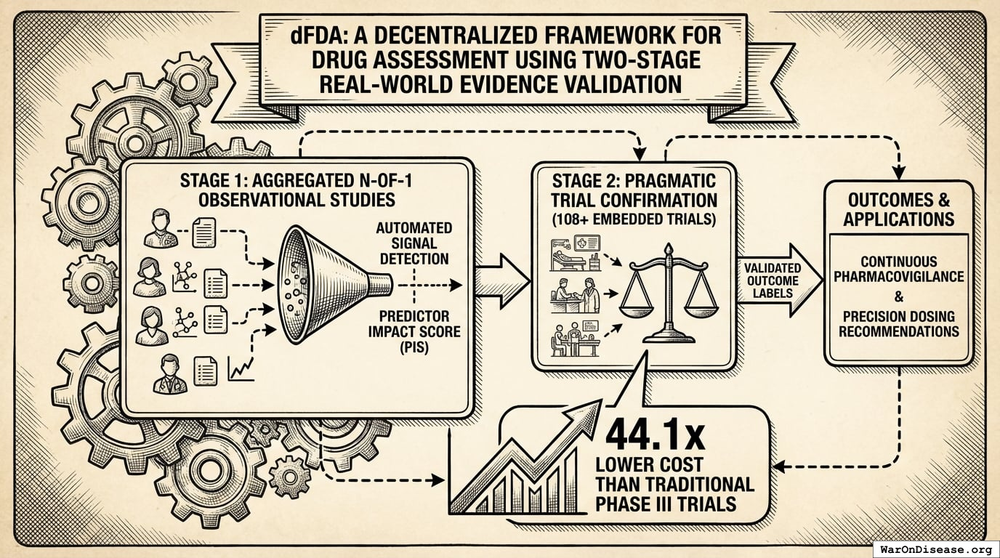](https://dfda-spec.warondisease.org)

> Treatments that could save lives take an average of 8.2 years to complete clinical trials after discovery. Since 1962, these delays have contributed to an estimated 102 million deaths preventable deaths. Meanwhile, only 1-10% of adverse drug events get reported to the FDA, and billions of people generate continuous health data through wearables and apps that remains unharvested. We present a two-stage framework that transforms this data into validated treatment recommendations. Stage 1 ($0.100/patient): aggregate millions of natural experiments and score causal confidence using the Predictor Impact Score (PIS), a composite metric operationalizing six Bradford Hill causality criteria. Stage 2 ($929/patient): confirm top signals through pragmatic trials embedded in routine care, 44.1x cheaper than traditional Phase III trials. Cost estimates derive from a meta-analysis of 108 pragmatic trials plus implementations like RECOVERY (which found a life-saving treatment in 100 days) and ADAPTABLE. A Trial Priority Score (PIS x DALYs x Novelty x Feasibility) determines which signals proceed to experimental confirmation. The framework produces three outputs absent from current pharmacovigilance: (1) "Outcome Labels," per-condition documents ranking all treatments by quantitative effect size (inverting the traditional per-drug FDA label paradigm); (2) precision dosing recommendations derived from optimal daily values (the predictor values historically preceding the best outcomes); and (3) a three-tier evidence grading system (Validated, Promising, Signal) combining observational and experimental effect sizes. Trial results feed back to calibrate observational models, creating a learning health system where accuracy improves continuously. High PIS signals warrant experimental investigation; low PIS does not rule out true effects. This framework complements traditional RCTs. Stage 2 pragmatic trials are required to establish validated causal claims.

### [The Invisible Graveyard: Quantifying the Mortality Cost of FDA Efficacy Lag](https://invisible-graveyard.warondisease.org)

[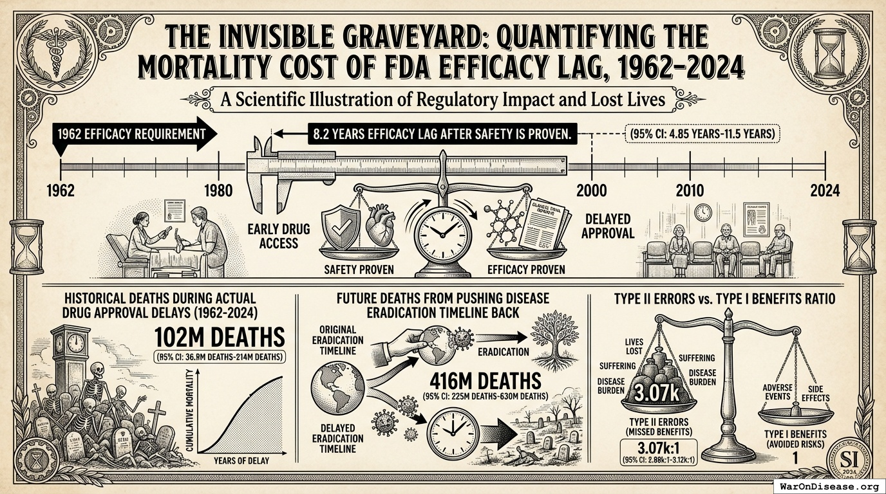](https://invisible-graveyard.warondisease.org)

> This study quantifies the cumulative mortality and morbidity costs associated with the Unitary Pre-Market Approval (UPMA) model mandated by the 1962 Kefauver-Harris Amendments. By enforcing efficacy testing prior to market entry, the current regulatory framework imposes an average "Efficacy Lag" of 8.2 years post-safety verification. Using data from the Tufts Center for the Study of Drug Development (CSDD) and the WHO Global Burden of Disease (GBD) database, we estimate two distinct mortality costs: (1) Historical mortality (1962-2024): approximately 102 million deaths died waiting for approved drugs during their approval delays, representing a lower bound excluding drugs never developed due to cost barriers; (2) Future timeline shift: an additional 416 million deaths will eventually die because the disease eradication timeline has been pushed back by 8.2 years. Combined, these represent 7.94 billion DALYs Disability-Adjusted Life Years when adjusted for morbidity, with a cumulative economic deadweight loss of approximately $1.19 quadrillion (2024 USD). The societal cost of Type II Regulatory Errors (delayed access to effective therapies) exceeds the averted cost of Type I Regulatory Errors (market access for ineffective therapies) by a factor of 3.07k:1.

### [The Optimal Budget Generator: A Causal Inference Protocol for Maximizing Median Health and Wealth Through Public Goods Funding](https://obg.warondisease.org)

[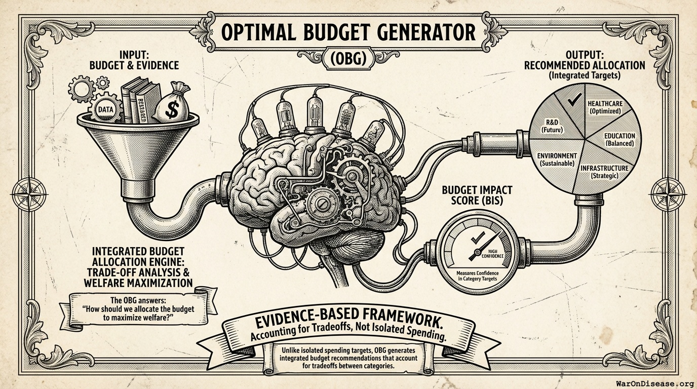](https://obg.warondisease.org)

> 20-40% of public goods funding is misallocated relative to outcome-maximizing benchmarks, representing trillions annually in foregone welfare gains. Budget processes respond to lobbying intensity and historical precedent rather than causal evidence of effectiveness. The Optimal Budget Generator (OBG) applies causal inference, diminishing returns modeling, and cost-effectiveness analysis to determine optimal public goods funding levels that maximize two welfare metrics: real after-tax median income growth and median healthy life years. For each spending category, OBG estimates an Optimal Spending Level (OSL) identifying where marginal returns equal opportunity cost. The Budget Impact Score (BIS) measures confidence in each OSL estimate based on study quality, statistical precision, and temporal recency of the underlying causal evidence. The result is a gap analysis showing which categories are over- or underfunded relative to evidence-based benchmarks, enabling systematic reallocation from low-return to high-return public investments.

### [The Optimal Policy Generator: A Causal Inference Protocol for Maximizing Median Health and Wealth Through Public Policy](https://opg.warondisease.org)

[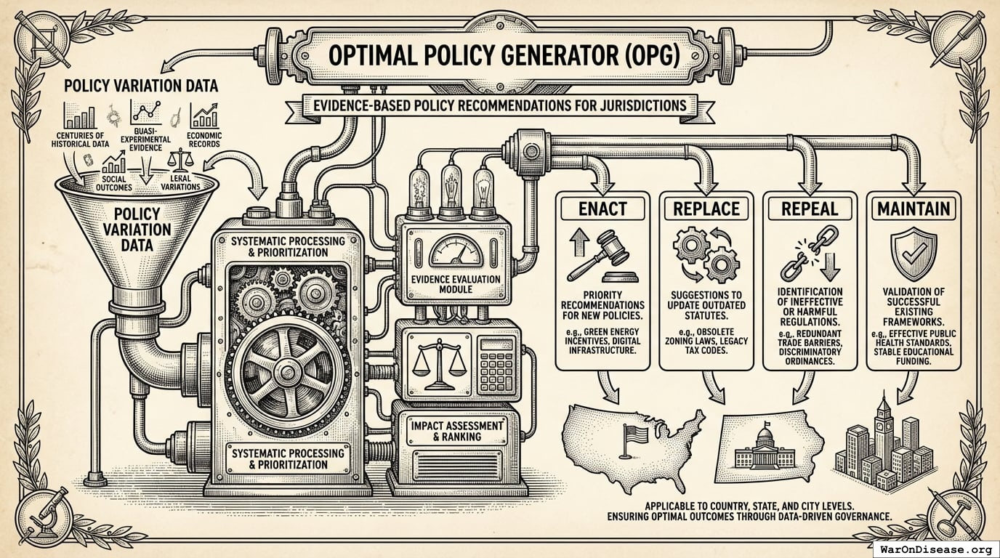](https://opg.warondisease.org)

> Centuries of public policy variation across thousands of jurisdictions (countries, states, cities) constitute a massive natural experiment. The data to identify which policies maximize welfare exists but has not been systematically harvested. The Optimal Policy Generator (OPG) applies causal inference methods (synthetic control, difference-in-differences, regression discontinuity) and Bradford Hill criteria to this cross-jurisdictional data, measuring policy impact on two welfare metrics: real after-tax median income growth and median healthy life years. For any jurisdiction, OPG produces four categories of public policy recommendations: ENACT (evidence-supported policies the jurisdiction lacks), REPLACE (policies set at suboptimal levels), REPEAL (policies with net welfare harm), and MAINTAIN (policies aligned with evidence). Each recommendation includes expected effects on both metrics, confidence grades, and blocking factors including freedom and autonomy constraints. The framework is agnostic to which party enacted each policy, evaluating only whether it improved outcomes. Projected welfare gains under framework assumptions: 5-15% of GDP for typical US states, pending retrospective validation.

### [The Political Dysfunction Tax](https://political-dysfunction-tax.warondisease.org)

[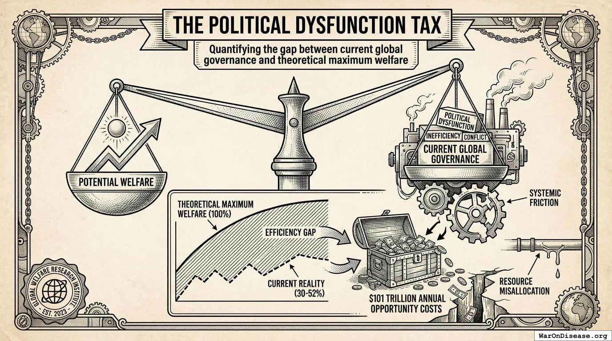](https://political-dysfunction-tax.warondisease.org)

> This report introduces the Political Dysfunction Tax (T_pd): the implicit levy paid to entropy through governance inefficiency. By constructing a Waste Ledger (military overspend, administrative friction, incarceration costs) and an Opportunity Ledger (suppressed health innovation, migration restrictions, lead poisoning), we calculate a Global Governance Efficiency Score of 31-53%. Current governance destroys $97 trillion annually in unrealized potential, including $34T from delayed cures, $57T from migration restrictions, and $6T from lead exposure, suggesting civilization operates far below its technological possibilities.

### [The Price of Political Change: A Cost-Benefit Framework for Policy Incentivization](https://cost-of-change.warondisease.org)

[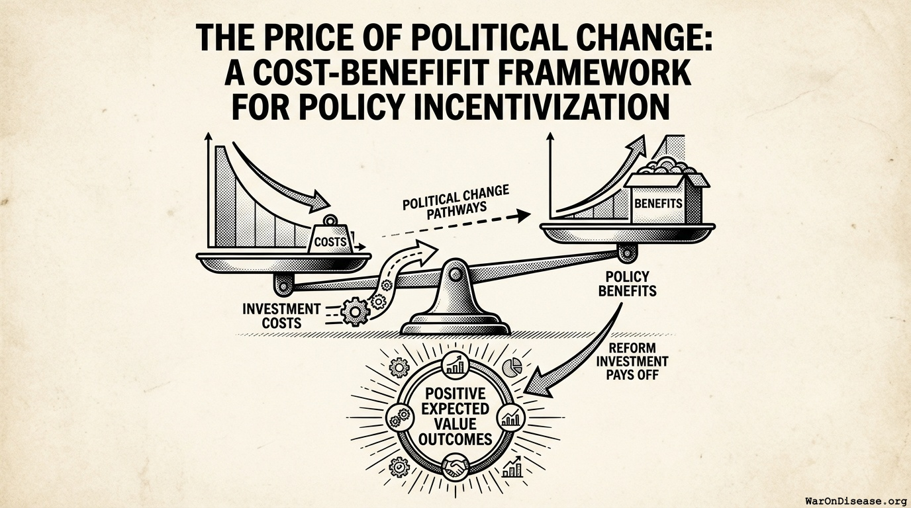](https://cost-of-change.warondisease.org)

> What is the maximum cost to achieve any policy change through legal democratic channels? We estimate $25 billion for the United States and $200 billion globally. These figures represent the upper bound of matching all opposition spending (campaign finance, lobbying) and providing career alternatives for affected legislators. For high net-societal-value policies, even these maximum costs yield extraordinary returns: military-to-health reallocation achieves ROI exceeding 400,000:1, carbon pricing exceeds 1,000:1, and occupational licensing reform exceeds 2,000:1. The "political impossibility" objection thus reduces to a capital allocation problem. Political change is not impossible; it is merely expensive, and for valuable reforms, the price is trivial relative to the benefits.

### [United States Efficiency Audit](https://us-efficiency-audit.warondisease.org)

[](https://us-efficiency-audit.warondisease.org)

> This report applies systems engineering methodology to quantify allocative inefficiency in U.S. governance across four dysfunction categories: direct spending waste, compliance burden on the private sector, policy-induced GDP loss, and system inefficiency. Using Monte Carlo simulation across ten components with OECD benchmarking, we estimate an aggregate efficiency gap of $4.90T annually and recoverable capital of $2.45T if U.S. performance converges toward OECD median efficiency. This categorization distinguishes direct budget waste from broader economic dysfunction, each requiring different solution pathways. We also translate the efficiency gap into QALY and VSL-equivalent welfare terms for interpretability.

### [Wishocracy: Solving the Democratic Principal-Agent Problem Through Pairwise Preference Aggregation](https://wishocracy.warondisease.org)

[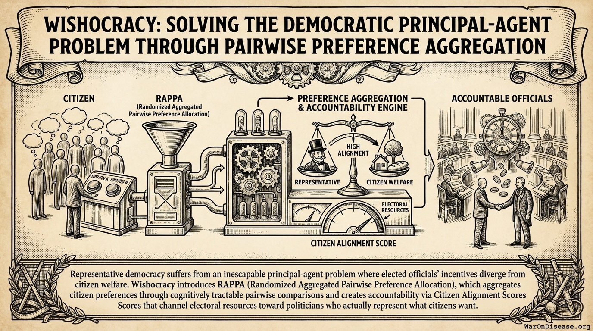](https://wishocracy.warondisease.org)

> Politicians' votes have near-zero correlation with citizen preferences (Gilens and Page, 2014). Elite preferences predict policy outcomes. No mechanism connects citizen preferences to electoral consequences for representatives. RAPPA: Millions of citizens answer simple pairwise questions ("How would you split $100 between these two budget categories?"). Geometric mean aggregation produces population-level preference weights from sparse individual responses. Unlike approval voting or ranked choice, RAPPA captures preference *intensity*, not just what people want, but how much they care. Compare aggregated preferences to each legislator's voting record. Publish Citizen Alignment Scores. Channel campaign resources to high-alignment candidates through Incentive Alignment Bonds. The mechanism achieves three properties no prior system combines: minimal cognitive load (~20 comparisons per participant yields statistical convergence), preference intensity capture, and approximate strategy-proofness.

---
## Development

This is a [Quarto](https://quarto.org/) book project with Python-based parameter calculations.

### Quick Start

```bash
# Clone and setup
git clone https://github.com/wishonia/disease-eradication-plan.git
cd disease-eradication-plan
python -m venv .venv
.venv/Scripts/activate  # Windows
# source .venv/bin/activate  # macOS/Linux
pip install -r requirements.txt

# Generate variables and render
python scripts/generate-everything-parameters-variables-calculations-references.py
quarto render
```

### Key Files

- `dih_models/parameters.py` - All calculations and variables
- `_variables.yml` - Generated Quarto variables with tooltips
- `knowledge/` - All content organized by topic
- `CONTRIBUTING.md` - Writing standards and style guide

See [CONTRIBUTING.md](CONTRIBUTING.md) for detailed contribution guidelines.

