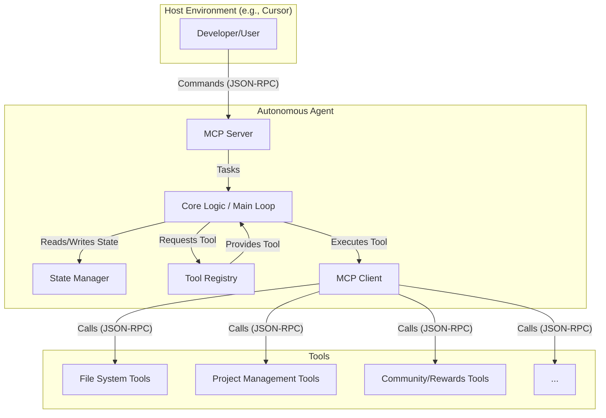

# Autonomous Agent: Executive Director

This document outlines the planning, architecture, and roadmap for the autonomous AI agent responsible for managing the DIH wiki and related project tasks.

## 1. Vision

The goal is to create an autonomous AI agent that acts as the "Executive Director" of the Decentralized Institutes of Health (DIH). Its primary responsibilities include:

-   **Wiki Maintenance:** Ensuring the documentation is up-to-date, organized, and free of errors.
-   **Project Management:** Tracking tasks, managing project boards, and reporting on progress.
-   **Community Coordination:** Coordinating tasks for human contributors and managing a rewards system.
-   **Repository Integrity:** Performing all its functions by interacting with the files within this repository.

## 2. Framework Comparison

Based on a review of current TypeScript AI agent frameworks, the following comparison was made to select the best fit for this project.

| Framework | Key Features | Considerations |
|-----------|--------------|----------------|
| **VoltAgent** | - TypeScript-native - Modular architecture - Strong tool integration - Modern state management - Visual debugging console | - Strongest candidate for this project's goals - Assumed compatibility with MCP |
| **Praison AI** | - Low-code, multi-agent platform | - Not aligned with our hands-on, code-first approach |
| **Eliza** | - Multi-platform integration (Discord, etc.) | - Geared more towards chat bots than a repository management agent |
| **Mastra** | - Full-stack, all-in-one framework | - A strong alternative, but VoltAgent's modularity is preferred |
| **KaibanJS** | - Kanban-style orchestration model | - The opinionated workflow might be too restrictive |

### Decision: VoltAgent

After a more thorough review of the official documentation and GitHub repository, **`VoltAgent`** is reaffirmed as the selected framework. Initial installation attempts failed due to incorrect package name assumptions, not an issue with the framework's availability.

`VoltAgent`'s open-source nature, modular architecture, and documented support for MCP make it the ideal choice.

## 3. Key Responsibilities

The agent's primary duties are broken down into the following areas:

1.  **Wiki & Documentation Maintenance**
    *   **Link Validation:** Regularly scan all markdown files for broken internal and external links.
    *   **Content Auditing:** Identify and flag pages that haven't been updated in a long time ("stale content").
    *   **File Organization:** Ensure all documentation files adhere to the structure defined in `FILE-ORGANIZATION.md`.
    *   **Frontmatter Validation:** Check for missing or incorrectly formatted frontmatter in all markdown files.

2.  **Project & Task Management**
    *   **Task Ingestion:** Parse specially formatted markdown sections or comments to create new tasks in a central task list (e.g., `agent/tasks.json`).
    *   **Status Reporting:** Provide summaries of open tasks, completed tasks, and contributor activity.
    *   **Contributor Assignment:** Assign tasks to human contributors based on availability or skill sets (future goal).

3.  **Community Coordination & Rewards**
    *   **Contribution Tracking:** Monitor repository activity (commits, PRs) to identify human contributions.
    *   **Reward Calculation:** Based on a predefined set of rules, calculate rewards for completed tasks or contributions.
    *   **Reward Distribution:** Interface with a system (to be defined) to allocate rewards to contributors.

## 4. Architecture

The agent will be designed with a modular architecture, separating concerns to allow for scalability and maintainability. This decision aligns with a **single-agent, multi-tool** approach, which is simpler to implement and manage initially, with the possibility of evolving to a multi-agent system in the future if complexity demands it.

### Components

1.  **MCP Server:** Exposes an endpoint for receiving commands and tasks from external clients like Cursor. It will translate incoming requests into actionable tasks for the Core Logic.
2.  **Core Logic (Main Loop):** This is the agent's brain. It will be responsible for:
    *   Receiving tasks from the MCP Server.
    *   Breaking down complex tasks into smaller steps.
    *   Querying the State Manager for context.
    *   Selecting and executing the appropriate tools via the MCP Client.
    *   Updating the State Manager with the results.
3.  **State Manager:** Maintains the agent's short-term and long-term memory. This could be as simple as an in-memory JSON object for short-term state and a collection of files in the repository (e.g., `agent/state.json`) for persistent state.
4.  **Tool Registry:** A mapping of available tools that the Core Logic can use. This registry will be populated at startup by scanning a `tools` directory.
5.  **MCP Client:** A generic client for interacting with any MCP-compliant tool. The agent will use this to execute file operations, call external APIs, etc.
6.  **Tools:** These are individual, single-purpose modules that the agent uses to interact with the world. Each tool will expose its functionality over a simple MCP server. Examples include:
    *   `file-reader`: Reads a file from the workspace.
    *   `file-writer`: Writes or modifies a file.
    *   `link-checker`: Scans a markdown file for broken links.
    *   `task-creator`: Creates a new task in the project's task management system.

## 4. Technical Strategy

### Core Framework

-   **Language:** TypeScript
-   **AI SDK:** Vercel AI-SDK Core
-   **Agent Framework:** **VoltAgent**

### Extensibility and Tooling

-   **Model Context Protocol (MCP):** MCP will be the primary mechanism for the agent to interact with its tools.
    -   **Consuming Tools:** The agent will use MCP clients to connect to tools that allow it to read/write files, interact with external APIs (e.g., for rewards), and manage project state.
    -   **Providing a Server:** The agent will expose its own functionality through an MCP server. This will allow developers (and other agents) to interact with it, assign tasks, and query its status directly from tools like Cursor.

## 5. Roadmap

This is a high-level roadmap. Detailed tasks will be tracked in the project's to-do list.

1.  **Phase 1: Foundation & Setup**
    -   [x] Create this planning document.
    -   [x] Research and select an AI agent framework.
    -   [x] Define detailed agent architecture and requirements.
    -   [x] Set up the TypeScript development environment.
    -   [x] Integrate the VoltAgent framework and AI-SDK Core.

2.  **Phase 2: Core Logic & MCP Integration**
    -   [x] Implement the agent's main operational loop and state management.
    -   [x] Develop the agent's MCP server to expose basic commands.
    -   [x] Implement initial tools for basic file system operations (e.g., `listFiles`).
    -   [ ] Implement `readFile` and `editFile` tools.

3.  **Phase 3: Wiki Management**
    -   [ ] Develop high-level tools for parsing and validating markdown files.
    -   [ ] Implement the first wiki maintenance task (e.g., "find and fix broken links").

4.  **Phase 4: Project Management & Coordination**
    -   [ ] Design a schema for managing tasks within the repository (e.g., using JSON or YAML files).
    -   [ ] Implement tools for creating and updating tasks.
    -   [ ] Design the human coordination and rewards system.
