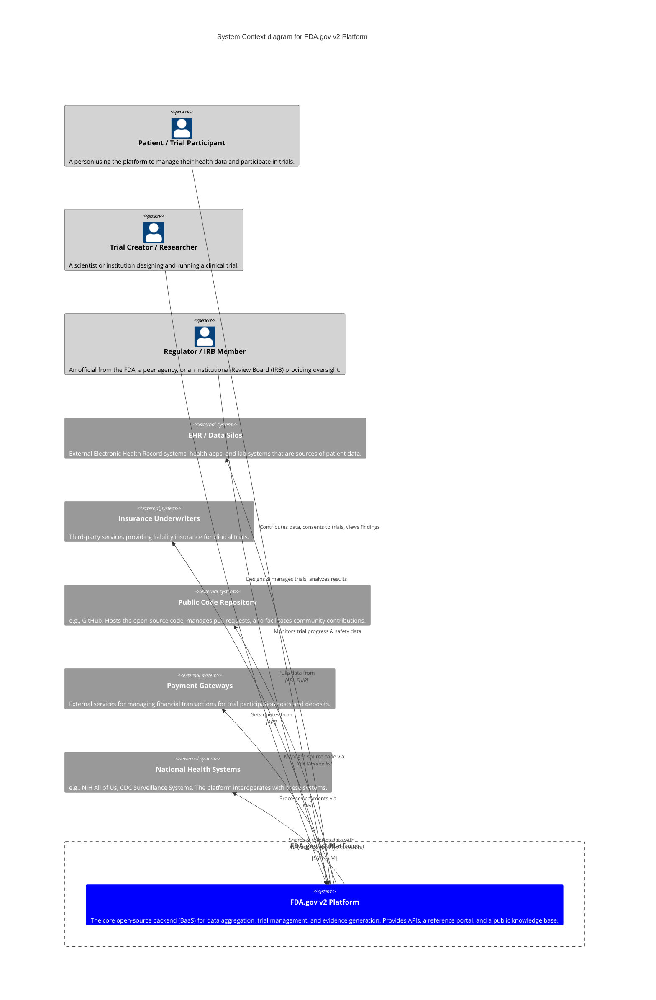
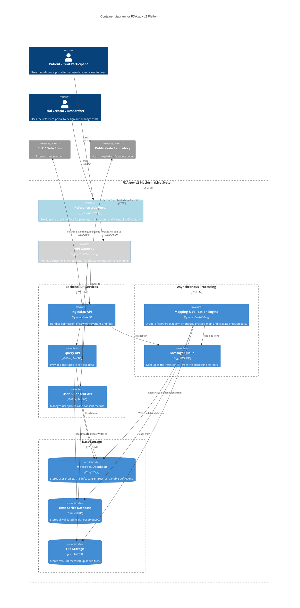

# Architectural Diagrams

**Status:** DRAFT
**Version:** 0.2

This directory contains visual diagrams, such as C4 models, sequence diagrams, and infrastructure diagrams, that illustrate the architecture of the platform.

## C4 System Context Diagram

This diagram shows the high-level relationships between the FDA.gov v2 Platform, its users, and the external systems it interacts with.

## C4 Container Diagram

This diagram zooms into the FDA.gov v2 Platform to show its main logical containers (applications, services, and data stores).

## Other Diagrams

* **[Layered Platform Architecture](https://static.crowdsourcingcures.org/img/layered-platform-architecture-diagram.png)**: A high-level view of the core platform and plugin framework.
* **[Plugin Marketplace](https://static.crowdsourcingcures.org/img/plugin-marketplace.png)**: Illustrates the relationship between the core platform and the third-party plugin ecosystem.

---
*More diagrams will be added here as they are developed.*
