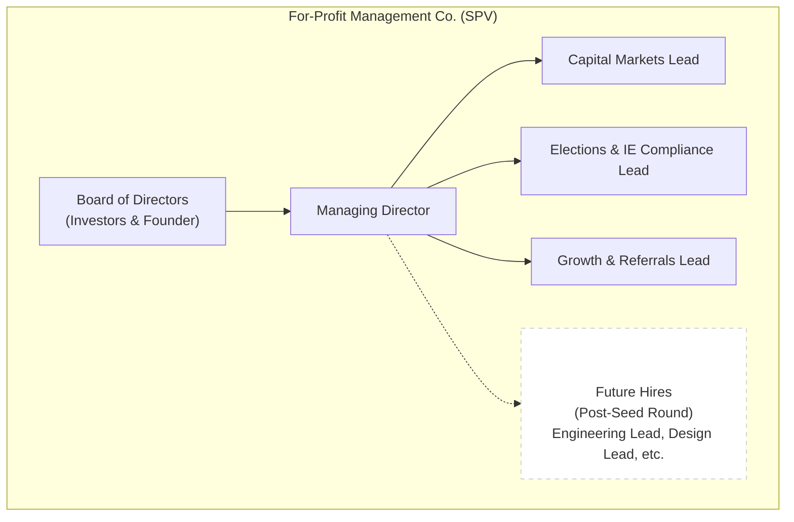
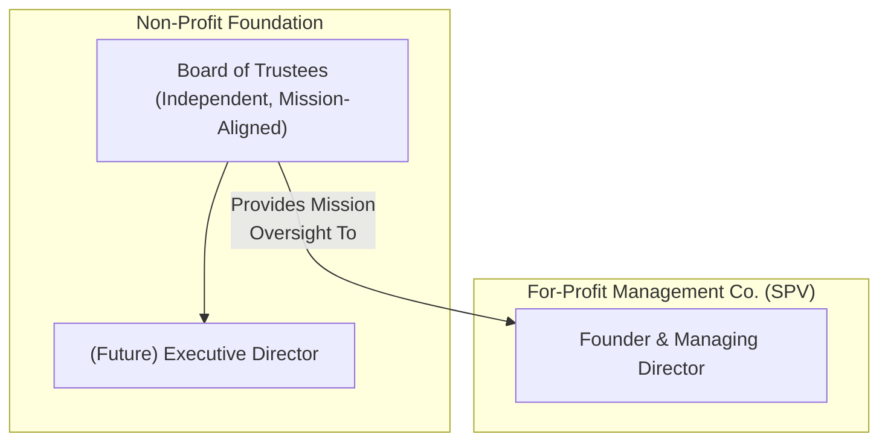

# Organizational Structure

This document outlines the organizational structure of the two core entities that drive the War on Disease initiative: the For-Profit Management Company (SPV) and the Non-Profit Foundation.

This structure is designed to separate the operational execution and fundraising activities from the mission oversight and governance, ensuring both efficiency and integrity.

See [Pre-Seed Strategy](../strategy/pre-seed-strategy.md) for details on the roles and responsibilities of the initial hires.

## 1. For-Profit Management Company (SPV)

This entity is the operational engine. It employs the core team, raises investment capital, and executes the strategy.

## 2. Non-Profit Foundation

This entity is the guardian of the mission. It provides legal and ethical oversight to ensure the project remains aligned with its public benefit goals.

