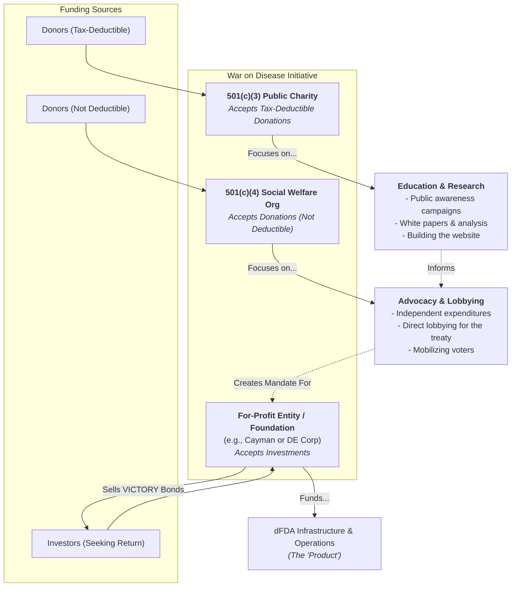

# Multi-Entity Legal Strategy

To successfully execute the [Canonical Roadmap](../strategy/roadmap.md) and achieve the mission of the 1% Treaty, a sophisticated legal structure is required. The project's activities span charitable work, political advocacy, and for-profit investment, which cannot be housed within a single legal entity in most jurisdictions.

This document outlines a recommended multi-entity strategy to ensure legal compliance, maximize funding opportunities, and protect the mission's integrity.

## The Three-Entity Structure

The most robust and common approach for an initiative of this scale is to establish three separate but cooperating legal entities, each with a distinct purpose and set of legal permissions.

---

### 1. The 501(c)(3) Public Charity: "The Educator"

This entity serves as the educational and research arm of the initiative.

- **Primary Purpose:** To build a broad base of public understanding and support through non-partisan research, data analysis, and educational outreach.
- **Permitted Activities:**
- Publishing white papers, economic models, and strategic documents.
- Developing and maintaining the public-facing website and educational materials.
- Hosting forums, webinars, and workshops to inform the public.
- Conducting non-partisan analysis and research.
- Hiring staff for research, communications, and educational program management.
- **Funding:** Accepts **tax-deductible** donations from individuals and foundations.
- **Limitations:** Is strictly prohibited from engaging in substantial lobbying or any partisan political activity (e.g., endorsing candidates).
- **Role in Roadmap:** This entity is the primary vehicle for executing **Phase 0 and 1** of the roadmap, as these phases are focused on building the foundational research, narrative, and public platform.

### 2. The 501(c)(4) Social Welfare Organization: "The Advocate"

This entity is the political and advocacy arm, designed to translate public will into legislative action.

- **Primary Purpose:** To advocate directly for the adoption of the 1% Treaty and related policies.
- **Permitted Activities:**
- Engaging in **unlimited lobbying** with legislators and policymakers.
- Running independent expenditure campaigns to support candidates who align with the mission and oppose those who do not.
- Mobilizing voters and organizing direct calls to action.
- **Funding:** Accepts donations that are **not tax-deductible**. This allows it to engage in political work that a 501(c)(3) cannot.
- **Limitations:** Donations are not tax-deductible. It must maintain strict financial and operational separation from its 501(c)(3) counterpart.
- **Role in Roadmap:** This entity becomes critical in **Phase 2**, which is focused on political mobilization and securing treaty adoption.

### 3. The For-Profit / Foundation: "The Engine"

This entity is the financial and operational engine that manages investments and delivers returns.

- **Primary Purpose:** To manage the sale of [VICTORY Bonds](../strategy/1-percent-treaty/victory-bonds-tokenomics.md), fund the operational development of the dFDA Infrastructure, and provide a financial return to investors.
- **Permitted Activities:**
- Issuing securities (VICTORY Bonds) and managing investor relations.
- Funding the technology development and operational scaling of the dFDA.
- Managing the DIH treasury and executing investor payouts.
- **Funding:** Funded by **investment capital** from individuals and institutions seeking a financial return.
- **Legal Structure:** Likely a C-Corporation in Delaware or a foundation structure in a jurisdiction like the Cayman Islands, optimized for global investment and crypto-asset management.
- **Role in Roadmap:** This entity is central to the entire roadmap, as it handles the primary capital raise (**Phase 2**) and executes the mission delivery and investor returns (**Phase 3**).

## Interaction and Compliance

- **Strict Separation:** The entities must be legally separate, with independent boards, bank accounts, and accounting records to ensure compliance with tax and election law.
- **Cooperative Mission:** While legally separate, the entities work in concert. The 501(c)(3) educates the public to build a mandate, which the 501(c)(4) then uses to apply political pressure. The success of the political effort unlocks the treaty funds, which allows the for-profit entity to execute the mission and repay investors.

---

_> **Disclaimer:** This document provides a strategic overview and is not legal advice. The founding team must consult with qualified legal counsel specializing in nonprofit law, securities, and international regulations to implement this structure._
