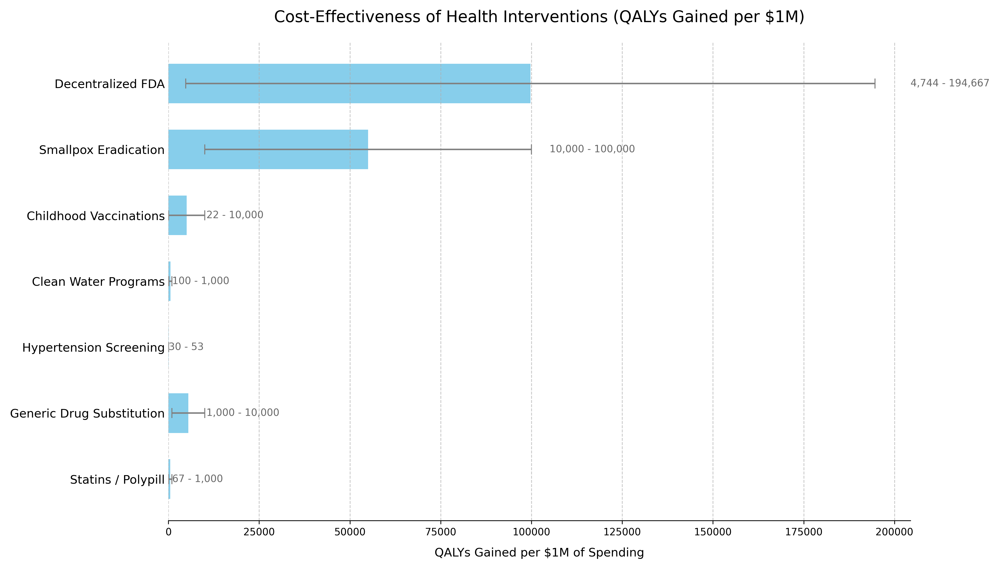

# Ubiquitous Pragmatic Trial Impact Analysis: How to Prevent a Year of Death and Suffering for 84 Cents

**Config:** _quarto-dfda-impact.yml
**Type:** website
**Files:** 1 | **Words:** 11,185 | **Images:** 21 | **Est. Pages:** ~55

#### knowledge/appendix/dfda-impact-paper.qmd
**Title:** Ubiquitous Pragmatic Trial Impact Analysis: How to Prevent a Year of Death and Suffering for 84 Cents
**Description:** Only 15 diseases/year (95% CI: 8 diseases/year-30 diseases/year) get their first treatment each year. With 6.65 thousand diseases (95% CI: 5.70 thousand diseases-8.24 thousand diseases) lacking effective treatments, the backlog would take 443 years (95% CI: 324 years-712 years) to clear. Integrating pragmatic trials into standard healthcare increases trial capacity 12.3x (95% CI: 4.2x-61.4x), cutting that timeline from 443 years (95% CI: 324 years-712 years) to 36 years (95% CI: 11.6 years-77.1 years). The average untreated disease gets a treatment 212 years (95% CI: 135 years-355 years) earlier, saving 10.7 billion deaths (95% CI: 7.40 billion deaths-16.2 billion deaths) at $0.842 (95% CI: $0.242-$1.75) per year of healthy life saved.
**Stats:** 11,185 words | 1,208 lines | 21 images | ~55p

  - Executive Summary
    - The Receipts {#key-findings}
    - Key Metric Derivations
    - Interpreting These Figures: Cumulative, Not Annual
    - The Discovery Capacity Model {#the-discovery-capacity-model}
  - Capabilities
    - Core Model: An Open Coordination Protocol
    
    - Key Capabilities
    - Potential Impact on the Status Quo
  - Addressing Key Concerns
    - Historical Validation: Pre-1962 Physician-Led Efficacy Testing
    - Why "Eventually Avoidable" Matters
    - Trial Funding Scenario
    
    - On the Funding Assumption
  - Framework Costs (ROM Estimates) {#dfda-framework-costs-rom-estimates}
    
    - Upfront Build Costs (30 Months) {#upfront-build-costs}
    - Ecosystem Participants
    - Why This Matters
    - Annual Operational Costs (5M MAU Target Scale) {#annual-operational-costs}
      - Marginal Cost Analysis per User
    - Scenario Based ROM Estimates for Broader Initiative Costs
      - Interpretation
      - Summary
  - Benefit Analysis - Quantifying the Savings
    - Market Size and Impact
    - Decentralized Trial Costs Modeled on Pragmatic Trials
    - Scope of Cost Reduction
    - Overall Savings
    - Economic Value of Earlier Access to Treatments
    
    - Gross R&D Savings from a Decentralized FDA {#gross-r-and-d-savings-from-implementing-a-decentralized-framework}
    - Post-Safety Efficacy Lag Elimination {#regulatory-delay-avoidance}
    - Relative Magnitude
    
      - The Efficacy Lag Problem
    
      - How a Decentralized Framework Eliminates the Efficacy Lag
      - Quantified Benefits (Efficacy Lag Component Only)
    
      - Efficacy Lag Elimination - Uncertainty Analysis
    - Safety and Risk Management
    
      - Current System Limitations: Dangerously Blind to Real-World Harms
    
    - Caution
      - Proposed System Safety Advantages
    
      - Detection Timeline Comparison
      - Comparative Safety Surveillance
      - Pooled Liability Insurance
  - ROI Analysis for a Decentralized FDA {#simplified-roi-scenario}
    - Monte Carlo Distributions
  - Research Acceleration Mechanism
    
    - The Unexplored Therapeutic Frontier
    
    - Addressing the Returns Question: Diminishing, Linear, or Compounding?
      - Why Diminishing Returns Is Unlikely (We Haven't Started Looking)
    
      - Mathematical Framework: When Would Diminishing Returns Dominate?
      - The Conservative Default: Linear Assumption
    
      - Funding Level vs. Cost-Effectiveness
  - Data Sources and Methodological Notes
  - Conclusion
    - Disclaimer
  - Verification: Complete Derivation Chains
    - Trial Capacity Multiplier Derivation
    
    - Timeline Shift Derivation
    - Lives Saved Derivation
    
    - Cost per DALY Derivation
    
    - ROI Derivation
    - Verification Summary
  - Key Analytical Assumptions
    - Linear Scaling Assumption
    - Adoption Rate Assumptions
    - Cost Reduction Assumptions
    - Eventually Avoidable Mortality Assumption
    - Counterfactual Baseline Specification
    - Methodology Validation Against Accepted Benchmarks
  - Appendix Calculation Frameworks and Detailed Analysis
    - Calculation Framework - NPV Methodology {#calculation-framework---npv-methodology}
    - Financial Analysis Summary {#financial-analysis-summary}
      - Health Impact Uncertainty Analysis
      - Financial Visualizations
    - Cost-Utility Framework {#dfda-icer-analysis---cost-utility-framework}
      - QALY Benefit Streams Breakdown
    
      - DALY Sensitivity Analysis
    - Comparative Cost-Effectiveness - A Decentralized Framework vs Other Interventions
    
    - Methodology Notes
    - Data Limitations
  - Comparison to Other Major Public Investments
  - Why This Differs from Failed Megaprojects
    
