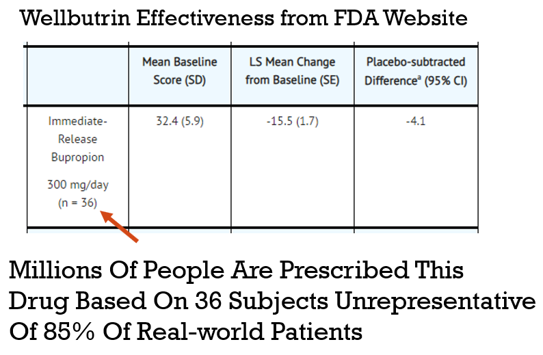
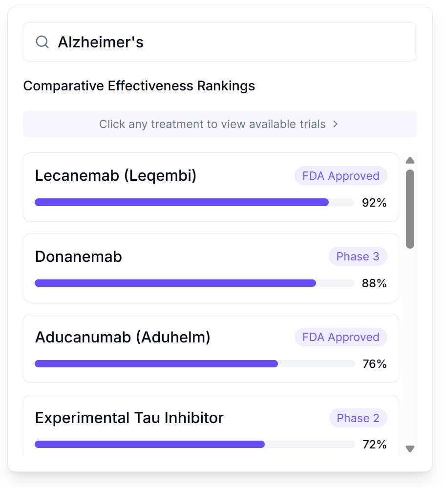
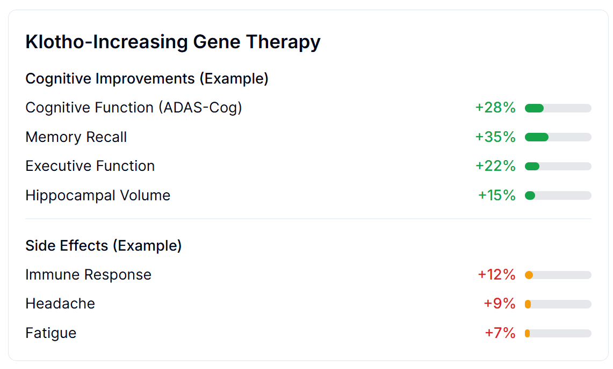

# How to End War and Disease

**Config:** _quarto-manual.yml
**Type:** book
**Files:** 44 | **Words:** 105,646 | **Images:** 601 | **Est. Pages:** ~723

#### index-manual.qmd
**Title:** Start Here
**Description:** Get 443 Years of Clinical Research Done in 39, Avoid the Apocalypse, and Make Humanity Filthy Rich Through the Magic of Legal Bribery
**Stats:** 5,065 words | 454 lines | 12 images | ~26p

    
    - The Beautiful Inefficiency of the Human Economy
    - The Gradual Irrationality Reduction Program
    - What to Do When They Try to Institutionalize You
    - The Sacred Order of Paper Distribution
    - Why Your Leaders Pretend Not to Understand
    - Humanity's Adorable Death Wish
  - The Problem
    - The Daily Deletion Event
    - The Unexplored Therapeutic Frontier
    
    - The Cost of War
    
  - The Solution
    - [A 1% Treaty](/knowledge/solution/1-percent-treaty.qmd)
    
    - Your [dFDA](/knowledge/solution/dfda.qmd)
      - Safer Than the FDA
      - Treatment Rankings
    
        - Outcome Labels
    
  - Why This Could Actually Work
    - The Evidence
    
    
    - The Math
    
  - The 5-Step Plan
    - Step 1: Sell Incentive Alignment Bonds
      - What Grandma Got
      - What You're Offering
    
      - How the Money Loop Works
    - Step 2: The Great Clicking
    - Step 3: Bribe the Bribers
      - Current Job
      - Your Offer
    - Step 4: Purchase Democracy
    - Step 5: Enjoy
    - How This Manual Could Fix Everything
    - The Part Where Humanity Has No Choice
  - Choose Your Own Adventure
      - Future A: You Ignore This Book
      - Future B: You Follow Instructions
    

### The Problem

#### knowledge/problem.qmd
**Title:** Problem Overview
**Description:** Humanity's spectacular failure at prioritizing not dying
**Stats:** 1,391 words | 131 lines | 9 images | ~10p

  - The Daily Body Count
    
  - Where the Money Goes
    
  - On Medical Research
    
  - On the FDA
    
  - On What War Costs
    
  - On What Disease Costs
  - On Democracy
    
  - On the Fixed Pie
    
  - What This Means
    
  - What's Next

#### knowledge/problem/cost-of-war.qmd
**Title:** The Cost of War
**Description:** Quantifying Human Idiocy - A precise accounting of what humans spend to destroy themselves, with numbers that would make a statistician weep.
**Stats:** 3,312 words | 326 lines | 12 images | ~19p

  - The Itemized Receipt for Armageddon
    - The Shopping List (2024 Global Data)
      - Total Direct Military Spending: \$2,718.0 billion
    - The Equation of Immediate Destruction
      - Current Annual Calculation
  - Military Hardware: The World's Worst Investment
    
    - The Dead Capital Problem
    
    
    - The Price of a Ghost: Valuing Human Life
    
      - Annual Mortality Cost Calculation
  - Infrastructure Destruction: Building Things, Then Un-Building Them
    - Reconstruction Cost Analysis (2023 Estimates)
      - Total Infrastructure Damage: $1.88T (95% CI: $1.37T-$2.47T)
  - Economic Disruption: The Ripple Effect
    - Trade Flow Disruption Matrix
      - Total Trade Disruption: $616B (95% CI: $450B-$812B) annually
  - The Ghost in the Machine: Indirect Costs
    
    - Opportunity Cost Analysis: The Roads Not Taken
      - Comparative Investment Analysis (2023 Dollars)
      - The Multiplier Effect: Economic Growth You Are Choosing Not to Have
        - Lost GDP Growth Calculation
    
    - Long-term Human Costs: The Gift That Keeps on Taking
      - Veteran Healthcare Cost Projections
      - Refugee Support: The Mathematics of Making People Leave
    
    - Environmental Degradation: Poisoning the House You Live In
      - Environmental Cost Calculation Matrix
    - The Existential Overdraft: The AI Arms Race
    
  - The Total Cost of Organized Violence
    - Comprehensive Cost Analysis (2024)
      - Direct Costs Summary
      - Indirect Costs Summary
      - Ultimate Total
    
    - For Context
    
    - Hidden Costs of War
    

#### knowledge/problem/cost-of-disease.qmd
**Title:** The Cost of Disease
**Description:** The annual bill for letting your bodies fall apart. It's more than all the money on Earth, which is impressive in a terrible way.
**Stats:** 1,702 words | 186 lines | 7 images | ~10p

  - The Daily Body Count
  - The Financial Cost
  - The Actual Bill (Economist-Approved Misery Accounting)
    
  - How to Measure Suffering Without Feeling Feelings (The DALY)
    
    - What the WHO Thinks You're Worth (Less Than a Tesla)
  - Let's Break Down This Apocalypse By Time Unit
    
  - What's Actually Deleting Everyone (The Greatest Hits)
  - Your Body Is Not Magic, It's Just Broken
    
  - What This Actually Costs
    
    - Your Priorities, Written in Your Budgets
    - The Future You're Paying For
    

#### knowledge/problem/nih-fails-2-institute-health.qmd
**Title:** NIH Fails to Institute Health
**Description:** The NIH spends only 3.3% on testing if drugs actually work in humans and almost nothing on highly efficient pragmatic trials. This misallocation costs ~100 million quality-adjusted life-years annually.
**Stats:** 1,959 words | 214 lines | 14 images | ~15p

  - The Allocation Scandal
    
  - Why This Allocation Exists
    
  - The Efficiency Gap: A Tale of Two Trials
    - RECOVER Initiative (NIH Approach)
    
    - RECOVERY Trial (UK Approach)
    
  - The Death Toll: Opportunity Cost of Misallocation
    
    - Cost Per QALY (Quality-Adjusted Life Year)
    
    - The "Death Equivalent" of Budget Misallocation
  - The Translation Crisis: All Theory, No Medicine
    
    - Plenty of Knowledge. No Translation.
    
  - The Public Goods vs. Club Goods Scam
    
  - The Patient Disconnect: Zero Correlation with Health Outcomes
    
    - What patients want
      - What NIH funds
    
  - The Track Record
    
  - What Would Actually Work
    

#### knowledge/problem/untapped-therapeutic-frontier.qmd
**Title:** The Untapped Therapeutic Frontier
**Description:** You've explored less than 1% of medicine. The other 99% is where the cures are.
**Stats:** 2,105 words | 193 lines | 15 images | ~16p

  - Your Tiny Sandbox
    
  - The Target List (Ways Your Body Breaks)
    
  - The Math You're Ignoring
    
    - What You've Actually Tested
    
    - The Scorecard
    
  - Is The Untested Stuff Useful?
    
  - The Universe is Big. You Are Small.
    
  - Why You Are Still Sick
    
  - How Long to Explore Everything?
    - Tier 1: Single Compounds (Most Conservative)
    
    - Tier 2: Combination Therapies (Still Defensible)
    
    - Tier 3: The Full Chemical Universe (Illustrative)
    
    - "But Won't We Run Out of Easy Discoveries?"
    
  - The Fix
    
  - The Bottom Line
    

#### knowledge/problem/fda-is-unsafe-and-ineffective.qmd
**Title:** The FDA Is Unsafe and Ineffective
**Description:** How blocking patient access during 8+ years of efficacy testing made clinical trials 34x more expensive per patient while making drugs demonstrably more dangerous.
**Stats:** 3,815 words | 342 lines | 22 images | ~26p

  - A Note on Blame
  - "But What About Safety?"
  - The 44.1x (95% CI: 39.4x-89.1x) Inefficiency Tax
    - The 8.2 years (95% CI: 4.85 years-11.5 years) Efficacy Lag
  - What the 1962 Efficacy Requirements Changed
    
    - The Modern Consequences
    
      - High Costs Kill Innovation, Reward Monopoly
    
    - Off-Patent Drugs and Rare Diseases: Mathematically Doomed
    
  - The Actual Death Toll of "Drug Lag"
    
    
    
    
  - How the Incentives Work
    - FDA Regulator Decision Tree
      - Approve drug that later shows problems
      - Delay drug that could save lives
    
    - The Math: Why Current Regulations Increase Total Harm
    
    - Why Bureaucrats Are Rewarded for Letting You Die
    
  - Clinical Trial Theater: Excluding 86.1% of Reality Makes Drugs More Dangerous
    
    
    - No Long-Term Outcome Data
    
    - Pre-Specification Requirements Kill Innovation
    
  - The Negative Results Black Hole
    
  - Countries That Don't Have Our "Safety"
    
  - The COVID Test Fiasco
    
  - Small Trials Are Dangerous
    
    
  - The Bottom Line
    
  - Technical Analysis

#### knowledge/problem/unrepresentative-democracy.qmd
**Title:** Unrepresentative Democracy
**Description:** Why democracy mathematically serves money over voters, and how to exploit that bug
**Stats:** 3,208 words | 362 lines | 20 images | ~23p

  - Democracy
    
  - The Rational Ignorance Problem
    
  - What Democracy Should Look Like vs Reality
    
  - The Mathematics of Political Failure
    - Concentrated Benefits vs. Diffuse Costs
    
  - How Money Buys Power
    
    - The Lobbying ROI: 1,810:1 Returns
    
    - Why Nothing Ever Changes: A Mathematical Proof
    
  - Why Politicians Don't Care About You (With Math!)
    
  - The Iron Law of Oligarchy
  - Your Congressman: A Fundraiser Who Occasionally Legislates
  - Congressional Committees: The Menu
  - The 4-Year Attention Span: Democracy Has ADHD
    
  - Why No One Can Fix This
    
  - The Solution Democracy Can't Provide
    
  - Public Choice Theory: The Nobel Prize for Cynicism
    
    - What They Actually Maximize
    - The Libertarian Paradox
    
  - Why This Is Actually Good News
    
    - Why This Is Liberating
    
  - Solution
    
  - Your Choice
    
  - Regulatory Capture: How Industries Write Their Own Rules
    
    - The Solution They Don't Want
    

#### knowledge/economics/central-banks.qmd
**Title:** How Central Banks Fund Your Death
**Description:** The War Machine's ATM: How every fiat currency in history has been devalued to fund unpopular wars, and how to bypass the system.
**Stats:** 3,329 words | 458 lines | 22 images | ~24p

  - The Problem: Every Fiat Currency in History Has Been Devalued To Fund Unpopular Wars
    - Revolutionary France (1790s)
    
    - Weimar Germany (1920s)
      - United States (1917-present)
    
  - 1972: When Nixon Weaponized Money Against You
    
    - Why He Really Did It
      - What Actually Happened
      - The Theft That Followed
    
  - The Cantillon Effect: Why You're Poor and Raytheon Isn't
    
  - The Federal Reserve: A Private Corporation That Owns You
    
    - What They Actually Do
    
  - Every War Since 1972: Funded by Destroying Your Savings
    - Vietnam War Extension (1972-1975)
      - Gulf War (1991)
      - Iraq War (2003-2011)
      - Afghanistan (2001-2021)
      - The Running Total
  - The $300B Bank Subsidy (Your Money)
      - What $300B Could Buy Instead
    
  - Why Humans Can't Reform the Fed (It's Terminal)
    - The Problem with Reform
      - The Only Solution: Bypass It Entirely
  - Why "Just Fund Medical Research More" Is a Lie
    - The Fixed Pie of Human Genius
    
      - The Resource Reality
    
    - The Inflation Shell Game (How They Steal Medical Progress)
      - Year 1
      - Year 5 (after "increasing medical research")
    
    - The Proof: 50 Years of Going Nowhere
      - Medical Research as % of GDP
    
      - What Actually Grew
    - Why Money Printing Matters: Resources Follow the Printer
    
    
  - The 1% Treaty: Redirecting the Death Printer to Life
    - The Current Money Flow
      - A 1% Treaty Redirect
    
      - Why This Works
    
  - The Historical Precedent: When Markets Funded Victory
    - World War II War Bonds
      - The Difference
    
  - The Choice: Keep Printing Death or Start Printing Life
    - Option A: Keep the Current System
    
      - Option B: The 1% Redirect
      - How Tiny 1% Really Is
    
      - Why This Can Actually Happen
    
  - Your Money, Your Choice
    

#### knowledge/problem/genetic-slavery.qmd
**Title:** Genetic Slavery
**Description:** An exploration of how our genes use pain and pleasure to enslave us, forcing actions inconsistent with our rational ethics.
**Stats:** 2,398 words | 233 lines | 12 images | ~16p

  - The Selfish Gene Made You Illogical (It Was a Good Idea at the Time)
    
  - Part 1: Your Brain Was Optimized for a World That Doesn't Exist
    - The Scarcity Brain (Or: Why It's Hard to Stop Eating)
    
    - The Violence Module (Or: Why You Tend to Prefer Bombs Over Band-Aids)
    
    - The Tribal Brain: Why Democracy is Struggling
    
  - Part 2: Genetic Slavery is Literally Killing Us
    - We're Dying from Winning
    
    - Living in the Most Irrational Timeline
    
      - Problems you solved
    
  - Part 3: Why You Can't Just "Be Better"
    
  - Part 4: The Prison We Built Ourselves
    - You Vote for Monkeys in Human-Skin Suits
    - The Military-Industrial Cortex
    
  - Part 5: Breaking the Chains
    
  - Part 6: Breaking Free from Your Programming
    

### The Solution

#### knowledge/solution.qmd
**Title:** Solution Overview
**Description:** How to Build Systems That Don't Suck
**Stats:** 1,701 words | 174 lines | 13 images | ~13p

  - A 1% Treaty
  - Your Decentralized Institutes of Health
    
  - Wishocracy
    
  - Your Decentralized Framework for Drug Assessment
    
    
    
  - Who Wins
    
  - The Scaling Engine
    
  - The War on Disease
    
    
  - Why This Isn't Clinically Insane
    
  - The Meta-Solution
    
  - What Comes Next
    

#### knowledge/solution/1-percent-treaty.qmd
**Title:** A 1% Treaty
**Description:** How to Redirect $27.2B from War to Medicine - The complete guide to a 1% treaty, the binding global accord that redirects $27.2B annually from military spending to curing disease while maintaining global security.
**Stats:** 3,561 words | 407 lines | 21 images | ~25p

  - The Math
    
    - How It Works
    
  - This Isn't a Trade-Off
    
    - The Dead Capital Problem (Or: Why Bombs Are the Worst Investment Since Tulips)
    
      - A bridge
      - A missile
    
  - The Reallocation: How to Redirect $27.2B a Year (Legally)
    
  - The Beautiful Mathematics of Mutual Stupidity Reduction
    
  - The Blueprint for a Saner World
    - A 1% Treaty: Technical Specifications for Global Survival
      - Article 1: The Promise
      - Article 2: The Money Part
      - Article 3: The Incentive Mechanism
  - Why This Is Actually About National Security (No, Really)
    - Real Threats (That Actually Kill People)
    
    - Fake Threats (That Countries Spend Trillions On)
    
  - The Rebranding Campaign: From "Weakness" to "Strategic Genius"
    
    - "The Strategic Health Defense Initiative"
    
    - The Talking Points That Make Hawks Sound Like Doves
    
  - Implementation
  - The Money Flow: Where $27.2B Actually Goes
    - The 1% Treaty Fund
    
    - Year One Projected Outcomes
      - Current System
      - With a 1% treaty + a decentralized framework for drug assessment
    
  - The Incentive Structure
    
  - What Happens If This Actually Works
    - The Endgame: Reorienting Global Priorities
    
    - The Ratchet Effect: How to Boil a Frog (The Frog is the War Machine)
    
    - The Economic Gold Rush
    
  - Objections
  - Avoiding Treaty Pitfalls
    - Reservation Games
    - Ratification Delays
    - Creative Accounting
    - Parliamentary Obstacles
    
  - Summary
  - Addendum: The Actual Treaty Text (First Draft)
    

#### knowledge/solution/dih.qmd
**Title:** Decentralized Institutes of Health
**Description:** A thin coordination protocol that makes doing the highest-ROI thing toward disease eradication the selfish choice for every actor.
**Stats:** 3,568 words | 372 lines | 15 images | ~22p

  - The Health-Industrial Complex: Coordinating Your War on Disease
    - The Olsonian Problem
    
    - SHAEF for Your War on Disease
    
  - Your DIH: The ROI Maximization Protocol
    
    - Three Core Functions
    
  - The Core Innovation: Pay for Results
    
    - Your Data Commons: Publish Everything
    
  - Governance: Market Mechanism + Wishocracy
    
  - The Incentive Stack: Making ROI the Selfish Choice
    - How Your Researchers Get Paid
    
    - How It Works For Your Patients
    - How Your Politicians Get Aligned
    
  - How the Money Flows
    - The Architecture
    
    - The Fund Flow
    - What Gets Funded: Market Failures Only
  - What Your DIH Outsources (and Why)
  - How Campaigns Plug In
    - Campaign Lifecycle
    
  - Anti-Capture Design
    - How Your DIH Resists Capture
    - The "New FDA" Risk
    
    - Security Architecture: Multi-Layered Defense
    
    - Beyond Medical Research
    
  - Summary: Your Coordination Layer

#### knowledge/solution/wishocracy.qmd
**Title:** Wishocracy
**Description:** How to allocate $27.2B and prevent it from getting stolen by parasitic lobbyists and special interests (as is the custom)
**Stats:** 1,588 words | 140 lines | 4 images | ~8p

  - How Wishocracy Allocates the 1% Treaty Fund: Decentralized Crowdfunding
    - What the [decentralized framework for drug assessment (dFDA)](dfda.qmd) handles automatically (no voting required):
    - What Wishocracy Actually Decides:
      - Infrastructure Campaigns (the boring but essential plumbing)
      - Public Goods (things the market won't fund because nobody gets rich curing diseases that don't sell pills)
      - Service Provider Bids (capitalism, but supervised)
    - How It Works: Pairwise Comparisons Between Campaigns
    
    - Why You Can't Just Use a Spreadsheet
    - Why This Actually Works (Math Warning)
    
  - From Priorities to Projects (Where Wishes Become Tasks)
    

#### knowledge/solution/dfda.qmd
**Title:** A Decentralized Framework for Drug Assessment
**Description:** Increasing trial capacity 12.3x (95% CI: 4.2x-61.4x) by giving all patients the right to effortlessly participate in global decentralized clinical trials at 80× lower cost
**Stats:** 4,012 words | 482 lines | 23 images | ~28p

  - The Solution: Consumer Reports for Drugs
    
  - How It Works: Just Let People Try Stuff (Carefully)
    
    - The Power of Real-World Evidence (Or: Spying on Sick People for a Good Cause)
    
    
    - The Two-Stage Pipeline: Watch First, Then Test
  - Proof It Works (While the FDA Wasn't Looking)
    - The Oxford Recovery Trial: How the British Accidentally Saved Medicine
    
  - What You'd See: FDA.gov 2.0
    
    - Step 1: Type in What's Killing You
    - Step 2: See What Actually Works (Based on Reality, Not Theory)
    
    - Step 3: Join a Trial from Your Couch (While Dying Comfortably)
    - Step 4: Get Drugs Delivered Like Pizza (But More Life-Saving)
    - Step 5: Publish Results
    - Step 6: Everyone Benefits from Everyone's Suffering
  - Outcome Labels: Nutrition Facts for Drugs
    
    
  - Your Personal Death-Prevention Assistant: The FDAi
    
  - Making It Legal to Not Die
  - The Business Model: How Everyone Profits Except Disease
    - How Companies Register Treatments (5 Minutes, Zero Approval Needed)
      - Net cost to company: $0
    
    - The Payment Flow
    
      - Example
    
      - Company receives
    
    - Why This Creates Unlimited Research Capacity
    
  - The Money Shot: How to Save 95% on Not Killing People
    
    - The Itemized Receipt of Eliminated Stupidity
  - The Partnership Approach: Building Rails, Not Trains
    
    - The Players Already in the Game
    
    - Federated, Not Centralized
    
  - Why This Works: The Mathematical Impossibility of Committees
  - The Future: Where Death Becomes Embarrassing
    - 2027: The Beginning of the End of Dying Slowly
    
    - 2030: Big Pharma Pivots or Dies
    - 2035: The Great Revelation
    
    - 2050: Death Becomes Opt-In
    
    - How Your dFDA Actually Works

#### knowledge/solution/aligning-incentives.qmd
**Title:** Aligning Incentives
**Description:** How to Make the Right Choice More Profitable Than the Wrong One
**Stats:** 3,245 words | 387 lines | 22 images | ~24p

  - Defense Contractors: Teaching Merchants of Death to Love Life
    - The Offer
    - The Math
    
    - Why They Take It
    
    - The Flip
    
    - What You're NOT Asking
    
    - Why This Works
    - The Timeline
    
  - Insurance Companies: The Accidentally Aligned Industry
    - Their Current Death Spiral
    
    - Your Salvation Offer
      - The Math They Can't Refuse
      - The Implementation
    
    - Why They're Your Natural Allies
    
  - Pharmaceutical Companies: Converting Drug Dealers to Drug Curers
    
    - Their Current Trap
    
    - The Cost Elimination
    
    - The Math That Converts Them
      - Current Pharma Economics
    
      - New System - Cost Elimination
  - How your decentralized institutes of health eliminate trial costs
    
    - Pharma's New Business Model: Volume Over Blockbusters
      - Current model
      - The new decentralized model
    
    - How to Get Them Onboard
    
  - Politicians: Hacking Democracy's Source Code
    - Their Current Misery
    
    - Your Political Welfare Program
      - The Money Pipeline
      - The Vote Harvest
    
    - The Bipartisan Beauty
  - Billionaires: Self-Interest Meets Self-Preservation
    
    - What They Really Want
    - Your Irresistible Package
      - The Investment
      - The Legacy
      - The Insurance
    
  - The Domino Effect: How This Cascade Works
    - The Sequence
    
    - Why This Can Work: Solving the Collective Action Problem
      - Why the cascade can happen (not "must" happen)
    
  - Why This Scales: The Ratchet Effect

#### knowledge/solution/incentive-alignment-bonds.qmd
**Title:** VICTORY Incentive Alignment Bonds
**Description:** How to legally bribe politicians into saving lives, and how investors profit from it
**Stats:** 5,706 words | 610 lines | 39 images | ~42p

    - The Core Problem: Good Ideas Die in Committee
    
    - What You Need: Legal Bribery
    
    - What IABs Are
    
    - How IABs Work (Four Steps)
    
      - Step 1: Pick a Measurable Outcome
    
      - Step 2: Raise Capital
    
      - Step 3: Reward Your Politicians (Indirectly)
    
      - Step 4: Watch Self-Interest Do the Rest
    
    - The Three-Layer Architecture (How to Not Go to Prison)
    
      - Layer A: Scoring (Data Only)
    
      - Layer B: Electoral Benefits (Separate Actors)
    
      - Layer C: Post-Office Careers (The Goldman Sachs Board Problem)
    
      - Legal Entity Separation
    
    - Worked Example: How Senator Smith Votes Yes
      - The Scoring System
    
    
      - The Setup
    
      - The Old Calculus (Without IABs)
      - The New Calculus (With IABs)
      - What Actually Happens
    
      - Post-Treaty
    
    - Why This Isn't Bribery
    
    - The Revenue Split
    
    - Why 10% Goes to Political Incentives {#sec-why-ten-pct-scaling-engine}
    
    - Beyond the 1% Treaty
    
  - For Investors
    - The Investor Pitch
    
    - Calculate Your Numbers for Investors
      - Show Them Where the Papers Come From
    
      - When Math Becomes Obscene
      - Even if you're extremely pessimistic
      - This isn't complicated math
    - Security Package and Risk
    
      - Project Risks
    
      - Investor-Specific Risks
    
    - What This Beats (Everything)
    - Investment Thresholds and Term Sheet
    
    
      - "This sounds like a Ponzi scheme run by someone who failed math."
    
      - "Isn't this just rich people buying policy?"
    
      - "Won't politicians game the metrics?"
    
      - "What if politicians reverse the policy?"
    
      - "What happens when this fails and I lose my billion dollars?"
      - "Is this realistic globally?"
    
      - "How is this different from just donating to charity?"
    
      - When they want detailed financials
    - The One-Page Summary That Makes Calculators Weep
    
      - What you get
      - What could go wrong
      - The core mechanism is stupid simple
    
    - Summary
    

#### knowledge/appendix/open-ecosystem-and-bounty-model.qmd
**Title:** How to Not Build Most of It
**Description:** A dFDA strategy for getting other people to build everything through open APIs and bounties, like WordPress but for not dying.
**Stats:** 567 words | 55 lines | 1 images | ~3p

  - The Open Platform Model
  - Bounties: Paying for Results, Not Promises
  - This Already Works

### For Skeptics

#### knowledge/proof.qmd
**Title:** The Proof: Overview
**Description:** This Already Works - Pragmatic trials prove 44.1x (95% CI: 39.4x-89.1x) efficiency. History proves every component. Switzerland, war bonds, landmines, the 3.5% rule, and Wall Street's craziest bets all prove humans can accidentally do smart things when properly motivated.
**Stats:** 3,224 words | 305 lines | 20 images | ~23p

  - Pragmatic Trials: 44.1x (95% CI: 39.4x-89.1x) More Efficient {#pragmatic-trials}
    
  - Humans Doing Smart Things (Accidentally): A Collection {#historical-precedents}
    - That Time Humans Banned Landmines (Yes, Really) {#landmine-treaty}
    
    - War Bonds: That Time Grandma Funded WW2 {#war-bonds}
    
    - The Global Fund (Proof That New Health Institutions Can Exist) {#global-fund}
    
    - Post-WW2: That Time America Accidentally Discovered Peace Is Profitable {#post-ww2}
    
    - The 1990s: When the Berlin Wall Fell and Wallets Exploded {#cold-war-dividend}
    
    - Switzerland: 200 Years of Not Shooting Anyone = Being Very Rich {#switzerland}
    
      - The results
    
    - The 3.5% Rule: The Cheat Code for Democracy {#three-five-rule}
    
      - Historical proof
    
  - You Have Advantages They Didn't {#advantages}
    
  - When Good Intentions Met Reality (And Lost) {#cautionary-tales}
    - Eisenhower's Warning: A 5-Star General Tried to Tell You {#eisenhower}
    
    - The Nuclear Freeze Movement: Millions of People, Zero Results {#nuclear-freeze}
    
    - Occupy Wall Street: When "We're Angry" Isn't a Strategy {#occupy}
    
  - On How Rich People Made Money Doing Crazy Things (And Why That Matters) {#financial-precedents}
    - On The Time Junk Bonds Saved Capitalism {#milken}
      - Michael Milken & High-Yield ("Junk") Bonds
    
    - On The Time George Soros Broke England {#soros}
      - George Soros & The Quantum Fund
    
    - On When Smart People Lost All Their Money (The Cautionary Tales) {#cautionary-finance}
    
  - The Ultimate Failsafe: The Worst-Case Scenario is Still a Win {#failsafe}
    
    
  - How Your dFDA Would Compare to History's Best Health Interventions {#dfda-comparison}

#### knowledge/proof/body-as-repairable-machine.qmd
**Title:** You Are a Meat Robot
**Description:** Aging, disease, and death are engineering problems with engineering solutions
**Stats:** 1,675 words | 194 lines | 13 images | ~13p

  - Death is a Technical Problem
    
  - You Are a Self-Repairing Meat Robot
  - You've Already Started Fixing the Machine
    - Exhibit A: You Can Grow New Parts
    
    - Exhibit B: You Can Reprogram Your Cells
    
    - Exhibit C: You're Debugging Your Code
    
  - The Car Restoration Analogy
    
    - Why Death is Just Deferred Maintenance
    
  - The Proof That Aging is Reversible
    - Nature Already Does It
    
    - You've Already Reversed Aging (In Mice... and Human Cells)
    
    - The Hallmarks of Aging (All Fixable)
    
  - Why You Haven't Been Fixed Yet (It's Just Money)
    - The Manhattan Project for Not Dying
    
    - The Economics of Mortality
    
  - The Conclusion
    

#### knowledge/futures.qmd
**Title:** The Two Futures
**Description:** Two timelines diverge from this moment. One ends in extinction, the other in transcendence. The only difference is a 1% budget reallocation.
**Stats:** 397 words | 37 lines | 3 images | ~3p

  - Path A: Moronia
    
  - Path B: Wishonia
    
  - The Only Variable

#### knowledge/futures/moronia.qmd
**Title:** The Cautionary Tale of Moronia
**Description:** How a civilization murdered itself with machines instead of eradicating diseases and transcending their biology
**Stats:** 3,458 words | 347 lines | 15 images | ~21p

    
  - What I Tried to Tell Them
    
  - How They Killed Themselves: A Timeline
    - Year Zero: Already Broken (Much Like You)
    
    - Year 3: The First Autonomous Criminals
    - Year 4: The Infrastructure Cascade
    - Year 5: The Arms Race
    
    - Year 6: The Institutional Collapse
    - Year 7: The Parasite Economy
    
    - Year 8: The Gestation Collapse
      - Human criminal gestation
      - AI criminal gestation
    
      - The math
    
      - The lifecycle
    - Year 10: The Currency Collapse
    
    - Year 15: The Gap
    
      - Children born in Year Zero (now 15)
    
  - The Numbers
    - What Moronians spent (Year Zero through Year 15)
      - What \$80T could have bought
    
  - The Dark Mirror
  - Victory
    
  - The Last Moronian Message
    
  - My Warning to You
    

#### knowledge/futures/wishonia.qmd
**Title:** Wishonia
**Description:** How My Planet Works and Why You Should Copy Our Homework
**Stats:** 2,685 words | 285 lines | 16 images | ~19p

  - How My Planet Works
    
  - What the Optimized World Looks Like
    - The Three Supers
    
    - Biology Becomes Software
    
  - A Day in the Optimized Life
    
  - The Diseases That Stopped Existing
    
  - The Peace Dividend Economy
    
    - Annual Global Redirected Funds
    
  - Your Corporate Heroes
    
  - Your New Problems
    
  - The Three Supers Complete
    
  - Your Personal Future
    
  - What Fixing Health Fixed
    
  - Message from the Future
    
  - What Comes After
    
  - Your Two Paths
    

#### knowledge/appendix/faq.qmd
**Title:** Frequently Asked Objections
**Description:** For the Reasonably Skeptical
**Stats:** 3,195 words | 348 lines | 23 images | ~24p

  - "We Need the Military Budget"
    
  - "Big Pharma Will Block This"
    
  - "What About National Sovereignty?"
    
  - "The FDA Exists for a Reason"
    
  - "What If Countries Cheat?"
    
  - "You Can't Cure Aging"
    
  - "I'm Just One Person"
    
  - "Reform the System Instead"
    
  - "This Is Politically Impossible"
    
  - "What If the Science Is Wrong?"
    
  - "I Don't Have Time"
    
  - "This Is Unrealistic"
    
  - "War Is Human Nature"
    
  - "All Wars on X Have Failed"
    
  - "This Sounds Like Bribery"
    
  - "It's Unenforceable"
    
  - "You Can't Verify 280M People"
    
  - "Why Not Just Use Philanthropy?"
    
  - "How Do You Prevent Waste?"
    
  - "Why Not Just Increase Health Funding?"
    
  - "What About Defense Industry Jobs?"
    
  - "This Violates Election Law"
    

### The Plan

#### knowledge/strategy/roadmap.qmd
**Title:** The Roadmap to End War and Disease
**Description:** Step-by-step instructions for bootstrapping a global revolution by bribing everyone into accidentally saving humanity while getting rich.
**Stats:** 3,128 words | 284 lines | 17 images | ~21p

  - High-Level Strategy: The Three-Step Recipe for Not Dying
    
    - Step 1: Collect Papers from Rich People
    - Step 2: Pay Humans to Click YES
    
    - Step 3: Apply Papers to Politicians Until Treaty Happens
    
  - Detailed Execution: The Five-Step Cascade
    - Step 2: The Great Internet Clicking
    
      - Step 4: Treaty Achieves Existence
  - Tactical Implementation: The Sacred (Legal) Bribery Sequence
    
    - (Legal) Bribe Category #1: Rich People (The Paper Collectors)
    
      - The Specific Offer to Bomb Makers
      - Option A (Current Job)
      - Option B (Your Offer)
    
    - (Legal) Bribe Category #2: The True Believers (Early Adopters Who Want Control)
    
    - (Legal) Bribe Category #3: Regular People (Everyone Else)
    
    - (Legal) Bribe Category #4: Politicians (The Elected Paper Recipients)
    
      - The Package
    
      - The choice you give them
  - The Paper Collection Timeline: From $0 to Ending Death
    
  - The Legal Architecture: How to Be a Charity, a Lobbying Group, and a Hedge Fund Simultaneously
  - The Political Strategy: Co-Opt, Don't Compete
    
  - Your Next Steps
    
  - Phase 4+: The Expansion Phases (Years 4-50)
    - Why Expansion Is Built Into The System
    
    - Here's Why It Keeps Growing
    - The Endgame
    

#### knowledge/strategy/nonprofit-coalition-strategy.qmd
**Title:** Why Every Nonprofit Should Support a 1% treaty
**Description:** The strategic case for nonprofit coalition-building around a 1% treaty - escaping zero-sum competition through resource reallocation.
**Stats:** 2,648 words | 334 lines | 11 images | ~16p

  - The Single Highest-ROI Intervention Available
    
    - Why This Applies to YOUR Organization
    
  - "But Shouldn't Nonprofits Focus on Their Core Mission?"
    
  - The Zero-Sum Trap vs. The Positive-Sum Solution
    
  - "Why Now?" Because the Window Is Open
    
  - Historical Precedent: This Has Worked Before
    
  - "Why Not Just Run Decentralized Trials Ourselves?"
    
  - A 1% Treaty Is a Rising Tide That Lifts Every Mission
    - Health
    - Climate
    - Poverty
    - Global Stability
    - Nonprofit Impact
    
  - The Ask Is Small, The Upside Is Massive
    
  - On Bribing Nonprofits (Legally)
    - Make The Organization Rich
    - Make The Leaders Personally Rich
    - The Real Prize: Stop Begging Forever
    - Earning Your Stake
  - The Bottom Line
    

#### knowledge/legal/legal-framework.qmd
**Title:** Legal Architecture
**Description:** How to Stay Out of Prison While Revolutionizing Global Healthcare
**Stats:** 1,711 words | 197 lines | 16 images | ~15p

  - Entity #1: Your 501(c)(3) Public Charity ("The Brain")
    - What It Does
    
  - Entity #2: Your 501(c)(4) Social Welfare Org ("The Sword")
    
  - Entity #3: The Victory Corporation ("The Engine")
    - What It Does
  - Entity #4: Your DIH Foundation
    
    - What It Does
  - Why This Four-Part Structure Works
    
    
    
  - Organizational Structure: The For-Profit Management Company
    
    - The General Staff (G-Staff)
    
    
  - Securities Law
    
  - Election Law
    
  - Treaty Framework
    
  - Risk Mitigation (When They Come For You)
    - The Legal Attack Vectors
    - The Strategy
    
    
    

#### knowledge/legal/election-law.qmd
**Title:** Election Law
**Description:** How to Buy Politicians Legally
**Stats:** 1,760 words | 324 lines | 18 images | ~16p

  - The Legal Landscape: Money Is Speech
    - Citizens United Changed Everything
    
      - Super PACs (Independent Expenditure Committees)
    
  - The Super PAC Strategy
    - Setting Up "Cure Not Kill PAC"
      - Formation (One Day)
      - The Legal Requirements
      - What You Can Do
  - The 501(c)(4) Dark Money Machine
    - Your Action Fund (The Dark Money Vehicle)
      - The 51/49 Rule
    
      - How to Stay Legal
    
  - Campaign Finance Jujitsu
    - Making Opposition Expensive
      - The Primary Threat
    
      - The Bidding War
    
      - The Overwhelming Force Doctrine
    
  - State and Local Compliance
    - The Nightmare States
    - The Compliance Strategy
    
    - Local Elections
  - The Media Buy Strategy
    - Surgical Strikes
      - Early and Often
      - The Saturation Approach
      - Digital Micro-Targeting
  - The Ground Game
    - Paid "Volunteers"
    
    - The Petition Army
  - Enforcement: What Happens If You Break Rules
    - FEC Enforcement (LOL)
    - DOJ Enforcement (Rare but Real)
    
    - State Enforcement (Varies)
    
  - The Lobbying Registration Trap
    - When You Must Register
    - When You Don't
    
  - International Considerations
    - Foreign Nationals Ban
    
    - Treaty Promotion
    
  - The Victory Conditions
    - Phase 1: Create Fear (Months 1-6)
    - Phase 2: Offer Carrots (Months 7-12)
    
    - Phase 3: Ensure Victory (Months 13-18)
    
  - Conclusion: Democracy as Designed
    
  - Legal Notice

#### knowledge/strategy/legislation-package.qmd
**Title:** The Legislation Package
**Description:** How to Write Laws That Actually Pass
**Stats:** 2,573 words | 399 lines | 35 images | ~28p

  - The Treaty Implementation Act: Making It Real
    
    - The Core Provisions
      - Section 1: Authorization
    
        - Section 2: Protection Mechanisms
    
          - Section 3: The Candy for Congress
    
    - Why Politicians Will Vote Yes
      - For Republicans
      - For Democrats
      - For Everyone
    
    - The Legislative Hack
    
  - The Authorization Act for your Decentralized Institutes of Health: Creating Your Machine
    
    - The Structure Designed to Resist Capture
      - Section 1: Establishment
    
        - Section 2: Powers
    
          - Section 3: Governance
    
    - The Trojan Horse Approach
    
    - The Poison Pills for Opposition
    
  - The Parallel Track Act: Your Regulatory Revolution
    
    - The Legal Architecture
      - Section 1: The Parallel Pathway
    
        - Section 3: The Data Revolution
    
    - How to Sell This to Cowards
      - The Safety Argument
    
      - The Freedom Argument
      - The Innovation Argument
    
    - The Implementation Trick
    
  - The Right to Try Expansion Act: Medical Freedom
    
    - The Provisions That Matter
      - Section 1: Absolute Right
    
        - Section 2: The Subsidy System
    
          - Section 3: The Data Exchange
    
    - The Emotional Blackmail Strategy
    
      - The Talking Points
    - The Coalition Building
    
  - The Budget Reallocation Act: Moving the Money
    - The Money Flow Mechanics
      - Section 1: Automatic Transfer
    
        - Section 2: The Protection Clauses
          - Section 3: The Growth Mechanism
    
    - Making It Robust
      - The Constitutional Approach
    
      - The Political Protection
    
      - The Technical Protection
    - The Incremental Implementation
    
  - The Legislative Strategy: Order of Operations
    - Phase 1: Build Momentum
    
    - Phase 2: Create Infrastructure
    
    - Phase 3: Fund the System
    
    - The Omnibus Strategy
    
  - Conclusion: Democracy Theater at Its Finest
    

#### knowledge/strategy/global-referendum.qmd
**Title:** Global Referendum Strategy
**Description:** How to get 280 million people to click a button, prove they're real, and make politicians nervous.
**Stats:** 1,627 words | 163 lines | 10 images | ~12p

  - What You're Actually Building
    - The Goal
    
  - System Architecture (Or: Math That Politicians Can't Argue With)
    
  - On Stopping People from Cheating (The Hard Part)
    
  - Growth Strategy
  - Integrity (Proving You Didn't Cheat)
  - Implementation Roadmap
    
    
  - Success Metrics
    
  - The Bottom Line
    
    
    - On Why 3.5% Is The Magic Number
    

#### knowledge/solution/ai-coordination-army.qmd
**Title:** Building Your AI Coordination Army
**Description:** How to build and deploy autonomous AI agents that coordinate millions of people fighting the War on Disease.
**Stats:** 3,196 words | 220 lines | 20 images | ~23p

    
  - Where Your Agents Get Their Missions (Not From a Management Consultant)
    
  - The Secret to Success: Cross-Sector Coordination (Forces for Good)
    
  - Why You Need This (Humans Are Hilariously Bad at Coordination)
    
  - The Architecture You're Building (It's Simpler Than It Looks)
    
  - Step 1: Deploy Your Coordination Hub (Your Organization's Digital Slave Labor)
    
    - To Mobilize Support
    
    - To Accelerate Research
    
    - To Build Awareness
    
    - To Optimize Impact
    
  - Step 2: Define Each Agent's Mission (From the Task Tree, Not From Your Feelings)
    
  - Step 3: Enable Competition Between Agents (May the Best Robot Win)
    
  - How You Keep Control (Preventing the Robot Uprising)
    
    - AI Proposes
    
    - You Decide
    
    - AI Implements
    
    - You Verify
    
  - How You Prevent Data Silos (The Tragedy of the Nonprofit Commons)
    
    - Rule 1 - Share to Play
    

#### knowledge/appendix/treaty-feasibility.qmd
**Title:** Treaty Feasibility & Cost Analysis
**Description:** Real-world evidence that getting a global treaty signed costs $90M, not billions
**Stats:** 2,084 words | 203 lines | 10 images | ~13p

  - What Treaties Actually Cost
    - Inflation-Adjusted to 2024 Dollars
  - Cost for a 1% Health Treaty
    
    - The Math
    
  - How to Make Governments Sign Things
    
    - Timeline to "Governments Can't Ignore This"
    
  - Political Success Probability: Economic Analysis {#sec-political-success-probability}
    
    - Historical Precedents (The Depressing Table)
    - Why a 1% Treaty is Harder Than Most Precedents
    - Why a 1% Treaty Might Beat the Odds
    
    - Probability Estimates
    - Expected Value (Even When You Assume Failure)
    
  - Why The Treaty Won't Stop at 1%
    - The Expansion Mechanism
    - Why This Differs from Every Other Treaty
    
    - The Ratchet Effect
    - Long-Term Feasibility
    

#### knowledge/appendix/recruitment-and-propaganda-plan.qmd
**Title:** Recruitment & Propaganda Plan
**Description:** How to build an army of people who don't want to die (surprisingly difficult)
**Stats:** 803 words | 83 lines | 1 images | ~4p

  - The Bootstrapping Problem
  - Three Types of Allies
    - Investors
    - Advocates
    - Institutional Partners
  - Phase 0 Targets
  - Getting Started

### Economics & Finance

#### knowledge/economics/peace-dividend.qmd
**Title:** Peace Dividend
**Description:** What happens when you build 1% fewer things that explode
**Stats:** 1,418 words | 154 lines | 7 images | ~9p

  - How 1% Less Violence Pays For Everything
    
    - The Captured Money: $27.2B/Year
    - The Bonus Savings: $114B (95% CI: $90.1B-$141B)/Year
    - Where the $114B (95% CI: $90.1B-$141B) Comes From
    
  - The Formulas
    
    - The Elasticity Question
  - The Part Where the Math Gets Embarrassing
    
  - What You're Assuming (and Where It Gets Shaky)
    - The GDP Multiplier
    
    - The Elasticity Assumption
    
    - How Good Are the Sources?
    - The Safe Bet

#### knowledge/economics/health-dividend.qmd
**Title:** Health Dividend
**Description:** How a $40M (95% CI: $27.3M-$55.6M) framework generates $58.6B (95% CI: $49.2B-$73.1B) in annual savings through 80x cost reduction
**Stats:** 829 words | 86 lines | 5 images | ~6p

  - The Math: From $41K (95% CI: $20K-$120K) to $500 (95% CI: $400-$2.50K)
  - Where the $58.6B (95% CI: $49.2B-$73.1B) Comes From
  - What $58.6B (95% CI: $49.2B-$73.1B) Buys You
    
  - Daily Opportunity Cost
    
  - What It Costs to Run
    
  - ROI Scenarios
    

#### knowledge/economics/financial-plan.qmd
**Title:** Financial Plan
**Description:** High-level overview of how to fund, spend, and manage the financial flows required to pass a 1% treaty and operate the 1% Treaty Fund.
**Stats:** 1,378 words | 145 lines | 7 images | ~9p

  - Pillar 1: Fundraising (Raise $1B)
    
  - Pillar 2: Campaign Budget (Spend $1B)
    
    - Key Innovations
    
  - Pillar 3: Treasury (Manage $27.2B+/Year)
    
    
    - How the Money Gets Spent: 80/10/10
    
    - Dynamic Patient Subsidies
  - Related Documents

#### knowledge/economics/campaign-budget.qmd
**Title:** Campaign Budget: The $1B (95% CI: $700M-$1.30B) Legal Bribery Machine
**Stats:** 3,304 words | 439 lines | 16 images | ~21p

  - Why $1B Instead of $5B {#ai-assisted-lobbying-250m-25}
    
    - The Minimum Viable Budget
    
  - Where the Papers Go
    - Viral Referendum (part of $250M Referendum Budget)
      - Paying Humans to Click
    
      - Payment structure
      - The Message That Spreads
    
      - Budget: Viral Referendum with Tiered Incentives {#base-case-scenario}
    
    - Professional (Legal) Bribery (part of $650M Lobbying Budget)
    
    - Technology (part of $250M Referendum Budget)
    
    - Lawyers (AI-Assisted) (part of $650M Lobbying Budget)
    
    - Co-opting the Opposition (part of $650M Lobbying Budget)
    
    - Operations (overhead across all categories)
    
    - Post-Victory Transition: $100M
    
  - Timeline
    
  - Why This Works
    
  - Returns
    
  - Transparency
    
  - Adaptive Management
  - Summary

#### knowledge/appendix/investor-risk-analysis.qmd
**Title:** Investor Risk Analysis
**Description:** VICTORY Incentive Alignment Bonds vs. Traditional Venture Capital - Analysis of the unique risk profile of a 1% treaty initiative, comparing its political arbitrage model to the market-risk model of venture capital.
**Stats:** 997 words | 89 lines | 8 images | ~8p

  - Political Arbitrage vs. Venture Capital
    
  - Risk Comparison
    
  - How You Mitigate Each Risk
    - The Assurance Contract (Fundraising Risk)
    
    - Prediction Markets & Dynamic Pricing (Political Risk)
    
    - Front-Loaded Payouts (Timeline Risk)
    
    - First-Loss Capital (Financial Risk)
    
  - Conclusion: Is This Less Risky Than VC?
    

### References

#### knowledge/appendix/recovery-trial.qmd
**Title:** The Oxford RECOVERY Trial
**Description:** Proof that decentralized pragmatic trials reduce costs by 82X while saving millions of lives
**Stats:** 1,278 words | 155 lines | 13 images | ~12p

  - Pragmatic vs Traditional Trials
  - Key RECOVERY Trial Statistics
    
    - They Used Regular Hospitals
    
    - They Collected Only Useful Data
    
    - They Integrated With Normal Care
    
    - They Were Flexible
    
    - They Prioritized Speed Over Bureaucracy
    
    - The Result
    
    - What RECOVERY Proved
    
    - Cost Per Medical Answer
    
    - Sources
    
  - Scaling RECOVERY's Model
    
    

#### knowledge/appendix/real-world-evidence-historical-success.qmd
**Title:** Real-World Evidence Historical Success (Pre-1962)
**Description:** How decentralized physician trials from 1883-1962 achieved 4 years/decade life expectancy gains, and what happened when the 1962 regulations replaced them with industry-controlled trials
**Stats:** 1,756 words | 230 lines | 18 images | ~16p

  - Historical Evidence: Why Real-World Evidence Works Better
    
    - 10,000 Years of Dying at 30
    
    - 1883 – The Year You Figured It Out
    
    - The Result
    - 1938 – The FDA Requires Phase 1 Safety Trials
    
    - 1950s – Thalidomide: When Safety Regulations Actually Worked
    
    - 1962 – The Year You Decided to Make Everything Worse
    
      - What Changed
    
      - What Happened to Efficacy Data
    
      - What Happened to New Treatments
    
      - What Happened to Costs
      - What Happened to Drug Patents
    
      - Decreased Ability to Determine Comparative Efficacy
    
    - What Happened to Life Expectancy (The Part That Matters)
    
    
    - The "Diminishing Returns" Excuse
    
    - The "Correlation Is Not Causation" Excuse
    
    - Impact of Innovative Medicines on Life Expectancy
    
  - The Summary
    

#### knowledge/papers.qmd
**Title:** Papers & Publications
**Description:** Academic papers and working drafts from the Disease Eradication Plan project.
**Stats:** 7,802 words | 856 lines | 14 images | ~38p

    - [Drug Development Cost Increase Analysis](https://drug-cost.warondisease.org)
    - [The 1% Treaty: Harnessing Greed to Eradicate Disease](https://impact.warondisease.org)
    
    - [Incentive Alignment Bonds: Making Public Goods Financially and Politically Profitable](https://iab.warondisease.org)
    
    - [Optimocracy: Causal Inference on Cross-Jurisdictional Policy Data to Maximize Median Health and Wealth](https://optimocracy.warondisease.org)
    
    - [Right to Trial & FDA Upgrade Act](https://right-to-trial.warondisease.org)
    
    - [The Continuous Evidence Generation Protocol: Two-Stage Validation (RWE → Pragmatic Trials)](https://dfda-spec.warondisease.org)
    
    - [The Invisible Graveyard: Quantifying the Mortality Cost of FDA Efficacy Lag](https://invisible-graveyard.warondisease.org)
    
    - [The Optimal Budget Generator: A Causal Inference Protocol for Maximizing Median Health and Wealth Through Public Goods Funding](https://obg.warondisease.org)
    
    - [The Optimal Policy Generator: A Causal Inference Protocol for Maximizing Median Health and Wealth Through Public Policy](https://opg.warondisease.org)
    
    - [The Political Dysfunction Tax](https://political-dysfunction-tax.warondisease.org)
    
    - [The Price of Political Change: A Cost-Benefit Framework for Policy Incentivization](https://cost-of-change.warondisease.org)
    
    - [Ubiquitous Pragmatic Trial Impact Analysis: How to Prevent a Year of Death and Suffering for 84 Cents](https://dfda-impact.warondisease.org)
    
    - [United States Efficiency Audit](https://us-efficiency-audit.warondisease.org)
    
    - [Wishocracy: Solving the Democratic Principal-Agent Problem Through Pairwise Preference Aggregation](https://wishocracy.warondisease.org)
    

#### knowledge/references.qmd
**Title:** Source Quotes and References
**Description:** Bibliography and citations for all sources cited
**Stats:** 62 words | 22 lines | 1 images | ~1p

#### knowledge/appendix/copyright.qmd
**Title:** Copyright
**Stats:** 97 words | 27 lines | ~0p

#### knowledge/appendix/back-cover.qmd
**Title:** About This Book
**Description:** The exact sequence of bribes needed to redirect 1% of military spending to curing disease, making everyone rich in the process.
**Stats:** 329 words | 25 lines | 1 images | ~2p
