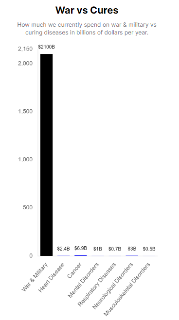

# How to End War and Disease

**Config:** _quarto-test.yml
**Type:** book
**Files:** 3 | **Words:** 770 | **Images:** 2 | **Est. Pages:** ~4

#### knowledge/test/test-economics.qmd
**Title:** Test Economics Document
**Description:** PAGE-LEVEL DESCRIPTION: This is the description from the QMD file frontmatter that should be used for og:description meta tag
**Stats:** 335 words | 67 lines | ~1p

- Introduction
  - Link Test Cases
    - Internal Cross-References (Work in PDF)
    - Tip
    - External Cross-Site Links (Should Become Absolute URLs)
    - Absolute URLs (Should Remain Unchanged)
    - Anchor Links (Should Remain Unchanged)
    - Cross-Reference Format Comparison
  - Conclusion

#### knowledge/test/test-parameters.qmd
**Title:** Test Parameters Document
**Description:** Minimal parameters document for testing
**Stats:** 354 words | 78 lines | 1 images | ~2p

- Introduction {#sec-test-parameters-intro}
  - Test Parameters
  - Callout Test
  - This is a Note Callout
  - Warning Example
  - Pro Tip
  - Figure Caption Test
    
  - Simple Variable Test
  - Calculated Variable Test
  - Citation Test
  - Cross-Chapter Anchor Links Test
  - Cross-Site References

#### knowledge/references.qmd
**Title:** Source Quotes and References
**Description:** Every claim in this manual has a receipt. 347 sources, because 'trust me, I'm an alien' is not a citation format your species recognizes.
**Stats:** 81 words | 23 lines | 1 images | ~1p
