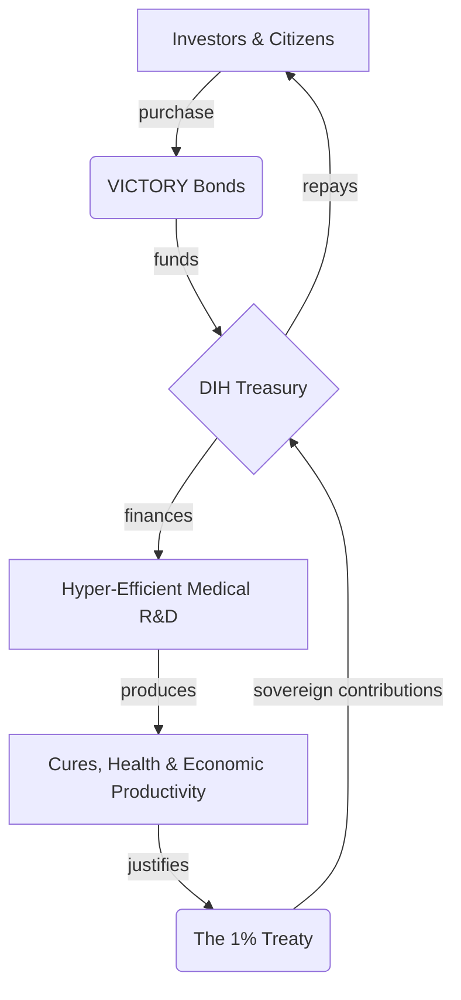

# 📖 Chapter 4: The Economics - How to Make Peace Pay Better Than War

This isn't a charity. It's a machine for converting the two most destructive forces in the world—war and disease—into the two most profitable: peace and health.

The economic argument is simple:
1.  We waste trillions of dollars on war and disease every year. We call the money we could save the **Peace Dividend** (from ending war) and the **Health Dividend** (from curing disease).
2.  Nobody has ever captured this money because nobody had a way to do it. It's like having a dam full of water but no turbine.
3.  We built the turbine. The DIH and dFDA are a system for turning this waste into measurable profit.
4.  To start the turbine, we need money upfront. **[VICTORY Bonds](./economics/victory-bonds.md)** are how we raise this money.
5.  The profits we make are used to pay back the people who gave us money upfront, with returns that beat the best hedge funds in the world.

This chapter explains the math.

---

## The Details

*   **[The Peace Dividend](./economics/peace-dividend-value-capture.md):** The $16.5 trillion we waste on war every year.
*   **[The Health Dividend](./economics/economic-value-of-accelerated-treatments.md):** The trillions we lose to disease every year.
*   **[VICTORY Bonds](./economics/victory-bonds.md):** How we raise the money upfront.
*   **[Investment Thesis](./economics/investment-thesis.md):** Why this beats every other investment.
*   **[Financial Models](./economics/dih-treasury-cash-flow-model.md):** The spreadsheets and risk analysis.

---
## How the Money Goes Around

Here's how it works:

