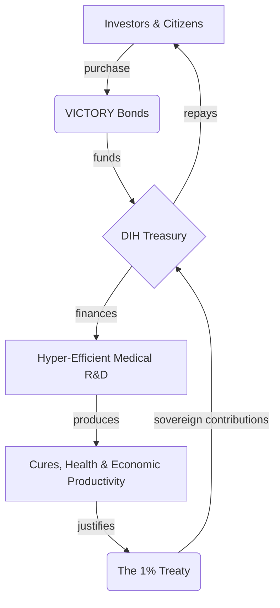

# 📖 Chapter 4: The Financial Engine

This is not a charity. It is the largest value creation opportunity in human history. The economic model of the Decentralized Institutes of Health (DIH) is designed to be a self-sustaining engine that makes peace and health outrageously profitable.

We will not overcome the financial incentives for war by appealing to morality. We will do it by offering a mathematically superior financial return.

---

## The $16.5 Trillion Peace Dividend

The core of the financial model is the **Peace Dividend**: the immense economic value unlocked by redirecting a fraction of global conflict spending towards productive ends.

- The total annual global cost of violence is estimated at **[$16.5 trillion](./reference/costs-of-war.md)**.
- The **[1% Treaty](./strategy/1-percent-treaty.md)** requires an "activation energy" investment of **[$1.2–$2.5 billion](./economics/fundraising-and-budget-plan.md)** to unlock this dividend.
- The first tranche of value captured is a **[$27+ billion annual treasury](./economics/peace-dividend-value-capture.md)**, which is used to fund a hyper-efficient medical R&D system and repay investors.
- Over **[99.84% of the value unlocked](./economics/peace-dividend-value-capture.md)** flows directly to global society through improved health, increased productivity, and reduced conflict.

This isn't about defunding defense; it's about making a strategic investment in the foundational drivers of security: health, stability, and prosperity. A small reallocation away from destructive capacity creates an exponential return in productive capacity.

---

## VICTORY Instruments: The Investment in Humanity

To bootstrap this new economic model, the DIH will raise its initial capital by issuing two classes of **VICTORY Instruments**, each designed for a specific purpose and audience.

### 1. VICTORY Bonds (For Investors)

Modeled on the War Bonds that funded victory in WWII, VICTORY Bonds are the primary instrument for capitalizing the DIH Treasury. They are a debt-like instrument with a fixed coupon and defined maturity, designed to offer a world-class, de-risked return to accredited and institutional investors.

### 2. VICTORY Tokens (For Participants)

VICTORY Tokens are the primary instrument for incentivizing mass participation in the global referendum. They are a utility token used to reward verifiable actions (like voting and referrals) and may confer governance rights over the DIH treasury. They are not designed to promise profits, which helps mitigate securities risk for a broad, global distribution.

This dual-instrument approach allows the DIH to attract the world's most ambitious capital while simultaneously building a broad, global coalition of engaged stakeholders.

---

## The Virtuous Financial Cycle

The DIH treasury is designed as a closed-loop, sustainable system where value is created, captured, and reinvested.

1.  **Funding:** A **$1.2–$2.5B** investment via VICTORY Bonds capitalizes the DIH Treasury.
2.  **Investment:** The Treasury funds an open-source R&D ecosystem with a projected ROI of **[463:1](./economics/dfda-cost-benefit-analysis.md)**.
3.  **Repayment:** The immense societal value created justifies the 1% Treaty, whose **$27B+** in annual sovereign contributions flow into the Treasury.
4.  **Return:** The Treasury repays the original VICTORY Bond holders with a targeted **[>39% annualized return](./economics/investment-thesis.md)**, outperforming the world's best hedge funds.

---

## The Investment Thesis: Political Arbitrage vs. Market Risk

The investment thesis for VICTORY Bonds is fundamentally different from traditional venture capital.

- **Traditional VC** takes on immense **market risk**, betting that a new technology will find a product-market fit and succeed against competitors. Most bets fail.
- **VICTORY Bonds** take on a calculated **political risk**. The "product"—curing disease—has infinite and permanent market demand. The thesis is not _if_ people want cures, but _when_ we can achieve the political momentum to unlock the funding.

By engineering a system with a clear path to profitability, a global base of support, and a compelling, rational argument for all stakeholders, we are not just building a non-profit; we are creating a new asset class based on the financial upside of global cooperation.

---

## Dive Deeper into the Economic Model

This chapter provides a high-level overview. For a detailed breakdown of the financial engineering, risk modeling, and value-capture mechanics, please explore the following documents:

- **[Investment Thesis](./economics/investment-thesis.md):** A quantitative analysis of how VICTORY Bonds are designed to deliver a risk-adjusted expected value superior to the world's most elite hedge funds.
- **[The Peace Dividend: Value Capture Model](./economics/peace-dividend-value-capture.md):** An analysis of the $16.5 trillion annual "Cost of Violence" and the model for capturing a fraction of it to fund the DIH.
- **[dFDA Cost-Benefit Analysis](./economics/dfda-cost-benefit-analysis.md):** A detailed analysis of the dFDA protocol, which projects a 463:1 return on investment and an annual generation of 840,000 Quality-Adjusted Life Years (QALYs).
- **[Costs of War](./reference/costs-of-war.md):** A supplementary document detailing the direct and indirect economic costs of global conflict.
