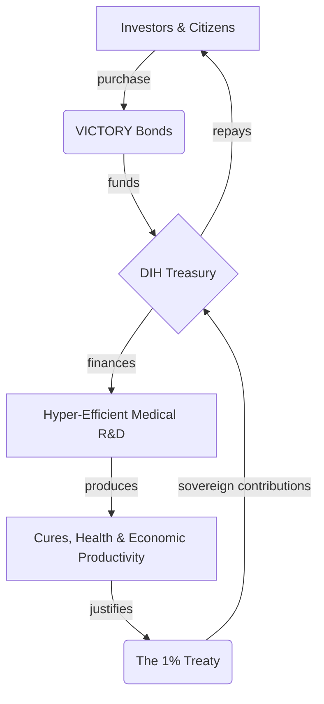

# 📖 Chapter 6: Economics - The Money

This is not charity. This is the best investment you'll ever make.

We won't beat the war machine by asking nicely. We'll beat it by offering better returns.

---

## The $16.5 Trillion Peace Dividend

The core of the financial model is the **Peace Dividend**: the immense economic value unlocked by redirecting a fraction of global conflict spending towards productive ends.

- The total annual global cost of violence is estimated at **[$16.5 trillion](./reference/costs-of-war.md)**.
- The **[1% Treaty](./strategy/1-percent-treaty.md)** requires an "activation energy" investment of **[$1.2–$2.5 billion](./economics/fundraising-and-budget-plan.md)** to unlock this dividend.
- The first tranche of value captured is a **[$27+ billion annual treasury](./economics/peace-dividend-value-capture.md)**, which is used to fund a hyper-efficient medical R&D system and repay investors.
- Over **[99.84% of the value unlocked](./economics/peace-dividend-value-capture.md)** flows directly to global society through improved health, increased productivity, and reduced conflict.

This isn't about defunding defense; it's about making a smart investment in the foundational drivers of security: health, stability, and prosperity. A small reallocation away from destructive capacity creates an exponential return in productive capacity.

---

## VICTORY Instruments: The Investment in Humanity

To bootstrap this new economic model, the DIH will raise its initial capital by issuing **[VICTORY Instruments](./economics/victory-bonds.md)**. These are the financial tools that power the entire system.

-   **[VICTORY Bonds (for investors)](./economics/victory-bonds.md):** Modeled on WWII War Bonds, these offer a >40% targeted annual return for accredited and institutional investors.
-   **[VICTORY Tokens (for participants)](./economics/victory-bonds.md):** Utility tokens that reward citizens for participating in the global referendum and grant governance rights over the DIH treasury.

This dual-instrument approach allows the DIH to attract the most ambitious capital while simultaneously building a broad, global coalition of engaged participants. For a full breakdown, see the **[VICTORY Bonds Investment Thesis](./economics/victory-bonds.md)**.

---

## How the Money Goes Around

Here's how it works:

1.  **Funding:** A **$1.2–$2.5B** investment via VICTORY Bonds capitalizes the DIH Treasury.
2.  **Investment:** The Treasury funds an open-source R&D ecosystem with a projected ROI of **[463:1](./economics/dfda-cost-benefit-analysis.md)**.
3.  **Repayment:** The immense societal value created justifies the 1% Treaty, whose **$27B+** in annual sovereign contributions flow into the Treasury.
4.  **Return:** The Treasury repays the original VICTORY Bond holders with a targeted **[>39% annualized return](./economics/investment-thesis.md)**, outperforming the world's best hedge funds.

---

## The Investment Thesis: Political Arbitrage vs. Market Risk

The investment thesis for VICTORY Bonds is fundamentally different from traditional venture capital.

- **Traditional VC** takes on immense **market risk**, betting that a new technology will find a product-market fit and succeed against competitors. Most bets fail.
- **VICTORY Bonds** take on a calculated **political risk**. The "product"—curing disease—has infinite and permanent market demand. The thesis is not _if_ people want cures, but _when_ we can achieve the political momentum to unlock the funding.

By building a system with a clear path to profitability, a global base of support, and a compelling, rational argument for everyone involved, we are not just building a non-profit; we are creating a new asset class based on the financial upside of global cooperation.

---

## Dive Deeper into the Economic Model

This chapter provides a high-level overview. For a detailed breakdown of the financial engineering, risk modeling, and value-capture mechanics, please explore the following documents:

- **[Investment Thesis](./economics/investment-thesis.md):** A quantitative analysis of how VICTORY Bonds are designed to deliver a risk-adjusted expected value superior to the world's most elite hedge funds.
- **[The Peace Dividend: Value Capture Model](./economics/peace-dividend-value-capture.md):** An analysis of the $16.5 trillion annual "Cost of Violence" and the model for capturing a fraction of it to fund the DIH.
- **[dFDA Cost-Benefit Analysis](./economics/dfda-cost-benefit-analysis.md):** A detailed analysis of the dFDA protocol, which projects a 463:1 return on investment and an annual generation of 840,000 Quality-Adjusted Life Years (QALYs).
- **[Costs of War](./reference/costs-of-war.md):** A supplementary document detailing the direct and indirect economic costs of global conflict.
