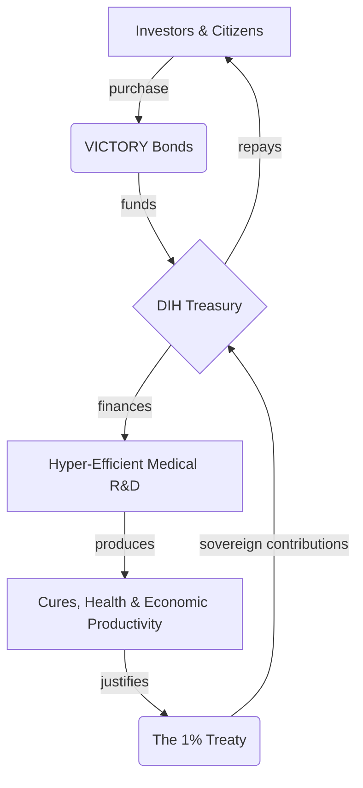

# 📖 Chapter 4: The Economics - Unlocking Trillion-Dollar Dividends

This isn't a non-profit. It's a machine for converting the two most destructive forces in the world—war and disease—into the two most productive: peace and health.

The core economic argument is simple:
1.  There are trillions of dollars in latent value locked up in our broken systems. We call this the **Peace Dividend** (from ending war) and the **Health Dividend** (from curing disease).
2.  This value has never been realized because no one has a credible mechanism to capture it. It's like having a dam full of water without a turbine.
3.  We have built the turbine. The DIH and dFDA are a system for converting this latent potential into measurable economic and social value.
4.  To start the turbine, we need "activation energy." **[VICTORY Bonds](./economics/victory-bonds.md)** are the instrument we use to raise this initial capital.
5.  The value we unlock is then used to repay the investors who provided the activation energy, with returns that rival the best hedge funds in the world.

This chapter details the math behind this machine.

---

## Dive Deeper into the Economic Model

*   **[The Peace Dividend](./economics/peace-dividend-value-capture.md):** The $16.5 trillion annual economic gain from reducing global conflict.
*   **[The Health Dividend](./economics/economic-value-of-accelerated-treatments.md):** The trillions in value created by curing disease and extending healthy human lifespan.
*   **[VICTORY Bonds](./economics/victory-bonds.md):** The financial instrument for raising the "activation energy."
*   **[Investment Thesis](./economics/investment-thesis.md):** The detailed breakdown of why this is a uniquely compelling financial opportunity.
*   **[Financial Models](./economics/dih-treasury-cash-flow-model.md):** The cash flow projections and risk analysis.

---
## How the Money Goes Around

Here's how it works:

