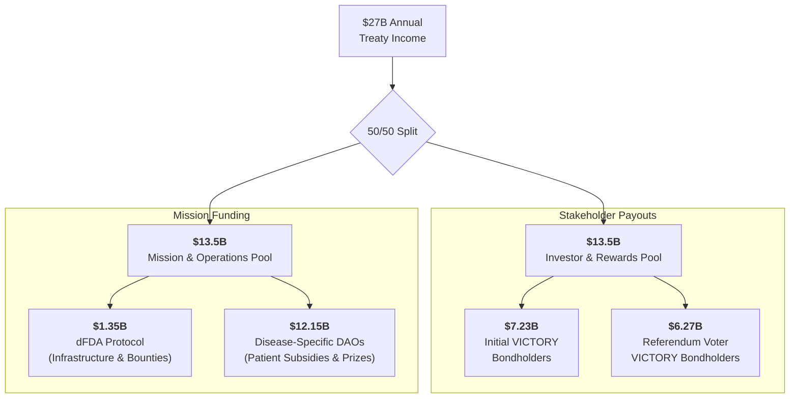

# DIH Treasury: Dynamic Cash Flow & Principled Payout Model

## 1. Executive Summary

This document provides a clear, dynamic financial model for the Decentralized Institutes of Health (DIH) treasury. It demonstrates how investor payouts and funds for the DIH mission are governed by two core, transparent principles, ensuring a fair balance between rewarding investors and fulfilling our ultimate purpose.

The model projects outcomes for both a **Full Success Scenario (\$27B/year)** and a realistic **Partial Success Scenario (\$13B/year)**, showing the system's robustness and sustainability under different conditions.

## 2. The Two Core Payout Principles

Investor payouts are not based on arbitrary targets, but are governed by two simple rules:

1.  **The Target Return Principle (The "Ceiling"):** Our goal is to deliver the world's best risk-adjusted return. We are therefore targeting a maximum payout that provides early investors with a **~40% compound annual growth rate (CAGR)** over 10 years. This equates to a **~28x total return**.
2.  **The Mission Guarantee Principle (The "Floor"):** Our primary purpose is to fund cures. To protect this, annual investor payouts will **never exceed 50% of the DIH's total annual income**. A minimum of 50% of all funds are always reserved for the DIH's mission.

## 3. The Annual Cash Flow Waterfall

Here is the step-by-step model detailing how the DIH treasury's annual income is allocated. This "waterfall" model ensures that all obligations are met in a clear and prioritized order.

**Model Assumptions:**
- **Annual Income:** $27 billion (Full Success Scenario)
- **Initial Capital Raised:** $2.5 billion
- **Target Investor Return:** ~$7.23 billion/year (~40% CAGR over 10 years)

---

### Step 1: Gross Income & Top-Line Split

The process begins with the **$27 billion** collected from the 1% Treaty. This is immediately divided according to the **Mission Guarantee Principle**.

| Fund Pool | Allocation | Amount | Purpose |
| :--- | :--- | :--- | :--- |
| **Investor & Rewards Pool** | 50% | **$13.5 Billion** | To pay back all VICTORY bondholders, including initial investors and referendum participants. |
| **Mission & Operations Pool** | 50% | **$13.5 Billion** | To fund the dFDA protocol and the disease-specific research programs. |

---

### Step 2: Allocation of the Investor & Rewards Pool

This **$13.5 billion** pool is distributed with the following priority:

1.  **Repay Initial VICTORY Bondholders:** The first priority is to pay the **~$7.23 billion** annual target to the investors who provided the initial $2.5B in activation capital.
2.  **Reward Referendum Participants:** The remaining **~$6.27 billion** is used to repay the VICTORY bonds that were issued to citizens who earned VOTE points during the global referendum. This ensures the public is directly rewarded for their political mobilization.

---

### Step 3: Allocation of the Mission & Operations Pool

This **$13.5 billion** pool is allocated to fund the core mission:

1.  **Fund the dFDA Protocol:** **10%** of this pool (**$1.35 billion**) is allocated directly to the **dFDA**. This is the operational budget for maintaining the core protocol, funding the reference platform, running data analysis, and issuing prizes and bounties for technical development.
2.  **Fund Disease-Specific DAOs:** The remaining **90%** (**$12.15 billion**) is the primary "mission budget." This capital is transferred to the various disease-specific institutes (e.g., Decentralized Institute on Aging, Decentralized Cancer Institute) based on the allocation formulas decided by DIH governance votes. These DAOs then use their funds to pay for patient subsidies and targeted research prizes.

---

### Summary of Annual Capital Flow

---

## 4. Financial Projections: Full vs. Partial Success

This model demonstrates how these two principles interact under different levels of treaty adoption.

**Model Assumptions:**

- **Total Activation Energy Raised:** \$2.5 billion.
- **Target Investor Payout (for ~40% CAGR):** `$2.5B * 28.9 =` ~\$72.25 billion over 10 years, or **~\$7.23 billion per year**.

---

### A. Full Success Scenario

**Assumption:** The 1% Treaty is adopted globally, generating **\$27 billion** in annual income.

- **Annual Investor Payout:** The DIH can comfortably pay the target **\$7.23 billion** per year. This is only **26.8%** of the annual income, well below the 50% cap.
- **Annual DIH Mission Funds:** `$27B - $7.23B =` **\$19.77 billion**.

**10-Year Cash Flow Table (Full Success)**

| Year      | Annual Inflow         | Max Investor Payout  | **Net for DIH Mission** | Payout % of Income |
| :-------- | :-------------------- | :------------------- | :---------------------- | :----------------- |
| **1-10**  | \$27,000,000,000      | \$7,230,000,000      | **\$19,770,000,000**    | 26.8%              |
| **Total** | **\$270,000,000,000** | **\$72,300,000,000** | **\$197,700,000,000**   |                    |

**Conclusion:** In the full success scenario, we can deliver the historic ~28x return while dedicating nearly **\$200 billion** over the decade to our mission.

---

### B. Partial Success Scenario

**Assumption:** The treaty is adopted by the US, EU, & UK only, generating **\$13 billion** in annual income.

- **Annual Investor Payout:** The "Mission Guarantee Principle" is triggered. Payouts are capped at 50% of income, or **\$6.5 billion** per year.
- **Annual DIH Mission Funds:** The DIH is guaranteed to receive the other **\$6.5 billion**.

**10-Year Cash Flow Table (Partial Success)**

| Year      | Annual Inflow         | Max Investor Payout  | **Net for DIH Mission** | Payout % of Income |
| :-------- | :-------------------- | :------------------- | :---------------------- | :----------------- |
| **1-10**  | \$13,000,000,000      | \$6,500,000,000      | **\$6,500,000,000**     | 50.0%              |
| **Total** | **\$130,000,000,000** | **\$65,000,000,000** | **\$65,000,000,000**    |                    |

**Conclusion:** Even in a partial success scenario, investors receive a **26x return** (`\$65B / \$2.5B`), and the DIH is still capitalized with **\$65 billion** over 10 years—more than the entire budget of the NIH over a year.

## 4. Key Takeaways

This principled model demonstrates:

- **Robustness:** The DIH remains massively well-funded and investors receive world-class returns even in conservative scenarios.
- **Transparency:** The payout rules are simple, predictable, and fair.
- **Mission Alignment:** The 50% guarantee ensures that the goal of curing disease is always protected.
