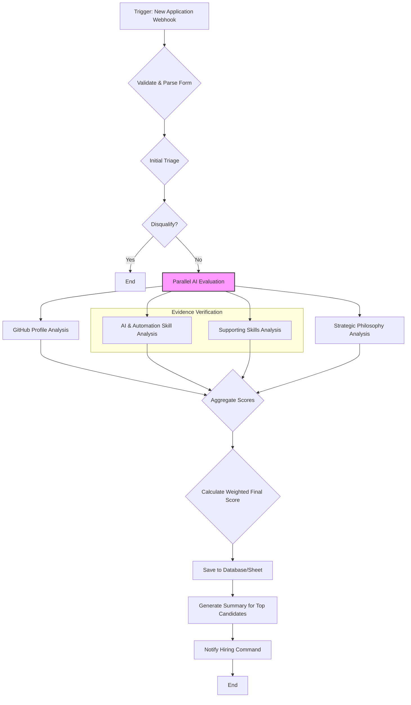

# n8n Workflow: Evaluating the Founding AI Architect

This document outlines the design for an n8n workflow to automate the evaluation of candidates applying for the **Founding AI Architect** role. The goal is to create an efficient, objective screening process that surfaces candidates with world-class AI/automation skills and the strategic mindset to lead this mission.

## Workflow Diagram

## Workflow Stages Explained

### 1. Trigger: New Application Webhook
- **Tool:** n8n Webhook Node.
- **Action:** Receives POST request with application data.

### 2. Validate & Parse Form Data
- **Tool:** n8n Code Node.
- **Action:**
    - Parses JSON data.
    - Validates all required fields and URLs. Invalid submissions are flagged and discarded.

### 3. Initial Triage (Knockout Criteria)
- **Tool:** n8n If Node.
- **Action:** If the GitHub URL is invalid, the candidate is disqualified.

### 4. Parallel AI Evaluation
The core of the workflow, using an LLM to run multiple specialized evaluations.

- **A. GitHub Profile Analysis:**
    - **Input:** GitHub profile URL.
    - **Prompt:** "Analyze this GitHub profile. Score from 0-10 on demonstrated mastery of AI, automation, and complex systems. Look for: 1) Originality and depth in AI-related repos. 2) High-quality contributions to relevant open-source projects (e.g., AI frameworks, data tools). 3) Code quality and architectural thinking. Return JSON with `githubScore` and justification."

- **B. AI & Automation Skill Analysis:**
    - **Input:** The evidence link and justification sentence for the "AI Workflows / Agent Development" and "Data Engineering & Analysis" skills.
    - **Prompt:** "Analyze the candidate's two core skill submissions (AI and Data Engineering). Based on the evidence and justification, score their `coreAISkill` from 0-10, focusing on architectural complexity, novelty, and relevance to building autonomous agent systems. Return JSON with the score and justification."

- **C. Supporting Skills Analysis:**
    - **Input:** Evidence links and justifications for Web App, API, and Blockchain skills.
    - **Prompt:** "Briefly assess the candidate's three supporting skill submissions. Provide a single `supportSkillScore` from 0-10, representing their generalist capabilities and ability to build the full-stack systems needed to support the core AI. Return JSON with the score and a one-sentence summary."

- **D. Strategic Philosophy Analysis:**
    - **Input:** Text responses for the "AI philosophy" and "technical strategy" questions.
    - **Prompt:** "Analyze the candidate's strategic responses. Score `philosophyAlignment` from 0-10 based on the clarity and depth of their architectural philosophy. Score `strategyScore` from 0-10 based on the creativity, feasibility, and detail of their proposed technical plan for the 3.5% mission. Return JSON with both scores and justifications."

### 5. Aggregate & Calculate Final Score
- **Tool:** n8n Set Node or Code Node.
- **Action:**
    - Gathers all scores.
    - Calculates a final weighted score, heavily biased towards core AI skills.
    - **Weighting:**
        - **Core AI Skill (40%):** `coreAISkill * 4`
        - **GitHub Score (30%):** `githubScore * 3`
        - **Strategic Philosophy (20%):** `((philosophyAlignment + strategyScore) / 2) * 2`
        - **Supporting Skills (10%):** `supportSkillScore * 1`
    - **Final Score = Weighted Sum (out of 100).**

### 6. Output & Human Review
- **Tool:** Google Sheets/Airtable/Postgres Node, Email/Slack Node.
- **Action:**
    - Saves all data and scores to a central database.
    - For candidates scoring above a threshold (e.g., > 80), a summary is generated.
    - Sends a notification to the "Hiring Command" with a link to the ranked list of candidates for human review. 