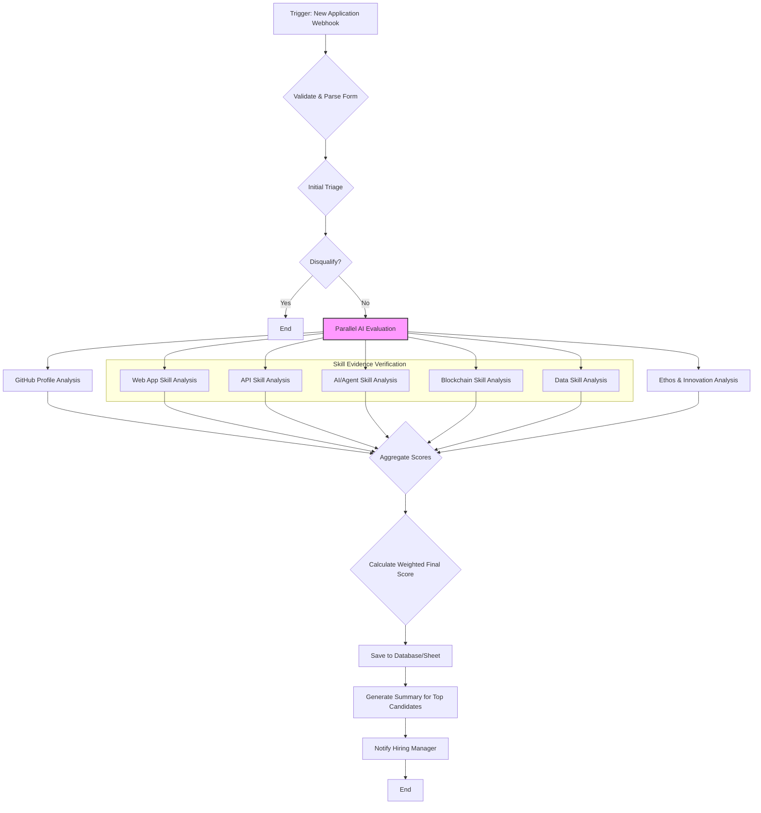

# n8n Workflow for Automated Applicant Evaluation

This document outlines the design for an n8n workflow to automate the evaluation of candidates applying through the `job-application-form.md`. The goal is to create an efficient, objective, and scalable screening process that surfaces the most promising candidates for human review.

## Workflow Diagram

## Workflow Stages Explained

### 1. Trigger: New Application Webhook
- **Tool:** n8n Webhook Node.
- **Action:** Receives a POST request with the candidate's application data from the form service (e.g., Tally, Typeform, custom web form).

### 2. Validate & Parse Form Data
- **Tool:** n8n Code Node (or Function Node).
- **Action:**
    - Parses the incoming JSON data.
    - Checks for the presence of all required fields. If a required field is missing, the workflow ends and logs an error.
    - Validates all provided URLs (GitHub, project links) using an HTTP Request Node to ensure they don't return a 404 error. Invalid links are flagged.

### 3. Initial Triage (Knockout Criteria)
- **Tool:** n8n If Node.
- **Action:** Applies simple knockout rules.
    - **Current Rule:** If the required GitHub URL is invalid or missing, the candidate is disqualified.
    - **Future Improvement:** This step could be enhanced by adding questions to the form like "Are you legally authorized to work in [Country/Region]?" or "What is your primary timezone for collaboration?" to perform more advanced filtering here.

### 4. Parallel AI Evaluation
This is the core of the workflow, where multiple AI evaluations run simultaneously to save time. Each uses an LLM (e.g., via the OpenAI Node).

- **A. GitHub Profile Analysis:**
    - **Input:** GitHub profile URL.
    - **Prompt:** "Analyze this GitHub profile. Score it from 0-10 based on: 1) Contribution frequency and consistency over the last year. 2) Quality and originality of pinned repositories. 3) Evidence of collaboration (PRs to other repos, issues). 4) Diversity of languages used. Return a JSON object with the score and a brief justification."

- **B. Skill Evidence Verification (x5 Parallel Tasks):**
    - For each of the 5 skills (Web App, API, etc.):
    - **Input:** The candidate's self-rated score (1-5) and the evidence URL.
    - **Prompt:** "The candidate claims a skill level of [Self-Rated Score]/5 in [Skill Name]. Analyze the project at this URL: [Evidence URL]. How well does this project justify their claimed score in terms of complexity, completeness, and relevance? Return a JSON object with an `alignmentScore` (from 0.0 for no support to 1.0 for strong support) and a `justification`."

- **C. Ethos & Innovation Analysis:**
    - **Input:** Text responses for the "open-source philosophy" and "innovative idea" questions.
    - **Prompt:** "Analyze the following two responses. Score the candidate from 0-10 on `ethosAlignment` (based on their commitment to open-source/collaboration) and `innovationPotential` (based on the creativity and feasibility of their idea). Return a JSON object with these two scores and justifications."

### 5. Aggregate & Calculate Final Score
- **Tool:** n8n Set Node or Code Node.
- **Action:**
    - Gathers all the scores from the parallel AI tasks.
    - Calculates a final weighted score. The weighting can be adjusted, but a good starting point is:
        - **GitHub Score (30%):** `githubScore * 3`
        - **Skill Evidence Score (40%):** `(Average of 5 alignmentScores) * 40`
        - **Ethos & Innovation Score (30%):** `((ethosAlignment + innovationPotential) / 2) * 3`
    - **Final Score = Weighted Sum (out of 100).**

### 6. Output & Human Review
- **Tool:** Google Sheets/Airtable/Postgres Node, Email/Slack Node.
- **Action:**
    - Saves the candidate's original data, all sub-scores, justifications, and the final weighted score to a central database.
    - For candidates scoring above a certain threshold (e.g., > 75), generate a concise summary report.
    - Send a notification to the hiring manager (e.g., via Slack) with a link to the ranked list of applicants, ready for human review. 