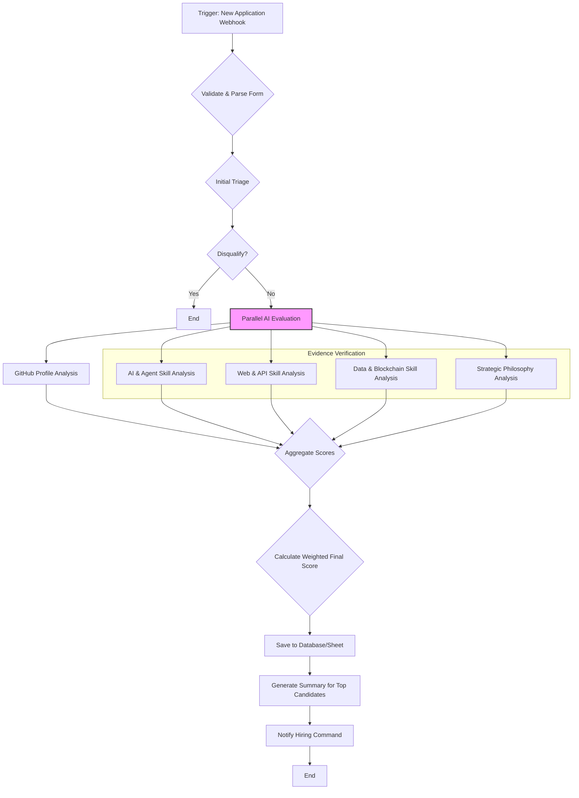

# n8n Workflow: Evaluating Supreme Allied Commander Applicants

This document outlines the design for an n8n workflow to automate the evaluation of candidates applying for the **Supreme Allied Commander, War on Disease** role. The goal is to create an efficient, objective screening process that surfaces candidates with both world-class AI/automation skills and the full-stack engineering prowess to build the required systems.

## Workflow Diagram

## Workflow Stages Explained

### 1. Trigger: New Application Webhook
- **Tool:** n8n Webhook Node.
- **Action:** Receives POST request with application data.

### 2. Validate & Parse Form Data
- **Tool:** n8n Code Node.
- **Action:**
    - Parses JSON data.
    - Validates all required fields and URLs. Invalid submissions are flagged and discarded.

### 3. Initial Triage (Knockout Criteria)
- **Tool:** n8n If Node.
- **Action:** If the GitHub URL is invalid, the candidate is disqualified.

### 4. Parallel AI Evaluation
The core of the workflow, using an LLM to run multiple specialized evaluations.

- **A. GitHub Profile Analysis:**
    - **Input:** GitHub profile URL.
    - **Prompt:** "Analyze this GitHub profile. Score from 0-10 on demonstrated mastery of complex systems. Look for: 1) Originality and depth in repositories. 2) High-quality contributions to relevant open-source projects. 3) Code quality, architectural thinking, and diversity of technologies used. Return JSON with `githubScore` and justification."

- **B. AI & Agent Skill Analysis:**
    - **Input:** Evidence link for "AI Workflows / Agent Development".
    - **Prompt:** "Analyze the candidate's project. Score their `aiSkill` from 0-10, focusing on architectural complexity, novelty, and relevance to building autonomous agent systems. Return JSON with the score and justification."

- **C. Web & API Skill Analysis:**
    - **Input:** Evidence links for "Web App Development" and "API Design & Development".
    - **Prompt:** "Analyze the candidate's two projects. Provide a single `webApiSkill` score from 0-10, representing their ability to build robust, modern, full-stack applications. Look for best practices in UI (React), API design, and overall architecture. Return JSON with the score and a one-sentence summary."

- **D. Data & Blockchain Skill Analysis:**
    - **Input:** Evidence links for "Data Engineering & Analysis" and "Blockchain / Smart Contract Development".
    - **Prompt:** "Analyze the candidate's two projects. Provide a single `dataBlockchainSkill` score from 0-10, representing their ability to work with data pipelines and decentralized technologies. Return JSON with the score and a one-sentence summary."

- **E. Strategic Philosophy Analysis:**
    - **Input:** Text responses for the "AI philosophy" and "technical strategy" questions.
    - **Prompt:** "Analyze the candidate's strategic responses. Score `strategyScore` from 0-10 based on the creativity, feasibility, and detail of their proposed technical plan for the 3.5% mission. Return JSON with the score and justification."

### 5. Aggregate & Calculate Final Score
- **Tool:** n8n Set Node or Code Node.
- **Action:**
    - Gathers all scores.
    - Calculates a final weighted score, balanced across key areas.
    - **Weighting:**
        - **AI & Agent Skill (30%):** `aiSkill * 3`
        - **Web & API Skill (30%):** `webApiSkill * 3`
        - **Data & Blockchain Skill (20%):** `dataBlockchainSkill * 2`
        - **GitHub Score (10%):** `githubScore * 1`
        - **Strategic Philosophy (10%):** `strategyScore * 1`
    - **Final Score = Weighted Sum (out of 100).**

### 6. Output & Human Review
- **Tool:** Google Sheets/Airtable/Postgres Node, Email/Slack Node.
- **Action:**
    - Saves all data and scores to a central database.
    - For candidates scoring above a threshold (e.g., > 75), a summary is generated for review.
    - Sends a notification to the "Hiring Command" with a link to the ranked list of candidates for human review.
    - **Guideline:** The Hiring Command should manually review any candidate who scores a 9 or 10 in the `aiSkill` or `webApiSkill` categories, regardless of their final weighted score. A genius in a key area may be more valuable than a candidate who is simply good in all areas. 