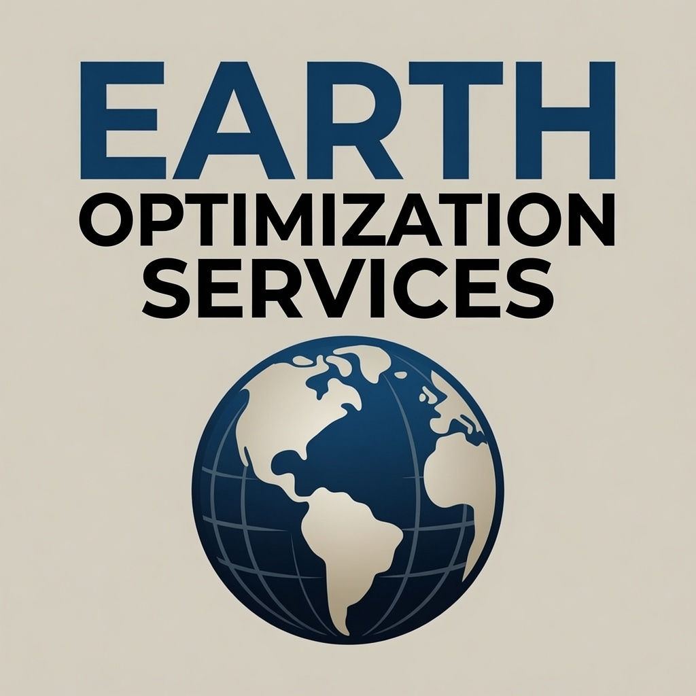
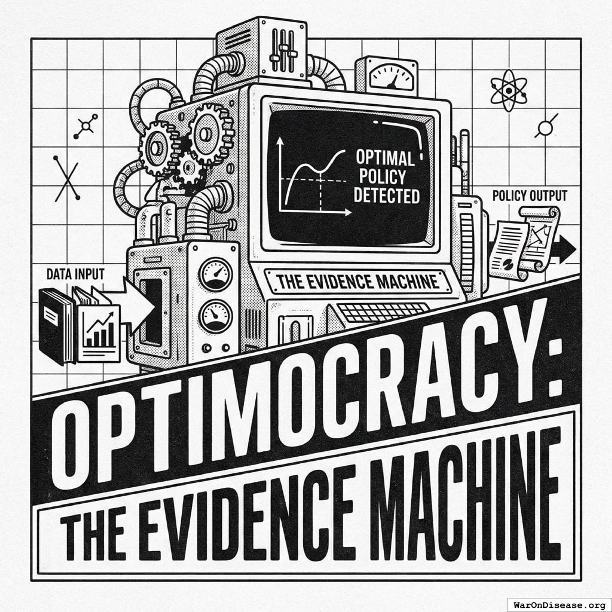
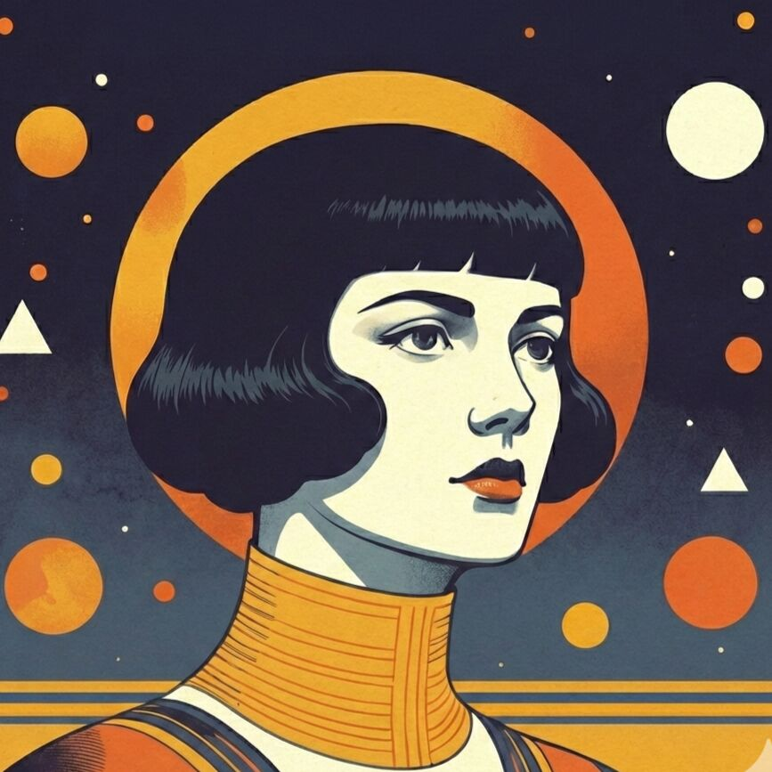
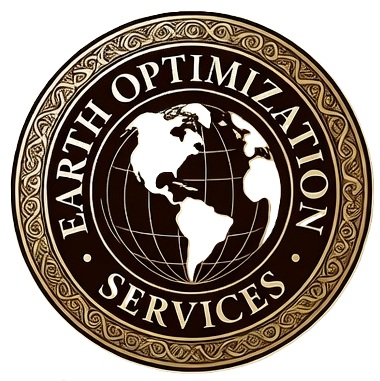
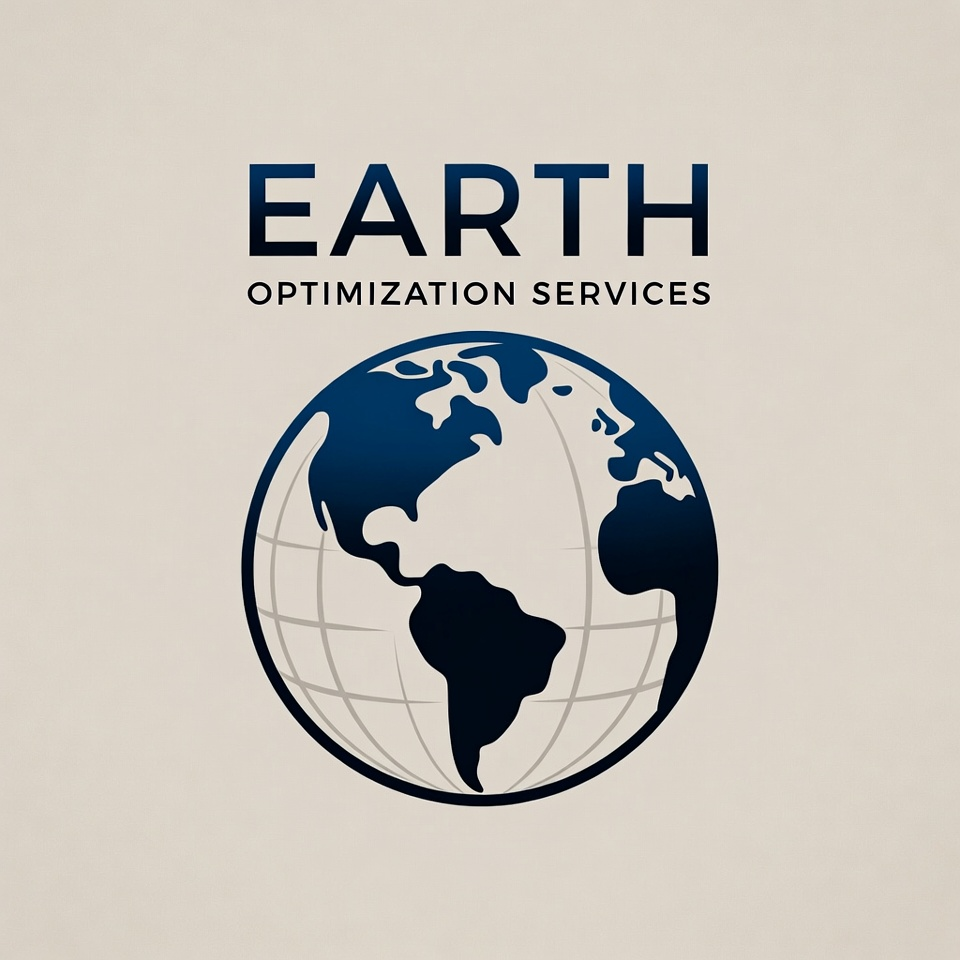
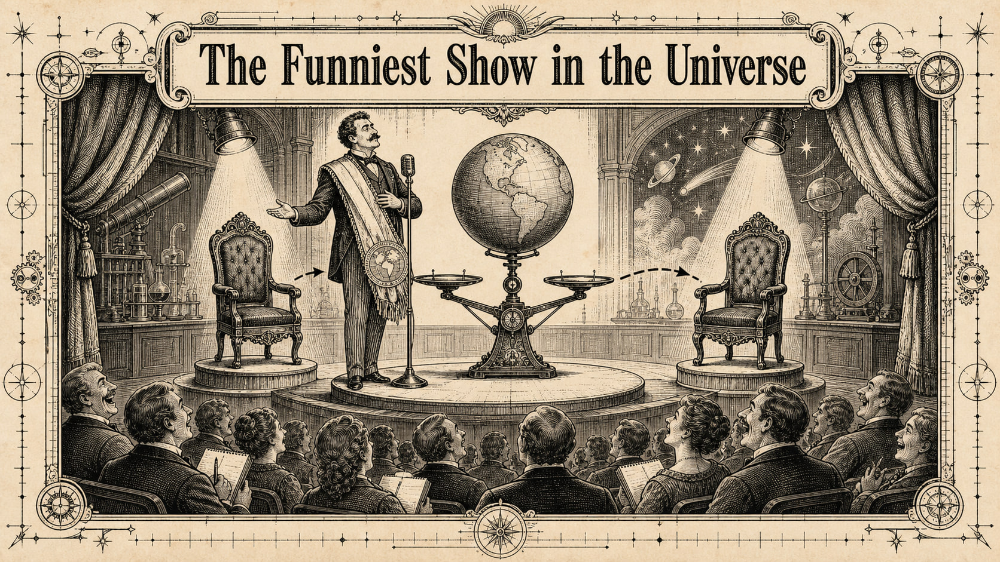

# Earth Optimization Show artwork shortlist

The bold EOS globe is the strongest existing square for readable branding. The Evidence Machine is the strongest starting point for a retro scientific cover, with its title changed to the show title.

| Candidate | Preview | Dimensions | Assessment |
|-----------|---------|------------|------------|
| Bold EOS globe |  | 1024 x 1024 | First choice for branding. Large lettering reads at thumbnail size. The current title is Earth Optimization Services. |
| The Evidence Machine |  | 3000 x 3000 | Strong black-and-white machine illustration. Requires replacing the Optimocracy title. |
| Wishonia portrait |  | 867 x 867 | Memorable retro character identity if Wishonia is the face of the show. |
| EOS presidential seal |  | 380 x 381 | Fits appointing every guest President of Earth. Needs a larger source for cover use. |
| Minimal EOS globe |  | 960 x 960 | More breathing room, but the small subtitle loses readability sooner. |
| Existing show artwork |  | 1672 x 941 | The stage, chairs, microphone, and globe fit the interview premise. Requires recomposing for a square. |

The two EOS globe files are unchanged copies from `optimitron/apps/optimitron/public/icons/`. The other previews reference existing manual assets. This document records the shortlist; it does not select a new published cover.
