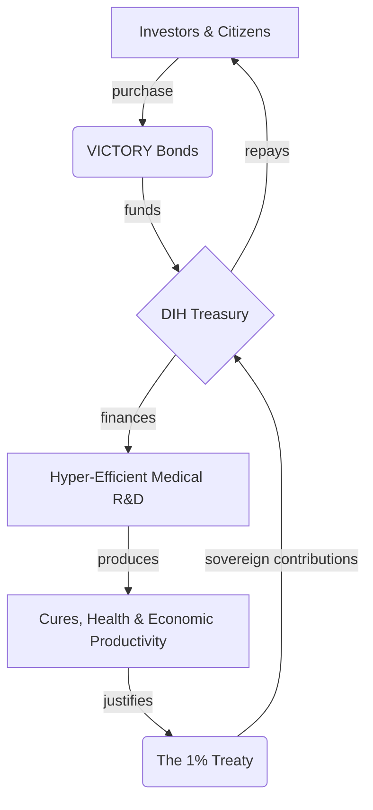

# 📖 Chapter 4: The Financial Engine

This is not a charity. It is the largest value creation opportunity in human history. The economic model of the Decentralized Institutes of Health (DIH) is designed to be a self-sustaining engine that makes peace and health outrageously profitable.

We will not overcome the financial incentives for war by appealing to morality. We will do it by offering a mathematically superior financial return.

---

## The $16.5 Trillion Peace Dividend

The core of the financial model is the **Peace Dividend**: the immense economic value unlocked by redirecting a fraction of global conflict spending towards productive ends.

-   The total annual global cost of violence is estimated at **[$16.5 trillion](./reference/costs-of-war.md)**.
-   The **[1% Treaty](./strategy/1-percent-treaty.md)** requires an "activation energy" investment of **[$1.2–$2.5 billion](./economics/fundraising-and-budget-plan.md)** to unlock this dividend.
-   The first tranche of value captured is a **[$27+ billion annual treasury](./economics/peace-dividend-value-capture.md)**, which is used to fund a hyper-efficient medical R&D system and repay investors.
-   Over **[99.84% of the value unlocked](./economics/peace-dividend-value-capture.md)** flows directly to global society through improved health, increased productivity, and reduced conflict.

This isn't about defunding defense; it's about making a strategic investment in the foundational drivers of security: health, stability, and prosperity. A small reallocation away from destructive capacity creates an exponential return in productive capacity.

---

## VICTORY Bonds: The Investment in Humanity

To bootstrap this new economic model, the DIH will raise its initial capital by issuing **VICTORY Bonds**.

Modeled on the War Bonds that funded victory in WWII, VICTORY Bonds allow citizens, institutions, and even defense contractors to invest directly in the war on disease. They are the financial instrument that allows the DIH to begin operations immediately, engineering a system that delivers a risk-adjusted expected value superior to the world's most elite investment funds.

This transforms a global movement into a concrete financial asset with a clear repayment model, designed to attract the world's most ambitious capital.

---

## The Virtuous Financial Cycle

The DIH treasury is designed as a closed-loop, sustainable system where value is created, captured, and reinvested.

1.  **Funding:** A **$1.2–$2.5B** investment via VICTORY Bonds capitalizes the DIH Treasury.
2.  **Investment:** The Treasury funds an open-source R&D ecosystem with a projected ROI of **[463:1](./economics/dfda-cost-benefit-analysis.md)**.
3.  **Repayment:** The immense societal value created justifies the 1% Treaty, whose **$27B+** in annual sovereign contributions flow into the Treasury.
4.  **Return:** The Treasury repays the original VICTORY Bond holders with a targeted **[>39% annualized return](./economics/investment-thesis.md)**, outperforming the world's best hedge funds.

---

## The Investment Thesis: Political Arbitrage vs. Market Risk

The investment thesis for VICTORY Bonds is fundamentally different from traditional venture capital.

-   **Traditional VC** takes on immense **market risk**, betting that a new technology will find a product-market fit and succeed against competitors. Most bets fail.
-   **VICTORY Bonds** take on a calculated **political risk**. The "product"—curing disease—has infinite and permanent market demand. The thesis is not *if* people want cures, but *when* we can achieve the political momentum to unlock the funding.

By engineering a system with a clear path to profitability, a global base of support, and a compelling, rational argument for all stakeholders, we are not just building a non-profit; we are creating a new asset class based on the financial upside of global cooperation.

---

## Dive Deeper into the Economic Model

This chapter provides a high-level overview. For a detailed breakdown of the financial engineering, risk modeling, and value-capture mechanics, please explore the following documents:

-   **[Investment Thesis](./economics/investment-thesis.md):** A quantitative analysis of how VICTORY Bonds are designed to deliver a risk-adjusted expected value superior to the world's most elite hedge funds.
-   **[The Peace Dividend: Value Capture & Distribution](./economics/peace-dividend-value-capture.md):** A quantitative model of how a ~$2.5B investment unlocks a $16.5T annual peace dividend, and how that value is distributed between investors and society.
-   **[dFDA Cost-Benefit Analysis](./economics/dfda-cost-benefit-analysis.md):** A detailed analysis of the dFDA platform, which projects a 463:1 return on investment and an annual generation of 840,000 Quality-Adjusted Life Years (QALYs).
-   **[Costs of War Analysis](./reference/costs-of-war.md):** A data-driven breakdown of the economic, human, and societal costs of war and military spending that form the basis of the Peace Dividend.
