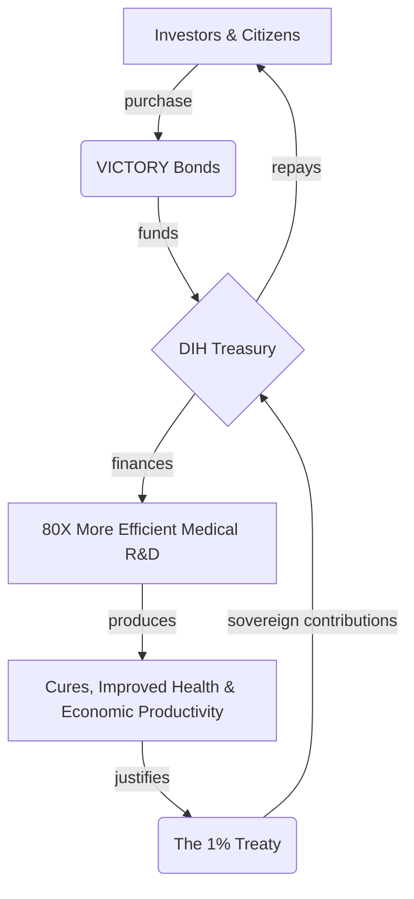

# 📖 Chapter 3: The Financial Engine

This is not a charity. It is the largest value creation opportunity in human history. The economic model of the Decentralized Institutes of Health (DIH) is designed to be a self-sustaining engine that makes peace and health outrageously profitable.

We will not overcome the financial incentives for war by appealing to morality. We will do it by offering a mathematically superior financial return.

---

## The $16.5 Trillion Peace Dividend

The core of the financial model is the **Peace Dividend**: the immense economic value unlocked by redirecting a fraction of global conflict spending towards productive ends.

-   The total annual global cost of violence is estimated at **[$16.5 trillion](./reference/costs-of-war.md)**.
-   The **[1% Treaty](./solution.md)** captures just a tiny fraction of this waste—initially ~$20 billion per year—and reinvests it into an engine of innovation with a projected **[80X improvement in efficiency](./solution.md)** over current systems.

This isn't about defunding defense; it's about making a strategic investment in the foundational drivers of security: health, stability, and prosperity. A small reallocation away from destructive capacity creates an exponential return in productive capacity.

---

## VICTORY Bonds: The Investment in Humanity

To bootstrap this new economic model, the DIH will raise its initial capital by issuing **VICTORY Bonds**.

Modeled on the War Bonds that funded victory in WWII, VICTORY Bonds allow citizens, institutions, and governments to invest directly in the war on disease. They are the financial instrument that allows the DIH to begin operations immediately, funding breakthrough research and building a more efficient clinical trial system before the treaty contributions begin to flow.

This transforms a global movement into a concrete financial asset with a clear repayment model.

---

## The Virtuous Financial Cycle

The DIH treasury is designed as a closed-loop, sustainable system where value is created, captured, and reinvested.

1.  **Funding:** VICTORY Bonds capitalize the DIH Treasury.
2.  **Investment:** The Treasury funds an open-source, hyper-efficient R&D ecosystem, creating massive societal value.
3.  **Repayment:** The value created justifies the 1% Treaty, whose sovereign contributions flow into the Treasury.
4.  **Return:** The Treasury repays the original VICTORY Bond holders with interest.

---

## The Investment Thesis: Political Arbitrage vs. Market Risk

The investment thesis for VICTORY Bonds is fundamentally different from traditional venture capital.

-   **Traditional VC** takes on immense **market risk**, betting that a new technology will find a product-market fit and succeed against competitors. Most bets fail.
-   **VICTORY Bonds** take on a calculated **political risk**. The "product"—curing disease—has infinite and permanent market demand. The thesis is not *if* people want cures, but *when* we can achieve the political momentum to unlock the funding.

By engineering a system with a clear path to profitability, a global base of support, and a compelling, rational argument for all stakeholders, we are not just building a non-profit; we are creating a new asset class based on the financial upside of global cooperation.
