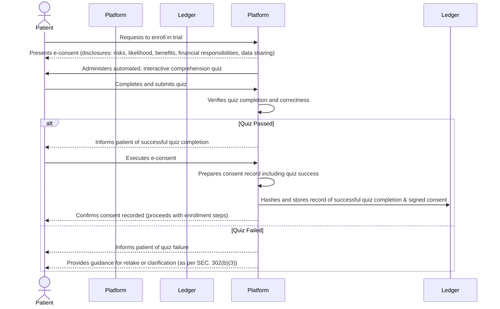

# Informed Consent Comprehension Quiz

## 1. Purpose and Vision

The Informed Consent Comprehension Quiz is a critical feature of the dFDA platform's electronic consent (e-consent) module. Its primary purpose is to enhance and assess a prospective clinical trial participant's understanding of the information presented during the informed consent process. This ensures that consent is not just a signature, but a truly informed decision made with adequate comprehension of the trial's purpose, procedures, potential risks and benefits, alternatives, and the participant's rights.

## 2. Legislative Mandate

This feature directly supports the requirements outlined in the "Right to Trial & FDA Upgrade Act," specifically **SEC. 302. ENHANCED ELECTRONIC CONSENT AND PATIENT COMPREHENSION.** Subsection (b)(1)(B) mandates the inclusion of:

> "mechanisms to assess participant comprehension of the information presented, which may include interactive questions, multimedia presentations, or other validated tools, with provisions for participants to ask questions and receive clarification from qualified study personnel before finalizing consent."

The quiz serves as a primary mechanism to fulfill this requirement.

## 3. Key Features and Functionality

* **Integration with e-Consent:** The quiz is an integral part of the dFDA platform's standardized e-consent workflow, typically presented after the participant has reviewed the main consent materials.
* **Interactive Questioning:** Utilizes a series of clear, concise questions designed to test understanding of key elements of the specific trial. Questions will be tailored based on the trial protocol.
* **Focus Areas:** Questions will cover critical aspects such as:
    * The research nature of the trial.
    * Purpose of the trial.
    * Key procedures and interventions involved.
    * Expected duration of participation.
    * Potential risks and discomforts.
    * Potential benefits (to self or others).
    * Available alternative treatments or procedures.
    * Confidentiality of data.
    * Voluntary nature of participation and the right to withdraw.
    * Contact information for questions or problems.
* **Adaptive Feedback & Remediation:**
    * If a participant answers a question incorrectly, the system will provide immediate, clear explanations and direct them back to the relevant section of the consent form for review.
    * Multiple attempts may be allowed, or incorrect answers may flag areas for mandatory discussion with study personnel.
* **Comprehension Threshold:** A predefined comprehension threshold (e.g., a minimum score) may be required to proceed. Failure to meet this threshold will trigger a mandatory consultation with qualified study personnel to address areas of misunderstanding before consent can be finalized.
* **Accessibility:** Designed to be accessible, considering various literacy levels and disabilities, potentially incorporating multimedia elements where appropriate and validated.
* **Audit Trail:** All quiz attempts, answers, feedback provided, and any required follow-up discussions will be securely logged as part of the comprehensive e-consent record for audit and verification purposes.
* **Language Support:** The quiz will support multiple languages, consistent with the consent form itself.

## 4. Benefits

* **Enhanced Participant Understanding:** Actively engages participants, moving beyond passive reading of consent documents.
* **Improved Ethical Standards:** Strengthens the ethical foundation of clinical trials by promoting genuinely informed consent.
* **Reduced Misconceptions:** Helps identify and correct misunderstandings before trial enrollment.
* **Empowered Participants:** Enables participants to make more confident and informed decisions about their health and research participation.
* **Regulatory Compliance:** Directly addresses specific mandates within the "Right to Trial & FDA Upgrade Act."
* **Quality Data:** Participants who better understand trial requirements may exhibit better adherence and provide more reliable data.

## 5. Integration within the dFDA Platform

The Informed Consent Comprehension Quiz module will be seamlessly integrated into the dFDA platform's e-consent workflow. It will be configurable by trial sponsors (within regulatory guidelines) to adapt question sets to specific trial protocols. Data from the quiz will feed into the overall participant record and the trial's compliance dashboard, providing insights into the effectiveness of the consent process itself.

