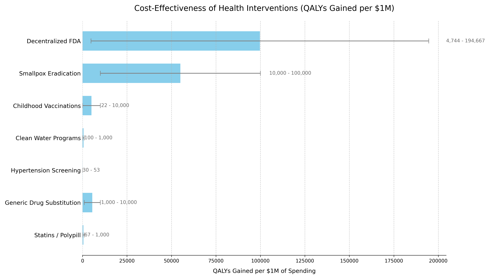



- **Saves ~ Annually**: Reduces global clinical trial costs (~/year market) by a baseline of ****, with up to **95%** savings in optimal scenarios.
- **Return on Investment**: . A 10-year NPV cost of  generates  in NPV R&D savings [over 10 years](#final-roi-and-net-benefit).
- **[Eliminates Post-Safety Efficacy Lag](#regulatory-delay-avoidance)**: By providing post-Phase I access via trial participation, a decentralized framework for drug assessment (dFDA) eliminates the -year Phase II/III [efficacy lag](regulatory-mortality-analysis.qmd) **while preserving rigorous Phase I safety testing**, achieving a one-time timeline shift saving ** QALYs average per year during the shift** (valued at ** total economic value**).
- **[Two QALY Estimates](#regulatory-delay-avoidance)**: Conservative bottom-up estimate of ** [QALYs/year](#appendix-detailed-qaly-calculation-model)** from efficacy lag elimination only (8.2-year timeline shift); comprehensive top-down estimate of **** from full timeline shift (~ from × trial capacity + efficacy lag elimination).
- **[Dominant Health Intervention](#sensitivity-analysis-overall-dfda-platform-cost-effectiveness)**: Such a framework is a dominant intervention that both saves money and improves health.
- **+ Daily Cost of Inaction**: Each day without such a framework represents a societal opportunity cost of ~ in economic waste. [See details](#daily-opportunity-cost-of-inaction).

## Executive Summary

**The Problem:** Clinical trials cost billions and take a decade per drug. Most humans die before the drugs that could save them finish paperwork. Out of  people with chronic disease, only  participate in trials annually ().

**The Solution:** A decentralized framework for drug assessment (dFDA) - an open protocol that enables:

1. **Subsidized Patient Participation**: Patients receive subsidies to participate in trials, making participation accessible and incentivized
2. **Universal Trial Access**: Any patient can join trials from home via their phone or computer - no travel to research centers required
3. **Real-World Data Aggregation**: Outcomes from all participants are aggregated into a unified database
4. **Treatment Rankings**: Like "Consumer Reports for drugs" - every treatment ranked by real-world effectiveness for each condition
5. **Outcome Labels**: "Nutrition facts for drugs" showing exactly what happened to real patients who tried each treatment

**How it works:** Companies register treatments on the platform. Patients search for their condition, see treatments ranked by effectiveness, and can instantly join trials. Patient-reported outcomes flow back into the rankings. The result is a self-improving system where every patient's experience helps the next patient make better decisions.

### What You Get

- **Cost Cuts:** Clinical trials cost [50-95% less](#gross-r-and-d-savings-from-dfda-implementation). The UK's [RECOVERY trial](recovery-trial.qmd) proved you can cut costs  without killing anyone extra. Our projections use /patient based on the [ADAPTABLE trial](https://pcornet.org/clinical-research/pcornet-clinical-trials-demonstrations/adaptable/). Apply that globally to the  spent annually on trials, save [tens of billions](#roi-analysis).
- **More Drugs Faster:** Cheaper trials mean testing rare diseases and treatments that don't make billionaires richer. Drugs reach dying people before they finish dying.
- **Fewer Dead People:** The framework generates  extra life-years through the -year timeline shift (from × trial capacity + efficacy lag elimination), plus faster access, better prevention data, and drugs for diseases companies currently ignore.

#### Exceptional Economic Value

- **Return on Investment (ROI):** A dFDA Infrastructure has an extremely high ROI. Based on total 10-year NPV costs of  against ** in NPV R&D savings** (** cost reduction**, [see Market Size and Impact](#market-size-and-impact)), Monte Carlo analysis yields an ROI of **** ([see ROI Uncertainty Analysis](#roi-uncertainty-analysis-monte-carlo)). A modest investment in global software infrastructure generates vast savings across the entire pharmaceutical R&D industry.
- **Cost-Utility:** A dFDA is a **dominant health intervention**, meaning it simultaneously saves money and improves health outcomes, far exceeding standard government value thresholds.
- **Daily Opportunity Cost of Inaction:** Each day we maintain the current system costs society approximately **** in wasted R&D spending.

**Conclusion:** A decentralized framework for drug assessment slashes costs, speeds up medical innovation, and saves lives. The analysis demonstrates compelling returns across all scenarios examined.

---

Below is a health and economic analysis of a decentralized framework for drug assessment (dFDA). This framework would function as a **two-sided marketplace** connecting companies with treatments to patients who need them, while continuously aggregating outcomes to rank treatments by real-world effectiveness.

## Vision and Capabilities

### Core Model: A Two-Sided Marketplace

**For Companies (Treatment Providers):**

- Register any treatment instantly (drugs, supplements, devices, interventions)
- Set treatment price (covers manufacturing + delivery)
- Get automatic liability coverage
- Receive zero-cost clinical trial data from real-world patient outcomes

**For Patients:**

- Search any condition, see all treatments ranked by effectiveness
- Join trials from home with one click
- Receive subsidies to offset participation costs
- Report outcomes via simple app interface
- Access "Outcome Labels" showing what happened to similar patients

**The Result:** A self-sustaining research ecosystem where patients fund treatments (covering costs), provide outcome data (eliminating data collection costs), and the platform publishes continuously-updated treatment rankings (eliminating the publication bottleneck).

### Key Capabilities

- **Treatment Rankings**: Every treatment for every condition ranked by real-world effectiveness, updated continuously as new data arrives
- **Outcome Labels**: Standardized "nutrition facts for drugs" showing effectiveness rates, side effects, and outcomes from real patients
- **Universal Trial Access**: Any patient can participate from anywhere via phone/computer
- **Real-Time Surveillance**: Continuous data on efficacy, side effects, and drug interactions
- **Federated Data Architecture**: Data stays in source systems (Epic, Cerner, Apple Health) while queries run across all sources

### Potential Impact on the Status Quo

- **Speed of Trials**: Reduced overhead and automated data capture can compress timelines.
- **Cost of Trials**: Using existing healthcare encounters, telemedicine, and EHR data to drastically cut per-patient costs (modeled on pragmatic trials like Oxford RECOVERY and the US-based ADAPTABLE trial).
- **Scale & Scope**: Potential for testing many more drugs, off-label indications, unpatentable treatments, nutraceuticals, and personalized medicine approaches.
- **Innovation Incentives**: Lower R&D costs can increase profitability and encourage more entrants/innovation in the life sciences.

## Analysis Assumptions

- At least 1 billion people worldwide opt in to share health data in anonymized form.
- Medical records and wearable data are interoperable and standardized sufficiently to be aggregated globally.
- Robust data security and privacy technologies are in place to comply with international regulations (HIPAA, GDPR, etc.).

### Cost Reductions

#### Cost Reduction Assumptions

- Decentralized trial costs drop closer to the [Oxford RECOVERY model](#decentralized-trial-costs-modeled-on-oxford-recovery): from  per patient to roughly ** per patient**.
- Regulatory oversight is streamlined through continuous data auditing, reducing administrative overhead.

### Technical Feasibility

- The necessary digital infrastructure (electronic health records, secure data exchange protocols, machine learning analytics, etc.) is assumed to be widely adopted.
- Some advanced technologies (e.g., blockchain, federated learning) achieve maturity to ensure data integrity and patient privacy.

### Funding and Governance

- Start-up costs may be shared by governments, philanthropic organizations, and industry.
- Ongoing operational costs are partially offset by reduced labor needs for conventional site-based trials and by subscription or service models from industry sponsors using the framework.

These assumptions set a stage where the framework can indeed function at scale, but this remains a forward-looking scenario.

### Trial Funding Scenario

This analysis models a scenario with /year allocated to pragmatic clinical trials. At /patient, this funds approximately  patient-years annually.

**Trial Capacity Impact:**

| Metric | Status Quo | With Framework |
|--------|------------|----------------|
| **First treatments/year** |  |  |
| **Trial capacity multiplier** | 1× | × |
| **Queue clearance time** |  |  |
| **Treatment acceleration** | N/A |  earlier |

**The Therapeutic Queue Problem:**

Approximately  diseases lack effective treatments. At current trial capacity ( new treatments/year), systematically testing all  plausible drug-disease combinations would take ~. With × capacity, queue clearance drops to ~.

## Framework Costs (ROM Estimates) {#dfda-framework-costs-rom-estimates-partnership-model}

> **Section Summary - Partnership Approach**
>
> **Protocol-Only Build (Recommended)**:
> - **Upfront protocol/API build:** \$15–25M (vs. $37.5-46M for full platform)
> - **Annual protocol operations:** \$5–12M (vs. $11-26.5M for full platform)
> - **Partnership integration fund:** \$20-50M (one-time, to onboard Epic/Cerner/Medable)
> - **Total initiative (partnership model):** ~\$40-75M upfront, \$5-12M annual
>
> **Build-Everything Model (Not Recommended)**:
> - **Upfront full platform build:** \$37.5–
> - **Annual full platform operations:** [\$11–\$26.5 million](#annual-operational-costs)
> - **Broader initiative (medium scenario):** [\$228 million upfront, \$21.3 million annual](#scenario-based-rom-estimates-for-broader-initiative-costs)
>
> **Key Takeaway:** The **partnership approach costs 50-75% less** than building a competing platform. By establishing an open protocol and leveraging existing infrastructure (Epic, Cerner, Medable, Science 37), you avoid building consumer-facing apps, trial management systems, and global EHR integrations. The protocol layer costs $15-25M to build vs. $500M+ for a full-stack solution.
>
> **Existing Infrastructure Value**: Companies like Medable ($521M raised), Science 37 ($100M raised), Epic, and Cerner have already invested $1B+ in infrastructure that can be integrated rather than replicated.

This section provides a **Rough Order of Magnitude (ROM)** cost estimate based on a **partnership-first strategy** where a dFDA provides open protocol infrastructure rather than competing with existing platforms.

### Upfront Build Costs (30 Months) {#upfront-build-costs}

1. **Core Engineering & Development Effort:**

   - _Basis:_ ~75 FTEs _2.5 years_ \$200k/FTE/year
   - _Activities:_ Detailed design, Core framework development (API, storage, mapping/validation, auth), reference frontend, initial plugin interfaces, testing, documentation, initial deployment.

   The engineering cost is calculated as:

   $$
   C_{\text{engineering}} = N_{\text{FTEs}} \times T \times C_{\text{FTE}} = 75 \times 2.5 \times \$200\text{k} = \$37.5\text{M}
   $$

   Where $N_{\text{FTEs}} = 75$ is the number of full-time equivalents, $T = 2.5$ years is the development timeline, and $C_{\text{FTE}} = \$200\text{k}$ per FTE per year.

   - **Estimated ROM:** \$35 - 

2. **Infrastructure Setup & Initial Cloud Costs:**

   - _Activities:_ Establishing cloud accounts, VPCs, Kubernetes cluster (EKS) setup, database provisioning (RDS/TimescaleDB), S3 buckets, CI/CD pipeline setup, initial IaC development (Terraform).
   - _Costs:_ Includes initial compute/storage during development/testing, potential small upfront reservations.
   - **Estimated ROM:** [\$1 - \$3 Million](#upfront-build-costs)

3. **Software Licenses & Tooling (Initial):**

   - _Examples:_ Potential costs for monitoring tools (Datadog), security scanners (Snyk), specialized libraries, collaboration tools if not already covered.
   - **Estimated ROM:** [\$0.5 - \$1 Million](#upfront-build-costs)

4. **Compliance, Legal & Security (Initial Setup):**

   - _Activities:_ Initial HIPAA/GDPR compliance assessment, policy development, security architecture review, legal consultation for data sharing frameworks.
   - **Estimated ROM:** [\$1 - \$2 Million](#upfront-build-costs)

The total upfront cost is the sum of all components:

$$
C_0 = C_{\text{engineering}} + C_{\text{infrastructure}} + C_{\text{software}} + C_{\text{compliance}}
$$

Where:

- $C_{\text{engineering}} = \$35 - \$40$ million (Core Engineering & Development)
- $C_{\text{infrastructure}} = \$1 - \$3$ million (Infrastructure Setup & Initial Cloud Costs)
- $C_{\text{software}} = \$0.5 - \$1$ million (Software Licenses & Tooling)
- $C_{\text{compliance}} = \$1 - \$2$ million (Compliance, Legal & Security)

> **Total Estimated Upfront Cost (ROM): \$37.5 - **

_Note: This ROM estimate focuses **only on the Core framework build effort and associated setup**. It represents the foundational first step. A full global implementation requires significant additional investment in broader initiatives to achieve goals of global integration, legal harmonization, and massive scale. These crucial, follow-on costs are estimated separately in the [Scenario Based ROM Estimates for Broader Initiative Costs](#scenario-based-rom-estimates-for-broader-initiative-costs) section below and include:_

- _Global EHR/Data Source Integration Effort:_ Building/buying connectors for _thousands_ of systems worldwide.
- _Large-Scale Plugin Development:_ Funding the ecosystem of data importers, analysis tools, and visualization plugins.
- _International Legal/Regulatory Harmonization:_ Major diplomatic and legal efforts to create a global standard.
- _Global Rollout & Adoption:_ Costs associated with driving adoption and providing training worldwide.
- _Massive-Scale Infrastructure:_ Scaling hardware and cloud resources beyond initial targets to support millions of users.

The following sections provide ROM estimates for both the ongoing operational costs of the Core framework and for these essential broader initiatives.

### Top-Down Analogous Cost Estimation (Market Comparables)

To complement the bottom-up ROM, you can derive a top-down estimate by examining the total investment raised by leading commercial companies developing decentralized clinical trial (DCT) platforms. This market-based view provides a real-world benchmark for the capital required to build, scale, and operate a sophisticated, global-grade platform.

- **Medable:** A leader in the DCT platform space, has raised a total of **** in capital, achieving a valuation of **\$2.1 billion** as of late 2021. This level of funding represents the capital required to develop a comprehensive SaaS platform, establish a global presence across 60+ countries, and achieve significant market penetration.
- **Other DCT Platform Companies:** [Other companies in the space](../references.qmd#dct-platform-funding-others), such as **Science 37** (~$40M raised), **Thread** (up to $50M raised), and **uMotif** (~$25.5M raised), show that you can achieve significant traction and platform development with investments in the tens of millions.

#### Analogous ROM Conclusion

Based on these market comparables, the total investment required to fund a global initiative for a decentralized framework for drug assessment, from initial build to widespread adoption, can be estimated to be in the range of **\$50 million to **.

- The lower end (~$50M) covers building a solid platform and achieving initial scale, similar to companies like Science 37 or Thread.
- The upper end (~$500M+) reflects the multi-year investment for a market-leading, feature-rich global platform with extensive third-party tools, analogous to Medable's trajectory.

This top-down estimate matches the bottom-up analysis. While a core, open-source framework can start for tens of millions (upfront build ROM), a fully-realized, globally adopted decentralized framework for drug assessment represents a **multi-hundred-million-dollar undertaking**, consistent with "Medium Case" and "Worst Case" scenarios.

### Annual Operational Costs (5M MAU Target Scale) {#annual-operational-costs}

1. **Cloud Infrastructure Costs (AWS):**

   - _Components:_ EKS cluster, RDS/TimescaleDB hosting, S3 storage & requests, SQS messaging, API Gateway usage, Data Transfer (egress), CloudWatch logging/monitoring.
   - _Basis:_ Highly dependent on actual usage patterns, data retrieval frequency, processing intensity. Assumes optimized resource usage.
   - **Estimated ROM:** \$5 - \$15 Million / year (Very sensitive to scale and usage patterns)

2. **Ongoing Engineering, Maintenance & Operations:**

   - _Team Size:_ Assume ~20 FTEs (SREs, DevOps, Core Maintainers, Security).
   - _Basis:_ 20 FTEs \* \$200k/FTE/year

   The ongoing engineering cost is calculated as:

   $$
   C_{\text{engineering}}^{\text{ops}} = N_{\text{FTEs}}^{\text{ops}} \times C_{\text{FTE}} = 20 \times \$200\text{k} = \$4\text{M}/\text{year}
   $$

   Where $N_{\text{FTEs}}^{\text{ops}} = 20$ is the number of FTEs for ongoing operations.

   - **Estimated ROM:** \$4 - \$6 Million / year

3. **Software Licenses & Tooling (Ongoing):**

   - _Examples:_ Monitoring (Datadog/New Relic), Error Tracking (Sentry), Security Tools, potential DB license/support costs at scale.
   - **Estimated ROM:** \$0.5 - \$1.5 Million / year

4. **Compliance & Auditing (Ongoing):**

   - _Activities:_ Regular security audits (penetration tests, compliance checks), maintaining certifications, legal reviews.
   - **Estimated ROM:** \$0.5 - \$1 Million / year

5. **Support (User & Developer):**

   - _Activities:_ Tier 1/2 support for platform users and potentially third-party plugin developers.
   - **Estimated ROM:** \$1 - \$3 Million / year (Scales with user base)

The total annual operational cost is the sum of all components:

$$
C_{\text{op}} = C_{\text{cloud}} + C_{\text{engineering}} + C_{\text{software}} + C_{\text{compliance}} + C_{\text{support}}
$$

Where:

- $C_{\text{cloud}} = \$5 - \$15$ million/year (Cloud Infrastructure Costs)
- $C_{\text{engineering}} = \$4 - \$6$ million/year (Ongoing Engineering, Maintenance & Operations)
- $C_{\text{software}} = \$0.5 - \$1.5$ million/year (Software Licenses & Tooling)
- $C_{\text{compliance}} = \$0.5 - \$1$ million/year (Compliance & Auditing)
- $C_{\text{support}} = \$1 - \$3$ million/year (Support)

> **Total Estimated Annual Operations (Platform Only, ROM): \$11 - \$26.5 Million / year**

#### Marginal Cost Analysis per User

The **5M MAU** target is an illustrative milestone used for these initial ROM estimates, not the ultimate goal for the framework, which is to support hundreds of millions or billions of users. At this initial scale, you can analyze the cost on a per-user basis.

- **Average Cost Range Per User (at 5M MAU):**
  - Based on the total annual operational cost range of **[\$11M - \$26.5M](#annual-operational-costs)**, the average cost per user is:
    $$
    \frac{\$11,000,000 \text{ to } \$26,500,000}{5{,}000{,}000 \text{ users}} = \mathbf{\$2.20 \text{ to } \$5.30 \text{ per user per year}}
    $$

- **Marginal Cost Per Additional User:**
  - As a large-scale software platform, a system for a decentralized framework for drug assessment has high fixed costs (infrastructure, core engineering) but very low variable costs. Therefore, the **marginal cost** of supporting one additional user is expected to be a small fraction of the average cost, likely **pennies per year**. This cost will decrease further as the framework achieves greater economies of scale, making the system exceptionally efficient at supporting a global user base.

_(Note: The underlying cloud infrastructure cost ($5M-$15M/year) is a top-down ROM estimate. A more granular, bottom-up analysis based on projected per-user storage, data transfer, and compute would provide further support for these figures and is a key area for future refinement of this model.)_

*Note on Participant Financial Contributions:*

This cost estimate **covers building the technology, not paying patients for trial participation.** Trial participation costs would be handled separately through funding mechanisms (government grants, foundation funding, or sponsor payments). The platform manages information but doesn't move money around directly.

_This estimate excludes costs for governance structure and plugin development (though plugin development could be incentivized via bounties)._

### Enhanced ROM Estimates and Cost Optimization

**Note:** This subsection presents ROM estimates using cost-saving strategies including open-source development, bounty programs, and AI automation.

#### Key Cost-Saving Strategies

- **Open-Source Development:** Global developer contributions under permissive licenses (Apache 2.0/MIT).
- **Bounty Programs:** Targeted bounties for features, security audits, and integrations.
- **AI-Automated Development:** AI coding assistants and automated testing to cut development time and costs.
- **Modular Architecture:** Parallel development of components by different teams/contributors.
- **Existing Open-Source Components:** Building on and contributing to existing healthcare/blockchain projects.

#### ROM Estimates by Technical Component

1. **Blockchain Supply-Chain Ledger**

   - Components: Zero-knowledge proof implementation, DSCSA integration, IoT device integration
   - Cost Reduction: Open-source blockchain frameworks, community bounties for core components
   - **Estimated ROM:** [2M USD upfront](#enhanced-rom-estimates-and-cost-optimization) / [0.5M USD annual maintenance](#enhanced-rom-estimates-and-cost-optimization)

2. **Patient Portal & Treatment Ranking System**

- Components: Real-time ranking algorithm, outcome labels, mobile/SMS/IoT interfaces
- Cost Reduction: Open-source frontend frameworks, community-developed plugins
- **Estimated ROM:** [1.5M USD upfront](#enhanced-rom-estimates-and-cost-optimization) / [0.3M USD annual maintenance](#enhanced-rom-estimates-and-cost-optimization)

3. **Interoperability & API Infrastructure**

- Components: FHIR-R5 server, EHR integration adapters, OAuth 2.0 implementation
- Cost Reduction: Existing open-source healthcare APIs, community-contributed adapters
- **Estimated ROM:** [1M USD upfront](#enhanced-rom-estimates-and-cost-optimization) / [0.2M USD annual maintenance](#enhanced-rom-estimates-and-cost-optimization)

4. **Security & Compliance**

- Components: FedRAMP-Moderate compliance, annual pen testing, security monitoring
- Cost Reduction: Bug bounty program, automated security scanning
- **Estimated ROM:** [0.5M USD upfront](#enhanced-rom-estimates-and-cost-optimization) / [0.5M USD annual](#enhanced-rom-estimates-and-cost-optimization)

5. **AI/ML Capabilities**

- Components: Protocol validation, patient-trial matching, safety signal detection
- Cost Reduction: Open-source ML models, transfer learning, community datasets
- **Estimated ROM:** [1M USD upfront](#enhanced-rom-estimates-and-cost-optimization) / [0.3M USD annual](#enhanced-rom-estimates-and-cost-optimization)

6. **Developer & Community Infrastructure**

- Components: Documentation, SDKs, CI/CD pipelines, community support
- Cost Reduction: Automated documentation generation, community moderation
- **Estimated ROM:** [0.5M USD upfront](#enhanced-rom-estimates-and-cost-optimization) / [0.2M USD annual maintenance](#enhanced-rom-estimates-and-cost-optimization)

7. **Governance & Transparency**

- Components: Technical Steering Committee operations, public metrics dashboards
- Cost Reduction: Automated reporting, community governance tools
- **Estimated ROM:** [0.2M USD upfront](#enhanced-rom-estimates-and-cost-optimization) / [0.1M USD annual](#enhanced-rom-estimates-and-cost-optimization)

**Total Estimated Development (Upfront):** [6.7M USD](#enhanced-rom-estimates-and-cost-optimization)
**Total Estimated Annual Operations:** [2.1M USD](#enhanced-rom-estimates-and-cost-optimization)

### Cost Optimization Strategies and Risk Mitigation

#### Bounty Program Implementation

- [\$1M annual budget](#cost-optimization-strategies-and-risk-mitigation) for security bounties and feature development
- Structured as graduated rewards based on impact and complexity
- Community-voted prioritization of bounty targets

#### Open-Source Community Building

- Developer documentation and starter kits ([\$0.2M initial](#cost-optimization-strategies-and-risk-mitigation))
- Hackathons and community events ([\$0.3M annual](#cost-optimization-strategies-and-risk-mitigation))
- Contributor recognition program ([\$0.1M annual](#cost-optimization-strategies-and-risk-mitigation))

#### AI-Assisted Development

- AI code generation and review tools ([\$0.5M initial setup](#cost-optimization-strategies-and-risk-mitigation))
- Automated testing and validation pipelines ([\$0.3M annual](#cost-optimization-strategies-and-risk-mitigation))
- Continuous training of domain-specific models ([\$0.2M annual](#cost-optimization-strategies-and-risk-mitigation))

#### Risk Mitigation

- 20% contingency buffer on all estimates
- Phased rollout with clear milestones
- Regular third-party security audits

> **Total Estimated ROM with Optimization:**
>
> - **Upfront (Year 1):** [\$8.5M (including contingency)](#cost-optimization-strategies-and-risk-mitigation)
> - **Annual Operations (Years 2+):** [\$3.0M (including bounties and community programs)](#cost-optimization-strategies-and-risk-mitigation)

_Note: These estimates assume you use open-source code, get volunteers to help, and let AI do most of the work. This only works if enough people actually contribute and you run the bounty/prize programs well._

### Scenario Based ROM Estimates for Broader Initiative Costs

This table presents point estimates for each scenario, with the overall range of possibilities captured by comparing the Best, Medium, and Worst Case columns.

| Component                                    | Best Case (Upfront / Annual) | Medium Case (Upfront / Annual) | Worst Case (Upfront / Annual) | Key Assumptions & Variables Driving Range                                                                  |
| :------------------------------------------- | :--------------------------- | :----------------------------- | :---------------------------- | :--------------------------------------------------------------------------------------------------------- |
| **Global Data Integration**                  | $2M / ~$0                    | $125M / $10M                   | $1.5B / $150M                 | Success of AI/automation, standards adoption, #systems, vendor cooperation.                                |
| **Bounty & Prize Program (Act SEC. 204(i))** | $1M (Prizes) / ~$0           | $15M (Bounties) / $2M          | $50M (Major Bounties) / $10M  | Success of organic ecosystem growth vs. need to incentivize critical plugin/tool development via bounties. |
| **Legal/Regulatory Harmonization**           | $1.5M / ~$0                  | $60M / $3M                     | $300M / $30M                  | Effectiveness of AI legal tools, political will, complexity of global law.                                 |
| **Global Rollout & Adoption**                | ~$0 / ~$0                    | $12M / $3M                     | $125M / $30M                  | Need for training/support beyond platform status, user interface complexity.                               |
| **DAO Governance Operations**                | ~$0 / ~$0                    | ~$1M / $0.3M                   | ~$6M / $1M                    | Automation level, need for audits, grants, core support staff.                                             |
| **--- TOTAL ---**                            | **~$4.5M / ~$0**             | **~$213M / ~$18.3M**           | **~$1.98B+ / ~$221M+**        | Represents total initiative cost excluding Core framework build/ops.                                        |



#### Interpretation

Even when pursuing efficient strategies, the potential cost for the full initiative for a decentralized framework (beyond the Core framework) varies dramatically based on real-world execution challenges. The Medium Case suggests upfront costs in the low hundreds of millions and annual costs in the low tens of millions, while the Worst Case pushes towards multi-billion dollar upfront figures and annual costs in the hundreds of millions, dominated by integration, plugin funding, and legal costs if automation and community efforts fall short.

#### Revised Summary

Based on the detailed technical specification, a ROM estimate suggests:

- **Initial Core framework Build (~2.5 years): ~\$37.5 - **
- **Annual Core framework Operations (at ~5M MAU scale): [~\$11 - \$26.5 Million](#annual-operational-costs)** (These framework operational costs are distinct from the financial flows of patient contributions and the NIH Trial Participation Cost Discount Fund, and also exclude plugin ecosystem costs not covered by platform bounties)

This revised, bottom-up ROM highlights that while the core _technology platform_ build might be achievable within tens of millions, the previously estimated billions likely reflect the total cost of the entire global initiative. This includes massive integration efforts, legal frameworks, global rollout, and the financial ecosystem involving participant contributions and the direct NIH-funded discounts to patient costs, rather than direct platform-disbursed compensation. This conclusion is further supported by the top-down analogous estimate derived from market comparables, which points to a **total initiative investment in the range of \$50 million to ** for a commercial-grade equivalent.

## Benefit Analysis - Quantifying the Savings

This section quantifies the potential societal benefits of an infrastructure for a decentralized framework for drug assessment, focusing primarily on R&D cost savings and health outcome improvements.

### Market Size and Impact

The global pharmaceutical and medical device R&D market is vast. Annual global spending on clinical trials is approximately . Most of this can be done cheaper with a decentralized framework for drug assessment. If such a framework captures even a fraction of this market by being faster and cheaper, its economic impact will be huge.

- **Current Average Costs**: Estimates suggest  to bring a new drug from discovery through FDA approval, spread across ~10 years.
- **Clinical Trial Phase Breakdown**:
  - Phase I: \$2 - \$5 million/trial (smaller scale).
  - Phase II: \$10 - \$50 million/trial (depending on disease area).
  - Phase III: \$100M - \$500M/trial (large patient populations).

- **Per-Patient Phase III Costs**: Often  per patient (site fees, overhead, staff, monitoring, data management).

### Decentralized Trial Costs Modeled on Pragmatic Trials

- **Oxford RECOVERY**: Achieved **~ per patient**. Key strategies included:
  1. Embedding trial protocols within routine hospital care.
  2. Minimizing overhead by leveraging existing staff/resources and electronic data capture.
  3. Focused, pragmatic trial designs.

- **Systematic Review Evidence**: A systematic review of 64 embedded pragmatic clinical trials found a **median cost per patient of ** [@pmc-pragmatic-trial-cost]. This confirms that low-cost execution is a replicable property of the pragmatic design, not an anomaly of any single trial.

- **ADAPTABLE Trial (PCORnet)**: The US-based [ADAPTABLE trial](https://pcornet.org/clinical-research/pcornet-clinical-trials-demonstrations/adaptable/) ( /  = **/patient**) provides a more representative benchmark for pragmatic trial costs in typical healthcare settings without emergency conditions.

- **dFDA Cost Projection**: Our projections use /patient based on ADAPTABLE. Confidence interval ($500-$3,000) captures range from RECOVERY-like efficiency to complex chronic disease trials.

- **Extrapolation to New System**:
  - A well-integrated global framework could achieve  per patient in many cases, especially for pragmatic or observational designs.
  - Up to **~× cost reduction** is achievable by comparing pragmatic trial costs () against traditional costs of .

  The cost reduction factor can be formalized as:

  $$
  \text{Reduction Factor} = \frac{c_t}{c_d} = \frac{\$40,000 - \$120,000}{\$500 - \$1,000} \approx 40 - 240\times
  $$

  Where:
  - $c_t$ is the traditional cost per patient
  - $c_d$ is the decentralized cost per patient

  The percentage reduction is:

  $$
  \alpha = 1 - \frac{c_d}{c_t} = 1 - \frac{\$500 - \$1,000}{\$40,000 - \$120,000} \approx 97.5\% - 99.2\%
  $$

### Overall Savings

1. **By Reducing Per-Patient Costs**

   - If a trial with 5,000 participants costs /patient, total cost is ~\$6 million, versus \$200 - \$600 million under traditional models.
   - This magnitude of savings can drastically reduce the total cost of clinical development.

   For a trial with $x$ participants, the total cost savings is:

   $$
   S_{\text{trial}}(x) = (c_t - c_d) \cdot x
   $$

   Where:
   - $c_t$ is the traditional cost per patient ()
   - $c_d$ is the decentralized cost per patient ()

   For a trial with $x = 5,000$ participants, savings are approximately:

   $$(\text{Traditional} - \text{Pragmatic}) \times 5{,}000 \approx \$194\text{M per trial}$$

2. **Volume of Trials & Speed**

   - Faster, cheaper trials allow more drug candidates, off-label uses, nutraceuticals, and personalized dosing strategies to be tested.
   - Shorter development cycles reduce carrying costs and risk, further increasing ROI for sponsors.

3. **Regulatory Savings**

   - A single integrated platform with automated data audits cuts bureaucratic duplication across multiple countries, drastically lowering compliance costs.

4. **Increased Competition Among Sponsors**

   - The transparent nature of such a framework's infrastructure creates a competitive environment. Sponsors are incentivized to submit efficient trial designs and lean operational costs to attract patient participation, further driving down R&D expenditure beyond the technical efficiencies of decentralized trials.

### Economic Value of Earlier Access to Treatments

- Faster approvals and access to effective treatments can save lives and improve quality of life.
- **Value of a Statistical Life (VSL):** U.S. agencies use ~ per life saved.
- **QALY Framework:** Standard willingness-to-pay is **$100,000– per QALY gained**.
- **Example Calculation:** If faster access saves 10,000 QALYs/year, annual benefit = 10,000 ×  = **$1.5B**. If 10,000 lives are saved, benefit = 10,000 ×  = **$100B**.
- These benefits are additive to direct cost savings and can be substantial depending on the scale of acceleration.

### Post-Safety Efficacy Lag Elimination {#regulatory-delay-avoidance}

**A primary health benefit of a decentralized framework for drug assessment comes from eliminating the "efficacy lag"**, the -year Phase II/III delay between Phase I safety verification and final approval. **Critical: This does NOT eliminate safety testing.** Phase I safety testing (2.3 years) is preserved.

#### The Efficacy Lag Problem

A [comprehensive quantitative analysis](regulatory-mortality-analysis.qmd) of post-safety efficacy lag costs (1962-2024) found:

- **Total Deaths**:  eventually avoidable deaths over -year efficacy lag (1962-2024)
- **Total DALYs**:  Disability-Adjusted Life Years lost
- **Total Timeline Shift**: One-time -year acceleration in disease eradication

The analysis shows that for every 1 unit of harm the FDA prevents through safety testing, it generates ** units** of harm through efficacy delay (Type II vs. Type I error ratio).

#### How a Decentralized Framework Eliminates the Efficacy Lag

Such a framework provides **provisional access post-Phase I** via trial participation:

1. **Phase I Safety Testing**: Maintained at  (no change)
2. **Post-Phase I Access**: Patients can access drugs through trial participation immediately after safety verification
3. **Continuous Efficacy Monitoring**: Real-world evidence replaces the -year pre-market efficacy delay

This eliminates the post-safety efficacy lag (the Phase II/III portion, while preserving Phase I safety testing) by enabling real-world evidence collection during trials.

#### Quantified Benefits (One-Time Timeline Shift)

The elimination of the post-safety efficacy lag by such a framework achieves a one-time -year timeline acceleration:

- **Total DALYs Averted**:  (total one-time impact from -year timeline shift)
- **Total Economic Value**:  (total one-time benefit from timeline shift)
- **Deaths Prevented**:  (total over the -year period)







This represents the **top-down comprehensive estimate** of the health benefits from a decentralized framework from eliminating the post-safety efficacy lag.

For detailed methodology and assumptions, see [The Human Cost of Regulatory Latency](regulatory-mortality-analysis.qmd).

### Safety and Risk Management

**Common concern**: Won't faster trials with lower costs compromise safety?

**The evidence indicates the opposite.** The proposed system provides superior safety monitoring compared to traditional trials across multiple dimensions.

#### Current System Limitations

- Voluntary adverse event reporting captures only 1-10% of actual events
- Traditional Phase III trials test 100-300 patients for 3-12 months, then monitoring stops
- Approximately 50% of trial results go unpublished, with publication bias favoring positive findings 3:1
-  of patients excluded due to age, comorbidities, or medications - safety signals in these populations go undetected
- Long-term effects (>1 year) rarely captured in pre-approval trials

#### Proposed System Safety Advantages

1. **Preserved Phase I Safety Testing**: Rigorous Phase I safety testing (~) is maintained. What changes is eliminating the -year efficacy delay *after* safety is verified.

2. **Continuous Population-Scale Monitoring**: Pragmatic trials with 10,000-100,000+ participants monitored continuously through EHR integration detect safety problems faster than small, time-limited traditional trials. The RECOVERY trial identified both effective treatments (dexamethasone) and harmful ones (hydroxychloroquine) in under 100 days with 47,000 patients.

3. **Universal Data Collection**: The system automatically collects and publishes outcome data on all treatments, eliminating the publication bias that currently hides negative results.

4. **Faster Adverse Event Detection**: The Vioxx cardiovascular risk took 5 years to detect through voluntary reporting, resulting in 38,000-55,000 estimated deaths. Automated EHR monitoring would have detected the elevated risk within 6-12 months.

5. **Immediate Mass Notification**: When safety signals are detected, all patients taking the drug receive automated alerts through patient portals, enabling immediate clinical review.

#### Comparative Safety Surveillance

| Safety Dimension | Traditional Trials | Pragmatic Trials + EHR Monitoring |
|:---|:---|:---|
| Sample size | 100-300 patients | 10,000-100,000+ patients |
| Patient selection |  excluded | All volunteers (real-world populations) |
| Monitoring duration | 3-12 months (then stops) | Continuous via EHR (indefinite) |
| Publication rate | ~50% unpublished | 100% automatically published |
| Adverse event detection | Voluntary reporting (1-10% capture) | Automated surveillance (100% capture) |

#### Pooled Liability Insurance

The framework includes pooled liability coverage for sponsors, reducing individual company risk while ensuring patient compensation for adverse events. This removes a major barrier to trial participation for smaller sponsors while maintaining accountability.

**Type II Error Dominance**: For every person protected from an unsafe drug (Type I error prevention),  people die from delayed access to beneficial treatments (Type II errors). The current system prevents harm from unsafe drugs - but causes × more deaths through delays.

#### Gross R&D Savings from Implementing a Decentralized Framework {#gross-r-and-d-savings-from-implementing-a-decentralized-framework}

- **Parameter**: Percentage reduction in addressable clinical trial costs due to a decentralized framework for drug assessment.
- **Source/Rationale**:
  - [Decentralized Clinical Trials (DCTs) have demonstrated potential for significant cost reductions](../references.qmd#dct-cost-reductions-evidence) (20-50.0% or more) through reduced site management, travel, and streamlined data collection.
  - The [UK RECOVERY trial achieved cost reductions of ~80-98% per patient](../references.qmd#recovery-trial-cost-reduction) compared to traditional trials. The US-based [ADAPTABLE trial](https://pcornet.org/clinical-research/pcornet-clinical-trials-demonstrations/adaptable/) (/patient) demonstrates similar efficiencies are achievable outside NHS infrastructure and emergency conditions.
  - _Note on R&D Savings Estimates_: While specific trials like RECOVERY showcase transformative cost-saving potential (>95%), these results benefited from NHS infrastructure and COVID-19 emergency conditions. ADAPTABLE provides a more typical benchmark (~98% savings vs. traditional trials). The average quantifiable cost reduction across the full spectrum of decentralized trials is an area of ongoing research and varies significantly based on trial complexity, therapeutic area, and the extent of decentralization. The scenarios below therefore present a range, with the "Transformative" scenario reflecting exceptional, RECOVERY-like outcomes.

The annual gross R&D savings can be calculated as:

$$
S_{\text{annual}} = \alpha \cdot R_d
$$

Where:

- $\alpha \in [0,1]$ is the cost reduction percentage (as decimal)
- $R_d$ =  annual global clinical trial spending

**Base Case Calculation:**

Using  cost reduction (pragmatic trial costs of  vs traditional ):



#### Key Sources

- [DCT Cost Reductions Evidence](../references.qmd#dct-cost-reductions-evidence)
- [Clinical Trial Market Size](../references.qmd#clinical-trial-market-size)
- [RECOVERY Trial Cost Reduction](../references.qmd#recovery-trial-cost-reduction)

## ROI Analysis for a Decentralized Framework

The return on investment for an infrastructure supporting a decentralized framework for drug assessment is exceptionally high because it's global software infrastructure with massive reach. Unlike investments in single drugs or therapies, an investment in such an infrastructure creates systemic efficiencies that benefit all R&D. The primary economic benefit is the drastic reduction in clinical trial operational costs, which can be redeployed to fund more research.

### Methodology

1. **Compare Baseline to Future State**:

   - **Baseline**: [30–40 new drugs approved annually in the U.S.](../references.qmd#fda-new-drug-approvals), each costing [\$1 - \$2.5 billion](#data-sources-and-methodological-notes) on average for full development and approval. Total R&D spending (industry-wide) is on the order of [\$90 - \$100+ billion per year globally](#market-size-and-impact).
   - **Future State**: Potentially hundreds (even thousands) of continuous trials, each at a fraction of the cost. This could double or triple the number of new approvals/indications tested each year and expand to off-patent/unpatented therapies that are currently underexplored.

2. **Model Inputs**

   - **Upfront Cost (Core framework Build):** Based on the ROM estimate of **~\$37.5 - ** detailed in [Upfront (Capital) Expenditure](#upfront-build-costs). ROI calculations use a representative figure (e.g., ).
   - **Annual Operational Cost (Core framework):** Based on the ROM estimate of **~\$11 - \$26.5 Million / year** detailed in [Annual Operational Costs](#annual-operational-costs).
   - **Annual Broader Initiative Costs:** These can vary significantly, from near zero in optimistic scenarios to tens or hundreds of millions annually. The ROI analysis will consider scenarios, including a "Lean Ecosystem" that combines Core framework operational costs with the **Medium Case annual broader initiative costs (~\$21.3 Million / year)** from [Scenario-Based ROM Estimates for Broader Initiative Costs](#scenario-based-rom-estimates-for-broader-initiative-costs).
     _(Note: The ROI analysis will primarily focus on these ROM-derived costs. Previous high-level conceptual estimates for a fully scaled, long-term global vision for a decentralized framework, which were significantly larger, are superseded by these more granular figures from the [Costs for a Decentralized Framework - ROM Estimates (Partnership Model)](#dfda-framework-costs-rom-estimates-partnership-model) section for the purpose of this ROI calculation.)_

   - **Cost Reduction**: Up to 80× in the biggest, most efficient scenarios; conservative average ~50.0%–80% reduction in trial costs.
   - **Increased Throughput**: 2×–5× more trials and potentially many more candidates tested in parallel.
   - **Faster to Market**: Potentially 1–3 years shaved off a typical 7–10 year development cycle, yielding earlier revenue generation and extended effective patent life for sponsors.

### Simplified ROI Scenario {#simplified-roi-scenario}

_Initial Note on Operational Costs in this ROI Scenario:_
_The following ROI calculation primarily uses cost figures derived from the detailed ROM estimates in [Costs for a Decentralized Framework - ROM Estimates (Partnership Model)](#dfda-framework-costs-rom-estimates-partnership-model). This includes the Core framework build and operational costs, as well as scenarios for broader initiative costs. This approach provides a more grounded basis for the ROI than previous high-level conceptual figures for a fully scaled global ecosystem._

- **Industry R&D Spend** (Baseline): /year globally (approx.).
- **Potential Savings**:  reduction implies /year saved if the entire industry migrated.
- **Platform Cost Scenarios (Derived from ROM Estimates):**
  - **Upfront Cost (Core framework Build):** ~ (representative figure from [Upfront (Capital) Expenditure](#upfront-build-costs)).
  - **Annual Operational Cost Scenarios:**
    - **Scenario 1: Core framework Only:** ~$11 - $26.5 Million / year (from [Annual Operational Costs](#annual-operational-costs)).

      Let's use a midpoint of ~$19 Million/year for calculation.
    - **Scenario 2: Lean Ecosystem (Core framework + Medium Broader Initiatives):**
      - Core framework Ops (midpoint from [Annual Operational Costs](#annual-operational-costs)): ~$19 Million/year
      - Medium Broader Initiative Annual Costs (from [Scenario-Based ROM Estimates](#scenario-based-rom-estimates-for-broader-initiative-costs)): ~$21 Million/year
      - **Total Lean Ecosystem Annual Cost:** ~ + ~ = **~/year** (or $0.04 Billion/year).

      This aligns with the cost basis for the ROI cited in the Executive Summary.
    - _(Sensitivity analysis could include "Worst Case" broader initiative costs from [Scenario-Based ROM Estimates](#scenario-based-rom-estimates-for-broader-initiative-costs), but this would significantly increase annual costs.)_

- **Net Annual Savings** (assuming full adoption and  R and D cost reduction): /year.

From a purely financial perspective, if the industry can move to such a platform and achieve these savings:

$$
\text{ROI} = \frac{\text{Net Annual Savings}}{\text{Annualized Platform Cost}}
$$

Here's how you calculate the ROI based on the **Lean Ecosystem** scenario:

The total annualized cost combines upfront costs (amortized) and ongoing operational costs:

$$
C_{\text{annualized}} = \frac{C_0}{n} + C_{\text{op}}
$$

Where:

- $C_0 = \$40$ million is the upfront cost (Core framework Build)
- $n = 5$ years is the amortization period
- $C_{\text{op}} = \$40$ million/year is the annual operational cost (Lean Ecosystem)

For the Lean Ecosystem scenario:

- **Upfront Cost** (Core framework Build from [Upfront (Capital) Expenditure](#upfront-build-costs)): 

  Amortized over 5 years:
  $$
  \frac{\$40\text{M}}{5} = \$8 \text{ Million/year}
  $$

- **Annual Operational Cost** (Lean Ecosystem - Core framework Ops from [Annual Operational Costs](#annual-operational-costs) + Medium Broader Initiatives from [Scenario-Based ROM Estimates](#scenario-based-rom-estimates-for-broader-initiative-costs)): ~/year

- **Total Annualized Cost**:
  $$
  C_{\text{annualized}} = \$8\text{M} + \$40\text{M} = \$48 \text{ Million/year}
  $$

  (or $0.048$ Billion/year)

_This simplified calculation, based on a basic amortization of upfront costs, yields an exceptionally high ROI. However, a more rigorous Net Present Value (NPV) analysis, which properly discounts future costs and savings, is detailed in [Calculation Framework](#calculation-framework)._

_The NPV analysis provides the final estimated ROI of approximately ****, which is the figure cited throughout this document._

### ROI Uncertainty Analysis (Monte Carlo)

Rather than relying on discrete "best/worst case" scenarios, we use Monte Carlo simulation to propagate uncertainty through all input parameters. This provides statistically rigorous confidence intervals for the ROI estimate.

#### Key Cost and Benefit Parameters

| Parameter | Central Estimate | 95% Confidence Interval |
|:----------|:-----------------|:------------------------|
| **Annual R&D Savings** |  | From  cost reduction |
| **Total Upfront Cost** |  | Core framework + broader initiatives |
| **Annual Operating Cost** |  | Core ops + initiative costs |
| **10-Year NPV Total Cost** |  | Upfront + discounted annual costs |
| **10-Year NPV Net Benefit** |  | With 5-year adoption ramp |

#### ROI Distribution

The ROI calculation propagates uncertainty from all input parameters:



**Central ROI Estimate: **



The Monte Carlo distribution shows that even at the 5th percentile (conservative end), the ROI remains strongly positive. This is because the annual R&D savings () vastly exceed even the highest plausible cost estimates.

#### NPV Benefit Distribution



#### Cost Distribution



This Monte Carlo analysis replaces the need for discrete scenario analysis by capturing the full probability distribution of outcomes. The 95% confidence intervals provide a statistically rigorous range that accounts for uncertainty in all input parameters simultaneously.

## Broader Impacts on Medical Progress

1. **Acceleration of Approvals**

   - With continuous, real-time data, new drugs, devices, and off-label uses could gain near-immediate or conditional approvals once efficacy thresholds are met.
   - Diseases lacking major commercial interest (rare diseases, unpatentable treatments) benefit from much lower trial costs and simpler recruitment.

2. **Personalized Medicine**

   - Aggregating genomic, lifestyle, and medical data at large scale would refine "one-size-fits-all" treatments into personalized regimens.
   - Feedback loops allow patients and clinicians to see near-real-time outcome data for individuals with similar profiles.

3. **Off-Label & Nutritional Research**

   - Many nutraceuticals and off-patent medications remain under-tested. Lower cost trials create economic incentives to rigorously evaluate them.
   - Could lead to significant improvements in preventive and integrative healthcare.

4. **Public Health Insights**

   - Constant real-world data ingestion helps identify population-level signals for drug safety, environmental exposures, and dietary patterns.
   - Better evidence-based guidelines on how foods, supplements, or lifestyle interventions interact with prescribed medications.

5. **Innovation & Competition**

   - Lower barriers to entry for biotech start-ups, universities, and non-profits to test new ideas.
   - Potential for new revenue streams (e.g., analytics, licensing validated trial frameworks, etc.), leading to reinvestment in R&D.

6. **Healthcare Equity**

   - Decentralized trials let anyone participate, anywhere. More diverse data, less bias.
   - Opens up access to experimental treatments for everyone, not just the rich.

## Data Sources and Methodological Notes

1. **Cost of Current Drug Development**:

   - Tufts Center for the Study of Drug Development often cited for \$1.0 - \$2.6 billion/drug.
   - Journal articles and industry reports (IQVIA, Deloitte) also highlight \$2+ billion figures.
   - Oxford RECOVERY trial: /patient (exceptional NHS/COVID conditions). ADAPTABLE trial: /patient (typical US pragmatic trial). Our projections use /patient based on ADAPTABLE; confidence interval captures uncertainty.

2. **ROI Calculation Method**:

   - Simplified approach comparing aggregated R&D spending to potential savings.
   - Does not account for intangible factors (opportunity costs, IP complexities, time-value of money) beyond a basic Net Present Value (NPV) perspective.

3. **Scale & Adoption Rates**:

   - The largest uncertainties revolve around uptake speed, regulatory harmonization, and participant willingness.
   - Projections assume widespread adoption by major pharmaceutical companies and global health authorities.

4. **Secondary Benefits**:

   - Quality-of-life improvements, lower healthcare costs from faster drug innovation, and potentially fewer adverse events from earlier detection.
   - These are positive externalities that can significantly enlarge real ROI from a societal perspective.

## Daily Opportunity Cost of Inaction {#daily-opportunity-cost-of-inaction}

This section quantifies the daily societal cost of maintaining the status quo, framed as the opportunity cost of not implementing an infrastructure for a decentralized framework for drug assessment. By translating the annualized benefits identified in this analysis into a daily metric, you can better appreciate the urgency of the proposed transformation. The "cost of inaction" is the value of the health gains (QALYs) and financial savings (R&D efficiencies) that are forgone each day such a system is not operational.

#### Base Case: Daily Lost QALYs and Financial Savings

The calculations below are based on the central ("base case") estimates established in the preceding sections of this analysis.

- **Total DALYs at Stake:**
  - The analysis ([Regulatory Mortality Analysis](regulatory-mortality-analysis.qmd)) projects ** Disability-Adjusted Life Years (DALYs) averted** from eliminating the regulatory efficacy lag. This represents the one-time health benefit from accelerating the cure timeline.

- **Daily R&D Waste:**
  - The analysis ([Gross R&D Savings](#gross-r-and-d-savings-from-implementing-a-decentralized-framework)) projects gross R&D savings of ** per year** by reducing the costs of the ** global clinical trial market** by ****. This represents value that is currently being spent inefficiently.
  - The daily financial loss from this inefficiency is:



#### Discussion of Uncertainty and Key Variables

The total one-time benefit from eliminating the efficacy lag depends on several key variables:

1. **Adoption Rate:** The calculations above implicitly assume full adoption. As modeled in the NPV analysis in the [ROI Analysis section](#roi-analysis), adoption will be gradual, with benefits ramping up over time as the framework becomes standard.

2. **Magnitude of R&D Savings:** The percentage reduction in R&D costs is a critical variable. While the 95% reduction seen in the RECOVERY trial demonstrates what is possible, the system-wide average may be lower. The sensitivity table addresses this by showing a range from 30% to 95%.

3. **Realization of Health Gains:** The link between a more efficient research ecosystem and concrete health outcomes (DALYs) is complex. The estimates are based on evidence from studies on the value of faster drug access and improved prevention, but the exact magnitude of the impact of such a framework remains a projection.

**Conclusion:** Despite these uncertainties, the analysis consistently shows substantial benefits across all plausible scenarios. The current inefficient clinical research paradigm delays life-saving treatments and wastes resources that could accelerate medical progress.

## Conclusion

Transforming the FDA's centralized regulatory approach into a global, decentralized autonomous model holds the promise of dramatically reducing clinical trial costs (potentially by a factor of up to ), accelerating the pace of approvals, and broadening the scope of what treatments get tested. The 10-year NPV total cost is  (upfront + discounted annual operations), generating  in net R&D savings. Given that the pharmaceutical industry collectively spends around  per year on clinical trials, a  reduction yields an ROI of **** once adopted at scale.

Beyond direct savings, the effects on medical progress are massive. Test more drugs, faster. Update treatment rankings in real time. Evaluate cheap, off-patent treatments nobody bothers testing today. With strong privacy protections and international cooperation, this framework creates personalized healthcare that actually works, globally.

### Disclaimer

All figures in this document are estimates based on publicly available information, industry benchmarks, and simplifying assumptions. Real-world costs, savings, and ROI will vary greatly depending on the scope of implementation, the speed of adoption, regulatory cooperation, and numerous other factors. Nonetheless, this high-level exercise illustrates the substantial potential gains from a global, decentralized, continuously learning clinical trial and regulatory ecosystem.

## Appendix Calculation Frameworks and Detailed Analysis

This appendix provides the detailed models and data used in the cost-benefit analysis.

### Calculation Framework - NPV Methodology {#calculation-framework---npv-methodology}

**Important Note on NPV Time Horizons**: This analysis primarily uses a **10-year NPV horizon** for standard business ROI analysis:

**10-Year NPV (R&D Operational Savings)**: The dFDA platform makes trials 50-95% cheaper every year, indefinitely. We discount 10 years of future operational savings to present value (~) for ROI analysis. This is standard business practice for evaluating ongoing cost efficiencies.

**Why 10 years?** Standard business analysis horizon. The benefits continue beyond 10 years, but we use this conservative timeframe to calculate NPV and ROI (~).

---

Below is an illustrative framework with more formal equations and a simplified but "rigorous" model to analyze the cost–benefit dynamics and ROI of upgrading the FDA (and analogous global regulators) into a decentralized, continuously learning platform. Many real-world complexities (e.g., drug-specific risk profiles, variable regulatory timelines across countries) would require further refinement, but these equations give a starting point for a more quantitative analysis.

#### Definitions and Parameters

You define the following parameters to capture costs, savings, timelines, and scaling/adoption:

1. **Initial (Upfront) Costs**

   $$
     C_0 = C_{\text{tech}} + C_{\text{blockchain}} + C_{\text{data}} + C_{\text{legal}}
   $$

   - $C_{\text{tech}}$: Core framework development (software, AI, UI/UX).
   - $C_{\text{blockchain}}$: Blockchain or other distributed-ledger infrastructure.
   - $C_{\text{data}}$: Integration with EHRs, wearables, privacy/security frameworks.
   - $C_{\text{legal}}$: Harmonizing global regulations and legal frameworks.

2. **Annual Operating Costs** (in year $t$):

   $$
     C_{\text{op}}(t) = C_{\text{maint}}(t) + C_{\text{analysis}}(t) + C_{\text{admin}}(t) + C_{\text{participant}}(t)
   $$

   - $C_{\text{maint}}(t)$: Ongoing software maintenance, hosting, cybersecurity.
   - $C_{\text{analysis}}(t)$: Machine learning, data processing, and analytics costs.
   - $C_{\text{admin}}(t)$: Lean administrative overhead, compliance checks, auditing.
   - $C_{\text{participant}}(t)$: Compensation or incentives for trial participation.

3. **Trial Costs Under Traditional vs. Decentralized Models**

   - Let $x$ be the number of patients in a given trial.
   - **Traditional cost per patient**: $c_{t}$.
   - **Decentralized cost per patient**: $c_{d}$, where $c_{d} \ll c_{t}$.

   Therefore, the total cost for a single trial of size $x$ is:

   $$
     \text{Cost}_{\text{traditional}}(x) = c_{t} \cdot x
   $$

   $$
     \text{Cost}_{\text{decentralized}}(x) = c_{d} \cdot x
   $$

   The per-trial savings for $x$ patients is then:

   $$
     S_{\text{trial}}(x) = c_{t} x - c_{d} x = (c_{t} - c_{d})x
   $$

4. **Industry-Wide R&D Spend & Adoption**

   - Let $R_{d}$ be the **annual global R&D expenditure** on clinical trials (baseline).
   - Let $\alpha \in [0,1]$ be the **fraction of R&D cost that can be saved** when trials shift to the decentralized model (this encompasses both per-patient cost savings and administrative/overhead reductions).
   - Let $p(t)\in [0,1]$ be the **fraction of industry adoption** at year $t$. Early on, $p(t)$ may be low; over time, it might approach 1 if the framework becomes standard worldwide.

   Thus, the **annual cost savings** in year $t$ from using the decentralized model is approximated by:

   $$
     S(t) = p(t)\alpha R_{d}
   $$

   (This expression assumes full feasibility for all relevant trials and that the fraction $\alpha$ is the average cost reduction across all trials.)

5. **Discount Rate & Net Present Value**

   - Let $r$ be the **annual discount rate** (e.g., 5–10% for cost-of-capital or social discounting).
   - A future cost (or saving) in year $t$ is discounted by $\frac{1}{(1 + r)^t}$.

#### NPV of Costs

You sum the upfront cost $C_{0}$ and the net present value (NPV) of ongoing operational costs $C_{\text{op}}(t)$ from $t = 1$ to $t = T$:

$$
  \text{NPV}(\text{Costs})
  = C_{0}
    + \sum_{t=1}^{T} \frac{C_{\text{op}}(t)}{(1 + r)^t}
$$

#### NPV of Savings

Using your adoption model $p(t)$ and fraction of R&D spend $\alpha$ that is saved, the annual savings is $S(t) = p(t)\alpha R_{d}$. Over $T$ years, the total NPV of these savings is:

$$
  \text{NPV}(\text{Savings})
  = \sum_{t=1}^{T} \frac{S(t)}{(1 + r)^t}
  = \sum_{t=1}^{T} \frac{p(t)\alpha R_{d}}{(1 + r)^t}
$$

_Note_: If the adoption curve $p(t)$ grows over time, you might model it with an S-shaped or logistic function. For instance:

$$
  p(t) = \frac{1}{1 + e^{-k(t - t_{0})}}
$$

where $k$ is the steepness of adoption and $t_{0}$ is the midpoint.

#### ROI

You define ROI as the ratio of the **NPV of total savings** to the **NPV of total costs**:

$$
  \text{ROI}
  = \frac{\text{NPV}(\text{Savings})}{\text{NPV}(\text{Costs})}
  = \frac{\sum_{t=1}^{T} \frac{p(t)\alpha R_{d}}{(1 + r)^t}}{C_{0} + \sum_{t=1}^{T} \frac{C_{\text{op}}(t)}{(1 + r)^t}}
$$

Alternatively, one might define a _net_ ROI (or net benefit) as:

$$
  \text{Net Benefit}
  = \text{NPV}(\text{Savings}) - \text{NPV}(\text{Costs})
$$

If $\text{Net Benefit} > 0$, the program yields a positive return in present-value terms.

#### Example Parameterization

For a concrete (though simplified) scenario, assume:

1. **Upfront Costs** ($C_0$):

   $$
     C_0 = 0.26975 \text{ billion USD}
   $$

   _(This represents an estimated cost for initial Core framework build (see [Upfront (Capital) Expenditure](#upfront-build-costs)), foundational broader initiative setup, and early legal/regulatory framework alignment (see medium case upfront costs in [Scenario-Based ROM Estimates](#scenario-based-rom-estimates-for-broader-initiative-costs)). This combined figure is distinct from the Core framework build ROM alone and serves as an illustrative figure for this NPV example.)_

2. **Annual Operating Costs** ($C_{\text{op}}(t)$):

   $$
     C_{\text{op}}(t) = 0.04005 \text{ billion USD (constant)}
   $$

   _(This figure is also explicitly derived from the ROM estimates. It represents the sum of the midpoint of the Annual Core framework Operations from [Annual Operational Costs](#annual-operational-costs) (~\$18.75M) and the Medium Case annual costs for Broader Initiatives from [Scenario-Based ROM Estimates](#scenario-based-rom-estimates-for-broader-initiative-costs) (~\$21.3M). This excludes large-scale, direct participant compensation programs which would be funded separately, as discussed in Annual Operational Costs.)_

3. **Annual Global R&D Spend** ($R_d$):
   $$
     R_d = 100 \text{ billion USD}
   $$
   _([See Market Size and Impact](#market-size-and-impact))_

4. **Fraction of R&D Cost Saved** ($\alpha$):
   $$
     \alpha = 0.50 \quad (50\% \text{ average reduction})
   $$
   (This is conservative relative to some references suggesting up to [80× savings](#decentralized-trial-costs-modeled-on-oxford-recovery). It's important to note that these projected R&D savings are achieved not only through the inherent technical and operational efficiencies of decentralized, framework-based trials, e.g., reduced site management, automated data capture, but also through the anticipated competitive pressures the transparent dFDA Infrastructure will place on sponsors to optimize trial designs and submit lean, competitive operational cost estimates. [See Gross R and D Savings](#gross-r-and-d-savings-from-dfda-implementation).)\*

5. **Adoption Curve** ($p(t)$):

   - Suppose a ramp from 0% adoption at $t=0$ to 100% by $t=5$. One simple linear approach is:
     $$
       p(t) = \frac{t}{5} \quad \text{for } 0 \le t \le 5
     $$
     and $p(t) = 1$ for $t > 5$.

6. **Discount Rate** ($r$):
   $$
     r = 0.08 \quad (8\%)
   $$

7. **Time Horizon** ($T$):
   $$
     T = 10 \text{ years}
   $$

##### NPV of Costs

$$
  \text{NPV}(\text{Costs})
  = C_0
  + \sum_{t=1}^{10} \frac{C_{\text{op}}(t)}{(1 + r)^t}
$$

- Upfront: $C_0 = 0.26975$.
- Each year: $C_{\text{op}}(t) = 0.04005$.

Hence,

$$
  \text{NPV}(\text{Costs})
  = 0.26975
  + \sum_{t=1}^{10} \frac{0.04005}{(1 + 0.08)^t}
$$

A standard annuity formula:

$$
  \sum_{t=1}^{10} \frac{1}{(1+0.08)^t}
  = \frac{1 - (1.08)^{-10}}{0.08}
  \approx 6.71008
$$

Therefore,

$$
  \sum_{t=1}^{10} \frac{0.04005}{(1+0.08)^t}
  = 0.04005 \times 6.71008
  \approx 0.2687
$$

So,

$$
  \text{NPV}(\text{Costs})
  \approx 0.26975 + 0.2687
  = 0.53845 \text{ (billion USD)}
$$

##### NPV of Savings

$$
  S(t) = p(t)\alpha R_d
        = p(t) \times 0.50 \times 100
        = 50p(t)
$$

For $t=1$ to 5, $p(t) = t/5$. For $t=6$ to 10, $p(t) = 1$.

1. **Years 1–5**:
   $$
     S(t) = 50 \times \frac{t}{5} = 10t
   $$

2. **Years 6–10**:
   $$
     S(t) = 50
   $$

Hence,

$$
  \text{NPV}(\text{Savings})
  = \sum_{t=1}^{10} \frac{S(t)}{(1.08)^t}
  = \sum_{t=1}^{5} \frac{10t}{(1.08)^t}
    + \sum_{t=6}^{10} \frac{50}{(1.08)^t}
$$

Let's approximate numerically:

- For $t=1$ to 5:
  - $t=1$: $S(1) = 10$. Discount factor: $\frac{1}{1.08}\approx 0.9259$. Contribution: $10 \times 0.9259=9.26$.
  - $t=2$: $S(2) = 20$. Discount factor: $\frac{1}{1.08^2}\approx 0.8573$. Contribution: $20 \times 0.8573=17.15$.
  - $t=3$: $S(3) = 30$. Factor: $\approx 0.7938$. Contribution: $23.81$.
  - $t=4$: $S(4) = 40$. Factor: $\approx 0.7350$. Contribution: $29.40$.
  - $t=5$: $S(5) = 50$. Factor: $\approx 0.6806$. Contribution: $34.03$.

  Summing these: $9.26 + 17.15 + 23.81 + 29.40 + 34.03 \approx 113.65$.

- For $t=6$ to 10, $S(t)=50$. Each year's discount factor:
  - $t=6$: $\approx 0.6302$. Contribution: $31.51$.
  - $t=7$: $\approx 0.5835$. Contribution: $29.17$.
  - $t=8$: $\approx 0.5403$. Contribution: $27.02$.
  - $t=9$: $\approx 0.5003$. Contribution: $25.02$.
  - $t=10$: $\approx 0.4632$. Contribution: $23.16$.

  Summing these: $31.51 + 29.17 + 27.02 + 25.02 + 23.16 \approx 135.88$.

Thus,



##### Final ROI and Net Benefit





In this rough example, even **partial adoption** in the early years delivers large returns. If $\alpha$ or $p(t)$ were higher, or if the discount rate $r$ were lower, the ROI would increase further. _This ROI is based on a cost model that is now explicitly derived from the detailed component estimates in the [Costs for a Decentralized Framework - ROM Estimates (Partnership Model)](#dfda-framework-costs-rom-estimates-partnership-model) section, providing a more transparent and verifiable result._

#### Other Extensions and Considerations

1. **Time-to-Market Acceleration**
   One can add a parameter $\Delta t$ for the number of years of early market entry. Earlier entry can yield extra revenue or extend effective patent life. A simplified approach might add a term for the "additional value" of each year gained:

   $$
     V_{\Delta t} = \gamma \Delta t
   $$

   where $\gamma$ is the annual net cash flow gained from earlier commercialization. This can be factored into $\text{NPV}(\text{Savings})$.

2. **Value of Testing More Candidates**
   Reductions in per-trial costs might **double** or **triple** the number of drug candidates tested each year, including off-label indications, nutraceuticals, and personalized therapies. One could introduce a function:

   $$
     N'(t) = \beta \cdot N(t)
   $$

   where $N(t)$ is the baseline number of trials (or new drug approvals) per year, and $\beta > 1$ reflects the increased throughput. The incremental societal or commercial value of these additional approvals can be added to the savings side of the equation.

3. **Quality-Adjusted Life Years (QALYs)**
   For a more health-economic model, incorporate a **health outcomes** dimension, e.g., QALYs gained from earlier availability of better therapies, or from broader real-world evidence that improves prescribing practices. This would create a cost–utility analysis with:

   $$
   \text{Net Monetary Benefit} = \lambda \times \Delta \text{QALYs} - \text{NPV}(\text{Costs})
   $$

   where $\lambda$ is the willingness-to-pay per QALY.

4. **Risk & Uncertainty**

   - Real-world constraints (regulatory pushback, privacy laws) might reduce $\alpha$.
   - Slower adoption or partial global integration might reduce $p(t)$.
   - Incremental infrastructure costs might be higher if existing EHR systems are fragmented.

Even so, the core takeaway remains: **If the framework is widely adopted and per-patient trial costs drop substantially, the net benefits likely dwarf the initial investments.**

### Financial Analysis Summary {#financial-analysis-summary}

All values below are sourced from the centralized `dih_models/parameters.py` module to ensure consistency across the analysis.

#### Framework Cost-Benefit Analysis (Baseline)

- **Annual Gross R&D Savings**: 
- **10-Year NPV Total Cost**: 
- **10-Year NPV Net Benefit**: 
- **ROI (10-year NPV)**: 

**Health Impact:**

- **DALYs Averted (Full Timeline Shift)**: 
- **Monetized Value of DALYs Averted**: 
- **Lives Saved**: 
- **Timeline Shift**:  (from × trial capacity +  efficacy lag elimination)











**ROI Estimate**:  (10-year NPV, accounting for time value of money and 5-year adoption ramp).

#### Investment Returns Visualization

This chart shows the dramatic return on investment for an infrastructure supporting a decentralized framework, comparing the small operational cost to the massive benefits it generates.



#### Sensitivity Analysis

This sensitivity analysis explores how the financial viability of such a framework, specifically its Return on Investment (ROI), changes under different parameter assumptions.





#### Rigorous Financial Model: Net Present Value (NPV) Analysis

The simple ROI calculation is useful for a high-level summary, but a more rigorous financial analysis uses **Net Present Value (NPV)**. This method accounts for the "time value of money" by using a discount rate to value future savings and costs in today's dollars. It provides a much more accurate picture of the investment's long-term value.

**NPV Model Parameters** (from `dih_models/parameters.py`):

- **Upfront Cost**: 
- **Annual OpEx**: 
- **Discount Rate**: 
- **Time Horizon**: 
- **Adoption Ramp**:  to 100%

**NPV Analysis Results:**

- **NPV of Total Costs** (): 
- **NPV of Total Savings** (): 
- **Net Benefit** (NPV Savings - NPV Costs): 
- **NPV-Adjusted ROI** (NPV Savings / NPV Costs): 

#### NPV Analysis Over Time

This chart shows how the investment pays back over time, accounting for the time value of money and the gradual adoption of the framework.



#### Key Findings

The cost-benefit analysis of the framework reveals:

1. **Exceptional ROI**: The framework generates a  return on investment ( NPV benefit from  NPV cost)
2. **Massive Health Benefits**:  averted from the -year timeline shift, worth  in monetized value
3. **Robust Financial Model**: NPV analysis confirms strong returns even with conservative assumptions
4. **Self-Funding**: Annual R&D savings () vastly exceed operational costs ()
5. **Sensitivity Resilience**: ROI remains strong even under conservative scenarios (30% cost reduction, higher operational costs)

This analysis demonstrates that such a framework represents one of the most compelling investment opportunities in human history, combining massive financial returns with unprecedented health benefits.

### Cost-Utility Framework {#dfda-icer-analysis---cost-utility-framework}

We present a cost-utility analysis using the **quality-adjusted life years (QALYs)** and **disability-adjusted life years (DALYs)** metrics. This approach is the [US and global standard for evaluating the value of health interventions](../references.qmd#icer-qaly-methodology).

- **QALY**: One year of life in perfect health. Gains are calculated as:

  $$
  \text{QALYs Gained} = (Q_1 \times T_1) - (Q_0 \times T_0)
  $$

  Where $Q_0$/$Q_1$ = quality of life (0-1) before/after, $T_0$/$T_1$ = years of life before/after.

- **Cost-Effectiveness**: A decentralized framework for drug assessment achieves cost-effectiveness through dual pathways:
  1. **R&D Savings**: + annual savings from  trial cost reduction
  2. **Health Gains**:  averted from the full timeline shift (~ from × trial capacity + efficacy lag elimination)

  This combination creates a **dominant intervention**: simultaneously saves money and improves health outcomes.

- **US Willingness-to-Pay Threshold**: Typically $100,000–$150,000 per QALY for interventions that _add_ costs. Dominant interventions that both save money and improve health are favorable regardless of this threshold.

- **Sources for Context:**
  - [QALY methodology and standards](../references.qmd#icer-qaly-methodology): "The quality-adjusted life year (QALY) is the academic standard for measuring how well all different kinds of medical treatments lengthen and/or improve patients' lives..."
  - [Health economic evaluation](../references.qmd#qaly-value): Standard health economic analysis considers cost-effectiveness across intervention types.

#### Parameterization: Overall Impact of a Decentralized Framework

A primary economic impact of an infrastructure for a decentralized framework comes from significantly reducing R&D costs. Its health impact, measured in Quality-Adjusted Life Years (QALYs), stems from three main pillars: accelerating drug development, enabling better prevention through real-world evidence, and enabling pragmatic trials for previously untreatable conditions.

**A. Net Incremental Cost of the Infrastructure (Annual):**

The net incremental cost is calculated as:

$$
\text{Net Incremental Cost} = C_{\text{platform}} - S_{\text{R\&D}}
$$

Where:

- $C_{\text{platform}}$ is the annual framework operational costs
- $S_{\text{R\&D}} = \alpha \cdot R_d$ is the gross R&D savings from implementation
- **Baseline Assumptions for R&D Savings (same as before):**
  - Global Clinical Trial Spending Addressable by the framework: ** / year**.
  - R&D Trial Cost Reduction due to the framework (Baseline): ****. (Leads to  Gross R and D Savings). _It's important to note that these projected R&D savings are achieved not only through the inherent technical and operational efficiencies of decentralized, framework-based trials, e.g., reduced site management, automated data capture, but also through the anticipated competitive pressures the transparent infrastructure will place on sponsors to optimize trial designs and submit lean, competitive operational cost estimates._

- **Aggregate DALYs Averted (Total):** The number of DALYs averted by such an infrastructure from the full timeline shift (~ from trial capacity increase + efficacy lag elimination):
- **Total DALYs Averted:**  (one-time timeline shift from × trial capacity + efficacy lag elimination)
- **Trial Capacity Multiplier**: × increase in completed trials per year
- **Research Acceleration**:  research-equivalent years in 20 calendar years
- **Treatment Acceleration**:  average years earlier for treatments







For a complete breakdown of the assumptions, data sources (including NBER working papers by Glied & Lleras-Muney and Philipson et al.), and calculations behind these figures, please see the **[Cost-Utility Framework](#dfda-icer-analysis---cost-utility-framework)**.

- **Platform Operational Cost Scenarios:** The sensitivity analysis below considers various scopes for the framework's operational costs, derived from the [Costs for a Decentralized Framework - ROM Estimates (Partnership Model)](#dfda-framework-costs-rom-estimates-partnership-model) section.
- **Core framework Ops (Midpoint):** $0.01875B ($18.75M) / year
- **Core framework + Medium Broader Initiative:** $0.04B () / year
- **Illustrative Total Ecosystem (Low-Medium):** $0.5B / year
- **Illustrative Total Ecosystem (High):** $5B / year

#### Sensitivity Analysis: Overall Cost-Effectiveness of the Framework

The following auto-generated sensitivity analyses show how cost-effectiveness varies based on uncertainty in input parameters. These use Monte Carlo simulation with uncertainty propagation from parameter distributions in `dih_models/parameters.py`.

**Key DALY Outcomes:**





_Note: An infrastructure for a decentralized framework is cost-saving while also improving health outcomes. "Platform Op. Cost" here refers to different scopes: "Core framework Ops" is per the ['Annual Operational Costs'](#annual-operational-costs) ROM. Higher figures labeled "Total Ecosystem" are illustrative and aim to include broader initiative costs and/or large-scale participant compensation._

#### Discussion: Policy Implications

The analysis robustly demonstrates that the **infrastructure for a decentralized framework is not merely cost-effective but is overwhelmingly a dominant (cost-saving) intervention across a wide range of plausible scenarios, especially when considering the Core framework's technical operational costs.**

- **Massive Cost Savings & Exceptional Value**: The core infrastructure for the framework (with operational costs of ~-/year as per the [Costs for a Decentralized Framework - ROM Estimates (Partnership Model)](#dfda-framework-costs-rom-estimates-partnership-model)) generates tens of billions in net annual R and D savings while simultaneously preventing  through the full timeline shift (× trial capacity + efficacy lag elimination). This combination creates exceptional value.
- **Total Ecosystem Considerations**: Even when accounting for significantly broader ecosystem costs (e.g., hundreds of millions or even billions annually for extensive global rollout, governance, plugin development, and/or large-scale participant compensation), such an initiative remains dominant and highly cost-saving across all scenarios.

**Summary: An initiative to build a decentralized framework for drug assessment is projected to be a dominant healthcare transformation. The core technology framework itself is exceptionally efficient (annual operational costs ~- per the [Costs for a Decentralized Framework - ROM Estimates (Partnership Model)](#dfda-framework-costs-rom-estimates-partnership-model)), generating tens of billions in R&D savings. Even when considering broader total ecosystem costs (potentially $0.5B to $5B+ annually to include extensive global operations, participant compensation etc.), the initiative yields huge net monetary savings (e.g., $29.5B to $94.5B annually in various scenarios) while simultaneously preventing  through the full timeline shift (× trial capacity + efficacy lag elimination). The combination of massive financial returns and significant health gains makes such a framework an exceptionally compelling investment.**

*(Optional: A note could be added here that specific programs _built upon_ this infrastructure, if they incur additional marginal costs, would then be evaluated for their own cost-effectiveness. However, they would benefit from the already cost-saving nature of the underlying infrastructure.)*

### Comparative Cost-Effectiveness - A Decentralized Framework vs Other Interventions

To provide context for the impact of a decentralized framework's infrastructure, the chart below visualizes its cost-effectiveness against other well-understood public health programs. The metric used is **Quality-Adjusted Life Years (QALYs) Gained per $1 Million of Spending**. A higher number signifies greater cost-effectiveness.

For standard interventions, this value is calculated as `$1,000,000 / ICER`, where the ICER (Incremental Cost-Effectiveness Ratio) is the cost to gain one QALY. For **dominant** interventions that are both more effective and less expensive, the ICER is negative, and this metric isn't strictly applicable. For these cases, an illustrative range is used to represent their high value.

All data used in the chart is derived from the table and sources below.

The following table provides the data and sources that support the chart. The list is ordered to match the chart's presentation.

| Intervention                           | QALYs Gained per $1M Spending<a href="#ref_chart_calc">¹</a> | Typical ICER Range (Cost per QALY Gained)               | Classification                   | Source / Evidence                                                                                                                                                                                                                                                   |
| :------------------------------------- | :----------------------------------------------------------: | :------------------------------------------------------ | :------------------------------- | :------------------------------------------------------------------------------------------------------------------------------------------------------------------------------------------------------------------------------------------------------------------ |
| **Decentralized Framework for Drug Assessment** |                     **Dominant**                      | **Cost-Saving + Health Gain** | **Dominant**                     | [This analysis's Sensitivity Analysis](#sensitivity-analysis-overall-dfda-platform-cost-effectiveness). Based on $18.75M-$40.05M annual costs generating  from ~-year timeline shift.                                                                              |
| **Smallpox Eradication**               |      **100,000+**<a href="#ref_dominant">³</a>      | **Dominant** (Cost-Saving)                              | **Dominant**                     | The $300M program (1967-1980) prevents 5M annual deaths. Benefit-cost ratio exceeds 100:1. Standard ICER calculation is impractical due to its uncommon scale. ([WHO, 2010](../references.qmd#who-smallpox-eradication-commemoration)) |
| **Childhood Vaccinations**             |        **22+**<a href="#ref_dominant">³</a>         | Often **Dominant** to **~$100,000**                     | Dominant / Highly Cost-Effective | CDC estimates routine childhood vaccinations prevent 32M hospitalizations and 1.1M deaths among 1994-2023 US birth cohorts, with $2.9T in societal cost savings. ([CDC, 2023](../references.qmd#childhood-vaccinations-prevent-deaths))                                 |
| **Clean Water Programs**               |                       **100 **                        | **~$1,000 - $10,000**                                   | Highly Cost-Effective            | WHO estimates household water treatment costs $100-$500/DALY averted. Community water supply improvements cost $200/DALY. ([WHO, 2004](../references.qmd#who-clean-water-daly-costs))                                              |
| **Hypertension Screening**             |                         **30 - 50**                          | **~$20,000 - $33,000**                                  | Highly Cost-Effective            | Recent US studies show pharmacist-led hypertension management has ICERs in the $20,000-$33,000 range per QALY gained, falling within standard willingness-to-pay thresholds. ([JAMA Netw Open, 2023](../references.qmd#jama-hypertension-pharmacist-led))            |
| **Generic Drug Substitution**          |       **+**<a href="#ref_dominant">³</a>       | **Dominant** (Cost-Saving)                              | **Dominant**                     | By definition cost-saving when therapeutic equivalence is maintained, with typical savings of 30-80% versus brand-name drugs. ([WHO, 2015](../references.qmd#who-generic-drug-policy))                                                        |
| **Statins / Polypill**                 |         **67+**<a href="#ref_dominant">³</a>         | Cost-Saving to **~$15,000**                             | Dominant / Highly Cost-Effective | Cost-saving in high-risk populations. ICERs range from dominant to $15k/QALY in lower-risk groups. ([eClinicalMedicine, 2022](../references.qmd#eclinicalmedicine-statins-polypill))                                               |
| **Pragmatic Trials (RECOVERY model)** | **~250,000** | **/QALY** | Highly Cost-Effective | UK RECOVERY trial:  spent, saving  globally via dexamethasone discovery.  more efficient than standard research. (Note: RECOVERY's /patient benefited from NHS infrastructure; ADAPTABLE achieved /patient in US settings.) |
| **NIH Standard Research Portfolio** | **~20** | **/QALY** | Inefficient Baseline | Standard NIH-funded research. Represents current status quo efficiency.  |

### Methodology Notes

¹ **QALYs per $1M Calculation**:

- For a decentralized framework: `(Annual QALYs Gained) / (Annual Cost in Millions)`
- Ranges reflect conservative to optimistic scenarios accounting for parameter uncertainties

² **Cost-Dominant Interpretation**:

- All scenarios for the framework show extremely low cost per DALY while generating net economic benefits that exceed costs
- The framework is "dominant" - more effective and less costly than the status quo

³ **Dominant Interventions**:

- For cost-saving (dominant) interventions, standard QALY/$1M calculations are not applicable
- Values shown are illustrative to demonstrate relative cost-effectiveness
- Upper bounds represent the exceptional value of these interventions

### Data Limitations

- Historical interventions (e.g., smallpox) use retrospective analyses
- Direct comparisons between interventions should consider contextual differences
- All costs are in 2023 USD, adjusted using appropriate health inflation indices
- QALY calculations use standard health state utility weights where available

**Conclusion:** An initiative for a decentralized framework is not just a financially sound investment with a high ROI; it is one of the most impactful public health interventions conceivable. Its "dominant" cost-effectiveness profile is comparable to gold-standard programs like childhood vaccination and smoking cessation, but its scale of economic and health benefits is potentially orders of magnitude larger.

### Cost-Effectiveness Summary

This section summarizes the cost-effectiveness of funding a decentralized framework for drug assessment.

**Key Metrics:**

- **NPV of funding commitment**: 
- **Cost per DALY**: 





At **/DALY**, the framework is competitive with GiveWell's top-rated interventions (bed nets at /DALY), while operating at vastly greater scale.

## Comparison to Other Major Public Investments

To provide context for the estimated costs of a decentralized framework, it is useful to compare them to other significant U.S. government investments in health and technology. The projected 'Lean Ecosystem' cost for a decentralized framework for drug assessment of approximately ** per year** (covering Core framework operations plus medium-scope broader initiatives) is modest in comparison to other major federal projects.

| Initiative / Project                 | Approximate Cost / Budget (Annualized)                                                             | Comparison to Framework's Annual Cost | Source / Note                                                              |
| :----------------------------------- | :------------------------------------------------------------------------------------------------- | :------------------------------------ | :------------------------------------------------------------------------- |
| **Decentralized Framework (Lean Ecosystem)** | **~ / year**                                                                           | **1x (Baseline)**                     | [This analysis](#simplified-roi-scenario)                                  |
| **Cancer Moonshot Initiative**       | **[~\$257 Million / year](https://www.cancer.gov/about-nci/budget)** ($1.8B over 7 years)          | **~6.4x**                             | [21st Century Cures Act](../references.qmd#21st-century-cures-act-2016)          |
| Initiative / Project                 | Approximate Cost / Budget (Annualized)                                                             | Comparison to Framework's Annual Cost | Source / Note                                                              |
| :----------------------------------- | :------------------------------------------------------------------------------------------------- | :------------------------------------ | :------------------------------------------------------------------------- |
| **Decentralized Framework (Lean Ecosystem)** | **~ / year**                                                                           | **1x (Baseline)**                     | [This analysis](#simplified-roi-scenario)                                  |
| **Cancer Moonshot Initiative**       | **[~\$257 Million / year](https://www.cancer.gov/about-nci/budget)** ($1.8B over 7 years)          | **~6.4x**                             | [21st Century Cures Act](../references.qmd#21st-century-cures-act-2016)          |
| **NIH "All of Us" Research Program** | **~$500M / year** (FY23 Approx. Budget) | **~12.5x**                            | [NIH Budget](https://www.nih.gov/about-nih/what-we-do/budget)              |
| **HealthCare.gov (Initial Build)**   | **[~\$1.7 - \$2.1 Billion](../references.qmd#gao-healthcare-gov-costs)** (Total Upfront Cost)        | **~42x - 52x** (of one year's cost)   | [GAO Reports / Public Reporting](../references.qmd#gao-healthcare-gov-costs) |
| **National Cancer Institute (NCI)**  | **[~\$7.2 Billion / year](../references.qmd#nih-institute-budgets-fy24)** (FY25 Budget)                 | **~180x**                             | [NCI Budget Data](../references.qmd#nih-institute-budgets-fy24)                 |



**Key Takeaway:** The estimated annual cost of this initiative is an order of magnitude smaller than the budgets for other major national health priorities like the "All of Us" program or the Cancer Moonshot. It represents approximately **0.55%** of the NCI's annual budget (calculated from the framework's [annual cost](#simplified-roi-scenario) and [NCI budget](../references.qmd#nih-institute-budgets-fy24)). This comparison underscores that such an infrastructure is not only a high-leverage investment (due to its massive ROI) but also a remarkably cost-effective one relative to the scale of federal health and technology spending.

---