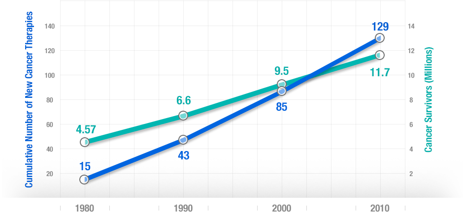



A [three-way fixed-effects analysis](https://pubmed.ncbi.nlm.nih.gov/30912800) of 66 diseases in 27 countries, suggests that if no new drugs had been launched after 1981, the number of years of life lost would have been 2.16 times higher it actually was. It estimates that pharmaceutical expenditure per life-year saved was [$2837](https://pubmed.ncbi.nlm.nih.gov/30912800).

More people survive as more treatments are developed. There's a [strong correlation](http://valueofinnovation.org/power-of-innovation) between the development of new cancer treatments and cancer survival over 30 years.

