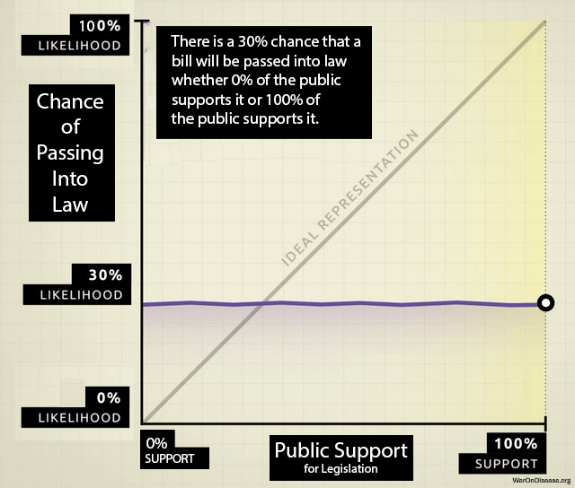



**The Problem in One Sentence:** Politicians are rewarded for funding low-NSV programs (military beyond deterrence: 0.7:1 BCR) and punished for funding high-NSV programs (medical research: 100:1+ BCR) because concentrated interests outlobby diffuse beneficiaries, so government spending is optimized for lobbying intensity rather than marginal societal value.

**The Solution:** Incentive Alignment Bonds (IABs) flip the incentives by creating a capital pool that rewards politicians (with campaign support and post-office career opportunities) for funding high-NSV programs, making marginal societal value optimization the career-maximizing choice.

## Introduction

### The Information-Incentive Disconnect

A central puzzle in political economy is why policies with large positive net social welfare often fail to be adopted. The economic case for many global public goods, including climate mitigation, pandemic preparedness, and clinical trials, is overwhelming, yet governments don't do them. **The conventional diagnosis is wrong**: the problem is not lack of information or resources, but wrong incentives.

**Rankings of government programs by net societal value already exist and are systematically ignored.** The Copenhagen Consensus has published rigorous benefit-cost ratio (BCR) analyses since 2004 [@copenhagenconsensus2023]. Their findings are clear: childhood vaccinations (101:1 BCR), e-government procurement (125:1), and maternal health interventions (87:1) dramatically outperform military spending beyond deterrence requirements (~0.7:1) and fossil fuel subsidies (negative net societal value). GiveWell, Open Philanthropy, the IMF, and numerous academic institutions produce similar analyses.

Yet government spending patterns have not shifted. The U.S. spends $16 on military operations for every $1 on diplomacy and humanitarian aid. Programs with benefit-cost ratios exceeding 100:1 receive single-digit billions while programs with negative net societal value receive hundreds of billions.

**Here's the reality:** If a private equity firm allocated capital like the U.S. government, it would invest $100M in ventures that destroy $500M in value while rejecting ventures that return $10B. The firm would be bankrupt within a year. The government simply prints more money and calls it "fiscal policy."

**The marginal value of producing another ranking is zero.** We don't need more information. Politicians already know which programs produce net societal value. We need a mechanism to make existing information consequential in the political utility function (the mathematical representation of what politicians actually care about: reelection, money, status).

This paper argues that politicians maximize reelection probability, post-office career prospects, and status, not aggregate social welfare. **The problem is not that decision-makers don't know which programs produce value. They do know. They don't care, because caring doesn't appear in their utility function.**

Mancur Olson's seminal work *The Logic of Collective Action* [-@olson1965] established that groups with concentrated interests (small groups with huge per-person stakes, like weapons manufacturers) systematically outcompete groups with diffuse interests (millions of people with small individual stakes, like citizens who'd benefit from cures) in political competition. Why? A small group facing large per-member stakes will invest more in lobbying than a large group facing small per-member stakes. This holds even when total welfare losses exceed total welfare gains. The beneficiaries of inefficient policies (weapons manufacturers, pharmaceutical incumbents, fossil fuel producers) are concentrated. The beneficiaries of efficient policies (citizens who would benefit from cures, climate stability, reduced existential risk) are diffuse.

The result is a systematic distortion of democratic governance. The U.S. Constitution's Preamble charges government to "promote the general Welfare," the welfare of all citizens, not the welfare of any particular faction. Yet Olsonian dynamics ensure that government routinely promotes *specific* welfare (of concentrated interests who can afford to lobby) at the expense of *general* welfare (of the diffuse public). This is not corruption in the legal sense; it is the predictable equilibrium (stable outcome where nobody wants to change their behavior) of rational actors operating within existing institutional rules. The problem is not bad actors but bad incentives.

Empirical evidence confirms this pattern. Gilens and Page [-@gilens2014] analyzed 1,779 policy decisions over two decades. Finding: "economic elites and organized groups representing business interests have substantial independent impacts on U.S. government policy, while mass-based interest groups and average citizens have little or no independent influence." The correlation between average citizen preferences and policy outcomes was effectively zero. Whether 0% or 100% of citizens supported a policy, its probability of adoption remained unchanged at approximately 30%. By contrast, policies favored by economic elites were adopted at significantly higher rates. @fig-policy-influence illustrates this disconnect.

{#fig-policy-influence}

### Key Results

This paper demonstrates that the adoption problem (getting welfare-improving policies passed despite concentrated opposition) is solvable through mechanism design (designing rules so people's selfish choices create good outcomes):

- ** expected first-year ROI** on bootstrap capital from lobbying economics (Section 2.2)
- ** vs.  capital asymmetry** ensures diffuse beneficiaries (citizens who'd benefit from cures) can outspend concentrated opposition (weapons manufacturers) by 90:1 (Section 2.3)
- ** benefit-cost ratio** of the IAB mechanism itself, even accounting for overhead costs and failure risk (Section 7.3)
- **Mechanism achieves incentive compatibility** (when doing the right thing is also the profitable thing) with realistic parameters in low-opposition domains; requires higher funding in entrenched-opposition domains (Section 3.3)
- **Complementary mechanisms prevent allocation capture** once resources are redirected (Section 6.1)
- **Bootstrap problem is solvable**: ROI potential attracts risk-tolerant capital; capital asymmetry ensures scalability once proof-of-concept succeeds (Section 8.1)
- **Dominant assurance contract makes investor participation the strictly dominant strategy**, closing the end-to-end incentive chain from citizen coordination through treaty passage (Section 8.2)

**Scale note.** The prize here is not marginal. Under the project's best-case governance ceiling, the recoverable upside is  per year. Over 20 years, the [Wishonian](../futures/wishonia.qmd) [Optimal Governance Trajectory](../economics/gdp-trajectories.qmd) reaches  the Earth baseline, raises average income to  versus  on the status-quo path, and reaches  in total output. This paper focuses on the adoption mechanism that could make movement toward that ceiling politically profitable; the full derivation lives in [The Political Dysfunction Tax](political-dysfunction-tax.qmd) [@political-dysfunction-tax-paper-2025].

### Reader's Guide

**Non-technical readers** can skip Section 3 (formal model); the intuition is provided in Section 2. **Economists** should focus on Section 3 (explicit functional forms) and Section 7 (welfare accounting). **Investors** should focus on Section 2.2-2.3 (ROI and capital asymmetry) and Section 8 (bootstrap solution).

This paper introduces **Incentive Alignment Bonds (IABs)**, a mechanism design approach to reversing this dynamic. Rather than attempting to change politicians' preferences or relying on benevolent decision-makers, IABs restructure the incentive environment so that rational self-interest points toward welfare-improving policies.

### Definition

An Incentive Alignment Bond is a financial instrument with three primitive properties:

1. **Investor alignment with public good production:** Investors receive returns proportional to verified public-good funding flows achieved (e.g., treaty ratification, appropriations enacted). Returns are keyed to observable funding events, not downstream outcomes, avoiding complex attribution problems. If the policy succeeds, investors profit; if it fails, they do not. This creates a class of actors with concentrated financial interest in policy success.

2. **Politician alignment with public good production:** Politicians receive electoral support and career benefits based on their voting record for the target policy class. Supporting the public good becomes the utility-maximizing choice, increasing reelection probability, post-office income, and status.

3. **Funding from lower-value sources:** The public good is funded by redirecting resources from government activities with lower social value than the target use. In the strongest case, these are programs that produce measurable net harm. More generally, they are programs that persist due to Olsonian concentrated-benefit/diffuse-cost dynamics rather than comparative merit. This constraint ensures IABs reallocate from less valuable to more valuable uses; they are welfare-improving in expectation under standard utilitarian social welfare assumptions.

The third property is crucial. Many government expenditures persist not because they produce social value, but because their beneficiaries are concentrated while their costs are diffuse. Military spending beyond deterrence requirements. Agricultural subsidies that distort markets. Fossil fuel subsidies that accelerate climate change. These programs survive political competition not on merit but on lobbying intensity. Concentrated interests (weapons manufacturers, incumbent industries) invest heavily in maintaining these programs, while diffuse beneficiaries face collective action problems. IABs redirect these resources to measurable public goods, making the reallocation welfare-improving even before accounting for the public good produced.

The key innovation is that all three alignments reinforce each other. A fraction of redirected funding flows perpetually to (a) investor returns and (b) political incentive mechanisms, while (c) the funding source ensures no beneficial programs are displaced. This makes the instrument self-sustaining: policy success generates the resources that maintain both investor and politician alignment, creating pressure for continuation and expansion.

Unlike Social Impact Bonds (which align service providers with program outcomes), IABs align the actors who control large-scale budget decisions, the politicians, with public-good production. Unlike lobbying (which aligns politicians with narrow interests), IABs align politicians with measurable, welfare-improving outcomes. Unlike campaign contributions (which are ad hoc and candidate-specific), IABs create universal, ex-ante rules tied to objective metrics. And unlike new taxation or deficit spending, IABs fund public goods by displacing harmful or wasteful expenditure.

**A natural objection:** "How is this not just PACs + voter scorecards + SIBs?" The answer is that existing mechanisms fail to solve the Olsonian problem because they operate in isolation. PACs exist but remain dominated by concentrated interests due to the 90:1 capital asymmetry. Scorecards exist (League of Conservation Voters, NRA ratings) but lack teeth without accompanying financial incentives. SIBs exist but require government to agree upfront, which faces the same collective action problem IABs solve. IABs integrate all three components (investor capital, electoral accountability, post-office incentives) into a single instrument where each component's effectiveness depends on the others, and where the funding mechanism creates permanent financial incentives for diffuse beneficiaries to overcome collective action barriers. The whole is greater than the sum of its parts because the integrated architecture makes coordinated capital deployment economically rational for millions of individual investors.

### Why Reallocation, Not Addition

A natural question: why insist on *redirecting* resources from harmful programs rather than simply *adding* new spending on public goods? The answer: real resources (people, factories, scientists) are finite.

When advocates successfully lobby for increased spending on a beneficial program, the political response is rarely a corresponding reduction in harmful programs. Instead, governments usually:

1. **Expand the overall budget** through deficit spending or monetary expansion
2. **Increase spending on politically powerful programs** in parallel, to maintain coalition support
3. **Dilute the real value** of new spending through inflation and competition for fixed resources

The result is that the beneficial program's *nominal* budget increases while its *real* share of resources remains unchanged or even decreases. The concentrated beneficiaries of harmful programs lose nothing; the diffuse beneficiaries of the new program gain less than the headline figures suggest.

Consider the empirical pattern: between 2000 and 2024, U.S. federal spending on both military and healthcare increased much in nominal terms. Neither constituency "lost" to the other. Instead, total federal spending grew from \$1.8 trillion to \$6.1 trillion, while the national debt expanded from \$5.6 trillion to \$34 trillion. The real constraint, the finite pool of engineers, scientists, manufacturers, and productive capacity, was diluted across an ever-expanding set of nominal claims. Defense contractors retained their share of real resources; healthcare advocates won nominal victories that competed with inflation and expanding claims elsewhere in the budget.

This is not a failure of advocacy. It is the equilibrium outcome (stable result when everyone optimizes given current rules) of Olsonian dynamics operating under soft budget constraints (when governments can spend without immediate consequences; they just print money or charge it to the credit card of future generations). Concentrated interests protect their programs absolutely. Diffuse interests win nominal victories. The budget grows in nominal terms while each program's claim on real resources remains contested.

The mechanism is straightforward: when Congress appropriates \$10 billion for pragmatic clinical trials without specifying a funding source, the Treasury either borrows or the Federal Reserve accommodates. Total nominal spending increases.

But the supply of trained researchers, laboratory equipment, and institutional capacity does not increase proportionally. The new dollars compete with existing dollars, including those flowing to military, fossil fuel subsidies, and other Olsonian programs, for the same finite resources.

Inflation, both general and sector-specific, erodes the real purchasing power of the nominal increase.

IABs break this dynamic by *specifying the funding source* as part of the mechanism. The policy does not say "fund pragmatic clinical trials"; it says "redirect 1% of military spending to pragmatic clinical trials." This forces a real reallocation:

- Military budgets face *actual* cuts in nominal and real terms
- Concentrated losers (weapons manufacturers) face *real* losses, which they will resist
- But the IAB political incentive layer ensures politicians who support the reallocation benefit more than those who resist
- The finite pool of resources shifts from net-negative to net-positive uses

The third primitive property, funding from harmful sources, is therefore not merely a normative preference or a political strategy. Under the soft budget constraint dynamics described above, it is enough to achieve real resource reallocation (likely needed in practice). Without specifying the funding source, advocates win symbolic victories while real resources continue flowing to Olsonian programs. With specified reallocation, the IAB creates genuine redistribution from net-negative to net-positive uses, constrained only by political will rather than by the illusion of unlimited budgetary capacity.

### Political Change as an Asset Class

To understand why investors would fund the initial campaign to pass an IAB treaty, we must recognize political advocacy not as charity, but as a high-yield asset class. The Return on Investment (ROI) for corporate lobbying is historically orders of magnitude higher than traditional financial markets. The following illustrative estimates, drawn from existing studies, suggest order-of-magnitude returns:

- **Defense:** The top five weapons manufacturers spent $1.1 billion on lobbying over two decades while receiving $2.02 trillion in Pentagon contracts, an implied maximum ROI of approximately **181,000%** assuming full attribution [@responsiblestatecraft2021].
- **Fossil Fuels:** The oil and gas industry spent $151 million lobbying in 2024 to protect $17 billion in subsidies, an implied maximum annual return of approximately **11,000%** assuming full attribution [@opensecrets2025].
- **Medical Research:** Academic analysis finds that for specific disease groups, each $1,000 spent on lobbying is associated with $25,000 in additional NIH funding, an implied return of approximately **2,500%** [@nature2014].

These figures represent upper bounds assuming all contracts/subsidies are attributable to lobbying; causal attribution is complex and effects vary by context. Academic estimates of causal lobbying returns typically find 100-1000x ROI. Nevertheless, they suggest that political influence generates returns far exceeding traditional asset classes (compare to the S&P 500's historical average of ~10%). Political change is currently accessible only to concentrated industries protecting the status quo. IABs securitize this opportunity, allowing investors to capture a fraction of the value generated by shifting government priorities toward public goods.

$$
E[R] = \frac{P(\text{success}) \times (\text{Redirected Flow} \times \text{Investor Share})}{\text{Campaign Cost}}
$$

**Illustrative calculation:** If a campaign costs  and has a 20% chance of passing a treaty that redirects /year (with  to investors), the expected annual value is:

$$
E[V] = 0.20 \times \$2.72\text{B} = \$544\text{M/year}
$$

The expected first-year ROI on the  campaign is 54.4% (expected payout divided by campaign cost), with the revenue stream continuing in perpetuity. Upon treaty passage, the conditional ROI is .

**Sensitivity to parameter uncertainty:**

| Parameter | Base Case | Effect on ROI |
|:----------|:----------|:--------------|
| Success probability | 20% (illustrative) | Linear |
| Campaign cost |  | Inverse |
| Investor share |  | Linear |
| Treaty size |  | Linear |

Even under conservative assumptions (low success probability, upper CI bound on campaign cost,  investor share), expected ROI remains comparable to  stock market returns, with asymmetric upside. The mechanism is economically rational for risk-tolerant capital across a wide parameter range.

### The Capital Asymmetry: Why IABs Can Outcompete Incumbent Lobbying

Here's what almost everyone misses: **the collective capital available to diffuse beneficiaries vastly exceeds the resources of concentrated interests.** The problem is not lack of resources but lack of coordination.

Consider the global capital distribution:

- **Concentrated interests** (weapons manufacturers, fossil fuel companies, pharmaceutical incumbents): Combined market capitalization ~[^capital-estimate]
- **Diffuse beneficiaries** (everyone who would benefit from cures, climate stability, pandemic prevention): Global household wealth ~ [@creditsuisse2023]

[^capital-estimate]: Conservative estimate: weapons manufacturers ~\$2T, fossil fuel companies ~\$2.5T, pharmaceutical companies ~\$4T (though pharma may align with IABs). Total concentrated opposition: \$2T-\$5T depending on domain.

The 90:1 capital advantage cannot currently be deployed because diffuse beneficiaries face a collective action problem (hard for large groups to coordinate even when everyone would benefit): each individual's stake is small, and coordination costs are prohibitive. A retiree who would gain 5 additional healthy years from accelerated medical research has enormous stake (~\$500K in value of statistical life-years) but cannot coordinate with millions of other retirees to match pharmaceutical lobbying budgets.

**IABs solve the coordination problem by securitizing political change** (turning policy outcomes into tradable financial instruments, like turning mortgages into mortgage-backed securities). If IABs can be structured as tradable securities that any individual can purchase, they transform diffuse beneficiaries into the largest special interest group in history. The mechanism:

1. **Investment accessibility:** Structure IABs as securities available to retail investors (similar to green bonds or social impact bonds)
2. **Returns exceed alternatives:** Expected returns of 100-1000%+ (from lobbying ROI) dramatically exceed stock market returns of 
3. **Massive capital mobilization:** Even 0.1% of global household wealth ( 0.1%) exceeds total annual global lobbying spending by 100×
4. **Self-interest alignment:** Investors profit directly from policy success, creating concentrated financial incentives on the welfare-improving side

**This reverses the Olsonian asymmetry.** Defense contractors spend \$100M+ annually lobbying because each firm captures concentrated benefits.

But the IAB mechanism allows millions of diffuse beneficiaries to collectively deploy billions while each capturing a proportional return.

The concentrated opposition ($100M-$1B annually) becomes outmatched by newly-coordinated diffuse support ($10B-$100B+ available capital).

We're not inventing lobbying. Defense contractors proved it works decades ago. We're just making it available to everyone whose lives depend on cures instead of bombs. Turns out there are more of us, and we're much richer. The political change ROI (100-10,000x) that currently accrues only to concentrated industries becomes accessible to everyone who benefits from public goods.

### Quantifying Net Societal Value of Funding Sources

The third primitive property requires identifying government expenditures with lower marginal social value than the proposed alternative. This is an empirical question that can be addressed using standard welfare economics:

$$
NSV_i = B_i - C_i
$$ {#eq-nsv}

where $NSV_i$ is net societal value of program $i$, $B_i$ is measurable social benefits (including economic multiplier effects), and $C_i$ is total costs (including both direct expenditure and opportunity costs of foregone alternatives).

A program is an appropriate IAB funding source if:

$$
NSV_{source} < NSV_{target}
$$ {#eq-comparative}

That is, if the marginal social value of the source program is lower than that of the target program. In the strongest case, $NSV_{source} \leq 0$; the program produces net harm. But reallocation is justified even when both programs have positive value, as long as the target exceeds the source.

This comparative criterion implies a natural ranking of government expenditures by marginal social value. IABs should draw from the *lowest-ranked* programs first, those that persist mainly due to Olsonian dynamics rather than merit. This avoids the objection that "military isn't ALL bad"; the claim is not that military spending is worthless, but that its marginal value is lower than medical research, and that it persists at current levels due to lobbying intensity rather than comparative social value.

**Military spending** provides a concrete example. The economic multiplier for military spending is around 0.6, compared to 1.5–3.0 for infrastructure, education, and medical research. This means each dollar of military spending generates \$0.60 in economic activity, while each dollar of medical research investment generates \$2.00–3.00. The opportunity cost alone, before considering direct harms, makes military spending beyond minimum deterrence requirements a net social loss.

More comprehensive analysis includes:

| Cost Category | Annual Value | Source |
|:--------------|:-------------|:-------|
| Direct military expenditure |  |  |
| Lost GDP from multiplier differential |  |  |
| Infrastructure destruction (active conflicts) |  | World Bank |
| Human casualties (VSL method) |  | EPA VSL × conflict deaths |
| Trade disruption |  | World Bank trade flow analysis |
| Veteran healthcare (ongoing) |  |  |
| Environmental damage |  |  |
| **Total societal cost** | **** | Sum of above |

: Estimated Annual Societal Cost of Global Military Spending {#tbl-military-cost}

A large literature suggests the net societal value of military spending beyond minimum deterrence is strongly negative:  in direct expenditure produces  in societal costs (see @tbl-military-cost for illustrative order-of-magnitude estimates). If these estimates are roughly correct, redirecting even 1% to pragmatic clinical trials, which has positive externalities and high multipliers, would be welfare-improving on net.

Similar analysis applies to other Olsonian programs:

- **Fossil fuel subsidies** (\$7T globally, IMF 2023): Accelerate climate change, distort energy markets, produce negative externalities exceeding subsidy value
- **Agricultural subsidies** in developed nations: Distort global food markets, harm developing-country farmers, produce environmental damage from monoculture incentives
- **Regulatory capture programs**: Expenditures that exist to protect incumbent firms from competition rather than serve public interest

@tbl-ranking presents a comprehensive ranking combining Copenhagen Consensus data with other authoritative sources. The pattern is stark: programs with BCRs exceeding 100:1 receive single-digit billions in annual spending, while programs with negative NSV receive hundreds of billions. **Spending correlates with lobbying intensity, not social value.** This systematic misallocation is the empirical foundation for the IAB mechanism.

| Program / Category | BCR | Annual Spending | Est. NSV (per $1) | Source |
|:-------------------|:----|:----------------|:------------------|:-------|
| **HIGH-NSV PROGRAMS (IAB TARGETS)** |
| Pragmatic Clinical Trials | 637:1 – 11,540:1 | ~\$60B | **+\$636 – \$11,539** | [@dfda-impact-paper-2025]; [@recovery-trial-summary-quote] |
| Childhood Vaccinations (Global) | 101:1 | ~\$8B | **+\$100** | Copenhagen Consensus 2023 [@copenhagenconsensus2023] |
| E-Government Procurement | 125:1 | ~\$2B | **+\$124** | Copenhagen Consensus 2023 [@copenhagenconsensus2023] |
| Maternal/Neonatal Care | 87:1 | ~\$12B | **+\$86** | Copenhagen Consensus 2023 [@copenhagenconsensus2023] |
| Nutrition Interventions | 18:1 | ~\$5B | **+\$17** | Copenhagen Consensus 2023 [@copenhagenconsensus2023] |
| Medical Research (NIH) | 2.56:1 – 4.75:1 | \$47B | **+\$1.56 – \$3.75** | United for Medical Research [@unitedformedicalresearch2025] |
| Early Childhood Education | 2.5:1 – 10.8:1 | ~\$30B | **+\$1.50 – \$9.80** | [@heckman2010], [@reynolds2011] |
| **MODERATE-NSV PROGRAMS** |
| Infrastructure (High-Quality) | 1.5:1 – 2.5:1 | Varies | **+\$0.50 – \$1.50** | [@cbo2015]; highly project-dependent |
| **LOW/NEGATIVE-NSV PROGRAMS (IAB SOURCES)** |
| Military (Beyond Deterrence) | ~0.7:1 | \$450B+ (US) | **-\$0.30** | [@barro2011]; fiscal only, excludes conflict costs |
| Fossil Fuel Subsidies (Explicit) | <0 | \$20B (US) | **-\$1 to -\$5** | [@imf-fossilfuel2023] |
| Fossil Fuel (Implicit/Externalities) | -5:1 | \$568B (US) | **-\$5** | [@batini2021], PNAS 2021 externality analysis |

: Ranking of Government Expenditures by Benefit-Cost Ratio and Net Societal Value {#tbl-ranking}

The empirical criterion is straightforward: if a program's beneficiaries are concentrated, its costs are diffuse, and rigorous cost-benefit analysis shows $NSV_{source} < NSV_{target}$, reallocation is welfare-improving. In the clearest cases, where $NSV_{source} \leq 0$, the source program is actively harmful and reallocation is unambiguously beneficial. But even programs with modestly positive NSV are appropriate sources if the target has much higher value. The IAB mechanism does not require moral judgment about the source program, only comparative measurement.





@fig-spending-bcr-scatter visualizes this systematic misallocation as a scatter plot, while @fig-olsonian-quadrants categorizes programs into four quadrants based on their NSV and funding levels. These visualizations make clear that under rational allocation, high-BCR programs receive high funding (upper-right quadrant). Instead, we observe the opposite: high-BCR programs cluster in the "UNDERINVESTED" region while low/negative-BCR programs are "OVERINVESTED."

### Relation to Existing Literature

This paper combines three literatures. First, **mechanism design theory** [@hurwicz1972; @myerson1979; @maskin1999] provides tools for designing institutions when agents have private information and act strategically. While mechanism design has transformed market institutions, from spectrum auctions [@milgrom2004] to kidney exchanges [@roth2002], its application to political institutions is limited. We extend this framework to political incentives, treating politicians as strategic agents whose actions (votes) are observable but whose preferences may diverge from social welfare.

Second, **public choice theory** [@buchanan1962; @olson1965] models politicians as utility maximizers rather than benevolent planners. Olson's analysis of concentrated versus diffuse interests explains persistent policy failures but offers limited remedies. We turn Olson's insight into a mechanism: if concentrated benefits cause politicians to favor narrow interests, then *concentrating benefits on the welfare-improving side* can reverse the dynamic.

Third, **campaign finance research** [@spenkuch2018; @stratmann2002; @fowler2020] and **political agency models** [@shepherd2019] document how electoral incentives and career concerns shape politician behavior. We synthesize these findings into a mechanism that systematically exploits these channels for public goods.

Relative to Social Impact Bonds [@liebman2011; @gustafsson2017], IABs target a different agent (politicians vs. service providers) at a different level (policy adoption vs. program delivery). Relative to lobbying and campaign contributions, IABs create universal, ex-ante, public rules tied to verifiable outcomes rather than ad hoc relationships. Relative to pure voting reform proposals, IABs work within existing institutional constraints.

### Contribution

This paper makes five contributions:

1. **Mechanism Design for Governance**: We apply the formal tools of mechanism design theory, developed for auctions, matching markets, and resource allocation, to the problem of political incentives. While mechanism design has transformed economic institutions from spectrum auctions to kidney exchanges, its application to democratic governance is underdeveloped.

2. **A New Financial Instrument**: We define IABs as a distinct class of financial instrument with three primitive properties: investor alignment, politician alignment, and funding from lower-value sources. This distinguishes IABs from Social Impact Bonds (which reward service providers, not politicians), lobbying (which serves narrow interests), and campaign contributions (which lack systematic, ex-ante, universal rules tied to measurable outcomes).

3. **A Legal Architecture**: We specify a three-layer structure (scoring, electoral support, post-office benefits) that achieves incentive alignment without violating anti-bribery statutes. The legal innovation is separating data provision from electoral activity from career benefits, with each layer operated by legally distinct entities.

4. **A Welfare-Improvement Criterion**: We formalize how to identify appropriate IAB funding sources using comparative net societal value analysis ($NSV_{source} < NSV_{target}$) and show why *specified reallocation*, rather than budget addition, is enough (needed) to achieve real resource shifts. Under soft budget constraints, nominal spending increases are diluted by deficit expansion and inflation while Olsonian programs retain their share of real resources. This comparative criterion implies a natural ranking of expenditures; IABs draw from the lowest-ranked programs first, ensuring reallocation is welfare-improving under standard utilitarian assumptions.

5. **A Bootstrap Coordination Mechanism**: We adapt Tabarrok's [-@tabarrok1998] dominant assurance contract to solve the investor coordination problem that precedes IAB deployment. We prove that participation in the assurance contract is the strictly dominant strategy for all potential investors (Proposition 4), closing the end-to-end incentive chain from citizen coordination through politician behavior change to treaty passage.

### Roadmap

Section 2 reviews why previous approaches failed. Section 3 presents the formal model. Section 4 details the three-layer architecture and its legal basis. Section 5 analyzes failure modes. Section 6 discusses the broader governance stack. Section 7 extends the mechanism to climate, nuclear risk, and pandemic preparedness. Section 8 addresses the bootstrap problem, including the dominant assurance contract for investor coordination. The Conclusion summarizes contributions and open questions.

## Why Previous Approaches Failed {#sec-literature}

### Mechanism Design Theory

The Sveriges Riksbank Prize in Economic Sciences 2007 was awarded to Leonid Hurwicz, Eric Maskin, and Roger Myerson "for having laid the foundations of mechanism design theory" [@nobelprize2007]. Mechanism design addresses a fundamental problem: how do you get selfish people to do the right thing without forcing them?

Hurwicz [-@hurwicz1972] introduced the concept of **incentive compatibility**: a mechanism is incentive-compatible if the socially optimal action is in each agent's self-interest. The rules make doing the right thing also the profitable thing.

These concepts have transformed market design: auction theory [@milgrom2004], matching markets [@roth2002], and regulation [@laffont1993]. This paper extends mechanism design to political incentives, treating politicians as strategic agents whose actions (votes, public statements, bill sponsorship) are observable.

### Public Choice Theory

Public choice theory applies economic methods to political behavior. Buchanan and Tullock [-@buchanan1962] model politicians and voters as rational utility maximizers, not benevolent social planners. Olson [-@olson1965] shows that collective action for public goods is systematically undersupplied because:

1. **Free-rider problem**: Large groups cannot exclude non-contributors from benefits
2. **Asymmetric stakes**: Per-member stakes are higher in small groups
3. **Organization costs**: Smaller groups face lower coordination costs

The result is that "concentrated minor interests will be overrepresented and diffuse majority interests trumped" [@olson1965]. Empirical support includes Lohmann's observation that U.S. sugar import quotas generated 2,261 jobs while reducing overall welfare by $1.162 billion, an implicit cost per job exceeding $500,000 [@lohmann1998]. The government could have paid each sugar worker half a million dollars to not grow sugar. This would have saved money. Nobody did this. Sugar growers have lobbyists. Consumers don't.

IABs address this directly: by concentrating benefits on politicians who support diffuse-benefit policies, the asymmetry is reversed. Supporting the public good becomes the concentrated-benefit option.

### Social Impact Bonds

Social Impact Bonds (SIBs), introduced in the UK in 2010, are outcome-based contracts in which private investors fund social interventions and are repaid by government only if specified outcomes are achieved [@liebman2011]. The Peterborough Prison SIB, the first implemented, funded prisoner rehabilitation and measured recidivism rates against a control group [@disley2011].

SIBs have attracted much policy enthusiasm but limited empirical evidence of their distinctive effect. As Hevenstone [-@hevenstone2023] notes, "only program effects have been estimated, not the specific impact of SIB financing itself." A systematic review by the Brookings Institution found "insufficient evidence as to whether and how SIBs deliver better outcomes than conventional forms of financing" [@gustafsson2017].

More important, SIBs target the wrong level. They incentivize **service providers** (nonprofits delivering programs) for **local outcomes** (recidivism in one city). IABs target **politicians** for **policy adoption** at the national or international level. The difference: incentivizing one job training program versus incentivizing the legislation that funds all job training programs. @tbl-sib-iab summarizes the distinction.

| Dimension | Social Impact Bonds | Incentive Alignment Bonds |
|:----------|:--------------------|:--------------------------|
| Target agent | Service providers | Politicians |
| Outcome measured | Program delivery | Policy adoption and funding flows |
| Scale | Municipal/program | National/international |
| Funding source | Government pays for outcomes | Policy outcome funds mechanism |
| Attribution | Single provider, single program | Voting records, funding contributions |

: Comparison of Social Impact Bonds and Incentive Alignment Bonds {#tbl-sib-iab}

### Campaign Finance and Political Behavior

Empirical research on campaign finance provides the evidentiary foundation for the electoral layer of IABs.

**Independent expenditures affect elections.** Following *Citizens United v. FEC* (2010), independent expenditures increased dramatically. In the decade prior to the decision, outside groups spent $296 million total on independent expenditures; in the decade after, they spent $4.26 billion, a 14-fold increase [@opensecrets2020]. Research using transaction-level disbursement data finds that "spending on messages to voters has a statistically significant effect on voter support for candidates" and is "especially effective in changing the composition of voters" [@spenkuch2018].

**Interest group scorecards influence behavior.** Organizations like the National Rifle Association (NRA), League of Conservation Voters (LCV), and Chamber of Commerce publish voting scorecards that affect politician behavior. The LCV has published its National Environmental Scorecard since 1970, and it has "become the gold standard of congressional vote scoring on environmental issues" [@lcv2024]. Research confirms that PAC contributions correlate with votes on relevant issues, though causality is debated [@stratmann2002; @fowler2020].

**The revolving door affects politician incentives.** Research documents significant movement between government and private sector. A 2023 study found that 32% of HHS appointees exited to industry employment [@hhs2023]. Among four-star military officers who retired after June 2018, over 80% went to work for the military industry as board members, advisors, executives, consultants, or lobbyists [@hartung2023]. Shepherd and You [-@shepherd2019] find evidence that "career concerns" about post-office employment influence legislative behavior.

### Credit Rating Agencies as Governance Mechanisms

Credit rating agencies (CRAs) provide a precedent for private organizations influencing sovereign policy through reputational mechanisms. Moody's, S&P, and Fitch assign sovereign credit ratings that directly affect borrowing costs. Barta [-@barta2024] describes CRAs as "unelected, unappointed, unaccountable profit-seeking institutions" whose power rivals the IMF or World Bank. Downgrades can trigger crises: Greece, Ireland, and Portugal all experienced accelerated debt crises following CRA downgrades to "junk" status [@desa2023].

The IAB scoring system is structurally analogous to credit ratings: an independent body publishes scores based on objective criteria, and market actors (voters, donors, employers) respond to those scores. The difference is the metric: instead of fiscal sustainability, IABs measure support for measurable public goods.

## The Math: Proving It Works {#sec-formal-model}

**For Non-Technical Readers:** You can skip this section. In plain English: We create a "Public Good Score" for each politician based on their voting record. Politicians with higher scores get (1) campaign support from independent political groups, (2) better post-office job opportunities, and (3) higher public status. When these benefits exceed the costs (losing weapons manufacturer donations), supporting public goods becomes the rational choice. Skip to Section 4 for practical implementation or Section 6 for governance architecture.

This section presents a formal model of political incentives under IABs. We state explicit assumptions, derive conditions for incentive compatibility (when doing the right thing is also the profitable thing), and characterize equilibria (stable outcomes). Appendix A provides detailed proofs.

### Assumptions

We maintain the following assumptions throughout:

**A1 (Rational Politicians).** Each politician $i \in \{1, \ldots, N\}$ is a rational agent maximizing expected utility $U_i$ over career outcomes, including reelection, post-office income, and legacy.

**A2 (Observable Votes).** Voting records on policy class $\mathcal{P}$ are publicly observable and verifiable. The scoring function $f: \text{VoteRecord} \to \mathbb{R}$ is common knowledge.

**A3 (Credible Commitment).** The IAB mechanism can credibly commit to score-dependent payoffs: independent expenditure rules $I_i(\theta_i)$ and post-office eligibility criteria $\tau(\theta_i)$ are announced ex ante and cannot be renegotiated ex post.

**A4 (Funded Mechanism).** The IAB is sufficiently capitalized that the payoff differentials $\Delta P_i$, $\Delta Y_i$ induced by score changes are non-negligible relative to concentrated opposition costs $c_i$.

**A5 (Single Policy Dimension).** Politicians face a binary choice $a_i \in \{0,1\}$ on the target policy class. Extensions to multiple dimensions are discussed in Section 6.

### The Politician's Utility Function

We model a politician $i$ as a rational agent maximizing a utility function:

$$
U_i = \alpha_i \cdot P_i(\text{reelection}) + \beta_i \cdot E_i[\text{PostOfficeIncome}] + \gamma_i \cdot S_i(\text{Legacy})
$$ {#eq-utility}

where:

- $P_i(\text{reelection})$ is the probability of winning the next election
- $E_i[\text{PostOfficeIncome}]$ is expected lifetime earnings after leaving office
- $S_i(\text{Legacy})$ is a status/legacy function (books, buildings named, Wikipedia length)
- $\alpha_i, \beta_i, \gamma_i > 0$ are weights varying by politician but assumed positive

This formulation is consistent with public choice theory's treatment of politicians as utility maximizers [@buchanan1962] and with empirical research on career concerns [@shepherd2019].

### The Utility Function Transformation

The key mechanism design insight is that IABs transform the politician's utility function by introducing a dependency on net societal value (NSV) rankings through an intermediate score variable.

**Pre-IAB utility function:** Let $R$ denote the ranking of programs by NSV (as produced by Copenhagen Consensus, GiveWell, etc.). In the status quo:

$$
U_i^{\text{pre-IAB}} = \alpha_i \cdot P_i + \beta_i \cdot Y_i + \gamma_i \cdot S_i
$$ {#eq-utility-pre}

**Critically, the ranking $R$ appears nowhere in this function.** Each component is driven by lobbying intensity and concentrated interests, not social value:

- $P_i = P_i^0 + f(\text{campaign contributions}) + g(\text{attack ads avoided})$
- $Y_i = h(\text{revolving door relationships})$
- $S_i = s(\text{partisan loyalty}, \text{donor satisfaction})$

**Post-IAB utility function:** The IAB mechanism introduces a **Public Good Score** $\theta_i = f(R, \text{VoteRecord}_i)$ that translates the NSV ranking into politician-specific incentives. Each utility component becomes score-dependent:

$$
U_i^{\text{post-IAB}} = \alpha_i \cdot P_i(\theta_i) + \beta_i \cdot Y_i(\theta_i) + \gamma_i \cdot S_i(\theta_i)
$$ {#eq-utility-post}

**Now the ranking $R$ is operative through $\theta_i$.** Politicians who vote to reallocate resources from low-NSV to high-NSV programs see their scores rise, which increases their reelection probability, post-office income prospects, and legacy value.

**Explicit functional forms:** The post-IAB components are specified as:

**Reelection probability:**

$$
P_i(\theta_i) = P_i^0 + \delta \cdot (\theta_i - \bar{\theta}) + \epsilon_i \cdot I_i(\theta_i)
$$ {#eq-reelection-functional}

where $P_i^0$ is baseline reelection probability, $\bar{\theta}$ is the median score, $\delta > 0$ captures the direct electoral effect of scorecard visibility, and $I_i(\theta_i)$ is the independent expenditure function (a step function with discrete rewards):

$$
I_i(\theta_i) = \begin{cases}
+M & \text{if } \theta_i \geq \theta^{high} \\
0 & \text{if } \theta^{med} \leq \theta_i < \theta^{high} \\
-M & \text{if } \theta_i < \theta^{med}
\end{cases}
$$ {#eq-independent-expenditure}

**Post-office income:**

$$
Y_i(\theta_i) = Y(\tau(\theta_i))
$$ {#eq-postoffice-functional}

where $\tau: \mathbb{R} \to \{1, 2, 3\}$ maps scores to income tiers:

$$
\tau(\theta_i) = \begin{cases}
1 & \text{if } \theta_i \geq 75 \quad (\text{Tier 1: \$500K+ annually}) \\
2 & \text{if } 60 \leq \theta_i < 75 \quad (\text{Tier 2: \$200-400K annually}) \\
3 & \text{if } \theta_i < 60 \quad (\text{Tier 3: \$150-300K annually})
\end{cases}
$$ {#eq-income-tiers}

**Legacy/status:**

$$
S_i(\theta_i) = S_0 + \lambda \cdot \theta_i
$$ {#eq-legacy-functional}

where $S_0$ is baseline status and $\lambda > 0$ captures the marginal status gain from higher scores (measured by metrics such as Wikipedia article length, think tank fellowships, speaking invitations, historical assessments).





**The transformation does not change what politicians optimize; it changes what optimizing points at.** Same selfish utility maximization, radically different equilibrium outcome. This is the core mechanism design contribution: we align private incentives with public welfare not by appealing to altruism, but by redirecting self-interest. The diagrams above illustrate this transformation.

### Numerical Calibration and Parameter Ranges

To evaluate whether the incentive compatibility condition can realistically be satisfied, we provide illustrative calibrations based on campaign finance research and career trajectories.

**Base case parameters:**

| Politician Type | $\alpha_i$ (Electoral Weight) | $\beta_i$ (Career Weight) | $\gamma_i$ (Legacy Weight) | $P_i^0$ (Baseline Prob.) |
|:----------------|:------------------------------|:--------------------------|:--------------------------|:-------------------------|
| Marginal seat | 0.6 | 0.3 | 0.1 | 0.50 |
| Safe seat | 0.2 | 0.5 | 0.3 | 0.85 |
| Termed out | 0.0 | 0.7 | 0.3 | N/A |

: Politician Heterogeneity in Utility Weights {#tbl-politician-types}

**IAB mechanism parameters (illustrative):**

- Score threshold for high tier: $\theta^{high} = 80$, $\theta^{med} = 60$
- Independent expenditure support: $M = \$5\text{M to }\$20\text{M}$ (competitive race)
- Electoral impact: $\delta = 0.02$ to $0.05$ (2-5 percentage point swing from scorecard visibility)
- Post-office income differential: $\Delta Y = \$200\text{K to }\$350\text{K annually}$ (present value \$3M-$5M over 15-year career)
- Legacy multiplier: $\lambda = 0.1$ (1 SD score increase → 10% increase in Wikipedia length, fellowships, etc.)

**Concentrated opposition cost:**

- Moderate opposition: $c_i = \$2\text{M to }\$5\text{M}$ (attack ads, lost contributions, primary challenge risk)
- Strong opposition: $c_i = \$10\text{M to }\$20\text{M}$ (defense/fossil fuel reallocation)

**Incentive compatibility calculation (marginal seat politician):**

Suppose a marginal-seat Senator (50% baseline reelection, $\alpha_i = 0.6$, $\beta_i = 0.3$, $\gamma_i = 0.1$) votes for a 1% military reallocation treaty:

$$
\Delta P_i = \delta \cdot \Delta\theta + \epsilon_i \cdot M = (0.03)(20) + (0.08 \text{ pp}/\$\text{M})(\$10\text{M}) = 0.6\text{ pp} + 0.8\text{ pp} = 1.4\text{ pp}
$$

*Note: εi is calibrated in percentage points per $1M, so εi·M yields percentage points.*

$$
\Delta Y_i = \$300\text{K annually} \times \frac{1 - (1.05)^{-15}}{0.05} \approx \$300\text{K} \times 10.38 \approx \$3.11\text{M PV}
$$

$$
\Delta S_i = \lambda \cdot \Delta\theta = 0.1 \times 20 = 2.0
$$

Utility gain (converting all terms to dollar-equivalents, with reelection probability valued at $50M lifetime Senate seat value and status units at $10M each):

$$
\alpha_i \Delta P_i + \beta_i \Delta Y_i + \gamma_i \Delta S_i \approx 0.6(\$50\text{M} \times 0.014) + 0.3(\$3.11\text{M}) + 0.1(\$10\text{M} \times 2.0)
$$

$$
\approx \$0.42\text{M} + \$0.93\text{M} + \$2\text{M} \approx \$3.35\text{M}
$$

If concentrated opposition cost is $c_i = \$5\text{M}$ (attack ads, lost defense PAC contributions), then:

$$
\Delta U_i = \$1.35\text{M} - \$5\text{M} = -\$3.65\text{M} < 0
$$

**Mechanism fails with current calibration.** To achieve incentive compatibility, IABs must increase either:

- Independent expenditure support ($M$) from \$10M to \$20M+
- Post-office income differential ($\Delta Y$) via additional tier benefits
- Electoral impact ($\delta$) through more aggressive scorecard visibility campaigns

**Revised calibration (mechanism succeeds):**

If $M = \$20\text{M}$ and $\delta = 0.05$:

$$
\Delta P_i = 0.05(20) + 0.08(\$20\text{M}) = 1.0 + 1.6 = 2.6\%
$$

$$
\Delta U_i = 0.6(0.026)(\text{value of 2.6pp reelection}) + 0.3(\$4.5\text{M}) + 0.1(2.0)
$$

Translating reelection probability to dollars (value of Senate seat ≈ \$50M lifetime value):

$$
\Delta U_i \approx 0.6(0.026 \times \$50\text{M}) + \$1.35\text{M} + 0.2 \approx \$0.78\text{M} + \$1.35\text{M} = \$2.13\text{M}
$$

Still insufficient if $c_i = \$5\text{M}$. But if concentrated opposition is only $c_i = \$2\text{M}$ (lower-opposition domain like pandemic preparedness), mechanism succeeds:

$$
\Delta U_i = \$2.13\text{M} - \$2\text{M} = \$0.13\text{M} > 0 \quad \checkmark
$$

The calibration shows:

1. Pandemic preparedness ($c_i = \$1\text{M-}\$3\text{M}$) is more tractable than defense reallocation ($c_i = \$10\text{M-}\$20\text{M}$)
2. Safe-seat politicians need larger $\beta_i$ (career) and $\gamma_i$ (legacy) incentives since $\alpha_i$ (electoral) is small
3. Termed-out politicians are most cost-effective: $\alpha_i = 0$ but $\beta_i = 0.7$ means post-office incentives dominate
4. High-opposition domains require \$20M+ per pivotal vote; low-opposition domains require \$5M-$10M

@eq-ic is achievable with realistic parameter values in carefully-selected domains.

### The Policy Choice

Consider a binary policy choice $a_i \in \{0, 1\}$ where:

- $a_i = 1$: Support a policy that funds public good $G$
- $a_i = 0$: Oppose or abstain

Let $W(G)$ denote the social welfare gain from $G$. By assumption, $W(G) > 0$; the policy is welfare-improving. The question is whether $a_i = 1$ is incentive-compatible.

### The Pre-IAB Equilibrium

Without IABs, the politician faces:

**Benefits of $a_i = 1$:**

- Diffuse voter approval (small per-voter benefit, hard to attribute)
- Abstract "doing the right thing" utility (assumed small)

**Costs of $a_i = 1$:**

- Concentrated opposition from losers (weapons manufacturers, pharmaceutical incumbents)
- Attack ads: "Senator voted to WEAKEN AMERICA"
- Loss of campaign contributions from concentrated interests

Formally:

$$
\Delta U_i^{\text{pre-IAB}}(a_i = 1) = \epsilon - c_i
$$ {#eq-pre-iab}

where $\epsilon$ is the small diffuse benefit and $c_i > 0$ is the net concentrated cost from losing incumbents' support (campaign contributions foregone, attack ads received, post-office opportunities closed). Since $c_i > \epsilon$ for most policies with diffuse benefits, the equilibrium is $a_i^* = 0$. This is Olson's result in formal terms.

### The IAB Mechanism

The IAB mechanism introduces a **Public Good Score** $\theta_i$ for each politician, where:

$$
\theta_i = f(\text{VoteRecord}_i)
$$ {#eq-score}

The score is based purely on voting record on policy class $\mathcal{P}$ (policies meeting specified criteria for the target public good). This is a design choice with important implications:

1. **Measurability**: Voting records are public, verifiable, and effectively ungameable
2. **Attribution**: Each politician's vote is directly attributable
3. **No oracle problem**: No need for contested measurement of downstream outcomes; the mechanism relies on observable voting records

### Score-Dependent Payoffs

The IAB mechanism makes each component of $U_i$ a function of $\theta_i$:

**Reelection probability:**

$$
P_i(\text{reelection}) = P_i^0 + \delta \cdot (\theta_i - \bar{\theta}) + \epsilon_i \cdot I_i(\theta_i)
$$ {#eq-reelection}

where:

- $P_i^0$ is baseline reelection probability
- $\bar{\theta}$ is the median score
- $\delta > 0$ is an empirical parameter capturing the direct electoral effect of scorecard visibility (media coverage, voter information)
- $I_i(\theta_i)$ is independent expenditure support determined by a pre-announced, public rule, a step function:

$$
I_i(\theta_i) = \begin{cases}
+M & \text{if } \theta_i \geq \theta^{high} \\
0 & \text{if } \theta^{med} \leq \theta_i < \theta^{high} \\
-M & \text{if } \theta_i < \theta^{med}
\end{cases}
$$ {#eq-independent}

where $M > 0$ represents campaign support magnitude.

**Post-office income:**

$$
E_i[\text{PostOfficeIncome}] = Y(\tau(\theta_i))
$$ {#eq-postoffice}

where $\tau: \mathbb{R} \to \{1, 2, 3\}$ is a tier function and $Y(1) > Y(2) > Y(3)$ represents expected annual income by tier:

| Tier | Threshold | Expected Annual Income | Examples |
|:-----|:----------|:-----------------------|:---------|
| 1 | $\theta_i \geq 75$ | \$500K+ | WHO Advisory Board, Aspen Fellowships |
| 2 | $60 \leq \theta_i < 75$ | \$200-400K | Brookings, RAND, university chairs |
| 3 | $\theta_i < 60$ | \$150-300K | Defense contractor boards, lobbying firms |

: Post-Office Income by Public Good Score Tier {#tbl-postoffice}

### Incentive Compatibility

**Proposition 1 (Sufficient Condition for Incentive Compatibility).** *Under assumptions A1–A5, if the score gain from supporting policy class $\mathcal{P}$ is $\Delta\theta > 0$, and*

$$
\alpha_i \cdot \Delta P_i + \beta_i \cdot \Delta Y_i + \gamma_i \cdot \Delta S_i > c_i
$$ {#eq-ic}

*then $a_i = 1$ is the unique best response for politician $i$.*

*Proof sketch:* By A2, votes are observable and the scoring function is common knowledge, so the politician can compute $\theta_i' = \theta_i + \Delta\theta$ conditional on $a_i = 1$. By A3, the payoff functions are credibly committed, so the politician can compute $\Delta P_i$, $\Delta Y_i$, and $\Delta S_i$. By A1, the politician maximizes $U_i$. The change in utility from choosing $a_i = 1$ versus $a_i = 0$ is:

$$
\Delta U_i = \alpha_i \cdot \Delta P_i + \beta_i \cdot \Delta Y_i + \gamma_i \cdot \Delta S_i - c_i
$$

When @eq-ic holds, $\Delta U_i > 0$, so $a_i = 1$ strictly dominates $a_i = 0$. See Appendix A for the complete proof. $\square$

**Corollary 1.** *Under A4, there exists a funding level $\bar{F}$ such that for all $F > \bar{F}$, @eq-ic holds for all politicians with $c_i < \bar{c}$ for some threshold $\bar{c}(F)$ increasing in $F$.*

This establishes that sufficiently funded IABs can overcome concentrated opposition up to a threshold that increases with funding.

### Nash Equilibrium Analysis

Consider a legislature of $N$ politicians. Let $n = \sum_{i=1}^N a_i$ be the number supporting the policy.

**Proposition 2 (Multiple Equilibria Without IABs).** *Under A1–A2 and A5, without the IAB mechanism, the game among $N$ politicians has at least two pure strategy Nash equilibria:*

*(i) The all-defect equilibrium $(a_1, \ldots, a_N) = (0, \ldots, 0)$*

*(ii) Potentially the all-cooperate equilibrium $(a_1, \ldots, a_N) = (1, \ldots, 1)$ if coordination is feasible*

*The all-defect equilibrium is risk-dominant when $c_i > \epsilon$ for all $i$.*

*Proof sketch:* In the all-defect equilibrium, no politician benefits from unilateral deviation because the diffuse benefit $\epsilon$ is outweighed by the concentrated cost $c_i$. The all-cooperate equilibrium may exist if coordination reduces per-politician costs or if $\epsilon$ aggregates across politicians, but it is unstable to individual defection when concentrated interests can target defectors. See Appendix A. $\square$

**Proposition 3 (Equilibrium Selection With IABs).** *Under A1–A5, if the IAB mechanism is funded such that @eq-ic holds for all $i$, then $(1, \ldots, 1)$ is the unique Nash equilibrium.*

*Proof sketch:* When @eq-ic holds for each politician $i$, choosing $a_i = 1$ is a strictly dominant strategy regardless of other politicians' choices. A profile of strictly dominant strategies constitutes the unique Nash equilibrium. $\square$

**Remark.** The "dominant strategy" characterization applies to the stylized binary choice taking the IAB mechanism as given. In richer settings with endogenous IAB design, strategic scoring manipulation, or multiple policy dimensions, additional equilibrium refinements apply. Section 5 discusses these extensions.

### Illustrative Example: A Global Health Treaty

To ground the formal model in concrete terms, consider a hypothetical application. Suppose one's public goods objective is to simultaneously reduce global conflict and reduce the global burden of disease. Global military expenditure currently exceeds  annually , while the global burden of disease exceeds  . An international treaty in which signatory nations commit to redirecting 1% of military spending to a global pragmatic clinical trial system generates approximately  per year for pragmatic clinical trials, roughly tripling current global clinical trial funding, while creating modest but meaningful pressure toward demilitarization.

The IAB mechanism for this treaty would allocate treaty inflows as follows:

- **80%** to the public good itself (pragmatic clinical trials)
- **** to investor returns (perpetual payments to those who funded the campaign to pass the treaty)
- **** to political incentives (funding the three-layer architecture)

This allocation structure creates aligned incentives across all participants. Investors who funded the initial campaign receive perpetual returns ( annually) as long as the treaty continues, giving them strong incentives to support treaty expansion and defend against repeal. The political incentive allocation ( annually) funds the three-layer architecture:

**Scoring layer:** Politicians receive Treaty Support Scores, the [1% Treaty](../solution/1-percent-treaty.qmd) [@1-pct-treaty-impact-paper-2025]-specific subtype of the broader Public Good Score, based on their voting record on treaty ratification, annual funding appropriations, and related legislation. A legislator who votes YES on the treaty and subsequent funding bills sees their score rise; one who votes NO sees their score fall.

**Electoral layer:** With  annually available, independent expenditure campaigns can credibly commit: "We will spend \$50 million supporting high-scorers in competitive races." At typical costs per competitive race, this funds meaningful independent campaigns in 20-30 races annually.

**Post-office layer:** Foundations funded by the political incentive allocation establish eligibility criteria: "The Global Health Leadership Fellowship (\$300K/year, 5-year term) requires a career Treaty Support Score above 70."

The self-funding nature matters. The treaty's success generates the resources that sustain both investor returns and political incentives for its continuation and expansion. This creates multiple reinforcing feedback loops:

1. **Investor pressure for expansion:** Investors receiving  of  want the same share of double that (if the treaty expands to 2%), creating a constituency that lobbies for treaty growth
2. **Political incentives for continuation:** Politicians who supported the treaty benefit from ongoing electoral and career support, incentivizing them to defend it against repeal
3. **Escalation dynamics:** Each expansion (1% → 2% → 5%) increases both investor returns and political incentive funding, strengthening the coalition for further expansion

In other words, we're creating a lobbying machine for public goods that gets stronger the more successful it becomes. This is the same dynamic that made weapons manufacturers powerful, except pointed at curing diseases instead of building bombs. Once the flywheel starts spinning, concentrated opposition faces an opponent that grows with every victory.

Consider the decision calculus for a hypothetical Senator Smith facing a vote on treaty ratification:

| Without IABs | With IABs |
|:-------------|:----------|
| Defense contractors fund opponent if YES | Treaty Support Score rises 25 points |
| Attack ads: "Smith weakened our military" | Independent campaigns spend \$2M supporting Smith |
| Benefits (cures) arrive in 10+ years | Post-office eligibility: Tier 3 → Tier 1 |
| Diffuse beneficiaries cannot coordinate | Expected post-office income: \$200K → \$400K/yr |

: Senator Smith's Decision Calculus {#tbl-smith}

The IAB mechanism transforms the incentive landscape. The concentrated costs (weapons manufacturer opposition) remain, but they are now outweighed by concentrated benefits (score increases, electoral support, career advancement). Supporting the treaty becomes the utility-maximizing choice.

### Calibration: Parameter Ranges for Incentive Compatibility

To assess whether IABs can achieve incentive compatibility, we calibrate the model using empirical estimates from campaign finance and lobbying research. @tbl-calibration reports parameter ranges.

| Parameter | Symbol | Empirical Range | Source |
|:----------|:-------|:----------------|:-------|
| Defense contractor opposition spending | $c_i$ | \$0.5–5M per race | OpenSecrets 2020 |
| Independent expenditure effect on vote share | $\epsilon_i$ | 0.5–2 pp per \$1M | Spenkuch & Toniatti 2018 |
| Value of 1 pp reelection probability | $\alpha_i$ | \$0.5–2M | Implied by campaign spending |
| Post-office income differential (Tier 1 vs 3) | $\Delta Y$ | \$150–300K/yr | Industry salary data |
| Discount rate for post-office income | $r$ | 5–10% | Standard |
| Career length post-office | $T$ | 10–20 years | Empirical average |

: Calibration Parameters for IAB Model {#tbl-calibration}

Section 3.2 demonstrates that IAB funding levels in the billions can overcome concentrated opposition in the millions, consistent with the "lobbying alpha" asymmetry observed empirically.

## How IABs Work in Practice {#sec-architecture}

To implement score-dependent payoffs, we need mechanisms. This section specifies a three-layer architecture and analyzes its legality under U.S. law.

### Layer A: Scoring (Data Provision)

An independent entity, structured as a 501(c)(3) research organization, maintains the Public Good Score system.

**Inputs:**

- Public voting records from official government sources
- Bill classifications (does legislation meet criteria for policy class $\mathcal{P}$?)
- Sponsorship and co-sponsorship records

**Outputs:**

- Individual politician scores $\theta_i$
- Historical score trajectories
- Comparative rankings

**Legal basis:** 501(c)(3) organizations are permitted to conduct research and publish findings. Publishing voting records and scores based on those records is protected speech. The key constraint: 501(c)(3) organizations cannot "participate in, or intervene in any political campaign on behalf of (or in opposition to) any candidate for public office" [@irs501c3].

The scoring layer does not violate this constraint because it:
1. Applies universal, pre-announced criteria
2. Does not endorse or oppose specific candidates
3. Reports data that is already public

### Layer B: Electoral Support

Independent actors, structured as 501(c)(4) organizations, PACs, or Super PACs, commit to electoral support rules tied to scores.

**Mechanism:**

- Super PACs announce: "We will spend \$X million on independent expenditures supporting candidates with Public Good Score ≥ 70 in competitive races"
- This is a standing, public, ex-ante rule, not a deal with any specific candidate

**Legal basis:** *Citizens United v. FEC* (2010) held that independent expenditures are protected speech and cannot be limited [@citizensunited2010]. The Court defined corruption narrowly as "quid pro quo," meaning an explicit exchange of money for official acts. Independent expenditures, not coordinated with candidates, cannot constitute quid pro quo corruption under this standard.

Justice Kennedy wrote that independent spending "does not give rise to corruption or the appearance of corruption" because it is "not prearranged and coordinated" with candidates [@citizensunited2010]. The IAB mechanism satisfies this requirement: support is determined by a public score, not by private arrangements.

### Layer C: Post-Office Benefits

Private foundations, think tanks, and advisory boards establish eligibility criteria tied to scores.

**Mechanism:**

- Foundations announce: "Eligibility for the Global Health Fellowship requires a career average Public Good Score ≥ 75"
- Think tanks announce: "Advisory board positions are restricted to former officials from jurisdictions that achieved threshold improvements under their leadership"

**Legal basis:** Private organizations have broad discretion in setting employment and fellowship criteria. Setting criteria based on public, objective metrics is standard practice. The constraint: criteria must be announced in advance and apply universally, not targeted at specific individuals post hoc.

### Why This Is Not Bribery

The legal analysis proceeds through three levels: statutory elements, constitutional protections, and established precedent.

#### Statutory Analysis: 18 U.S.C. § 201

Under 18 U.S.C. § 201, bribery requires:

1. A **thing of value** given to a public official
2. **With intent to influence** an official act
3. As a **quid pro quo**, a specific exchange [@uscode201]

The IAB mechanism fails each element:

**Element 1: No thing of value to officials.**

- *Scores* are information, not things of value. Publishing data about voting records is protected speech.
- *Electoral support* goes to campaigns, not officials personally. Independent expenditures benefit candidates electorally but are not personal enrichment.
- *Post-office opportunities* are future employment contingent on (a) leaving office and (b) meeting publicly-announced, universally-applied criteria. Future employment prospects are not "things of value" under bribery law. Otherwise, any industry that hires former regulators would be guilty of bribery.

**Element 2: No specific intent to influence.**

Rules are universal and ex-ante. No one tells any official "vote for X and receive Y." The rule is: "Any official who supports this class of policies will score higher." This is categorically different from "I will give you money if you vote yes on H.R. 1234."

The distinction matters legally. In *United States v. Sun-Diamond Growers* [-@sundiamond1999], the Supreme Court held that illegal gratuities require a link to a "specific official act," not merely a general desire to curry favor. IABs create no such link; they reward policy *classes*, not specific votes.

**Element 3: No quid pro quo.**

No exchange occurs with any official. Officials are not party to any agreement. They merely observe standing rules and act in their self-interest. The Supreme Court in *McCutcheon v. FEC* [-@mccutcheon2014] held that "ingratiation and access... are not corruption" and that only "quid pro quo corruption" justifies regulation of political speech.

*McDonnell v. United States* (2016) further narrowed the definition of "official act," requiring a formal exercise of governmental power on a specific matter [@mcdonnell2016]. The IAB mechanism does not pay for specific official acts; it creates a scoring system that independent actors may choose to use.

#### Constitutional Protections

The IAB architecture is protected by the First Amendment at multiple levels:

1. **Scoring layer:** Publishing voting records and scores based on those records is core political speech. The government cannot prohibit citizens from evaluating and publicizing legislators' voting records.

2. **Electoral layer:** *Citizens United* held that independent expenditures are protected speech. The government cannot limit spending by independent actors to support or oppose candidates based on their policy positions.

3. **Post-office layer:** Private organizations have First Amendment associational rights to set their own membership and employment criteria. A foundation requiring fellows to have supported certain policies is no different from a think tank preferring scholars who share its intellectual orientation.

#### Established Precedent: Decades of Legal Scorecard Operations

The most powerful evidence that IABs are legal is that their core components have operated openly for decades without prosecution:

**Scoring systems:**

- The **League of Conservation Voters** has published its National Environmental Scorecard since 1970, for 54 years rating legislators on environmental votes
- The **NRA** grades legislators A through F on gun rights votes and publicizes the ratings
- The **Chamber of Commerce**, **AFL-CIO**, **ACLU**, and dozens of other organizations publish voting scorecards

**Electoral support tied to scores:**

- The NRA explicitly endorses candidates based on their grades and spends millions on independent expenditures supporting high-scorers
- The LCV endorses based on scorecard performance
- Labor unions support candidates with pro-labor voting records

**Post-office benefits tied to policy positions:**

- Defense contractors hire former Pentagon officials who supported procurement programs
- Pharmaceutical companies hire former FDA officials who approved their drugs
- Think tanks hire former legislators who championed their policy priorities

None of these activities have been prosecuted as bribery. The IAB architecture merely *systematizes* what already happens ad hoc, making the rules transparent, universal, and tied to measurable public goods rather than narrow interests.

#### The Key Legal Distinction

Bribery corrupts official judgment by introducing private benefit that conflicts with public duty. IABs align private benefit with public duty, rewarding officials for *doing their job well* as measured by policy outcomes. This is the opposite of corruption.

The legal architecture ensures this alignment holds:

- No money flows to officials while in office
- Rules apply universally to all officials ex ante
- Criteria are based on public records, not private arrangements
- Benefits come from independent actors, not parties to any agreement with officials

### Legal Entity Separation

| Layer | Entity Type | Permitted Activities | Prohibited Activities |
|:------|:------------|:---------------------|:----------------------|
| Scoring | 501(c)(3) | Research, publish scores | Campaign intervention |
| Electoral | 501(c)(4), PAC, Super PAC | Independent expenditures | Coordination with candidates |
| Post-office | Private foundations | Set eligibility criteria | Condition grants on specific votes |

: Legal Entity Separation in the IAB Architecture {#tbl-legal}

### Funding Sources and Foundation Investment

IABs can attract capital from multiple sources with different legal constraints.

**Commercial investors** (impact funds, family offices, institutional capital) face no restrictions on which layers they fund. If the bond offers market-rate or above-market returns, commercial capital can fund all activities, including the electoral layer.

**Private foundations** seeking to invest via Program-Related Investments (PRIs) face an additional constraint. IRS regulations require that PRIs not be used "directly or indirectly to lobby or for political purposes" [@irs501c3]. This means:

| Layer | Foundation PRI Eligible? | Notes |
|:------|:------------------------|:------|
| Scoring | Yes | Pure research/data |
| Electoral | **No** | Explicitly political |
| Post-office | Yes | Employment criteria |

This constraint is less significant than it appears. In a unified bond offering, the allocation happens *after* policy success. Investors receive returns from policy revenue, which is then allocated across uses. Foundations investing via PRI could have their returns earmarked for non-electoral uses.

**Precedent:** The Rockefeller Foundation invested in the Peterborough Social Impact Bond via PRI. The Kresge Foundation and Living Cities provided junior tranches in Massachusetts Pay for Success projects. Bloomberg Philanthropies guaranteed Goldman Sachs' investment in the Rikers Island SIB. Foundation participation in outcome-based bonds is established practice.

**Practical implication:** For IABs offering strong commercial returns, foundation PRIs are a supplementary funding source, not a necessity. The electoral layer, the one foundations cannot fund, can be capitalized by return-seeking investors.

## What Could Go Wrong {#sec-failure-modes}

### Gaming and Metric Corruption

Any metric can be gamed. Goodhart's Law states: "When a measure becomes a target, it ceases to be a good measure" [@goodhart1984]. Potential gaming strategies:

1. **Cheap talk:** Politicians vote symbolically for popular positions but undermine implementation
2. **Bill stuffing:** Attach poison pills to supported legislation
3. **Strategic timing:** Time votes when outcomes are predetermined

**Countermeasures:**

- Score multiple dimensions (votes, sponsorship, floor statements, implementation oversight)
- Weight by vote significance (close votes count more)
- Track long-term outcomes as validation (though not as scoring basis)

### Plutocracy Objection and the "Lobbying With Extra Steps" Critique

The most serious criticism economists are likely to raise: **"This is just lobbying with extra steps. You're creating a well-funded interest group to lobby politicians for your preferred policies."**

This criticism deserves a careful response, as it goes to the heart of whether IABs represent genuine institutional innovation or merely repackage existing capture dynamics.

**What makes IABs structurally different from corporate lobbying:**

1. **Comparative welfare criterion:** IABs fund reallocation from $NSV_{source} < NSV_{target}$ programs. Corporate lobbying seeks absolute budget increases for the lobbying firm's industry, regardless of comparative value. Defense contractors lobby for *more military spending* without specifying what gets cut. IABs specify *both* the source (lower-NSV) and target (higher-NSV), creating a welfare-improving constraint.

2. **Public good vs. private good alignment:** Corporate lobbying aligns politician incentives with excludable private benefits (military contracts flow to specific firms). IAB-supported policies produce non-excludable public goods (cures, climate stability). Investors cannot capture the primary benefits. They accrue to the general public. Investors capture only a fraction of the funding flow, not the end-state benefit.

3. **Transparent, universal, ex-ante rules:** Corporate lobbying operates through opaque relationships (revolving door promises, implicit quid pro quos, insider access). IABs publish scoring criteria ex-ante, apply them universally to all politicians regardless of relationship, and make scores publicly available. Any politician can improve their score through observable actions.

4. **Diffuse vs. concentrated funders:** Corporate lobbying concentrates returns to a small number of firms. IABs, if structured as retail-accessible securities, allow millions of diffuse beneficiaries to invest small amounts. A $1,000 IAB investment makes a retiree a "special interest" in pragmatic clinical trials, structurally impossible with current lobbying.

5. **Metric validation:** Corporate lobbying success is measured by dollars flowing to the lobbying firm. IAB success is measured by rigorous external benefit-cost analyses (Copenhagen Consensus, GiveWell, academic literature). The scoring organizations are independent 501(c)(3) entities, not the investors themselves.

**However, the objection retains force:** IABs do not democratize power; they redirect it. Whose conception of "public good" defines the NSV ranking? What prevents IAB funders from capturing the scoring process? What prevents redirected resources from being recaptured by new concentrated interests?

**The structural answer:** The four-layer governance stack (Section 6) addresses these concerns. Layer 0 ([Wishocracy](../solution/wishocracy.qmd) [@wishocracy-paper-2025] for Domain Ranking) democratizes *which domains* receive funding via citizen pairwise comparisons aggregated with expert BCR data. Layer 2 ([Wishocracy](../solution/wishocracy.qmd) for Within-Domain Allocation) democratizes allocation *within* approved domains. Random pairwise sampling makes advertising economically infeasible (~0.1% appearance probability per campaign → $200M cost to shift rankings → cheaper to just do the research). IABs (Layer 1) solve only the *adoption* problem: getting politicians to vote for reallocation. Democratic legitimacy is addressed at Layers 0 and 2, not Layer 1.

### Unintended Consequences

Political systems are complex. Possible unintended consequences:

1. **Crowding out intrinsic motivation:** If politicians come to see policy support as instrumental, they may become more transactional overall
2. **Metric fixation:** Excessive focus on scored policies at the expense of unscored but important issues
3. **Legitimacy erosion:** Public perception that politicians are "bought" (even legally) may reduce trust

These concerns warrant monitoring, but must be weighed against the status quo:  from diseases that faster research could address, while  flows to military spending with  ROI. The unintended consequences of *inaction*, continued optimization of government spending for lobbying intensity rather than human welfare, dwarf any plausible risk from making pro-health votes more rewarding. Politicians are already transactional; IABs redirect that transactionality toward public goods.

## Where IABs Fit in Democratic Reform {#sec-governance}

### The Four-Layer Governance Stack

IABs address one specific failure mode: **how to get welfare-improving policies adopted when concentrated interests oppose them.** They fit within a broader governance stack:

- **Layer 0 (Domain Ranking):** Expert organizations (Copenhagen Consensus, GiveWell, IMF) provide benefit-cost data; citizens aggregate via pairwise comparisons to produce democratic domain rankings with capture-resistant legitimacy.
- **Layer 1 (IABs):** Insert rankings into politician utility functions via score-dependent electoral support and career benefits. **This is the binding constraint** and the focus of this paper.
- **Layer 2 (Within-Domain Allocation):** Once resources are redirected, mechanisms like aggregated pairwise preference allocation [@wishocracy2024] prevent capture by new concentrated interests.
- **Layer 3 (Project Selection):** Domain-specific marketplaces (prediction markets, prize markets, retroactive public goods funding) allocate to specific projects.

Layer 0 rankings exist but are ignored because they don't appear in politician utility functions. Layers 2-3 cannot function until Layer 1 creates the political conditions for their adoption.

**Common mistake:** Advocates focus on Layers 2 or 3 (better voting systems, prediction markets, AI allocation) without recognizing that **Layer 1 is the bottleneck.** You cannot implement better allocation mechanisms if politicians won't vote to fund them in the first place. **IABs solve the meta-problem:** how to bootstrap from the current Olsonian equilibrium to one where better governance mechanisms can be adopted.

### Comparison to Alternative Governance Mechanisms

@tbl-governance-comparison compares IABs to alternative governance reform approaches. Comparison criteria: feasibility assessments, implementation timelines, capital requirements, and structural barriers. The analysis draws on historical precedents for institutional reform, capital requirements relative to available funding sources, political economy barriers, and adoption rates of analogous mechanisms.

| Approach | Feasibility Assessment | Time Horizon | Capital Required | Key Barrier | What It Solves |
|:---------|:----------------------|:-------------|:-----------------|:------------|:---------------|
| **IABs** | **Moderately challenging** | **Medium-term (10-20 years)** | **$200M-$500M initial** | **Bootstrap funding** | **Adoption of welfare-improving policies** |
| [Wishocracy](../solution/wishocracy.qmd) (post-IAB) | Moderate (conditional on IABs)* | Medium-term (5-10 years) | $50M-$200M | Requires treaty first | Post-adoption allocation |
| Futarchy (prediction markets) | Very challenging | Long-term (15-25 years) | $100M-$500M | Manipulation, adoption | Policy → outcome mapping |
| Quadratic Voting/Funding | Very challenging | Long-term (10-20 years) | $50M-$200M | Constitutional barriers | Preference intensity |
| [Optimocracy](https://optimocracy.warondisease.org) (algorithmic governance) | **Moderate (private); Challenging (gov't)** | **Near-term (1-2 years private); Medium-term (5-15 years gov't)** | $10M-$100M (private DAO); $500M+ (gov't adoption) | Goodhart's Law, oracle capture | Removes political discretion for routine allocation |
| Charter Cities | Very challenging | Very long-term (20-40 years) | $1B+ | Sovereignty, scale | Competitive governance |
| NSV Ranking Alone | Infeasible | N/A | $10M-$50M | No incentive linkage | Information (ignored) |

: Comparative Feasibility Assessment of Governance Reform Mechanisms {#tbl-governance-comparison}

*[Wishocracy](../solution/wishocracy.qmd) becomes feasible only after IABs create political conditions for resource reallocation; otherwise faces same adoption barriers as IABs.

**Other governance mechanisms:**

1. **Algorithmic governance ([Optimocracy](../solution/optimocracy.qmd)) faces capture at the design level:** whoever controls the algorithm specification controls outcomes. However, this can be mitigated through constitutional-level metric selection (via [Wishocracy](../solution/wishocracy.qmd)), decentralized oracles, and smart contract enforcement. See the [Optimocracy paper](https://optimocracy.warondisease.org) [@optimocracy-paper-2025] for detailed mechanism design addressing these challenges.

2. **Futarchy (prediction markets for policy)** is intellectually elegant but faces adoption barriers. Who decides the outcome metrics? How do you prevent market manipulation? IABs could bootstrap futarchy by making politicians willing to adopt prediction-market-based governance.

3. **Charter cities / competitive governance** avoid the adoption problem (exit rather than voice) but face scale and sovereignty constraints.

4. **NSV rankings alone** are infeasible because they lack incentive linkage. The empirical fact motivating this entire paper.

**A parallel + sequenced implementation strategy:**

1. **Immediate (0-2 years):** Deploy private [Optimocracy](../solution/optimocracy.qmd) DAO for philanthropic/investment capital allocation; no government permission required. Simultaneously begin IAB development.
2. **Near-term (2-10 years):** IABs for high-value domains (health, climate, pandemic preparedness). Private [Optimocracy](../solution/optimocracy.qmd) scales and demonstrates superior outcomes.
3. **Medium-term (10-20 years):** Use IAB political capital + [Optimocracy](../solution/optimocracy.qmd) track record to pass government pilots for [Wishocracy](../solution/wishocracy.qmd) and [Optimocracy](../solution/optimocracy.qmd).
4. **Long-term (20+ years):** Hybrid [Wishocracy](../solution/wishocracy.qmd)-[Optimocracy](../solution/optimocracy.qmd) architecture becomes standard for capture-resistant governance.

[Optimocracy](../solution/optimocracy.qmd) and IABs can develop in parallel. Private [Optimocracy](../solution/optimocracy.qmd) doesn't require government adoption, so it can demonstrate proof-of-concept while IABs work on the political adoption problem.

### What IABs Do Not Solve

IABs solve the *adoption* problem (the binding constraint) but not the complete resource allocation problem. The four-layer stack (Section 6.1) addresses domain ranking, within-domain allocation, and project selection through complementary mechanisms.

**Problems that remain genuinely unsolved:**

1. **Crowding out intrinsic political motivation:** IABs may make politicians more transactional (empirical question requiring evaluation)
2. **Constitutional/legal barriers:** Some jurisdictions may prohibit IAB mechanisms via campaign finance or securities regulation
3. **Transition risk:** Bootstrap phase (12-24 months before proof-of-concept) vulnerable to regulatory counter-attack
4. **Value pluralism vs. utilitarian efficiency:** Even with [Wishocracy](../solution/wishocracy.qmd) at Layer 0 allowing citizens to weight domains by their values, some citizens may reject the entire framework of cost-effectiveness analysis in favor of deontological or rights-based approaches

**What IABs do solve:** The adoption problem. They make it individually rational for politicians to support welfare-improving policies despite concentrated opposition. This is the *binding constraint* in the governance stack. Without solving adoption, better allocation mechanisms (Layers 2-3) cannot be implemented. IABs are needed but not enough for optimal resource allocation.

## Beyond Health: Climate, Nuclear Risk, and More {#sec-generalization}

The IAB architecture is not specific to health policy. It applies to any global coordination problem satisfying three conditions:

1. **Measurable outcomes:** There exists a metric politicians can be scored on
2. **Political control:** Politicians' actions (votes, treaties, budget allocations) affect outcomes
3. **Diffuse benefits, concentrated costs:** The Olsonian collective action failure applies

These conditions identify domains where the mechanism design approach is applicable. The formal requirements (A1–A5) must be satisfied, with domain-specific adaptations to the scoring function $f$ and payoff calibration.

### The General Template

Any global public good satisfying the above conditions can be "IAB-ified" using the structure in @tbl-template.

| Component | Function | Legal Form |
|:----------|:---------|:-----------|
| Metric | Measures politician-controlled outcomes | Defined by 501(c)(3) research org |
| Score | Translates actions into public number | Published by independent body |
| Electoral layer | Rewards high-scorers with campaign support | 501(c)(4), PAC, Super PAC |
| Post-office layer | Reserves prestige positions for high-scorers | Foundations, think tanks |

: General IAB Template for Global Public Goods {#tbl-template}

### Candidate Domains

We briefly survey three domains where IABs are applicable; Appendix B provides detailed specifications.

**Climate change.** Verified emissions reductions (UNFCCC reporting) provide a measurable metric. Politicians can be scored on climate legislation votes, treaty ratification, and budget allocations. The concentrated-diffuse asymmetry is stark: fossil fuel producers face concentrated losses while climate benefits are globally diffuse.

**Nuclear disarmament.** Verified warhead reductions under START-type treaties provide objective metrics. The scoring function would weight votes on arms control treaties, military authorization amendments, and non-proliferation funding. Defense contractor opposition creates concentrated costs; security benefits are diffuse.

**Pandemic preparedness.** WHO Joint External Evaluation scores and pandemic preparedness funding levels are measurable. Health security appropriations votes provide a scoring basis. Pharmaceutical incumbent opposition and budget competition create concentrated resistance; pandemic prevention benefits the global population.

Each domain requires calibration of the opposition cost $c_i$ and the IAB funding levels needed to satisfy @eq-ic. The structural requirements remain constant across applications.

### Welfare Accounting of the IAB Mechanism

The paper demonstrates that IABs redirect resources from low-NSV to high-NSV programs, but economists will correctly ask: **what is the net welfare impact accounting for the mechanism's own costs?**

**Mechanism costs (annual, steady-state):**

| Component | Estimated Annual Cost | Purpose |
|:----------|:---------------------|:--------|
| Scoring organizations | \$10M-$50M | Research, data, scoring methodology |
| Independent expenditure campaigns | \$100M-$500M | Electoral support for high-scorers |
| Post-office foundations | \$50M-$200M | Fellowships, advisory positions |
| **Total mechanism overhead** | **\$160M-$750M/year** | Ongoing operation |

**Benefits (illustrative, 1% military reallocation treaty):**

| Benefit Category | Estimated Annual Value | Source |
|:-----------------|:----------------------|:-------|
| Peace dividend (reduced conflict costs) |  | 1% ×  global war costs |
| Pragmatic clinical trials acceleration |  reallocated × 4.75 BCR |  | NIH ROI analyses |
| **Total annual benefits** | **** | Conservative estimate |

**Net welfare calculation:**

Net Societal Value = Benefits - Costs =  -  ≈ **/year** (costs are <1% of benefits).

**Benefit-cost ratio of the IAB mechanism itself:**



Even using the high-end cost estimate () and conservative benefits (ignoring climate, pandemic preparedness, other applications), **the mechanism's BCR exceeds **. The overhead cost is <1% of benefits, comparable to the expense ratio of efficient index funds (0.03-0.3%).

**Sensitivity to failure risk:**

If the mechanism has only a 10% chance of achieving treaty passage, expected BCR falls to ~23:1, still dramatically positive. If success probability is 50%, expected BCR is ~115:1. The mechanism justifies its costs across a wide range of success probabilities.

**Comparison to alternative governance reforms:**

| Reform Mechanism | Estimated Annual Cost | Estimated Benefits | BCR |
|:-----------------|:---------------------|:------------------|:----|
| IABs (this paper) |  |  |  |
| Layer 0 only ([Wishocracy](../solution/wishocracy.qmd) domain ranking without Layer 1) | \$10M-$50M | ~\$0 (ignored by politicians) | 0:1 |
| Futarchy infrastructure | \$500M-$1B | Uncertain | Unknown |
| Charter cities | \$1B+ | Limited scale | 1:1 to 5:1 |

IABs' welfare accounting is favorable precisely because they solve the *adoption* problem. Better domain prioritization (Layer 0 [Wishocracy](../solution/wishocracy.qmd)) costs little but achieves nothing if politicians ignore the rankings. Better allocation mechanisms (futarchy, Layer 2 [Wishocracy](../solution/wishocracy.qmd)) are valuable only if adopted, which requires Layer 1 (IABs) first. The mechanism's overhead is justified by making all other governance improvements politically feasible.

**Risks to welfare accounting:**

1. **Crowding out intrinsic motivation:** If IABs make politicians more transactional, could reduce welfare from unscored policies
2. **Capture of scoring process:** Layer 0 ([Wishocracy](../solution/wishocracy.qmd) for Domain Ranking) mitigates this by requiring capture of ALL expert organizations AND manipulation of millions of citizen preferences
3. **Regulatory backlash costs:** Legal battles and reputation damage if mechanism is perceived as illegitimate

Even accounting for these risks, the net welfare impact remains strongly positive (BCR > 200:1).

#### Sensitivity Analysis of Mechanism BCR

The benefit-cost ratio calculation above uses point estimates. The following Monte Carlo analysis propagates uncertainty through all input parameters to show the full distribution of possible outcomes.





The Monte Carlo results confirm that the mechanism's BCR remains strongly positive across the full range of parameter uncertainty. Even at the 5th percentile (worst-case), the BCR exceeds 186:1, indicating robust welfare gains regardless of which parameter values materialize.

## Conclusion

Incentive Alignment Bonds represent a new application of mechanism design to democratic governance. By making support for public-good policies incentive-compatible for utility-maximizing politicians, IABs address the collective action failure identified by Olson: concentrated interests systematically defeating diffuse interests in political competition.

The contribution is sixfold:

1. **Theoretical:** We formalize political incentive alignment as a mechanism design problem, provide explicit functional forms for politician utility components, and prove conditions for incentive compatibility.

2. **Empirical:** We provide numerical calibration demonstrating that the incentive compatibility condition is achievable with realistic parameters in selected domains (pandemic preparedness, health research) while showing mechanism failure in high-opposition domains (defense reallocation) absent enough funding.

3. **Instrumental:** We define IABs through three primitive properties: investor alignment, politician alignment, and funding from lower-value sources. Together, these create a self-sustaining mechanism for public good production that restores alignment between politician incentives and general welfare.

4. **Practical:** We specify a three-layer architecture (scoring, electoral, post-office) that achieves alignment without violating anti-bribery law, and demonstrate that the bootstrap problem is solvable due to ROI economics and capital asymmetry.

5. **Welfare-Economic:** We provide a comparative criterion ($NSV_{source} < NSV_{target}$) for identifying appropriate funding sources, implying a natural ranking of expenditures by marginal social value. We demonstrate why *specified reallocation*, rather than budget addition, is needed to achieve real resource shifts under soft budget constraints. Welfare accounting shows the mechanism itself has a BCR of , justifying overhead costs across a wide range of success probabilities.

6. **Bootstrap Coordination:** We adapt dominant assurance contracts [@tabarrok1998] to solve the investor coordination problem that precedes IAB deployment. We prove that participation is the strictly dominant strategy for all potential investors (Proposition 4), completing the end-to-end incentive chain from citizen coordination through treaty passage.

Important limitations remain. Gaming and metric corruption require ongoing institutional vigilance. The plutocracy objection, that wealthy funders determine priorities, is addressed structurally by [Wishocracy](../solution/wishocracy.qmd) (Layer 2), which democratizes allocation decisions via aggregated citizen preferences and prevents advertising-based capture through random pairwise sampling. The capital asymmetry ( household wealth vs.  concentrated interests) combined with retail-accessible securities ensures that funding itself becomes democratized. Unintended consequences on political culture (e.g., crowding out intrinsic motivation) remain empirical questions requiring pilot evaluation. These considerations counsel for careful pilot implementation with rigorous evaluation before scaling.

### The Bootstrap Problem and Regulatory Resistance

The biggest challenge is political: **concentrated interests threatened by IABs will attempt to regulate them out of existence before they can demonstrate effectiveness.**

If IABs successfully redirect even 1% of military spending ( globally), weapons manufacturers will face real losses. They will deploy their existing lobbying infrastructure to ban, restrict, or capture the mechanism. Potential regulatory attacks include:

- **Campaign finance regulation:** Classify IAB-funded independent expenditures as illegal coordination
- **Securities regulation:** Prohibit retail investment in "political outcome bonds"
- **Tax law changes:** Eliminate tax-exempt status for scoring organizations
- **Capture attempts:** Lobby to control the scoring methodology or install friendly board members

**The bootstrap paradox:** IABs need enough scale to create political incentives strong enough to resist regulatory capture, but concentrated interests will attempt to kill the mechanism before it reaches that scale. It's the classic Catch-22: you need to be big enough to win, but your enemies will try to kill you while you're small.

**Potential solutions:**

1. **First-mover advantage in permissive jurisdictions:** Pilot in countries with strong free speech protections and established independent expenditure precedent (U.S., UK)
2. **Rapid scaling:** Achieve critical mass ($200M-$2B deployed) within 18-24 months, before regulatory counter-mobilization
3. **Constitutional protection:** Establish that IAB mechanisms fall under protected political speech (U.S. First Amendment, European Convention on Human Rights Article 10)
4. **Diverse funding sources:** Avoid dependence on any single capital source that could be regulated
5. **International treaty protection:** Once a treaty is adopted, signatories have incentive to protect the mechanism that secured their score-improvement

The mechanism's survival likely depends on achieving proof-of-concept success (one treaty ratified) before incumbent industries can coordinate effective regulatory opposition. This creates a premium on execution speed and strategic sequencing of target domains.

**Why the Initial Fundraising Challenge is Solvable: Capital Asymmetry and ROI**

Raising the first $200M-$500M (Phase 1 of the  campaign) before concentrated interests mobilize counter-lobbying appears daunting until we consider two factors: **(1) the massive ROI potential** and **(2) the capital asymmetry** favoring diffuse beneficiaries.

**ROI makes initial funding rational for risk-tolerant capital:**

As shown in Section 2.1, the expected ROI economics make early investment rational: conditional annual ROI of  upon treaty passage, with perpetual revenue streams. Even with high risk and long timelines, the asymmetric upside makes initial funding economically rational, not philanthropic. This changes the bootstrap calculus: **early investors are not donors making grants; they are rational actors making high-risk, high-return investments.**

**Capital asymmetry ensures scalability beyond Phase 1:**

Phase 1 requires \$200M-$500M to demonstrate traction, which is small relative to the aggregate capital available to diffuse beneficiaries:

- **Concentrated opposition** (weapons manufacturers, fossil fuel companies):  market cap, spending \$100M-$1B/year on lobbying
- **Diffuse beneficiaries** (everyone who benefits from cures, climate stability):  household wealth (Section 2.3)

The 90:1 capital advantage means that **even if concentrated interests attempt counter-lobbying, they face a resource constraint.** If weapons manufacturers allocate \$500M to kill IABs, diffuse beneficiaries can deploy \$5B in response, and still represent only 0.001% of available household wealth. The political change ROI (100-10,000x) that weapons manufacturers exploit becomes accessible to millions of retail investors.

**Empirical precedent:** Cryptocurrencies raised \$30B+ in ICOs (2017-2018) with far weaker value propositions than  conditional ROI backed by lobbying economics. Green bonds reached \$500B outstanding by 2023. If IABs can be structured as retail-accessible securities, the capital mobilization problem is not "can we raise ?" but "can we structure the offering legally?"

**The race condition:** Concentrated interests can mobilize regulatory opposition within 12-24 months of IAB visibility. But if:
1. A credible anchor investor publicly underwrites the Phase 1 assurance contract and initial bonus pool
2. Phase 1 (\$200M-$500M) is then filled by high-risk capital (impact funds, crypto whales, patient billionaires)
3. Rapid deployment achieves measurable traction (one scoring cycle, measurable electoral impact)
4. Momentum builds (even partial progress increases bond value through demonstrated efficacy)
5. Retail offering opens to millions of diffuse beneficiaries for the remaining campaign funding

...then the mechanism reaches escape velocity before regulatory capture becomes feasible. Defense contractors cannot outspend \$50B+ in mobilized retail capital without bankrupting themselves.

**Conclusion:** The initial fundraising challenge is solvable because **(a)** ROI economics make early investment rational for risk-tolerant capital, and **(b)** capital asymmetry ensures that once traction is demonstrated, scaling capital to the full  exceeds any plausible counter-lobbying budget. The binding constraint is execution speed, not capital availability.

### Dominant Assurance Contract for Investor Coordination

The preceding analysis establishes that early investment in IABs is rational *for risk-tolerant capital*. But this leaves the coordination problem unsolved: each potential investor benefits from IABs being funded regardless of whether they personally contribute. This is the classic free-rider problem applied to public goods provision. We now formalize a mechanism that makes participation the strictly dominant strategy for *all* potential investors, not merely risk-tolerant ones.

Tabarrok [-@tabarrok1998] introduced dominant assurance contracts as a solution to public goods provision problems. We adapt his framework to the IAB bootstrap context.

#### Setup

Consider $M$ potential investors indexed by $j \in \{1, \ldots, M\}$. Each investor chooses a pledge amount $x_j \geq 0$. A contract entrepreneur (the nonprofit organizing the campaign) specifies:

- A funding threshold $\bar{X}$ (the minimum capital required to launch the IAB mechanism)
- A bonus schedule $\delta_j > 0$ paid to each participant if the threshold is not met

The contract entrepreneur operates the vehicle. A separate anchor investor can fund the bonus pool and make the first public commitment. The bootstrap trigger is credible underwriting, not personally building the institution.

We maintain one additional assumption:

**A6 (Rational Investors).** Each investor $j$ is a rational agent maximizing expected utility $V_j$ over financial outcomes.

#### The Investor's Utility Function

Let $p$ denote the probability that the treaty passes conditional on the IAB mechanism being funded, and let $R > 1$ denote the conditional return multiplier (incorporating the  annual ROI established in Section 2.2). The expected return conditional on funding is $E[r] = p \cdot R + (1-p) \cdot 0 = pR$.

Investor $j$'s payoff depends on two events: whether the threshold is met and whether the treaty subsequently passes.

$$
V_j(x_j) = \begin{cases}
x_j \cdot (pR - 1) & \text{if } \sum_{k} x_k \geq \bar{X} \text{ and } x_j > 0 \\
\delta_j & \text{if } \sum_{k} x_k < \bar{X} \text{ and } x_j > 0 \\
0 & \text{if } x_j = 0
\end{cases}
$$ {#eq-investor-utility}

The first case captures the expected return on investment when the campaign proceeds: the investor risks $x_j$ for an expected payoff of $x_j \cdot pR$, yielding net $x_j(pR - 1)$. The second case captures the dominant assurance feature: if insufficient investors participate and the threshold is not met, pledges are returned and each participant receives bonus $\delta_j > 0$. The third case is the status quo.

#### Proposition 4 (Investor Participation as Dominant Strategy)

**Proposition 4.** *Under A6, if $pR > 1$ (positive expected return conditional on threshold being met) and $\delta_j > 0$ (positive bonus if threshold not met), then pledging $x_j > 0$ strictly dominates $x_j = 0$ for all investors $j$.*

*Proof sketch.* Consider investor $j$'s payoff under each state:

- *Threshold met* ($\sum_k x_k \geq \bar{X}$): Pledging yields $x_j(pR - 1) > 0$ since $pR > 1$. Not pledging yields $0$.
- *Threshold not met* ($\sum_k x_k < \bar{X}$): Pledging yields $\delta_j > 0$. Not pledging yields $0$.

Since $V_j(x_j > 0) > V_j(0) = 0$ in both states, pledging strictly dominates not pledging regardless of other investors' actions. Full proof in Appendix A. $\square$

**Corollary 2.** *The unique Nash equilibrium of the dominant assurance contract game is full participation: $(x_1, \ldots, x_M) \gg 0$.*

*Proof.* When every player has a strictly dominant strategy, the profile of dominant strategies is the unique Nash equilibrium. By Proposition 4, $x_j > 0$ is strictly dominant for all $j$. $\square$

#### Threshold Determination

The threshold $\bar{X}$ is not arbitrary. It maps to the campaign budget required to fund the IAB mechanism through proof-of-concept:

- **Phase 1 threshold** ($\bar{X}_1$): \$200M–\$500M for initial deployment, scoring infrastructure, and first electoral cycle (Section 8.1)
- **Full campaign threshold** ($\bar{X}_2$):  for the complete IAB mechanism through treaty passage

The contract can be staged: a Phase 1 assurance contract with threshold $\bar{X}_1$ funds the proof-of-concept. Demonstrated traction then supports a Phase 2 offering at threshold $\bar{X}_2$ with updated $p$ (higher, reflecting evidence) and lower perceived risk.

#### Funding the Bonus

The bonus $\delta_j$ must be funded by the contract entrepreneur. Three viable sources:

1. **Interest on escrowed pledges.** During the pledge accumulation period, escrowed capital earns risk-free interest. At current rates, \$200M escrowed for 12 months generates \$8–10M in interest, sufficient to fund bonuses of 4–5% on all pledges.
2. **Philanthropic seed capital.** A foundation commits a fixed bonus pool (e.g., \$5M) that is distributed pro rata to participants if the threshold is not met. This is a leveraged philanthropic investment: \$5M in bonus commitments can mobilize \$200M+ in pledges.
3. **Entrepreneurial risk.** The contract entrepreneur (nonprofit) bears the bonus cost as a business expense, funded by the expected surplus from successful campaigns. This mirrors Tabarrok's original framing: the entrepreneur profits from the spread between threshold capital and its deployed value.

The required bonus can be small. Proposition 4 holds for any $\delta_j > 0$, so even a 1% return on failed pledges is sufficient to make participation strictly dominant. In practice, higher bonuses accelerate participation by increasing the payoff floor.

#### Closing the Incentive Chain

The dominant assurance contract completes the end-to-end incentive compatibility chain:

1. **Proposition 4** (this section): Investors will fund IABs because participation is the strictly dominant strategy under the assurance contract.
2. **Proposition 1** (Section 3): Politicians will support welfare-improving policies because IABs make it the utility-maximizing choice.
3. **Proposition 3** (Section 3): The unique equilibrium under funded IABs is universal cooperation.

The full chain: citizen coordination (via dominant assurance contract) $\to$ IAB funding $\to$ politician incentive alignment $\to$ treaty passage $\to$ investor returns $\to$ reinforced citizen coordination. Each link is incentive-compatible. No link requires altruism. The mechanism is self-sustaining once the assurance contract triggers initial funding.

#### Failure Mode Analysis: The Attention Bottleneck

If we take the model's assumptions seriously (rational self-interest, $pR > 1$, dominant assurance structure), then every link in the chain is incentive-compatible and every actor's optimal move is to participate. Under these conditions, the mechanism does not fail from misaligned incentives. It fails from a single pre-mechanism bottleneck: **the rate at which actors with sufficient capital encounter and evaluate the proposal.**

Formally, let $\lambda$ denote the rate at which potential investors with capital $x_j \geq x_{min}$ are exposed to and evaluate the mechanism. The time to reach threshold $\bar{X}$ is bounded by:

$$
T(\bar{X}) \leq \frac{\bar{X}}{\lambda \cdot \bar{x} \cdot q}
$$ {#eq-attention-bottleneck}

where $\bar{x}$ is the average pledge among evaluating investors and $q$ is the fraction who evaluate thoroughly enough to recognize that $pR > 1$ (i.e., who actually read the math rather than pattern-matching to "sounds too good to be true" and discarding).

This reveals the actual failure modes, all of which precede the mechanism itself:

1. **Attention scarcity** ($\lambda$ is low). Wealthy actors are busy. The proposal arrives as one of thousands of pitches. Even if evaluation would take 45 minutes and the conclusion would be "participate," the 45 minutes never happen. This is not a rationality failure. It is a bandwidth failure. The expected value of reading the paper is enormous, but the expected value of reading *any given unsolicited paper* is near zero, and rational actors cannot distinguish them without reading them. This is an information asymmetry problem, not an incentive problem.

2. **Credibility discount** ($q$ is low). Rational actors who lack the time or expertise to evaluate the mechanism will estimate $p$ (treaty passage probability) based on priors. Most novel political mechanisms fail. If the prior on $p$ is low enough that $pR < 1$ for their subjective estimate, the dominant strategy result breaks down. Only the bonus $\delta$ makes participation attractive, which is insufficient to mobilize serious capital. This failure mode is *temporary*: a single successful pilot updates $p$ for every subsequent actor.

3. **First-mover trust** ($q$ is low for the first cohort). The assurance contract requires a credible contract entrepreneur to hold escrow and commit bonuses. If the organizing entity is unknown or untrusted, even actors who accept the math may discount $p$ due to execution risk. This is also temporary: early successes build institutional credibility.

4. **Coordination on evaluation** (a meta-attention problem). Each potential investor would benefit from *someone else* evaluating the mechanism first and publicly reporting "the math checks out." This creates a second-order free-rider problem: not on participation, which the assurance contract solves, but on *evaluation*. Each actor waits for social proof before investing attention.

Notice what is absent from this list: no failure mode involves actors understanding the mechanism and rationally choosing not to participate. Under the model's assumptions, comprehension produces participation. Every failure mode reduces to the same variable: **the speed at which comprehension propagates.**

**The chain reaction.** The bootstrap trigger is one credible anchor investor publicly underwriting the assurance contract with real money. Once one sufficiently capitalized actor evaluates the mechanism, recognizes $pR > 1$, and makes that public commitment, the dynamics shift:

- Their participation is a credible signal (they risked real capital after evaluation)
- This signal reduces evaluation cost for subsequent actors ($q$ increases)
- Their reputation lends credibility to the contract entrepreneur ($p$ increases)
- Media coverage increases exposure rate ($\lambda$ increases)

Each informed participant accelerates the next. The cascade has the structure of an information epidemic: slow at first (each new participant requires independent evaluation), then rapid (social proof substitutes for evaluation). The threshold $\bar{X}$ is reached not through mass adoption but through sequential capitalized actors, each of whom faces a cleaner decision than the last.

**Implication for strategy.** The binding constraint on the mechanism is not capital availability, political feasibility, or human nature. It is getting one credible wealthy first mover to read the paper, believe the expected value is positive, and make a public anchor commitment. Everything after that commitment is a chain reaction driven by self-interest. The entire apparatus of incentive compatibility is sitting idle, waiting for a signal that has not reached it yet because the signal requires reading.

This is why information propagation, not fundraising, is the rate-limiting step. The [Recruitment & Propaganda Plan](/knowledge/appendix/recruitment-and-propaganda-plan.qmd#logical-inevitability-theorem) addresses this directly: the Logical Inevitability Theorem is the 4-minute version of this paper's formal argument, designed to bridge the attention gap between "I don't have time to read a paper" and "the expected value of reading this paper exceeds every other use of my next 45 minutes."

Future research should address several open questions: What scoring mechanisms are most robust to gaming? How do IABs interact with existing campaign finance institutions? What governance structures best prevent capture of the scoring layer? Can IABs be adapted to non-democratic political systems? What legal strategies best protect the mechanism from regulatory attack? Empirical testing, beginning with single-issue pilot implementations, will be essential to validate the theoretical framework presented here.

If IABs can change political behavior at scale, if they can make supporting measurable public goods the career-maximizing choice for politicians, the architecture becomes available for climate, nuclear risk, pandemic preparedness, and every domain where humanity's long-term welfare depends on overcoming collective action failures. The mechanism does not require politicians to become better people. It requires only that institutions be designed so rational self-interest points at better outcomes.

## References {.unnumbered}

::: {#refs}
:::

## Appendix A: Formal Proofs {.unnumbered}

This appendix provides complete proofs of the propositions stated in Sections 3 and 8.

### Proof of Proposition 1 (Sufficient Condition for Incentive Compatibility)

**Statement.** Under assumptions A1–A5, if the score gain from supporting policy class $\mathcal{P}$ is $\Delta\theta > 0$, and

$$
\alpha_i \cdot \Delta P_i + \beta_i \cdot \Delta Y_i + \gamma_i \cdot \Delta S_i > c_i
$$

then $a_i = 1$ is the unique best response for politician $i$.

**Proof.**

*Step 1: Action space.* By A5, politician $i$ faces a binary choice $a_i \in \{0, 1\}$.

*Step 2: Information structure.* By A2, voting records are publicly observable and the scoring function $f: \text{VoteRecord} \to \mathbb{R}$ is common knowledge. Hence, politician $i$ can compute:
$$
\theta_i(a_i = 1) = \theta_i^0 + \Delta\theta
$$
$$
\theta_i(a_i = 0) = \theta_i^0
$$
where $\theta_i^0$ is the current score and $\Delta\theta > 0$ is the score increment from supporting $\mathcal{P}$.

*Step 3: Payoff functions.* By A3, the IAB mechanism credibly commits to score-dependent payoffs. The politician can therefore compute the payoff differentials:

For the electoral component, by @eq-reelection:
$$
\Delta P_i = P_i(\theta_i^0 + \Delta\theta) - P_i(\theta_i^0) = \delta \cdot \Delta\theta + \epsilon_i \cdot [I_i(\theta_i^0 + \Delta\theta) - I_i(\theta_i^0)]
$$

For the post-office component, by @eq-postoffice:
$$
\Delta Y_i = Y(\tau(\theta_i^0 + \Delta\theta)) - Y(\tau(\theta_i^0))
$$

For the legacy component:
$$
\Delta S_i = S_i(\theta_i^0 + \Delta\theta) - S_i(\theta_i^0)
$$

*Step 4: Utility comparison.* By A1, politician $i$ maximizes expected utility $U_i$ as defined in @eq-utility. The change in utility from choosing $a_i = 1$ versus $a_i = 0$ is:

$$
\Delta U_i = U_i(a_i = 1) - U_i(a_i = 0) = \alpha_i \cdot \Delta P_i + \beta_i \cdot \Delta Y_i + \gamma_i \cdot \Delta S_i - c_i
$$

where $c_i > 0$ represents the concentrated costs from opposition interests.

*Step 5: Optimality.* When $\alpha_i \cdot \Delta P_i + \beta_i \cdot \Delta Y_i + \gamma_i \cdot \Delta S_i > c_i$, we have $\Delta U_i > 0$. Since $a_i \in \{0, 1\}$ and choosing $a_i = 1$ yields strictly higher utility, $a_i = 1$ is the unique best response.

*Step 6: Uniqueness.* The best response is unique because the action space is finite (binary) and $\Delta U_i > 0$ implies strict preference. No indifference exists. $\square$

### Proof of Corollary 1 (Funding Threshold)

**Statement.** Under A4, there exists a funding level $\bar{F}$ such that for all $F > \bar{F}$, @eq-ic holds for all politicians with $c_i < \bar{c}$ for some threshold $\bar{c}(F)$ increasing in $F$.

**Proof.**

*Step 1: Funding dependence.* By construction of the IAB mechanism, both $\Delta P_i$ and $\Delta Y_i$ are increasing functions of the total IAB funding $F$:

- Electoral layer: Higher $F$ implies larger independent expenditure capacity $M$ in @eq-independent, increasing $\Delta P_i$
- Post-office layer: Higher $F$ implies more fellowship positions and higher salaries, increasing $\Delta Y_i$

Let $\Delta P_i(F)$ and $\Delta Y_i(F)$ denote these functions, with $\frac{\partial \Delta P_i}{\partial F} > 0$ and $\frac{\partial \Delta Y_i}{\partial F} > 0$.

*Step 2: Define the benefit function.* Let:
$$
B_i(F) = \alpha_i \cdot \Delta P_i(F) + \beta_i \cdot \Delta Y_i(F) + \gamma_i \cdot \Delta S_i
$$

Since $\alpha_i, \beta_i > 0$ and both $\Delta P_i(F)$ and $\Delta Y_i(F)$ are increasing in $F$, we have $\frac{\partial B_i}{\partial F} > 0$.

*Step 3: Threshold construction.* For any $\bar{c} > 0$, define:
$$
\bar{F}(\bar{c}) = \inf \{F : B_i(F) \geq \bar{c} \text{ for all } i\}
$$

This is well-defined because $B_i(F) \to \infty$ as $F \to \infty$ (under A4, the mechanism can scale payoffs arbitrarily with funding).

*Step 4: Monotonicity.* For $F > \bar{F}(\bar{c})$, we have $B_i(F) > \bar{c}$ for all $i$. Hence, for any politician with $c_i < \bar{c}$:
$$
B_i(F) > \bar{c} > c_i
$$
which is precisely the incentive compatibility condition @eq-ic.

*Step 5: Increasing threshold.* The function $\bar{c}(F) = \min_i B_i(F)$ is increasing in $F$ because each $B_i(F)$ is increasing. $\square$

### Proof of Proposition 2 (Multiple Equilibria Without IABs)

**Statement.** Under A1–A2 and A5, without the IAB mechanism, the game among $N$ politicians has at least two pure strategy Nash equilibria: (i) the all-defect equilibrium $(0, \ldots, 0)$, and (ii) potentially the all-cooperate equilibrium $(1, \ldots, 1)$ if coordination is feasible. The all-defect equilibrium is more stable when $c_i > \epsilon$ for all $i$.

**Proof.**

*Step 1: Payoff structure without IABs.* By @eq-pre-iab, the payoff gain from choosing $a_i = 1$ versus $a_i = 0$ is:
$$
\Delta U_i^{\text{pre-IAB}} = \epsilon - c_i
$$
where $\epsilon$ represents diffuse voter approval and $c_i$ represents concentrated opposition costs.

*Step 2: All-defect equilibrium.* Consider the strategy profile $(a_1, \ldots, a_N) = (0, \ldots, 0)$. For any politician $i$, unilateral deviation to $a_i = 1$ yields:
$$
\Delta U_i = \epsilon - c_i < 0 \quad \text{(by assumption } c_i > \epsilon \text{)}
$$
Since no politician can improve utility by unilateral deviation, $(0, \ldots, 0)$ is a Nash equilibrium.

*Step 3: Potential cooperation equilibrium.* If politicians can coordinate (through party discipline, repeated game dynamics, or reputation mechanisms), the all-cooperate profile $(1, \ldots, 1)$ may be sustainable. In this case:

- Collective benefits may exceed individual costs if policy success generates concentrated rewards (e.g., historical legacy, party brand value)
- Defection can be punished in subsequent interactions

However, this equilibrium requires coordination mechanisms external to the single-shot game.

*Step 4: Risk dominance.* An equilibrium is risk-dominant if it is the best response to the belief that opponents choose each strategy with equal probability. Under uniform mixing, the expected payoff from $a_i = 0$ exceeds that from $a_i = 1$ when $c_i > \epsilon$, making $(0, \ldots, 0)$ risk-dominant. $\square$

### Proof of Proposition 3 (Equilibrium Selection With IABs)

**Statement.** Under A1–A5, if the IAB mechanism is funded such that @eq-ic holds for all $i$, then $(1, \ldots, 1)$ is the unique Nash equilibrium.

**Proof.**

*Step 1: Dominant strategy.* By Proposition 1, when @eq-ic holds for politician $i$, choosing $a_i = 1$ is the unique best response regardless of other politicians' choices. This is because the payoff comparison depends only on $i$'s own score change and the pre-committed IAB payoff rules, not on the actions of other politicians.

Formally, $\Delta U_i > 0$ holds for all strategy profiles $(a_{-i}) \in \{0,1\}^{N-1}$ of other politicians.

*Step 2: Strict dominance.* Since $a_i = 1$ yields strictly higher utility than $a_i = 0$ for all $a_{-i}$, the strategy $a_i = 1$ strictly dominates $a_i = 0$.

*Step 3: Unique equilibrium.* When every player has a strictly dominant strategy, the profile of dominant strategies is the unique Nash equilibrium. Since $a_i = 1$ is strictly dominant for all $i \in \{1, \ldots, N\}$, the profile $(1, \ldots, 1)$ is the unique Nash equilibrium.

*Step 4: Uniqueness verification.* No other strategy profile can be a Nash equilibrium because at any profile containing $a_i = 0$ for some $i$, politician $i$ has a profitable deviation to $a_i = 1$. $\square$

### Proof of Proposition 4 (Investor Participation as Dominant Strategy)

**Statement.** Under A6, if $pR > 1$ and $\delta_j > 0$, then pledging $x_j > 0$ strictly dominates $x_j = 0$ for all investors $j$.

**Proof.**

*Step 1: Action space.* Investor $j$ chooses $x_j \in \{0\} \cup \mathbb{R}_{>0}$. We compare the payoff of any $x_j > 0$ against $x_j = 0$.

*Step 2: State space.* The payoff-relevant states are determined by the aggregate pledges of other investors, $X_{-j} = \sum_{k \neq j} x_k$. Two cases obtain:

- *Case A:* $X_{-j} + x_j \geq \bar{X}$ (threshold met with $j$'s participation)
- *Case B:* $X_{-j} + x_j < \bar{X}$ (threshold not met even with $j$'s participation)

Note: there is a third logical case where $X_{-j} \geq \bar{X}$ (threshold met without $j$), but this is subsumed by Case A.

*Step 3: Payoff comparison in Case A.* When the threshold is met:

$$
V_j(x_j > 0) = x_j(pR - 1) > 0 = V_j(0)
$$

The inequality holds because $pR > 1$ by assumption and $x_j > 0$.

*Step 4: Payoff comparison in Case B.* When the threshold is not met:

$$
V_j(x_j > 0) = \delta_j > 0 = V_j(0)
$$

The inequality holds because $\delta_j > 0$ by assumption.

*Step 5: Dominance.* In both Case A and Case B, $V_j(x_j > 0) > V_j(0)$. Since the state space is exhaustive (every realization of $X_{-j}$ falls into Case A or Case B), pledging $x_j > 0$ yields strictly higher utility than $x_j = 0$ in every state. Therefore $x_j > 0$ strictly dominates $x_j = 0$. $\square$

### Proof of Corollary 2 (Full Participation Equilibrium)

**Statement.** The unique Nash equilibrium of the dominant assurance contract game is full participation: $(x_1, \ldots, x_M) \gg 0$.

**Proof.**

*Step 1: Dominant strategy.* By Proposition 4, for each investor $j$, pledging $x_j > 0$ strictly dominates $x_j = 0$, regardless of other investors' actions.

*Step 2: Unique equilibrium.* When every player has a strictly dominant strategy, the profile of dominant strategies constitutes the unique Nash equilibrium. Any profile containing $x_j = 0$ for some $j$ is not a Nash equilibrium because investor $j$ has a profitable deviation to $x_j > 0$.

*Step 3: Existence.* The profile $(x_1, \ldots, x_M) \gg 0$ is a Nash equilibrium because no investor can improve utility by deviating to $x_j = 0$ (which yields strictly lower payoff by Proposition 4). $\square$

## Appendix B: Detailed Application Specifications {.unnumbered}

This appendix provides detailed IAB specifications for the candidate domains discussed in Section 6.

### Climate Change

**Policy objective.** Reduce global greenhouse gas emissions in line with Paris Agreement targets (limiting warming to 1.5–2°C).

**Scoring metric.** The Climate Leadership Score $\theta_i^C$ is computed as a weighted average:

$$
\theta_i^C = w_1 \cdot V_i^{\text{legislation}} + w_2 \cdot V_i^{\text{treaty}} + w_3 \cdot V_i^{\text{budget}} + w_4 \cdot V_i^{\text{oversight}}
$$

where:

- $V_i^{\text{legislation}}$: Voting record on climate legislation (carbon pricing, renewable standards, efficiency mandates)
- $V_i^{\text{treaty}}$: Support for international climate agreements
- $V_i^{\text{budget}}$: Votes on clean energy appropriations and fossil fuel subsidy reform
- $V_i^{\text{oversight}}$: Participation in climate-related oversight activities

Weights $w_j$ sum to 1 and are calibrated to policy impact.

**Electoral layer specification.**

| Score Tier | Independent Expenditure Rule |
|:-----------|:-----------------------------|
| $\theta_i^C \geq 80$ | Full support: +\$M per competitive race |
| $60 \leq \theta_i^C < 80$ | Neutral: no expenditure |
| $\theta_i^C < 60$ | Opposition: −\$M per competitive race |

**Post-office layer specification.**

- Tier 1 ($\theta_i^C \geq 75$): Eligibility for clean energy foundation boards, climate advisory positions, green bank directorships
- Tier 2 ($60 \leq \theta_i^C < 75$): Standard think tank positions
- Tier 3 ($\theta_i^C < 60$): Fossil fuel industry positions remain available but climate-aligned positions closed

**Calibration notes.** Fossil fuel industry opposition spending averages \$100–500M annually on federal elections. IAB funding at \$1B+ annually would satisfy @eq-ic for most legislators in competitive districts.

### Nuclear Disarmament

**Policy objective.** Verified reduction of global nuclear arsenals and strengthened non-proliferation.

**Scoring metric.** The Nuclear Safety Score $\theta_i^N$:

$$
\theta_i^N = w_1 \cdot V_i^{\text{treaty}} + w_2 \cdot V_i^{\text{NDAA}} + w_3 \cdot V_i^{\text{nonprolif}} + w_4 \cdot V_i^{\text{oversight}}
$$

where:

- $V_i^{\text{treaty}}$: Votes on arms control treaty ratification (New START, CTBT, etc.)
- $V_i^{\text{NDAA}}$: Votes on National Defense Authorization Act amendments affecting nuclear posture
- $V_i^{\text{nonprolif}}$: Support for non-proliferation funding and diplomacy
- $V_i^{\text{oversight}}$: Engagement with nuclear policy oversight

**Electoral layer specification.** Peace-focused PACs commit to independent expenditure rules analogous to the climate case, with thresholds calibrated to the nuclear policy domain.

**Post-office layer specification.**

- Tier 1: Arms control advisory positions, security fellowships at peace-oriented institutions, disarmament diplomacy roles
- Tier 2: General foreign policy positions
- Tier 3: Defense contractor positions remain available but arms control positions closed

**Calibration notes.** Defense contractor opposition is substantial (over \$100M annually in lobbying). However, the concentrated-diffuse asymmetry is extreme: nuclear war risks affect all humanity. IAB funding levels comparable to current defense lobbying would create countervailing incentives.

### Pandemic Preparedness

**Policy objective.** Strengthen global health security infrastructure to prevent and respond to pandemic threats.

**Scoring metric.** The Pandemic Readiness Score $\theta_i^P$:

$$
\theta_i^P = w_1 \cdot V_i^{\text{funding}} + w_2 \cdot V_i^{\text{IHR}} + w_3 \cdot V_i^{\text{surge}} + w_4 \cdot V_i^{\text{oversight}}
$$

where:

- $V_i^{\text{funding}}$: Votes on CDC, BARDA, and global health security appropriations
- $V_i^{\text{IHR}}$: Support for International Health Regulations compliance and funding
- $V_i^{\text{surge}}$: Votes on pandemic surge capacity and stockpile funding
- $V_i^{\text{oversight}}$: Engagement with health security oversight

**Electoral layer specification.** Global health PACs commit to score-dependent independent expenditures supporting high-scorers in competitive races.

**Post-office layer specification.**

- Tier 1: WHO advisory positions, global health security fellowships, pandemic preparedness foundation leadership
- Tier 2: General health policy positions
- Tier 3: Pharmaceutical industry positions remain available but global health leadership positions closed

**Calibration notes.** Pharmaceutical industry lobbying exceeds \$300M annually. However, pandemic preparedness funding faces less concentrated opposition than military or fossil fuels, suggesting lower IAB funding thresholds may achieve incentive compatibility.

### Comparative Analysis

@tbl-comparison summarizes key parameters across domains.

| Domain | Opposition Cost $c_i$ | Existing Lobbying | IAB Threshold $\bar{F}$ |
|:-------|:---------------------|:------------------|:-----------------------|
| Climate | \$2–10M | \$150M+ (2024) | ~\$1B |
| Nuclear | \$2–8M | \$130M+ (2024) | ~\$500M |
| Pandemic | \$1–5M | \$50–150M | ~\$300M |
| Pragmatic Clinical Trials | \$1–4M | \$20–100M | ~\$200M |

: Comparative IAB Parameters Across Domains {#tbl-comparison}

These estimates are illustrative and require empirical calibration. The general pattern suggests that domains with lower concentrated opposition (pandemic preparedness, health research) require lower IAB funding to achieve incentive compatibility, while domains with entrenched industrial opposition (climate, defense) require larger investments.
