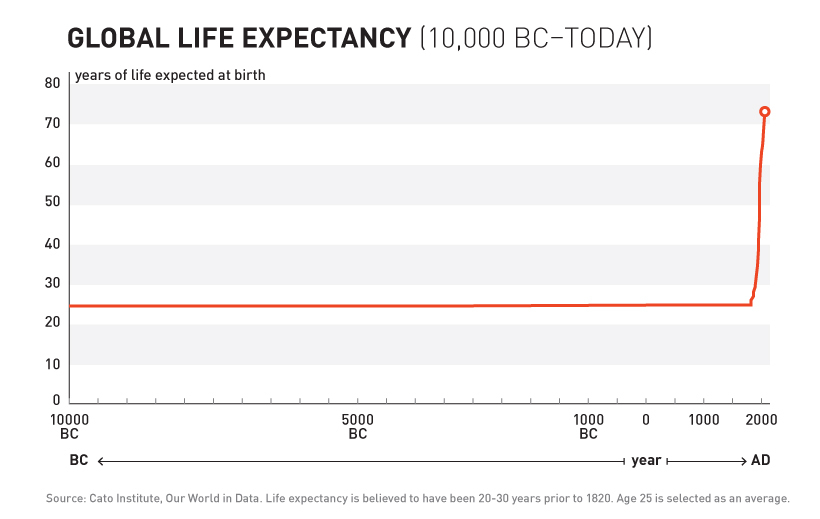
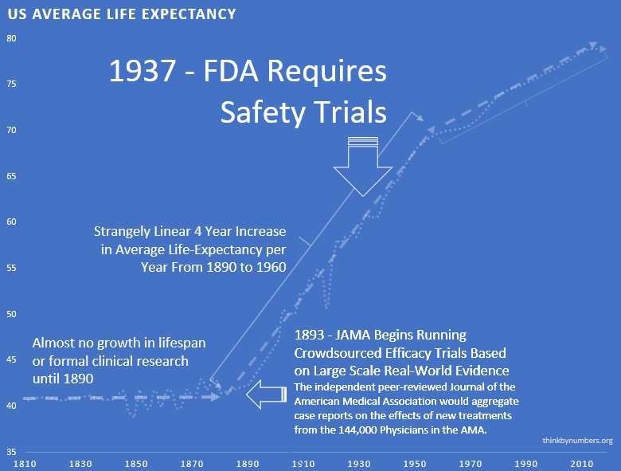
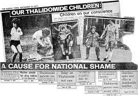
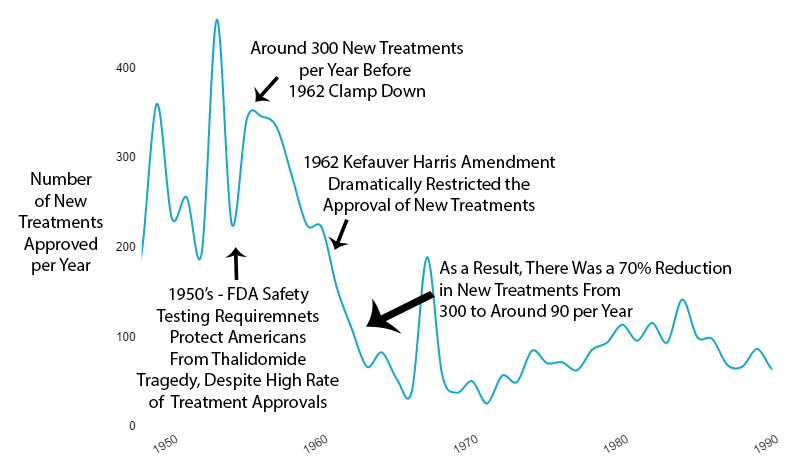
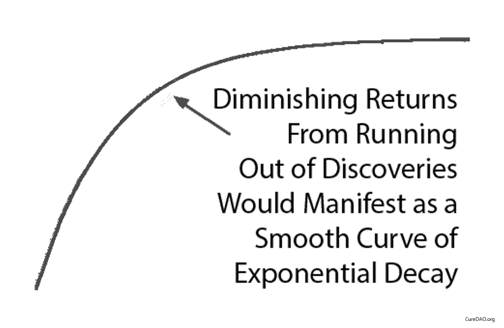



## Historical Evidence: Why Real-World Evidence Works Better

Large-scale efficacy trials based on real-world evidence produce better health outcomes. They beat current pharmaceutical industry-driven randomized controlled trials.

### 10,000 Years of Dying at 30

For over 99% of human history, average life expectancy was 30 years [@historical-life-expectancy-30-years].

Ancient Rome: 30 years.
Medieval Europe: 30 years.
Renaissance: Still 30 years.

Kings, peasants, philosophers, farmers - everyone died embarrassingly young.

10,000 years. Zero progress.

### 1883 – The Year You Figured It Out

Then something changed.

In 1883, doctors founded the Journal of the American Medical Association (JAMA) [@jama-founded-1893]. They did something novel: they shared information. After 10,000 years someone thought "what if we told each other what works?"

** physicians** across America (see reference [@pre-1962-physician-trials]) tried treatments on real patients. They wrote down what happened. "This drug helped." "This drug killed the patient." "This drug did nothing but made the patient smell funny."

Leading experts reviewed these case reports. They compiled them into studies and published results. If a medicine worked and didn't kill people, JAMA gave it a seal of approval.

Crowdsourced, observational, objective, peer-reviewed clinical research. And it worked.

### The Result

After 10,000 years of zero progress, life expectancy suddenly shot up. It increased by 3.82 years every decade [@life-expectancy-increase-pre-1962] (calculated from 1880-1960 data). For 80 years straight.

The most linear relationship in medical history. Suspiciously perfect. It lasted from 1883 to 1960.

### 1938 – The FDA Requires Phase 1 Safety Trials

Elixir sulfanilamide killed over 100 people [@fda-the-sulfanilamide-disaster] in 1937.

Congress reacted [@wikipedia-elixir-sulfanilamide]. They required all new drugs to include:

> "adequate tests by all methods reasonably applicable to show whether or not such drug is safe for use under the conditions prescribed, recommended, or suggested in the proposed labeling thereof."

These requirements evolved into the Phase 1 Safety Trial [@phase-1-safety-trial]. This was reasonable. Test if a compound kills people before giving it to patients. Makes sense.

The 3.82 years per decade gain [@life-expectancy-increase-pre-1962] stayed the same. It held steady before and after the new safety regulations. Safety testing worked without slowing medical progress.

The regulations had no measurable impact on developing life-saving treatments. Not positive. Not negative.

### 1950s – Thalidomide: When Safety Regulations Actually Worked

Thalidomide hit European markets in 1957 [@wikipedia-thalidomide] for morning sickness. Doctors thought it was safe in pregnancy. It wasn't. It caused thousands of horrific congenital disabilities [@thalidomide-birth-defects].

Existing FDA safety regulations prevented any birth defects in the US [@thalidomide-no-us-birth-defects]. The 1938 safety framework worked as intended. Zero American babies harmed.

The safety regulations succeeded. But newspaper stories like the one below created public outcry for *more* regulation. They targeted efficacy testing.

### 1962 – The Year You Decided to Make Everything Worse

Effective **safety** regulations already existed. They worked. America had zero Thalidomide deaths. Europe had thousands. Safety testing succeeded.

So naturally, the government responded to this success by adding massive **efficacy** regulations. The 1962 Kefauver Harris Amendment [@kefauver-harris-amendment-1962] changed everything.

Safety testing wasn't the problem. That worked fine. The problem? They took efficacy testing away from  independent doctors. They gave it to drug companies. It got  times more expensive. It got  times slower.

#### What Changed

Before 1962:

- Drug companies spent **** (inflation-adjusted) to prove safety (see reference [@pre-1962-drug-costs-timeline])
- Once the FDA approved a drug as safe, ** independent doctors tested efficacy** on real patients (see reference [@pre-1962-physician-trials])
- The AMA compiled results and published findings

After 1962:

- The FDA took over efficacy testing
- They made the old system illegal [@kefauver-harris-amendment-1962]
- They required small, controlled trials run by... the drug companies themselves

The irony: Regulations meant to ensure drugs work did this by:

1. Banning large real-world trials
2. Requiring small artificial trials
3. Letting drug companies run their own tests

#### What Happened to Efficacy Data

The 1962 regulations were about ensuring efficacy. They massively reduced the quantity and quality of efficacy data:

- **Trials Got Smaller**: Fewer patients, less data
- **Patients Got Less Representative**: They excluded sick people, old people, and people with other conditions. (You know, the people who actually need medicine.)
- **Conflicts of Interest Exploded**: Drug companies ran their own trials. Independent doctors lost control.

#### What Happened to New Treatments

The new regulations immediately **reduced new drug approvals by ** (see reference [@post-1962-drug-approval-drop]).

Not gradually. Immediately.

#### What Happened to Costs

Since 1962, the cost of bringing a new treatment to market exploded. It went from ** to over $1 billion** [@parliament-4207] (inflation-adjusted).

A  increase. For worse results.



#### What Happened to Drug Patents

The new regulations created massive delays. The pharmaceutical industry complained about a "drug lag."

Congress "fixed" this by extending drug patent monopolies [@drug-price-competition-act-1984] in 1984.

Kefauver's amendments aimed to make drugs safer and cheaper. Instead they made them:

- More dangerous (smaller trials, less real-world data to spot dangerous side effects)
- More expensive (monopolies extended)
- Less available ( fewer approvals)

#### Decreased Ability to Determine Comparative Efficacy

The placebo-controlled randomized controlled trial helped gauge individual drug efficacy. But it makes comparative effectiveness harder to judge.

### What Happened to Life Expectancy (The Part That Matters)

Remember that suspiciously linear 3.82-year increase [@life-expectancy-increase-pre-1962] every decade from 1883 to 1960?

Here's what happened in 1962:

It strangely quickly dropped by 60% [@post-1962-life-expectancy-slowdown]. To 1.54 years per decade.

From 1880 to 1960: 3.82 years per decade [@life-expectancy-increase-pre-1962].

From 1962 onward: 1.54 years per decade [@post-1962-life-expectancy-slowdown].

The break is so clean. You can see the exact year Congress decided to "help."

### The "Diminishing Returns" Excuse

Some claim "diminishing returns explain the slowdown."

Diminishing returns produce a smooth curve. It flattens over time.

This isn't what happened.

What happened was a straight line. It instantly changed slope in 1962 when the regulations changed.

Diminishing returns don't produce sudden linear breaks. Regulatory changes do.

### The "Correlation Is Not Causation" Excuse

True. Correlation alone proves nothing.

But correlation + mechanism + temporal precision is how science works.

Here's what you have:

1. **Temporal correlation**: Life expectancy growth dropped by half right after 1962 regulations
2. **Mechanism**: Regulations reduced new treatments by . They increased costs . They banned real-world efficacy trials.
3. **Alternative explanations**: Yes, they exist (increasing disease complexity, higher safety standards). But the timing, magnitude, and linearity of the slope change all point to one event: the 1962 regulations. Other causes would produce gradual change, not a clean break.

This is how clinical trials work. Temporal correlation + mechanism of action = inference of causation.

If you don't trust this method, you can't trust any clinical research. Or science generally.

### Impact of Innovative Medicines on Life Expectancy

A three-way fixed-effects analysis [@three-way-fixed-effects-analysis] studied 66 diseases in 27 countries. Without new drugs launched after 1981, people would have lost 2.16 times more years of life. The cost? $2,837 per life-year saved [@three-way-fixed-effects-analysis].

More treatments lead to more survivors. There's a [strong correlation](http://valueofinnovation.org/power-of-innovation) between new cancer treatments and cancer survival over 30 years.

## The Summary

- 10,000 years: Zero progress
- 1880-1960: Decentralized real-world trials, 3.82 years/decade progress [@life-expectancy-increase-pre-1962]
- 1962: Kefauver-Harris passes. Progress drops 60% [@post-1962-life-expectancy-slowdown] to 1.54 years/decade
- Today: Still stuck with the broken system

Humanity solved medical progress in 1883. Congress broke it in 1962.

