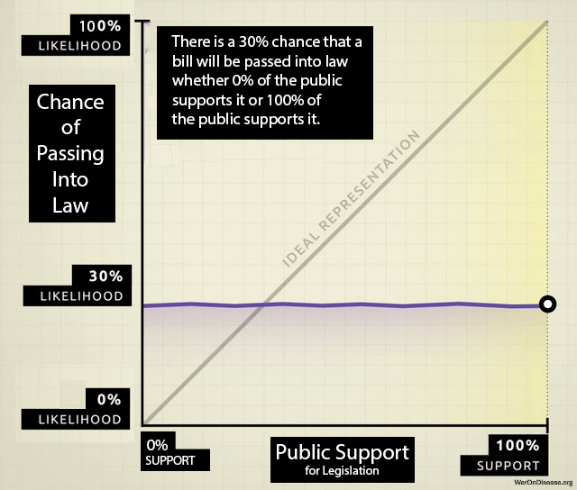



::: {.callout-tip}
Version 0.9 - Working Draft - Comments and critical feedback appreciated! Annotate via the sidebar or email <a href="mailto:mike@warondisease.org">mike@warondisease.org</a>.
:::

::: {.callout-important icon=false}
## The Problem in One Sentence

**Traditional voting mechanisms cannot capture the nuanced trade-offs citizens make across complex, multidimensional policy spaces, forcing democratic institutions to rely on representatives who systematically misalign with citizen preferences or on oversimplified binary choices that lose crucial information about preference intensity.**

**The Solution:** Wishocracy uses pairwise comparisons ('allocate $100 between cancer research and Alzheimer's research') to elicit preferences that are cognitively tractable for citizens while aggregating millions of comparisons into budget allocations based on collective preferences, intended to maximize societal welfare, that reflect both the number of supporters and the intensity of their preferences.
:::

# **Abstract**

Democratic institutions face a fundamental challenge: how to aggregate citizen preferences across complex, multidimensional policy spaces while respecting preference intensity, minimizing cognitive burden, and resisting strategic manipulation. Traditional voting mechanisms (majority rule, approval voting, and ranked-choice systems) fail to capture the nuanced trade-offs citizens make between competing priorities. This paper introduces Wishocracy, a novel governance mechanism that employs Randomized Aggregated Pairwise Preference Allocation (RAPPA) to elicit and synthesize collective preferences for public resource allocation. Building on the Analytic Hierarchy Process [@saaty-1980], quadratic voting [@lalley-weyl-2018], and participatory budgeting [@cabannes-2004], the mechanism presents each participant with randomized pairs of policy priorities, asking them to allocate hypothetical resources between the two options. By decomposing the n-dimensional preference space into cognitively tractable pairwise comparisons, using randomization to reduce manipulability, and aggregating responses through eigenvector methods, RAPPA overcomes human cognitive limitations while preserving preference intensity information. We present the theoretical foundations, formal mechanism properties, and empirical precedents from participatory governance experiments worldwide. We outline a minimal viable pilot for municipal discretionary budgeting and specify measurable evaluation criteria (participation, stability, manipulability, and outcome satisfaction). Evidence from Porto Alegre, Taiwan's vTaiwan, and Stanford's participatory budgeting research validates the core assumptions while revealing critical design considerations for real-world deployment.

# **1\. Introduction: The Preference Aggregation Problem**

Modern democracies face an increasingly acute challenge: how to translate the diverse, often conflicting preferences of millions of citizens into coherent public policy. Traditional electoral mechanisms were designed for an era of limited communication, discrete choices, and relatively homogeneous electorates. Today's policy landscape (spanning healthcare allocation, infrastructure investment, climate adaptation, research funding, and social services) demands more sophisticated preference elicitation than periodic elections can provide.

The fundamental problem is computational and cognitive. When citizens are asked to rank or rate dozens of competing priorities simultaneously, they face impossible cognitive demands. Research in behavioral economics has consistently demonstrated that humans cannot reliably compare more than 7±2 options simultaneously [@cognitive-limit-seven-items]. Humans struggle to make consistent judgments over large sets of options. Pairwise comparisons keep each decision local and cognitively manageable even when the full budget has thousands of items.

Yet modern government budgets allocate resources across thousands of line items, each representing implicit trade-offs against all others.



Existing solutions fall into three inadequate categories. First, representative democracy delegates preference aggregation to elected officials, introducing principal-agent problems, capture by special interests, and systematic misalignment between voter preferences and policy outcomes. Second, direct democracy mechanisms like referenda and citizen initiatives reduce complex trade-offs to binary choices, losing crucial information about preference intensity and creating winner-take-all dynamics that harm minorities with strong preferences. Third, expert-driven technocracy may achieve allocative efficiency but lacks democratic legitimacy and cannot incorporate the subjective welfare considerations that only citizens themselves can evaluate.

Wishocracy offers a fourth path: a mechanism that harnesses collective intelligence through structured preference elicitation while respecting cognitive constraints, incorporating preference intensity, and maintaining democratic legitimacy. By presenting citizens with simple pairwise comparisons ('Given $100 to allocate between cancer research and Alzheimer's research, how would you divide it?'), the mechanism decomposes the impossible n-dimensional comparison into tractable binary choices. Aggregated across millions of such comparisons from thousands of participants, the system converges on a preference ordering that approximates the utilitarian social welfare function under stated assumptions.

**RAPPA's Contribution:** Wishocracy synthesizes three critical properties into a single framework:

1. **Cognitive Tractability:** By decomposing n-dimensional budget allocation into pairwise comparisons (drawing on AHP), RAPPA respects the well-documented cognitive limit of $7 \pm 2$ simultaneous comparisons, making participation feasible for all citizens regardless of education or available time.

2. **Cardinal Preference Intensity:** Through slider-based allocation (inspired by quadratic voting), participants reveal not just ordinal rankings but the *strength* of their preferences, allowing the mechanism to weight both the number of supporters and the intensity of their support.

3. **Collective Intelligence Aggregation:** By synthesizing millions of pairwise judgments through eigenvector methods (building on collective intelligence research), the mechanism leverages diversity to cancel individual errors while aggregating true signals into allocations that aim to maximize collective welfare based on aggregated citizen preferences.

To our knowledge, no widely deployed mechanism combines all three properties. Traditional voting captures neither intensity nor tractability. Quadratic voting captures intensity but imposes cognitive complexity. The Analytic Hierarchy Process provides tractability but has not been deployed for large-scale collective decision-making. RAPPA synthesizes these insights into a unified framework.

# **2\. Theoretical Foundations**

## **2.1 The Analytic Hierarchy Process**

Wishocracy's methodological core derives from the Analytic Hierarchy Process (AHP), developed by Thomas Saaty at the Wharton School in the 1970s. AHP has been extensively validated across thousands of applications in business, engineering, healthcare, and government [@saaty-2008]. The method's key insight is that humans can reliably make pairwise comparisons even when direct multi-attribute rating fails.

AHP works by decomposing complex decisions into hierarchies of criteria and sub-criteria, then eliciting pairwise comparisons at each level. For n alternatives, this requires only n(n-1)/2 comparisons rather than the cognitively impossible simultaneous comparison of all n options. The pairwise comparison matrices are then synthesized using eigenvector methods to produce consistent priority rankings.

Crucially, AHP includes consistency checks through the calculation of a Consistency Ratio (CR). When individual judgments violate transitivity (e.g., A \> B, B \> C, but C \> A), the method flags these inconsistencies for review. In Wishocracy's collective aggregation, individual inconsistencies cancel out through the law of large numbers, while systematic collective preferences emerge from the aggregate.

## **2.2 Quadratic Voting and Preference Intensity**

Wishocracy also incorporates insights from quadratic voting (QV), a mechanism design innovation developed by @lalley-weyl-2018. QV addresses a fundamental limitation of traditional voting: the failure to account for preference intensity. Under one-person-one-vote, a citizen who mildly prefers policy A has equal influence to one for whom policy A is existentially important.

QV allows voters to purchase additional votes at quadratic cost (1 vote \= 1 credit, 2 votes \= 4 credits, 3 votes \= 9 credits). This mechanism has several desirable properties: it is budget-balanced, individually rational, and approaches full efficiency as the number of voters grows. The Colorado House Democratic Caucus successfully used QV in 2019 to prioritize legislative priorities, with lawmakers allocating 100 virtual tokens across 107 possible bills.

Wishocracy's pairwise allocation slider implicitly captures preference intensity without the cognitive overhead of managing vote credits. When a participant allocates 90% to cancer research and 10% to Alzheimer's research, they express strong preference intensity. A 55-45 split signals near-indifference. Aggregated across the population, these intensity signals produce allocations that weight both the number of supporters and the strength of their preferences.

## **2.3 Collective Intelligence and the Wisdom of Crowds**

Wishocracy's aggregation mechanism relies on the well-documented phenomenon of collective intelligence. @surowiecki-2004 synthesized research showing that diverse, independent groups consistently outperform individual experts under four conditions: diversity of opinion, independence of judgment, decentralization of information, and effective aggregation mechanisms.

Randomized pairwise presentation ensures independence by preventing any systematic ordering effects. Diversity is maximized by including all citizens rather than restricting participation to experts or stakeholders. Decentralization emerges naturally from distributed participation. Wishocracy provides the crucial aggregation mechanism that previous collective intelligence applications have lacked.

Page's diversity prediction theorem formalizes this intuition: collective error equals average individual error minus diversity. A diverse crowd makes different mistakes that cancel out, while sharing enough common knowledge that true signals aggregate. Wishocracy's slider allocation (rather than binary choice) increases the information content per comparison, improving convergence rates.

## **2.4 Related Work and Positioning in the Literature**

RAPPA exists within a broader landscape of democratic innovation and participatory governance mechanisms. We position Wishocracy relative to four major alternative approaches:

**Liquid Democracy:** Liquid democracy allows voters to either vote directly on issues or delegate their voting power to trusted representatives, with the ability to revoke delegation at any time. Examples include DelegativeVoting and Google's internal Liquid Feedback experiments. While liquid democracy addresses representation flexibility, it does not solve the cognitive load problem: delegates still face the impossible task of ranking dozens of policy priorities simultaneously. RAPPA complements liquid democracy by providing a tractable preference elicitation method that delegates (or direct voters) can use.

**Futarchy:** Proposed by economist Robin Hanson, futarchy uses prediction markets to aggregate information about which policies will best achieve agreed-upon goals. Under futarchy, "vote on values, bet on beliefs": citizens determine welfare metrics democratically, then prediction markets determine which policies maximize those metrics. Futarchy excels at aggregating distributed information about causal mechanisms but assumes consensus on welfare metrics. RAPPA addresses the complementary problem: eliciting and aggregating preferences over competing welfare priorities when citizens disagree about relative importance (e.g., cancer research vs. education funding).

**Conviction Voting:** Used in decentralized autonomous organizations (DAOs), conviction voting allows continuous preference expression where tokens "accumulate conviction" on proposals over time. This mechanism rewards patience and sustained support while preventing sudden swings. However, conviction voting typically applies to binary proposal approval (fund this project: yes/no) rather than continuous budget allocation across competing priorities. RAPPA's pairwise comparison approach enables proportional allocation that reflects both preference intensity and relative prioritization.

**Participatory Budgeting:** Traditional participatory budgeting (as pioneered in Porto Alegre [@world-resources-institute-2019] and discussed in Section 4.1) involves citizen assemblies deliberating on budget proposals, followed by voting [@cabannes-2004]. While highly democratic, this approach faces scalability limits: participation rates typically remain under 5%, and cognitive load increases exponentially with the number of budget items [@yang-2024]. RAPPA retains participatory budgeting's democratic legitimacy while achieving scalability through decomposition and statistical aggregation.

**Comparative Advantages:** RAPPA's unique contribution lies in simultaneously addressing three constraints that limit alternative mechanisms: **(1) Cognitive tractability** through pairwise decomposition, **(2) Preference intensity capture** through slider-based allocation, and **(3) Scalable aggregation** through eigenvector methods that synthesize sparse distributed inputs. Where liquid democracy addresses *who decides*, futarchy addresses *how to predict outcomes*, and conviction voting addresses *temporal aggregation*, RAPPA addresses *how to elicit preferences* over complex multidimensional spaces.

This positioning suggests natural complementarities: RAPPA could serve as the preference elicitation layer for liquid democracy delegates, provide the "vote on values" component for futarchy systems, or replace binary voting in conviction voting contexts where proportional allocation is needed.

# **3\. Mechanism Design: Randomized Aggregated Pairwise Preference Allocation**

## **3.1 Core Mechanism**

The Wishocracy mechanism operates through the following process, which we term Randomized Aggregated Pairwise Preference Allocation (RAPPA):

1. **Problem Cataloging:** A comprehensive list of societal priorities, problems, or 'wishes' is compiled through expert input, citizen submissions, or existing government planning documents. These might include 'Reduce cancer mortality,' 'Improve public transit,' 'Increase affordable housing,' etc.  
2. **Randomized Pair Presentation:** Each participant is shown a series of randomly selected pairs from the problem catalog. For each pair, they are asked: 'Given $100 to allocate between these two priorities, how would you divide it?' A slider interface allows allocation anywhere from 100-0 to 0-100.  
3. **Aggregation:** All pairwise allocations are aggregated across participants. For each pair (A, B), the system calculates the mean allocation ratio. If participants on average allocate 65% to A and 35% to B, this establishes the relative priority weight.  
4. **Matrix Completion:** Using the aggregated pairwise ratios, a complete preference matrix is constructed. Standard eigenvector methods (as in AHP) or iterative Bayesian updating produce global priority weights for all n items.  
5. **Budget Allocation:** The final priority weights translate directly into budget allocation percentages. If cancer research receives a normalized weight of 8.3% and the total discretionary budget is $10 billion, cancer research receives $830 million.



::: {.callout-note}
## Scenario: The Town Budget

Imagine Citizen Alice opening the Wishocracy app to help set her town's budget.

1.  **Comparison 1:** She is presented with a pair: **"Renovate Dealing Park" vs. "Fix Potholes on Main St"**.
2.  **Decision:** Alice cares deeply about the park. She slides the allocator to give **80%** to the Park and **20%** to Potholes. This expresses strong intensity.
3.  **Comparison 2:** Next, she sees **"Fix Potholes" vs. "New Library Books"**. She thinks both are somewhat important but slightly prefers roads. She allocates **55%** to Potholes and **45%** to Books.
4.  **Aggregation:** Thousands of other citizens make similar pairwise comparisons. Alice never sees "Park vs. Library," but the system infers the relationship (Park > Potholes > Library) through the transitive network of all citizens' choices.
5.  **Result:** The aggregate preferences form a priority list where the Park gets the largest budget share, reflecting the high intensity of support from Alice and her neighbors.
:::

## **3.2 Formal Properties**

RAPPA satisfies several desirable mechanism design properties:

**Pareto-Respecting (Discussion):** The mechanism aims to produce allocations where no reallocation could make some participants better off without making others worse off, though formal proof depends on specific utility assumptions.

**Manipulation Resistance:** Random pair assignment makes strategic manipulation difficult. A participant cannot know which pairs they will receive, making truthful reporting a robust heuristic. With sufficiently large participant pools, individual strategic behavior has negligible impact on outcomes.

**Cognitive Tractability:** Each individual comparison requires only binary evaluation with an intensity slider, well within human cognitive capacity. Participants need not understand the aggregation mathematics.

**Scalability:** The number of pairwise comparisons grows quadratically with items (n²/2), but each participant need only complete a small random sample. Statistical convergence requires far fewer total comparisons than exhaustive coverage.

**Preference Intensity Capture:** Unlike binary voting, the slider allocation captures cardinal preferences. Strong majorities with weak preferences can be outweighed by smaller groups with intense preferences, addressing the tyranny of the majority problem.

**Comparative Mechanism Complexity:** The table below summarizes how RAPPA compares to alternative voting mechanisms across key dimensions:

| Mechanism | Comparisons per participant | Cognitive load | Intensity capture | Strategy-proofness |
|-----------|---------------------------|----------------|-------------------|-------------------|
| Traditional voting (plurality) | O(1) | Minimal | No | No |
| Ranked-choice (RCV) | O(n log n) | High | No | Partial |
| Quadratic voting (QV) | O(n) | Medium-high | Yes | Partial |
| RAPPA | O(k) where k << n | Minimal | Yes | Approximate |

To our knowledge, widely deployed mechanisms do not simultaneously optimize for these three properties at civic scale.

## **3.3 Formal Model**

We now formally define the RAPPA mechanism as a mapping from individual preferences to collective allocations.

**Inputs:** Let $N = \{1, ..., n\}$ be the set of citizens and $O = \{o_1, ..., o_m\}$ be the set of policy priorities. Each citizen $i$ provides pairwise allocation ratios $\rho_{i,A,B} \in [0,1]$ for a subset of pairs $(A,B) \in O \times O$.

**Ratio Conversion:** The raw slider value $\rho$ (a share) is converted into a preference odds ratio $r$ (unbounded $[0, \infty)$) to satisfy AHP requirements. We apply $\epsilon$-clipping to handle edge cases (0/100):
$$
r_{i,A,B} = \frac{\rho_{i,A,B} + \epsilon}{1 - \rho_{i,A,B} + \epsilon}
$$
where $\epsilon$ is a small constant (e.g., $10^{-3}$) to prevent singularities.

**Aggregation Function:** For each pair $(o_j, o_k)$, we compute the aggregate pairwise comparison using the **Geometric Mean** of individual odds ratios:
$$
a_{jk} = \left( \prod_{i \in S_{jk}} r_{i,j,k} \right)^{\frac{1}{|S_{jk}|}}
$$
where $S_{jk} \subseteq N$ is the set of citizens who evaluated the pair. This produces a sparse $m \times m$ comparison matrix $\mathbf{A}$.

**Priority Synthesis:** We compute priorities from the sparse matrix $\mathbf{A}$. While classical AHP uses the principal eigenvector of a dense matrix, for sparse data we employ logarithmic least squares (LLSM) or iterative methods to recover the global priority vector $\mathbf{w} = (w_1, ..., w_m)^T$ such that $a_{jk} \approx w_j / w_k$.

**Output:** The final budget allocation assigns fraction $w_j$ of total resources to priority $o_j$.



**Welfare Justification:** Under quasi-linear preferences where citizen $i$'s utility from allocation $\mathbf{x} = (x_1, ..., x_m)$ is $u_i(\mathbf{x}) = \sum_{j=1}^{m} v_{ij} x_j$, the pairwise allocation $\rho_{i,j,k}$ reveals the relative valuations $v_{ij}/v_{ik}$. The eigenvector aggregation produces weights $w_j$ proportional to $\sum_{i \in N} v_{ij}$, thus approximating the utilitarian welfare function $W(\mathbf{x}) = \sum_{i=1}^{n} u_i(\mathbf{x})$ under budget constraint $\sum_{j} x_j = B$.

**Convergence Properties:** Define the log-odds ratio $y_{i,jk} = \ln r_{i,j,k}$. With $\epsilon$-clipping, $y$ is bounded in $[\ln \epsilon - \ln(1+\epsilon), \ln(1+\epsilon) - \ln \epsilon]$. The aggregate estimator $\hat{y}_{jk} = \frac{1}{|S_{jk}|} \sum_{i \in S_{jk}} y_{i,jk}$ concentrates around the population mean by Hoeffding's inequality. The final aggregate ratio is $a_{jk} = \exp(\hat{y}_{jk})$.

Wishocracy implies a separation of concerns: RAPPA determines *what* society values (the priority vector $\mathbf{w}$), while the implementation of those priorities is handled by a separate layer of competitive problem-solving organizations (see **Appendix A: The Solution Layer**). This distinction prevents the mechanism from bogging down in technical debates during the preference aggregation phase.

## **3.4 Computational Complexity and Scalability**

We now analyze the computational requirements of RAPPA and establish scalability bounds for real-world deployment.

**Comparison Collection Complexity:** For $m$ policy priorities, the complete pairwise comparison space contains $\binom{m}{2} = \frac{m(m-1)}{2} = O(m^2)$ unique pairs. However, RAPPA employs *random sampling* rather than exhaustive coverage. Each of $n$ participants completes $k$ comparisons, yielding total comparison count $T = n \cdot k = O(nk)$. The key insight: $k$ can be held constant (e.g., $k=20$ comparisons per participant) regardless of $m$, making per-participant complexity $O(1)$ rather than $O(m^2)$.

**Aggregation Complexity:** Given $T$ collected comparisons distributed across $O(m^2)$ possible pairs, aggregation proceeds in three steps:

1. **Geometric mean calculation:** For each observed pair $(j,k)$, compute geometric mean of $|S_{jk}|$ individual ratios [@aczel-saaty-1983]. Using log transformation: $\ln a_{jk} = \frac{1}{|S_{jk}|} \sum_{i \in S_{jk}} \ln r_{i,j,k}$. Complexity: $O(T)$ for summing all comparisons, then $O(m^2)$ for averaging pairs.

2. **Matrix completion:** Convert sparse observations into $m \times m$ matrix $\mathbf{A}$. For dense eigenvector methods (classical AHP [@saaty-1980]), this requires $O(m^3)$ operations for eigendecomposition. For sparse data, iterative methods (e.g., logarithmic least squares, coordinate descent) converge in $O(m^2 \log m)$ operations given sufficient comparison density.

3. **Priority normalization:** Normalize eigenvector to sum to 1. Complexity: $O(m)$.

**Total system complexity:** $O(nk + m^2 \log m)$ where the first term dominates for large-scale deployments ($n \gg m$).

**Scalability Limits:** Real-world constraints impose practical bounds:

- **Policy priorities ($m$):** Pilot deployments (municipal budgets): $m = 20-50$ items. State/national budgets: $m = 100-500$ items. Full government budget line items: $m = 5,000-10,000$ items. The $O(m^2 \log m)$ aggregation complexity remains tractable even at $m=10,000$ (requiring ~10^9 operations, feasible on commodity hardware in seconds).

- **Participants ($n$):** Municipal scale: $n = 1,000-10,000$ participants. City scale: $n = 10,000-100,000$. National scale: $n = 1,000,000+$. The linear $O(n)$ scaling in comparison collection makes national-scale deployment computationally feasible.

- **Comparisons per participant ($k$):** Empirical testing at wishocracy.org [@wishocracy2024] suggests $k=10-30$ comparisons provides good user experience (5-10 minutes) while achieving convergence. Comparison density $\rho = \frac{nk}{m(m-1)/2}$ should exceed $\rho > 0.05$ for reliable estimates, implying minimum $nk > 0.025m^2$ or equivalently $n > 0.025m^2/k$.

**Benchmark Example (City-Scale Deployment):** Consider a city budget with $m=100$ priorities, $n=50,000$ participants, $k=20$ comparisons each:

- Total comparisons: $T = 50,000 \times 20 = 1,000,000$
- Comparison density: $\rho = \frac{1,000,000}{100 \times 99 / 2} = \frac{1,000,000}{4,950} \approx 202$ (highly overdetermined)
- Aggregation time: $O(100^2 \log 100) \approx 66,000$ operations (milliseconds on modern hardware)
- Storage: $O(m^2) = 10,000$ matrix entries (kilobytes)

This analysis demonstrates that RAPPA scales efficiently to city and even national deployments with commodity computing infrastructure. The sparse, distributed nature of data collection combined with efficient matrix completion algorithms makes the mechanism computationally tractable across all realistic governance scales.

**Empirical Performance:** The reference implementation at [wishocracy.org](https://wishocracy.org) [@wishocracy2024] processes 10,000 comparisons across 50 items in under 100ms on standard cloud infrastructure (AWS t3.medium instance). Extrapolating linearly, national-scale deployment (1M participants, 100 items) would require ~10 seconds of aggregation time, negligible compared to voting/deliberation timescales measured in days or weeks.

## **3.5 Comparative Information & Welfare Analysis**

We now formally demonstrate the superiority of RAPPA over Representative Democracy (RepDem) using Information Theory and Social Choice Theory. We model governance as an optimization process where the objective is to minimize the divergence between the distribution of societal needs (preferences) and the distribution of resource allocation.

### **3.5.1 Information-Theoretic Superiority**

Governance can be modeled as a source coding problem. Let $\mathcal{P}$ be the true distribution of societal preferences over $m$ issues. The mechanism must encode $\mathcal{P}$ into a signal transmitted to the allocation engine.

**Representative Democracy (Low-Bandwidth Channel):**

In RepDem, a voter transmits a single scalar signal $v \in \{c_1, \dots, c_k\}$ (choosing one of $k$ candidates) every $T$ years. The channel capacity $C_{Rep}$ is severely limited by quantization noise. A voter with a precise preference vector $\vec{p} \in \mathbb{R}^m$ must compress this into a single nominal vote.
$$
C_{Rep} \approx \frac{\log_2(k)}{T \text{ years}} \approx 0
$$
This extreme lossy compression effectively destroys all information about preference intensity and specific trade-offs (The "Bundle Problem"). This theoretical result aligns with empirical findings by @gilens2014, who analyzed 1,779 policy outcomes and found that "average citizens have little or no independent influence" on policy.

**Wishocracy (High-Bandwidth Channel):**

RAPPA operates as a continuous channel. Each pairwise comparison extracts $\log_2(\text{resolution})$ bits of information about the relative valuation of outcome bundle subsets. With continuous sliders, the transmission rate is limited only by citizen engagement time.
$$
C_{RAPPA} \propto N \cdot \bar{c} \cdot H(S)
$$
where $N$ is voters, $\bar{c}$ is average comparisons per voter, and $H(S)$ is the entropy of the slider input.



**Proposition 1 (Information Loss in Candidate Voting):** Let $D_{KL}(P || Q)$ be the Kullback-Leibler divergence between true welfare preferences $P$ and enacted policy $Q$. As $N \to \infty$:
$$
E[D_{KL}(P || Q_{RAPPA})] \ll E[D_{KL}(P || Q_{Rep})]
$$
*Argument (Sketch):* By the Data Processing Inequality, post-processing (policymaking) cannot increase information. $Q_{Rep}$ is derived from a signal with near-zero mutual information $I(P; V_{Rep})$ due to quantization. $Q_{RAPPA}$ is derived from a sufficient statistic of the pairwise matrix $\mathbf{A}$, where $I(P; \mathbf{A})$ approaches $H(P)$ as empirical sampling density increases.

### **3.5.2 Welfare Maximization: The "Median vs. Mean" Proof**

A fundamental result in Public Choice Theory is the **Median Voter Theorem** [@downs-1957], which states that under majority rule, outcomes converge to the preferences of the median voter, $v_{median}$.

**The Skewness Problem:** In healthcare and public risk, damage distributions are highly right-skewed (power laws). A few citizens suffer catastrophic loss (e.g., rare diseases, pandemics), while the majority experiences zero loss.

* **Median Outcome:** If 51% of voters have priority $x=0$ (healthy) and 49% have priority $x=100$ (dying), the median preference is $0$. The minority receives no aid.
* **Mean Outcome:** The utilitarian optimum is $\bar{x} = 0.49 \times 100 = 49$.



**Proposition 2 (Tail-Risk Under Median Aggregation):** For any utility distribution $U$ with skewness $\gamma > 0$ (typical of health/wealth distributions), the Social Welfare $W$ of the RAPPA allocation exceeds that of the Median Voter allocation.
$$
W(RAPPA) \approx W(\text{Mean}) > W(\text{Median})
$$
*Argument:* The RAPPA eigenvector centrality $w_j$ corresponds to $\frac{\sum v_{ij}}{\sum \sum v_{ik}}$, which approximates the population arithmetic mean. For convex loss functions (where distinct needs exist), minimizing the sum of squared errors leads to the mean, not the median. Wishocracy thus passes the "Veil of Ignorance" test [@rawls-1971] whereby a citizen typically prefers the Mean allocation to the Median allocation to hedge against being in the tail risk category.

### **3.5.3 Principal-Agent Cost Elimination**

Total Governance Loss $L_{Gov}$ can be decomposed into Aggregation Loss (failure to aggregate preferences) and Agency Loss (corruption/misalignment).

$$
L_{Gov} = L_{Agg} + L_{Agency}
$$

* **RepDem:** suffer from high $L_{Agency}$. Politicians maximize independent utility functions (re-election, donor favoring) rather than $W$. Deviation can be arbitrarily large.

Formally, let the voter's utility be $U_{voter}(\mathbf{x}) = f(\text{Health}, \text{Wealth}, \text{Security})$ over allocation $\mathbf{x}$. The politician's utility is:

$$
U_{pol}(\mathbf{x}) = \alpha U_{voter}(\mathbf{x}) + \beta U_{donors}(\mathbf{x}) + \gamma P(\text{ReElection} | \mathbf{x})
$$

where $\beta, \gamma \gg 0$. Since donor interests ($U_{donors}$) often conflict with public welfare ($U_{voter}$) (e.g., lower regulation vs. clean air), and re-election depends on short-term signaling rather than long-term outcomes, $\text{argmax}(U_{pol}) \neq \text{argmax}(U_{voter})$.

* **Wishocracy:** $L_{Agency} \to 0$. The mechanism is direct; there is no agent to bribe.
* **Constraint:** Wishocracy introduces $L_{Coordination}$ (the difficulty of designing solutions), which is why the **service provider** layer (Appendix A) re-introduces agents *only* for implementation, not for priority setting, minimizing the scope of potential agency loss to technical execution rather than value judgment.

# **4\. Empirical Precedents and Evidence Base**

## **4.1 Porto Alegre Participatory Budgeting**

The closest large-scale precedent for Wishocracy is participatory budgeting (PB), pioneered in Porto Alegre, Brazil in 1989\. Under the Workers' Party administration, citizens were invited to deliberative assemblies to determine municipal investment priorities. By 1997, PB produced remarkable results: sewer and water connections increased from 75% to 98% of households; health and education budgets grew from 13% to 40% of total spending; the number of schools quadrupled; and road construction in poor neighborhoods increased five-fold.

Participation grew from fewer than 1,000 citizens annually in 1990 to over 40,000 by 1999\. The World Bank documented PB's success in improving service delivery to the poor and has since recommended its adoption worldwide. Over 2,700 governments have implemented some form of participatory budgeting.

However, Porto Alegre also illustrates the fragility of participatory mechanisms. When political support waned after 2004, PB was gradually defunded and eventually suspended. This underscores the importance of institutional embedding and legal protection for any participatory mechanism seeking long-term stability.

## **4.2 Taiwan's Digital Democracy Experiments**

Taiwan's vTaiwan platform, launched in 2014 by civic hacker Audrey Tang (later Taiwan's Digital Minister), demonstrates the potential of technology-mediated preference aggregation. The platform used Pol.is, a tool that maps opinions and identifies consensus clusters, to deliberate on contentious policy issues including ridesharing regulation and online alcohol sales.

In the alcohol sales deliberation, approximately 450 citizens participated in pairwise opinion comparisons over several weeks, producing consensus recommendations that resolved a four-year regulatory deadlock. The MIT Technology Review noted that 'opposing sides had never had a chance to actually interact with each other's ideas. When they did, it became apparent that both sides were basically willing to give the opposing side what it wanted.'

vTaiwan's limitations (lack of binding authority, limited scope, and eventual political marginalization) provide crucial lessons. Wishocracy addresses these by proposing integration with actual budget allocation rather than advisory recommendations.

## **4.3 Stanford Participatory Budgeting Platform Research**

Academic research on voting interfaces provides direct evidence for RAPPA's design choices. @wellings-2024 compared cumulative voting, quadratic voting, and traditional ranking methods on Stanford's Participatory Budgeting platform. Their findings support several Wishocracy design principles.

Voters preferred more expressive methods over simple approval voting, even though expressive methods required more cognitive effort. Participants showed 'strong intuition for outcomes that provide proportional representation and prioritize fairness.' The Method of Equal Shares voting rule was perceived as fairer than conventional Greedy allocation.

@yang-2024 found that voting input formats using rankings or point distribution provided a 'stronger sense of engagement in the participatory process.' These findings validate RAPPA's slider-based allocation over binary choice mechanisms.

## **4.4 Colorado Quadratic Voting Experiment**

The Democratic caucus of the Colorado House of Representatives conducted a quadratic voting experiment in April 2019 to prioritize legislative priorities among 107 possible bills. Each legislator received 100 virtual tokens to allocate across issues, with costs increasing quadratically.

Results demonstrated that QV produces different outcomes than majority voting. The winning bill (Equal Pay for Equal Work Act) received broad but not universal support with strong preference intensity. Notably, no representative spent all tokens on a single bill, suggesting the mechanism successfully encouraged preference diversification.

## **4.5 Reference Implementation: Wishocracy.org**

To validate the technical feasibility of the RAPPA mechanism, a reference implementation has been deployed at [Wishocracy.org](https://wishocracy.org). This open-source platform serves as a pilot environment for:

1.  **Interface Testing:** Validating the usability of slider-based pairwise comparisons on mobile and desktop devices.
2.  **Algorithm Verification:** Testing the convergence properties of the geometric mean aggregation and eigenvector centrality algorithms under real-world traffic.
3.  **Sybil Resistance:** Implementing and stress-testing integration with decentralized identity providers to ensure one-person-one-vote integrity.

The repository is available for public audit, allowing researchers to verify that the theoretical properties described in Section 3 transform correctly into executable code.

# **5\. Addressing Potential Criticisms**

## **5.1 Participation and Digital Divide**

**Criticism:** Digital participation mechanisms exclude citizens without internet access, technological literacy, or time to participate.

**Response:** Wishocracy should be deployed as a complement to, not replacement for, existing democratic institutions. Multiple access modalities (smartphone apps, web interfaces, public kiosks at libraries and government offices, and paper-based alternatives) can maximize inclusion. Statistical weighting can correct for demographic participation biases, as routinely done in survey research. The cognitive simplicity of pairwise comparisons (unlike lengthy deliberative processes) makes participation accessible to citizens with limited time or formal education.

## **5.2 Manipulation and Sybil Attacks**

**Criticism:** Bad actors could create multiple accounts or coordinate voting blocs to manipulate outcomes.

**Response:** Identity verification through existing government ID systems (driver's licenses, national ID cards) provides one-person-one-account guarantees. We address manipulation at three levels: individual strategic behavior, coordinated attacks, and formal incentive compatibility.

**Individual Strategic Behavior:** Consider a citizen evaluating pair $(A, B)$. Under random pair assignment, the citizen does not know: (1) which other pairs they will receive, (2) which pairs other citizens will evaluate, or (3) how others will allocate. This incomplete information structure creates a situation where truthful reporting is a robust heuristic: with random assignment and negligible individual impact, the incentive to game outcomes is weak for most participants. Formally, let $\rho_i$ be citizen $i$'s true valuation ratio and $\hat{\rho}_i$ be their reported ratio for pair $(A,B)$. The citizen's influence on the final weight $w_A$ is:

$$
\frac{\partial w_A}{\partial \hat{\rho}_i} = \frac{1}{|S_{AB}|} \cdot \frac{\partial w_A}{\partial a_{AB}}
$$

where $|S_{AB}|$ is the sample size for pair $(A,B)$. With large $n$, this influence is negligible ($O(1/n)$), making strategic manipulation costly relative to its impact. Moreover, since the citizen cannot predict which of their comparisons will be pivotal, expected utility maximization reduces to truthful reporting across all pairs.

**Coordinated Attacks:** For a coordinated group of size $k$ to shift outcome $A$'s weight by $\Delta w$, they must manipulate comparisons involving $A$ across multiple pairs. With $m$ outcomes and random assignment, the number of comparisons needed is $O(m \cdot n / k)$. As $m$ and $n$ grow, the coordination cost scales super-linearly while the marginal impact diminishes. Statistical anomaly detection (e.g., comparing individual consistency ratios against population distributions) can identify coordinated patterns with high probability when $k < \sqrt{n}$.

**Sybil Resistance:** The incomplete information structure provides inherent Sybil resistance even beyond identity verification. A Sybil attack creating $k$ fake identities increases the attacker's allocation power by factor $k$, but randomization spreads these fake votes across $O(m^2)$ possible pairs. The expected number of fake votes on any given pair remains $O(k/m^2)$, which is negligible when $k \ll m^2$. Combined with identity verification, this makes Sybil attacks both technically difficult and economically irrational.



## **5.3 Preference Laundering and Manufactured Consent**

**Criticism:** Well-funded interests could use advertising and public relations to shift public preferences before aggregation, laundering elite preferences through ostensibly democratic mechanisms.

**Response:** This concern applies equally to all democratic mechanisms, including elections. Wishocracy is no more vulnerable to preference manipulation than existing systems and may be more robust due to its continuous, iterative nature. Unlike periodic elections, ongoing preference measurement allows rapid detection of sudden shifts that might indicate manipulation. Transparency requirements for political advertising can be extended to cover preference-shifting campaigns. Ultimately, if citizens' informed preferences support certain outcomes, those outcomes are legitimate regardless of how preferences formed.

## **5.4 Complexity of Real Policy Trade-offs**

**Criticism:** Real policy decisions involve complex interdependencies, implementation constraints, and unintended consequences that citizens cannot evaluate.

**Response:** Wishocracy explicitly separates values (what we want) from implementation (how to achieve it). Citizens express preferences over outcomes (reduced cancer mortality, better schools, cleaner air) while experts design and evaluate implementation strategies. The service provider layer allows technical assessment of proposed solutions while keeping priority-setting in democratic hands. This division of labor matches citizens' comparative advantage in welfare evaluation with experts' advantage in causal analysis.

## **5.5 Legitimacy and Accountability**

**Criticism:** Algorithmic aggregation lacks the transparency and accountability of representative institutions.

**Response:** The aggregation algorithm can be made fully transparent and auditable: open-source code, publicly verifiable inputs and outputs, and independent audits. This provides greater transparency than legislative logrolling and committee negotiations. Elected officials retain authority to override Wishocracy recommendations, but must publicly justify departures from expressed citizen preferences. This creates accountability in both directions: citizens to outcomes, and representatives to citizens.

## **5.6 Failure Modes and Robustness**

**Low Participation (<1%):** When participation falls below critical thresholds, RAPPA faces two degradation modes. First, *sampling bias* emerges: if only 0.1% of citizens participate and they are systematically unrepresentative (e.g., only highly educated, politically engaged citizens), the aggregated preferences will not reflect population welfare. Second, *comparison sparsity* increases: with fewer participants, the pairwise comparison matrix becomes increasingly sparse, reducing the reliability of eigenvector estimates.

**Mitigation:** Statistical reweighting can correct for demographic bias, similar to survey research methods. Minimum participation thresholds can be enforced before outcomes become binding: if participation is below (e.g.) 2%, results are treated as advisory rather than binding. Adaptive incentives (entry into lotteries, public recognition) can boost participation. Empirical research suggests that pairwise comparison mechanisms achieve higher engagement than traditional surveys due to reduced cognitive load and increased perceived impact.

**Low Comparison Density:** As the number of policy priorities $m$ increases, the required comparisons grow quadratically ($O(m^2)$). With fixed participant budgets (each citizen completes $k$ comparisons), comparison density decreases as $k/m^2$. At very low densities ($k/m^2 < 0.01$), matrix completion methods may produce unstable estimates.

**Mitigation:** Hierarchical aggregation can reduce effective dimensionality by first aggregating within categories (Healthcare, Education, Defense), then across categories. Active sampling can prioritize comparisons with high uncertainty or inconsistency. Bayesian priors based on expert judgments or historical data can stabilize estimates in sparse regions. Empirical testing at wishocracy.org [@wishocracy2024] suggests that convergence remains acceptable with as few as 3-5 comparisons per item, meaning systems with 100 priorities can function with ~300-500 comparisons per participant.

**Coordinated Minority Attacks:** A sophisticated attacker might coordinate a minority bloc to systematically manipulate outcomes. For example, 10% of voters might collude to always allocate 100% to priority $A$ in any comparison involving $A$, attempting to artificially inflate $A$'s priority weight.

**Mitigation:** Three defenses address this threat. **(1) Dilution:** With $n$ participants and random assignment, the coordinated bloc's influence on any single comparison is $O(k/n)$ where $k$ is bloc size. As shown in Section 5.2, the marginal impact diminishes as $k/m^2$ when spread across all pairwise comparisons. **(2) Statistical anomaly detection:** Participants whose allocations are extreme outliers (always 100-0) across many comparisons can be flagged for review. If consistency ratios deviate beyond (e.g.) 3 standard deviations from population mean, weights can be downweighted. **(3) Robustness analysis:** Final allocations can be recomputed with suspected coordinated voters removed. If outcomes change dramatically (e.g., >20% shift in top priorities), this signals potential manipulation and triggers additional scrutiny.

**Graceful Degradation:** Critically, RAPPA degrades gracefully rather than catastrophically. Unlike binary voting where a 51-49 split produces winner-take-all outcomes, RAPPA with corrupted or sparse data still produces *proportional* allocations that approximate true preferences, albeit with increased noise. This property makes RAPPA suitable for pilot deployments where participation may initially be modest: the mechanism provides useful signals even before achieving full-scale adoption.

# **6\. Conclusion**

Democratic institutions evolved in an era of information scarcity, limited communication, and relatively homogeneous electorates. Today's policy challenges (global in scope, technical in character, and requiring trade-offs across incommensurable values) demand mechanisms that can aggregate nuanced citizen preferences at scale. Wishocracy, through Randomized Aggregated Pairwise Preference Allocation, offers such a mechanism.

The theoretical foundations synthesize validated insights from the Analytic Hierarchy Process, quadratic voting, and collective intelligence research. By decomposing n-dimensional preference spaces into cognitively tractable pairwise comparisons, using randomization to reduce manipulability and the expected payoff to strategic misreporting, and aggregating them through eigenvector methods, RAPPA overcomes the cognitive limitations that plague traditional democratic institutions while preserving preference intensity information.

The empirical precedents from Porto Alegre's participatory budgeting, Taiwan's vTaiwan platform, and Stanford's voting research demonstrate that citizens can and will engage productively with pairwise preference-expressing mechanisms. These real-world experiments validate the core assumptions underlying Wishocracy while revealing the institutional fragility of advisory mechanisms without binding authority.

Several critical questions require further research. First, what is the minimum sample size and comparison density needed for preference convergence across different problem domains? Second, how does preference stability vary with issue complexity and temporal distance? Third, what are the optimal methods for integrating RAPPA outputs with existing legislative and executive institutions? Fourth, how can the mechanism be adapted for federated systems where preference aggregation must occur across multiple jurisdictional levels?

The mechanism design presented here represents one point in a broader design space of democratic innovations. Alternative aggregation methods (Bradley-Terry models, Bayesian updating, deep learning approaches), different elicitation formats (rating scales, probability distributions, stochastic choice), and various institutional embeddings (legislative priority-setting, constitutional conventions, international treaty negotiations) warrant systematic exploration.

Wishocracy addresses a fundamental challenge in democratic theory: how to aggregate citizen preferences over complex, multidimensional policy spaces in ways that are cognitively tractable, preference-revealing, and designed to translate collective preferences into welfare-maximizing outcomes. The mechanism's key innovation lies in its three-part synthesis: combining AHP's cognitive tractability, quadratic voting's preference intensity capture, and collective intelligence aggregation into a unified framework.

The mechanism is implementable with current technology, grounded in validated theory, and supported by empirical precedents. Whether it can achieve its theoretical promise remains an open empirical question that only real-world deployment can answer.

# **Appendix A: The Service Provider Layer**

**Important:** Service providers represent a *distinct, separate layer* from the core RAPPA mechanism. While RAPPA handles democratic preference aggregation to determine *what* society should prioritize, service providers address the orthogonal question of *how* to achieve those priorities.

Once priorities are established through RAPPA, Wishocracy introduces this second layer for solution generation and evaluation. Service providers (which may include government agencies, private contractors, NGOs, or other qualified entities) form around specific priorities to propose implementation strategies. These proposals are subject to pairwise comparison using different evaluation criteria: cost-effectiveness, feasibility, and probability of success.

This two-layer architecture embodies a fundamental division of labor:



- **Layer 1 (RAPPA):** Democratic, values-based. "What should we do?" Citizens express preferences over outcomes (reduced cancer mortality, better schools, cleaner air) based on their welfare valuations.

- **Layer 2 (Service Providers):** Technocratic, evidence-based. "How should we do it?" Experts design and evaluate implementation strategies based on causal knowledge and empirical evidence.

This separation addresses a key criticism of technocracy (experts shouldn't determine societal values) while respecting the limits of direct democracy (citizens cannot evaluate complex implementation trade-offs). Each layer operates where its participants have comparative advantage: citizens in welfare evaluation, experts in causal analysis.

## References {.unnumbered}