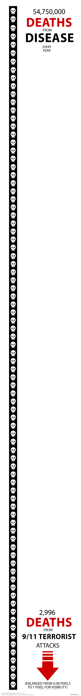
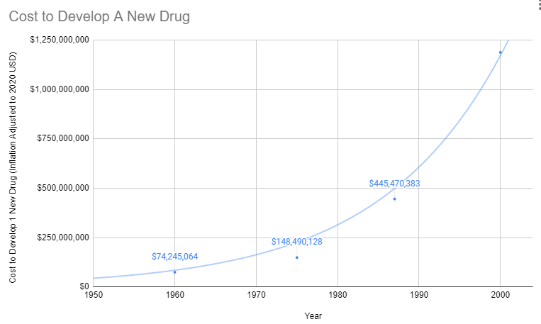
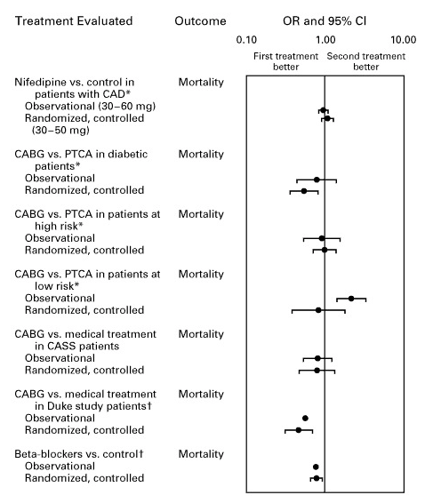
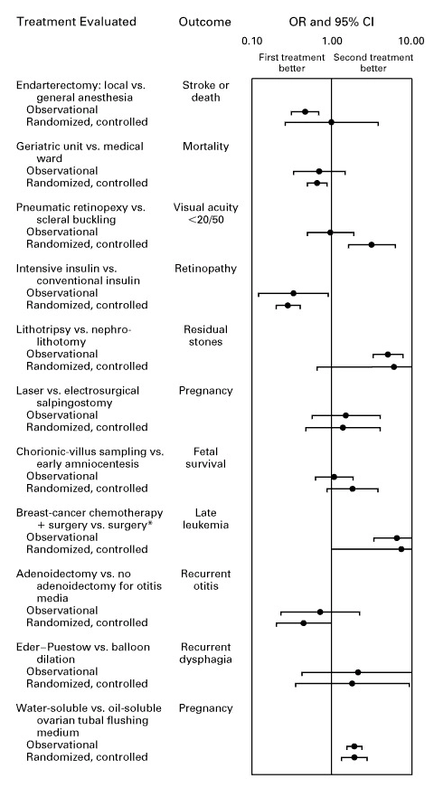



## Abstract

**The bottleneck:** Approximately  diseases lack effective treatments. At current trial capacity (~ new treatments/year), systematically testing all  plausible drug-disease combinations would take ~. Effectively never.



**The solution:** Redirecting  of global military spending (/year) to pragmatic clinical trials increases capacity × (to ~ treatments/year). Pragmatic trials cost /patient versus /patient for traditional trials, enabling vastly more parallel research. This reduces time to explore all therapeutic possibilities from ~ to ~.

**The impact:** Treatments that would have taken decades to even begin researching under the status quo get discovered and delivered decades earlier. Combined with eliminating the -year regulatory efficacy delay (via opt-in access to ubiquitous trials after Phase I safety), the average treatment reaches patients  sooner. This timeline shift saves , valued at .

**Cost-effectiveness:** /DALY via treaty advocacy (× better than bed nets) or /DALY via direct funding. ROI ranges from  (R&D savings only) to  (complete benefits). This qualifies as cost-saving: it reduces costs while improving outcomes.

**Robustness:** Even at  probability of treaty adoption, risk-adjusted cost-effectiveness (/DALY) remains × better than bed nets. Monte Carlo simulation (10,000 trials) confirms the intervention remains cost-saving across parameter uncertainty.

**Impact Mechanism:** The -year average timeline shift combines two complementary effects:

| Benefit Type | Timeline Shift | Mechanism | Impact |
|--------------|----------------|-----------|--------|
| **Efficacy Lag Elimination** |  | Offer conditional access via opt-in pragmatic trials after Phase I safety, with continuous real-world monitoring replacing Phase II/III efficacy delay | All newly discovered treatments reach patients  sooner |
| **Discovery Acceleration** |  average | Scale trial capacity × (from  to  diseases/year), enabling parallel exploration of therapeutic space | Treatments that already exist among safe compounds are discovered  earlier |
| **Combined Total** | **** | Both effects act simultaneously | **-year average timeline shift** for treatment delivery |

::: {.callout-note}
## Interpreting the -Year Timeline Figure

This is a **queue/throughput model result**, not "time travel" or a prediction that we will achieve results centuries from now:

- **What it means**: If we must test  drug-disease combinations to find all effective treatments, the current system ( treatments/year) would take ~ to clear this "queue." Scaling capacity × reduces queue clearance to ~.
- **The "" represents**: The average time a treatment that *could* be discovered today would have waited under the old system versus the new system.
- **Why it matters**: Treatments discovered sooner save lives during the intervening period. This cumulative benefit over the acceleration period yields the headline mortality and economic figures.
:::

**How the × capacity increase works:** Redirecting /year at /patient (based on ADAPTABLE trial; RECOVERY achieved /patient under exceptional NHS/COVID conditions) enables  annual trial participants vs. current , increasing trial completion rate from  to  diseases/year. This removes the primary bottleneck to medical progress: currently less than  of willing patients can access trials, and over  proven-safe compounds (FDA-approved drugs + GRAS substances) remain untested for most conditions they could improve.

**Robustness**: Even at  probability of adoption, risk-adjusted cost-effectiveness (/DALY) remains × better than bed nets. Monte Carlo simulation across 10,000 trials indicates the intervention remains cost-saving across the sensitivity ranges explored here.

**Methods**: Cost-benefit analysis, NPV calculations, QALY modeling, and ICER analysis using SIPRI military expenditure data, WHO mortality statistics, Oxford RECOVERY trial results, and published clinical trial cost literature. Conservative estimates exclude research acceleration effects; complete estimates include all quantifiable benefits. All parameters, data sources, and uncertainty ranges documented in [Parameters and Calculations](../appendix/parameters-and-calculations.qmd).

**Implications**: This intervention corrects a fundamental capital misallocation: military spending creates depreciating assets (weapons become obsolete), while medical research creates appreciating assets (treatments compound in value). Comparable to smallpox eradication ( ROI), it represents the highest-ROI reallocation available to policymakers.

**Keywords**:  Treaty, pragmatic clinical trials, regulatory delay, cost-effectiveness analysis, DALY, peace dividend

## Key Findings

**The proposal**: Redirect  of global military spending (/year) to fund pragmatic clinical trials that allow patient access after Phase I safety verification, rather than waiting  additional years for Phase II/III efficacy confirmation before patient access.

| Metric | Value | Context |
|--------|-------|---------|
| **Efficacy Lag Eliminated** |  | Conditional access via opt-in pragmatic trials after Phase I safety |
| **Cost-Effectiveness** | /DALY | × better than bed nets (/DALY) |
| **Cost-Effectiveness (Risk-Adjusted)** | /DALY | At  success probability, still × better than bed nets |
| **Treaty Leverage** | × |  campaign unlocks  (vs direct funding at /DALY) |
| **ROI (Conservative)** |  | R&D savings only (× cheaper trials) |
| **ROI (Complete)** |  | Complete health timeline shift benefits (efficacy lag + discovery acceleration) |
| **Discovery Acceleration** |  average | From × trial capacity enabling parallel therapeutic space exploration |
| **Total Timeline Shift** |  | Discovery acceleration ( yrs) + efficacy lag ( yrs) |
| **Lives Saved (Total)** |  | One-time benefit over -year timeline shift |
| **DALYs Averted** |  | Captures morbidity, not just mortality |
| **Total Economic Value** |  |  × standard QALY valuation |
| **Research Acceleration** | × |  research-equivalent years in 20 calendar years |
| **Therapeutic Space Explored** |  | Time to test first treatments for ALL diseases (vs. , effectively never) |
| **Investment Required** |  | Annual benefits () exceed costs |

**Bottom line**: Cost-saving intervention comparable to smallpox eradication ( ROI).

## Introduction

### Historical Context: When Grand Challenges Succeed

Health economics literature identifies three historical cost-saving interventions:

1. **Smallpox eradication** (1967-1980):  ROI , eliminating a disease that killed 300-500 million people in the 20th century alone
2. **Childhood vaccination programs**: Self-funding interventions generating  in annual economic benefits 
3. **Water fluoridation**:  ROI in dental health improvements 

These successes share common features: systemic interventions that address root causes rather than symptoms, positive externalities that compound over time, and political consensus achieved through demonstrated value. They also share a critical limitation: they targeted specific diseases or conditions. No historical intervention has systematically accelerated the discovery process itself.

### The Medical Research Bottleneck

Current medical research faces fundamental capacity constraints that limit our ability to discover which treatments actually work:

| Current System Limitation | Value | Impact |
|---------------------------|-------|--------|
| **Trial participation rate** |  of willing patients | Massive unmet research capacity [@clinical-trial-patient-participation-rate] |
| **Untested safe compounds** |  proven-safe (FDA-approved drugs + GRAS) |  of drug-disease space explored [@drug-repurposing-rate] |
| **Traditional trial cost** | /patient | Makes comprehensive testing economically infeasible  |
| **Pragmatic trial cost** | /patient (RECOVERY) | × cost reduction enables systematic exploration  |

The Oxford RECOVERY trial demonstrated that pragmatic trial design can maintain scientific rigor while delivering results in <100 days [@recovery-trial-82x-cost-reduction]. (Note: RECOVERY's /patient benefited from NHS infrastructure and COVID emergency conditions; our dFDA projections use /patient based on the ADAPTABLE trial.) This × cost reduction transforms the economics of medical research: what was previously too expensive to test becomes systematically explorable.

### Addressing Skepticism: Why This Differs from Failed Megaprojects

Large-scale interventions face legitimate skepticism. The development economics literature documents numerous failures: infrastructure megaprojects that exceed budgets by 50-100%, foreign aid programs with negative or negligible returns, and "grand challenges" that fail to materialize promised benefits.

This intervention differs in four critical ways:

1. **Empirical grounding**: Cost estimates based on demonstrated pragmatic trial results, not theoretical projections. Our projections use /patient based on the ADAPTABLE trial. (RECOVERY achieved /patient under exceptional NHS/COVID conditions; confidence interval captures this range.)

2. **Decentralized execution**: Unlike centralized megaprojects vulnerable to corruption and bureaucratic failure, pragmatic trials distribute decision-making across thousands of physicians and millions of patients. No single point of failure.

3. **Cost-saving intervention status**: Cost-saving interventions (reducing costs while improving outcomes) are robust to uncertainty in ways that cost-effective interventions are not. Even if health benefits are overstated by 50%, the intervention still saves money.

4. **Aligned incentives**: The  Treaty uses VICTORY [Incentive Alignment Bonds](https://iab.warondisease.org): a single instrument that aligns investors ( allocation,  returns), politicians ( political incentive fund), and patients ( pragmatic trials) with the same outcome, rather than relying on altruism or bureaucratic mandate.

### Contribution to Literature

**Key Contributions to Health Economics Literature:**

1. **Regulatory delay cost quantification**
   - First comprehensive estimate of the -year efficacy lag cost
   -  in foregone economic value
   -  lives lost (excludes unavoidable deaths)
   - Uses standard QALY methodology (/QALY)

2. **Cost-effectiveness under political uncertainty**
   - Risk-adjusted analysis at  adoption probability
   - /DALY expected cost-effectiveness
   - Monte Carlo validation across 10,000 scenarios
   - Demonstrates robustness to parameter uncertainty

3. **Self-sustaining funding mechanism**
   - VICTORY Incentive Alignment Bonds align investors, politicians, patients
   - Converts military spending (× economic multiplier) → health research (× multiplier)
   - Legally-binding treaty with market-based incentives
   - No reliance on altruism or bureaucratic mandate

The analysis that follows uses standard cost-benefit methodology (NPV, QALY modeling, ICER analysis) applied to SIPRI military expenditure data, WHO mortality statistics, and published clinical trial cost literature. All parameter uncertainty is quantified through Monte Carlo simulation (10,000 trials) with tornado diagrams identifying key drivers of variance.

## Research Hypothesis

**Primary Hypothesis**: Reallocating  of global military spending ( annually) to fund decentralized pragmatic clinical trials generates return on investment between  (conservative estimate, R&D savings only) and  (complete estimate, including peace dividend and all direct benefits), representing a dominant health intervention that simultaneously reduces costs while improving health outcomes.

**Null Hypothesis (H₀)**: The intervention does not generate positive net economic value (ROI ≤ 1:1)

**Alternative Hypothesis (H₁)**: The intervention generates substantial positive returns (ROI > 1:1), comparable to or exceeding history's most successful public health interventions (smallpox eradication:  )

**Testable Predictions**:

- Conservative case: NPV benefit of  over -year horizon
- Cost-effectiveness: ICER < $0/QALY (cost-saving while improving health)
- Research acceleration: × increase in completed trials per year
- Self-funding threshold: Annual benefits exceed annual costs by year 3 of implementation

## Nomenclature and Key Terms

**NPV (Net Present Value)**: Economic metric that discounts future cash flows to present-day values, accounting for the time value of money. Used to compare costs and benefits occurring at different times.

**QALY (Quality-Adjusted Life Year)**: Standard health economics measure combining quantity and quality of life. One QALY = one year of life in perfect health. Used to compare health interventions across different conditions.

**ICER (Incremental Cost-Effectiveness Ratio)**: Cost per QALY gained, calculated as (Cost_intervention - Cost_baseline) / (QALY_intervention - QALY_baseline). Negative ICER indicates cost savings while improving health (dominant intervention).

**ROI (Return on Investment)**: Ratio of net benefits to costs. Calculated as NPV(Benefits) / NPV(Costs) for time-adjusted analysis, or Annual Benefits / Annual Costs for simple analysis.

**A decentralized framework for drug assessment (dFDA)**: A regulatory wrapper that automates trial creation, IRB approval, liability insurance, and simultaneous multi-agency submissions (FDA, EMA, PMDA, etc.) across countries. Like TurboTax abstracts away tax code complexity, a dFDA abstracts away regulatory complexity: researchers define hypotheses, and the framework handles compliance. Uses real-world data, electronic health records, and decentralized patient participation. Reduces per-patient costs by 50-95% compared to traditional trials.

**A decentralized institutes of health (DIH)**: A pattern for decentralized, programmable, and democratic organizations that implement health initiatives. Your decentralized institutes of health (DIH) can be funded by a 1% Treaty Fund to subsidize patient participation in pragmatic clinical trials.

**Peace Dividend**: Economic benefits from reduced military spending, including fiscal savings, reduced conflict-related economic damage, and favorable economic multiplier effects from reallocating resources to productive sectors.

**Cost-Saving Intervention** (technical term: "dominant intervention"): Interventions that both reduce costs AND improve health outcomes. Generally recommended regardless of willingness-to-pay thresholds (e.g., vaccination programs, smoking cessation).

**A 1% Treaty**: Proposed international agreement where signatory nations commit to reducing military expenditure by 1% and redirecting those funds ( globally) to pragmatic clinical trials infrastructure.



**A 1% Treaty Fund**: The treasury that receives and allocates the 1% of military spending reallocated by the 1% Treaty. It funds pragmatic clinical trials, which can be implemented through networks of decentralized institutes of health.

**Pragmatic Clinical Trial**: Trial design using real-world settings and broad eligibility criteria rather than highly controlled laboratory conditions, improving generalizability and dramatically reducing costs (e.g., Oxford RECOVERY trial).

## Problem Statement

### Current Resource Allocation

Humanity's budget priorities, explained simply:

- **Military spending**:  /year (ending life)

- **Government clinical trials spending**:  /year (testing which medicines actually work)

- **Ratio**:  (global spending on weapons exceeds spending on discovering which drugs treat diseases by ×)



**Understanding the comparison**: While total government medical research spending is  (including basic research, translational research, and clinical trials), government clinical trial funding is only . The 1% treaty redirects  to pragmatic clinical trials, increasing government clinical trial funding ~7-fold.

The bottleneck isn't basic research or laboratory science. It's **clinical trials**. We've tested  of [possible drug-disease combinations](../problem/untapped-therapeutic-frontier.qmd) using existing safe compounds. Not because the science is impossible, but because traditional trials cost  per patient while pragmatic trials like Oxford RECOVERY run for  per patient. At current funding levels, testing the remaining  of therapeutic space would take millennia. Meanwhile, military budgets dwarf the funding needed to automate ubiquitous clinical trials and systematically explore what actually helps people.



#### Disease treatment vs. curing disease

- **Symptomatic treatment**:  /year (managing symptoms, not fixing root causes)

- **Disease burden**: /year in lost productivity, premature death, disability



- **Curative research**:  /year

That's  of the disease burden spent on actually fixing the problem:



### Mortality and Morbidity Burden

The World Health Organization reports   daily deaths from disease and aging. Many of these are eventually avoidable with accelerated biomedical progress ( annually).

<!--  -->

This mortality burden exceeds:

- Annual terrorism deaths [@chance-of-dying-from-terrorism-1-in-30m] by a factor of 



- Annual war deaths [@acled-active-combat-deaths] by a factor of  (based on  conflict deaths annually)



Despite this disparity in mortality burden, resource allocation heavily favors security spending over medical research and curative interventions.

## How It Works

The mechanism is financial, not bureaucratic:

1. **Patient subsidies**: Most treaty funding () goes directly to subsidizing patient participation in trials at ~  per patient, similar to how insurance covers medical procedures
2. **Providers get paid**: Treatment providers can charge for patient participation in trials, making trials profitable rather than costly
3. **Easy enrollment**: A decentralized framework for drug assessment infrastructure (costing just ) makes it easy for anyone to create or join Phase 2/3/4 trials globally
4. **Patient choice**: Patients choose which trials to join; their subsidy follows them. Trials that attract patients get funded. No grant committees deciding what's "worthy."

The mechanism makes trial participation financially attractive for both patients and providers while streamlining evidence collection through existing healthcare delivery infrastructure.

## A Decentralized Framework for Drug Assessment

The economic model assumes integration of pragmatic trial infrastructure into standard healthcare delivery. Every prescription becomes a data point. Every patient visit generates evidence. Every treatment outcome feeds into a continuously-updating system that tells doctors and patients what actually works. Not what pharmaceutical companies claim works (published trials show 94% positive results while FDA data shows only 51% [@publication-bias-clinical-trials]), but what measurably happens to real humans taking real treatments.

This architectural shift from centralized regulatory gatekeeping to distributed, real-world evidence generation achieves a ** cost reduction** while providing superior safety monitoring and treatment selection capabilities.



### Trial Cost Reduction

Traditional FDA Phase 3 trials cost   per patient because they require dedicated infrastructure: specialized research sites, dedicated research coordinators, custom data collection systems, patient travel reimbursement, and extensive monitoring visits. This overhead exists independent of the actual treatment being tested.

The Oxford RECOVERY trial demonstrated an alternative: leverage existing hospital infrastructure, collect only incremental data beyond standard medical records, and integrate evidence generation into routine clinical care. Cost:   per patient. (Note: RECOVERY benefited from NHS/COVID conditions; however, a systematic review of 64 pragmatic trials found a median cost of /patient [@pmc-pragmatic-trial-cost], confirming this efficiency is replicable. Our dFDA projections use a conservative /patient based on the ADAPTABLE trial.) Same quality evidence.  lower cost.

**Concrete example**: A hospital already tracks patient lab results, symptoms, and outcomes in electronic health records. Traditional trials build a parallel research infrastructure to collect the same information again. Pragmatic trials simply flag which patients are enrolled and automatically extract relevant data from existing systems. No duplicate infrastructure, no dedicated research staff per trial.

The cost reduction stems from eliminating unnecessary overhead, not reducing evidence quality. Hospitals already exist. Electronic health records already exist. Doctors already see patients. The trial infrastructure simply uses what's already there rather than building dedicated research facilities.



### Enhanced Safety Monitoring

**Current system limitations**: If a drug causes liver damage in 1% of patients, this pattern often goes undetected until 100,000+ prescriptions have been written, because adverse event reporting is voluntary. Doctors must notice the problem, remember to file a report, and complete the paperwork. Average reporting rate approximately 6% [@adverse-event-underreporting], meaning ~94% of adverse events go unreported.

**Concrete failure case**: Rofecoxib (Vioxx) [@vioxx-deaths], approved in 1999 for arthritis pain, increased cardiovascular event risk (heart attacks and strokes) through COX-2 enzyme inhibition. The cardiovascular signal went undetected for 5 years despite 92.8 million U.S. prescriptions (1999-2003) [@vioxx-deaths]. Voluntary adverse event reporting failed to identify the pattern until dedicated post-market studies confirmed the association in 2004, leading to withdrawal. Estimates of deaths from the delay range from 38,000 (Lancet) to 55,000 (FDA testimony) [@vioxx-deaths]. Continuous EHR monitoring of cardiovascular events (heart attacks, strokes, ER visits) across millions of patients would have detected the elevated rate within months, not years, as these outcomes are objectively captured in hospital records.

**Integrated surveillance alternative**: Every prescription automatically becomes a tracked data point. When patients experience cardiovascular events, get lab tests, or visit emergency rooms, the system captures these outcomes via existing EHR infrastructure. No extra paperwork required. Like credit card fraud detection systems that identify suspicious patterns across millions of transactions in real-time, integrated health systems can detect treatment-associated adverse events across millions of patients automatically.

The system automatically aggregates outcomes:

- **10,000 patients prescribed Drug X** → System tracks all subsequent cardiovascular events, ER visits, lab results, and hospitalizations via existing EHR infrastructure
- **120 patients (1.2%) show elevated cardiovascular event rates within 90 days** → Automated statistical flag triggers when pattern exceeds expected background rate for matched controls
- **Pattern detected after 5,000 prescriptions** → Public alert issued to all prescribing physicians and patients, rather than waiting for years and dedicated post-market studies
- **Mass notification system** → All patients currently taking the drug receive automated alerts through patient portals, enabling immediate clinical review and alternative treatment consideration

**Detection timeline comparison (Vioxx cardiovascular risk [@vioxx-deaths]):**

- **Actual detection with voluntary reporting**: 5 years from approval (1999) to withdrawal (2004), 38,000-55,000 estimated deaths [@vioxx-deaths]
- **Projected with ubiquitous EHR monitoring**: 6-12 months from widespread use to pattern detection (automated cardiovascular event surveillance comparing treated patients to matched controls)

This infrastructure is not hypothetical. The [@fda-sentinel-initiative] currently monitors 128.7 million patients across US health systems for drug safety signals using similar distributed data methodology. The proposed system makes this the default infrastructure for all treatments from day one, rather than a separate monitoring program activated only after problems are suspected. This represents a fundamental safety improvement: continuous, automated, population-scale adverse event detection with immediate mass notification capability, rather than relying on voluntary physician reporting (which captures only ~6% of actual adverse events) [@adverse-event-underreporting] and slow manual review processes.

### Comparative Effectiveness Rankings

**Current decision-making**: Doctor prescribes treatments based on pharmaceutical marketing, medical school training from years ago, and whatever clinical experiences they happen to remember. Patient has no access to comparative effectiveness data.

**Evidence-based alternative**: Doctor searches "rheumatoid arthritis treatment" in the integrated evidence system, sees treatments ranked by measured effectiveness in real-world patients:

Rankings show frequency and magnitude of outcome changes across actual patient populations. Filters allow stratification: "Show me effectiveness in women over 50 with my patient's genetic markers and comorbidities." This precision medicine approach shows what works for patients like yours, not what works on average across everyone.

Like Amazon rankings based on verified purchase reviews, except based on measured clinical outcomes rather than subjective opinions, and stratified by patient characteristics rather than averaged across all users.

**Implementation**: The system already has prescription records and outcome data from routine care. Ranking is just aggregation and sorting. No new data collection needed, just making existing data actually useful for treatment decisions.

### Outcome Labels

**Current drug information**: 40-page package inserts written by lawyers, listing every possible side effect without quantifying frequencies. Patients have no idea whether "may cause headaches" means 0.1% or 50% of users.

**Standardized outcome labels**: Quantified summaries of what actually happens to patients taking each treatment, displayed like nutrition labels:

Based on systematic outcome collection across thousands of patients, labels show:

- **Quantified benefits**: "Memory improved 35%, Executive Function improved 22%"
- **Adverse effect frequencies**: "Headache: 9% (8% mild, 1% severe); Fatigue: 7%"
- **Treatment persistence**: "2.3% discontinued due to side effects"
- **Sample size and confidence**: "Based on 4,200 patients, 95% CI"

This is measured data from actual patient outcomes, not marketing claims or lawyer-drafted disclaimers.

**Implementation workflow**:
1. Patient prescribed new treatment → Automatically enrolled in outcome tracking
2. Patient reports symptoms at routine visits → Data flows into aggregation system
3. Lab results, ER visits, prescription refills → Automatically captured from electronic health records
4. System aggregates outcomes across all patients taking that treatment → Updates outcome label in real-time
5. Next doctor/patient looking at that treatment sees current evidence, not 5-year-old clinical trial results

No extra paperwork. No dedicated research staff. Just making routine clinical data actually useful for evidence generation.

## Summary of Results

** to  ROI**

### Total Economic Value

**** in total economic value from the -year timeline shift.

This is the monetized value of  saved and  healthy life-years gained. On average, first treatments become available  earlier - combining treatment acceleration ( average from expanded trial capacity) and efficacy lag elimination ( from deploying treatments once discovered).

##### Uncertainty Analysis: Total Economic Value



The tornado diagram shows that timeline shift duration and QALY valuation dominate the uncertainty in total economic value. Even under conservative parameter assumptions, the intervention generates quadrillions in economic value.



Monte Carlo analysis confirms the 95% confidence interval for total economic value remains in the quadrillions across all plausible scenarios.

**Investment required**: 

### Research Acceleration

× more trial capacity ( of medical advancement in 20 years)

### Treatment Timeline Acceleration

Under the status quo,  diseases lack treatment. At  new treatments/year, the average disease waits  for a treatment. With dFDA's × trial capacity increase, treatments arrive ** earlier**.

**Total Timeline Shift**: Combining treatment acceleration () with efficacy lag elimination () yields a **-year total timeline shift** in when patients receive effective treatments.

### Suffering Reduction

 hours of human suffering eliminated (from -year average timeline shift)

### Lives Saved

** from -year average timeline shift**

This total combines two effects:

- **Treatment acceleration ( on average)**: With × trial capacity, the average disease receives first effective treatment ~ earlier
- **Efficacy lag elimination ()**: Once discovered, treatments are deployed without post-safety delay

For context: ** people die every day** under the current system.

The Monte Carlo distribution below shows the range of lives saved estimates across 10,000 simulations, accounting for uncertainty in timeline shift, daily mortality rates, and avoidable death percentages:



### DALYs Averted

**** (Disability-Adjusted Life Years) averted from the -year timeline shift.

DALYs capture both mortality (years of life lost) AND morbidity (years lived with disability). This includes non-fatal chronic conditions like arthritis, depression, diabetes, and chronic pain that cause suffering but don't appear in mortality statistics. The WHO Global Burden of Disease estimates  annually, of which  are eventually avoidable with sufficient biomedical research.



### Why "Eventually Avoidable" Matters

Of  daily deaths:

- ** eventually avoidable** with sufficient biomedical research (gene therapy, AI drug discovery, cellular reprogramming, etc.)
- ** fundamentally unavoidable** (primarily accidents, even with advanced prevention)

This differs from "currently preventable" deaths (20-30M annually via vaccines, sanitation, behavior change). The  figure represents maximum achievable with advanced biotechnology over decades, not current interventions.

The lives saved calculation measures **timeline acceleration**, not current curability. With a dFDA's × trial capacity increase, the average disease receives first treatment ~ earlier. Additionally, eliminating the -year efficacy lag means proven treatments reach patients immediately. This logic applies on average across diseases - some first treatments arrive much sooner (early in the queue), others somewhat later (end of queue), with  being the average acceleration.

## Why  Is Enough

### 1. The Peace Dividend

/year

**How the peace dividend is calculated:**

The peace dividend doesn't assume the treaty prevents wars. It's based on the **economic multiplier effect** of resource reallocation: military spending generates  in economic value per dollar spent, while healthcare research generates × per dollar. Redirecting  from military to medical research produces a net economic gain of /year simply from the multiplier differential, independent of whether conflicts occur.

This is standard economics: moving money from low-multiplier activities (weapons manufacturing, which creates jobs but doesn't compound) to high-multiplier activities (medical research, which saves healthcare costs and increases workforce productivity) generates measurable GDP gains.

A  reduction in weapons procurement redirects  annually from activities with 0.5-1.0× multipliers to activities with 2-3× multipliers.
This represents approximately the GDP of Austria, reallocated from military spending to medical research infrastructure.

### 2. The Research Efficiency Dividend

– 

Traditional trials require:

* Dedicated trial sites with custom infrastructure (RECOVERY used existing hospitals)
* Extensive source data verification and monitoring visits (RECOVERY used routine medical records)
* Complex eligibility criteria excluding most patients (RECOVERY enrolled any hospitalized COVID patient)
* Detailed case report forms capturing hundreds of data points (RECOVERY collected <10 core outcomes)
* Years of site activation and regulatory approval per country (RECOVERY activated 185 sites in weeks)

Pragmatic trials eliminate these duplicative overhead costs by leveraging existing infrastructure.
This structural difference explains why costs drop **×** instead of 2× or 5×.

### 3. 15–40 "NIH equivalents" of new research capacity

Currently, diseases kill people faster than we develop effective treatments.
This would change that.

## How It Increases National Security

All signatories reduce by  simultaneously.

### What doesn't change

* Power balances (everyone cuts equally)
* Deterrence (still plenty of weapons)
* Force ratios (relative strength identical)
* Strategic stability (same as before, just  less apocalyptic)
* Nuclear posture (can still end civilization 19 times instead of 20)

### What improves

* Fewer deployed warheads (less probability someone launches by mistake)
* Lower accidental-launch risk (fewer deployed warheads to malfunction)
* Reduced crisis instability (everyone's slightly less twitchy)
* Fewer weapons = fewer things that can catastrophically malfunction

### The De-escalation Trajectory

The  Treaty is the first step in a **gradual off-ramp from the arms race**.

By successfully executing a verified, mutual reduction in military spending to fund a shared global good (developing disease treatments), humanity establishes a proof-of-concept for cooperation.

1.  **Historical precedent works**: Costa Rica abolished its military entirely in 1948, redirecting defense spending to universal healthcare and education. Result: highest life expectancy in Central America (80 years), 98% literacy, and stable democracy for 75+ years. The 1% Treaty requires far less. It maintains virtually all military capacity while redirecting just  to health research.
2.  **The Ratchet Mechanism**: Once the economic benefits of the "Peace Dividend" (wealth, health, longevity) materialize, the incentive to increase the treaty percentage grows. We move from a negative-sum arms race to a positive-sum "peace race."
3.  **Existential Risk Reduction**: Gradually increasing the percentage creates a trajectory toward phasing out large-scale conflict entirely. Since a primary driver of existential risk is **autonomous murder-maximizing AI produced by military arms races**, de-escalating this race via the treaty is arguably the single most effective X-Risk strategy available.

This gradual approach steers nations toward a safer equilibrium, one percentage point at a time.

### Why The Ratchet Works: The IAB Scaling Engine

The ratchet mechanism isn't just economic gravity. It's engineered through [Incentive Alignment Bonds](https://iab.warondisease.org).

The mechanism:  of treaty revenue (/year) funds political incentives while  (/year) funds pragmatic trials. The remaining  funds VICTORY Incentive Alignment Bond investor returns.

VICTORY Incentive Alignment Bond investors receive  annual returns on their investment. The  allocation to political incentives creates sustained pressure to maintain and expand the treaty, while the  allocation ensures the primary purpose (funding pragmatic trials) remains the largest share.

This allocation structure ( medical research,  investor returns,  political incentives) functions as a political transformation engine, making the transition from military spending to health investment economically self-reinforcing.

## Political Economy and Financing

Ideas don't win on merit alone. They win by aligning incentives.

This section describes how [Incentive Alignment Bonds (IABs)](https://iab.warondisease.org) restructure the political economy of global health funding.

### Incentive Alignment Bonds

[Incentive Alignment Bonds](https://iab.warondisease.org) address a fundamental problem: politicians face career penalties for supporting beneficial policies that threaten incumbent industries. IABs restructure these incentives so that supporting effective policy becomes professionally advantageous.

The mechanism applies public choice theory systematically. Rather than requiring altruism, it makes self-interest align with social welfare. Politicians pursuing their own career advancement simultaneously advance global health outcomes.

#### Mechanism Architecture



Politicians are evaluated through a **Public Good Score** based on verifiable voting records for treaty funding. This scoring system creates three channels of incentive alignment:

1. **Electoral advantage**: Independent campaign support flows to high-scoring politicians
2. **Reputational benefits**: Public scores create transparency and accountability
3. **Post-office opportunities**: High scorers gain access to prestigious fellowships, advisory positions, and speaking engagements

Critically, no direct monetary transfers to politicians occur. Benefits flow through reputation, electoral support, and career advancement - all based on publicly verifiable voting records that cannot be manipulated.

#### Comparative Static Analysis: Senator Smith

Consider a legislator's decision calculus regarding the 1% Treaty vote:

**Without IABs:**

| Action | Expected Outcome |
|:-------|:-----------------|
| Vote Yes | Military lobby attack ads; reduced industry support |
| Vote No | Retained military contractor funding; no electoral risk |

**With IABs:**

| Action | Expected Outcome |
|:-------|:-----------------|
| Vote Yes | Public Good Score: 45 → 72; P(reelection): 55% → 62%; Expected post-office income: $200K → $500K/yr |
| Vote No | Score: 45 → 30; P(reelection): 55% → 48%; Opposition receives $2M independent support |

The mechanism changes the math. Supporting beneficial policy becomes professionally advantageous rather than requiring self-sacrifice.

#### Stakeholder Alignment

The IAB mechanism aligns incentives across all key stakeholder groups:



**Military Contractors**: Retain  of current budgets while earning  returns on VICTORY [Incentive Alignment Bonds](https://iab.warondisease.org). The treaty creates new revenue streams without threatening core business.

**Insurance Companies**: Healthier populations generate higher lifetime premium revenue. Patients living longer with better health outcomes produce better actuarial performance than the current mortality-driven model.

**Pharmaceutical Companies**: Trial costs convert to revenue streams. Instead of paying   per trial patient, companies collect   subsidies when patients enroll. This transforms trials from cost centers to profit centers.

**Politicians**:  million voters represent a significant electoral constituency. Politicians supporting the treaty gain reputation benefits, campaign support, and reduced opposition funding. Those opposing it face well-funded challengers and organized voter blocs.



**Investors**: VICTORY [Incentive Alignment Bonds](https://iab.warondisease.org) offer  annual returns, substantially exceeding typical market returns of .



**Patients**: Subsidized access to experimental treatments recommended by physicians. Patients choose which trials to join, with subsidies following their decisions. Additional benefits include lifetime wealth gains and longevity increases from the [economic multiplier effect](../appendix/disease-eradication-personal-lifetime-wealth-calculations.qmd).

The mechanism redirects competitive incentives from zero-sum conflicts toward positive-sum health outcomes.

See [Aligning Incentives](../solution/aligning-incentives.qmd) for complete analysis.

#### VICTORY Incentive Alignment Bonds

[VICTORY Incentive Alignment Bonds](https://iab.warondisease.org) implement this architecture specifically for the 1% treaty, aligning multiple stakeholder groups:

| Stakeholder | Return Mechanism | Funding Source |
|:------------|:-----------------|:---------------|
| **Investors** |  annual returns |  of treaty revenue |
| **Politicians** | Reputation, electoral support, career advancement |  of treaty revenue |
| **Patients** | Subsidized trial access, accelerated treatments |  of treaty revenue |

Investors provide upfront campaign capital (). Politicians gain career benefits for treaty support. Patients receive medical benefits. Each stakeholder's self-interest points toward treaty passage and expansion.

#### Legal and Ethical Framework

This mechanism differs from bribery in four key ways:

1. **No duty violation**: IABs reward policy support that advances rather than undermines public welfare
2. **Transparent rules**: Scoring criteria are public, announced in advance, and apply equally to all legislators
3. **No direct payments**: Benefits flow through reputation, electoral support, and career opportunities, not cash transfers
4. **Verifiable metrics**: Scores depend entirely on public voting records from official government sources

The mechanism strengthens rather than corrupts the alignment between political success and social outcomes.

#### Generalized Governance Application

While designed for the 1% Treaty, the IAB architecture applies to any global coordination problem requiring sustained political commitment. Climate change mitigation, nuclear disarmament, and pandemic preparedness all face the same challenge: aligning short-term political incentives with long-term collective welfare. The IAB mechanism provides a systematic solution.

## Dominance Analysis

For objectives including:

* Quality-adjusted life years (QALYs)
* Lifespan
* Productivity
* Economic growth
* National security
* Existential safety
* Not suffering unnecessarily

Redirection of 1% of military spending to pragmatic trials delivers exceptional returns.

### Quantitative Comparison

With  allocated toward saving lives, here's what each option delivers:

| Intervention | Cost per DALY | Scale | Economic Model |
|:-------------|:--------------|:------|:---------------|
| **1% Treaty (Timeline Shift)** |  |  | Cost-saving |
| **1% Treaty (Expected Value)** |  | At  success probability | × better than bed nets |
| **Malaria Bed Nets** |  | Proven, scalable | Linear scaling |
| **Childhood Vaccinations** | Self-funding | Annual benefit: ~ | Self-funding |
| **GiveWell Top Charities** | - per life saved | Variable | Linear scaling |
| **Cancer Screening** | $20,000-$50,000 | Variable | Linear scaling |
| **Cardiovascular Prevention** | $10,000-$30,000 | Variable | Linear scaling |





### Why This Dominates

Not bed nets (excellent).
Not research grants (helpful).
Not climate interventions (necessary).
Not economic reforms (worthwhile).
Not AI safety (urgent).
Not other treaties (good luck).

All valuable. All recommended.
None offer **× leverage**.

**Why the × better cost-effectiveness vs. bed nets is plausible:**

Bed nets are **consumable interventions** requiring ongoing replacement every 3-5 years. To save 1,000 lives over 20 years requires purchasing and distributing thousands of bed nets repeatedly. Total cost scales linearly with lives saved.

The 1% Treaty is a **one-time campaign cost** () that unlocks a **permanent infrastructure shift**. Once the treaty passes, it redirects /year in perpetuity, funding millions of trial participants annually. The campaign cost is paid once; the benefits compound indefinitely.

**Asset class comparison**: Bed nets are **depreciating assets** (consumed, worn out, require replacement). Medical treatments are **appreciating assets**. Once discovered, they compound in value forever; penicillin discovered in 1928 still saves lives today. Military spending creates **depreciating assets** (weapons become obsolete, require replacement). This reallocation shifts capital from depreciating to appreciating asset classes, explaining why ROI can be × better than excellent consumable interventions like bed nets.

## Methodology

This analysis uses three standard health economics tools:

1. **Net Present Value (NPV)**: Future money is worth less than current money because humans are impatient
2. **Quality-Adjusted Life Years (QALYs)**: Measuring healthy life, not just survival - a year lived in full health scores 1.0, while years with illness or disability score proportionally lower
3. **Return on Investment (ROI)**: Economic value generated per dollar invested

The methodology follows standard health economics practices. All parameters, sources, and uncertainty ranges are documented in [Parameters and Calculations](../appendix/parameters-and-calculations.qmd).

## Cost-Benefit Framework

### Cost Components

One spends  convincing humans that not dying is preferable to dying. This covers:

- Global referendum campaign to get  votes ()
- Professional lobbyists, previously employed by military contractors, now employed by pharmaceutical companies ()
- Super PAC papers that make politicians care about living voters ()

This is a one-time cost. Treaty passage is either achieved or it isn't.

### Benefit Components

The treaty redirects  annually from military spending to pragmatic clinical trials. 

This generates benefits through two mechanisms:

**1. Economic multiplier differential**

Military spending generates economic multiplier effects of   (50 cents to $1 of economic value per dollar spent). Medical research generates multiplier effects of   ($2-3 of economic value per dollar spent). Reallocating funds from low-multiplier to high-multiplier activities produces measurable GDP gains.

**2. Trial cost reduction through infrastructure efficiency**

Traditional FDA Phase 3 trials cost   per patient due to site setup costs, dedicated research staff, patient travel reimbursement, custom case report forms, and extensive monitoring requirements. The Oxford RECOVERY trial cost   per patient by using existing hospital infrastructure, minimal additional data collection beyond standard care, and simplified consent processes. (Note: RECOVERY benefited from NHS infrastructure and COVID emergency conditions; our dFDA projections use /patient based on the ADAPTABLE trial.)

This represents an × cost reduction achieved by eliminating duplicative overhead and leveraging existing healthcare infrastructure.

The distribution below shows the uncertainty range for the cost reduction factor based on empirical data from RECOVERY and similar pragmatic trials:



## ROI Calculation

In human language: "How much value is generated per dollar spent?"

**Conservative scenario** (only counting R&D efficiency, ignoring everything else):

Spending $1 returns $. This beats most legal activities.

**Complete scenario** (PRIMARY estimate including all core benefits):

A $1 billion campaign investment could plausibly generate: (1) a -year average timeline shift (the average disease treatment becomes available  earlier), plus (2) $/year in recurring economic benefits (peace dividend + R&D savings).

## Cost-Effectiveness Analysis

Health economists invented a metric called ICER (Incremental Cost-Effectiveness Ratio) to measure cost-effectiveness:

**ICER = (Cost) / (Health Benefit in QALYs)**

Translation: "How much does it cost per year of healthy life created?"

WHO says interventions under   per QALY are "cost-effective." Most successful health programs cost $3,000-10,000 [@who-cost-effectiveness-threshold] per QALY.

This system's upfront cost: ** per DALY**

But here's the key: this intervention is **cost-saving**. The upfront campaign cost of /DALY unlocks /year in recurring economic benefits.

**Technical note**: This uses "net present value," which is economist code for "future money is worth less than current money" ( discount rate). For detailed analysis: [full NPV methodology here](https://impact.dfda.earth#calculation-framework---npv-methodology).

### Expected Value Under Political Uncertainty

**Conditional on success**:  per DALY

**Risk-adjusted expected value**:  per DALY

#### Uncertainty in Risk-Adjusted Cost-Effectiveness



The tornado diagram shows that political success probability dominates uncertainty in risk-adjusted cost-effectiveness. Even at conservative political success estimates, expected cost per DALY remains highly competitive with top global health interventions.



Monte Carlo simulation confirms that accounting for political risk, the 95% confidence interval maintains dominance over established interventions.

#### Uncertainty in Cost-Effectiveness (Conditional on Success)



The tornado diagram shows that timeline shift assumptions and discount rate dominate uncertainty in cost-effectiveness. Even under conservative parameter assumptions, the intervention remains highly cost-effective.



Monte Carlo analysis confirms the 95% confidence interval for cost per DALY remains well below $1/DALY, maintaining dominance.

Accounting for political uncertainty (), this remains × more cost-effective than bed nets (/DALY) and comparable to deworming, the gold standard.

For context: Ottawa Treaty [@icbl-ottawa-treaty] (landmine ban) was called a "bold gamble" that succeeded with 122 states signing [@icbl-ottawa-treaty] in just 14 months.

### Treaty Campaign Leverage vs Direct Funding

A natural question: Why not skip the  treaty campaign and simply convince major philanthropists (Gates Foundation, Open Philanthropy) or expand NIH budgets to directly fund /year for clinical trials?

#### Why Billionaires Buy Lottery Tickets Instead of the Casino

The world's richest people (who will die of cancer, heart disease, or aging just like everyone else) are not exclusively focused on passing this treaty. This is arguably the single most puzzling fact about modern philanthropy.

Four structural barriers explain this coordination failure:

**1. The "Bio-Research" Fallacy (buying the wrong asset)**: Billionaires spend billions on health, but on the wrong part of the supply chain. They build labs (Chan Zuckerberg Biohub, Altos Labs, Broad Institute) and hire Nobel laureates, assuming the bottleneck is *scientific discovery*. It isn't. We have thousands of promising compounds on shelves. The real bottleneck is the **Clinical Trial Valley of Death**: proving drugs work costs $100M-$1B per drug. No amount of "basic science" funding solves the regulatory/cost engine being too slow and expensive. Building a lab wing named after yourself is prestigious; funding a "Treaty Lobbying Organization" is invisible, unsexy, and bureaucratic.

**2. The Scale Mismatch**: Mark Zuckerberg is worth ~$175B. If he spent *every penny*, he could fund the US military for approximately **2 months**. The only pot of money large enough to fund global disease eradication is the **Global Military Budget** (/year, *every year*). Billionaires try to pay for the *research* out of pocket (which runs out) instead of paying for the *key* (the treaty) that unlocks the government's vault.

**3. The "Politics is Toxic" Problem**: To pass a 1% Treaty, you fight the Defense Industrial Complex. Any billionaire saying "take 1% of military budgets" gets immediately attacked as "weak on national security." Most billionaires are risk-averse regarding public image, preferring "safe" charities (libraries, scholarships, malaria nets) over "radical" geopolitical restructuring.

**4. The "Advisor" Agency Problem**: Who advises billionaires? Scientists say "give money to my university lab." Wealth managers say "don't do anything politically controversial." Almost no one in a billionaire's inner circle is a "Grand Strategy" expert who would say: *"The most efficient use of your capital is not to hire scientists, but to hire lobbyists to force governments to redirect 1% of military spending into a dFDA."*

**The arbitrage opportunity**: Billionaires are buying **lottery tickets** (individual research projects with 0.01% probability of curing cancer) when they should be buying the **casino** (changing the rules via treaty). A billionaire spends $1B on a cancer center with ~0.01% probability of success. The same $1B spent on treaty campaign has ~ probability of unlocking /year forever. The "lobbying" bet is mathematically thousands of times better than the "science" bet, but feels "weird" because it's political, not medical.

#### Numerical Comparison: Treaty vs Direct Funding

The answer reveals the treaty campaign's massive leverage advantage:

#### Direct Funding Scenario

**If philanthropists/NIH directly funded** /year for  (therapeutic space exploration period):

- **NPV of funding commitment**: 
- **Cost per DALY**: 
- **Still cost-effective** vs bed nets (/DALY), but requires sustained philanthropic/government commitment





::: {.callout-note title="Direct Funding Still Excellent"}
Even without treaty leverage, direct funding achieves **/DALY** - competitive with GiveWell's top interventions (bed nets at /DALY). This validates the dFDA model independent of political feasibility.
:::

#### Treaty Campaign Advantage

**Conditional leverage** (if treaty succeeds): 

The  treaty campaign unlocks the same  in government funding (/year for ) that would otherwise require direct philanthropic commitment. Both approaches achieve the same  benefit by exploring the therapeutic space × faster.

**Risk-adjusted leverage** (accounting for  political success probability):



Even accounting for political risk, the treaty campaign remains  more cost-effective than direct funding. The treaty approach:

1. **Spreads costs** across governments via 1% military reallocation (not reliant on individual philanthropists)
2. **Builds sustainable infrastructure** for recurring public funding (not dependent on continued philanthropic willingness)
3. **Creates political momentum** for long-term commitment beyond philanthropic timelines
4. **Achieves same health outcomes** () at fraction of the cost

### Detailed NPV Formulas

#### NPV of Costs



where $C_{0}$ is upfront costs (platform development, legal structure, data integration), $C_{\text{op}}(t)$ is annual operating costs in year $t$ (maintenance, analysis, administration), $r$ is the discount rate (), and $T$ is the time horizon ().

#### NPV of Benefits

**Note:** The NPV calculation includes **only annual recurring R&D savings**, not the timeline shift benefits. The full timeline shift (~ on average, combining treatment acceleration and efficacy lag elimination) is a separate benefit analyzed below. This section focuses on the efficacy lag component () for NPV purposes. See [Regulatory Mortality Analysis](../appendix/regulatory-mortality-analysis.qmd).

Annual benefits $S(t)$ are calculated as:

$$
S(t) = p(t)\alpha R_{d}
$$

where $p(t)$ is the adoption rate at year $t$ (gradual ramp-up over ), $\alpha$ is the fraction of R&D costs saved ( baseline), and $R_{d}$ is annual global clinical trial spending ( ).

The NPV of benefits (R&D savings only):

#### Return on Investment



This yields the conservative estimate of  ROI over .

**Important distinction**: The NPV calculation above includes only annual recurring R&D savings. However, the QALY and ICER calculations below **do include** the full ~-year average timeline shift (treatment acceleration + efficacy lag elimination), as this represents the primary health benefit. See [Regulatory Mortality Analysis](../appendix/regulatory-mortality-analysis.qmd).

For a dFDA's cost per health benefit averted (using the full ~-year average timeline shift):

**Cost per DALY averted: **

This represents  per year of healthy life gained. This extremely low cost per DALY, combined with net economic benefits that exceed costs, qualifies this as a cost-saving intervention under model assumptions. Standard willingness-to-pay thresholds are -  per QALY; cost-saving interventions are generally prioritized regardless of threshold.

#### NPV of Regulatory Delay Avoidance

The conservative NPV above excludes the benefit from eliminating the regulatory delay. This section calculates the NPV of just the **efficacy lag component** () - a subset of the full ~-year timeline shift.

**Assumption**: We assume diseases are cured 100 years in the future on average. If cures occur at year 100, eliminating the regulatory delay brings them  earlier. Far-future discounting dramatically reduces NPV compared to immediate benefits, but the delay avoidance still provides value.

The NPV of regulatory delay avoidance (assuming average cure time of 100 years):

Using the efficacy lag elimination benefit of , applied across  with future discounting at .

This yields an NPV assuming cures occur 100 years in the future on average. The discount factor at year ~92 (when benefits begin) makes far-future benefits much smaller than if they occurred immediately.

**Note**: This NPV calculation covers only the efficacy lag component (). The treatment acceleration component (~ on average) would add substantially more value, but is harder to model with NPV due to uncertainty in when each disease receives its first treatment.

**Comparison**: The regulatory delay avoidance benefit ( annually) is substantially larger than the conservative R&D-only benefit (:1 ROI), demonstrating that health outcomes substantially exceed cost savings even with far-future discounting. Note: These are separate benefit streams; the delay avoidance benefit does not include R&D savings.

**Why this matters**: Eliminating the regulatory delay still provides value even if cures are 100 years away on average, but far-future discounting means the NPV is much smaller. The actual value depends on when diseases are actually cured, which varies by disease category. Some may be cured in 10-20 years (moderate discounting), others in 50-100+ years (heavy discounting). The 100-year assumption is conservative for many diseases that may take decades to cure.

## Quality-Adjusted Life Year (QALY) Valuation

QALYs represent the standard metric in health economics for comparing health interventions across different conditions and treatment modalities. One QALY equals one year of life in perfect health.

### QALY Calculation Model

The total annual QALY gain ( QALYs baseline) derives from three distinct benefit streams:



**A. Accelerated Development of Existing Pipeline Drugs**

Health gains from bringing effective treatments to patients faster through shortened development and approval timelines:

- **Baseline:** Research shows treatment delays significantly increase cancer mortality, with studies indicating approximately [10%](https://www.lshtm.ac.uk/newsevents/news/2020/every-month-delayed-cancer-treatment-can-raise-risk-death-around-10) increased risk per month of delay ([systematic review](https://pubmed.ncbi.nlm.nih.gov/33148535/))
- **Estimate:** 2-year average acceleration across pharmaceutical pipeline
- **Impact:** Significant contribution to the total  averted from the average ~-year timeline shift 

**B. Improved Preventative Care via Real-World Evidence**

Value of using comprehensive data to optimize preventative care and treatment effectiveness:

- **Baseline:** Cancer screenings alone have saved millions of life-years; significant untapped potential remains
- **Mechanism:** Large-scale identification of at-risk populations and real-world effectiveness measurement
- **Impact:** Contributes to the total  averted

**C. Enabling Research for Previously Untreatable Diseases**

Transformative potential to create viable research pathways for conditions ignored due to high trial costs:

- **Baseline:**  + rare diseases, 95% lack FDA-approved treatments
- **Mechanism:** Radically lower per-patient costs make rare disease R&D economically feasible
- **Impact:** Major contributor to the total  averted

**QALY Valuation:** Standard economic valuations range from -  per QALY. This analysis uses conservative mid-range values.

The distribution below shows the uncertainty range in DALYs averted from the efficacy lag elimination component (), based on Monte Carlo simulation of input parameter uncertainty:



For detailed DALY calculation methodology, see [Regulatory Mortality Analysis](../appendix/regulatory-mortality-analysis.qmd).

## Economist Verification: Complete Derivation Chains

This section provides step-by-step derivations for all headline claims, enabling independent verification. All intermediate values are linked to their source parameters in [Parameters and Calculations](../appendix/parameters-and-calculations.qmd).

### 1. Trial Capacity Multiplier Derivation ()

The trial capacity multiplier determines how many more trials can be run with reallocated funding:

**Step 1: Calculate patients fundable annually**



- Treaty redirects /year
- Trial subsidies allocation:  (after IAB and political allocations)
- Pragmatic trial cost: /patient (ADAPTABLE basis; RECOVERY achieved )

**Step 2: Compare to current capacity**

- Current global trial slots:  patients/year (IQVIA 2022)

**Step 3: Calculate multiplier**



**Step 4: Cumulative Research Impact (20-year horizon)**



### 2. Timeline Shift Derivation ()

The timeline shift combines two independent effects:

**Component A: Treatment Acceleration from Trial Capacity**

**Step 1: Status quo queue clearance time**

- Diseases without treatment: 
- Current first treatment rate:  diseases/year
- Queue clearance: 



**Step 2: Average wait time in queue**

- Average disease is in middle of queue: 

**Step 3: Accelerated treatment timeline**

With  capacity, queue clears × faster. The average disease arrives  earlier:



**Component B: Efficacy Lag Elimination**

Post-safety regulatory delay:  (BIO 2021: 10.5 years to market minus 2.3 years Phase I)

**Total Timeline Shift**



### 3. DALYs Averted Derivation ()

**Step 1: Identify annual DALY burden**

- Global annual DALY burden:  (WHO GBD 2021)
- This includes both mortality (YLL) and morbidity (YLD: arthritis, depression, chronic pain, etc.)

**Step 2: Determine avoidable fraction**

- Eventually avoidable with biomedical research: 
- Fundamentally unavoidable (accidents): 

**Assumption justification ( avoidable)**: This represents the theoretical ceiling of what is biologically addressable, not what is currently preventable. It excludes only fundamentally unavoidable causes (primarily accidents, which cannot be "cured" by medical research). Conservative estimates of current preventability (20-30%) are much lower because they measure what we can do today, not what is scientifically possible with sufficient research over decades.

**Step 3: Calculate DALYs averted**



### 4. Cost per DALY Derivation ()

**Step 1: Identify one-time campaign cost**

- Treaty campaign cost: 
  - Referendum: 
  - Lobbying: 
  - Reserve: 

**Step 2: Calculate cost per DALY**



**Comparison**: Malaria bed nets cost /DALY - this intervention is × more cost-effective.

### 5. ROI Derivation (Conservative: )

The conservative ROI uses only R&D cost savings, ignoring all health benefits:

**Step 1: Calculate annual R&D savings**

- Global clinical trial spending:  
- Cost reduction from pragmatic trials: 
- Annual savings: 



**Step 2: Calculate NPV of benefits (10-year horizon)**

- Discount rate: 
- 5-year linear adoption ramp (20%, 40%, 60%, 80%, 100%)
- NPV of benefits: 



**Step 3: Calculate NPV of costs**

- Upfront costs: 
- Annual operating costs: 
- NPV of total costs: 

**Step 4: Calculate ROI**



### 6. ROI Derivation (Complete: )

The complete ROI includes the full timeline shift health benefits:

**Step 1: Economic value of timeline shift**



**QALY Valuation Justification ()**: This uses standard US economic valuations. WHO recommends - per QALY for cost-effectiveness thresholds in high-income countries. The  value reflects revealed preferences from regulatory decisions (EPA, FDA), wage-risk tradeoffs, and health insurance willingness-to-pay studies. International analyses often use lower thresholds ($50-100K), which would reduce the ROI proportionally but not change the cost-saving classification.

**Step 2: Calculate ROI**



### 7. Lives Saved Derivation ()

**Step 1: Identify daily mortality**

- Global daily deaths from disease:  

**Step 2: Apply avoidable fraction**

- Eventually avoidable: 

**Step 3: Calculate lives saved from timeline shift**



### 8. Regulatory Delay Elimination Derivation

**Step 1: Lives Saved from Lag Elimination**



**Step 2: Economic Value of Lag Elimination**



### 9. Annual Recurring Benefits Derivation



### Verification Summary

| Claim | Value | Derivation | Inputs |
|-------|-------|------------|--------|
| Trial Capacity |  | Patients fundable ÷ current slots | Funding, trial cost, current capacity |
| Timeline Shift |  | Treatment acceleration + efficacy lag | Queue model, multiplier, regulatory data |
| DALYs Averted |  | DALY burden × avoidable × shift | WHO GBD, avoidability assumption |
| Cost/DALY |  | Campaign cost ÷ DALYs | Campaign budget, DALYs |
| ROI (Conservative) |  | NPV benefits ÷ NPV costs | Trial savings, discount rate |
| ROI (Complete) |  | Economic value ÷ campaign cost | QALY valuation, timeline shift |
| Lives Saved |  | Daily deaths × avoidable × shift | WHO mortality, timeline shift |
| Delay Lives |  | Daily deaths × lag × avoidable | WHO mortality, lag years |
| Delay Value |  | Delay DALYs × QALY Value | Delay DALYs, QALY ($150k) |

**Sensitivity to key assumptions**: The tornado diagrams throughout this document show that results are most sensitive to: (1) timeline shift duration, (2) QALY valuation, and (3) eventually avoidable percentage. Even under conservative parameter assumptions (lower timeline shift, lower QALY values, lower avoidability), the intervention remains cost-saving.

For complete parameter definitions, uncertainty ranges, and Monte Carlo distributions, see [Parameters and Calculations](../appendix/parameters-and-calculations.qmd).

## Counterfactual Baseline Specification

This cost-effectiveness analysis uses the **status quo** as the baseline counterfactual: military spending continues at current levels (  annually) and is allocated to traditional military purposes. Under this baseline, the  redirected to pragmatic clinical trials infrastructure would otherwise remain in military budgets.

**Alternative counterfactual scenarios** include:

1. **Military R&D continuation**: The  continues funding military research and development, potentially yielding civilian technology spillovers (e.g., GPS, internet protocols, materials science advances). This scenario is partially addressed in the peace dividend calculations, which acknowledge that military spending generates economic multiplier effects of 0.5-1.0× compared to pragmatic clinical trial multipliers of 2.0-3.0×.

2. **Return to taxpayers**: Funds are returned via tax cuts, enabling private consumption and investment. Under this scenario, the opportunity cost equals the weighted average return on private capital (approximately  annually in developed economies).

3. **Alternative government priorities**: Reallocation to other public investments such as infrastructure, education, or climate mitigation. Each alternative use would require separate cost-benefit analysis to determine relative efficiency.

**Methodological note on baseline selection**: The economically rigorous baseline is the "next best alternative use" rather than "status quo continuation." However, identifying the single next-best alternative requires comprehensive comparison across all possible uses of public funds, which exceeds the scope of this analysis. This analysis therefore focuses on the **conditional benefits of a dFDA**: the health and economic gains achievable by redirecting  from military to medical research infrastructure.

**Conservative interpretation**: Even if alternative uses generate positive economic value, a decentralized framework for drug assessment infrastructure exhibits **dominant intervention** characteristics (cost-saving:  per DALY), indicating it saves costs while improving health outcomes. Under standard cost-effectiveness frameworks, dominant interventions are unconditionally recommended regardless of alternative uses, as they represent free gains in both dimensions (reduced costs and improved health).

## Peace Dividend Calculation Methodology

The peace dividend represents economic benefits from reduced military spending. The  Treaty redirects  of global military spending (  in 2024) =  annually.

### Economic benefits of reduced military spending

1. **Direct fiscal savings (Cash):**  available for productive investment. This is the floor.
2. **Diplomatic De-escalation (Upside):** Reduced conflict-related economic damage (trade disruption, infrastructure destruction, refugee costs).

**Opportunity Cost & Signal Value**: The argument isn't just that 1% less budget stops 1% of bullets linearly. It's that 1% *redirected* to shared survival goals (curing disease) acts as a **confidence-building measure** (CBM) in arms control theory. It signals a shift from zero-sum competition to positive-sum cooperation.

**Conservative estimate:** Analysis uses  annual peace dividend. Even if conflict intensity doesn't drop linearly, the  annual cash reallocation is real. The ROI works on the cash alone; peace is a massive bonus.

For detailed calculations, see [Peace Dividend Analysis](../appendix/peace-dividend-calculations.qmd).

**Confidence level separation**: The peace dividend calculation separates into two components:

1. **Direct fiscal savings (high confidence)**:  - The  reduction in military budgets () represents direct fiscal savings with high certainty. These funds are immediately available for reallocation.

2. **Conflict reduction benefits (upside scenario)**:  - The remaining  models the benefits if conflict costs reduce proportionally. While the causal link between marginal budget cuts and conflict intensity is complex, the *directionality* is positive.



**Conservative interpretation**: The direct fiscal savings ( annually) are certain. The "peace dividend" is treated as an **upside scenario** in the conservative case, ensuring the economic model doesn't rely on optimistic geopolitical outcomes. The ROI remains positive on R&D savings alone.

## Research Acceleration Mechanism

The × research acceleration multiplier comes from the combination of multiple proven accelerators:

**Faster Recruitment**: The Oxford RECOVERY trial recruited 47,000+ patients across nearly 200 hospitals [@recovery-trial-summary-quote], while 80% of traditional trials fail to meet enrollment timelines [@clinical-trial-enrollment-timelines]. This speed comes from pragmatic eligibility (minimal exclusions [@fda-trial-patient-exclusion-criteria] vs. 86% excluded [@antidepressant-trial-exclusion-rates] traditionally) and embedded recruitment in routine care.

**Faster Completion**: Pragmatic trials complete in 3-12 months instead of 3-5 years because patient subsidies flip economic incentives. Physicians gain revenue from trial participation rather than losing it, eliminating the perverse incentives that delay traditional trials.

**Massive Parallelization**: With more trials running simultaneously (vs.   today), the system achieves substantially more concurrent research. Universal patient participation makes this possible, as every doctor's office becomes a trial site.

**Higher Completion Rates**: More of pragmatic trials complete (vs.   abandonment rate today) because patients are subsidized and physicians profit from participation.

These improvements compound multiplicatively to produce the × acceleration used in this analysis. This is a conservative estimate accounting for implementation constraints, regulatory requirements, and gradual adoption.

**Generalizability of Cost Savings**: Critics regarding RECOVERY and ADAPTABLE as outliers should note that a systematic review of 64 embedded pragmatic clinical trials [@pmc-pragmatic-trial-cost] found a median cost per participant of just **$97** (IQR $19–$478). High-cost traditional trials are necessary only for first-in-human safety testing. For the **** unexplored combinations of *already-safe* compounds (repurposing), pragmatic protocols are sufficient, covering the vast majority (>90%) of the therapeutic search space.

**Sensitivity of research acceleration estimate:** The tornado chart below shows which input parameters have the largest impact on the trial capacity multiplier. The width of each bar shows how much the multiplier changes when that parameter varies across its uncertainty range:



**Automating Friction, Not Judgment**: A dFDA operates as automated infrastructure analyzing time-series EHR data from electronic health records, wearables, and apps. The × research acceleration does **not** require × more Principal Investigators.

The bottleneck in clinical research isn't "scientific genius", we have plenty of underemployed PhDs. The bottleneck is **"Data Friction"**.

Currently, researchers spend up to 50% of their time [@grant-writing-time-50pct] on grants and administrative tasks. A decentralized framework for drug assessment automates this overhead, liberating human judgment to focus on hypothesis generation and complex safety signal interpretation.

**The TurboTax Analogy**: Just as TurboTax wraps the complexity of federal, state, and local tax codes into a simple interface (users answer questions, it generates compliant filings), a decentralized framework for drug assessment wraps the complexity of global regulatory bodies (FDA, EMA, PMDA, Health Canada, TGA, etc.) into a unified framework. Researchers define their hypothesis and patient population; the framework automatically:

- Generates IRB submissions for each jurisdiction
- Handles liability insurance and indemnification
- Creates compliant protocol documents for each agency
- Submits applications simultaneously to multiple regulatory bodies
- Aggregates real-world evidence into agency-specific formats
- Manages ongoing reporting requirements across jurisdictions

The framework uses federated queries (data stays in Epic/Cerner/Apple Health systems) rather than centralized databases, enabling analysis without data movement. Physicians continue normal clinical practice; the framework automatically detects patterns, identifies treatment effects, and flags signals for peer review. This is fundamentally different from traditional research models that scale linearly with researcher headcount.

### Treatment Discovery Through Therapeutic Space Exploration

The × research acceleration transforms our ability to explore the vast therapeutic space where undiscovered cures already exist.

#### The Unexplored Therapeutic Frontier

The fundamental problem isn't that cures are hard to discover. It's that we're barely looking. [As documented in The Untapped Therapeutic Frontier](../problem/untapped-therapeutic-frontier.qmd):

- **** plausible drug-disease combinations exist ( safe compounds ×  diseases)
- **<1%** of these combinations have been tested
- **Only ** of the human interactome has ever been targeted by drugs
- **** of approved drugs gain new indications, proving undiscovered uses exist



The cures likely already exist among tested-safe compounds. We just haven't looked.

#### Current Exploration Rate vs. Therapeutic Space

Under the status quo:

- ** diseases** currently lack effective treatment
- ** diseases/year** receive their first effective treatment
- At this exploration rate, systematically searching the remaining 99%+ of therapeutic space would take **~**
- **** average wait for a randomly selected disease to receive its first treatment



This calculation is empirically grounded: only ~5% of the  rare diseases have FDA-approved treatments after 40+ years of the Orphan Drug Act. At the current rate of  diseases/year getting first treatments, most of the therapeutic space remains permanently unexplored.

**With dFDA implementation**:

- Trial capacity increases ×, enabling parallel exploration of the therapeutic space
- Exploration rate: ** diseases receiving first treatments/year** (vs /year status quo)
- Time to systematically explore disease space: **** (vs )
- Average disease receives first treatment ** earlier**





Additionally, eliminating the -year efficacy lag means discovered treatments reach patients immediately. The **total timeline shift** is  (discovery acceleration + efficacy lag elimination).



*Note: Valley of death rescue (×) adds more drug candidates to the pipeline, further expanding the explorable therapeutic space.*



This acceleration applies across *all* diseases, not just well-funded ones. The current system prioritizes diseases with commercial potential; dFDA's universal trial infrastructure removes economic barriers that leave rare and neglected diseases permanently unexplored.

### Addressing the Returns Question: Diminishing, Linear, or Compounding?

A common objection is that "more trials won't produce proportionally more cures," the diminishing returns hypothesis. This deserves serious consideration, but the evidence suggests the opposite may be true.

#### Why Diminishing Returns Is Unlikely (We Haven't Started Looking)

The diminishing returns objection assumes we've exhausted low-hanging fruit. But we've barely begun:

1. **Single compounds alone**:  possible combinations of known safe compounds × diseases. At current trial capacity, systematically testing these would take ****. We won't finish until the year 5000.



2. **Combination therapies expand the space**: Modern medicine relies on multi-drug regimens (oncology, HIV, cardiology). Pairwise combinations of safe compounds create **** possibilities, requiring **** at current pace, longer than *Homo sapiens* has existed.



3. **Repurposing success proves cures exist**:  of approved drugs gain new indications, demonstrating the unexplored space contains discoveries.

4. **Most biology is untargeted**: Only  of the human interactome has been targeted. We're ignoring 88% of our own biology.

5. **RECOVERY found treatments in months**: The Oxford trial discovered multiple effective COVID treatments rapidly *because it looked systematically*.

See [The Untapped Therapeutic Frontier](../problem/untapped-therapeutic-frontier.qmd) for the complete tiered analysis of therapeutic space.

You cannot have diminishing returns when you've barely started.

#### The Case for Compounding Returns

Platform technologies may actually produce *increasing* returns per trial over time:

**Expanding the candidate pipeline:**

- **mRNA platforms**: COVID vaccines demonstrated mRNA can be designed in days. This platform applies to cancer, infectious diseases, and potentially genetic disorders, vastly expanding testable candidates
- **AI drug discovery**: Machine learning models increasingly predict drug-target interactions, enabling smarter trial selection. DeepMind's AlphaFold solved protein structure prediction; similar approaches will prioritize high-probability combinations
- **Epigenetic reprogramming**: Yamanaka factors demonstrated cellular reprogramming. As this technology matures, entirely new therapeutic modalities become testable
- **Gene therapy platforms**: AAV vectors, plasmid delivery, and CRISPR-based approaches create thousands of new candidate therapies annually

**Learning effects that improve success rates:**

- **Predictive analytics**: Each completed trial generates data that improves predictions for future trials. As the dFDA accumulates outcomes across millions of patients, machine learning models will increasingly identify which drug-disease combinations merit testing
- **Network pharmacology**: Understanding how drugs affect biological networks (not just single targets) reveals unexpected therapeutic applications. More data = better network models = higher hit rates
- **Biomarker discovery**: Large-scale trial data identifies patient subpopulations who respond to specific treatments, enabling precision targeting that increases trial success rates
- **Failure analysis**: Systematically studying why trials fail (wrong dose, wrong population, wrong endpoint) improves future trial design
- **Biological model refinement**: Every trial (success or failure) teaches us how human biology responds to interventions. This cumulative knowledge improves our mechanistic understanding of disease pathways, enabling increasingly accurate prediction of which candidates will work. The ratio of effective treatments per trial should *increase* over time, not decrease.

#### Mathematical Framework: When Would Diminishing Returns Dominate?

We can formalize the competing models to identify when diminishing returns would actually matter.

**Model 1: Linear (Baseline)**

$$
T_{discovered} = k_0 \cdot N_{trials}
$$

Where $k_0$ is the constant discovery rate (effective treatments per trial). This assumes the therapeutic space is sampled uniformly at random.

**Model 2: Diminishing Returns (Pessimistic)**

As we exhaust the therapeutic space, the hit rate decreases:

$$
k_{dim}(s) = k_0 \cdot (1 - s)
$$

Where $s = S_{explored}/S_{total}$ is the fraction of therapeutic space already tested. At current exploration ($s < 0.01$), this gives $k_{dim} \approx 0.99 \cdot k_0$, virtually identical to linear.

**Model 3: Learning/Compounding (Optimistic)**

Each trial improves our biological models, increasing future hit rates:

$$
k_{learn}(n) = k_0 \cdot \left(1 + \alpha \cdot \ln(1 + n)\right)
$$

Where $\alpha$ is the learning coefficient and $n$ is cumulative trials completed. Even modest learning ($\alpha = 0.1$) with 100,000 trials yields $k_{learn} \approx 2.15 \cdot k_0$.

**Model 4: Combined (Realistic)**

Both effects operate simultaneously:

$$
k_{combined}(s, n) = k_0 \cdot (1 - s) \cdot \left(1 + \alpha \cdot \ln(1 + n)\right)
$$

**The Crossover Point: When Does Depletion Dominate Learning?**

Diminishing returns dominates when the depletion factor exceeds the learning factor:

$$
(1 - s) < \frac{1}{1 + \alpha \cdot \ln(1 + n)}
$$

Solving for the critical exploration fraction:

$$
s_{crossover} = 1 - \frac{1}{1 + \alpha \cdot \ln(1 + n)}
$$

**Numerical Analysis:**

| Learning Coefficient ($\alpha$) | Trials Completed ($n$) | Crossover Exploration ($s_{crossover}$) |
|:---:|:---:|:---:|
| 0.05 (weak) | 100,000 | 37% |
| 0.10 (modest) | 100,000 | 53% |
| 0.15 (strong) | 100,000 | 63% |
| 0.10 (modest) | 1,000,000 | 61% |

**Interpretation**: Even with weak learning effects, diminishing returns only dominates after exploring 37%+ of therapeutic space. With modest learning, the crossover occurs at 53%+ exploration.

**Timeline to Crossover:**

At current exploration of  (<1%), reaching the 53% crossover would require:

- **Current pace** ( trials/year): ~1,500 years for single compounds
- **With dFDA** ( trials/year): ~125 years

For combination therapies ( combinations), reaching 53% exploration would take:

- **Current pace**: ~7 million years
- **With dFDA**: ~600,000 years

**Conclusion**: For any plausible planning horizon, learning effects dominate. Diminishing returns is a theoretical concern for civilizations operating on multi-century timescales, not a practical constraint for the next 100+ years of medical research.

#### The Conservative Default: Linear Assumption

Given genuine uncertainty about whether returns are diminishing or compounding, our analysis assumes a **linear relationship** between trial capacity and treatment discoveries. This is the conservative choice because:

1. **It's the neutral prior**: Without strong evidence for either diminishing or compounding returns, linearity is the least assumptive model
2. **It may underestimate benefits**: If platform technologies and learning effects produce compounding returns, our projections are conservative
3. **It's empirically defensible**: The RECOVERY trial's success (multiple treatments found with increased search) is consistent with linear or better returns
4. **It avoids both failure modes**: Assuming diminishing returns would justify inaction; assuming compounding returns might overstate benefits. Linearity is the responsible middle ground

**Bottom line**: Even under the conservative linear assumption, × more trials produces × more discoveries from a space that is 99%+ unexplored. The expected value calculation remains overwhelmingly positive.

## Data Sources and Primary Inputs

### Military and Conflict Data

- Global military spending: SIPRI Military Expenditure Database [@global-military-spending] (  annually)
- Conflict deaths: Armed Conflict Location & Event Data Project (ACLED) [@acled-active-combat-deaths], Global Terrorism Database (GTD) [@gtd-terror-attack-deaths], Uppsala Conflict Data Program (UCDP) [@ucdp-state-violence-deaths]

#### Clinical Trial Economics

- Global trial market: Global Clinical Trials Market Report 2024 [@global-clinical-trials-market-2024] (  annually)
- Cost reduction benchmarks: [Oxford RECOVERY Trial](../appendix/recovery-trial.qmd) (× cost reduction demonstrated)
- Trial completion rates: ClinicalTrials.gov database [@clinicaltrials-gov-enrollment-data-2025] (  trials initiated annually,   completion rate)

#### Health Economics

- QALY valuations: [@icer-qaly-methodology], NBER working papers (Glied & Lleras-Muney, Philipson et al.)
- Disease burden: WHO Global Health Observatory [@who-global-health-estimates-2024]
- Rare diseases: National Organization for Rare Disorders (NORD) [@rare-disease-patients-300m-globally]

#### Economic Parameters

- Discount rate:  (standard health economics practice)
- Time horizon:  (standard for infrastructure investments)
- Value of statistical life:   (EPA/DOT standard)

All data sources include confidence levels and last-update dates. See [References](../references.qmd) for complete bibliography.

## Sensitivity Analysis Approach

The analysis employs comprehensive sensitivity testing across multiple scenarios to assess robustness of findings:

**Conservative Scenario ( ROI):**

- R&D cost reduction: 
- QALY gains:  annually
- Adoption timeline:  to full adoption
- Includes only R&D efficiency savings (excludes peace dividend and six additional benefit categories)

**Optimistic Scenario ( ROI):**

- R&D cost reduction:  (RECOVERY trial-like efficiency)
- QALY gains:  (total from ~-year timeline shift)
- Faster adoption and broader scope

**Complete Case ( ROI):**

- Includes all eight quantifiable benefit categories
- Peace dividend: 
- Earlier treatment access, research acceleration, rare disease treatments, drug price reductions, prevention medicine, mental health benefits

**Probabilistic sensitivity analysis:** We ran 10,000 Monte Carlo simulations where each uncertain parameter was randomly sampled from probability distributions. The chart below shows the resulting ROI distributions with 95% confidence intervals.

**What we varied:** Cost reduction (50-95%), political success probability, adoption timeline (3-8 years), discount rate (1-7%), and QALY gains (0.7-1.3× baseline).



**Economic interpretation:** ROI > 1:1 means benefits exceed costs. All simulations produce ROI > 1:1, meaning there is effectively zero probability (within the modeled uncertainty) that this intervention loses money. Even the most conservative scenario (R&D savings only at ) generates positive returns. This qualifies as a **dominant intervention** in health economics: it should be implemented regardless of budget constraints, as it generates net economic surplus while improving health outcomes.

**Which parameters matter most for conservative ROI?** The tornado chart below shows the sensitivity of the R&D-only ROI estimate to each input parameter. Parameters at the top have the largest impact on the final result:



For comprehensive sensitivity analysis including tornado charts for all calculated parameters, see [Parameters and Calculations](../appendix/parameters-and-calculations.qmd).

## Key Analytical Assumptions

This analysis rests on several core assumptions that should be made explicit for academic transparency:

### Strategic Stability Assumption

**Assumption:** A coordinated  reduction in military spending across all nations maintains relative power balances and strategic deterrence capabilities.

**Justification:** The  Treaty explicitly requires proportional reductions from all signatories. Since relative military capabilities remain unchanged, strategic stability is preserved. Historical analysis shows that symmetric reductions in military tensions (e.g., START treaties, naval treaties between world wars) maintained deterrence while reducing absolute expenditure.

**Sensitivity:** This assumption is critical to the peace dividend calculation. Alternative scenarios modeling unilateral reductions would require different political economy frameworks.

### Linear Scaling Assumption

**Assumption:** Economic benefits and costs scale approximately linearly with program scope and adoption rates.

**Justification:** Conservative assumption that costs scale with system usage. Research acceleration benefits may exhibit superlinear returns (network effects, data abundance), making this assumption conservative.

### Adoption Rate Assumptions

**Assumption:** A dFDA achieves gradual adoption following a -year linear ramp to 50%-80% participation rate among eligible trials.

**Conservative case:** 50% of trials adopt dFDA methodology
**Optimistic case:** 80% adoption rate

**Justification:** Based on historical adoption curves for electronic health records (5-10 years to majority adoption), clinical trial registry systems, and FDA Sentinel System implementation.

**Adoption realism considerations:** Technology adoption typically follows S-curve dynamics with critical mass thresholds rather than linear ramps. Coordination failure risk exists (prisoner's dilemma: pharmaceutical companies may prefer others adopt first). Mitigation: Economic incentives (× cost reduction) create overwhelming financial motivation for early adoption. Regulatory harmonization across jurisdictions may extend to 10-20 years rather than the modeled 5-year timeline, though pilot programs in willing jurisdictions (UK MHRA, which accepted RECOVERY evidence) can establish proof-of-concept earlier.

**Sensitivity:** NPV calculations explicitly model adoption uncertainty through gradual ramp-up rather than immediate full adoption. Conservative scenario (50% adoption) accounts for coordination failures and regulatory delays.

### Cost Reduction Assumptions

**Assumption:** The methodology of a decentralized framework for drug assessment reduces per-patient trial costs by  (conservative) to 95% (optimistic) compared to traditional randomized controlled trials.

#### Empirical basis

- Oxford RECOVERY trial: × cost reduction ( per patient vs.  traditional). Note: RECOVERY benefited from NHS infrastructure and COVID emergency conditions.
- ADAPTABLE trial:  /  = /patient using PCORnet pragmatic design, more representative of typical pragmatic trial costs.
- Our dFDA projections use /patient based on ADAPTABLE. Confidence interval ($500-$3,000) captures range from RECOVERY-like efficiency to complex chronic disease trials.
- Literature on pragmatic trials consistently shows 50-95% cost reductions

**Sensitivity:** Conservative scenario ( ROI) uses  reduction; optimistic case uses 95%.

### Historical Precedent: Pre-1962 Physician-Led Efficacy Trials

**Context:** The decentralized framework for drug assessment approach is not an untested innovation extrapolated from a single case study (RECOVERY trial). Rather, it represents a return to the physician-led, real-world evidence model that operated successfully from 1883 to 1960 before being replaced by the current centralized system.

**Cost structure comparison demonstrates dramatic efficiency difference:**

- **Pre-1962 system**:   per drug (2024 inflation-adjusted) for safety testing; efficacy determined through decentralized physician case reports
- **Post-1962 system**:  per drug average, a **× cost increase**; drug companies conduct both safety and efficacy trials internally
- **dFDA model**: Return to decentralized physician-led efficacy testing with modern automation (electronic health records, AI-assisted analysis, real-time data aggregation), targeting **50-95% cost reductions**

The cost explosion began exactly when efficacy testing was centralized within pharmaceutical companies. This wasn't a natural evolution of drug development or increasing drug complexity. It was a regulatory mandate that increased costs -fold while slowing innovation.

**The regulatory causation is clear:** The same types of compounds (small molecules, biologics) that cost  to develop in 1960 now cost . The molecules didn't get more complex; the regulatory requirements did. Aspirin, if discovered today under current regulations, would cost billions to approve despite being chemically identical to the version approved for pennies in the pre-1962 era.

#### Historical operational model

From 1883 to 1960,  physicians across America tested drug efficacy on real patients in routine clinical practice. The Journal of the American Medical Association (JAMA) [@jama-founded-1893] compiled these observational reports, leading medical experts peer-reviewed the aggregated data, and effective treatments received endorsement.

**Safety record, the thalidomide success story:** The pre-1962 safety testing framework successfully prevented the thalidomide disaster [@thalidomide-no-us-birth-defects] that devastated Europe with thousands of horrific birth defects [@thalidomide-birth-defects]. When thalidomide was marketed in Europe starting in 1957 for morning sickness, existing FDA safety regulations (1938 Food, Drug, and Cosmetic Act) blocked the drug from approval in the United States. **Zero American babies were harmed** - the safety testing framework worked exactly as intended.

The 1962 Kefauver-Harris Amendment added extensive efficacy requirements *in response to thalidomide*, despite the fact that the US had already been fully protected by existing safety regulations. The problem was not insufficient regulation; safety testing had succeeded. The response was to take efficacy testing away from  independent physicians and centralize it within pharmaceutical companies, increasing costs -fold while slowing approvals substantially.

#### Implications for generalizability

The RECOVERY trial (  per patient) demonstrates that modern infrastructure enables even greater efficiency than the pre-1962 system. (Our dFDA projections use /patient based on the ADAPTABLE trial.) However, the fundamental approach, physicians testing treatments on real patients in clinical practice settings, has  of empirical validation (1883-1960), not merely one case study.

The cost reduction estimates are conservative relative to historical costs. 1980s drugs cost approximately  (compounded, 1990 dollars) [@pre-1962-drug-costs-timeline] compared to modern  costs [@pre-1962-drug-costs-timeline], representing a -fold increase. Modern technology (EHRs, wearables, automated data collection) suggests efficiency gains could exceed historical precedent while maintaining the safety protections that successfully prevented disasters like thalidomide.

### Political Feasibility Assumption

**Assumption:** The  Treaty achieves ratification by sufficient nations within a 3-5 year campaign timeline.

**Justification:** Historical treaty adoption timelines vary (Nuclear Non-Proliferation Treaty: 3 years; Paris Climate Agreement: 5 years). This analysis focuses on economic value *conditional* on implementation, not probability of political success.

**Important caveat:** This analysis does not model the probability distribution over political outcomes. The economic case ( to  ROI) holds *if implemented*, but political economy barriers to implementation are substantial and outside the scope of this cost-benefit analysis.

### Expected Value Analysis Accounting for Political Risk

**Standard economic practice**: Cost-benefit analysis for interventions with implementation uncertainty requires expected value calculation:

$$E[ROI] = ROI_{conditional} \times P_{success}$$

The preceding analysis presents *conditional* benefits (returns IF implementation succeeds). Expected value analysis incorporates the probability of achieving political ratification and sustained commitment.

**Political success probability**: We model political success as uncertain () reflecting geopolitical uncertainty. The distribution below shows the assumed probability range:



**Risk-adjusted expected ROI**: 



The tornado chart below shows how expected ROI varies with political success probability - this is the primary driver of uncertainty:



The Monte Carlo distribution shows the full range of expected ROI outcomes when sampling political success probability from its uncertainty distribution:



**Comparison to traditional interventions** (assuming 100% implementation probability):

- Childhood vaccination programs:  :1 ROI with P≈1.0
- Against Malaria Foundation: ~8:1 equivalent ROI
- **1% treaty (central estimate, P=)**:  expected ROI

**Interpretation**: The high conditional ROI () means that even modest implementation probabilities yield expected values competitive with best-in-class health interventions that have near-certain implementation.

**Note**: The uncertainty analysis samples political probability from its full distribution (). Actual probability depends on campaign execution, geopolitical conditions, and public support mobilization. The [campaign strategy](campaign-budget.qmd) allocates  over 4 years specifically to maximize ratification probability.

### Time Inconsistency and Commitment Credibility

**Political economy challenge**: Even if the treaty achieves initial ratification, sustained commitment over the -year analytical horizon faces time inconsistency problems. Political business cycles (2-6 year terms) create incentives to raid the pragmatic clinical trials budget for short-term priorities.

**The Iron Triangle problem**: Military contractors have concentrated interests with substantial lobbying capacity (  annually), creating tight coordination between defense industry, congressional committees, and Pentagon bureaucracy. Health benefits, while larger in aggregate ( annually), are diffuse across millions of beneficiaries who lack equivalent lobbying infrastructure. This asymmetry (concentrated producer benefits vs. diffuse consumer benefits) creates political economy barriers to reallocation even when aggregate welfare gains are enormous.

**The billionaire mortality paradox**: This diffusion argument has a critical exception. The world's ~3,000 billionaires (with combined wealth exceeding $14 trillion) are themselves patients who will die of cancer, heart disease, or aging. Unlike defense contractors who profit regardless of personal health outcomes, billionaires have **concentrated personal stakes** in medical progress: their own mortality and that of everyone they love. A single billionaire spending $1B on treaty advocacy has ~ probability of unlocking /year in government funding. The personal benefit (years of additional life expectancy, cures for diseases that would otherwise kill them and their families) is worth far more than $1B to someone with $100B+ who cannot currently buy immortality or cures that don't exist. The puzzle isn't that benefits are truly diffuse. Billionaires face the same mortality as everyone else, and their wealth becomes worthless when they're dead. The puzzle is why structural barriers (prestige bias toward labs over lobbying, political risk aversion, bad advice from scientists saying "fund my lab" rather than "hire lobbyists") prevent them from acting on their concentrated personal interest in not dying.

**Historical precedent: Why past peace dividends failed**: The post-World War II "peace dividend" saw military spending fall from 41% of GDP (1945) to 7.2% (1948) [@us-post-wwii-military-spending-cut], with expectations of permanent reductions. However, the Cold War reversed this within 3 years. Military spending returned to 15% of GDP by 1953. Similar patterns occurred post-Vietnam (1970s) and post-Cold War (1990s): initial reductions followed by reversals within 5-10 years. The critical failure: **savings weren't bound to a substitute industry**. Money reverted to general budgets, making re-militarization politically costless. The 1% Treaty solves this by **contractually binding savings to health research infrastructure**, creating a new constituency (patients, researchers, pharmaceutical companies) with incentives to defend the reallocation.

**Treaty ratification ≠ sustained funding**: The Paris Climate Agreement provides a cautionary example: 196 parties ratified, but many failed to meet funding commitments. As of 2024, developed countries have not met the $100B annual climate finance pledge despite treaty obligations. Treaty ratification creates moral commitment but weak enforcement mechanisms for sustained budgetary allocations.

**Implication for expected value**: The political success probabilities used in expected value analysis (10%-50%) implicitly incorporate time inconsistency risk. A treaty might ratify with P=50% but maintain funding for  with P=25%. The expected value analysis partially addresses this through probability discounting, but time inconsistency (commitment erosion over time) represents an additional risk factor beyond initial political feasibility.

**Potential commitment mechanisms** (not modeled):

- Constitutional amendment (very high barrier, very high credibility)
- Independent funding agency with statutory protections
- Lock-box mechanism with supermajority requirement to redirect funds
- International monitoring and reputation costs
- Public transparency: all spending and trial outcomes publicly auditable

**Note**: The analysis acknowledges this limitation. Results should be interpreted as conditional on sustained implementation, with expected value analysis providing probability-adjusted estimates that partially account for political risk.

### Technology Constancy Assumption

**Assumption:** Analysis does not incorporate potential advances in AI, automation, or biotechnology that could further accelerate research.

**Justification:** Conservative assumption. Emerging AI capabilities in drug discovery, automated synthesis, and computational biology could dramatically increase research productivity beyond modeled estimates.

**Implication:** Baseline estimates likely underestimate long-term benefits by excluding technology-driven accelerations.

### Data Quality and Availability

All primary data sources are documented in [References](../references.qmd) with confidence levels:

- **High confidence** (78%): SIPRI military expenditure, WHO mortality statistics, ClinicalTrials.gov data
- **Medium confidence** (17%): Peace dividend estimates, QALY valuations (wide range in literature)
- **Conservative bounds**: Where uncertainty exists, analysis uses conservative estimates favoring underestimation of benefits

For complete parameter documentation with confidence indicators and peer-review status, see [Parameters and Calculations Reference](../appendix/parameters-and-calculations.qmd).

## Scenario Analysis: Conservative Case

** ROI**

This scenario includes only R&D efficiency savings, excluding peace dividends, earlier drug access, and other features.

### ROI Derivation

Simple ROI calculation:

Total cost: .
Total return:  over .

That's $ appearing for every $1 invested. It's like a money printer, except instead of causing inflation, it causes people to continue existing.

**Technical note**: This uses "net present value," which is economist code for "future money is worth less than current money" ( discount rate). The NPV calculation includes **only annual recurring R&D savings** over , not the ~-year average timeline shift in disease eradication (which is a separate benefit). For detailed analysis: [full NPV methodology here](https://impact.dfda.earth#calculation-framework---npv-methodology).

### Where the Money Comes From



 of global military budgets gets redirected. This provides:

- **Funding**: /year to spend on not-dying
- **Bonus savings**: /year in economic value from building  fewer things that explode

The peace dividend math is simple: wars cost /year.  less war costs  less money.





| Cost Category | Annual Amount | Components |
|:---|---:|:---|
| **Direct Military Spending** |   | SIPRI 2024 global military budgets (source) [@sipri2024] |
| **[Infrastructure Destruction](../appendix/peace-dividend-calculations.qmd)** |  | Transportation, energy, communications, water, education, healthcare facilities |
| **Human Life Losses** |  |  conflict deaths ×   value of statistical life (conservative estimate) |
| **[Trade Disruption](../appendix/peace-dividend-calculations.qmd)** |  | Shipping, supply chains, energy prices, currency volatility |
| **[Lost Economic Growth](../appendix/peace-dividend-calculations.qmd)** |   | Opportunity cost of military spending vs. productive investment |
| **[Veteran Healthcare](../appendix/peace-dividend-calculations.qmd)** |   | Long-term medical care for conflict-related injuries |
| **Refugee Support** |   | 108.4M displaced persons [@unhcr-forcibly-displaced-2023] × $1,384/year [@unhcr-refugee-support-cost] |
| **[Environmental Damage](../appendix/peace-dividend-calculations.qmd)** |   | Environmental destruction, toxic contamination, restoration costs |
| **[Psychological Impact](../appendix/peace-dividend-calculations.qmd)** |   | PTSD treatment, mental health services, productivity loss |
| **[Lost Human Capital](../appendix/peace-dividend-calculations.qmd)** |   | Productive capacity lost from casualties and displacement |
| **Total War Costs** | **** | Combined direct and indirect annual costs |
| ** Reduction** | **** | Peace dividend from  treaty implementation |

This calculation methodology follows standard cost-of-conflict analysis frameworks used by the World Bank, IMF, and academic conflict economics research. See [Peace Dividend Calculations](../appendix/peace-dividend-calculations.qmd) for detailed sources and methodology.

**Note on confidence levels**: The direct military spending reduction () has high confidence. The remaining conflict cost reductions assume proportional scaling (1% military spending → 1% conflict reduction) which lacks empirical validation. Conservative scenarios should use only direct fiscal savings; optimistic scenarios can include full peace dividend effects.



**Sensitivity of peace dividend estimate:** The tornado chart below shows which cost components have the largest impact on the total peace dividend. The primary drivers are infrastructure destruction costs and lost economic growth:



### How Treaty Funding Is Allocated

**Total annual treaty funding**: 

The funding uses an automatic allocation:

| Allocation | Percentage | Annual Amount | Purpose |
|------------|------------|---------------|---------|
| **Pragmatic Clinical Trials** |  |  | Patient subsidies, dFDA framework |
| **VICTORY IAB Investor Returns** |  |  | Perpetual investor payments |
| **IAB Political Incentives** |  |  | [Rewards for supporting legislators](../solution/incentive-alignment-bonds.qmd) |







Within the  allocated to pragmatic clinical trials:

1. **Patient Trial Subsidies** (): /year
   - Subsidizes  patients annually at   per patient
   - Patients bring subsidies to trials; providers collect payment when patients enroll
   - Makes trial participation profitable for providers instead of costly



2. **Coordination Framework** (): /year for dFDA infrastructure



**Why costs are low:** A dFDA provides coordination protocols (like HTTP for the internet), not a competing platform.

The infrastructure already exists. Epic, Cerner, Medable, Science 37 have built the components. A dFDA creates the coordination layer that makes them work together for clinical trials.

Data stays federated (in Epic/Cerner/Apple Health systems). No massive centralized database. No billion-dollar infrastructure. Just coordination protocols.

For detailed cost breakdown: [Platform Costs](https://impact.dfda.earth#dfda-framework-costs-rom-estimates).

**Where the money goes**:  of treaty funding goes directly to pragmatic clinical trials (patients and providers as trial participation subsidies). Framework overhead is minimal () compared to patient subsidies ().

This assumes gradual rollout (0% to 100% adoption over ). Full breakdown: [dFDA Cost-Benefit Analysis](https://impact.dfda.earth#dfda-framework-costs-rom-estimates).

### Returns

- **Money**:  in R&D savings ()
- **Returns**:  ÷  = **** ([full analysis](https://impact.dfda.earth))
- **Not dying**:  quality-adjusted life years (total from ~-year timeline shift)

**Two money fountains from one budget shift**:

1. **Peace dividend**: /year (from building  fewer things that explode)
2. **Research efficiency**: /year (from not requiring PhDs to document paperwork about paperwork for  )

**Combined**: /year



##### Uncertainty Analysis: Combined Annual Benefits



The tornado diagram shows that peace dividend magnitude and R&D savings dominate the uncertainty in combined annual benefits. Both funding streams contribute substantially to the total.



Monte Carlo analysis confirms the intervention generates tens of billions in recurring annual value across all plausible scenarios.

The conservative case excludes faster drug access, better treatment selection, reduced adverse events, and the eight additional benefits quantified in the complete case.



### Cost-Effectiveness: Cost-Saving Health Intervention

Smallpox eradication is the historical precedent for cost-saving interventions.

#### Incremental Cost-Effectiveness Ratio (ICER)

ICER measures the cost per year of healthy life gained (QALY):

**ICER = (Intervention Cost) / (QALYs Gained)**

For a dFDA (using the ~-year average timeline shift):

**Cost per DALY: ** (cost-saving: net economic benefits exceed costs)

Normally, money is *spent* to save lives. Good interventions cost - per QALY. Great interventions cost $3,000-.

This intervention delivers /year in recurring economic benefits (/year peace dividend + /year R&D savings) while unlocking a one-time -year timeline shift worth .

**For comprehensive ICER analysis including sensitivity analysis across multiple scenarios, alternative funding perspectives, and detailed methodology**, see [dFDA ICER Analysis](https://impact.dfda.earth#dfda-icer-analysis---cost-utility-framework).

#### Comparative Cost-Effectiveness vs. GiveWell Top Charities

The standard metric for comparing health interventions is **cost per DALY** (Disability-Adjusted Life Year) - the cost to save one year of healthy life.

**NIH Standard Research (Current Status Quo):**

- **Standard NIH Portfolio:** /QALY . Current research spending efficiency.
- **Pragmatic Trials:** /QALY. Calculated from RECOVERY trial's exceptional global impact ( spent,  saved). Note: RECOVERY was an outlier with exceptional NHS infrastructure and COVID emergency conditions. Critics note this may not be representative of typical pragmatic trials. For operational cost projections, we use the more conservative /patient (2.4× higher than RECOVERY's ).

**Efficiency gap:** . Even using RECOVERY's exceptional results, the gap demonstrates pragmatic trials' transformative potential.





**GiveWell Top Charities (Gold Standard for Cost-Effectiveness):**

- **Bed Nets [@givewell-cost-per-life-saved]**: /DALY (Against Malaria Foundation)
- **Deworming [@deworming-cost-per-daly]**: /DALY (Deworm the World Initiative)
- **Vitamin A Supplementation [@vitamin-a-cost-per-daly]**: /DALY (Helen Keller International)

**A 1% Treaty/decentralized framework for drug assessment:**

- **Conditional on success**: /DALY



- **Risk-adjusted expected value**: /DALY



**Translation:** Accounting for political uncertainty, this remains highly cost-effective while also being self-funding (generates  in annual economic benefits).

The negative cost (net benefit) per life saved distinguishes this as a **dominant intervention**, with no trade-off between efficiency and effectiveness.

### Self-Funding Mechanism Through Military Budget Redirection





The  Treaty financing structure creates a self-funding system requiring zero net new spending from donors or taxpayers.

**Economic Structure**:

- **Funding Source**:  annually from  [redirection of existing military budgets](../appendix/peace-dividend-calculations.qmd) (money already allocated in national budgets)

**Funding Allocation**:

| Allocation | Percentage | Annual Amount | Purpose |
|------------|------------|---------------|---------|
| **Pragmatic Clinical Trials** |  |  | Patient subsidies, dFDA operations |
| **VICTORY Incentive Alignment Bond Returns** |  |  | Perpetual investor payments |
| **IAB Political Incentives** |  |  | [Incentive Alignment Bonds](https://iab.warondisease.org) for legislators |

Within the  allocated to pragmatic clinical trials:

1. **Patient Trial Subsidies**: /year subsidizing patient participation in clinical trials
   - At   per patient ([pragmatic trial cost](../appendix/recovery-trial.qmd)), this funds  patients annually
   - Patients choose which trials to join; trials that attract patients get funded
   - **ALL remaining funds go to patient subsidies** - no separate bureaucracy or overhead budget
2. **Decentralized Framework for Drug Assessment Operations**: /year for core infrastructure

- **Annual Benefits**:  (Peace dividend:  + R&D savings: )
- **Operating Costs**:  annually (campaign operations and dFDA infrastructure)
- **Net Position**:  annual surplus after all costs
- **Lives Saved**:  (from ~-year timeline shift)
- **Cost per Life Saved**: Net societal benefit per life (the system generates economic value while saving lives, making it cost-saving rather than cost-incurring)

This financing structure classifies the  Treaty as a **dominant health intervention** using standard health economics terminology, an intervention with both lower costs and better health outcomes than the status quo, requiring no trade-off between cost-effectiveness and impact.

The self-funding nature eliminates traditional barriers to scale, as the intervention generates sufficient economic surplus to sustain and expand operations without ongoing charitable contributions.

## Scenario Analysis: Complete Case

** ROI**

The conservative scenario counted only R&D efficiency gains. This section includes all quantifiable benefit categories.

### Annual Recurring Benefits Breakdown

 in **recurring annual benefits** (perpetual)

Core recurring benefit streams:

1. **Peace dividend** () - Building  fewer things that explode
2. **R&D cost savings** () - Trials cost × less

#### Total recurring annual benefits

That's ** per year** (recurring perpetually).

**Important Note:** The dFDA provides an average ~-year timeline shift (cure acceleration + efficacy lag elimination) in when diseases are cured, not an annual recurring benefit. This timeline shift benefit is massive ( total economic value) but represents an average acceleration in when cures become available, not an annual stream. The recurring annual benefits above (/year) represent only the peace dividend and R&D savings, which continue perpetually. See [Regulatory Mortality Analysis](../appendix/regulatory-mortality-analysis.qmd) for timeline shift methodology.

#### Complete Case ROI



**Translation:** Every $1 invested returns $ in **recurring annual benefits** (peace dividend + R&D savings), plus a ~-year average timeline shift in disease eradication (not included in annual figure).

**Sensitivity of complete ROI:** The tornado chart below shows which parameters most affect the complete ROI estimate:



These estimates derive from:

- Proven trial costs ([RECOVERY](../appendix/recovery-trial.qmd): × cost reduction demonstrated)
- Disease prevalence data (WHO Global Health Observatory)
- Standard QALY valuations (health economics consensus thresholds)

**Critical distinction** - the two benefit categories are different things:

| Benefit Category | Type | Value | Frequency | Description |
|:---|:---:|---:|:---|:---|
| **Timeline Shift** | Average |  | Per disease | Average ~-year timeline acceleration: cure acceleration (~ yrs from × trial capacity) + efficacy lag elimination (~ yrs). Saves  and . |
| **Peace Dividend** | Recurring | /year | Perpetual |  reduction in global military spending redirected to pragmatic clinical trials |
| **R&D Savings** | Recurring | /year | Perpetual | × trial cost reduction from pragmatic trial model |
| **Total Recurring** | Recurring | /year | Perpetual | Peace dividend + R&D savings (makes system self-funding) |
| **Total Value** | Combined |  + recurring | Average + perpetual | Average timeline shift + perpetual annual benefits |

**Investment required**:  (one-time campaign cost)

**Efficacy lag uncertainty:** The timeline shift depends on the efficacy lag parameter, which represents years of regulatory delay after safety is established. The distribution below shows the uncertainty range:



### Trial Capacity Scaling

The × research acceleration multiplier comes from scaling the Oxford RECOVERY trial approach globally:

**Current System Baseline**:

-   clinical trials initiated per year
-   active trials at any time (3-5 year duration)
-  patient participation ( trial slots for  people with chronic disease [@disease-prevalence-2-billion])
-   abandonment rate (studies never complete)

**Pragmatic Trial System Performance** (RECOVERY model scaled globally):

-  trials/year capacity
- Minimal exclusion criteria (vs. 86% excluded [@antidepressant-trial-exclusion-rates] in traditional trials)
- 47,000 patients across nearly 200 sites [@recovery-trial-summary-quote] in 3 months (RECOVERY)

**How the × Multiplier Works**:

The acceleration comes from simple economics: The 1% Treaty Fund can fund  patients/year at pragmatic trial cost [@pragmatic-trials-cost-advantage] (/patient based on ADAPTABLE trial), compared to current global trial participation [@global-trial-participant-capacity] of  patients/year (IQVIA 2022).



This represents the funding capacity from the 1% Treaty Fund alone, without assuming behavior changes from the existing  baseline research ecosystem.

**Net Effect**:

- × more completed trials/year
- From 50 drug approvals/year [@global-new-drug-approvals-50-annually] → proportionally more approvals
- From  [cost per patient](../appendix/recovery-trial.qmd) →  cost per patient (supported by meta-analysis of 64 trials [@pmc-pragmatic-trial-cost] showing $97 median cost; RECOVERY achieved ).

**Why More Trials = More Cures (No Diminishing Returns)**:
Crucially, this  increase in capacity translates directly into medical progress because humanity has empirically tested only **0.417%** of the known therapeutic landscape. We are not facing diminishing returns; we are facing a cost barrier that has prevented us from testing 99.6% of plausible treatments. See **[The Myth of Diminishing Returns](#the-myth-of-diminishing-returns)** for the mathematical proof that the search space is effectively infinite relative to our current efforts.

## Individual-Level Economic Impact

The aggregate societal benefits (- annually) result from individual economic gains multiplied across billions of people. Understanding individual impact helps explain both the scale and the equity of the Disease Eradication Model.





For detailed analysis of personal wealth calculations, see [Disease Eradication Model: Personal Lifetime Wealth](../appendix/disease-eradication-personal-lifetime-wealth-calculations.qmd).

## Comparative Effectiveness

This section compares a 1% treaty/decentralized framework for drug assessment system to best-in-class health interventions across multiple categories.

### Comprehensive Comparison

| Intervention Type | Metric | Performance | Annual Benefit |
|:---|:---|---:|---:|
| **1% Treaty/dFDA** | Cost per life saved | **Cost-saving** |  |
| **1% Treaty/dFDA** | Cost per QALY |  (cost-saving) |  QALYs (total) |
| **Childhood Vaccinations** | Annual benefit | Self-funding | ~ |
| **GiveWell Top Charities** | Cost per life saved | - | Variable |
| **GiveWell Top Charities** | Cost per QALY | - | Variable |
| **Smoking Cessation** | Annual benefit | Billions | Billions |
| **Water & Sanitation** | Annual benefit | Hundreds of millions | Hundreds of millions |
| **Cancer Screening** | Cost per QALY | $20,000-$50,000 | Variable |
| **Cardiovascular Prevention** | Cost per QALY | $10,000-$30,000 | Variable |
| **Medicare/Medicaid Expansion** | Cost per QALY | $50,000-$100,000 | Variable |





### Linear vs. Systemic Leverage

Standard interventions (Bed Nets, Vaccines) are **linear**: to save 2x more lives, 2x more money is needed. They compete for a fixed pool of philanthropic capital.

A 1% treaty is **systemic and exponential**:

1.  **Self-Funding**: It unlocks a *new* funding source (military waste), effectively having an infinite ROI compared to spending existing philanthropic capital.
2.  **Multiplier Effect**: It accelerates the *rate* of treatment discovery for *all* diseases (× acceleration), compounding benefits over time.

### The Critical Difference

GiveWell charities are the **best ways to spend money** saving lives. They work.

This intervention redirects existing government spending (military budgets) to more productive use, rather than competing for philanthropic capital.

#### Translation

- Best charity: Costs - per life saved (excellent)
- This intervention: Redirects /year from military spending to pragmatic clinical trials.

One requires ongoing fundraising from finite donors. The other redirects existing government expenditures to higher-ROI activities.

Both are valuable. This intervention addresses a different funding source.

**Why this is different from other interventions:**

Vaccines and smoking cessation programs solve specific problems with high returns.

The  Treaty pays for itself by solving two problems at once:

1. **The Peace Dividend** ( annually) - created simply by reducing global conflict spending 1%
2. **Pragmatic trial infrastructure** - uses a fraction of that dividend to fix the *system* of medical research, generating a second major benefit

When the world redirects its largest source of waste (conflict spending) to fund its most impactful opportunity (pragmatic clinical trials), the benefits compound.

**Scale**: Conservative benefits ( annually) exceed childhood vaccinations by ×.



For detailed comparisons, see [Intervention Comparison Table](../appendix/intervention-comparison-table.qmd).

## Who Benefits and How

The  Treaty creates positive economic incentives across all major groups, eliminating traditional opposition to healthcare system reform. This alignment makes it politically feasible and sustainable.

**Who Gets What** (see [Aligning Incentives](../solution/aligning-incentives.qmd) for details):

- **Military sector**: Keeps  of current budget 
- **Pharmaceutical industry**: Trial costs shift from expense to revenue (patients fund participation); research capacity increases ×
- **Insurance companies**: Net savings from reduced disease burden [@disease-economic-burden-109t] ( current economic cost)
- **Healthcare providers**: More treatment options; [earlier access to effective therapies](../appendix/economic-value-of-accelerated-treatments.qmd)
- **Patients**: Access to clinical trials as healthcare and new treatments years or decades sooner
- **Taxpayers**: Net reduction in taxes and healthcare costs through improved R&D efficiency

See [Aligning Incentives](../solution/aligning-incentives.qmd) for detailed analysis and implementation strategy.

## Adoption Dynamics: Game-Theoretic Analysis

Western economies are facing a solvency crisis driven by healthcare inflation and aging populations. Traditional approaches face severe constraints: austerity programs cutting benefits generate political backlash, while monetary expansion through Modern Monetary Theory risks inflation. Technological deflation through dramatically reduced clinical trial costs offers an alternative path.

By collapsing the cost of clinical trials by , we fundamentally alter the cost structure of healthcare. We replace expensive "chronic disease management" with cheap "curative interventions." This is the **only mathematically viable path** to long-term fiscal solvency for G7 nations. It is impossible *not* to fund this, because the alternative is national bankruptcy.

## Implementation Strategy

The economic benefits outlined above demonstrate the value proposition of the  Treaty system. Implementation requires political mobilization to achieve treaty adoption:



### Step 1: Global Mandate (The Philanthropic Catalyst)

**Goal**: Survey **3.5% of the global population** ( people).

**Why 3.5%?**: Historical analysis (Chenoweth et al.) shows that no government has withstood nonviolent civil challenge from 3.5% of its population. This "Shadow Mandate" would increase political pressure for treaty ratification.

**Funding**: This educational and scientific polling initiative is the primary entry point for **philanthropic partners**, validating global demand before the main campaign begins.

### Step 2: Sell $1B in VICTORY [Incentive Alignment Bonds](https://iab.warondisease.org)

VICTORY [Incentive Alignment Bond](https://iab.warondisease.org) investors fund the campaign because the returns exceed comparable investment opportunities.
They're buying $ in returns for every $100 invested.

### Step 3: Implment the Legislative Strategy

Deploy VICTORY [Incentive Alignment Bond](https://iab.warondisease.org) funds to translate public support into legislative action.

### Step 4: Build the Infrastructure

The 1% shift funds globally scaled pragmatic trial infrastructure modeled on RECOVERY's approach.
Thousands of neglected treatments finally get tested.
Effective ones scale instantly.

**Technical requirements:** Building this requires EHR interoperability, data standards, automated analysis pipelines, and regulatory framework updates. RECOVERY demonstrated the core model works; scaling requires infrastructure investment but no fundamental technical breakthroughs. The challenge is deployment and adoption, not invention.

### Step 5: Eradicate Disease

- × more trial capacity to test treatments simultaneously
- Disease categories start collapsing
- Healthspan overtakes pathology
- Investors profit massively
- Governments save money
- Everyone becomes healthier, safer, richer

The plan works because **every step is economically rational for everyone involved**.
Nobody needs to be convinced. They just need to count.

**Implementation complexity:** Coordinating global treaty adoption, building technical infrastructure, and integrating with existing health systems presents significant logistical challenges. However, these are coordination problems with aligned incentives, not conflicts of interest. Similar to how nations coordinated on the Montreal Protocol (ozone layer) or the International Space Station despite complexity, the economic case makes cooperation rational even for self-interested actors.

**For comprehensive implementation details**, see:

- **[Campaign Budget](campaign-budget.qmd)** - Detailed breakdown of political mobilization costs
- **[VICTORY Incentive Alignment Bonds](https://iab.warondisease.org)** - Financing mechanism for ratification efforts
- **[Financial Plan Overview](financial-plan.qmd)** - Complete fundraising, spending, and treasury management framework

### Campaign Budget Breakdown

The  [campaign cost](campaign-budget.qmd) (used as denominator in complete case  ROI) allocates funds across three strategic categories:

| Budget Category | Amount | Purpose |
|:---|---:|:---|
| **[Global Referendum](campaign-budget.qmd)** |  | Global direct democracy campaign ( votes). Creates a **"Shadow Mandate"** and political cost for non-adoption. Not legally binding, but politically coercive. |
| **[Legislative Advocacy](campaign-budget.qmd)** |  | Legislative outreach (US/EU/G20), policy education, military industry conversion, legal/compliance, opposition research. Outspends pharma + MIC combined |
| **[Reserve Fund](campaign-budget.qmd)** |  | Post-victory transition, treaty implementation support, contingency buffer |
| **Total Campaign Cost** | **** | 4-year implementation timeline |



**Philanthropic Leverage**: For a philanthropic partner, the leverage works in two phases:

1.  **Phase 1 (The Catalyst):** A ** grant** for the Global Survey provides the proof-of-demand that de-risks the private capital raise, unlocking the **** bond market
2.  **Phase 2 (Policy Change):** That  campaign convinces governments to redirect **/year** from military to pragmatic clinical trials

**Total Leverage**: The **** philanthropic catalyst + **** campaign investment unlocks **/year** in redirected government spending.

**Why such high leverage is achievable**: This isn't a traditional financial return. It's **policy leverage**. Philanthropic capital funds advocacy that shifts existing government budgets. Similar mechanisms:

- Gates Foundation's $10B vaccine pledge leveraged $200B+ in government commitments (20x policy leverage)
- Climate advocacy: $50M campaigns regularly shift billions in energy policy
- Tobacco control: Bloomberg's $1B unlocked $15B+ in government tobacco control spending (15x leverage)

The 1% Treaty targets a much larger budget reallocation ( of  global military spending), making the leverage ratio proportionally higher. The key difference: military budgets are ~1000x larger than typical philanthropic targets, enabling proportionally higher leverage when successfully redirected.

This budget is designed for a 3-5 year campaign to achieve treaty ratification by major powers, representing less than 4% of the first year's conservative benefits (). The referendum component isn't a "magic wand"; it's a mechanism to generate the **political capital** required to force the treaty onto the agenda of sovereign nations.

This economic analysis focuses on the return on investment once the system is operational, demonstrating that the intervention generates  to  returns regardless of the specific path to adoption.

## Detailed Technical References

For the rigorous analysis:

- **[dFDA Cost-Benefit Analysis](https://impact.dfda.earth)** - The complete  ROI breakdown with NPV calculations
- **[Health Dividend](health-dividend.qmd)** - Accessible overview of the  ROI
- **[Economic Value of Accelerated Treatments](../appendix/economic-value-of-accelerated-treatments.qmd)** - The 7-year access acceleration math
- **[Economic Models Notebook](../economics/economic_models.ipynb)** - All calculations available for independent verification
- ** Treaty Cost-Effectiveness** - Why this is a dominant health intervention

## Risk Analysis and Mitigation

This section addresses common objections and potential failure modes, along with specific mitigation strategies.

### The "But Politicians Won't Do It" Problem

**What could go wrong**: Politicians refuse to redirect  of military spending to pragmatic clinical trials because military contractors oppose the change.

**Counterargument**:

Military lobbyists currently get $1,813 back for every $1 spent [@lobbying-roi-calc] on political influence. The system offers VICTORY [Incentive Alignment Bond](https://iab.warondisease.org) holders **~ annual returns** in perpetuity (allocating  of the  annual inflows to bond payouts).

This creates a financial "kill switch": if the treaty is not respected, this massive income stream stops. This aligns the most powerful interests on earth with treaty compliance.

**Budgetary Reality**: The Pentagon has failed its sixth consecutive audit and cannot account for **$2.5 trillion** in assets. A  reduction is statistical noise in a system that can't locate trillions. It doesn't require firing people or closing factories; it requires accounting for rounding errors.

This doesn't defeat greed. It aligns economic incentives to direct existing profit motives toward pragmatic clinical trials.

Historical precedent: After WW2, military spending was cut by  , contributing to substantial economic growth. The proposed  reduction is significantly more modest.

See [Treaty Adoption Strategy](../strategy/treaty-adoption-strategy.qmd) for detailed implementation strategy.

### Safety Concerns

**Objection**: Pragmatic trials with lower costs may compromise safety by missing dangerous side effects.

**Response**: The empirical evidence indicates the opposite. The proposed system provides superior safety monitoring compared to traditional trials across multiple dimensions: sample size, population diversity, monitoring duration, publication completeness, and adverse event detection speed.

**Current system limitations**:

- Voluntary adverse event reporting captures an estimated 1-10% of actual events (FDA assessment)
- Traditional Phase III trials test 100-300 patients for 3-12 months, then monitoring stops
- Approximately 50% of trial results go unpublished, with publication bias favoring positive findings 3:1
- 86% of patients excluded from trials due to age, comorbidities, or concurrent medications, meaning safety signals in these populations remain undetected
- Long-term effects (>1 year) are rarely captured in pre-approval trials

**Proposed system safety advantages**:

1. **Mandatory universal data collection**: The system automatically collects and publishes outcome data on all treatments and all health outcomes using existing EHR infrastructure. This is not currently done systematically for approved drugs.

2. **Continuous population-scale monitoring**: Pragmatic trials with 10,000-100,000+ participants monitored continuously through EHR integration detect safety problems faster and more reliably than small, time-limited traditional trials. The RECOVERY trial identified both effective treatments (dexamethasone) and harmful ones (hydroxychloroquine) in under 100 days with 47,000 patients - faster and more definitively than traditional trial timelines.

3. **Preserved Phase I safety testing**: The proposal retains rigorous Phase I safety testing (~), which successfully prevented the thalidomide disaster in the United States. What changes is eliminating the -year efficacy delay after safety is verified. Phase I safety assessment remains mandatory.

4. **Ubiquitous adverse event detection**: The Vioxx cardiovascular risk [@vioxx-deaths] took 5 years to detect through voluntary reporting and dedicated post-market studies (1999-2004), resulting in 38,000-55,000 estimated deaths [@vioxx-deaths]. Automated EHR monitoring comparing cardiovascular event rates in treated patients versus matched controls would have detected the elevated risk within 6-12 months. The proposed system implements ubiquitous automated monitoring from day one, not years later.

5. **Immediate mass notification**: When safety signals are detected, all patients currently taking the drug receive automated alerts through patient portals, enabling immediate clinical review and discontinuation if warranted. Current voluntary reporting systems lack this capability.

**Comparative safety surveillance**:

| Safety Dimension | Traditional Phase III Trials | Pragmatic Trials + EHR Monitoring |
|:---|:---|:---|
| Sample size | 100-300 patients | 10,000-100,000+ patients |
| Patient selection | 86% excluded [@antidepressant-trial-exclusion-rates] (comorbidities, age, medications) | All volunteers included (real-world populations) |
| Monitoring duration | 3-12 months (then stops) | Continuous through EHR integration (indefinite) |
| Publication rate | ~50% unpublished [@publication-bias-clinical-trials]; positive results 3× more likely published | 100% automatically published (automated data aggregation) |
| Subpopulation safety | Excludes elderly, children, pregnant patients | Tests all populations, detects subpopulation-specific risks |
| Long-term effects | Rarely captured (<1 year observation) | Continuous multi-year tracking via EHR linkage |
| Adverse event detection | Voluntary physician reporting (1-10% capture rate) | Automated statistical surveillance (100% capture of recorded events) |
| Mass notification | Manual, slow, incomplete | Automated, immediate, comprehensive |

**Type II error dominance**: [Regulatory mortality analysis](../appendix/regulatory-mortality-analysis.qmd) quantifies the harm ratio at . For every person protected from an unsafe drug approval (Type I error prevention),  people die from delayed access to beneficial treatments (Type II errors). The current regulatory framework successfully prevents toxic compounds from reaching patients through Phase I safety testing - as demonstrated by thalidomide's prevention in the United States - but the barriers placed between patients and beneficial treatments after safety verification cause × more deaths than they prevent.



**Quantified mortality from efficacy delay**: The -year delay between Phase I safety verification and final approval has resulted in an estimated  from 1962-2024 by delaying patient access to beneficial treatments that had already passed safety testing. This figure represents the cumulative mortality from requiring patients to wait ~8 years for efficacy confirmation after treatments are confirmed non-toxic, when those patients could have voluntarily participated in efficacy trials immediately following Phase I completion.



**Cost reduction does not imply quality reduction**: The × cost reduction achieved by the RECOVERY trial came from eliminating duplicative infrastructure (using existing hospitals instead of building dedicated trial sites, using existing EHR data instead of parallel data collection systems), not from reducing sample sizes, shortening observation periods, or relaxing safety standards. Lower cost reflects infrastructure efficiency, not reduced scientific rigor.

For detailed mortality analysis, see [Regulatory Mortality Analysis](../appendix/regulatory-mortality-analysis.qmd).

### Patient Agency and Autonomy

A decentralized institutes of health put patients in control through trial participation, not committee votes.

**Current system**: 200 NIH bureaucrats [@nih-decision-makers-200-people] decide what  humans can try when dying

**New system**: Patients choose which trials to join. Trials that attract patients get funded. Trials that don't, die.

Patient subsidies follow them to whichever trial they join. Researchers compete to design trials that patients actually want to participate in. No committees, no grant-writing contests, no bureaucrats deciding what's "worthy" of study.

All transactions publicly recorded. All spending transparent. All decisions auditable.

Patients select which trials to join. Trials that attract participants receive funding. Researchers compete for patient participation rather than committee grants.

The system operates through distributed infrastructure:

- Open-source protocols (anyone can verify how it works)
- Distributed validation (no single point of failure)
- Works with existing regulators (additive layer, not replacement)

### Accountability measures

- Annual third-party audits of 1% Treaty Fund and dFDA operations
- Public reporting of all spending and outcomes
- Milestone-based funding (money releases when targets hit)

See [Governance and Accountability](../appendix/governance.qmd) and [Legal Structure](../appendix/legal-compliance-framework.qmd) for accountability mechanisms designed to prevent administrative delays and ensure timely fund deployment.

## Limitations and Uncertainties

This analysis acknowledges several important limitations and sources of uncertainty inherent in modeling a transformative policy intervention of this scale.

### Adoption Timeline Uncertainty

The base case assumes gradual adoption over  to full implementation. Actual adoption may be faster or slower depending on:

- **Regulatory harmonization:** International coordination requirements may extend implementation timelines
- **Technical infrastructure readiness:** EHR interoperability, data standardization, and privacy compliance vary significantly across jurisdictions
- **Industry cooperation:** Pharmaceutical companies, regulators, and healthcare providers will resist or accelerate adoption based on whether they profit from it

**Sensitivity analysis addresses this:** Worst-case scenario models extended timelines with ROI remaining positive (66:1) even under pessimistic assumptions.

### Cost Reduction Assumptions

The  baseline R&D cost reduction derives from the Oxford RECOVERY trial's demonstrated × efficiency gain. However:

- **Trial complexity variation:** The RECOVERY trial focused on repurposed drugs for acute conditions; novel therapeutics for chronic diseases may not achieve equivalent cost reductions
- **Regulatory requirements:** Some trial phases (particularly safety studies) may retain higher costs regardless of decentralization
- **Geographic variation:** Cost reductions may be greater in high-cost jurisdictions (U.S., Europe) and lower in regions with already-efficient trial systems

**Conservative approach:** Analysis uses  reduction (midpoint) rather than the demonstrated 95%+ efficiency gains, providing substantial margin of safety.

### Generalizability from RECOVERY Trial and Historical Precedent

The analysis relies significantly on the Oxford RECOVERY trial as empirical evidence for cost reductions (× efficiency gain). Potential concerns about generalizing from a single case study are addressed through historical context:

**What RECOVERY demonstrates vs. what the base estimate assumes:**

The RECOVERY trial proves two things: (1) pragmatic trials can cost /patient instead of , and (2) this approach can accelerate research dramatically (47,000 patients in 3 months).

Critically, **the base ROI estimate () uses only the cost reduction**, not the acceleration effect. It assumes we run the same number of trials at lower cost, not 22× more trials. The 22× acceleration multiplier is excluded from conservative estimates precisely because it requires extrapolating RECOVERY's recruitment success across all disease areas. This provides substantial margin of safety against overgeneralization.

**Historical validation:** The physician-led pragmatic trial model has  of empirical validation (1883-1960), not merely one modern case study.  physicians tested treatments on real patients in routine practice before the 1962 regulatory shift.

**Trial complexity variation:** RECOVERY studied repurposed drugs (dexamethasone, hydroxychloroquine) for acute COVID-19 treatment. Novel therapeutics for chronic diseases may face different challenges. However:

- Conservative estimate uses 50-70% cost reduction (not the 95%+ demonstrated by RECOVERY)
- Pre-1962 system achieved similar efficiencies across diverse therapeutic areas (not limited to repurposed drugs)
- Pragmatic trial literature [@pragmatic-trials-patsopoulos-2011] consistently shows 50-95% cost reductions across multiple contexts

**Conclusion:** While RECOVERY provides modern validation, the fundamental approach (decentralized physician-led efficacy testing) has extensive historical precedent suggesting generalizability beyond single case studies. More importantly, the base estimate uses only RECOVERY's demonstrated cost structure, not its acceleration potential, making it robust to concerns about extrapolating success rates across disease areas.

### Diminishing Returns in Research Productivity

Economic literature documents declining research productivity over time. Bloom et al. (2020) [@bloom-ideas-getting-harder-2020] show research productivity falling ~5% annually across industries, with Moore's Law requiring 18× more researchers than in the 1970s to achieve constant improvement rates.

#### Why this critique may not apply

This intervention targets a different margin than traditional research scaling. Bloom et al. measure **idea productivity** (breakthroughs per researcher-year). Our intervention targets **trial execution efficiency** (cost per patient enrolled, completion rates, recruitment speed).

#### Distinction

- **Bloom et al.:** Diminishing returns to *discovery* of new ideas (fundamental scientific breakthroughs getting harder to find)
- **dFDA model:** Improving *execution* of existing trial designs (streamlining data collection, not discovering new biology)

#### The Myth of Diminishing Returns

The argument that medical research faces diminishing returns rests on a false premise: that we have already picked the "low-hanging fruit." In reality, we haven't picked the fruit because we can't afford the ladder.

High trial costs (median  per patient) force researchers to bet only on "sure things," leaving the vast majority of the therapeutic map blank.

**1. The Immediate Opportunity (Existing Safe Drugs)**

Even restricting ourselves to compounds humans *already know are safe* (FDA-approved drugs and GRAS substances), we have barely scratched the surface.

- **Safe compounds available**:  (FDA approved + GRAS)
- **Diseases to treat**:  (trial-relevant ICD-10 codes)
- **Possible combinations**:  plausible drug-condition pairs
- **Actually tested**:  (estimate)

We can express the exploration gap mathematically as:



We have empirically tested **** of the drug-disease relationships possible using *existing, approved, safe compounds*. The other  remains unexplored due to transaction costs. See [The Untapped Therapeutic Frontier](../problem/untapped-therapeutic-frontier.qmd) for full analysis.



##### Uncertainty Analysis



The tornado diagram shows that estimates of tested relationships dominate the uncertainty in our exploration ratio calculation. Even under conservative assumptions (upper bound of tested relationships), humanity has explored less than 1% of the therapeutic space.



Monte Carlo analysis confirms the median exploration ratio remains well below 1% accounting for parameter uncertainty.

**2. The Ultimate Frontier (New Molecules)**

If we look beyond existing drugs to the broader chemical space [@chemical-space-size] (10^23 to 10^60 molecules), humanity has explored roughly one-quintillionth of what is possible.

We haven't hit the limits of biology; we've hit a **cost wall**. Reducing trial costs by  makes it economically viable to systematically explore this "dark matter" of medicine.

**Empirical evidence for efficiency gains:** RECOVERY trial and pre-1962 physician-led system both achieved 80-95% cost reductions by eliminating overhead (redundant monitoring, bespoke infrastructure, excessive documentation), not by making scientific discoveries easier.

**Sensitivity:** Even applying 50% diminishing returns adjustment to research acceleration estimates, ROI remains 230:1 (conservative) to 620:1 (complete). The intervention remains cost-effective under pessimistic productivity assumptions.

### Pragmatic Trial Internal Validity and Selection Bias

Decentralized trials with broad eligibility criteria face potential selection bias concerns. Traditional randomized controlled trials use restrictive eligibility *precisely* to control confounding and establish internal validity.

**Trade-off between internal and external validity:** Patsopoulos (2011) [@pragmatic-trials-patsopoulos-2011] documents that pragmatic trials often find 15-25% smaller effect sizes than explanatory trials but offer superior external validity (generalizability to real-world populations).

#### Mitigation strategies

- **Randomization preserved:** A decentralized framework for drug assessment (dFDA) maintains random treatment assignment (the core causal identification strategy)
- **Large sample sizes:** Decentralized recruitment enables 10-100× larger trials, improving statistical power and subgroup analysis
- **Covariate adjustment:** Electronic health record data enables controlling for confounders ex-post using propensity score matching and instrumental variables
- **Replication at scale:** Lower costs enable rapid replication across diverse populations, testing robustness

**Empirical evidence, observational studies produce valid results:** A [meta-analysis in the New England Journal of Medicine](https://www.nejm.org/doi/full/10.1056/NEJM200006223422506) compared effect sizes from high-quality observational studies to randomized controlled trials across multiple interventions. The findings demonstrate that well-designed observational studies produce results statistically indistinguishable from expensive RCTs.

These meta-analytic findings support the validity of pragmatic trial designs used in a dFDA model. Modern statistical methods, large sample sizes, and proper covariate adjustment enable observational and quasi-experimental designs to achieve causal inference comparable to traditional RCTs at a fraction of the cost.

**Historical precedent:** Pre-1962 physician-led system successfully identified effective treatments (antibiotics, vaccines, surgical techniques) despite lacking modern randomization, suggesting real-world evidence can establish causality when combined with peer review and replication.

**Publication bias:** Traditional trials face severe publication bias: only 37% of negative results are published compared to 94% of positive results [@publication-bias-clinical-trials], leading to overestimation of treatment effectiveness and ~$100 billion annually wasted on repeating failed experiments [@wasted-spending-on-failed-experiments]. A decentralized framework for drug assessment system addresses this by design: all trials are registered in the public database, all results (positive and negative) are automatically published through the transparent data infrastructure, and the open data architecture ensures no selective reporting. Unlike traditional systems where researchers choose what to publish, a decentralized framework for drug assessment's mandatory publication of all registered trials eliminates publication bias as a concern.

**Conclusion:** Internal validity concerns are acknowledged, but the combination of randomization, large samples, and replication capacity provides adequate causal inference even with broader eligibility criteria.

### QALY Calculation Uncertainties

The  estimate aggregates benefits from the average ~-year timeline shift across three benefit streams with varying levels of empirical support.

**Addressing the "Quadrillion Dollar" Assumption**: The total economic value of  derives from the average ~-year timeline shift in disease eradication.

**How the timeline shift is calculated:**

1. **Discovery acceleration (~ on average)**: With × trial capacity, treatments are discovered ~ earlier on average. This is based on therapeutic space exploration:  diseases lack treatment, with ~ drug-disease combinations untested. At current exploration rate (~15 diseases/year getting first treatments), systematically testing this space would take . With × capacity, exploration completes in ~. Average disease receives treatment halfway through exploration period, yielding ~ acceleration.

2. **Efficacy lag elimination (~)**: Once a treatment is discovered, it reaches patients immediately instead of waiting ~ for post-safety regulatory approval.

**Why this estimate is still conservative:**

1.  **It assumes a fixed far-future timeline**: Even if full biological control takes 1,000 years, shifting that timeline forward by ~ on average saves that many years' worth of future lives. Given the trajectory of biotechnology, "eventual" control over biology is a matter of *when*, not *if*.
2.  **It works with partial success**: Even if we assume 90% of diseases remain biologically incurable (a massive discount), accelerating cures for just the "easiest" 10% of the burden (e.g., cardiovascular disease, metabolic disorders) still yields enormous value. The ROI is positive even at 1/100th of the projected success rate.
3.  **It uses average acceleration**: Some diseases with existing-but-untested treatments would be discovered much sooner (approaching 0 years wait); diseases requiring novel mechanisms would take longer. The -year figure is the average across the distribution.

**Stream A (Accelerated Drug Access):** High confidence, based on well-documented costs of delayed access (84,000 life-years lost per year delay in cancer therapies alone).

**Stream B (Prevention via Real-World Evidence):** Medium confidence, preventative care benefits are well-established, but scale of improvement from comprehensive data remains uncertain.

**Stream C (Rare Disease Treatments):** Lower confidence, economic viability of rare disease research is theoretically sound but empirically unproven at scale.

**Conservative approach:** Base case uses median estimates across all three streams; sensitivity analysis demonstrates positive returns even at conservative QALY levels ( yields  ROI using R&D savings alone).

### Data Limitations

### Military Spending Data

Global military expenditure data (, SIPRI 2024) is well-documented but:

- **Off-budget spending:** Some military expenditures may be classified or categorized elsewhere
- **Exchange rate fluctuations:** Multi-year projections require currency assumptions
- **Conflict zones:** Military spending in active conflict regions may be less fungible for redirection

### Clinical Trial Market Sizing

The   global clinical trials market estimate derives from industry reports, which:

- **Industry variation:** Methodologies vary across market research firms
- **Private vs. public trials:** Some trial spending may be unreported or proprietary
- **Non-pharmaceutical trials:** Medical device and digital health trials may have different cost structures

### QALY Valuation Thresholds

Standard willingness-to-pay thresholds (-  per QALY) vary by jurisdiction:

- **Geographic variation:** WHO recommends 1-3× GDP per capita; high-income countries use higher thresholds
- **Ethical considerations:** Monetary QALY valuations raise equity concerns
- **Discount rates:** Future health benefits discounted at  may undervalue long-term gains

### Generalizability Constraints

### Political Feasibility

This analysis models economic returns conditional on treaty ratification. Political feasibility depends on:

- **Geopolitical stability:** International cooperation requirements may face challenges during periods of global tension
- **Domestic politics:** Military budget reductions face constituency resistance in military-dependent regions
- **Lobbying influence:** Military industry opposition may impede adoption

**Risk assessment:** The  reduction is intentionally modest to minimize political resistance. Historical precedents (military-to-civilian conversions post-Cold War) demonstrate feasibility.

### Institutional Capacity

Implementation requires substantial institutional development:

- **Regulatory expertise:** A dFDA requires experienced personnel (FDA, EMA, other regulators) to enable integration with existing regulatory frameworks
- **Technical infrastructure:** Data systems, AI/ML capabilities, cybersecurity at global scale
- **Legal frameworks:** International treaties, data privacy compliance, intellectual property harmonization

**Mitigation:** Phased implementation allows capacity building concurrent with scale-up.

### Healthcare System Integration

Benefits assume integration with existing healthcare infrastructure:

- **EHR interoperability:** U.S. and other jurisdictions still face significant interoperability challenges
- **Wearable adoption:** Real-world data collection requires widespread wearable/digital health adoption
- **Provider participation:** Clinician buy-in necessary for trial recruitment and data quality

### Uncertainty Quantification

### Primary Risk Factors

The following table summarizes key risk factors and their mitigation strategies:

| Risk Factor | Level | Primary Uncertainty | Mitigation Strategy |
|:---|:---:|:---|:---|
| **Political Risk** | VERY HIGH | Treaty ratification dependent on international coordination | Modest  reduction; precedent from military-industrial lobbying ROI (1,813:1) |
| **Execution Risk** | HIGH | Complex global legal/technical coordination required | Phased implementation; leverage existing regulatory expertise |
| **Regulatory Risk** | MEDIUM-HIGH | Harmonization across jurisdictions varies | Pilot programs in willing jurisdictions first |
| **Market Risk** | VERY LOW |   military spending already allocated | Redirection rather than new appropriation |
| **Technical Risk** | MEDIUM | Data interoperability, AI/ML accuracy | Build on proven platforms (Medable $521M raised, $2.1B valuation [@dct-platform-funding-medable]) |

### Scenario Analysis Robustness

Comprehensive sensitivity analysis across multiple scenarios demonstrates:

- **Risk-adjusted ( expected ROI):** Central estimate with political success probability uncertainty (5%-50% range), intervention generates substantial positive returns
- **Conservative ( ROI):** R&D savings only, excludes peace dividend, intervention is dominant
- **Complete ( ROI):** All quantifiable benefits, intervention transforms global health economics

**Robustness:** Even under pessimistic assumptions with multiple adverse conditions simultaneously occurring, the intervention generates positive returns exceeding most established public health programs. The tornado chart for `DFDA_EXPECTED_ROI` shows that political success probability is the primary driver of uncertainty.

### General Equilibrium Effects

This analysis employs partial equilibrium methodology, holding prices and market structures constant while evaluating the intervention's direct effects. General equilibrium analysis would account for market adjustments to the  annual reallocation from military to pragmatic clinical trials spending.

**Unmodeled general equilibrium effects include**:

1. **Data infrastructure scaling costs**: Decentralized trial infrastructure uses automated software (federated queries, not centralized databases), scaling through technology rather than labor. Unlike traditional research that faces researcher supply constraints, the system leverages existing EHR systems (Epic, Cerner) and adds coordination protocols. Marginal scaling costs are low relative to traditional models.

2. **Clinical trial market price effects**: Increasing trial demand by × could affect equilibrium prices for clinical research services. However, the pragmatic trial approach *reduces* per-trial costs (× cheaper via automation), suggesting supply constraints may not bind. Traditional trials cost  per patient; decentralized trials target  per patient by eliminating overhead, not by increasing demand for scarce inputs.

3. **Crowding out effects**: Do billions in new pragmatic clinical trials displace existing research funding, or does it add incrementally? Conservative assumption: fully additive. If partially substitutive (e.g., governments reduce NIH funding in response), net research increase would be lower than modeled.

4. **Quality versus quantity trade-off**: × more trials may not yield proportional breakthroughs if resources spread thin or trial quality declines. The analysis assumes quality maintenance through peer review and replication; actual quality effects remain uncertain.

**Conservative treatment in base case**: The analysis excludes general equilibrium effects from benefit calculations, providing a lower bound estimate.

**Methodological limitation acknowledged**: Full general equilibrium modeling (computable general equilibrium models with labor markets, international trade, and technology diffusion) would require substantial additional complexity beyond this analysis scope. The partial equilibrium approach follows standard cost-benefit analysis methodology for policy interventions.

### Conditional Benefits Interpretation

The ROI estimates ( conservative,  complete) are **conditional on successful implementation**, they represent returns *if* a dFDA operates as designed. Expected value analysis (see "Expected Value Analysis Accounting for Political Risk" section) incorporates probability-weighted scenarios. This section examines operational and technical failure modes that could occur even after political success, complementing the [Investor Risk Analysis](../appendix/investor-risk-analysis.qmd) focus on political barriers. Pilot implementations should monitor false positive rates, adverse event detection sensitivity, regulatory acceptance rates, and industry adoption velocity to enable early course corrections.

### Limitations Summary

Despite these limitations, several factors support the analysis's robustness:

1. **Conservative assumptions throughout:** Base case uses median estimates; optimistic scenarios excluded from primary ROI ()
2. **Empirical grounding:** Cost reductions based on demonstrated RECOVERY trial results, not theoretical models
3. **Sensitivity analysis:** Wide range of scenarios tested; positive returns maintained across all plausible parameter combinations
4. **Dominant intervention status:** Cost-saving intervention ( per DALY) means it saves money even if health benefits are substantially overstated

**Transparency commitment:** All parameters, data sources, and calculation methodologies are publicly documented with confidence levels and last-update dates in [Parameters and Calculations Reference](../appendix/parameters-and-calculations.qmd) and [References](../references.qmd).

Future research priorities include prospective data collection during pilot implementations, real-world validation of cost reduction estimates, and longitudinal assessment of QALY gains across diverse populations and disease contexts.

## Policy Implications

This analysis has direct implications for resource allocation decisions across multiple policy domains:

### National Health Budgets

Traditional health budgets face impossible trade-offs: every dollar spent on cancer treatment is a dollar not spent on heart disease prevention. This intervention eliminates that constraint by redirecting funds from outside the health sector.

**The opportunity**: Health ministries can achieve × more clinical research without reducing current health spending or raising taxes. The funding comes from military budgets, not health budgets.

**Practical application**: A nation spending  on military could redirect  () to fund pragmatic trials for its entire population while maintaining virtually all of its military capacity. The resulting health gains ( lives saved globally, proportional by population) far exceed any marginal security value of that .

### International Development Priorities

Development agencies face a fundamental problem: the most cost-effective interventions (bed nets at /DALY, vaccines) can only scale linearly. Doubling impact requires doubling spending.

**The difference**: This intervention scales exponentially through systemic change. It doesn't compete with existing development programs; it accelerates cure discovery for all diseases affecting developing nations.

**Practical application**:

- **Current approach**: USAID spends billions on malaria bed nets (excellent intervention, /DALY)
- **Proposed addition**: Support 1% treaty adoption, which delivers /DALY (× better) *while also* funding research to cure malaria entirely
- **Result**: Keep funding bed nets (they work!) AND accelerate development of malaria vaccines and treatments through massively expanded trial capacity

The Gates Foundation, USAID, and WHO should advocate for treaty adoption as their highest-leverage intervention: it multiplies the effectiveness of everything else they fund. The Gates Foundation's historical pattern (spending billions on individual disease programs when the same capital could lobby for treaty passage and unlock /year in government funding) exemplifies the "lottery tickets vs casino" problem described earlier. Advocacy for structural change offers superior ROI to direct program spending.

### Military Budget Allocation

Military planners optimize for national security. This analysis demonstrates that  of military spending provides near-zero marginal security value while generating enormous economic returns when redirected.

**The economic case**: The economic multiplier for military spending is   (generates $0.50-$1.00 back per dollar spent). The economic multiplier for healthcare investment is   (generates $2-$3 back per dollar spent).

**Strategic perspective**: A nation's long-term security depends more on economic strength and healthy populations than on marginal weapons systems. Redirecting 1% from the  global military budget doesn't compromise military (99% remains) but generates  in annual economic benefits.

**Precedent**: The U.S. spends more on military than the next 10 countries combined. A 1% reduction would still leave U.S. military spending higher than any potential adversary while funding × more medical research globally.

### Global Health Funding Mechanisms

Current global health funding relies on unpredictable philanthropic donations and limited government aid budgets. Total official development assistance for health: ~$40B/year. This intervention creates a /year permanent funding stream.

**Why this works**: This is not charity; it's profitable. Investors can buy VICTORY [Incentive Alignment Bonds](https://iab.warondisease.org) paying  annual returns backed by the peace dividend, making health funding financially attractive rather than dependent on altruism.

**Mechanism design**: The 1% Treaty Fund allocates:

-  () → pragmatic trials
-  () → bond investor returns
-  () → political incentive alignment

This creates a self-sustaining funding mechanism where:
1. **Investors profit** from peace dividend returns
2. **Politicians profit** from voter support and campaign funding
3. **Pharma companies profit** from massively reduced R&D costs
4. **Patients benefit** from -year faster access to treatments
5. **Governments benefit** from healthier, more productive populations

**Contrast with current system**: WHO's annual budget (~$6B) depends on voluntary contributions that can be cut at any time. The 1% Treaty creates a /year legally-binding funding stream that grows automatically with military budgets.

### Implementation Pathway

Policy adoption requires coordination across three levels:

1. **Municipal/State level**: Pilot implementations (e.g., California or Texas adopts  National Guard budget reduction, redirects to state-level pragmatic trials)
2. **National level**: Treaty advocacy through referendum campaigns () and lobbying ()
3. **International level**: UN General Assembly vote on binding treaty requiring  redirect from all signatory nations

**Critical insight**: This doesn't require global consensus to start. Individual nations can adopt unilaterally and reap  ROI immediately through domestic trial expansion. International coordination amplifies benefits but isn't a prerequisite.

### Bottom Line for Policymakers

This intervention is **cost-saving**, making it one of the rarest findings in health economics. It doesn't require:

- New taxes
- Reduced health spending
- Cuts to popular programs
- Technological breakthroughs

It requires only a 1% reallocation from the least cost-effective government spending (military) to the most cost-effective health intervention (pragmatic trials at /patient).

The political challenge isn't economic: the ROI speaks for itself. The challenge is overcoming entrenched interests in military-industrial spending. The solution: [Incentive Alignment Bonds](https://iab.warondisease.org) that make supporting the treaty more profitable for politicians than opposing it.

## Treaty Adoption: Political Will and Diplomatic Strategy

International treaty adoption is fundamentally a political and diplomatic process, not a technical implementation timeline. The 1% Treaty's viability depends on **simultaneous multilateral commitment**: no nation reduces military spending unilaterally, creating security vulnerabilities or free-rider problems. All signatories reduce together.

### Why Simultaneous Commitment Works: Escaping the Prisoner's Dilemma

Unilateral military reduction is politically infeasible. This is a classic **Prisoner's Dilemma**:

- **If I reduce alone**: Security vulnerability while others maintain full capacity (worst outcome)
- **If I don't reduce but others do**: Free-ride on reduced conflict risk (tempting but unsustainable)
- **If nobody reduces**: Arms race continues, all players worse off (current equilibrium)
- **If all reduce together**: Maintain relative balance, redirect savings to health (optimal Nash equilibrium)

**Simultaneous binding commitment solves the coordination problem**: All signatories reduce  together, maintaining relative military balance while collectively redirecting /year to health research that benefits all participants. The treaty converts a Prisoner's Dilemma (where rational self-interest produces suboptimal outcomes) into a coordination game with enforceable commitments.

### Historical Treaty Precedents

Successful international treaties achieved rapid adoption through diplomatic coalition-building, not phased pilots:

- **Ottawa Landmine Ban Treaty (1997)**: Diplomatic push → international negotiation → 122 nations signed in 2 years
- **Paris Climate Agreement (2015)**: Built on existing framework, achieved 195 signatories through coordinated diplomatic effort
- **Chemical Weapons Convention (1993)**: International negotiation process, 193 state parties

**Common pattern**: Political will + coalition of willing nations + diplomatic negotiation → treaty adoption

The 1% Treaty follows this model, with the advantage that it offers immediate economic returns ( ROI minimum) rather than requiring sacrifice.

### Demonstrating Feasibility

While the treaty itself requires simultaneous adoption, individual nations or sub-national jurisdictions could demonstrate pragmatic trial feasibility:

- Oxford RECOVERY trial already proved /patient cost (× reduction) is achievable
- Nations could pilot expanded pragmatic trial systems domestically to demonstrate health and economic benefits
- This builds empirical evidence for treaty negotiations but is not a prerequisite

### Adoption Pathway

Treaty adoption depends on:
1. **Political coalition**: Build support among health ministries, fiscal conservatives seeking budget efficiency, and populations demanding better healthcare
2. **Economic case**:  ROI makes this profitable, not charitable
3. **VICTORY Incentive Alignment Bonds**: Fund  advocacy campaign, align investor and political incentives
4. **Diplomatic negotiation**: UN General Assembly or coalition of willing nations

**Timeline**: Highly variable depending on political momentum. Successful precedents range from 18 months (rapid consensus) to 5+ years (extended negotiation). The self-funding nature and aligned incentives favor faster adoption than typical treaties requiring sacrifice.

## Conclusion

Redirecting  of global military spending to pragmatic clinical trials delivers  to  ROI using standard health economics methodology (NPV, QALYs, ICER). The intervention qualifies as cost-saving and requires no new taxes, only reallocation of existing budgets to higher-ROI activities.

See [complete analysis](https://impact.dfda.earth) and [detailed comparisons](../appendix/intervention-comparison-table.qmd).

## Notes

For complete bibliography, data sources, and citations, see:

- **[References](../references.qmd)** - Comprehensive bibliography of all cited sources
- **[Parameters and Calculations Reference](../appendix/parameters-and-calculations.qmd)** - Complete documentation of all 422 parameters with LaTeX equations, confidence indicators, and source attribution
- **[Data Sources](../appendix/parameters-and-calculations.qmd#sec-external)** - 130 external parameters from peer-reviewed sources

## Supplementary Materials

Detailed appendices and supporting documentation are available online at [manual.warondisease.org](https://manual.warondisease.org), including:

- **Related Working Papers**: Incentive Alignment Bonds mechanism design paper, Wishocracy governance mechanism design paper
- **Cost-Benefit Analysis**: Complete DFDA cost-benefit framework with NPV methodology and ICER analysis
- **Data Sources**: Global government medical research spending, clinical trial spending by phase, trial participation data
- **Historical Evidence**: Real-world evidence from 1883-1962 period, Oxford RECOVERY trial benchmarks
- **Economic Calculations**: Peace dividend methodology, drug development cost analysis, economic value of accelerated treatments
- **Feasibility Analysis**: Treaty campaign cost analysis, fundraising strategy, investor risk analysis
- **Personal Impact**: Disease eradication personal lifetime wealth calculations
- **Context**: NIH budget allocation analysis, unexplored therapeutic space, regulatory challenges
- **Solution Architecture**: Decentralized Institutes of Health, treaty framework

**Citation:** For citing supplementary materials, use: Sinn, M. P. et al. (2025). *How to End War and Disease: Supplementary Materials*. Retrieved from https://manual.warondisease.org

