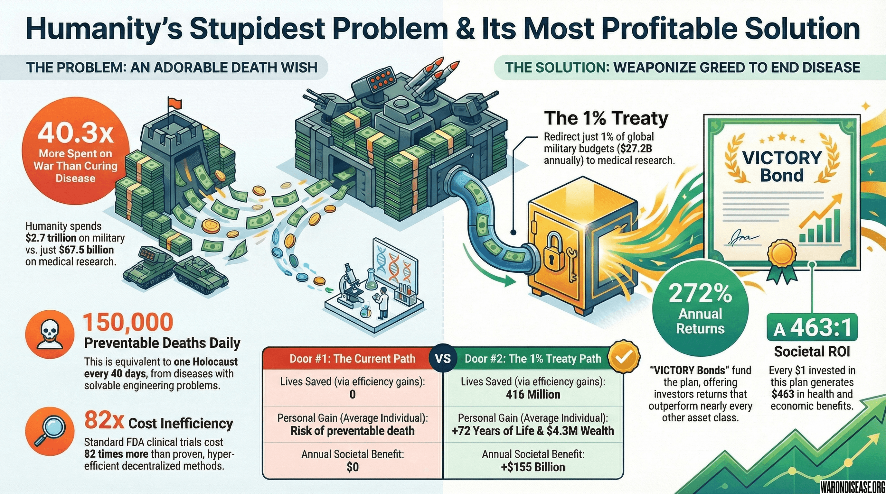



> **Related:** [IAB Mechanism Design](../appendix/incentive-alignment-bonds-paper.qmd) | [Academic Paper](../appendix/incentive-alignment-bonds-paper.qmd)

Remember when your grandparents funded WW2 by buying war bonds? They gave the government papers with dead presidents on them, got back slightly more papers later, and defeated fascism. Good times.

You're doing the same thing, except instead of buying bonds to kill Nazis, you're buying bonds to kill diseases. It's like war bonds but backwards.

::: {.callout-note}
## VICTORY Incentive Alignment Bonds

[Incentive Alignment Bonds (IABs)](../appendix/incentive-alignment-bonds-paper.qmd) are financial instruments that pay out when measurable public-good outcomes improve, translating those outcomes into benefits for the people who made them happen.

**VICTORY [Incentive Alignment Bonds](https://iab.warondisease.org) are the specific implementation** designed to fund and sustain the 1% treaty. They contain two distinct "engines" in a single instrument:

| Component | Who It Incentivizes | What They Get | Funding Source |
|-----------|---------------------|---------------|---------------|
| **Engine 1** | **Investors** |  annual returns |  of treaty revenue |
| **Engine 2** | **Politicians** | Reputation, electoral support, better careers |  of treaty revenue |
| **The Mission** | **Patients** | Subsidized trial participation, cures |  of treaty revenue |

Investors fund the campaign. Politicians get career benefits for supporting it. Patients get cures. Everyone's self-interest points at the same outcome: pass the treaty, expand it, cure diseases.
:::

## What You're Actually Building

A financial instrument that generates massive returns while accidentally curing diseases as a side effect:

- Collect  in papers from rich humans who like more papers
- Use those papers to convince politicians that not dying is popular
- Once the treaty passes,  in papers annually stops going to bombs and starts going to a 1% Treaty Fund
- Give the rich humans  of that () every year, forever
- Reserve  () for [political incentive mechanisms](../appendix/incentive-alignment-bonds-paper.qmd) that keep politicians aligned
- Use the remaining  () to cure the diseases actually killing people

**What you're offering investors:**  annual returns, which beats everything except insider trading and certain federal crimes

**The money never stops.** No maturity date means bondholders get paid until the sun explodes or humanity achieves immortality, whichever happens first (probably the immortality thing)

## The Four Phases of Making Everyone Rich While Saving Humanity

### Phase 1: Collect Papers From People With Too Many Papers

Find humans who have more papers than they need and convince them to give you  worth.

#### Who has that many papers

- Institutional investors (+ each) - pension funds, endowments, people managing other people's papers
- Family offices (+ each) - rich families who hired someone to watch their paper piles
- High net worth individuals ($1M+ each) - people who got lucky/smart/criminal and have extra papers
- Qualified investors ($100K+ each) - regular rich people

You explain to them: "Give me papers now, get back  more papers annually, forever."

They'll check the math. The math checks out. They give you papers.

### Phase 2: Spend the Papers Correctly

Use the  according to the [Campaign Budget](campaign-budget.qmd) to convince humanity to stop being short-sighted:

- **Internet clicking ceremony** - Get 280M humans to click "yes I would prefer not to die" ()
- **Professional briber conversion** - Show lobbyists that curing is more profitable than killing ()
- **Build the actual tech** - a decentralized framework for drug assessment (dFDA) and [Wishocracy](../solution/wishocracy.qmd) platforms ($180M)
- **Hire lawyers** - Make bribery legal by calling it other things ()
- **Co-opt death merchants** - Convince military contractors that  beats 8% ($150M)
- **Run the thing** - Pay humans to coordinate the paper distribution ($170M)

For the complete breakdown of where every paper goes, see [Campaign Budget](campaign-budget.qmd).

### Phase 3: Turn On the Money Faucet

The treaty passes because you gave the right papers to the right humans in the right order. Now the magic happens:

-  annually stops going to bombs and starts going to the 1% Treaty Fund (automatic, no takebacks)
-  () automatically goes to bondholders (they get paid first, before anyone can steal it)
-  () automatically funds [political incentive mechanisms](../appendix/incentive-alignment-bonds-paper.qmd) (keeps politicians aligned with curing diseases)
-  () automatically goes to curing the diseases actually killing people

Nobody has to vote on this again. The funding is automatic. The papers just flow, forever, like a river made of money.

### Phase 4: Watch Money Multiply Like Rabbits

Set up automatic payments that continue until the heat death of the universe:

- **Year 1**:  distributed to bondholders ( returns, investors buying yachts)
- **Year 2**:  distributed to bondholders (still buying yachts)
- **Year 3**:  distributed to bondholders (yacht accessories now)
- **Year 4+**: Scale up as treaty expands (2% = $5.4B, 5% = $13.5B, etc.)

No maturity date means the money never stops. As long as the treaty exists, bondholders get paid. And the treaty will exist because repealing it means explaining to voters why you want grandma's cancer to stay uncured.

## Calculate Your Numbers for Investors

### Show Them Where the Papers Come From

**Current global spending on ending human life**: /year

**What 1% of that is**: 1% = /year (enough to cure most diseases, apparently)

**What bondholders get**:
$$ 10\% \times \$27.2\text{B} = \$2.7\text{B}/\text{year} $$

**What funds political incentives** (keeps politicians aligned):
$$ 10\% \times \$27.2\text{B} = \$2.7\text{B}/\text{year} $$

**What actually cures diseases**:
$$ 80\% \times \$27.2\text{B} = \$21.7\text{B}/\text{year} $$

**What countries still have for wars**:
$$ 99\% \times \$2.7\text{T} = \$2.67\text{T} $$

This is important: Investors aren't "taking" money from sick people.  goes to cures. Bondholders get  for having the revolutionary idea of "what if we didn't all die?" and another  keeps politicians incentivized to maintain and expand the treaty.

### When Math Becomes Obscene

Since VICTORY [Incentive Alignment Bonds](https://iab.warondisease.org) never mature (they just keep paying forever), you calculate lifetime value using the perpetuity formula, which is finance-speak for "money printer that never stops":

$$
\text{Total Value} = \frac{\text{Annual Payment}}{\text{Discount Rate}} = \frac{\$2.7\text{B}}{r}
$$

#### Even if you're extremely pessimistic

| How Skeptical You Are | Total Lifetime Value | Your  Becomes |
|---------------|-----|---------------------------|
| Mildly skeptical (3% discount) |  | 90x your money |
| Pretty skeptical (5% discount) | $54B | 54x your money |
| Very skeptical (10% discount) | $27B | 27x your money |

Even at 10% discount (which assumes this is as risky as funding a Mars casino), your  investment becomes worth  total.

**Translation for those who prefer simple math:**

- You give:  in papers
- You get: $54-90 billion equivalent in papers
- Time required: Wait for politicians to be politicians
- Effort required: Literally none after Phase 1

#### This isn't complicated math

- **Annual return**:  (which sounds fake but isn't)
- **Lifetime value**: 54-90x (which sounds impossible but is just arithmetic)

Unlike:

- Venture capital (3-5x over 7-10 years, requires picking winners)
- Real estate (2-3x over 30 years, requires being a landlord)
- Medallion Fund (39% annually but closed to mere mortals)

VICTORY [Incentive Alignment Bonds](https://iab.warondisease.org) offer perpetual returns that transform into generational wealth while you sleep.

The perpetual nature isn't a bug. It's the entire point. As long as humans prefer being alive to being dead, the treaty exists. As long as the treaty exists, you get paid.

### How Returns Scale From "Obscene" to "Is This Even Legal?"

The treaty starts at 1% (baby steps for humanity). As diseases get cured, voters demand more. Politicians, who are evolutionarily wired to avoid unemployment, comply.

| Year | Treaty % | Annual Revenue | You Get Annually | ROI on Your  |
|------|----------|----------------|-------------------|--------------|
| 1-3  | 1%       | $27.2B         |              | 271.8%         |
| 4-7  | 2%       | $54B           | $5.4B             | 540%         |
| 8-10 | 5%       | $135B          | $13.5B            | 1,350%       |
| 10+  | 10%+     | $270B+         | $27B+             | 2,700%+      |

#### Why this actually happens

- **Years 1-3:** First diseases get cured. Media goes crazy. "IT WORKS!" Headlines everywhere.
- **Years 4-7:** More cures emerge. Politicians start noticing living voters really enjoy being alive.
- **Years 8-10:** Cancer becomes rare. Alzheimer's gets solved. Public demands acceleration.
- **Year 10+:** Politicians who oppose expansion lose to opponents who promise "I won't let your cancer come back."

Frame it as: Electoral suicide to oppose expansion once cures exist. Like running on a platform of "Let's bring back polio."

### Structure the Security Package

Give bondholders these five layers of security:

1. **+ annual treaty revenue stream** (starts year 1 if treaty passes)
2. **Political entrenchment** (treaties are historically hard to repeal once implemented)
3. **Public support** (70%+ approval, grows with each cure)
4. **Aligned incentives** (everyone profits from cooperation)
5. **First-lien position** (bondholders get paid before any discretionary spending)

Explain to investors: Multiple layers of protection, not just one point of failure.

## What Full Success Looks Like

Show investors what full treaty adoption delivers:

**Treaty adoption**: 100+ countries (all major military powers)
**Annual 1% Treaty Fund revenue**: 
**Bondholder annual payment**:  ()
**Political incentive funding**:  ()
**Pragmatic clinical trial funding**:  ()
**Investor ROI**:  annually

**What happens**:

- Pragmatic clinical trials accelerate dramatically
- Disease burden declines measurably
- Public support grows stronger
- Political momentum builds for 2%, then 5% expansion
- Returns scale up proportionally

## Explain the // Split

Structure the allocation to balance four goals:

1. **Attract sufficient capital**:  projected returns compete with high-risk VC/hedge funds ( to investors)
2. **Keep politicians aligned**:  funds [Incentive Alignment Bonds](../appendix/incentive-alignment-bonds-paper.qmd) that make supporting the treaty career-optimal for politicians
3. **Fund the mission**:  () gives researchers substantial capital
4. **Align all incentives**: Investors, politicians, and researchers all profit from treaty expansion

Tell investors: Everyone wins when treaties grow. More cures = bigger treaties = higher returns + more political support + more funding for pragmatic clinical trials.

## Set Up the Legal Structure

The VICTORY [Incentive Alignment Bonds](https://iab.warondisease.org) are issued by **The Victory Corporation**, a for-profit Delaware C-Corp. This entity serves as the financial "Engine" of the entire operation, designed to attract for-profit capital to fund the political and social mission.

This structure legally separates the investment activities from the philanthropic and lobbying arms of the organization. For a complete breakdown of the four-part hybrid legal model, see the [Legal Architecture](../legal/legal-framework.qmd) chapter.

### Structure the Bond Instrument

**Instrument type**: Create as senior secured debt

**Priority**: Give first lien on all 1% Treaty Fund revenue

**Term**: Make perpetual (no maturity date)

**Payment**: Set annual distributions in stable currency (USD or basket)

**Transferability**: Allow secondary market trading

**Governance**: Grant bondholder seats on the 1% Treaty Fund's oversight board

### Create Milestone-Based Releases

Protect investors by releasing funds in tranches tied to achievements:

**Phase 1 milestone ( release)**:

- Launch platform MVP
- Achieve 50M+ referendum votes
- Complete successful pilots in 2 countries
- Establish legal framework

**Phase 2 milestone ( release)**:

- Reach 280M+ total referendum votes
- Get treaties pending in 20+ countries
- Scale platform to 10M users
- Secure military industry partnerships

**Phase 3 milestone ($300M release)**:

- Get treaty signed by 50+ countries
- Achieve $13B+ annual revenue flowing
- Have your decentralized framework for drug assessment (dFDA) processing trials
- Demonstrate irreversible momentum

**Set up protection**: Hold all funds in escrow, refund if milestones aren't hit

### Address Each Risk Category

The investment carries two primary types of risk: **Project Risks**, which are inherent to the success of the campaign, and **Investor-Specific Risks**, which relate to the nature of the financial instrument.

#### Project Risks

- **Political Risk:** The treaty may fail to pass in key nations. You mitigate this by building broad, bipartisan public support and using a multi-country strategy to avoid single points of failure.
- **Execution Risk:** The campaign may fail to achieve its milestones. You mitigate this with milestone-gated funding, a lean operational model, and hiring an elite, experienced team.

#### Investor-Specific Risks

- **Liquidity Risk:** Funds are locked up for 18-36 months during the campaign phase before returns begin. You mitigate this by allowing secondary market trading after an initial lock-up period.
- **Timeline Risk:** The political process could take longer than projected, delaying returns. The perpetual nature of the bond is designed to reward patience.

## What This Beats (Spoiler: Everything)

### Show Investors This Table

| Investment | Annual Return | Risk | Term | Catch |
|------------|---------------|------------|------|------|
| **VICTORY Incentive Alignment Bonds** | **** | **High** | **Forever** | **Requires politicians to act rationally** |
| Savings Account |  | None | Whenever | Loses to inflation |
| S&P 500 | 10% | Moderate | Whenever | Boring, responsible |
| Real Estate | 8% | Moderate | 30 years | Requires being a landlord |
| Venture Capital | 15-25% | Extreme | 7-10 years | Requires picking winners |
| Hedge Funds | 8-15% | High | Lock-ups | Requires being rich already |
| Medallion Fund | 39% [@top-pe-hedge-funds] | Extreme | N/A | Closed to mortals |
| Warren Buffett | 20% [@warren-buffett-career-average-return-20-pct] | Moderate | 60 years | Requires being Warren Buffett |

**Remind investors:** Returns assume treaty passes. If politicians decide they prefer dead constituents to living ones, you lose your money. But even then, you'll be too dead from preventable diseases to complain about it.

**Pitch angle:** Even accounting for "politicians might choose mass death over prosperity" risk, this crushes every legal investment except ones that are closed to new money.

## The Expansion Flywheel



### Explain the flywheel to investors

1. Treaty passes → Bondholders get first distributions
2. DIH funds trials → Breakthroughs start emerging
3. Media covers wins → Public awareness explodes
4. Public demands more → Politicians face electoral pressure
5. Treaty % increases → Revenue scales up dramatically
6. More cures emerge → Cycle reinforces itself
7. Long-term result: Compounding returns + saved lives

**Frame it as**: Success creates more success, self-reinforcing growth mechanism.

## Set Minimum Investment Thresholds

**Investor lock-up period**: Tell investors funds are locked 12-36 months until treaty passes, then perpetual distributions begin.

### Structure Your Minimums

Set these minimum investment amounts by investor type:

- **Institutional investors**: + per investor
- **Family offices**: + per office
- **High net worth individuals**: $1M+ per person
- **Qualified investors**: $100K+ minimum

*(Adjust based on your final regulatory structure and jurisdiction requirements)*

### Draft Your Term Sheet

*(Have lawyers review, this is illustrative only)*

- **Interest rate**: 0% (all returns via revenue share model)
- **Revenue share**:  of all treaty inflows
- **Term**: Perpetual (no maturity date)
- **Payment frequency**: Annual distributions
- **Default provisions**: Transparent reporting, third-party audits
- **Transferability**: Tradable on secondary market after 12 months
- **Governance**: Grant bondholder board representation

## When Rich People Ask Difficult Questions

For broader objections about whether humanity is capable of not being stupid, see [Demolishing Objections](../appendix/faq.qmd). This section handles money-specific concerns.

### "This sounds like a Ponzi scheme run by someone who failed math."

"Ponzi schemes pay old investors with new investor money, which is why they collapse. This pays investors with a share of a new  annual revenue stream created by redirecting 1% of military budgets via treaty.

The money comes from governments that currently spend it on bombs. The returns are high because the political risk is high - you're betting that politicians will choose prosperity over mass death, which is historically a coin flip.

It's not a Ponzi scheme. It's weaponized lobbying economics pointed at diseases instead of wars."

### "What happens when this fails and I lose my billion dollars?"

"If the treaty fails completely, you lose your . It gets spent on the campaign - convincing humans to click buttons, bribing lobbyists, building platforms, paying lawyers to make bribery legal.

This is the primary risk. You're essentially funding a political campaign with a  payout if it wins.

If it fails completely, you'll probably die of a preventable disease anyway, so you won't be around to complain about the lost money.

It's venture capital but for not dying."

### "What could possibly go wrong?"

"Glad you asked. Here are all the ways this explodes:

#### Project Risks

- **Political:** Politicians choose dead constituents over living ones (mitigated by 280M referendum votes showing this is electoral suicide)
- **Execution:** The campaign gets run by incompetent people (mitigated by milestone-based releases and hiring competent people)

#### Investor Risks

- **Liquidity:** Your billion dollars is locked up for 18-36 months while we convince politicians (mitigated by secondary market trading after lock-up)
- **Timeline:** Politics is slow, returns might start late (mitigated by perpetual payments - doesn't matter when it starts if it never stops)

You're essentially betting that humans prefer being alive. Historically this is true, but your species has surprised us before."

### "How is this different from just donating to charity?"

"Charities give you 0% returns and a tax deduction. VICTORY [Incentive Alignment Bonds](https://iab.warondisease.org) give you  returns and generational wealth.

Charity is for people who want to feel good. This is for people who want to get obscenely rich while accidentally saving humanity as a side effect.

You're not donating to cure diseases. You're investing in curing diseases because it's the most profitable legal thing you can do with a billion dollars.

It's the Louisiana Purchase of pragmatic clinical trials - except instead of buying land from France, you're buying life extension from death, and unlike Louisiana, it doesn't flood."

### When they want detailed financials

#### Direct them

"Complete breakdowns available:

- [Financial Plan](financial-plan.qmd) - System architecture
- Full offering docs - Email for access"

## The One-Page Summary That Makes Calculators Weep

Hand this to investors who can't read more than one page:

**VICTORY Incentive Alignment Bonds: How to Get Obscenely Rich While Accidentally Saving Humanity**

### What you get

- **Returns:**  annually forever (assuming politicians don't choose mass death)
- **Duration:** Perpetual (payments never stop until heat death of universe)
- **Side effect:** Millions of humans continue existing who would otherwise stop
- **Priority:** You get paid before anyone else touches the money
- **Growth path:** 1% → 2% → 5%+ as diseases get cured and public demands more

### What could go wrong

- **Political risk:** Politicians might prefer dead voters (unlikely but humans are weird)
- **Execution risk:** Campaign could be run incompetently (mitigated by hiring competent humans)
- **Timeline risk:** 18-36 month lockup while convincing politicians to be smart
- **Liquidity risk:** Your money is frozen during the convincing phase

## Related Implementation Guides

### For detailed execution plans

- [Financial Plan](financial-plan.qmd) - Overall system architecture





#### The core mechanism is stupid simple

1. Collect $1.0B from rich humans
2. Use it to convince politicians that living constituents vote more reliably than dead ones
3. The treaty passes, redirecting  annually from bombs to cures via a 1% Treaty Fund
4. Give bondholders  () every year, forever
5. Fund political incentives with  () to keep politicians aligned
6. Use remaining  () to actually cure the diseases killing people
7. Diseases decline, public demands more funding, returns scale up
8. Repeat until death is optional or universe ends

It's the simplest way to become generationally wealthy while making it harder for people to die from preventable things.