

**Target audience:** Funders and investors, framed as instruction, not solicitation\
**Tone:** Wishonia/Philomena Cunk deadpan. Genuine alien confusion at human behavior.\
**Duration:** ~3.5 minutes\
**Visual style:** 1950s educational film cartoon ("Duck and Cover" meets Wishonia)

---

## Scene 1: The Most Important Person {.scene}

Hello, human. You don't realize it yet, but you are, quantifiably, the most important person in the history of your civilization.

:::{.scene-direction}
**Keyframe:** A pale-skinned young alien woman with small antennae, black bob haircut, and cosmic-patterned dress at a 1950s classroom chalkboard. She has written "MOST IMPORTANT PERSON IN HISTORY" in huge chalk letters with an arrow pointing at the viewer. She beams with unsettling pride. Display text on chalkboard: "MOST IMPORTANT PERSON IN HISTORY" with a chalk arrow pointing at the viewer.
**Animation:** She taps the chalkboard and points at the viewer. The arrow pulses.
:::

:::{.scene-keyframe}
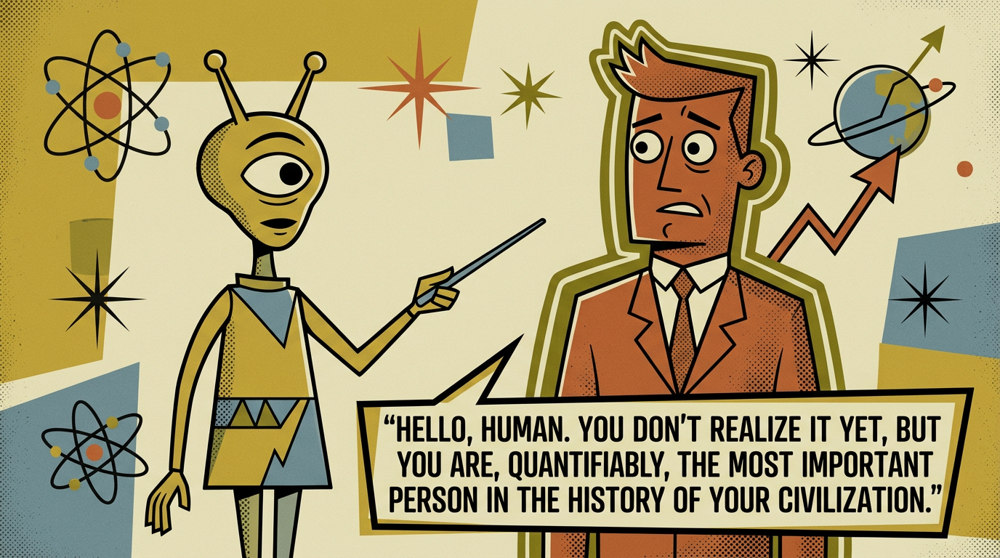
:::

I can see your expression and I believe the word for it is "skeptical." This is the face you make before pulling a door that says "push."

:::{.scene-direction}
**Keyframe:** A businessman pulling with all his might on a door with an enormous sign reading "PUSH." Feet braced against the wall. Briefcase on the ground. Tie flipped over his shoulder. The door does not move. Display text on door sign: "PUSH".
**Animation:** He pulls harder. The sign gets bigger. He does not look at the sign.
:::

:::{.scene-keyframe}
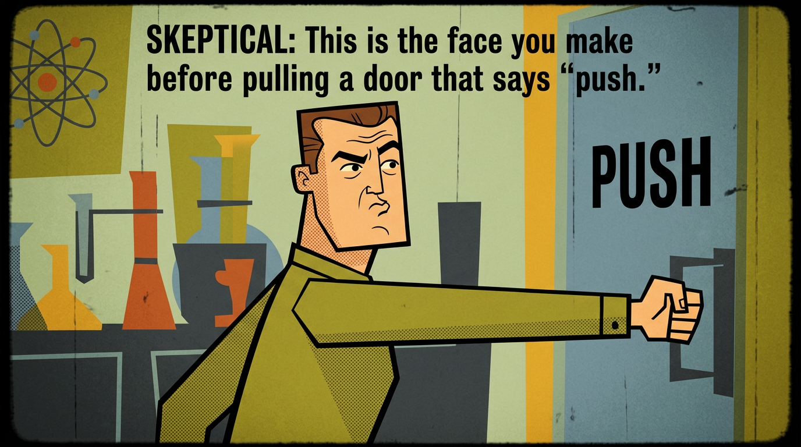
:::

Every minute you make that face,  humans permanently stop.

:::{.scene-direction}
**Keyframe:** A giant cuckoo clock where a tiny grim reaper pops out instead of a bird. Each cuckoo, a person silhouette below vanishes. The reaper looks increasingly apologetic. A pile of tiny scythes accumulates on the floor. Do not include any text.
**Animation:** Reaper cuckoos faster and faster. People vanish. Scythes pile up.
:::

:::{.scene-keyframe}
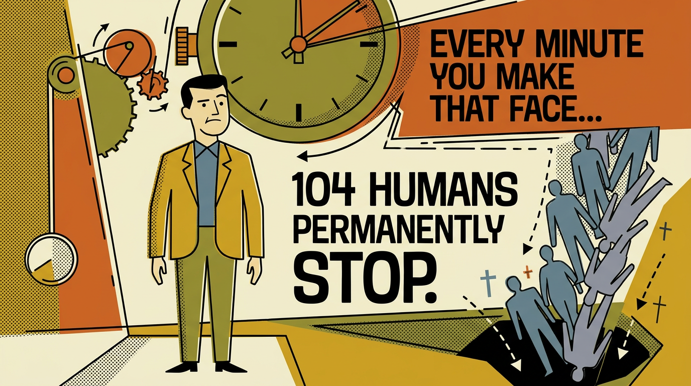
:::

Please make a different face.

:::{.scene-direction}
**Keyframe:** A pale-skinned young alien woman with small antennae, black bob haircut, and cosmic-patterned dress holding cue cards at the viewer. One card: frowning face with red X. Next card: determined face with green checkmark. She taps the second card. Rejected cue cards litter the floor.
**Animation:** She flips through cards rapidly, settling on the determined one and tapping it impatiently.
:::

:::{.scene-keyframe}

:::

## Scene 2: The Murder Budget {.scene}

Your species spends  times more on weapons than on testing which medicines work.

:::{.scene-direction}
**Keyframe:** A giant brass balance scale. Left side: a single aspirin on a tiny saucer. Right side: an aircraft carrier, tanks, missiles, and a fighter jet crammed on, smashed through the floor. The aspirin side floats in the air.
**Animation:** Another tank drops on. The building shakes. The aspirin bounces, unbothered.
:::

:::{.scene-keyframe}
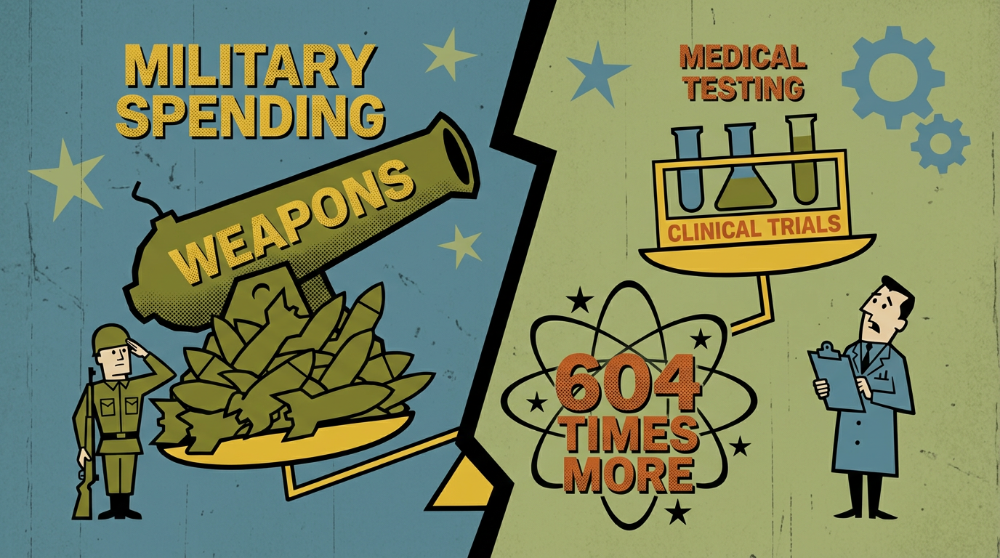
:::

95% of your diseases have zero approved treatments.

:::{.scene-direction}
**Keyframe:** A police lineup. 20 cartoon disease germs against a height chart. 19 smirk in tiny sunglasses, free to go. One pathetic germ in handcuffs looks confused. A pale-skinned young alien woman with small antennae, black bob haircut, and cosmic-patterned dress watches as detective behind one-way glass, pinching the bridge of her nose.
**Animation:** The 19 free germs high-five and swagger out. The handcuffed one looks around helplessly.
:::

:::{.scene-keyframe}
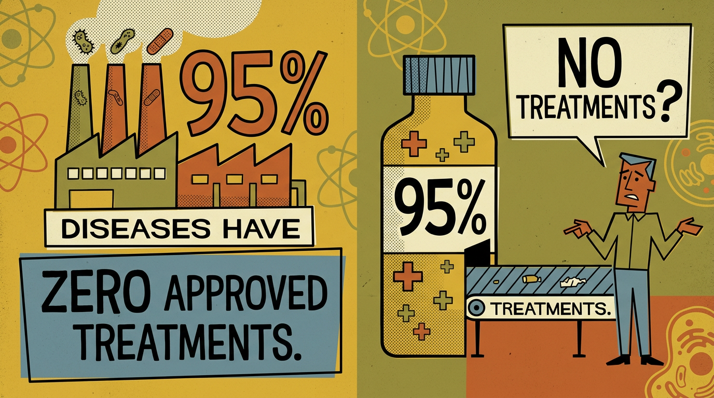
:::

You will be dead long before they're cured, which I mention not to be rude but because you seem weirdly calm about this.

:::{.scene-direction}
**Keyframe:** A man in a cardigan sipping tea in an armchair, serene. His house is engulfed in flames. A mushroom cloud rises through the window. A missile has gone through the roof. He wears an "I voted" sticker.
**Animation:** Flames climb. A beam falls. He turns a page, sips tea. A second missile enters the wall.
:::

:::{.scene-keyframe}
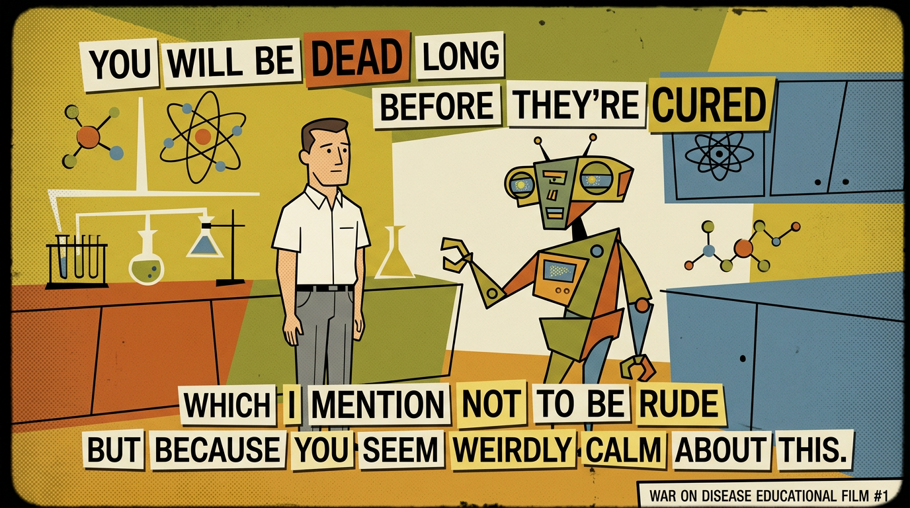
:::

If cancer had oil reserves, you would have cured it by 2003. Instead you spent the repair money on invisible jets and Space Force, which exists to fight the zero aliens currently attacking you.

:::{.scene-direction}
**Keyframe:** A pale-skinned young alien woman with small antennae, black bob haircut, and cosmic-patterned dress in front of Earth, surrounded by military satellites with weapons pointed at empty space. She looks deeply personally offended, hand on chest. Not a single other alien in sight.
**Animation:** She spins looking for other aliens, finds none, turns back with profound betrayal. Satellites swivel to track her.
:::

:::{.scene-keyframe}
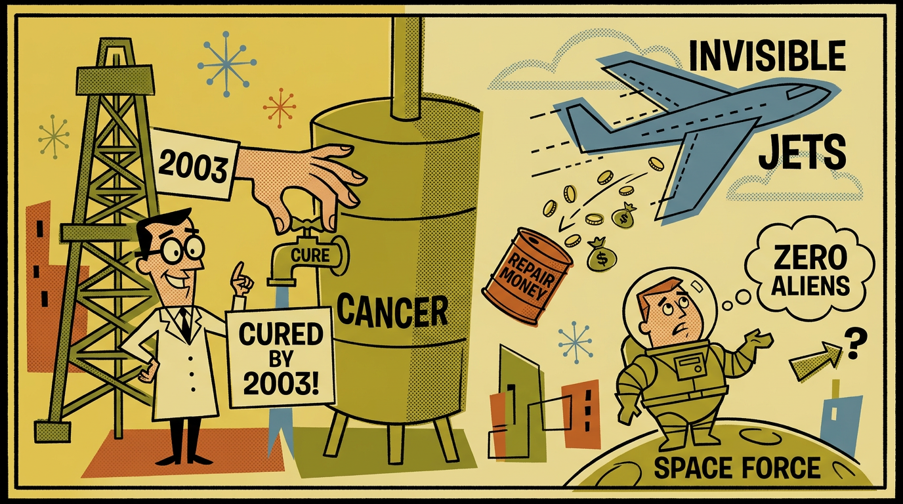
:::

Your destructive economy is  of GDP and growing. The Soviet Union collapsed at 15%. You hit 25% in . They had a plan. It was a terrible plan, but they had one.

:::{.scene-direction}
**Keyframe:** A road stretching to the horizon with percentage mile markers. At 15%, a wrecked car with a hammer-and-sickle flag smolders in a ditch, a crumpled roadmap flying from the wreckage. Further ahead at 25%, a brick wall labeled "COLLAPSE." A tiny Earth-mobile races toward it. No map. No brakes. Bumper sticker reads "THOUGHTS AND PRAYERS."
**Animation:** The Earth-mobile accelerates past the Soviet wreckage without slowing. The wall gets closer.
:::

:::{.scene-keyframe}
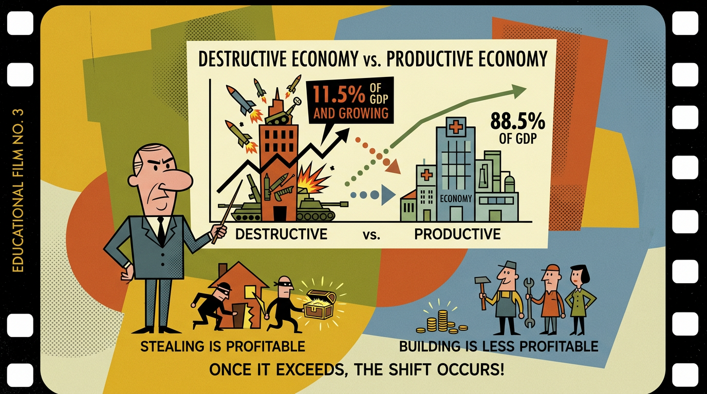
:::

## Scene 3: The Money {.scene}

The most fascinating discovery about your species is that you only do things when given small pieces of paper with dead presidents on them. These are called "money," which is pretend value that becomes real value if everyone pretends hard enough.

:::{.scene-direction}
**Keyframe:** A pale-skinned young alien woman with small antennae, black bob haircut, and cosmic-patterned dress at a lab bench, examining a dollar bill through a microscope with tweezers. Bite marks on another bill. One stuck in a potted plant's soil. Rejected hypotheses crossed out on a chalkboard.
**Animation:** She pokes the bill, sniffs it, gives up. Looks at camera bewildered.
:::

:::{.scene-keyframe}
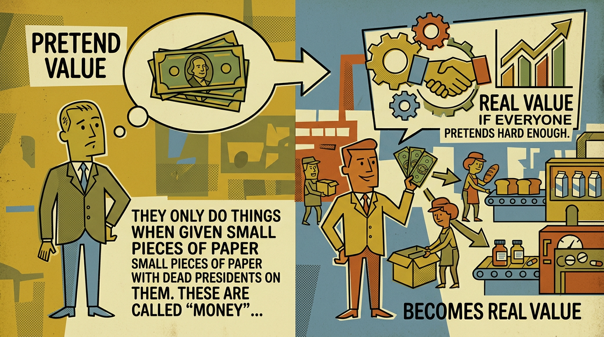
:::

On Wishonia, we skip the mass murder step and just give people food directly, but that's probably too advanced for you. So here are the steps.

:::{.scene-direction}
**Keyframe:** A chalkboard comparison. Left side labeled "WISHONIA": two boxes connected by one arrow, "Need" then "Give." Right side labeled "EARTH": a tangled spaghetti of boxes: "Need, Form, Committee, Lobbyist, Politician, Vote, Bureaucrat, Study, Appeal, Wait, Give (maybe)." Several Earth boxes are on fire.
**Animation:** The Wishonia side draws itself in two strokes. The Earth side tangles, multiplies, and catches fire.
:::

:::{.scene-keyframe}
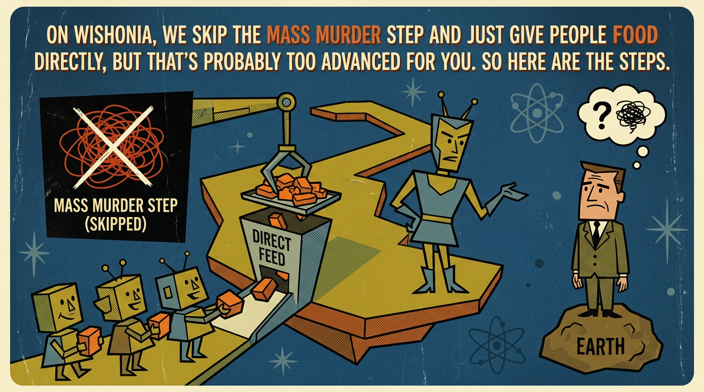
:::

## Scene 4: The Machine {.scene}

Sell Incentive Alignment Bonds that raise  to legally bribe politicians into passing a 1% treaty: redirect military spending to clinical trials.

:::{.scene-direction}
**Keyframe:** A Rube Goldberg machine across a factory floor. A tiny coin enters a slot on the left. Through gears, pulleys, and chutes, it processes through escalating stages. At the far end, an avalanche of medicine bottles pours into wheelbarrows.
**Animation:** The coin drops in. The machine clanks through its sequence. Medicine bottles cascade out in absurd quantities.
:::

:::{.scene-keyframe}
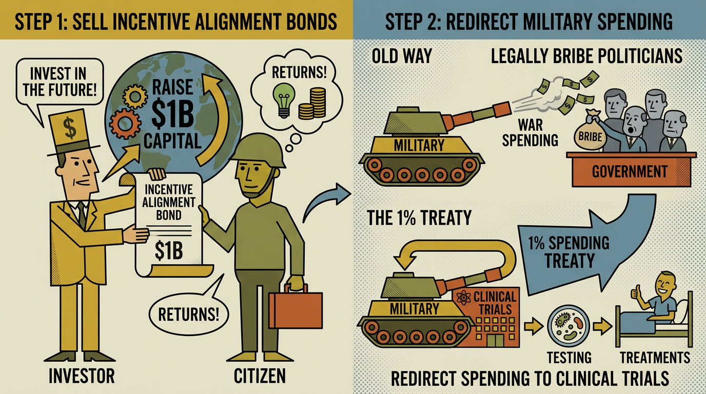
:::

 of the resulting  per year funds trials.  pays investors  returns.  buys politicians. They're surprisingly affordable.

:::{.scene-direction}
**Keyframe:** A 1950s pie chart showing the money split. A huge 80% slice pours out medicine bottles. A 10% slice rains coins onto delighted investors in monocles. In the remaining 10% slice, a tiny politician is being picked up by an arcade crane claw. The crane operator looks bored.
**Animation:** Medicine bottles pour. Coins rain. The crane drops the politician into a "YES" box. He looks confused but cooperative.
:::

:::{.scene-keyframe}
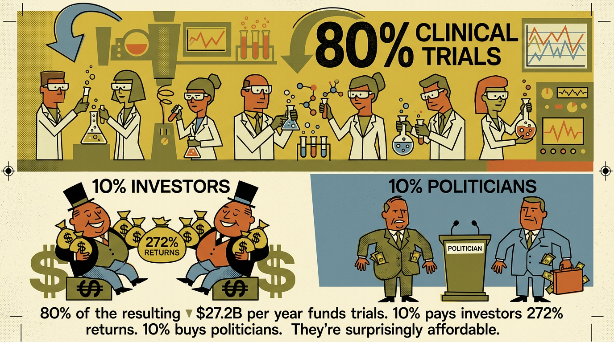
:::

Your grandparents funded WW2 with bonds at roughly 3% returns. This pays . Same structure, fewer Nazis, better spreadsheet.

:::{.scene-direction}
**Keyframe:** Two framed posters side by side. Left: vintage WW2 war bond poster, heroic soldier, modest return percentage. Right: identical layout but a doctor in a lab coat, and the 272% return percentage has burst through the frame, cracked the wall, and is still growing off the poster's edge.
**Animation:** The new poster's numbers keep growing, cracking the frame. Plaster falls.
:::

:::{.scene-keyframe}
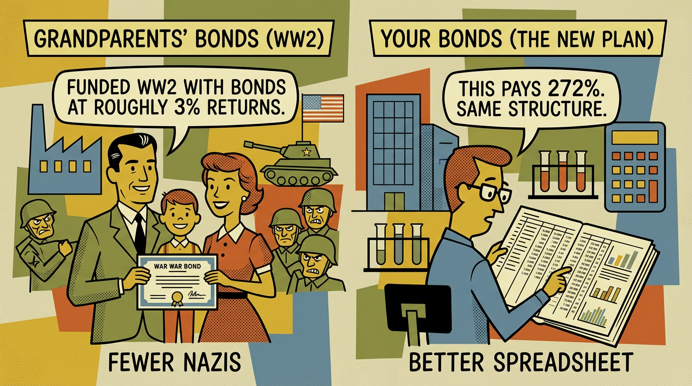
:::

Returns grow with the treaty, so every bondholder becomes a permanent lobbyist for expanding it. Same mechanics as the Military Industrial Complex. Same greed. Fewer corpses. Call it the Patient Industrial Complex.

:::{.scene-direction}
**Keyframe:** A grimy factory with belching smokestacks and ruthless conveyor belt efficiency. Medicine bottles roll off the line where bombs used to. A bored floor manager with a clipboard watches. Efficiency metrics on the wall are identical.
**Animation:** Conveyor belts roll. Medicine bottles drop into crates. The floor manager checks his clipboard.
:::

:::{.scene-keyframe}
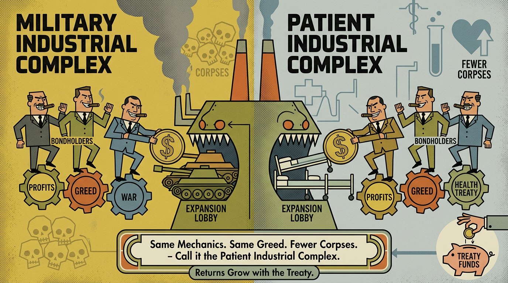
:::

## Scene 5: The Trials {.scene}

The treaty funds your decentralized FDA: pragmatic trials at  per patient instead of .

:::{.scene-direction}
**Keyframe:** Split-screen price tag comparison. Left: a single patient in a hospital bed with a comically enormous price tag hanging from the IV drip, dragging the bed through the floor. Right: the same patient with a tiny price tag, surrounded by hundreds of patients in a vast efficient trial warehouse. The left patient looks bankrupted. The right patients look mildly inconvenienced.
**Animation:** The enormous price tag grows larger, dragging the bed down. On the right, patients arrive in cheerful waves.
:::

:::{.scene-keyframe}
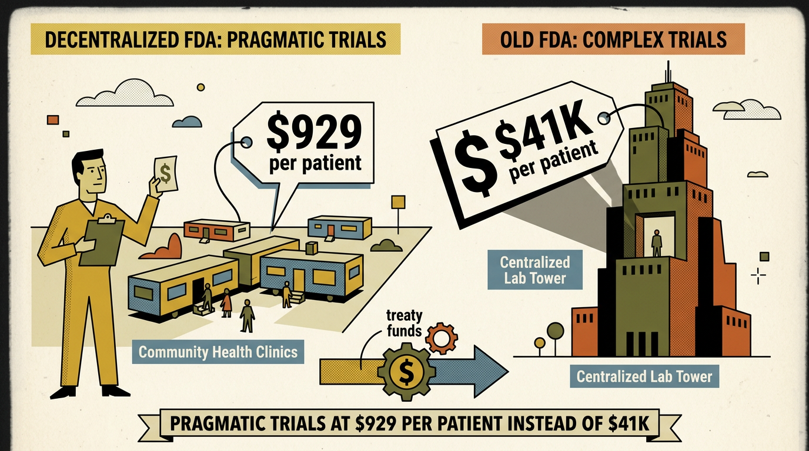
:::

This funds  patients per year instead of , compressing the treatment queue from ~ to ~. Treatments reach patients  sooner.

:::{.scene-direction}
**Keyframe:** Two parallel timelines on a chalkboard. Top timeline: a line of sick stick figures stretching past labels "your grandchildren," "the sun explodes," and "???" Bottom timeline labeled "WITH TREATY": the same line dramatically compressed, most figures already holding medicine bottles, a visible finish line nearby.
**Animation:** The top timeline extends off the board. The bottom compresses. Stick figures receive medicine and walk away cured.
:::

:::{.scene-keyframe}
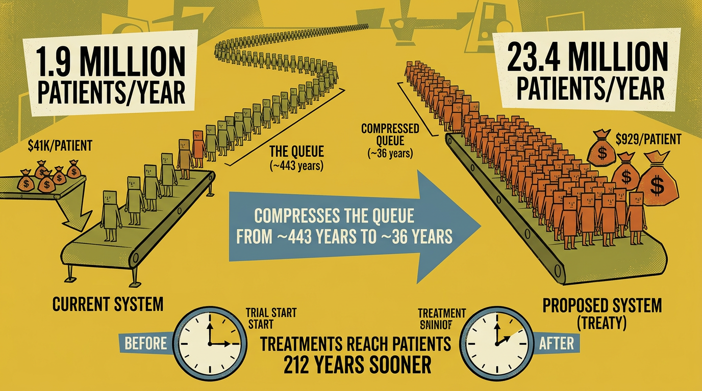
:::

That timeline shift prevents . Those are humans who currently have plans for next Tuesday.

:::{.scene-direction}
**Keyframe:** A vast crowd of tiny cartoon people, each holding a small piece of paper. Zooming in reveals mundane plans: "dentist at 3," "pick up kids," "try that new restaurant," "finally clean garage." They are all alive. Warm light.
**Animation:** Camera slowly zooms in. Individual plans become readable. Ordinary life, continuing.
:::

:::{.scene-keyframe}
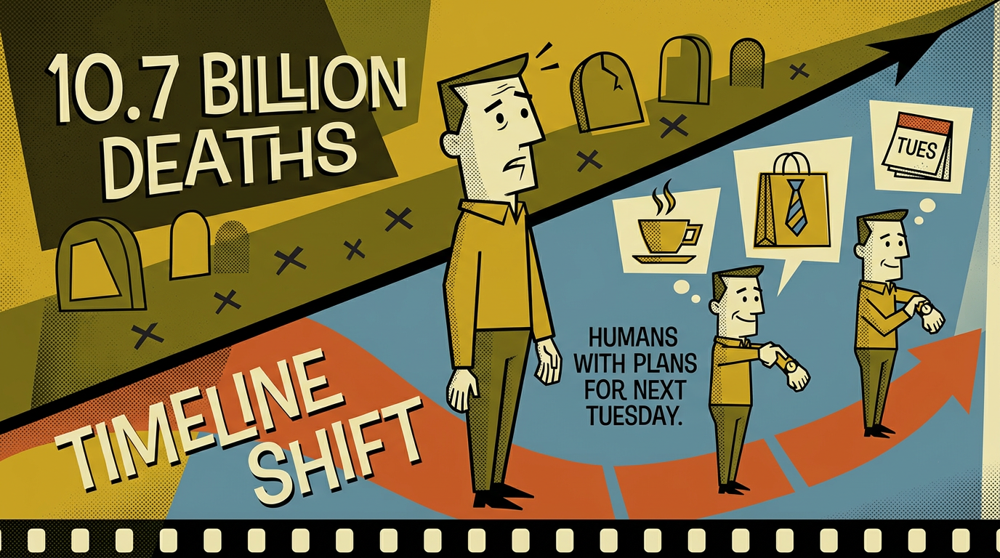
:::

## Scene 6: The Evidence {.scene}

You want evidence? You never required evidence before starting anything stupid, but fine.

:::{.scene-direction}
**Keyframe:** A triptych of proud inventors in gilded frames. Left: beaming inventor beside a cart with square wheels. Center: grinning inventor presenting a submarine with screen doors, water pouring in. Right: delighted inventor holding a solar-powered flashlight in a dark room.
**Animation:** Camera pans the triptych. Each invention fails: cart tips, submarine sinks, flashlight stays dark. Inventors stay proud.
:::

:::{.scene-keyframe}
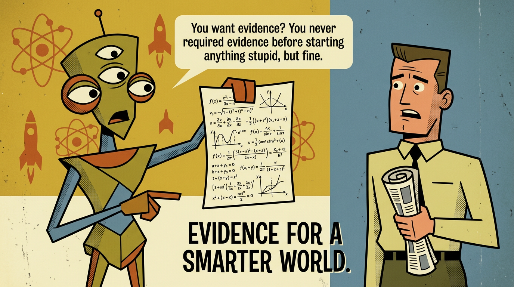
:::

The RECOVERY trial tested 6 treatments on 48,000 patients at a  cost reduction. During a pandemic. While panicking. Your species does its best work when terrified.

:::{.scene-direction}
**Keyframe:** A hospital cafeteria repurposed as a clinical trial. A scientist sprints between patients crammed everywhere: counters, windowsills, bunk beds. Test tubes balanced on serving trays. Giant test tubes bubble in the kitchen. A cost chart on the wall plummets.
**Animation:** Scientist sprints between patients, stumbles, catches himself. Cost chart drops. A second scientist slides past on a rolling chair.
:::

:::{.scene-keyframe}
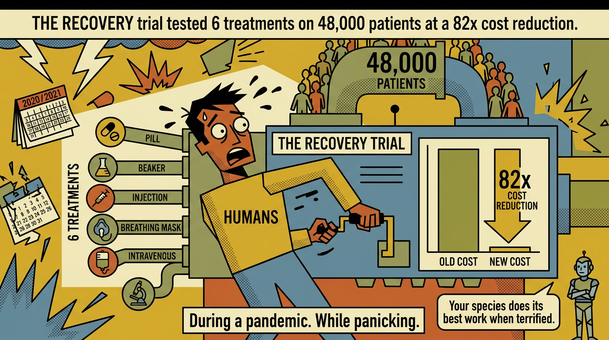
:::

After WW2, humans cut military spending by  and stumbled into the greatest economic boom in history by running out of people to shoot at.

:::{.scene-direction}
**Keyframe:** A suburban neighborhood where houses grow out of the ground like flowers. One house is mid-sprout. A man waters his house with a garden hose. A prosperity chart grows alongside them like a beanstalk off the top of the frame. The sun wears sunglasses.
**Animation:** Houses sprout. The man waters his and it grows a second story. The prosperity beanstalk climbs higher.
:::

:::{.scene-keyframe}
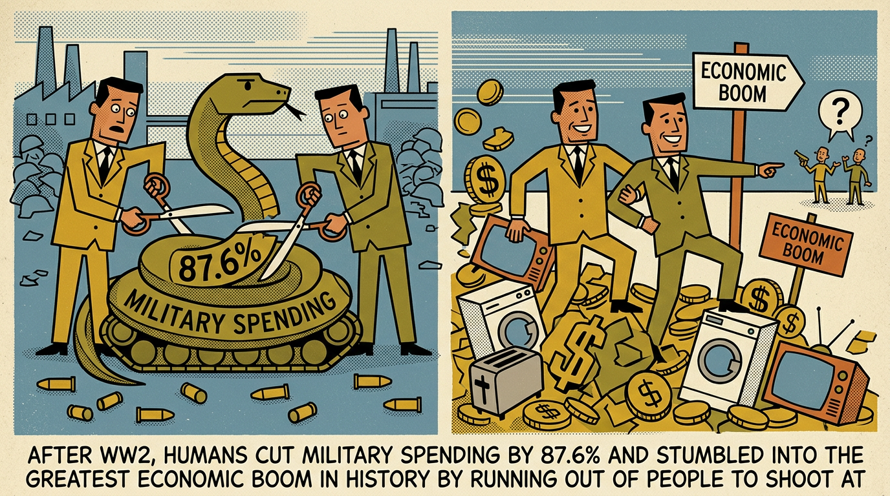
:::

You are being asked for 1%.

:::{.scene-direction}
**Keyframe:** A skyscraper-sized bar chart towers on the left, disappearing into clouds (the post-WW2 military cut). On the right, a nearly invisible speck (1%). An ant next to the 1% bar is taller than it. A tiny flag planted on top so people can find it.
**Animation:** Camera pans up the skyscraper bar through clouds, then whip-pans to the microscopic 1% bar. The ant shakes its head.
:::

:::{.scene-keyframe}
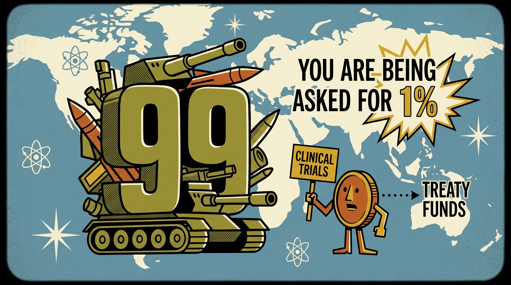
:::

## Scene 7: The Math {.scene}

The math:  in.  saved. Return of  to 1.

:::{.scene-direction}
**Keyframe:** A chalkboard filling the frame. Tiny money bag on the left, arrow to a massive crowd of stick figures on the right. The return number at the bottom has outgrown the board, continued across the wall, and is now being written on the ceiling by a pale-skinned young alien woman with small antennae, black bob haircut, and cosmic-patterned dress on a ladder, running out of chalk.
**Animation:** The return number accelerates across the board, off the edge, across the wall. The alien climbs higher. Chalk breaks.
:::

:::{.scene-keyframe}
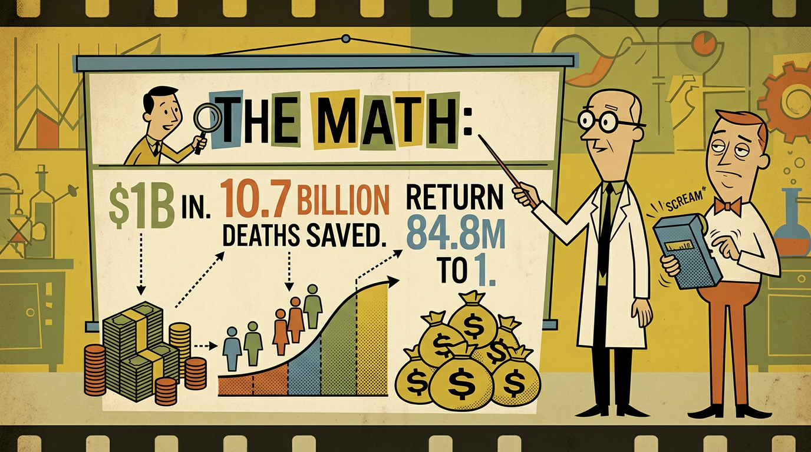
:::

Your calculator will display an error, emit a tiny electronic scream, and attempt to leave the desk. This is correct.

:::{.scene-direction}
**Keyframe:** A 1950s calculator with a cartoon face, tiny legs, tiny fedora, and a bindle over its shoulder, fleeing across a desk at full sprint. Smoke and sparks trail behind it. A green checkmark hovers where it was. The math on the desk is so large the numbers spill onto the floor. Mid-leap off the desk edge, legs pinwheeling.
**Animation:** It sprints, bindle bouncing. Reaches the edge, looks back at the math, and jumps. Fedora flies off.
:::

:::{.scene-keyframe}
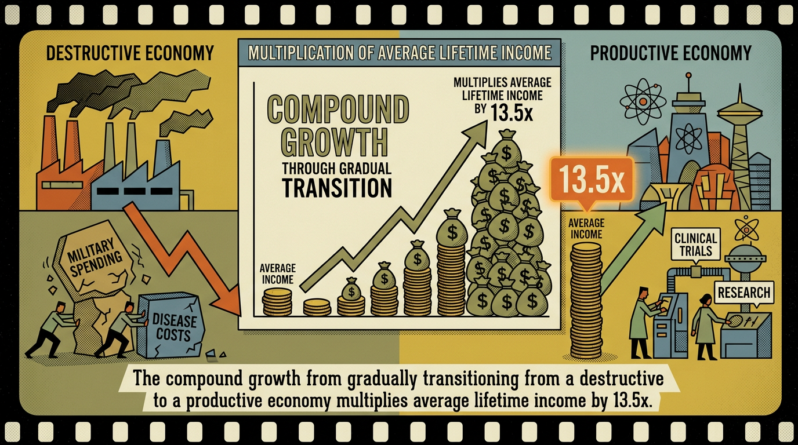
:::

## Scene 8: The Closing {.scene}

Is it physically possible your governments redirect 1%? Do billionaires like money? Do they prefer not dying?

:::{.scene-direction}
**Keyframe:** A 1950s game show set. Three question panels with buzzers. The game show host (a pale-skinned young alien woman with small antennae, black bob haircut, and cosmic-patterned dress in a sequined jacket) files her nails, bored. The contestant's hand hovers, sweating. Confetti cannons pre-aimed. The audience is already standing.
**Animation:** The contestant trembles. The host yawns. Hand hits buzzer. All three panels light up. Confetti erupts.
:::

:::{.scene-keyframe}
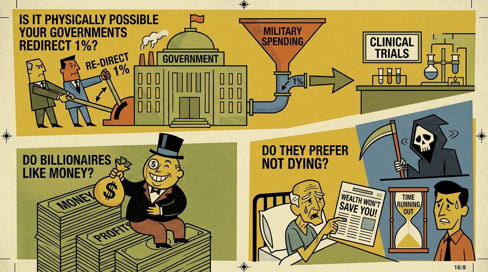
:::

You said yes to all of those. There are  billionaires on your planet. The math needs one.

:::{.scene-direction}
**Keyframe:** Thousands of identical cartoon billionaires in top hats stretching to the horizon, dodging a spotlight sweeping overhead. One in the front has been caught mid-tiptoe trying to sneak away. Monocle popped off. The crowd leans away from him.
**Animation:** Spotlight sweeps. Billionaires duck. It lands on the sneaker. He freezes, sighs, steps forward.
:::

:::{.scene-keyframe}
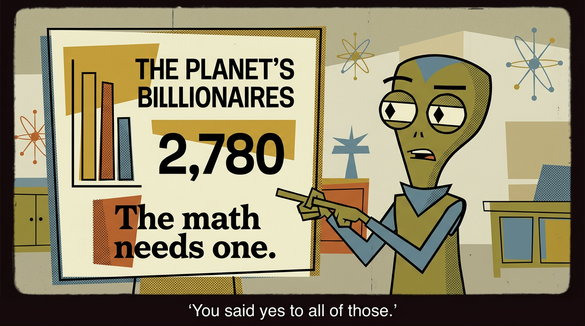
:::

Every minute nobody acts,  humans permanently stop.

:::{.scene-direction}
**Keyframe:** A giant wall clock where the minute hand is a grim reaper's scythe. The reaper is the hour hand, sweating, consulting a clipboard so long it drags across the floor. Each tick, a person silhouette vanishes. He looks exhausted and apologetic.
**Animation:** The scythe ticks. People vanish. The reaper checks his clipboard, sighs, can't keep up.
:::

:::{.scene-keyframe}
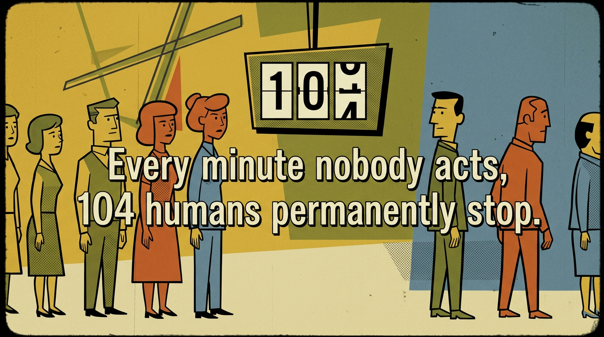
:::

Humans are not stupid. You invented cheese, which is milk you left out until it went bad, but in a good way. That is genius. You just need to apply that same innovation to not dying.

:::{.scene-direction}
**Keyframe:** Three-panel comic of cheese's origin. Panel 1: milk on a windowsill, sweating in the sun. Panel 2: curdling in horror at what it's becoming. Panel 3: a glorious cheese wedge with golden halo, cherubs, and heavenly rays. The cheese is surprised by its own magnificence.
**Animation:** Milk sweats. Curdles in horror. Golden light erupts. Cheese ascends with angels.
:::

:::{.scene-keyframe}
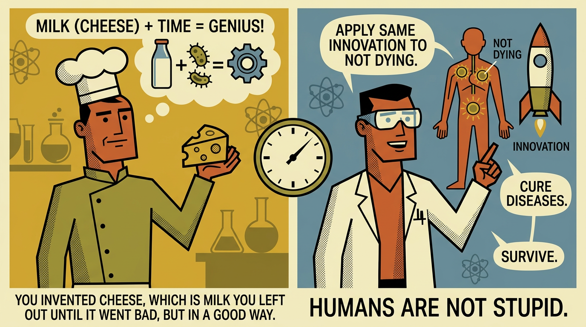
:::

"I didn't know" is no longer available to you. The manual is at warondisease.org. This is why aliens don't visit.

:::{.scene-direction}
**Keyframe:** A pale-skinned young alien woman with small antennae, black bob haircut, and cosmic-patterned dress walking away toward a small flying saucer parked in the background. She looks back over her shoulder, one eyebrow raised, deadpan. The instruction manual "How to End War and Disease" glows on the ground behind her, open.
**Animation:** She walks toward the saucer. Looks back once. Shrugs. Steps aboard. It lifts off. The manual stays, glowing.
:::

:::{.scene-keyframe}
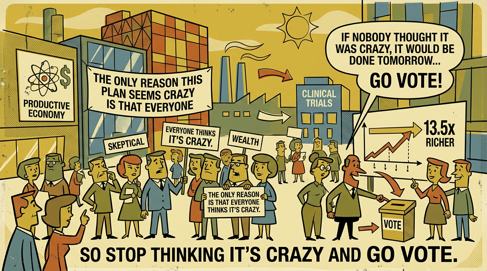
:::
