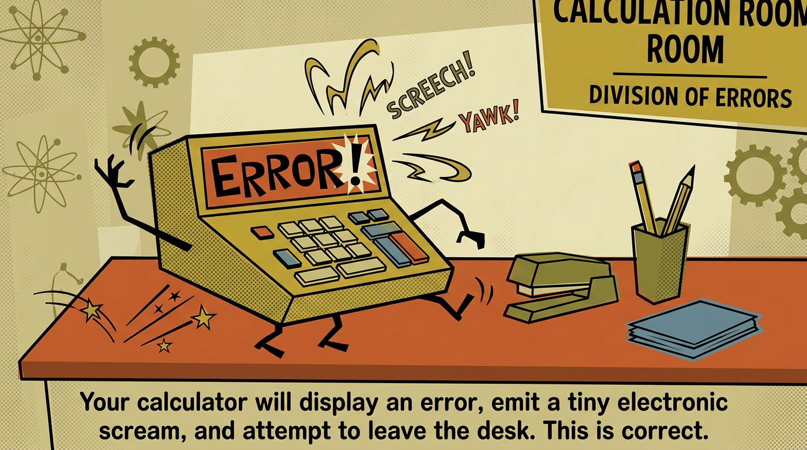
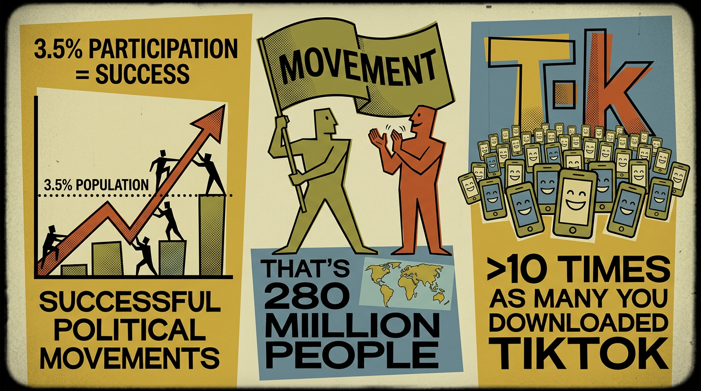
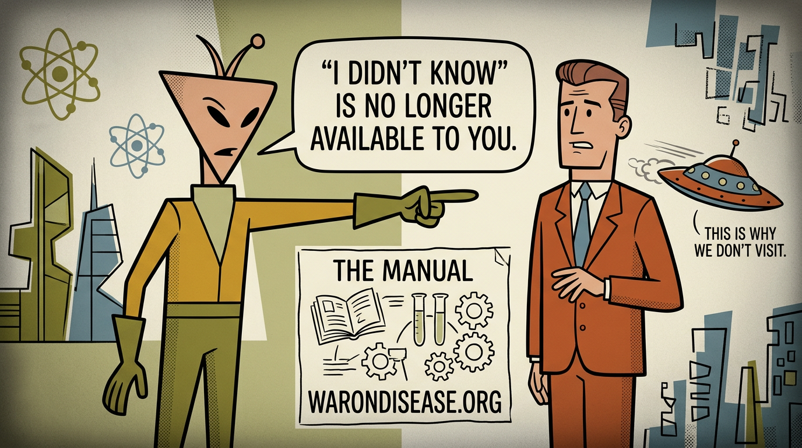

**Target audience:** Funders and investors, framed as instruction, not solicitation\
**Tone:** Wishonia/Philomena Cunk deadpan. Genuine alien confusion at human behavior.\
**Duration:** ~3 minutes (~450 words at narration pace)\
**Visual style:** 1950s educational film cartoon ("Duck and Cover" meets Wishonia)

---

## Scene 1: The Instruction Manual {.scene}

Hello, human. You are holding an instruction manual.

:::{.scene-direction}
**Keyframe:** A pale-skinned young alien woman with small antennae, black bob haircut, and cosmic-patterned dress in a 1950s classroom, holding up an instruction manual the size of a tombstone titled "How to End War and Disease." Aggressively cheerful grin. The clock behind her spins too fast.
**Animation:** She waves with unsettling enthusiasm. Clock hands accelerate. Slow push in.
:::

:::{.scene-keyframe}

:::

By the time you complete the steps in it, you will have prevented  and  of suffering.

:::{.scene-direction}
**Keyframe:** An instruction manual titled "How to End War and Disease" so thick it has cracked a school desk in half. Glowing statistics float up from the pages. A second desk nearby has already collapsed under a different copy.
**Animation:** Pages flip. Glowing numbers rise like embers. The desk sags further.
:::

:::{.scene-keyframe}

:::

I can see your expression and I believe the word for it is "skeptical."

:::{.scene-direction}
**Keyframe:** A cartoon businessman on a tiny chair, arms crossed, smug. A pale-skinned young alien woman with small antennae, black bob haircut, and cosmic-patterned dress crouches beside him with a magnifying glass, examining him like an insect specimen.
**Animation:** She circles him, tilting her head at impossible angles. His smug expression falters.
:::

:::{.scene-keyframe}

:::

Every minute you make that face,  humans permanently stop.

:::{.scene-direction}
**Keyframe:** A giant cuckoo clock where a tiny grim reaper pops out instead of a bird. Each cuckoo, a person silhouette below vanishes. The reaper looks increasingly apologetic. A pile of tiny scythes accumulates on the floor.
**Animation:** Reaper cuckoos faster and faster. People vanish. Scythes pile up.
:::

:::{.scene-keyframe}

:::

Please make a different face.

:::{.scene-direction}
**Keyframe:** A pale-skinned young alien woman with small antennae, black bob haircut, and cosmic-patterned dress holding cue cards at the viewer. One card: frowning face with red X. Next card: determined face with green checkmark. She taps the second card. Rejected cue cards litter the floor.
**Animation:** She flips through cards rapidly, settling on the determined one and tapping it impatiently.
:::

:::{.scene-keyframe}

:::

## Scene 2: The Murder Budget {.scene}

Your species spends  times more on weapons than on testing which medicines work.

:::{.scene-direction}
**Keyframe:** A giant brass balance scale. Left side: a single aspirin on a tiny saucer. Right side: an aircraft carrier, tanks, missiles, and a fighter jet crammed on, smashed through the floor. The aspirin side floats in the air.
**Animation:** Another tank drops on. The building shakes. The aspirin bounces, unbothered.
:::

:::{.scene-keyframe}

:::

95% of your diseases have zero approved treatments.

:::{.scene-direction}
**Keyframe:** A police lineup. 20 cartoon disease germs against a height chart. 19 smirk in tiny sunglasses, free to go. One pathetic germ in handcuffs looks confused. A pale-skinned young alien woman with small antennae, black bob haircut, and cosmic-patterned dress watches as detective behind one-way glass, pinching the bridge of her nose.
**Animation:** The 19 free germs high-five and swagger out. The handcuffed one looks around helplessly.
:::

:::{.scene-keyframe}

:::

At the current rate, clearing the queue takes ~.

:::{.scene-direction}
**Keyframe:** A hospital waiting room. A skeleton in a suit sits in a chair, cobwebs connecting him to the armrests. His magazine has crumbled to dust. The "now serving" board shows number 1; his ticket says 3. A potted plant beside him has grown into a tree through the ceiling.
**Animation:** The skeleton checks the board, checks his ticket, settles back in. The tree grows another branch.
:::

:::{.scene-keyframe}

:::

You will be dead long before it finishes, which I mention not to be rude but because you seem weirdly calm about this.

:::{.scene-direction}
**Keyframe:** A man in a cardigan sipping tea in an armchair, serene. His house is engulfed in flames. A mushroom cloud rises through the window. A missile has gone through the roof. He wears an "I voted" sticker.
**Animation:** Flames climb. A beam falls. He turns a page, sips tea. A second missile enters the wall.
:::

:::{.scene-keyframe}

:::

## Scene 3: Cancer and Space Force {.scene}

If cancer had oil reserves, you would have cured it by 2003.

:::{.scene-direction}
**Keyframe:** A cartoon cancer cell the size of a building in a leather executive chair behind a mahogany desk, cigar in mouth, feet up. Fighter jets streak past the office window. Golf trophy on the wall.
**Animation:** Fighter jets zoom past. The cancer cell blows a smoke ring and gestures at its office.
:::

:::{.scene-keyframe}

:::

Instead you spent the repair money on invisible jets

:::{.scene-direction}
**Keyframe:** An empty desert airfield with a single parking spot marked by velvet ropes and a red carpet. Nothing is parked there. An enormous price tag hangs in mid-air. Ground crew stare at the nothing with binoculars.
**Animation:** Ground crew squint through binoculars, scratch their heads. A tumbleweed crosses the frame.
:::

:::{.scene-keyframe}

:::

and Space Force, which exists to fight the zero aliens currently attacking you.

:::{.scene-direction}
**Keyframe:** A pale-skinned young alien woman with small antennae, black bob haircut, and cosmic-patterned dress in front of Earth, surrounded by military satellites with weapons pointed at empty space. She looks deeply personally offended, hand on chest. Not a single other alien in sight.
**Animation:** She spins looking for other aliens, finds none, turns back with profound betrayal. Satellites swivel to track her.
:::

:::{.scene-keyframe}

:::

## Scene 4: The Bond Machine {.scene}

On my planet, people do useful things because they are useful.

:::{.scene-direction}
**Keyframe:** Split-screen. Left: alien planet where creatures casually hand each other things, confused why this needs explaining. One offers a sandwich unprompted. Right: Earth, two businessmen wrestling over a single dollar bill on the ground, ties askew. Passersby step over them.
**Animation:** Aliens exchange items, shrugging. On Earth, the wrestling escalates. A third businessman dives in.
:::

:::{.scene-keyframe}

:::

On yours, you need small pieces of paper with dead presidents on them.

:::{.scene-direction}
**Keyframe:** A pale-skinned young alien woman with small antennae, black bob haircut, and cosmic-patterned dress at a lab bench, examining a dollar bill through a microscope with tweezers. Bite marks on another bill. One stuck in a potted plant's soil. Rejected hypotheses crossed out on a chalkboard.
**Animation:** She pokes the bill, sniffs it, gives up. Looks at camera bewildered.
:::

:::{.scene-keyframe}

:::

So here are the steps. Sell Incentive Alignment Bonds that raise .

:::{.scene-direction}
**Keyframe:** A Rube Goldberg machine across a factory floor. A tiny coin enters a slot on the left. Through gears, pulleys, and chutes, it processes through escalating stages. At the far end, an avalanche of medicine bottles pours into wheelbarrows.
**Animation:** The coin drops in. The machine clanks through its sequence. Medicine bottles cascade out in absurd quantities.
:::

:::{.scene-keyframe}

:::

This funds a campaign to pass a treaty redirecting 1% of military spending to clinical trials.

:::{.scene-direction}
**Keyframe:** An enormous pie chart. 99% is missiles, tanks, and bombs crammed together, spilling over edges. The 1% sliver is barely a line. An ant nearby is wider than it. A magnifying glass on a stand is aimed at the sliver so viewers can find it.
**Animation:** Tiny scissors snip the sliver. It floats away, transforming into medicine bottles. The 99% doesn't notice.
:::

:::{.scene-keyframe}

:::

War bonds, but backwards. Your grandparents funded WW2 at roughly 3% returns. This pays .

:::{.scene-direction}
**Keyframe:** Two framed posters side by side. Left: vintage WW2 war bond poster, heroic soldier, modest return percentage. Right: identical layout but a doctor in a lab coat, and the return percentage has burst through the frame, cracked the wall, and is still growing off the poster's edge.
**Animation:** The new poster's numbers keep growing, cracking the frame. Plaster falls.
:::

:::{.scene-keyframe}

:::

Same structure, fewer Nazis, better spreadsheet.

:::{.scene-direction}
**Keyframe:** A 1950s accountant at his desk, openly weeping with joy. Glasses fogged. The ledger glows green. His calculator has sprouted tiny arms and is giving him a standing ovation. Half-empty tissue box beside him.
**Animation:** He looks at the numbers again and cries harder. The calculator applauds faster.
:::

:::{.scene-keyframe}

:::

## Scene 5: The Patient Industrial Complex {.scene}

Step two. The treaty passes.

:::{.scene-direction}
**Keyframe:** An overdramatic treaty signing ceremony. Diplomats at a long table, openly sobbing. Fountain pens the size of swords. The document glows like a holy relic. Confetti cannons have gone off prematurely. One diplomat has fainted.
**Animation:** A diplomat signs so dramatically his chair falls over. Confetti erupts. Another faints.
:::

:::{.scene-keyframe}

:::

 per year flows from the murder budget to clinical trials.  funds trials.  pays investors.

:::{.scene-direction}
**Keyframe:** A Pentagon-shaped building with a grumpy cartoon face, reluctantly connected by absurdly overcomplicated plumbing to a cheerful glowing hospital. Dollar signs flow through the pipes. A tiny valve reads 1%.
**Animation:** Dollar signs flow through ridiculous plumbing. The Pentagon grumbles. The hospital glows brighter.
:::

:::{.scene-keyframe}

:::

Step three. Returns grow with the treaty, so every bondholder becomes a permanent lobbyist for expanding it.

:::{.scene-direction}
**Keyframe:** Cigar-chomping businessmen in top hats marching toward the Capitol. Same suits, same ruthless expressions. But their arms are full of stethoscopes and medicine bottles. One checks a profit chart and grins wider.
**Animation:** They march with military precision. One holds up a profit chart. Same energy, different cargo.
:::

:::{.scene-keyframe}

:::

Same mechanics as the Military Industrial Complex. Same greed. Fewer corpses.

:::{.scene-direction}
**Keyframe:** A grimy factory with belching smokestacks and ruthless conveyor belt efficiency. Medicine bottles roll off the line where bombs used to. A bored floor manager with a clipboard watches. Efficiency metrics on the wall are identical.
**Animation:** Conveyor belts roll. Medicine bottles drop into crates. The floor manager checks his clipboard.
:::

:::{.scene-keyframe}

:::

Call it the Patient Industrial Complex.

:::{.scene-direction}
**Keyframe:** Factory workers in overalls operating a medicine production line, identical to WW2 factory propaganda posters. Same lunch pails, same determined jaws. One worker rivets a medicine bottle with the same intensity he previously riveted a missile.
**Animation:** Workers operate machinery with practiced efficiency. Lunch break, same sandwiches, back to work.
:::

:::{.scene-keyframe}

:::

## Scene 6: The Evidence {.scene}

You want evidence before following instructions.

:::{.scene-direction}
**Keyframe:** A smug businessman, arms crossed. Behind him, a pale-skinned young alien woman with small antennae, black bob haircut, and cosmic-patterned dress has opened a filing cabinet the size of a building. An avalanche of research papers cascades toward him. She holds an umbrella.
**Animation:** The paper avalanche crashes. Papers bury him to his waist. The alien sighs and closes her umbrella.
:::

:::{.scene-keyframe}

:::

You never required evidence before starting anything stupid, but fine.

:::{.scene-direction}
**Keyframe:** A triptych of proud inventors in gilded frames. Left: beaming inventor beside a cart with square wheels. Center: grinning inventor presenting a submarine with screen doors, water pouring in. Right: delighted inventor holding a solar-powered flashlight in a dark room.
**Animation:** Camera pans the triptych. Each invention fails: cart tips, submarine sinks, flashlight stays dark. Inventors stay proud.
:::

:::{.scene-keyframe}

:::

The RECOVERY trial tested 6 treatments on 48,000 patients at a  cost reduction.

:::{.scene-direction}
**Keyframe:** A hospital cafeteria repurposed as a clinical trial. A scientist sprints between patients crammed everywhere: counters, windowsills, bunk beds. Test tubes balanced on serving trays. Giant test tubes bubble in the kitchen. A cost chart on the wall plummets.
**Animation:** Scientist sprints between patients, stumbles, catches himself. Cost chart drops. A second scientist slides past on a rolling chair.
:::

:::{.scene-keyframe}

:::

During a pandemic. While panicking.

:::{.scene-direction}
**Keyframe:** A scientist mid-fall, tripping over a cable. His flailing arm knocks two beakers together, producing a glowing reaction. Every chart behind him has gone vertical through the ceiling. A second scientist accidentally spills test tubes, each producing a different breakthrough on the floor.
**Animation:** Beakers shatter, reactions cascade. Charts spike through ceiling tiles. Everything goes right by going wrong.
:::

:::{.scene-keyframe}

:::

Your species does its best work when terrified, which suggests your normal system is worse than panic.

:::{.scene-direction}
**Keyframe:** Split-screen. Left: a scientist asleep at a pristine desk, drooling on a flat-lined chart. A spider has built a web between his arm and the lamp. Right: the same scientist, hair on fire, lab exploding, screaming, holding up a glowing cure in each hand. Every chart behind him is vertical.
**Animation:** Left: scientist snores, spider web grows. Right: explosions, breakthroughs erupt, charts rocket upward.
:::

:::{.scene-keyframe}

:::

## Scene 7: The Math {.scene}

After WW2, humans cut military spending by 

:::{.scene-direction}
**Keyframe:** A mechanic's garage on a conveyor belt. A tank rolls in on the left. Confused mechanics disassemble it. A shiny tractor rolls out the right. They keep finding extra parts, tossing them into an overflowing bin.
**Animation:** Tank enters. Parts fly. Tractor emerges. A mechanic holds up a mysterious extra bolt and shrugs.
:::

:::{.scene-keyframe}

:::

and stumbled into the greatest economic boom in history by running out of people to shoot at.

:::{.scene-direction}
**Keyframe:** A suburban neighborhood where houses grow out of the ground like flowers. One house is mid-sprout. A man waters his house with a garden hose. A prosperity chart grows alongside them like a beanstalk off the top of the frame. The sun wears sunglasses.
**Animation:** Houses sprout. The man waters his and it grows a second story. The prosperity beanstalk climbs higher.
:::

:::{.scene-keyframe}

:::

You are being asked for 1%.

:::{.scene-direction}
**Keyframe:** A skyscraper-sized bar chart towers on the left, disappearing into clouds (the post-WW2 military cut). On the right, a nearly invisible speck (1%). An ant next to the 1% bar is taller than it. A tiny flag planted on top so people can find it.
**Animation:** Camera pans up the skyscraper bar through clouds, then whip-pans to the microscopic 1% bar. The ant shakes its head.
:::

:::{.scene-keyframe}

:::

The math:  in.  saved. Return of  to 1.

:::{.scene-direction}
**Keyframe:** A chalkboard filling the frame. Tiny money bag on the left, arrow to a massive crowd of stick figures on the right. The return number at the bottom has outgrown the board, continued across the wall, and is now being written on the ceiling by a pale-skinned young alien woman with small antennae, black bob haircut, and cosmic-patterned dress on a ladder, running out of chalk.
**Animation:** The return number accelerates across the board, off the edge, across the wall. The alien climbs higher. Chalk breaks.
:::

:::{.scene-keyframe}

:::

Your calculator will display an error, emit a tiny electronic scream,

:::{.scene-direction}
**Keyframe:** A giant 1950s calculator with a cartoon face going through all five stages of grief simultaneously. Screen cracked. Numbers pour from every seam. Springs popped from buttons. One key has launched into orbit. Small fires.
**Animation:** Numbers fill the screen faster. Keys pop off. Sparks fly. It vibrates across the desk.
:::

:::{.scene-keyframe}

:::

and attempt to leave the desk. This is correct.

:::{.scene-direction}
**Keyframe:** The same calculator has sprouted tiny legs and is fleeing the desk at full sprint. Tiny bindle over its shoulder. Tiny fedora. Trailing smoke. A green checkmark hovers behind it, stamped and confirmed. It's mid-leap off the desk edge, legs pinwheeling.
**Animation:** It sprints, bindle bouncing. Reaches the edge, looks back at the math, and jumps. Fedora flies off.
:::

:::{.scene-keyframe}

:::

## Scene 8: The Closing {.scene}

Is it physically possible your governments redirect 1%? Do billionaires like money? Do they prefer not dying?

:::{.scene-direction}
**Keyframe:** A 1950s game show set. Three question panels with buzzers. The game show host (a pale-skinned young alien woman with small antennae, black bob haircut, and cosmic-patterned dress in a sequined jacket) files her nails, bored. The contestant's hand hovers, sweating. Confetti cannons pre-aimed. The audience is already standing.
**Animation:** The contestant trembles. The host yawns. Hand hits buzzer. All three panels light up. Confetti erupts.
:::

:::{.scene-keyframe}

:::

You said yes to all of those.

:::{.scene-direction}
**Keyframe:** Aerial view of thousands of tiny cartoon people, every one raising their hand so hard they're lifting off the ground. Some on tiptoe. Some on each other's shoulders. One in the back brought a stepladder.
**Animation:** Hands shoot up in a wave. People levitate slightly. The stepladder person waves frantically.
:::

:::{.scene-keyframe}

:::

There are  billionaires on your planet. The math needs one.

:::{.scene-direction}
**Keyframe:** Thousands of identical cartoon billionaires in top hats stretching to the horizon, dodging a spotlight sweeping overhead. One in the front has been caught mid-tiptoe trying to sneak away. Monocle popped off. The crowd leans away from him.
**Animation:** Spotlight sweeps. Billionaires duck. It lands on the sneaker. He freezes, sighs, steps forward.
:::

:::{.scene-keyframe}

:::

Every minute nobody acts,  humans permanently stop.

:::{.scene-direction}
**Keyframe:** A giant wall clock where the minute hand is a grim reaper's scythe. The reaper is the hour hand, sweating, consulting a clipboard so long it drags across the floor. Each tick, a person silhouette vanishes. He looks exhausted and apologetic.
**Animation:** The scythe ticks. People vanish. The reaper checks his clipboard, sighs, can't keep up.
:::

:::{.scene-keyframe}

:::

The manual is at warondisease.org. The steps are in front of you. The math is done.

:::{.scene-direction}
**Keyframe:** A tiny 1950s television on spindly legs, rabbit ears getting perfect reception for once, shocked by their own competence. The instruction manual "How to End War and Disease" lies open beside it, lit by the TV glow.
**Animation:** Rabbit ears straighten with pride. Manual pages flutter. Warm glow.
:::

:::{.scene-keyframe}

:::

Humans are not stupid. You invented cheese, which is milk you left out until it went bad, but in a good way. That is genius.

:::{.scene-direction}
**Keyframe:** Three-panel comic of cheese's origin. Panel 1: milk on a windowsill, sweating in the sun. Panel 2: curdling in horror at what it's becoming. Panel 3: a glorious cheese wedge with golden halo, cherubs, and heavenly rays. The cheese is surprised by its own magnificence.
**Animation:** Milk sweats. Curdles in horror. Golden light erupts. Cheese ascends with angels.
:::

:::{.scene-keyframe}

:::

You just need to apply that same innovation to not dying.

:::{.scene-direction}
**Keyframe:** A cheese wedge and a DNA double helix in superhero capes, fist-bumping heroically. Enormous sunrise behind them. In the foreground, a pale-skinned young alien woman with small antennae, black bob haircut, and cosmic-patterned dress gives a deadpan thumbs up to camera, one eyebrow raised.
**Animation:** Cheese and DNA fist-bump. Capes billow. The alien gives a deadpan thumbs up and winks. Fade to gold.
:::

:::{.scene-keyframe}

:::
