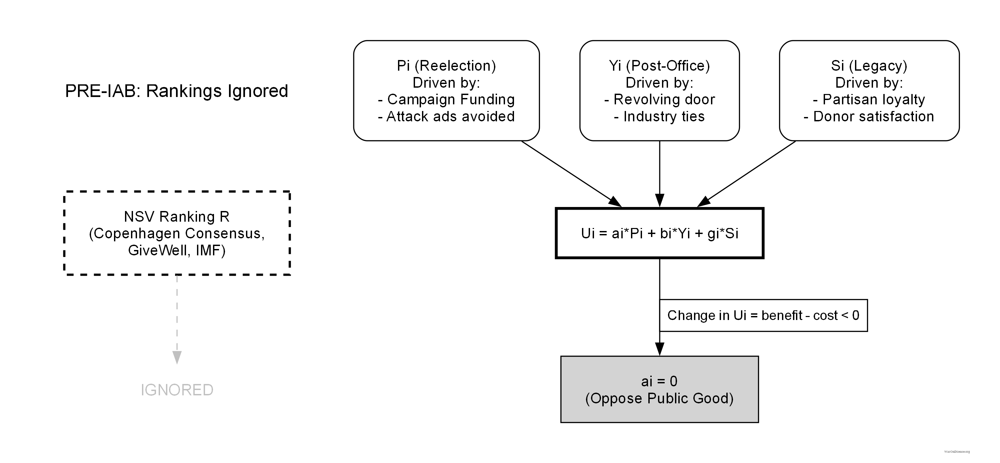
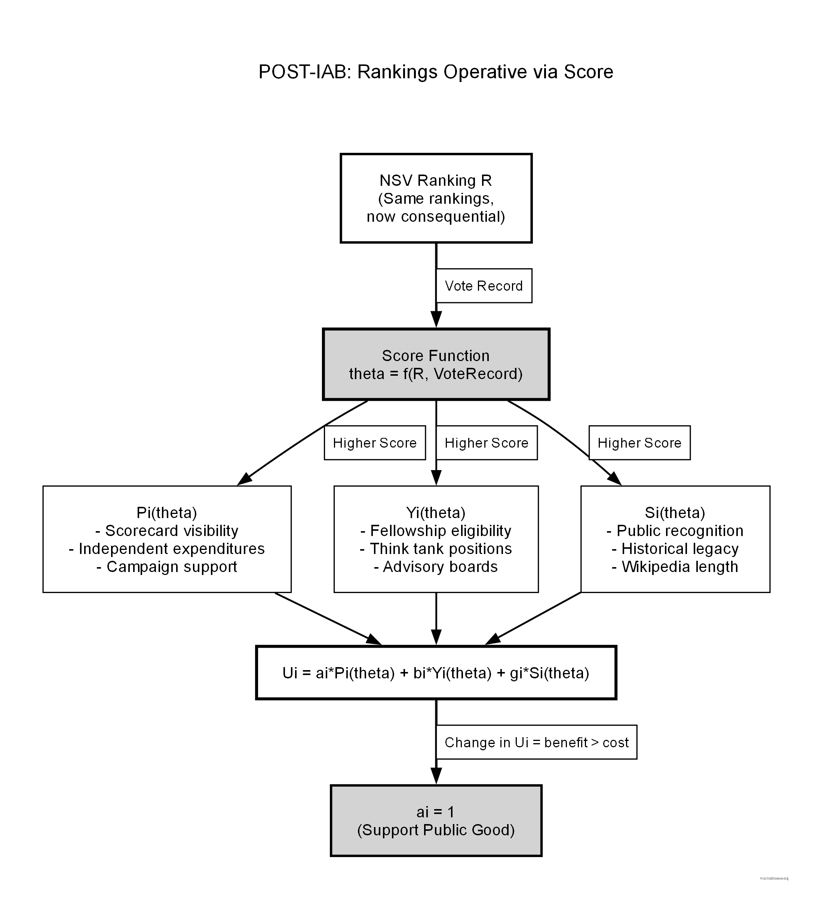

::: {.panel-tabset}

## PRE-IAB: Rankings Ignored

{#fig-utility-pre-iab}

## POST-IAB: Rankings Operative

{#fig-utility-post-iab}

:::

The IAB mechanism does not require politicians to become better people or to care about social welfare intrinsically. It simply redirects their existing selfish utility maximization toward welfare-improving outcomes.

**Same selfish optimization, radically different equilibrium.** This is the core mechanism design contribution.
