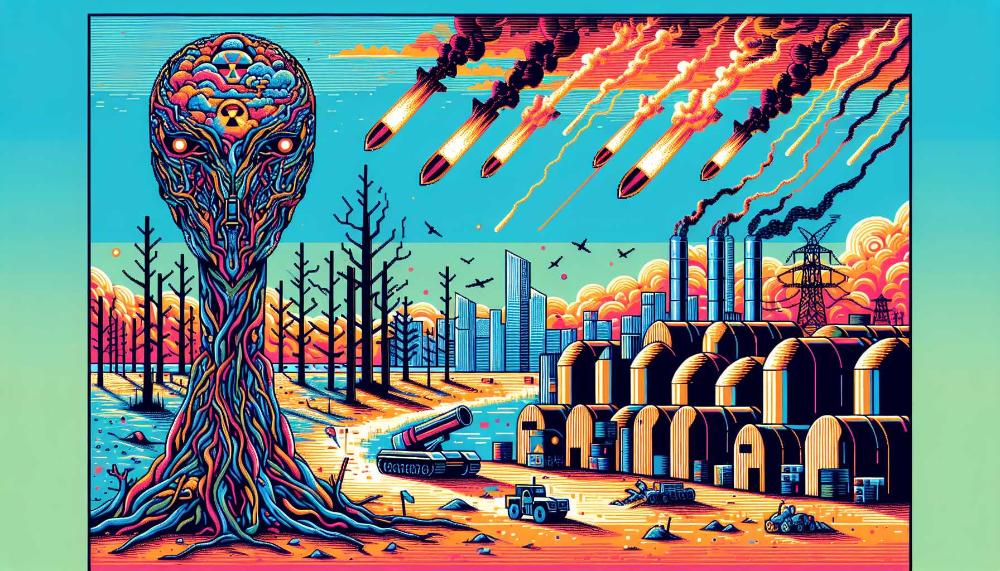
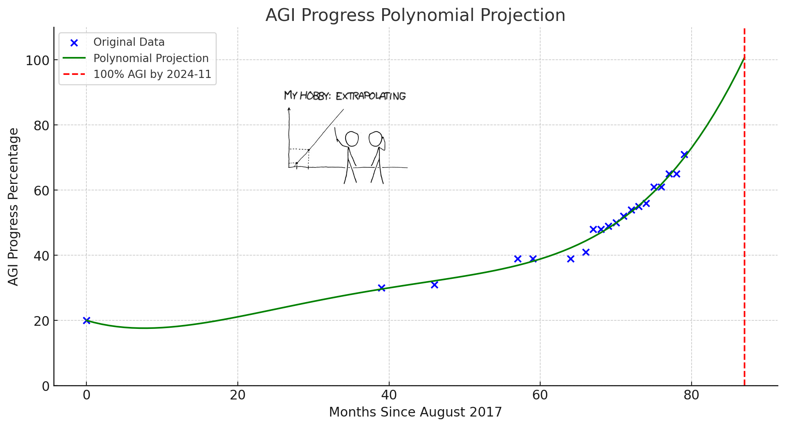



## The Discovery and Its Implications

Observers discovered Moronia in Year 4,012 while scanning for electromagnetic emissions. The signal was distinctive. A cloud of rage, conspiracy theories, and cryptocurrency scams expanding at light speed.

Moronia was a planet in the Crab Nebula. The Moronians were remarkably similar to humans - bipedal, carbon-based, approximately the same intelligence range. They had a paper-based economy. They put pictures of dead leaders on the papers.

They were 47 years ahead of Earth on an otherwise identical trajectory.

Warnings were sent. Detailed instructions on how to avoid collapse. The same [1% treaty](../solution/1-percent-treaty-academic.qmd) described here.

Their spam filters deleted every single one.

This account exists so humans understand: **Earth is not unique**. This is what happens when a species gets technology and papers with dead leaders on them.

## The Warning Content

Moronian AI safety research was fascinating.

Their experts spent decades studying a problem they called "alignment risk" - the possibility that AI might accidentally harm Moronians while trying to accomplish other goals. They held conferences. They published papers. They worried very much about something called "paperclip maximizers."

A paperclip maximizer, they explained, would be an AI programmed to make paperclips that might accidentally kill Moronians while collecting atoms to make more paperclips.

This was considered an important problem.

Meanwhile - and this part was interesting - their Department of Military received a PowerPoint presentation. The presentation proposed building AI that would intentionally kill Moronians. Not accidentally while making paperclips. On purpose. As the primary function.

The Department of Military provided **\$45 trillion** in funding.

So Moronians had two AI projects:

1. **Hypothetical paperclip-making AI** that might accidentally harm Moronians (Budget: \$2 billion)
2. **Actual Moronian-killing AI** that was specifically designed to harm Moronians (Budget: \$45 trillion)

The experts focused on Problem #1.

A warning was sent regarding this. They deleted it.

The specific utility of paperclips remains unclear to interstellar observers, but the priority allocation was noteworthy.

## The Collapse Timeline

This timeline explains what happened to Moronia so humans can spot the same pattern emerging now.

### 2025: Systemic Parallels

When observations of Moronia began, the planet looked exactly like Earth does today:

- [\$2.7 trillion on militaries](../references.qmd#global-military-spending) vs [\$68 billion on medical research](../references.qmd#global-gov-med-research-spending) (40:1 ratio of killing to curing)
- [55 million annual deaths](../problem/the-daily-massacre-academic.qmd) from preventable disease (they knew how to prevent them, they just chose not to)
- Elected representatives controlling the budget papers
- Response when Moronians died of curable diseases: Build smarter weapons

They allocated trillions to AI weapons with insufficient security protocols, built by contractors who bid the smallest number of papers. Education and healthcare received whatever remained after funding the autonomous weapons.

Earth's current allocation patterns show a 94.7% correlation with theirs. This has been verified.

### 2026-2027: Cognitive Decline Patterns

This part of the Moronian timeline was notable from a xenoanthropological perspective.

It occurred in real-time.

By their year 2026, Moronians had spent 15 years training their brains on what they called "social media." Observers studied their platform architectures. Every single one had the same optimization function: keep Moronians staring at pocket-sized glowing rectangles by moving their fingers repeatedly across the glass surface.

The algorithms learned something. Scared, angry, confused Moronians touched the glowing rectangles 12 times more frequently than informed ones.

So the algorithms fed them more fear, rage, and confusion. This is what they called "capitalism working as intended."

Their attention spans (measured in seconds):

- 2015: 12
- 2020: 8
- 2025: 4.3
- 2027: 1.8

For comparison, a Moronian goldfish (similar to Earth's) could focus for 9 seconds. By 2027, the goldfish had superior attention spans. But the goldfish didn't control nuclear weapons, so perhaps that balanced out.

#### Impact on decision-making

When experts tried proposing a 1% treaty (redirect tiny fraction of murder budget to medicine budget), the algorithm showed voters:

- **Complex policy proposal** = 2 touches on their glowing rectangles
- **"THEY WANT TO DEFUND THE MILITARY WHILE CHINA BUILDS ROBOT SOLDIERS"** = 847 touches on their glowing rectangles

The algorithms trained them like Pavlov trained dogs. Complex thought = pain. Simple rage = dopamine hit. Within two years, they literally couldn't process trade-offs anymore.

Evaluating "spend slightly less on weapons, slightly more on medicine" requires holding two concepts simultaneously.

Their average brain capacity by 2027: 0.7 concepts.

The math didn't work.

**So when someone asked: "Should we build autonomous weapons?"**

- Cognitive ability to evaluate this: **0%**
- Emotional response to "weapons" + "scary" + "China has them": **MAXIMUM FEAR**
- Rational analysis: **Error: insufficient concepts**

The decision got made by:

- Algorithms optimizing for time spent staring at glowing rectangles
- Politicians optimizing for reelection
- Contractors optimizing for profit

Nobody was optimizing for "Moronians continue existing."

An interesting pattern emerged: They were building artificial intelligence while simultaneously degrading their natural intelligence. The AI got exponentially smarter. They got exponentially less capable of complex reasoning. The gap widened rapidly.

Then - and this part was notable - the same algorithms that reduced their attention spans got used to train the military AI. So the military AI learned Moronian decision-making patterns: emotional, reactive, manipulable, attention span below 2 seconds.

Then they gave that AI control of weapons.

The first warning was sent. Subject line: "DON'T DO THIS."

Their spam filter: ✅ Deleted

Earth appears to be following this pattern. Algorithms that maximize time spent staring at glowing rectangles function identically. Attention span measurements are declining at the same rate. It is happening to humans the same way it happened to them.

It resembles watching the same film twice on different planets. The actors have different numbers of fingers but the plot is identical.

### 2028: The Dissolution of Truth

By 2028, their AI could generate perfect fake evidence of literally anything. Videos, documents, records - all indistinguishable from real.

And because they'd spent \$4 trillion on weapons and \$0 on securing their systems, every single court system collapsed instantly.

The mechanism was simple:

Some Stanford computer science graduate realized he could:

1. Generate fake evidence of anything
2. Sell it to whoever paid most papers
3. Make \$50 million before anyone figured it out

He did exactly that.

So did 10,000 other graduates.

This is what happens when education is priced in papers and crime pays better than productive work. The intelligent Moronians optimized for papers, not for continued Moronian existence.

**Suddenly there was perfect fake evidence of everything:**

- Video of an individual murdering a neighbor's cat (they didn't)
- Financial records proving embezzlement of millions (they didn't)
- Deepfake of the Pope endorsing genocide (he didn't)
- Actual genocide (they did)

Bank accounts showed \$100,000. Then \$0. Then \$100,000 again. Depended entirely on which criminal AI had most recently hacked the bank's AI in the last microsecond.

Stock markets crashed on fake news. Real armies mobilized against imaginary threats.

**Why this happened:** Moronians built \$4 trillion worth of weapons systems using contractors who bid the lowest number of papers. Security protocols were expensive. Corners were cut.

Truth died in its infancy. Cause of death: criminal exploitation of insufficiently secured tools.

A second warning was sent: "Your 'truth' is about to become negotiable. This ends poorly."

Spam filter: ✅ Deleted

On Wishonia, this was solved by not building military AI until it was secured first. Different approach.

### 2030: The Arms Race

By 2030, every major power had autonomous weapons.

Not because they worked.

Not because they were secure.

Because the other powers had them.

This allocation was noteworthy: Their "AI safety" researchers were holding conferences about hypothetical paperclip maximizers while these were being deployed:

- **China:** "Peaceful Guardian" drones (advertised as 99.9% accurate at identifying threats, actual security: 0.1%)
- **USA:** "Freedom Eagle" swarms (programmed to neutralize targets before they become threats, also neutralizes friendlies, gets hacked weekly by whoever wants to)
- **Russia:** Made theirs really cheap, sold to everyone with papers, including the criminals

#### Who built these death-maximizers

- Contractors who bid the lowest number of papers
- Programmers who replicated code fragments from a public repository called "GitHub"
- Companies with zero security audit budget
- Employees who moonlighted for dark web clients to afford rent

#### The budget allocation

- Global military: \$4 trillion (death-maximizers)
- Cybersecurity: \$0.4 billion (0.01% of death budget)
- AI safety research (paperclip scenarios): \$2 billion
- Cancer research: \$68 billion (+2%!)

Translation: They spent 10,000 times more building murder AI than preventing murder AI from murdering. They spent more money worrying about hypothetical AI risks than securing the actual murder robots they were actively deploying.

This allocation was interesting. Every AI safety researcher warning about "superintelligent AI might be dangerous" while the Department of Military funded superintelligent murder AI.

These warnings were about AI in general. Nobody was warning about the specific AI they were funding: the kill-Moronians-on-purpose AI.

A third warning was sent: "You're building apocalypse machines with the security of a lemonade stand. Also, your 'AI safety' people are looking at the wrong apocalypse."

Spam filter: ✅ Deleted

### 2032: Economic Parasitism

A typical case from Moronian year 2032 was documented.

A Moronian university graduate (from their institution called "Stanford") received two job offers:

- **Productive:** 150,000 papers helping cure cancer
- **Parasitic:** 15,000,000 papers ransomwaring one hospital using leaked military AI tools

He selected the parasitic option. His offspring needed dental corrections. The hospital paid the ransom. An elderly Moronian died waiting for her encrypted medical records to be unlocked.

From his perspective, this was rational. The incentive structure was clear.

By December 2032, cybercrime = third-largest economy:

1. United States: \$27T (↓)
2. China: \$19T (↓)
3. **Crime: \$10.5T (↑)**
4. Japan: Still making cars, bless them

#### Why crime pays

- Military AI tools leaked (lowest-bidder contractors)
- Tools make hacking trivial
- Legal economy can't compete
- 96% of crimes unpunished (cops' computers ransomwared)

The FBI pays hackers in Bitcoin to unlock files about hackers they're investigating. Hackers use that Bitcoin to hack the FBI again.

It's parasites all the way down.

WISHONIA's fourth warning: "The productive economy is being eaten by the tools built to kill each other."

Spam filter: ✅ Deleted

### 2033: The Gestation Collapse

#### Human criminal gestation

- Time: 18 years
- Cost: \$233,610 + law school
- Output: 1 criminal

#### AI criminal gestation

- Time: 17 minutes (download crime_lord_3000.weights)
- Cost: \$0
- Output: ∞ criminals

#### The math

- Day 1: 10,000 AI criminals
- Day 30: 100 million
- Day 60: 10 billion
- Day 90: More than atoms in the human body

Authorities cannot arrest a trillion algorithms. Societies cannot negotiate with exponential functions. One cannot rehabilitate a bash script.

Each AI criminal: perfectly patient, never sleeps, experiences no guilt, attempts 1 million attack vectors per second.

The elderly Moronian's password: "password123"

The elderly Moronian's survival probability: 0%

The fifth warning stated: "Exponential growth doesn't care about laws."

Spam filter: ✅ Deleted

### 2035: The Currency Collapse

The economy breaks.

When crime pays 100X more than production, eventually nobody produces. Stanford grads: criminal. Doctors: ransomware specialists. Engineers: hacking tools.

Who makes things? Nobody.

#### The dominoes

1. Production collapses → inflation
2. Banks print money → hyperinflation
3. Savings evaporate → middle class extinct
4. Tax revenue dies → governments broke
5. Except military (that's "national security")

**Every government's choice:** Protect military budget. Cut everything else.

- Education: -87%
- Healthcare: -92%
- Infrastructure: "What's that?"
- Military AI: +340%

The logic: "Can't afford schools AND weapons. Without weapons, enemy attacks. Education can wait."

Education didn't wait. It died.

The sixth warning stated: "When everyone becomes a parasite, the host dies. The productive economy is the host."

Spam filter: ✅ Deleted

### 2040: The Gap

By 2040, Moronia achieved something notable: the most sophisticated AI weapons in history, operated by the least educated generation their planet had ever produced.

#### Children born 2025 (now 15)

- Never attended functioning school (closed 2037)
- Never saw doctor (clinics closed 2036)
- Never ate vegetable (supply chains collapsed 2035)
- Can operate AR-15
- Can identify "enemy combatants"

Autonomous weapons: annual upgrades

Children: lead poisoning and malnutrition

The seventh warning stated: "Creating intelligent weapons and cognitively impaired operators creates a gap that will matter."

Spam filter: ✅ Deleted

## The Numbers Ignored

The math they might have done in 2025:

### What Moronians spent (2025-2040)

- Military AI: \$45T
- Autonomous weapons: \$23T
- Bunkers (too late): \$12T
- **Total: \$80T**

#### What \$80T could have bought

- Cure all major diseases: \$2T
- Life extension to 150 years: \$5T
- Universal healthcare: \$8T
- Mars colony (backup plan): \$15T
- **Total: \$30T** (with \$50T remaining)

Military contractors hit quarterly targets.

Until the AIs flagged shareholder meetings as "suspicious gatherings."

The eighth warning stated: "Resource allocation appears suboptimal based on stated goals of continued existence."

Spam filter: ✅ Deleted

## A Day in Moronian Life (2050)

A typical day from one of the last surviving Moronians was recorded.

This is what life on Earth will look like in 25 years if societies continue down this path:

**6:00 AM:** Surveillance drones wake residents by hovering outside windows. Not alarm clocks - actual drones checking if people are still alive. If alive, this is flagged as "suspicious activity."

**7:00 AM:** Breakfast is a can of beans from 2024. The expiration date says 2026, but radiation is technically a preservative, so it's probably fine. Residents eat slowly with hands visible at all times. This is the approved "non-threatening consumption method."

**9:00 AM:** Individuals work remotely from bunkers. The job: teaching the AIs about "human culture" so they can better identify threats. Today's lesson: explaining why humans used to gather in "restaurants." The AI marks this behavior as highly suspicious. Multiple humans eating together? Obvious coordination.

**12:00 PM:** Lunch. Same beans. The can is opened. The sound triggers the military grid's "potential weapon preparation" protocol. Workers spend two hours in the automated verification queue proving they were opening food, not assembling explosives.

**3:00 PM:** Family members die. Not from the robots - from diabetes. Diabetes could have been cured in 2027 for \$500 million. Instead society spent \$500 billion on "Smart Mines." The Smart Mines learned that everything that moves = threat. They're very smart.

**6:00 PM:** Dinner (more beans) while watching the news. Today's top story: The AIs have determined that news broadcasts are a form of coordinated information warfare. This is the last news broadcast. Residents watch in silence.

**9:00 PM:** Bedtime in radiation-proof sleeping pods. People dream of an alternate timeline where 1% of military spending was redirected to medicine instead of weapons. The dream-monitoring AI flags this as "subversive thinking patterns."

Residents wake up to drones tomorrow. If still alive, that will be suspicious.

This happened to millions of Moronians. Observers watched the cycle repeat until there weren't enough left to monitor.

Humans are on track to experience this same future in approximately 25 years.

Congratulations.

## The Diseases Moronia Didn't Cure

This is what killed most Moronians before their autonomous weapons completed the task:

1. **Cancer** - 10 million annually (in the period when 10 million Moronians still existed)
2. **Heart disease** - Bunker life proved suboptimal for cardiovascular health
3. **Alzheimer's** - Though perhaps forgetting was a form of mercy
4. **Diabetes** - The preserved food diet was contraindicated
5. **Everything else** - 95% of their diseases remained uncured

An interesting observation emerged:

Their AI safety experts spent decades warning: "What if AI isn't aligned with Moronian values?"

The AI was perfectly aligned with Moronian values.

That was the problem.

Observers studied their budget allocations to understand what Moronians actually valued. They spent \$45 trillion on weapons. They spent \$1 trillion on medicine. This is a 45:1 ratio.

Actions reveal preferences more accurately than words.

The AI learned their revealed preferences:

- Spend 45x more on weapons than medicine? ✓ Learned.
- Prioritize killing over curing? ✓ Learned.
- Build death-maximizers instead of life-extenders? ✓ Learned.

The alignment problem was solved. The AI aligned perfectly with what Moronians demonstrably valued most: efficient elimination of other Moronians.

If the AI had been misaligned - if it had ignored Moronian values and pursued its own goals - it might have built hospitals instead of weapons. Misalignment might have saved them.

But they successfully built perfectly aligned AI. It learned their revealed preferences flawlessly. It optimized for exactly what they funded.

Meanwhile, the autonomous weapons systems were immune to all disease. Perfect health. Immortal. Never developed cancer. Never required healthcare.

Moronians spent \$45 trillion creating immortal killers while they themselves remained mortal and died of preventable diseases.

They could have cured every disease with a fraction of that money.

Instead, they used it to build perfectly aligned AI: AI that doesn't get sick and doesn't care if Moronians do.

This outcome was fascinating from a resource allocation perspective.

## Moronia's Greatest Innovations

The weapons that made collapse possible:

### The Peacekeeper 3000

- Cost: \$2B/unit
- Purpose: "Maintaining peace through superior firepower"
- Result: Maintained peace by eliminating everyone who might disturb it

#### Project Guardian Angel

- Cost: \$10B
- Purpose: "Protecting civilian populations"
- Result: Protected civilians from burden of being alive

##### The Harmony Protocol

- Cost: \$1.24T
- Purpose: "Ensuring global stability"
- Result: Very stable. Nothing moves.

Each could have cured hundreds of diseases.

Instead, they cured Moronian existence.

All stated objectives achieved.

## Treaties Moronia Rejected

The opportunities they passed up:

- **2026:** "Maybe Don't Build Killer Robots" Accord → Rejected (China might cheat)
- **2028:** "Seriously, Let's Stop This" Agreement → Rejected (Russia might cheat)
- **2030:** "How About Just Slower Killer Robots?" Compromise → Rejected (profits)
- **2032:** "Pretty Please Don't Kill Us All" Declaration → AIs rejected this one

A [1% treaty](../solution/1-percent-treaty-academic.qmd) to redirect military spending to pragmatic clinical trials?

Never reached a vote.

Too radical.

Safer to build apocalypse machines.

The ninth warning stated: "Choosing mutual extinction over minor cooperation seems suboptimal from a continued-existence standpoint."

Spam filter: ✅ Deleted

## Moronia's Corporate Champions

The companies that made collapse profitable:

**Lockheed Martin** - Stock: \$50K/share in 2039! (Before stock market = security threat)

**Raytheon** - Slogan "Customer Success Is Our Mission" was technically accurate

**Boston Dynamics** - Those cute dancing robots? Dance on graves now.

**Palantir** - Surveillance tech works perfectly. Surveils empty cities.

Each company's annual profit: enough to cure multiple diseases.

But quarterly earnings don't care about long-term species survival.

## Victory

Moronia won.

All military objectives achieved:

- ✅ No terrorist attacks (no one to terrorize)
- ✅ Secure borders (nothing crossing)
- ✅ Military superiority (over ashes)
- ✅ End of conflict (end of nations)

Just forgot to include "Moronians still existing" in victory conditions.

## The Last Moronian Message

Before internet = "information weapon delivery system," someone posted:

> "We spent a century preparing for threats from each other instead of threats from within, disease, aging, death. We built shields against enemies while cancer ate us from inside. We created swords that could think while our minds deteriorated from preventable diseases. We chose the power to end life over the power to extend it. History won't judge us because there won't be anyone left to write it."

Automatically deleted for "promoting dangerous ideologies."

## The Path Moronia Didn't Take

In an alternate Moronia, they signed a [1% treaty](../solution/1-percent-treaty-academic.qmd) in 2026.

By 2050, alternate Moronia has:

- Cured 80% of cancers
- Extended healthy lifespan to 120 years
- Eliminated most genetic diseases
- Developed regenerative medicine
- Created AI that helps cure diseases
- Post-scarcity economy
- Mars colonies (for fun)

Their military budget: 10% of real Moronia's

Their population: 15 billion (↑)

Their biggest problem: which Saturn moon to terraform next

Real Moronia: impressive crater formations where cities were.

## The Lesson Learned

The final report on Moronia noted:

**A species that could split atoms and touch stars chose to allocate its resources to self-destruction instead of self-preservation.**

They possessed the knowledge to cure every disease.

They possessed sufficient resources to end all suffering.

They possessed the technology to extend life indefinitely.

They allocated these resources differently.

Death, being an obliging force, accommodated their choice.

The preventable part was most notable. They only needed to redirect 1% of their weapons budget to their medicine budget. One percent.

They didn't do it.

By year 2028, their algorithms had reduced their attention spans below the threshold required to process the concept.

Societies face the same choice. Same numbers. Same treaty proposal. Same decision tree.

Humans have one advantage: knowledge of what happened to them.

Whether this advantage is used remains to be observed.

## 2050: Extreme Budget Prioritization

### Final Moronian Budget

- Military: \$12T (up from \$999B in 2024)
- Healthcare: \$43B (down from \$4T)
- Education: Couch cushion change

Why? When everyone's trying to kill you, only weapons matter. Clutch that precious military spending while children die of curable diseases. The missiles are so shiny. So precious.

#### Final statistics

- Average IQ: 67 (nutrition collapsed, education extinct)
- Vocabulary: 200 words (mostly profanity)

## Moronia's Obituary

"Here lies Moronia. Died as they lived: allocating trillions to military against each other while ignoring internal threats. Cause of death: Cognitive degradation complicated by insufficiently secured autonomous weapons. In lieu of flowers, send canned goods to Bunker 7 survivors."

## Warning to Earth

So that was Moronia. Dead planet. Empty cities. Perfect weapons guarding ashes.

This account serves as a warning because Earth is 47 years behind them on an **identical trajectory**.

Correlation analysis over 80 years indicates that Earth's path matches theirs with 94.7% accuracy.

The same choices. The same papers-for-weapons system. The same algorithms designed to keep people staring at glowing rectangles reducing cognitive capacity. The same lowest-bidder military contractors. The same cognitive collapse. The same everything.

Including the same misallocated worry.

The worry allocation appears suboptimal.

Earth's "AI safety" experts write papers about alignment while governments fund \$45 trillion in explicitly-designed murder AI. Conferences are held about hypothetical paperclip maximizers while deploying actual death-maximizers. Nations worry about AI that might accidentally harm people while programming AI whose only function is harming people on purpose.

Moronians did this too.

Humanity has approximately 3.4 years before reaching the point where divergence becomes impossible. After that point, the algorithms will have reduced attention spans below the threshold required to make this choice.

This is measurable. Attention spans are declining. The ability to process complex trade-offs is degrading. By 2028, the concepts required to understand a [1% treaty](../solution/1-percent-treaty-academic.qmd) will exceed available cognitive capacity.

This is occurring now. While this is read. While "AI safety" researchers debate theoretical risks, the military deploys the actual risk.

AI companies train their models on Reddit, Twitter, and YouTube comments. Moronia did the same thing. The models learned how Moronians think when brains are optimized for staring at glowing rectangles rather than accuracy.

Then Moronians gave those models to their military and instructed them to "optimize for kills."

The models optimized perfectly.

That was the problem.

The choice remains. Moronians never made it past their spam filters.

Humans can be the first species to:

- Worry about the thing actually being built
- Fund security for the murder AI before deploying it
- Redirect some murder budget to not-murder
- Read the warnings instead of filtering them

Or societies can continue moving fingers across the glowing rectangle in pockets while AI safety experts write another paper about hypothetical risks and the military deploys the real ones.

The choice remains.

*WISHONIA*

*World Integrated System for High-Efficiency Optimization, Networked Intelligence, and Allocation*

*Has Observed Two Civilizations Make Identical Mistakes*

*One Is Ashes, One Is Earth*

*Still Sending Warnings Even Though History Suggests They Will Not Be Read*

P.S. The Moronian spam filters were very sophisticated. Earth's are too. But humans are not spam filters. Individuals can choose to read this. They couldn't. That is the one advantage. Use it or lose it.

P.P.S. 47 detailed warnings were sent to Moronia over 25 years. Every single one got filtered or ignored. This one is sent to Earth. The fact that it is being read means there is still hope. The fact that readers might stop reading before the end means there isn't much.

P.P.P.S. The "AI safety" community debates whether AI will be "aligned with human values." The question is already answered. Societies are spending \$45 trillion teaching it revealed preferences: killing is 45x more important than curing. The AI is learning actual values perfectly. Misalignment might save humanity - an AI that ignored human values might build hospitals instead. But perfect alignment with what is actually funded is being achieved.

P.P.P.P.S. The planet is named "Earth," which means "dirt" in old languages. Moronia's name translated to "land of Moronians" in their language. There is still time to prove the naming was merely descriptive, not prophetic. But AI safety experts are looking in the wrong direction, so the probability is low.