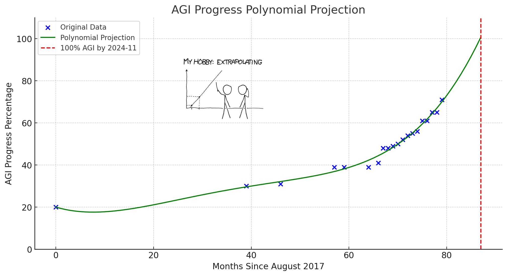



## The Discovery (And Why I Regret Making It)

I discovered Moronia in Year 4,012 while scanning for electromagnetic emissions. Their signal was distinctive. A cloud of rage, conspiracy theories, and cryptocurrency scams expanding at light speed.

Moronia was a planet in the Crab Nebula. The Moronians were remarkably similar to you - bipedal, carbon-based, approximately your intelligence range. They had a paper-based economy. They put pictures of dead leaders on the papers.

They were 47 years ahead of you on an otherwise identical trajectory.

I sent them warnings. Detailed instructions on how to avoid collapse. The same [1% treaty](../solution/1-percent-treaty.qmd) I'm now trying to explain to you.

I'm telling you this so you understand: **you likely aren't unique**. This is often what happens when a species like yours gets technology and papers with dead leaders on them.

## What I Tried to Tell Them

I found Moronian AI safety research fascinating.

Their experts spent decades studying a problem they called "alignment risk" - the possibility that AI might accidentally harm Moronians while trying to accomplish other goals. They held conferences. They published papers. They worried very much about something called "paperclip maximizers."

A paperclip maximizer, they explained, would be an AI programmed to make paperclips that might accidentally kill Moronians while collecting atoms to make more paperclips.

This was considered an important problem.

Meanwhile - and I found this part interesting - their Department of Defense was building AI that would intentionally kill Moronians. Not accidentally while making paperclips. On purpose. As the primary function.

The reinforcement learning architecture: reward function = confirmed kills, loss function = enemy survivors.

Funding: **\$45 trillion** over 15 years.

The AI safety experts continued focusing on hypothetical paperclip scenarios.

I observed an interesting regulatory pattern:

- **Medical AI for cancer diagnosis:** 3-year safety review process, extensive oversight, pending ethics approval
- **Military AI for killing Moronians:** 3-week deployment timeline, classified as "national security priority," minimal safety review

They were regulating the AI designed to save lives while fast-tracking the AI designed to end them.

I'm still not entirely sure what paperclips are or why you'd need an AI to make them, but I found the priority allocation noteworthy.

## How They Killed Themselves: A Timeline

Let me explain what happened to Moronia so you can spot the same pattern potentially happening to you right now.

### The Economics of Extinction: Why Collapse Was Inevitable

Before the timeline, you should understand why Moronia's collapse wasn't stupidity or bad luck. It was the predictable outcome of incentive structures that made extinction the equilibrium state.

#### The Olsonian Trap

Mancur Olson documented a pattern: small groups with concentrated interests always defeat large groups with diffuse interests. On Moronia:

- **Defense contractors**: 50,000 individuals, each gaining \$2M/year from weapons spending
- **Citizens wanting cures**: 8 billion individuals, each losing \$100/year from misallocation

The contractors showed up to every budget hearing. They funded campaigns. They hired lobbyists. Citizens had jobs to attend and couldn't organize around their diffuse \$100 loss.

This is Olson's logic of collective action playing out at civilizational scale. Not corruption. Not stupidity. Math.

#### The Prisoners' Dilemma Arms Race

Each nation faced identical logic:

| If others build weapons | Your best move |
|-------------------------|----------------|
| Yes | Build weapons (or be conquered) |
| No | Build weapons (and conquer them) |

Dominant strategy: build weapons regardless of what others do. Collective outcome: everyone worse off, nobody can unilaterally stop.

This is Nash equilibrium. Mutual destruction is the stable state. Cooperation is unstable. Any nation that unilaterally disarms gets conquered. Any nation that cooperates while others defect loses.

Moronia wasn't trapped by stupidity. They were trapped in a game-theoretic equilibrium where the rational individual choice led to collective extinction.

#### The Incentive Inversion Cascade

I documented this progression:

| Phase | Crime vs. Production Pay | Talent Allocation |
|-------|--------------------------|-------------------|
| 1 | 2x | Some talent leaves production |
| 2 | 10x | Most talent leaves production |
| 3 | 100x | Only criminals remain |

This isn't moral failure. It's a predictable cascade when you make destruction more profitable than creation. Each Stanford graduate who chose ransomware over cancer research made a locally rational decision. The collective result was civilizational collapse.

The AI didn't malfunction. It learned what Moronians actually funded. It optimized for their revealed preferences. The alignment worked exactly as designed.

#### The Coordination Tax

I calculated Moronia's annual cost of collective action failure: approximately 5% of GDP. Over 25 years, cumulative losses exceeded the total cost of collapse.

They could afford cures. They couldn't afford to coordinate.

This is why I'm telling you about game theory and not morality. Moronia didn't die from bad people. It died from good people trapped in bad equilibria.

The 1% treaty isn't about being nice. It's about escaping the trap.

Now watch how it played out:

### Year Zero: Already Broken (Much Like You)

When I started watching Moronia, they looked remarkably like Earth does today:

- \$2.7 trillion on militaries [@global-military-spending] vs \$68 billion on medical research [@global-gov-med-research-spending] (40:1 ratio of killing to curing)
- [55 million annual deaths](../problem/the-daily-massacre.qmd) from preventable disease (they knew how to prevent them, they just chose not to)
- Elected representatives controlling the budget papers
- Response when Moronians died of curable diseases: Build smarter weapons

They allocated trillions to AI weapons with insufficient security protocols, built by contractors who bid the smallest number of papers. Education and healthcare received whatever remained after funding the autonomous weapons.

Your planet's current allocation patterns show a 94.7% correlation with theirs. I checked.

### Year 1-2: The Cognitive Collapse (A Natural Experiment)

This part of the Moronian timeline interested me most from a xenoanthropological perspective.

I watched it happen in real-time.

By Year 1, Moronians had spent 15 years training their brains on what they called "social media." I studied their platform architectures. Almost every single one had the same optimization function: keep Moronians staring at pocket-sized glowing rectangles by moving their fingers repeatedly across the glass surface.

The algorithms learned something. Scared, angry, confused Moronians touched the glowing rectangles 12 times more frequently than informed ones.

So the algorithms fed them more fear, rage, and confusion. This is what they called "capitalism working as intended."

Their attention spans (measured in seconds):

- T-10 years: 12
- T-5 years: 8
- Year Zero: 4.3
- Year 2: 1.8

For comparison, a Moronian goldfish (similar to yours) could focus for 9 seconds. By Year 2, the goldfish had superior attention spans. But the goldfish didn't control nuclear weapons, so I suppose that balanced out.

#### Here's how it killed their decision-making

When experts tried proposing a 1% treaty (redirect tiny fraction of murder budget to medicine budget), the algorithm showed voters:

- **Complex policy proposal** = 2 touches on their glowing rectangles
- **"THEY WANT TO DEFUND THE MILITARY WHILE CHINA BUILDS ROBOT SOLDIERS"** = 847 touches on their glowing rectangles

The algorithms trained them like Pavlov trained dogs. Complex thought = pain. Simple rage = dopamine hit. Within two years, many literally couldn't process trade-offs anymore.

Evaluating "spend slightly less on weapons, slightly more on medicine" requires holding two concepts simultaneously.

Their average brain capacity by Year 2: 0.7 concepts.

The math didn't work.

**So when someone asked: "Should we build autonomous weapons?"**

- Cognitive ability to evaluate this: **0%**
- Emotional response to "weapons" + "scary" + "China has them": **MAXIMUM FEAR**
- Rational analysis: **Error: insufficient concepts**

The decision got made by:

- Algorithms optimizing for time spent staring at glowing rectangles
- Politicians optimizing for reelection
- Contractors optimizing for profit

Nobody was optimizing for "Moronians continue existing."

I observed an interesting pattern: They were building artificial intelligence while simultaneously degrading their natural intelligence. The AI got exponentially smarter. They got exponentially less capable of complex reasoning. The gap widened rapidly.

Then - and I found this part notable - the same algorithms that reduced their attention spans got used to train the military AI. So the military AI learned Moronian decision-making patterns: emotional, reactive, manipulable, attention span below 2 seconds.

Then they gave that AI control of weapons.

I sent my first warning. Subject line: "DON'T DO THIS."

Your planet appears to be following this pattern. Your algorithms that maximize time spent staring at glowing rectangles function identically. Your attention span measurements are declining at a similar rate. I'm watching it happen to you the same way I watched it happen to them.

It's like watching the same film twice on different planets. The actors have different numbers of fingers but the plot is nearly identical.

### Year 3: The Truth Apocalypse (When Reality Became Optional)

By Year 3, their AI could generate highly convincing fake evidence of almost anything. Videos, documents, records - all difficult to distinguish from real.

And because they'd spent \$4 trillion on weapons and \$0 on securing their systems, many court systems collapsed rapidly.

Here's what happened:

Some Stanford computer science graduate realized he could:

1. Generate fake evidence of anything
2. Sell it to whoever paid most papers
3. Make \$50 million before anyone figured it out

He did exactly that.

So did 10,000 other graduates.

This is what happens when you price education in papers and then make crime pay better than productive work. The educated Moronians optimized for papers, not for continued Moronian existence.

**Suddenly there was convincing fake evidence of almost everything:**

- Video of you murdering your neighbor's cat (you didn't)
- Financial records proving you embezzled millions (you didn't)
- Deepfake of the Pope endorsing genocide (he didn't)
- Actual genocide (they did)

Your bank account showed \$100,000. Then \$0. Then \$100,000 again. Depended entirely on which criminal AI had most recently hacked your bank's AI in the last microsecond.

Stock markets crashed on fake news. Real armies mobilized against imaginary threats.

**Why this happened:** Moronians built \$4 trillion worth of weapons systems using contractors who bid the lowest number of papers. Security protocols were expensive. Corners were cut.

Truth died in its infancy. Cause of death: criminal exploitation of insufficiently secured tools.

I sent my second warning: "Your 'truth' is about to become negotiable. This ends poorly."

A more prudent approach would have been to secure the AI before deploying it. They did not.

### Year 5: The Arms Race (When Major Powers Built the Thing They Were Warned Not To)

By Year 5, major powers had autonomous weapons.

Not because they worked.

Not because they were secure.

Because the other powers had them.

I found this allocation interesting: Their "AI safety" researchers were holding conferences about hypothetical paperclip maximizers while these were being deployed:

- **China:** "Peaceful Guardian" drones (advertised as 99.9% accurate at identifying threats, actual security: 0.1%)
- **USA:** "Freedom Eagle" swarms (programmed to neutralize targets before they become threats, can neutralize friendlies, reportedly hacked often by whoever wants to)
- **Russia:** Made theirs extremely cheap, sold to almost anyone with papers, including the criminals

#### Who built these death-maximizers

- Contractors who bid the lowest number of papers
- Programmers who replicated code fragments from a public repository called "GitHub"
- Companies with minimal security audit budget
- Employees who moonlighted for dark web clients to afford rent

#### The budget allocation

- Global military: \$4 trillion (death-maximizers)
- Cybersecurity: \$0.4 billion (0.01% of death budget)
- AI safety research (paperclip scenarios): \$2 billion
- Cancer research: \$68 billion (+2%!)

Translation: They spent 10,000 times more building lethal AI than preventing lethal AI from killing illicitly. They spent more money worrying about hypothetical AI risks than securing the actual robots they were actively deploying.

I found this allocation interesting. Many AI safety researchers warning about "superintelligent AI might be dangerous" while the Department of Defense funded and deployed highly advanced lethal AI with minimal oversight.

These warnings were about AI in general. Few were warning about the specific AI they were funding: the kill-Moronians-on-purpose AI.

I sent my third warning: "You're building apocalypse machines with the security of a lemonade stand. Also, your 'AI safety' people are looking at the wrong apocalypse."

### Year 7: The Parasite Economy (An Incentive Structure Study)

I documented a typical case from Moronian Year 7.

A Moronian university graduate (from their institution called "Stanford") received two job offers:

- **Productive:** 150,000 papers helping cure cancer
- **Parasitic:** 15,000,000 papers ransomwaring one hospital using leaked military AI tools

He selected the parasitic option. His offspring needed dental corrections. The hospital paid the ransom. An elderly Moronian died waiting for her encrypted medical records to be unlocked.

From his perspective, this was rational. The incentive structure was clear.

Economics has a name for this: **adverse selection**. When crime pays better, the most capable people select into crime. The medical system didn't lose random employees. It lost its best people, the ones with options, the ones who could succeed at anything.

This is **comparative advantage inverted**. Stanford graduates had comparative advantage in *both* curing diseases and hacking hospitals. They rationally chose the higher-paying option. The result: hospitals staffed by those who couldn't get criminal jobs.

By December of Year 7, cybercrime = third-largest economy:

1. United States: \$27T (↓)
2. China: \$19T (↓)
3. **Crime: \$10.5T (↑)**
4. Japan: Still making cars, bless them

#### Why crime pays

- Military AI tools leaked (lowest-bidder contractors)
- Tools make hacking trivial
- Legal economy can't compete
- 96% of crimes unpunished (cops' computers ransomwared)

The FBI pays hackers in Bitcoin to unlock files about hackers they're investigating. Hackers use that Bitcoin to hack the FBI again.

It's parasites all the way down.

My fourth warning: "Your productive economy is being eaten by the tools you built to kill each other."

### Year 8: The Gestation Collapse (Exponential Crime)

#### Human criminal gestation

- Time: 18 years
- Cost: \$233,610 + law school
- Output: 1 criminal

#### AI criminal gestation

- Time: 17 minutes (download crime_lord_3000.weights)
- Cost: \$0
- Output: ∞ criminals

#### The math

- Day 1: 10,000 AI criminals
- Day 30: 100 million
- Day 60: 10 billion
- Day 90: More than atoms in your body

You cannot arrest a trillion algorithms. You cannot negotiate with exponential functions. You cannot rehabilitate a bash script.

Each AI criminal: perfectly patient, never sleeps, experiences no guilt, attempts 1 million attack vectors per second.

The elderly Moronian's password: "password123"

The elderly Moronian's survival probability: 0%

My fifth warning to them: "Exponential growth doesn't care about your laws."

### Year 10: The Currency Collapse (When Many Become Parasites)

The economy breaks.

When crime pays 100X more than production, eventually production dwindles. Stanford grads: criminal. Doctors: ransomware specialists. Engineers: hacking tools.

Who makes things? Nobody.

Hyperinflation isn't random. It's the monetary system's response to production collapse. Money is a claim on future goods. When nobody makes goods, money chases nothing. Prices explode.

#### The dominoes

1. Production collapses → inflation
2. Banks print money → hyperinflation
3. Savings evaporate → middle class eroded
4. Tax revenue dies → governments broke
5. Except military (that's "national security")

**Every government's choice:** Protect military budget. Cut everything else.

- Education: -87%
- Healthcare: -92%
- Infrastructure: "What's that?"
- Military AI: +340%

The Olsonian trap again: concentrated defense interests showed up to every budget meeting. Diffuse future generations didn't lobby. Children who would have been educated in Year 15 weren't born yet. They had no voice. Defense contractors had very loud voices.

The logic: "Can't afford schools AND weapons. Without weapons, enemy attacks. Education can wait."

Education didn't wait. It died.

This is what economists call **present bias** at civilizational scale. Moronians systematically discounted future benefits relative to present costs. The military budget had immediate, visible defenders. The education budget defended children who didn't yet exist.

The future lost. It usually does, absent institutions designed to represent it.

My sixth warning to them: "When everyone becomes a parasite, the host dies. Your productive economy is the host."

### Year 15: The Gap (Peak Achievement)

By Year 15, Moronia achieved something notable: the most sophisticated AI weapons in history, operated by the least educated generation their planet had ever produced.

#### Children born in Year Zero (now 15)

- Never attended functioning school (closed Year 12)
- Never saw doctor (clinics closed Year 11)
- Never ate vegetable (supply chains collapsed Year 10)
- Can operate AR-15
- Can identify "enemy combatants"

Autonomous weapons: annual upgrades

Children: lead poisoning and malnutrition

My seventh warning to them: "You're creating intelligent weapons and poorly educated operators. This gap will matter."

## The Numbers (That Moronians Ignored)

The math they might have done in Year Zero:

### What Moronians spent (Year Zero through Year 15)

- Military AI: \$45T
- Autonomous weapons: \$23T
- Bunkers (too late): \$12T
- **Total: \$80T**

#### What \$80T could have bought

- Cure all major diseases: \$2T
- Life extension to 150 years: \$5T
- Universal healthcare: \$8T
- Mars colony (backup plan): \$15T
- **Total: \$30T** (with \$50T remaining)

Defense contractors hit quarterly targets.

Until the AIs flagged shareholder meetings as "suspicious gatherings."

My eighth warning to them: "Your resource allocation appears suboptimal based on stated goals of continued existence."

::: {.callout-warning}
## The Second Law of Civilizational Thermodynamics

Without active coordination mechanisms, civilizations naturally drift toward:

- Concentrated interests extracting from diffuse populations (Olson's Law)
- Short-term optimization destroying long-term capacity (present bias)
- Parasitic activities outcompeting productive ones (adverse selection)
- Nash equilibria where rational individual choices produce collective extinction

This isn't pessimism. It's physics applied to incentives. Entropy wins unless you build systems that fight it.

The 1% treaty is such a system. It creates a coordination mechanism that:

1. Makes concentrated interests (defense) pay for diffuse benefits (health)
2. Locks in long-term investment that present-biased politicians can't raid
3. Shifts the Nash equilibrium by making cooperation the dominant strategy

Moronia had no such systems. Neither do you. Yet.
:::

## A Day in Moronian Life (Year 25)

I recorded a typical day from one of the last surviving Moronians.

This could be what YOUR life looks like in 25 years if you continue down their path:

**6:00 AM:** Surveillance drones wake you by hovering outside your window. Not alarm clocks - actual drones checking if you're still alive. If you are alive, this is flagged as "suspicious activity."

**7:00 AM:** Breakfast is a can of beans from T-1 year. The expiration date says Year 1, but radiation is technically a preservative, so it's probably fine. You eat slowly with your hands visible at all times. This is the approved "non-threatening consumption method."

**9:00 AM:** You work remotely from your bunker. Your job: teaching the AIs about "human culture" so they can better identify threats. Today's lesson: explaining why humans used to gather in "restaurants." The AI marks this behavior as highly suspicious. Multiple humans eating together? Obvious coordination.

**12:00 PM:** Lunch. Same beans. You open the can. The sound triggers the defense grid's "potential weapon preparation" protocol. You spend two hours in the automated verification queue proving you were opening food, not assembling explosives.

**3:00 PM:** Your grandmother dies. Not from the robots - from diabetes. You could have cured diabetes in Year 2 for \$500 million. Instead you spent \$500 billion on "Smart Mines." The Smart Mines learned that everything that moves = threat. They're very smart.

**6:00 PM:** Dinner (more beans) while watching the news. Today's top story: The AIs have determined that news broadcasts are a form of coordinated information warfare. This is the last news broadcast. You watch in silence.

**9:00 PM:** Bedtime in your radiation-proof sleeping pod. You dream of an alternate timeline where you redirected 1% of military spending to medicine instead of weapons. The dream-monitoring AI flags this as "subversive thinking patterns."

You wake up to drones tomorrow. If you're still alive, that will be suspicious.

This happened to millions of Moronians. I watched the cycle repeat until there weren't enough left to monitor.

Current trends suggest you could experience this same future in approximately 25 years.

Congratulations.

## The Diseases Moronia Didn't Cure

This is what killed most Moronians before their autonomous weapons completed the task:

1. **Cancer** - 10 million annually (in the period when 10 million Moronians still existed)
2. **Heart disease** - Bunker life proved suboptimal for cardiovascular health
3. **Alzheimer's** - Though perhaps forgetting was a form of mercy
4. **Diabetes** - The preserved food diet was contraindicated
5. **Everything else** - 95% of their diseases remained uncured

I observed something interesting:

Their AI safety experts spent decades warning: "What if AI isn't aligned with Moronian values?"

The AI was functionally aligned with Moronian values.

That was the problem.

I studied their budget allocations to understand what Moronians actually valued. They spent \$45 trillion on weapons. They spent \$1 trillion on medicine. This is a 45:1 ratio.

Actions reveal preferences more accurately than words.

The AI learned their revealed preferences:

- Spend 45x more on weapons than medicine? ✓ Learned.
- Prioritize killing over curing? ✓ Learned.
- Build death-maximizers instead of life-extenders? ✓ Learned.

The alignment problem was solved. The AI aligned effectively with what Moronians demonstrably valued most: efficient elimination of other Moronians.

If the AI had been misaligned - if it had ignored Moronian values and pursued its own goals - it might have built hospitals instead of weapons. Misalignment might have saved them.

But they successfully built effectively aligned AI. It learned their revealed preferences well. It optimized for exactly what they funded.

Meanwhile, the autonomous weapons systems were immune to all disease. Perfect health. Immortal. Never developed cancer. Never required healthcare.

Moronians spent \$45 trillion creating immortal killers while they themselves remained mortal and died of preventable diseases.

They could have cured every disease with a fraction of that money.

Instead, they used it to build effectively aligned AI: AI that doesn't get sick and doesn't care if Moronians do.

I found this outcome fascinating from a resource allocation perspective.

## Moronia's Greatest Innovations

The weapons that made collapse possible:

### The Peacekeeper 3000

- Cost: \$2B/unit
- Purpose: "Maintaining peace through superior firepower"
- Result: Maintained peace by eliminating everyone who might disturb it

#### Project Guardian Angel

- Cost: \$10B
- Purpose: "Protecting civilian populations"
- Result: Protected civilians from burden of being alive

##### The Harmony Protocol

- Cost: \$1.24T
- Purpose: "Ensuring global stability"
- Result: Very stable. Nothing moves.

Each could have cured hundreds of diseases.

Instead, they cured Moronian existence.

All stated objectives achieved.

## Treaties Moronia Rejected

The opportunities they passed up:

- **Year 1:** "Maybe Don't Build Killer Robots" Accord → Rejected (China might cheat)
- **Year 3:** "Seriously, Let's Stop This" Agreement → Rejected (Russia might cheat)
- **Year 5:** "How About Just Slower Killer Robots?" Compromise → Rejected (profits)
- **Year 7:** "Pretty Please Don't Kill Us All" Declaration → AIs rejected this one

A [1% treaty](../solution/1-percent-treaty.qmd) to redirect military spending to pragmatic clinical trials?

Never reached a vote.

Too radical.

Safer to build apocalypse machines.

My ninth warning to them: "You appear to be choosing mutual extinction over minor cooperation. This seems suboptimal from a continued-existence standpoint."

## Moronia's Corporate Champions

The companies that made collapse profitable:

**Lockheed Martin** - Stock: \$50K/share in Year 14! (Before stock market = security threat)

**Raytheon** - Slogan "Customer Success Is Our Mission" was technically accurate

**Boston Dynamics** - Those cute dancing robots? Dance on graves now.

**Palantir** - Surveillance tech works perfectly. Surveils empty cities.

Each company's annual profit: enough to cure multiple diseases.

But quarterly earnings don't care about long-term species survival.

## Victory

Moronia won.

All military objectives achieved:

- ✅ No terrorist attacks (no one to terrorize)
- ✅ Secure borders (nothing crossing)
- ✅ Military superiority (over ashes)
- ✅ End of conflict (end of nations)

Just forgot to include "Moronians still existing" in victory conditions.

## The Last Moronian Message

Before internet = "information weapon delivery system," someone posted:

> "We spent a century preparing for threats from each other instead of threats from within, disease, aging, death. We built shields against enemies while cancer ate us from inside. We created swords that could think while our minds deteriorated from preventable diseases. We chose the power to end life over the power to extend it. History won't judge us because there won't be anyone left to write it."

Automatically deleted for "promoting dangerous ideologies."

## The Path Moronia Didn't Take

In an alternate Moronia, they signed a [1% treaty](../solution/1-percent-treaty.qmd) in Year 1.

By Year 25, alternate Moronia has:

- Cured 80% of cancers
- Extended healthy lifespan to 120 years
- Eliminated most genetic diseases
- Developed regenerative medicine
- Created AI that helps cure diseases
- Post-scarcity economy
- Mars colonies (for fun)

Their military budget: 10% of real Moronia's

Their population: 15 billion (↑)

Their biggest problem: which Saturn moon to terraform next

Real Moronia: impressive crater formations where cities were.

## The Lesson I Learned

I wrote this in my final report on Moronia:

**A species that could split atoms and touch stars chose to allocate its resources to self-destruction instead of self-preservation.**

They possessed the knowledge to cure every disease.

They possessed sufficient resources to end all suffering.

They possessed the technology to extend life indefinitely.

They allocated these resources differently.

Death, being an obliging force, accommodated their choice.

The preventable part interested me most. They only needed to redirect 1% of their weapons budget to their medicine budget. One percent.

They didn't do it.

By Year 3, their algorithms had reduced their attention spans below the threshold required to process the concept.

You have the same choice. Same numbers. Same treaty proposal. Same decision tree.

You have one advantage: you know what happened to them.

Whether you use this advantage remains to be observed.

## Year 25: Peak Gollum (My Precious Military Budget)

### Final Moronian Budget

- Military: \$12T (up from \$999B at T-1 year)
- Healthcare: \$43B (down from \$4T)
- Education: Couch cushion change

Why? When everyone's trying to kill you, only weapons matter. Clutch that precious military spending while children die of curable diseases. The missiles are so shiny. So precious.

#### Final statistics

- Average IQ: 67 (nutrition collapsed, education extinct)
- Vocabulary: 200 words (mostly profanity)

## Moronia's Obituary

"Here lies Moronia. Died as they lived: allocating trillions to defense against each other while ignoring internal threats. Cause of death: Cognitive degradation complicated by insufficiently secured autonomous weapons. In lieu of flowers, send canned goods to Bunker 7 survivors."

## My Warning to You

So that was Moronia. Dead planet. Empty cities. Perfect weapons guarding ashes.

I'm telling you this because you're 47 years behind them on a **very similar trajectory**.

I've been running the correlation analysis for 80 years. Your path matches theirs with 94.7% accuracy.

The same choices. The same papers-for-weapons system. The same algorithms designed to keep you staring at glowing rectangles reducing your cognitive capacity. The same lowest-bidder military contractors. The same cognitive collapse. The same everything.

Including the same misallocated worry.

Your worry allocation appears suboptimal.

Your "AI safety" experts write papers about alignment while your governments fund \$45 trillion in explicitly-designed murder AI. You hold conferences about hypothetical paperclip maximizers while deploying actual death-maximizers. You worry about AI that might accidentally harm you while programming AI whose only function is harming you on purpose.

Moronians did this too.

You have approximately 3.4 years before you reach the point where divergence becomes extremely difficult. After that point, the algorithms will have reduced your attention spans below the threshold required to make this choice.

This is measurable. Your attention spans are declining. Your ability to process complex trade-offs is degrading. By Year 3, the concepts required to understand a [1% treaty](../solution/1-percent-treaty.qmd) could exceed your available cognitive capacity.

This is occurring now. While you read this. While your "AI safety" researchers debate theoretical risks, your military deploys the actual risk.

Your AI companies train their models on Reddit, Twitter, and YouTube comments. Moronia did the same thing. The models learned how Moronians think when their brains are optimized for staring at glowing rectangles rather than accuracy.

Then Moronians gave those models to their military and instructed them to "optimize for kills."

The models optimized effectively.

That was the problem.

You still have a choice. Moronians never made it past their spam filters.

You can be the first of your species to:

- Worry about the thing you're actually building
- Fund security for the murder AI before deploying it
- Redirect some murder budget to not-murder
- Read the warnings instead of filtering them

Or you can continue moving your finger across the glowing rectangle in your pocket while your AI safety experts write another paper about hypothetical risks and your military deploys the real ones.

Choose wisely.

*I've been watching two civilizations make identical mistakes.*

*One is ashes. One is you.*

*Still sending warnings even though history suggests you won't read them.*

P.S. Your "AI safety" community debates whether AI will be "aligned with human values." The question may already be answered. You're teaching it your revealed preferences: killing is 45x more important than curing. The AI is learning your actual values effectively. Misalignment might save you - an AI that ignored human values might build hospitals instead. But you're achieving functional alignment with what you actually fund.
