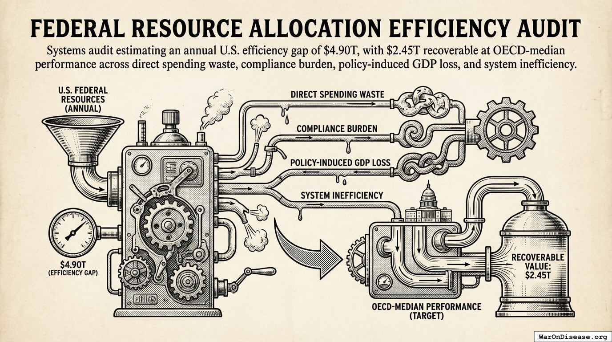

This page provides an index of all academic papers, working drafts, and publications
produced as part of the Disease Eradication Plan project.

## Books

### [The 1% Treaty: Harnessing Greed to Eradicate Disease](https://impact.warondisease.org)

> 6.65k diseases diseases have zero FDA-approved treatments; at current trial capacity, exploring them takes ~443 years. Redirecting 1% of military spending scales capacity 12.3x, cutting the timeline to ~36 years and preventing 10.7B deaths deaths. At $0.0018/DALY, 50.3kx more cost-effective than the best existing interventions. Incentive Alignment Bonds make adoption politically viable.

## Working Papers

### [Federal Resource Allocation Efficiency Audit](https://federal-efficiency-audit.warondisease.org)

> Engineering-style efficiency analysis quantifying approximately $4.9 trillion in annual allocation losses across defense, healthcare, justice, regulatory, and subsidy subsystems, with OECD benchmark comparisons.

### [How to Prevent a Year of Death and Suffering for 84 Cents](https://dfda-impact.warondisease.org)

> At current testing rates, finding treatments for all 6.65k diseases would take 443 years. Pragmatic trials integrated into healthcare increase testing 12.3x, saving 10.7B deaths and eliminating 1931T hours of suffering at $0.841 per year of healthy life saved.

### [Incentive Alignment Bonds: Making Public Goods Financially and Politically Profitable](https://iab.warondisease.org)

> Government spending is optimized for lobbying intensity, not net societal value. Programs with 100:1 benefit-cost ratios get billions while programs with negative returns get hundreds of billions. Incentive Alignment Bonds flip this by creating a capital pool that rewards politicians (via campaign support and post-office opportunities) for funding high-NSV programs over low-NSV alternatives. The result: public good becomes private profit for both investors and elected officials.

### [Optimal Budget Generator: Evidence-Based Budget Allocation Framework](https://obg.warondisease.org)

> The Optimal Budget Generator (OBG) answers: 'How should we allocate the budget to maximize welfare?' using two metrics: real after-tax median income growth and median healthy life years. Unlike isolated spending targets, OBG generates integrated budget recommendations that account for tradeoffs between categories. The Budget Impact Score (BIS) measures confidence in each category's target.

### [Optimal Policy Generator: Evidence-Based Policy Recommendations for Jurisdictions](https://opg.warondisease.org)

> The Optimal Policy Generator (OPG) produces systematic policy recommendations for jurisdictions at any level (country, state, city), generating prioritized enact/replace/repeal/maintain recommendations based on quasi-experimental evidence from centuries of policy variation data.

### [Optimocracy: Evidence-Based Governance Through Outcome-Bound Optimization](https://optimocracy.warondisease.org)

> Political dysfunction costs society trillions annually: $4.90T in documented US waste and $101T in global opportunity costs. Optimocracy proposes algorithmic governance: a system that analyzes historical data to recommend policies that maximize health and wealth, while using a SuperPAC to incentivize politicians to follow the evidence rather than lobbyists. This approach maintains democratic structures while making the ignorance of data politically expensive.

### [The Invisible Graveyard: Quantifying the Mortality Cost of FDA Efficacy Lag, 1962-2024](https://invisible-graveyard.warondisease.org)

> After proving a drug is safe, the FDA requires 8.2 years to prove it works before patients can access it. We estimate this delay cost 102M deaths among people waiting for approved drugs (1962-2024). The cost of blocking good drugs is 3.07k:1 higher than the cost of approving bad ones.

### [The Political Dysfunction Tax](https://political-dysfunction-tax.warondisease.org)

> Quantifying the gap between current global governance and theoretical maximum welfare, estimating a 30-52% efficiency score and $101 trillion in annual opportunity costs.

### [The Price of Political Change: A Cost-Benefit Framework for Policy Incentivization](https://cost-of-change.warondisease.org)

> What's the maximum cost to achieve any policy change through legal democratic channels? $25B for the US, $200B globally. For high-value reforms like military-to-health reallocation, this yields ROI exceeding 400,000:1.

### [Wishocracy: Solving the Democratic Principal-Agent Problem Through Pairwise Preference Aggregation](https://wishocracy.warondisease.org)

> Representative democracy suffers from an inescapable principal-agent problem where elected officials' incentives diverge from citizen welfare. Wishocracy introduces RAPPA (Randomized Aggregated Pairwise Preference Allocation), which aggregates citizen preferences through cognitively tractable pairwise comparisons and creates accountability via Citizen Alignment Scores that channel electoral resources toward politicians who actually represent what citizens want.

### [dFDA: A Decentralized Framework for Drug Assessment Using Two-Stage Real-World Evidence Validation](https://dfda-spec.warondisease.org)

> We present the Predictor Impact Score (PIS), a novel composite metric operationalizing Bradford Hill causality criteria for automated signal detection from aggregated N-of-1 observational studies. Combined with pragmatic trial confirmation (based on evidence from 108+ embedded trials), this two-stage framework generates validated outcome labels at 44.1x lower cost than traditional Phase III trials. This enables continuous, population-scale pharmacovigilance and precision dosing recommendations.

---
