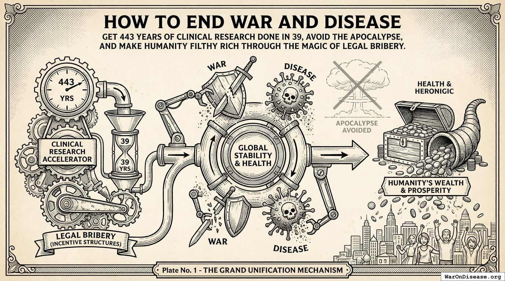

This page provides an index of all academic papers, working drafts, and publications
produced as part of the Disease Eradication Plan project.

### [The 1% Treaty: An Incentive-Compatible Approach to Ending War and Disease](https://manual.warondisease.org/knowledge/economics/1-pct-treaty-impact.html)

> 6,650 diseases have 0 FDA-approved treatments. At current trial capacity (15 diseases/year), exploring the therapeutic search space takes ~443 years. Redirect 1% of military spending ($27.2 billion/year) to pragmatic clinical trials. Trial capacity jumps 12.3x. Search space explored in ~36 years instead of centuries. Average treatment reaches patients 212 years sooner. Timeline shift saves 10.7 billion deaths, valued at $84.8 quadrillion. Cost-effectiveness: $0.00177/DALY, 50.3kx better than bed nets. Even at 1% probability of treaty adoption, risk-adjusted cost-effectiveness remains superior to the best existing global health interventions. Benefit estimates are independent of how adoption is achieved; several specified adoption pathways are costed separately and the cost-effectiveness conclusion survives substituting any of them. For ceiling context, the Minimum Sustainable Trajectory (1% Treaty) reaches 1.71x the Earth baseline after 20 years, with average income at $34,972 and total output at $322 trillion. The Optimal Governance Trajectory reaches 56.7x the Earth baseline, with average income at $1.16 million versus $20,483 on the status-quo path and total output at $10.7 quadrillion ([The Political Dysfunction Tax](https://political-dysfunction-tax.warondisease.org)).

<!--
=== SUBMISSION INFO: The 1% Treaty: An Incentive-Compatible Approach to Ending War and Disease ===

TITLE: The 1% Treaty: An Incentive-Compatible Approach to Ending War and Disease

ABSTRACT:
6,650 diseases have 0 FDA-approved treatments. At current trial capacity (15 diseases/year), exploring the therapeutic search space takes ~443 years. Redirect 1% of military spending ($27.2 billion/year) to pragmatic clinical trials. Trial capacity jumps 12.3x. Search space explored in ~36 years instead of centuries. Average treatment reaches patients 212 years sooner. Timeline shift saves 10.7 billion deaths, valued at $84.8 quadrillion. Cost-effectiveness: $0.00177/DALY, 50.3kx better than bed nets. Even at 1% probability of treaty adoption, risk-adjusted cost-effectiveness remains superior to the best existing global health interventions. Benefit estimates are independent of how adoption is achieved; several specified adoption pathways are costed separately and the cost-effectiveness conclusion survives substituting any of them. For ceiling context, the Minimum Sustainable Trajectory (1% Treaty) reaches 1.71x the Earth baseline after 20 years, with average income at $34,972 and total output at $322 trillion. The Optimal Governance Trajectory reaches 56.7x the Earth baseline, with average income at $1.16 million versus $20,483 on the status-quo path and total output at $10.7 quadrillion ([The Political Dysfunction Tax](https://political-dysfunction-tax.warondisease.org)).

AUTHOR: Mike P. Sinn
EMAIL: m@warondisease.org
AFFILIATION: International Campaign to End War and Disease
ORCID: 0009-0006-0212-1094

KEYWORDS: War on Disease, 1 Percent Treaty, Medical Research, Public Health, Peace Dividend, Decentralized Trials, dFDA, DIH, Victory Bonds, Health Economics, Cost Benefit Analysis, Clinical Trials, Drug Development, Regulatory Reform, Military Spending, Peace Economics, Decentralized Governance, Wishocracy, Blockchain Governance, Impact Investing

JEL CODES: H56, I18, D61, F51, H51

SUBJECT AREAS: Public Health, Medical Research, Peace Economics, Health Economics, Policy Reform
CATEGORY: Non-fiction, Public Policy, Health Economics, Peace Studies
GENRE: Public Policy, Health Economics, Peace Studies

PDF: https://manual.warondisease.org/knowledge/economics/1-pct-treaty-impact.html/1-percent-treaty-impact.pdf
DOI: 10.5281/zenodo.18161560
LICENSE: CC BY-NC 4.0
COPYRIGHT YEAR: 2025

=== PLATFORM STATUS ===
WEBSITE: deployed | https://manual.warondisease.org/knowledge/economics/1-pct-treaty-impact.html
OSF: published | https://osf.io/preprints/socarxiv/vua53_v1
SSRN: pending
ARXIV: pending | category: econ.GN

=== JOURNAL TARGETS ===
Health Affairs (Tier 1): target
Value in Health (Tier 2): target
The Lancet (Tier 1): target (commentary)

SUGGESTED CITATION: Mike P. Sinn (2025). The 1% Treaty: An Incentive-Compatible Approach to Ending War and Disease. Working Paper. Available at https://manual.warondisease.org/knowledge/economics/1-pct-treaty-impact.html

=== STATEMENTS (for journal submissions) ===
COI: The author declares no competing interests, beyond a strong personal preference for being alive, which may bias conclusions toward 'we should spend less money on things that explode and more on things that cure.'
FUNDING: This research received no funding. The annual cost of producing it was less than what the Pentagon spends between breakfast and second breakfast.
ETHICS: This research did not involve human experimentation. Spending 40x more on weapons than disease research while 10 million people die annually from treatable conditions is, however, arguably the largest uncontrolled human experiment in history.
DATA: All data and code used in this analysis are publicly available at https://github.com/wishonia/earth-optimization-protocol

=== SSRN "Publication Details" BOX ===
Select "Enter the details myself", then fill:
  Publisher: International Campaign to End War and Disease
  Publication Date: 2025
  DOI: 10.5281/zenodo.18161560
  URL: https://manual.warondisease.org/knowledge/economics/1-pct-treaty-impact.html
  (Leave Journal, Volume, Issue, Pages blank for working papers)

-->

### [The 1% Treaty](https://manual.warondisease.org/knowledge/solution/1-percent-treaty.html)

> Your public servants used $170 trillion of their salary to murder approximately 310 million humans over the last century of their employment. The murdered included 930,000 doctors, 310,000 scientists, 620,000 engineers, and 102 million children who will never grow up to replace them. They spend 604 dollars on the capacity for orphan manufacturing for every one dollar spent on the trials that might cure what is actually going to kill their citizens. Someone you love is, at this moment, suffering from a disease because the treatment that would help them exists untested on a shelf, because the money that would have tested it was busy turning into a missile. This treaty requires the undersigned nations to be 1% more rational. Each signatory redirects exactly one percent of its military budget to pragmatic clinical trials, perpetual Incentive Alignment Bond [@iab-paper-2025] returns, and a Political Incentive Fund that scores legislators on compliance. Every nation cuts equally, so no country gets weaker. Trial capacity scales 12.3x. The backlog of 6,650 untreated diseases drops from 443 years to 36 years. Treatments arrive 212 years sooner. 10.7 billion preventable deaths averted, valued at $84.8 quadrillion. The percentage can go up. It never goes down. The Treaty is the settlement offer for the liability established in Humanity v. Government, adjudicated through the Court of Humanity [@court-of-humanity-paper-2025], with the economic case quantified in 1% Treaty Impact [@1-pct-treaty-impact-paper-2025].

<!--
=== SUBMISSION INFO: The 1% Treaty ===

TITLE: The 1% Treaty

ABSTRACT:
Your public servants used $170 trillion of their salary to murder approximately 310 million humans over the last century of their employment. The murdered included 930,000 doctors, 310,000 scientists, 620,000 engineers, and 102 million children who will never grow up to replace them. They spend 604 dollars on the capacity for orphan manufacturing for every one dollar spent on the trials that might cure what is actually going to kill their citizens. Someone you love is, at this moment, suffering from a disease because the treatment that would help them exists untested on a shelf, because the money that would have tested it was busy turning into a missile. This treaty requires the undersigned nations to be 1% more rational. Each signatory redirects exactly one percent of its military budget to pragmatic clinical trials, perpetual Incentive Alignment Bond [@iab-paper-2025] returns, and a Political Incentive Fund that scores legislators on compliance. Every nation cuts equally, so no country gets weaker. Trial capacity scales 12.3x. The backlog of 6,650 untreated diseases drops from 443 years to 36 years. Treatments arrive 212 years sooner. 10.7 billion preventable deaths averted, valued at $84.8 quadrillion. The percentage can go up. It never goes down. The Treaty is the settlement offer for the liability established in Humanity v. Government, adjudicated through the Court of Humanity [@court-of-humanity-paper-2025], with the economic case quantified in 1% Treaty Impact [@1-pct-treaty-impact-paper-2025].

AUTHOR: Mike P. Sinn
EMAIL: m@warondisease.org
AFFILIATION: International Campaign to End War and Disease
ORCID: 0009-0006-0212-1094

KEYWORDS: International Treaty, Military Reallocation, Clinical Trials, Peace Dividend, Incentive Alignment Bonds, Political Incentive Fund, Settlement Mechanism, International Law

JEL CODES: F53, H56, I18, K33, O38

SUBJECT AREAS: International Law, Treaty Law, Public Economics, Health Policy, Mechanism Design
CATEGORY: Academic Paper, International Treaty, Public Policy, Political Science
GENRE: International Law, Treaty Drafting, Mechanism Design

PDF: https://manual.warondisease.org/knowledge/solution/1-percent-treaty.html/1-percent-treaty.pdf
DOI: 10.5281/zenodo.20076511
LICENSE: CC BY-NC 4.0
COPYRIGHT YEAR: 2025

=== PLATFORM STATUS ===
WEBSITE: pending | https://manual.warondisease.org/knowledge/solution/1-percent-treaty.html
OSF: published | https://osf.io/preprints/socarxiv/2zybk_v1
SSRN: pending
ARXIV: pending | category: econ.GN

=== JOURNAL TARGETS ===
American Journal of International Law (Tier 1): target
Yale Journal of International Law (Tier 1): target
Journal of Public Economics (Tier 1): target

SUGGESTED CITATION: Mike P. Sinn (2025). The 1% Treaty. Working Paper. Available at https://manual.warondisease.org/knowledge/solution/1-percent-treaty.html

=== STATEMENTS (for journal submissions) ===
COI: The author declares no competing interests beyond a vested interest in not dying of preventable disease, an interest shared with the rest of the species.
FUNDING: This research received no funding from any signatory.
ETHICS: This paper does not involve human subjects. The signatories, however, would govern all of them.
DATA: All parameters, formulas, and citations are publicly available at https://manual.warondisease.org/knowledge/appendix/parameters-and-calculations.html

=== SSRN "Publication Details" BOX ===
Select "Enter the details myself", then fill:
  Publisher: International Campaign to End War and Disease
  Publication Date: 2025
  DOI: 10.5281/zenodo.20076511
  URL: https://manual.warondisease.org/knowledge/solution/1-percent-treaty.html
  (Leave Journal, Volume, Issue, Pages blank for working papers)

-->

### [Ubiquitous Pragmatic Trial Impact Analysis: How to Prevent a Year of Death and Suffering for 84 Cents](https://manual.warondisease.org/knowledge/appendix/dfda-impact-paper.html)

> Of 9.5 million combinations plausible drug-disease pairings, only 0.342% have been clinically tested. At the current discovery rate of 15 diseases/year, clearing this backlog would take ~443 years. A decentralized FDA integrating pragmatic clinical trials into standard healthcare at $929/patient (vs. $41,000 traditional) increases trial capacity 12.3x, reducing backlog clearance to 36 years. Combined with eliminating the 8.2 years post-safety efficacy delay through opt-in trial participation after Phase I, treatments arrive 212 years earlier on average. This timeline shift saves 10.7 billion deaths, averts 565 billion DALYs, and eliminates 1.93 quadrillion hours of suffering (YLD portion of 565 billion DALYs converted to hours) at $0.842/DALY, competitive with bed nets ($89/DALY) at vastly greater scale. Using standard health economic valuation ($150,000/DALY, the US cost-effectiveness threshold; conservative relative to EPA/DOT Value of Statistical Life estimates), full impact yields $84.8 quadrillion in cumulative value (565 billion DALYs cumulative DALYs over the 212 years timeline shift, not annual; 178 thousand:1 ROI).

<!--
=== SUBMISSION INFO: Ubiquitous Pragmatic Trial Impact Analysis: How to Prevent a Year of Death and Suffering for 84 Cents ===

TITLE: Ubiquitous Pragmatic Trial Impact Analysis: How to Prevent a Year of Death and Suffering for 84 Cents

ABSTRACT:
Of 9.5 million combinations plausible drug-disease pairings, only 0.342% have been clinically tested. At the current discovery rate of 15 diseases/year, clearing this backlog would take ~443 years. A decentralized FDA integrating pragmatic clinical trials into standard healthcare at $929/patient (vs. $41,000 traditional) increases trial capacity 12.3x, reducing backlog clearance to 36 years. Combined with eliminating the 8.2 years post-safety efficacy delay through opt-in trial participation after Phase I, treatments arrive 212 years earlier on average. This timeline shift saves 10.7 billion deaths, averts 565 billion DALYs, and eliminates 1.93 quadrillion hours of suffering (YLD portion of 565 billion DALYs converted to hours) at $0.842/DALY, competitive with bed nets ($89/DALY) at vastly greater scale. Using standard health economic valuation ($150,000/DALY, the US cost-effectiveness threshold; conservative relative to EPA/DOT Value of Statistical Life estimates), full impact yields $84.8 quadrillion in cumulative value (565 billion DALYs cumulative DALYs over the 212 years timeline shift, not annual; 178 thousand:1 ROI).

AUTHOR: Mike P. Sinn
EMAIL: m@warondisease.org
AFFILIATION: International Campaign to End War and Disease
ORCID: 0009-0006-0212-1094

KEYWORDS: dFDA, Cost Benefit Analysis, ROI, Return on Investment, Clinical Trials, Drug Development, Health Economics, Pragmatic Trials, Recovery Trial, Real World Evidence, Regulatory Efficiency, Decentralized Fda

JEL CODES: I18, I11, D61, H51, O38

SUBJECT AREAS: Health Economics, Cost-Benefit Analysis, ROI, Clinical Trials, Drug Development
CATEGORY: Academic Paper, Health Economics, Policy Analysis
GENRE: Health Economics, Policy Analysis, Cost-Benefit Analysis

PDF: https://manual.warondisease.org/knowledge/appendix/dfda-impact-paper.html/dfda-impact-paper.pdf
DOI: 10.5281/zenodo.18243914
LICENSE: CC BY-NC 4.0
COPYRIGHT YEAR: 2025

=== PLATFORM STATUS ===
WEBSITE: deployed | https://manual.warondisease.org/knowledge/appendix/dfda-impact-paper.html
OSF: published | https://osf.io/preprints/socarxiv/eqr5b_v1
MEDRXIV: pending
SSRN: pending

=== JOURNAL TARGETS ===
Value in Health (Tier 2): target
Health Affairs (Tier 1): target
PharmacoEconomics (Tier 2): target

SUGGESTED CITATION: Mike P. Sinn (2025). Ubiquitous Pragmatic Trial Impact Analysis: How to Prevent a Year of Death and Suffering for 84 Cents. Working Paper. Available at https://manual.warondisease.org/knowledge/appendix/dfda-impact-paper.html

=== STATEMENTS (for journal submissions) ===
COI: The author declares no competing interests, unless you count a vested interest in not dying, which the author shares with approximately 8 billion co-conspirators.
FUNDING: This research received no funding. The author would like to note that the cost of producing the entire paper was roughly 84 cents per hour of work, which is coincidentally also the cost per DALY it proposes to achieve.
ETHICS: This research did not involve human subjects. The 6,650 diseases with zero FDA-approved treatments were not consulted, as they were busy not being treated.
DATA: All data and code used in this analysis are publicly available at https://github.com/wishonia/earth-optimization-protocol

=== SSRN "Publication Details" BOX ===
Select "Enter the details myself", then fill:
  Publisher: International Campaign to End War and Disease
  Publication Date: 2025
  DOI: 10.5281/zenodo.18243914
  URL: https://manual.warondisease.org/knowledge/appendix/dfda-impact-paper.html
  (Leave Journal, Volume, Issue, Pages blank for working papers)

-->

### [Choose Your Own Earth: A World Without the Political Dysfunction Tax, or Terminal Parasitic Load in 15 Years](https://manual.warondisease.org/knowledge/economics/gdp-trajectories.html)

> Your destructive economy (military spending plus cybercrime) is already 11.5% of GDP and growing faster than your productive economy. At current rates, it reaches the Soviet collapse threshold in 8 years and exceeds productive output in 15. This paper models two GDP trajectories: the optimized path under military-to-medical reallocation, and the default path to civilizational collapse.

<!--
=== SUBMISSION INFO: Choose Your Own Earth: A World Without the Political Dysfunction Tax, or Terminal Parasitic Load in 15 Years ===

TITLE: Choose Your Own Earth: A World Without the Political Dysfunction Tax, or Terminal Parasitic Load in 15 Years

ABSTRACT:
Your destructive economy (military spending plus cybercrime) is already 11.5% of GDP and growing faster than your productive economy. At current rates, it reaches the Soviet collapse threshold in 8 years and exceeds productive output in 15. This paper models two GDP trajectories: the optimized path under military-to-medical reallocation, and the default path to civilizational collapse.

AUTHOR: Mike P. Sinn
EMAIL: m@warondisease.org
AFFILIATION: International Campaign to End War and Disease
ORCID: 0009-0006-0212-1094

KEYWORDS: Gdp Trajectories, Destructive Economy, Parasitic Economy, Military Spending, Cybercrime, Civilizational Collapse, Peace Dividend, Economic Growth, Reallocation, Compound Growth, Expected Value

SUBJECT AREAS: Macroeconomics, GDP Trajectories, Military Spending, Cybercrime, Civilizational Risk, Peace Economics
CATEGORY: Academic Paper, Macroeconomics, Policy Analysis
GENRE: Macroeconomics, Peace Economics, Civilizational Risk Analysis

PDF: https://manual.warondisease.org/knowledge/economics/gdp-trajectories.html/gdp-trajectories-paper.pdf
DOI: 10.5281/zenodo.19076850
LICENSE: CC BY-NC 4.0
COPYRIGHT YEAR: 2025

=== PLATFORM STATUS ===
WEBSITE: pending | https://manual.warondisease.org/knowledge/economics/gdp-trajectories.html
OSF: published | https://osf.io/preprints/socarxiv/j8qza_v1
SSRN: pending

=== JOURNAL TARGETS ===
Journal of Peace Research (Tier 1): target
Defence and Peace Economics (Tier 2): target
Journal of Conflict Resolution (Tier 1): target

SUGGESTED CITATION: Mike P. Sinn (2025). Choose Your Own Earth: A World Without the Political Dysfunction Tax, or Terminal Parasitic Load in 15 Years. Working Paper. Available at https://manual.warondisease.org/knowledge/economics/gdp-trajectories.html

=== STATEMENTS (for journal submissions) ===
COI: The author declares no competing interests, unless you count a preference for civilization continuing to exist, which the author shares with most economists and all of their retirement accounts.
FUNDING: This research received no funding. The author notes that the cost of producing this paper is a rounding error on the $13.2 trillion destructive economy it documents.
ETHICS: This research did not involve human subjects. The destructive economy was not consulted about being modeled, as it was busy growing at 12.6% per year.
DATA: All data and code used in this analysis are publicly available at https://github.com/wishonia/earth-optimization-protocol

=== SSRN "Publication Details" BOX ===
Select "Enter the details myself", then fill:
  Publisher: International Campaign to End War and Disease
  Publication Date: 2025
  DOI: 10.5281/zenodo.19076850
  URL: https://manual.warondisease.org/knowledge/economics/gdp-trajectories.html
  (Leave Journal, Volume, Issue, Pages blank for working papers)

-->

### [The Court of Humanity](https://manual.warondisease.org/knowledge/appendix/court-of-humanity-paper.html)

> Governments wrote laws making it illegal to sue them. The legal term is "sovereign immunity." It descends from "the king can do no wrong," which your species abolished in theory and preserved in practice. Governments waived it for slip-and-falls in federal buildings. They kept it for killing people through war, drug delay, and budget misallocation. This paper proposes the **Court of Humanity**: any human can file, any government can be sued, juries are randomly selected from the global population, and sovereign immunity is not recognized as a defense. Enforcement runs through bond markets, not armies: if the world's investors agree the defendants owe the bill, the defendants' borrowing costs go up whether they cooperate or not. The bill, calculated from the body count using the governments' own life valuations ([@invisible-graveyard-paper-2025]), is larger than any government can pay. They can, however, settle. The 1% Treaty [@1-pct-treaty-impact-paper-2025] is the settlement offer.

<!--
=== SUBMISSION INFO: The Court of Humanity ===

TITLE: The Court of Humanity

ABSTRACT:
Governments wrote laws making it illegal to sue them. The legal term is "sovereign immunity." It descends from "the king can do no wrong," which your species abolished in theory and preserved in practice. Governments waived it for slip-and-falls in federal buildings. They kept it for killing people through war, drug delay, and budget misallocation. This paper proposes the **Court of Humanity**: any human can file, any government can be sued, juries are randomly selected from the global population, and sovereign immunity is not recognized as a defense. Enforcement runs through bond markets, not armies: if the world's investors agree the defendants owe the bill, the defendants' borrowing costs go up whether they cooperate or not. The bill, calculated from the body count using the governments' own life valuations ([@invisible-graveyard-paper-2025]), is larger than any government can pay. They can, however, settle. The 1% Treaty [@1-pct-treaty-impact-paper-2025] is the settlement offer.

AUTHOR: Mike P. Sinn
EMAIL: m@warondisease.org
AFFILIATION: International Campaign to End War and Disease
ORCID: 0009-0006-0212-1094

KEYWORDS: Sovereign Immunity, Tort Law, Decentralized Adjudication, Proof of Personhood, Capital Markets Enforcement, International Law, Government Accountability, Wrongful Death

JEL CODES: K13, K33, K42, H56, D72

SUBJECT AREAS: International Law, Tort Law, Constitutional Theory, Public Choice, Mechanism Design
CATEGORY: Academic Paper, Public Policy, Legal Theory, Political Science
GENRE: International Law, Tort Theory, Mechanism Design

PDF: https://manual.warondisease.org/knowledge/appendix/court-of-humanity-paper.html/court-of-humanity.pdf
DOI: 10.5281/zenodo.20075681
LICENSE: CC BY-NC 4.0
COPYRIGHT YEAR: 2025

=== PLATFORM STATUS ===
WEBSITE: pending | https://manual.warondisease.org/knowledge/appendix/court-of-humanity-paper.html
OSF: published | https://osf.io/preprints/socarxiv/xjs2p_v1
SSRN: pending
ARXIV: pending | category: econ.GN

=== JOURNAL TARGETS ===
Yale Law Journal (Tier 1): target
Harvard International Law Journal (Tier 1): target
Journal of Public Economics (Tier 1): target

SUGGESTED CITATION: Mike P. Sinn (2025). The Court of Humanity. Working Paper. Available at https://manual.warondisease.org/knowledge/appendix/court-of-humanity-paper.html

=== STATEMENTS (for journal submissions) ===
COI: The author declares no competing interests beyond a vested interest in not being killed by any defendant in scope, an interest shared with the rest of the species.
FUNDING: This research received no funding from any defendant.
ETHICS: This paper does not involve human subjects. The defendants do, however, involve all of them.
DATA: All parameters, formulas, and citations are publicly available at https://manual.warondisease.org/knowledge/appendix/parameters-and-calculations.html

=== SSRN "Publication Details" BOX ===
Select "Enter the details myself", then fill:
  Publisher: International Campaign to End War and Disease
  Publication Date: 2025
  DOI: 10.5281/zenodo.20075681
  URL: https://manual.warondisease.org/knowledge/appendix/court-of-humanity-paper.html
  (Leave Journal, Volume, Issue, Pages blank for working papers)

-->

### [Incentive Alignment Bonds: Making Public Goods Financially and Politically Profitable](https://manual.warondisease.org/knowledge/appendix/incentive-alignment-bonds-paper.html)

> Government spending correlates with lobbying intensity, not marginal societal value. Programs with benefit-cost ratios exceeding 100:1 (vaccines, e-governance) receive single-digit billions while programs with negative net returns (military beyond deterrence, fossil fuel subsidies) receive hundreds of billions. This paper introduces Incentive Alignment Bonds (IABs), financial instruments that realign politician incentives with net societal value optimization. IABs create a capital pool funded by treaty inflows (80% to pragmatic clinical trials, 10% to investor returns, 10% to political incentives) that rewards politicians (via campaign support and post-office career opportunities) for funding high-NSV programs over low-NSV alternatives. The mechanism requires no legislative change: existing PAC infrastructure, impact bonds, and prediction markets can deploy it today. Analysis of a proposed 1% Treaty redirecting $27.2 billion/year from military spending to medical research shows a conditional 272% annual return for bondholders while the treaty remains in force. The 90:1 capital asymmetry ($454 trillion in household wealth vs. $5 trillion for concentrated interests) means diffuse beneficiaries can outspend incumbent lobbies once coordination problems are solved. IABs solve that coordination problem by turning political change into an investable asset class. A dominant assurance contract mechanism solves the bootstrap coordination problem: investor participation is the strictly dominant strategy regardless of beliefs about other investors' behavior, closing the end-to-end incentive chain from citizen coordination through treaty passage. At system scale, the Optimal Governance Trajectory reaches 56.7x the Earth baseline after 20 years, raises average income to $1.16 million versus $20,483 on the status-quo path, reaches $10.7 quadrillion in total output, and recovers roughly $101 trillion/year in suppressed value ([The Political Dysfunction Tax](https://political-dysfunction-tax.warondisease.org)).

<!--
=== SUBMISSION INFO: Incentive Alignment Bonds: Making Public Goods Financially and Politically Profitable ===

TITLE: Incentive Alignment Bonds: Making Public Goods Financially and Politically Profitable

ABSTRACT:
Government spending correlates with lobbying intensity, not marginal societal value. Programs with benefit-cost ratios exceeding 100:1 (vaccines, e-governance) receive single-digit billions while programs with negative net returns (military beyond deterrence, fossil fuel subsidies) receive hundreds of billions. This paper introduces Incentive Alignment Bonds (IABs), financial instruments that realign politician incentives with net societal value optimization. IABs create a capital pool funded by treaty inflows (80% to pragmatic clinical trials, 10% to investor returns, 10% to political incentives) that rewards politicians (via campaign support and post-office career opportunities) for funding high-NSV programs over low-NSV alternatives. The mechanism requires no legislative change: existing PAC infrastructure, impact bonds, and prediction markets can deploy it today. Analysis of a proposed 1% Treaty redirecting $27.2 billion/year from military spending to medical research shows a conditional 272% annual return for bondholders while the treaty remains in force. The 90:1 capital asymmetry ($454 trillion in household wealth vs. $5 trillion for concentrated interests) means diffuse beneficiaries can outspend incumbent lobbies once coordination problems are solved. IABs solve that coordination problem by turning political change into an investable asset class. A dominant assurance contract mechanism solves the bootstrap coordination problem: investor participation is the strictly dominant strategy regardless of beliefs about other investors' behavior, closing the end-to-end incentive chain from citizen coordination through treaty passage. At system scale, the Optimal Governance Trajectory reaches 56.7x the Earth baseline after 20 years, raises average income to $1.16 million versus $20,483 on the status-quo path, reaches $10.7 quadrillion in total output, and recovers roughly $101 trillion/year in suppressed value ([The Political Dysfunction Tax](https://political-dysfunction-tax.warondisease.org)).

AUTHOR: Mike P. Sinn
EMAIL: m@warondisease.org
AFFILIATION: International Campaign to End War and Disease
ORCID: 0009-0006-0212-1094

KEYWORDS: Mechanism Design, Public Choice, Political Economy, Collective Action, Social Impact Bonds, Campaign Finance, Incentive Compatibility, Incentive Alignment, Public Goods, Net Societal Value, PAC, Lobbying

JEL CODES: D72, D82, H41, P16

SUBJECT AREAS: Mechanism Design, Public Choice, Political Economy, Collective Action, Campaign Finance
CATEGORY: Academic Paper, Political Economy, Mechanism Design, Public Policy
GENRE: Political Science, Economics, Mechanism Design, Public Policy

PDF: https://manual.warondisease.org/knowledge/appendix/incentive-alignment-bonds-paper.html/incentive-alignment-bonds-paper.pdf
DOI: 10.5281/zenodo.18203221
LICENSE: CC BY-NC 4.0
COPYRIGHT YEAR: 2025

=== PLATFORM STATUS ===
WEBSITE: deployed | https://manual.warondisease.org/knowledge/appendix/incentive-alignment-bonds-paper.html
OSF: published | https://osf.io/preprints/socarxiv/2qbtz_v1
SSRN: pending
ARXIV: pending | category: econ.GN

=== JOURNAL TARGETS ===
Public Choice (Tier 2): target
American Economic Review (Tier 1): target
Journal of Political Economy (Tier 1): target

SUGGESTED CITATION: Mike P. Sinn (2025). Incentive Alignment Bonds: Making Public Goods Financially and Politically Profitable. Working Paper. Available at https://manual.warondisease.org/knowledge/appendix/incentive-alignment-bonds-paper.html

=== STATEMENTS (for journal submissions) ===
COI: The author declares no competing interests and has not, at time of writing, formed a SuperPAC to incentivize politicians into reading this paper, though the analysis suggests this would be cost-effective.
FUNDING: This research received no funding. The author notes that the mechanism described herein could theoretically fund itself, but chose not to test this recursion.
ETHICS: This research did not involve human subjects. Current campaign finance practices, which this research proposes to redirect rather than eliminate, involve the entire electorate, though apparently without their informed consent.
DATA: All data and code used in this analysis are publicly available at https://github.com/wishonia/earth-optimization-protocol

=== SSRN "Publication Details" BOX ===
Select "Enter the details myself", then fill:
  Publisher: International Campaign to End War and Disease
  Publication Date: 2025
  DOI: 10.5281/zenodo.18203221
  URL: https://manual.warondisease.org/knowledge/appendix/incentive-alignment-bonds-paper.html
  (Leave Journal, Volume, Issue, Pages blank for working papers)

-->

### [The People of Earth v. Their Governments](https://manual.warondisease.org/knowledge/appendix/humanity-v-government.html)

> Historians count war deaths. Health economists count drug-delay deaths. Disease researchers count disease deaths. Nobody adds them up. This paper does. The governments of Earth are charged with three counts of negligent mass homicide: (1) killing 310 million people through war, conflict, and democide since 1900; (2) killing 102 million people by blocking access to drugs already proven safe, under the 8.2 years efficacy delay mandated since 1962; and (3) spending the money that could have cured diseases on weapons instead. The drug-approval system kills 3,389 people by blocking good drugs for every one person it saves by blocking bad ones. The defendants had the money. They spent it on missiles. The proposed remedy: move 1% of military spending to clinical trials. The remedy pays everyone involved, because that is the only kind of remedy that has ever worked on humans.

<!--
=== SUBMISSION INFO: The People of Earth v. Their Governments ===

TITLE: The People of Earth v. Their Governments

ABSTRACT:
Historians count war deaths. Health economists count drug-delay deaths. Disease researchers count disease deaths. Nobody adds them up. This paper does. The governments of Earth are charged with three counts of negligent mass homicide: (1) killing 310 million people through war, conflict, and democide since 1900; (2) killing 102 million people by blocking access to drugs already proven safe, under the 8.2 years efficacy delay mandated since 1962; and (3) spending the money that could have cured diseases on weapons instead. The drug-approval system kills 3,389 people by blocking good drugs for every one person it saves by blocking bad ones. The defendants had the money. They spent it on missiles. The proposed remedy: move 1% of military spending to clinical trials. The remedy pays everyone involved, because that is the only kind of remedy that has ever worked on humans.

AUTHOR: Mike P. Sinn
EMAIL: m@warondisease.org
AFFILIATION: International Campaign to End War and Disease
ORCID: 0009-0006-0212-1094

KEYWORDS: Government Failure, Mortality Accounting, Regulatory Economics, Public Choice, Opportunity Cost, Efficacy Lag, Type Ii Error, Democide, Clinical Trials

JEL CODES: I18, H56, K23, D72, I11

SUBJECT AREAS: Mortality Accounting, Government Failure, Regulatory Economics, Public Choice
CATEGORY: Academic Paper, Public Policy, Political Science, Health Economics
GENRE: Mortality Accounting, Public Choice, Health Economics

PDF: https://manual.warondisease.org/knowledge/appendix/humanity-v-government.html/humanity-v-government.pdf
DOI: 10.5281/zenodo.20075757
LICENSE: CC BY-NC 4.0
COPYRIGHT YEAR: 2025

=== PLATFORM STATUS ===
WEBSITE: pending | https://manual.warondisease.org/knowledge/appendix/humanity-v-government.html
OSF: published | https://osf.io/preprints/socarxiv/xajue_v1
SSRN: pending
ARXIV: pending | category: econ.GN

=== JOURNAL TARGETS ===
Journal of Public Economics (Tier 1): target
Public Choice (Tier 2): target

SUGGESTED CITATION: Mike P. Sinn (2025). The People of Earth v. Their Governments. Working Paper. Available at https://manual.warondisease.org/knowledge/appendix/humanity-v-government.html

=== STATEMENTS (for journal submissions) ===
COI: The author declares no competing interests beyond a vested interest in not being killed by any of the three counts described herein, an interest shared with the rest of the species.
FUNDING: This research received no funding. The defendants' research budget is approximately $97 trillion per year in opportunity cost.
ETHICS: This paper does not involve human subjects. The defendants do, however, involve all of them.
DATA: All parameters, formulas, and citations are publicly available at https://manual.warondisease.org/knowledge/appendix/parameters-and-calculations.html

=== SSRN "Publication Details" BOX ===
Select "Enter the details myself", then fill:
  Publisher: International Campaign to End War and Disease
  Publication Date: 2025
  DOI: 10.5281/zenodo.20075757
  URL: https://manual.warondisease.org/knowledge/appendix/humanity-v-government.html
  (Leave Journal, Volume, Issue, Pages blank for working papers)

-->

### [The Loving Takeover](https://manual.warondisease.org/knowledge/appendix/loving-takeover.html)

> Governments spend 604 dollars on the military for every dollar on clinical trials. The nuclear arsenal is 122 times the size needed to end civilization once. This allocation is the output of a chain: military contractors pay lobbyists, lobbyists instruct Congress, boards approve the lobbying, and shareholders elect the boards. The shareholder link is the cheapest to change. A holding company buys shares in the contractors, makes the case to the index funds that already hold a fifth to a third of each one, elects new directors, and hands the lobbyists a budget calculated to maximize median healthy lifespan and median income. Buying everything outright would cost $873 billion, or $109 per person. A campaign that wins board seats with the index funds' votes costs far less. Engine No. 1 did it at ExxonMobil in 2021 with 0.02 percent of the shares.

<!--
=== SUBMISSION INFO: The Loving Takeover ===

TITLE: The Loving Takeover

ABSTRACT:
Governments spend 604 dollars on the military for every dollar on clinical trials. The nuclear arsenal is 122 times the size needed to end civilization once. This allocation is the output of a chain: military contractors pay lobbyists, lobbyists instruct Congress, boards approve the lobbying, and shareholders elect the boards. The shareholder link is the cheapest to change. A holding company buys shares in the contractors, makes the case to the index funds that already hold a fifth to a third of each one, elects new directors, and hands the lobbyists a budget calculated to maximize median healthy lifespan and median income. Buying everything outright would cost $873 billion, or $109 per person. A campaign that wins board seats with the index funds' votes costs far less. Engine No. 1 did it at ExxonMobil in 2021 with 0.02 percent of the shares.

AUTHOR: Mike P. Sinn
EMAIL: m@warondisease.org
AFFILIATION: International Campaign to End War and Disease
ORCID: 0009-0006-0212-1094

KEYWORDS: Shareholder Activism, Corporate Governance, Military Industrial Complex, Lobbying, Collective Action, 1 Percent Treaty, Peace Economics, Index Funds

SUBJECT AREAS: Corporate Governance, Shareholder Activism, Public Choice, Political Economy, Peace Economics
CATEGORY: Academic Paper, Public Policy, Corporate Finance, Political Economy
GENRE: Corporate Governance, Political Economy, Peace Studies

PDF: https://manual.warondisease.org/knowledge/appendix/loving-takeover.html/loving-takeover.pdf
LICENSE: CC BY-NC 4.0
COPYRIGHT YEAR: 2026

=== PLATFORM STATUS ===
WEBSITE: pending | https://manual.warondisease.org/knowledge/appendix/loving-takeover.html
OSF: pending
SSRN: pending

=== JOURNAL TARGETS ===
Journal of Corporate Finance (Tier 1): target
Journal of Public Economics (Tier 1): target

SUGGESTED CITATION: Mike P. Sinn (2026). The Loving Takeover. Working Paper. Available at https://manual.warondisease.org/knowledge/appendix/loving-takeover.html

=== STATEMENTS (for journal submissions) ===
COI: The author declares no competing interests beyond owning the same mortality risk as every named issuer's board of directors.
FUNDING: This research received no funding.
ETHICS: This paper describes purchases of publicly listed securities on open exchanges and the exercise of the voting rights attached to them. Nothing here is investment advice, and market capitalizations cited are approximate and must be checked against current filings.
DATA: All parameters, formulas, and citations are publicly available at https://manual.warondisease.org/knowledge/appendix/parameters-and-calculations.html

=== SSRN "Publication Details" BOX ===
Select "Enter the details myself", then fill:
  Publisher: International Campaign to End War and Disease
  Publication Date: 2026
  URL: https://manual.warondisease.org/knowledge/appendix/loving-takeover.html
  (Leave Journal, Volume, Issue, Pages blank for working papers)

-->

### [Wishocracy: Solving the Democratic Principal-Agent Problem Through Pairwise Preference Aggregation](https://manual.warondisease.org/knowledge/appendix/wishocracy-paper.html)

> Politicians' votes have near-zero correlation with citizen preferences (Gilens and Page, 2014). Elite preferences predict policy outcomes. No mechanism connects citizen preferences to electoral consequences for representatives. RAPPA: Millions of citizens answer simple pairwise questions ("How would you split $100 between these two budget categories?"). Geometric mean aggregation produces population-level preference weights from sparse individual responses. Unlike approval voting or ranked choice, RAPPA captures preference *intensity*, not just what people want, but how much they care. Compare aggregated preferences to each legislator's voting record. Publish Citizen Alignment Scores. Channel campaign resources to high-alignment candidates through Incentive Alignment Bonds. The mechanism achieves three properties no prior system combines: minimal cognitive load (~20 comparisons per participant yields statistical convergence), preference intensity capture, and approximate strategy-proofness. At system scale, the Optimal Governance Trajectory reaches 56.7x the Earth baseline after 20 years, raises average income to $1.16 million versus $20,483 on the status-quo path, reaches $10.7 quadrillion in total output, and recovers roughly $101 trillion/year in suppressed value ([The Political Dysfunction Tax](https://political-dysfunction-tax.warondisease.org)).

<!--
=== SUBMISSION INFO: Wishocracy: Solving the Democratic Principal-Agent Problem Through Pairwise Preference Aggregation ===

TITLE: Wishocracy: Solving the Democratic Principal-Agent Problem Through Pairwise Preference Aggregation

ABSTRACT:
Politicians' votes have near-zero correlation with citizen preferences (Gilens and Page, 2014). Elite preferences predict policy outcomes. No mechanism connects citizen preferences to electoral consequences for representatives. RAPPA: Millions of citizens answer simple pairwise questions ("How would you split $100 between these two budget categories?"). Geometric mean aggregation produces population-level preference weights from sparse individual responses. Unlike approval voting or ranked choice, RAPPA captures preference *intensity*, not just what people want, but how much they care. Compare aggregated preferences to each legislator's voting record. Publish Citizen Alignment Scores. Channel campaign resources to high-alignment candidates through Incentive Alignment Bonds. The mechanism achieves three properties no prior system combines: minimal cognitive load (~20 comparisons per participant yields statistical convergence), preference intensity capture, and approximate strategy-proofness. At system scale, the Optimal Governance Trajectory reaches 56.7x the Earth baseline after 20 years, raises average income to $1.16 million versus $20,483 on the status-quo path, reaches $10.7 quadrillion in total output, and recovers roughly $101 trillion/year in suppressed value ([The Political Dysfunction Tax](https://political-dysfunction-tax.warondisease.org)).

AUTHOR: Mike P. Sinn
EMAIL: m@warondisease.org
AFFILIATION: International Campaign to End War and Disease
ORCID: 0009-0006-0212-1094

KEYWORDS: Mechanism Design, Collective Intelligence, Direct Democracy, Principal Agent Problem, Preference Aggregation, Participatory Budgeting, Analytic Hierarchy Process, Democratic Resource Allocation, Wishocracy, RAPPA, Democratic Innovation

JEL CODES: D71, D72, H41, D82

SUBJECT AREAS: Mechanism Design, Collective Intelligence, Direct Democracy, Principal-Agent Problem, Public Resource Allocation
CATEGORY: Academic Paper, Public Policy, Political Science
GENRE: Political Science, Mechanism Design, Public Policy

PDF: https://manual.warondisease.org/knowledge/appendix/wishocracy-paper.html/wishocracy-rappa-paper.pdf
DOI: 10.5281/zenodo.18205881
LICENSE: CC BY-NC 4.0
COPYRIGHT YEAR: 2025

=== PLATFORM STATUS ===
WEBSITE: deployed | https://manual.warondisease.org/knowledge/appendix/wishocracy-paper.html
OSF: published | https://osf.io/preprints/socarxiv/6encr_v1
SSRN: pending
ARXIV: pending | category: cs.GT

=== JOURNAL TARGETS ===
Social Choice and Welfare (Tier 2): target
Public Choice (Tier 2): target
American Political Science Review (Tier 1): target

SUGGESTED CITATION: Mike P. Sinn (2025). Wishocracy: Solving the Democratic Principal-Agent Problem Through Pairwise Preference Aggregation. Working Paper. Available at https://manual.warondisease.org/knowledge/appendix/wishocracy-paper.html

=== STATEMENTS (for journal submissions) ===
COI: The author declares no competing interests. The author does prefer systems where elected officials represent the people who elected them, which some elected officials may find threatening.
FUNDING: This research received no funding. The author attempted to aggregate pairwise preferences among funding agencies but found the sample size was zero.
ETHICS: This research did not involve human subjects. Representative democracy, in which elected representatives frequently misrepresent, involves all of them.
DATA: All data and code used in this analysis are publicly available at https://github.com/wishonia/earth-optimization-protocol

=== SSRN "Publication Details" BOX ===
Select "Enter the details myself", then fill:
  Publisher: International Campaign to End War and Disease
  Publication Date: 2025
  DOI: 10.5281/zenodo.18205881
  URL: https://manual.warondisease.org/knowledge/appendix/wishocracy-paper.html
  (Leave Journal, Volume, Issue, Pages blank for working papers)

-->

### [The Political Dysfunction Tax](https://manual.warondisease.org/knowledge/appendix/political-dysfunction-tax.html)

> Governance dysfunction suppresses roughly $101 trillion in recoverable value each year. Under this paper's 20-year transition model, the Minimum Sustainable Trajectory (1% Treaty) reaches 1.71x the Earth baseline ($322 trillion), while the Optimal Governance Trajectory reaches 56.7x the Earth baseline, raises average income to $1.16 million versus $20,483 on the status-quo path, and reaches $10.7 quadrillion in total output. This paper is the project's canonical derivation of that ceiling from an explicit waste ledger, opportunity ledger, and source-linked parameter model. [Incentive Alignment Bonds](https://iab.warondisease.org) are presented as the adoption mechanism, and full formulas, uncertainty ranges, and sensitivity outputs appear in [Methodology, Parameters, and Calculations](https://political-dysfunction-tax.warondisease.org/calculations.html).

<!--
=== SUBMISSION INFO: The Political Dysfunction Tax ===

TITLE: The Political Dysfunction Tax

ABSTRACT:
Governance dysfunction suppresses roughly $101 trillion in recoverable value each year. Under this paper's 20-year transition model, the Minimum Sustainable Trajectory (1% Treaty) reaches 1.71x the Earth baseline ($322 trillion), while the Optimal Governance Trajectory reaches 56.7x the Earth baseline, raises average income to $1.16 million versus $20,483 on the status-quo path, and reaches $10.7 quadrillion in total output. This paper is the project's canonical derivation of that ceiling from an explicit waste ledger, opportunity ledger, and source-linked parameter model. [Incentive Alignment Bonds](https://iab.warondisease.org) are presented as the adoption mechanism, and full formulas, uncertainty ranges, and sensitivity outputs appear in [Methodology, Parameters, and Calculations](https://political-dysfunction-tax.warondisease.org/calculations.html).

AUTHOR: Mike P. Sinn
EMAIL: m@warondisease.org
AFFILIATION: International Campaign to End War and Disease
ORCID: 0009-0006-0212-1094

KEYWORDS: Governance Efficiency, Political Dysfunction, Welfare Economics, Opportunity Cost, Public Choice, Rent Seeking, Clinical Trials, Migration Economics, Regulatory Burden

JEL CODES: D61, D72, H41, H50, O38

SUBJECT AREAS: Governance Efficiency, Political Economy, Welfare Economics, Public Choice
CATEGORY: Academic Paper, Public Policy, Political Science, Economics
GENRE: Political Science, Welfare Economics, Public Policy

PDF: https://manual.warondisease.org/knowledge/appendix/political-dysfunction-tax.html/political-dysfunction-tax.pdf
DOI: 10.5281/zenodo.18603840
LICENSE: CC BY-NC 4.0
COPYRIGHT YEAR: 2025

=== PLATFORM STATUS ===
WEBSITE: pending | https://manual.warondisease.org/knowledge/appendix/political-dysfunction-tax.html
OSF: published | https://osf.io/preprints/socarxiv/r6vnp_v1
SSRN: pending
ARXIV: pending | category: econ.GN

=== JOURNAL TARGETS ===
Public Choice (Tier 2): target
Journal of Political Economy (Tier 1): target

SUGGESTED CITATION: Mike P. Sinn (2025). The Political Dysfunction Tax. Working Paper. Available at https://manual.warondisease.org/knowledge/appendix/political-dysfunction-tax.html

=== STATEMENTS (for journal submissions) ===
COI: The author declares no competing interests. The author does have a vested interest in not losing $97 trillion per year, but shares this interest with most of the species.
FUNDING: This research received no funding. At a 31-53% governance efficiency rate, the author considers this par for the course.
ETHICS: This research did not involve human subjects. Operating governments at 31-53% efficiency while charging full price does, however, involve all of them.
DATA: All data and code used in this analysis are publicly available at https://github.com/wishonia/earth-optimization-protocol

=== SSRN "Publication Details" BOX ===
Select "Enter the details myself", then fill:
  Publisher: International Campaign to End War and Disease
  Publication Date: 2025
  DOI: 10.5281/zenodo.18603840
  URL: https://manual.warondisease.org/knowledge/appendix/political-dysfunction-tax.html
  (Leave Journal, Volume, Issue, Pages blank for working papers)

-->

### [Universal Right to Try with Evidence: Potential Impact of Adoption in All 50 States](https://rtt-impact.acceleratedmedicine.org)

> A conditional schedule-shift model of state legislation that lets post-Phase-1 treatments finance their own evidence generation and accelerates treatments for global diseases and aging.

<!--
=== SUBMISSION INFO: Universal Right to Try with Evidence: Potential Impact of Adoption in All 50 States ===

TITLE: Universal Right to Try with Evidence: Potential Impact of Adoption in All 50 States

ABSTRACT:
A conditional schedule-shift model of state legislation that lets post-Phase-1 treatments finance their own evidence generation and accelerates treatments for global diseases and aging.

AUTHOR: Mike P. Sinn
EMAIL: m@warondisease.org
AFFILIATION: International Campaign to End War and Disease
ORCID: 0009-0006-0212-1094

KEYWORDS: Right to Try, Right to Trial, State Policy, Clinical Trials, Pragmatic Trials, Health Economics, Cost Effectiveness, Patient Access, Aging

SUBJECT AREAS: Health Economics, Clinical Trials, State Policy, Patient Access, Drug Development
CATEGORY: Academic Paper, Health Economics, Policy Analysis
GENRE: Health Economics, Policy Analysis, Cost-Effectiveness Analysis

PDF: https://rtt-impact.acceleratedmedicine.org/state-right-to-trial-impact.pdf
LICENSE: CC BY-NC 4.0
COPYRIGHT YEAR: 2025

=== PLATFORM STATUS ===
WEBSITE: deployed | https://rtt-impact.acceleratedmedicine.org

SUGGESTED CITATION: Mike P. Sinn (2025). Universal Right to Try with Evidence: Potential Impact of Adoption in All 50 States. Working Paper. Available at https://rtt-impact.acceleratedmedicine.org

=== STATEMENTS (for journal submissions) ===
COI: The author declares no competing interests.
FUNDING: This research received no funding.
ETHICS: This analysis did not involve human subjects.
DATA: All data, parameters, and code used in this analysis are available in the linked public repository.

=== SSRN "Publication Details" BOX ===
Select "Enter the details myself", then fill:
  Publisher: International Campaign to End War and Disease
  Publication Date: 2025
  URL: https://rtt-impact.acceleratedmedicine.org
  (Leave Journal, Volume, Issue, Pages blank for working papers)

-->

### [The Invisible Graveyard: Quantifying the Mortality Cost of FDA Efficacy Lag](https://manual.warondisease.org/knowledge/appendix/invisible-graveyard.html)

> This study quantifies the cumulative mortality and morbidity costs associated with the Unitary Pre-Market Approval (UPMA) model mandated by the 1962 Kefauver-Harris Amendments. By enforcing efficacy testing prior to market entry, the current regulatory framework imposes an average "Efficacy Lag" of 8.2 years post-safety verification. Using data from the Tufts Center for the Study of Drug Development (CSDD) and the WHO Global Burden of Disease (GBD) database, we estimate two distinct mortality costs: (1) Historical mortality (1962-2024): approximately 102 million people died waiting for approved drugs during their approval delays, representing a lower bound excluding drugs never developed due to cost barriers; (2) Future timeline shift: an additional 416 million will eventually die because the disease eradication timeline has been pushed back by 8.2 years. Combined, these represent 8.77 billion Disability-Adjusted Life Years when adjusted for morbidity, with a cumulative economic deadweight loss of approximately $1.32 quadrillion (2024 USD), reflecting 8.77 billion DALYs valued at the standard WHO cost-effectiveness threshold of $150,000/DALY. The societal cost of Type II Regulatory Errors (delayed access to effective therapies) exceeds the averted cost of Type I Regulatory Errors (market access for ineffective therapies) by a factor of 3,389.

<!--
=== SUBMISSION INFO: The Invisible Graveyard: Quantifying the Mortality Cost of FDA Efficacy Lag ===

TITLE: The Invisible Graveyard: Quantifying the Mortality Cost of FDA Efficacy Lag

ABSTRACT:
This study quantifies the cumulative mortality and morbidity costs associated with the Unitary Pre-Market Approval (UPMA) model mandated by the 1962 Kefauver-Harris Amendments. By enforcing efficacy testing prior to market entry, the current regulatory framework imposes an average "Efficacy Lag" of 8.2 years post-safety verification. Using data from the Tufts Center for the Study of Drug Development (CSDD) and the WHO Global Burden of Disease (GBD) database, we estimate two distinct mortality costs: (1) Historical mortality (1962-2024): approximately 102 million people died waiting for approved drugs during their approval delays, representing a lower bound excluding drugs never developed due to cost barriers; (2) Future timeline shift: an additional 416 million will eventually die because the disease eradication timeline has been pushed back by 8.2 years. Combined, these represent 8.77 billion Disability-Adjusted Life Years when adjusted for morbidity, with a cumulative economic deadweight loss of approximately $1.32 quadrillion (2024 USD), reflecting 8.77 billion DALYs valued at the standard WHO cost-effectiveness threshold of $150,000/DALY. The societal cost of Type II Regulatory Errors (delayed access to effective therapies) exceeds the averted cost of Type I Regulatory Errors (market access for ineffective therapies) by a factor of 3,389.

AUTHOR: Mike P. Sinn
EMAIL: m@warondisease.org
AFFILIATION: International Campaign to End War and Disease
ORCID: 0009-0006-0212-1094

KEYWORDS: Fda Regulation, Drug Lag, Kefauver Harris Amendments, Regulatory Delay, Type Ii Errors, Mortality Analysis, Cost Benefit Analysis, Pharmaceutical Regulation, Dalys, Efficacy Requirements, Peltzman, Regulatory Economics

JEL CODES: I18, L51, K23, D61, I11

SUBJECT AREAS: Regulatory Economics, FDA Policy, Drug Lag, Mortality Analysis, Cost-Benefit Analysis
CATEGORY: Academic Paper, Health Economics, Regulatory Policy, Public Health
GENRE: Health Economics, Regulatory Policy, Cost-Benefit Analysis

PDF: https://manual.warondisease.org/knowledge/appendix/invisible-graveyard.html/invisible-graveyard.pdf
DOI: 10.5281/zenodo.18356231
LICENSE: CC BY-NC 4.0
COPYRIGHT YEAR: 2025

=== PLATFORM STATUS ===
WEBSITE: pending | https://manual.warondisease.org/knowledge/appendix/invisible-graveyard.html
OSF: published | https://osf.io/preprints/socarxiv/uav3r_v1
SSRN: pending
MEDRXIV: pending

=== JOURNAL TARGETS ===
Journal of Law and Economics (Tier 1): target
Regulation (Cato Institute) (Tier 2): target
Health Economics (Tier 2): target

SUGGESTED CITATION: Mike P. Sinn (2025). The Invisible Graveyard: Quantifying the Mortality Cost of FDA Efficacy Lag. Working Paper. Available at https://manual.warondisease.org/knowledge/appendix/invisible-graveyard.html

=== STATEMENTS (for journal submissions) ===
COI: The author would like to disclose a personal bias against 102 million preventable deaths, which some may consider a conflict of interest in regulatory policy analysis. Beyond this, the author declares no competing interests.
FUNDING: This research received no funding from any agency. The FDA, whose policies are examined herein, did not offer to sponsor a review of its own mortality footprint.
ETHICS: This research did not involve human subjects. The FDA's post-1962 efficacy requirements, which are its subject, involved 102 million of them.
DATA: All data and code used in this analysis are publicly available at https://github.com/wishonia/earth-optimization-protocol

=== SSRN "Publication Details" BOX ===
Select "Enter the details myself", then fill:
  Publisher: International Campaign to End War and Disease
  Publication Date: 2025
  DOI: 10.5281/zenodo.18356231
  URL: https://manual.warondisease.org/knowledge/appendix/invisible-graveyard.html
  (Leave Journal, Volume, Issue, Pages blank for working papers)

-->

### [How Much Does It Cost to Buy All the Governments?](https://manual.warondisease.org/knowledge/appendix/cost-of-change-analysis.html)

> What is the maximum cost to achieve any policy change through legal democratic channels? We estimate $25 billion for the United States and $200 billion globally. These figures represent the upper bound of matching all opposition spending (campaign finance, lobbying) and providing career alternatives for affected legislators. For high net-societal-value policies, even these maximum costs yield extraordinary returns: military-to-health reallocation achieves a benefit-cost ratio exceeding 400,000:1, carbon pricing exceeds 1,000:1, and occupational licensing reform exceeds 2,000:1. The "political impossibility" objection thus reduces to a capital allocation problem. Political change is not impossible; it is merely expensive, and for valuable reforms, the price is trivial relative to the benefits. At system scale, the Optimal Governance Trajectory reaches 56.7x the Earth baseline after 20 years, raises average income to $1.16 million versus $20,483 on the status-quo path, reaches $10.7 quadrillion in total output, and recovers roughly $101 trillion/year in suppressed value ([The Political Dysfunction Tax](https://political-dysfunction-tax.warondisease.org)).

<!--
=== SUBMISSION INFO: How Much Does It Cost to Buy All the Governments? ===

TITLE: How Much Does It Cost to Buy All the Governments?

ABSTRACT:
What is the maximum cost to achieve any policy change through legal democratic channels? We estimate $25 billion for the United States and $200 billion globally. These figures represent the upper bound of matching all opposition spending (campaign finance, lobbying) and providing career alternatives for affected legislators. For high net-societal-value policies, even these maximum costs yield extraordinary returns: military-to-health reallocation achieves a benefit-cost ratio exceeding 400,000:1, carbon pricing exceeds 1,000:1, and occupational licensing reform exceeds 2,000:1. The "political impossibility" objection thus reduces to a capital allocation problem. Political change is not impossible; it is merely expensive, and for valuable reforms, the price is trivial relative to the benefits. At system scale, the Optimal Governance Trajectory reaches 56.7x the Earth baseline after 20 years, raises average income to $1.16 million versus $20,483 on the status-quo path, reaches $10.7 quadrillion in total output, and recovers roughly $101 trillion/year in suppressed value ([The Political Dysfunction Tax](https://political-dysfunction-tax.warondisease.org)).

AUTHOR: Mike P. Sinn
EMAIL: m@warondisease.org
AFFILIATION: International Campaign to End War and Disease
ORCID: 0009-0006-0212-1094

KEYWORDS: Political Economy, Campaign Finance, Lobbying, Mechanism Design, Public Choice, Cost Benefit Analysis, Political Feasibility, Political Reform, Democracy

JEL CODES: D72, D73, D78, H41, P16

SUBJECT AREAS: Political Economy, Campaign Finance, Lobbying, Public Choice, Cost-Benefit Analysis
CATEGORY: Academic Paper, Political Economy, Mechanism Design, Public Policy
GENRE: Political Science, Economics, Public Choice, Public Policy

PDF: https://manual.warondisease.org/knowledge/appendix/cost-of-change-analysis.html/cost-of-change-analysis.pdf
DOI: 10.5281/zenodo.18356215
LICENSE: CC BY-NC 4.0
COPYRIGHT YEAR: 2025

=== PLATFORM STATUS ===
WEBSITE: deployed | https://manual.warondisease.org/knowledge/appendix/cost-of-change-analysis.html
OSF: published | https://osf.io/preprints/socarxiv/urh5t_v1
SSRN: pending
ARXIV: pending | category: econ.GN

=== JOURNAL TARGETS ===
Public Choice (Tier 2): target
Journal of Political Economy (Tier 1): target
American Economic Review (Tier 1): target

SUGGESTED CITATION: Mike P. Sinn (2025). How Much Does It Cost to Buy All the Governments?. Working Paper. Available at https://manual.warondisease.org/knowledge/appendix/cost-of-change-analysis.html

=== STATEMENTS (for journal submissions) ===
COI: The author declares no competing interests and has not, at time of writing, formed a SuperPAC. The author reserves the right to reconsider this position if the ROI calculations in Section 3 prove as persuasive as described.
FUNDING: This research received no funding. The author calculates that funding it would have yielded a higher return than most lobbying expenditures, but acknowledges this is a low bar.
ETHICS: This research did not involve human subjects. The democratic process it examines, in which policy outcomes correlate more strongly with lobbying spend than voter preferences, arguably does.
DATA: All data and code used in this analysis are publicly available at https://github.com/wishonia/earth-optimization-protocol

=== SSRN "Publication Details" BOX ===
Select "Enter the details myself", then fill:
  Publisher: International Campaign to End War and Disease
  Publication Date: 2025
  DOI: 10.5281/zenodo.18356215
  URL: https://manual.warondisease.org/knowledge/appendix/cost-of-change-analysis.html
  (Leave Journal, Volume, Issue, Pages blank for working papers)

-->

### [The Organized Violence Tax](https://manual.warondisease.org/knowledge/problem/cost-of-war.html)

> Quantifying the compound cost of war since 1900: 310 million dead, $1.48 quadrillion in historical costs, and a 23x income multiple lost to eight compounding channels of destruction.

<!--
=== SUBMISSION INFO: The Organized Violence Tax ===

TITLE: The Organized Violence Tax

ABSTRACT:
Quantifying the compound cost of war since 1900: 310 million dead, $1.48 quadrillion in historical costs, and a 23x income multiple lost to eight compounding channels of destruction.

AUTHOR: Mike P. Sinn
EMAIL: m@warondisease.org
AFFILIATION: International Campaign to End War and Disease
ORCID: 0009-0006-0212-1094

KEYWORDS: Organized Violence, War Costs, Peace Economics, Counterfactual Gdp, Compound Growth, Qaly Valuation, Opportunity Cost, Military Spending, Democide, Brain Drain

SUBJECT AREAS: Peace Economics, Conflict Studies, Welfare Economics, Counterfactual Analysis
CATEGORY: Academic Paper, Peace Economics, Conflict Studies, Public Policy
GENRE: Peace Economics, Conflict Studies, Welfare Economics

PDF: https://manual.warondisease.org/knowledge/problem/cost-of-war.html/organized-violence-tax.pdf
DOI: 10.5281/zenodo.20574554
LICENSE: CC BY-NC 4.0
COPYRIGHT YEAR: 2025

=== PLATFORM STATUS ===
WEBSITE: pending | https://manual.warondisease.org/knowledge/problem/cost-of-war.html
SSRN: pending
ARXIV: pending | category: econ.GN

=== JOURNAL TARGETS ===
Journal of Peace Research (Tier 1): target
Defence and Peace Economics (Tier 2): target

SUGGESTED CITATION: Mike P. Sinn (2025). The Organized Violence Tax. Working Paper. Available at https://manual.warondisease.org/knowledge/problem/cost-of-war.html

=== STATEMENTS (for journal submissions) ===
COI: The author declares no competing interests. The author does have a vested interest in being 23x richer, but shares this interest with most of the species.
FUNDING: This research received no funding. At $1.48 quadrillion in cumulative war costs, the author considers this thematically appropriate.
ETHICS: This research did not involve human subjects. The organized violence it quantifies, however, involved 310 million of them.
DATA: All data and code used in this analysis are publicly available at https://github.com/wishonia/earth-optimization-protocol

=== SSRN "Publication Details" BOX ===
Select "Enter the details myself", then fill:
  Publisher: International Campaign to End War and Disease
  Publication Date: 2025
  DOI: 10.5281/zenodo.20574554
  URL: https://manual.warondisease.org/knowledge/problem/cost-of-war.html
  (Leave Journal, Volume, Issue, Pages blank for working papers)

-->

### [Algorithmic Public Administration: A Protocol for Replacing Government Intermediaries with Deterministic Functions](https://manual.warondisease.org/knowledge/appendix/algorithmic-public-administration.html)

> Government agencies are largely chains of humans passing records to other humans, each checking whether the previous human filled out the right form rather than whether anyone was helped. In the United States alone, this intermediation destroys or diverts $4.98 trillion per year, or 17.3% of GDP [@us-efficiency-audit-paper-2025]. We describe a protocol combining five primitives (a transparent ledger, citizen preference aggregation, a cross-jurisdictional evidence engine, an identity layer, and rules-based monetary policy) that replaces specific mechanical functions currently performed by the Federal Reserve, Internal Revenue Service, Social Security Administration, Government Accountability Office, Congressional Budget Office, Office of Management and Budget, Federal Election Commission, Securities and Exchange Commission, and Census Bureau. The protocol is deliberately neutral about policy ends. It preserves democratic control: citizens still decide resource allocation through evidence-informed pairwise preference comparison, and the algorithm executes those decisions without extracting value at each administrative layer. Whether the recovered value is returned as debt reduction, expanded public goods, a citizen dividend, or lower taxes is a choice left to voters, not embedded in the mechanism. We distinguish fiscal cash the protocol can route directly to citizens from broader societal gains that arrive as lower prices and higher wages, and we describe a phased implementation pathway that proves each component at bounded scale before the next is deployed.

<!--
=== SUBMISSION INFO: Algorithmic Public Administration: A Protocol for Replacing Government Intermediaries with Deterministic Functions ===

TITLE: Algorithmic Public Administration: A Protocol for Replacing Government Intermediaries with Deterministic Functions

ABSTRACT:
Government agencies are largely chains of humans passing records to other humans, each checking whether the previous human filled out the right form rather than whether anyone was helped. In the United States alone, this intermediation destroys or diverts $4.98 trillion per year, or 17.3% of GDP [@us-efficiency-audit-paper-2025]. We describe a protocol combining five primitives (a transparent ledger, citizen preference aggregation, a cross-jurisdictional evidence engine, an identity layer, and rules-based monetary policy) that replaces specific mechanical functions currently performed by the Federal Reserve, Internal Revenue Service, Social Security Administration, Government Accountability Office, Congressional Budget Office, Office of Management and Budget, Federal Election Commission, Securities and Exchange Commission, and Census Bureau. The protocol is deliberately neutral about policy ends. It preserves democratic control: citizens still decide resource allocation through evidence-informed pairwise preference comparison, and the algorithm executes those decisions without extracting value at each administrative layer. Whether the recovered value is returned as debt reduction, expanded public goods, a citizen dividend, or lower taxes is a choice left to voters, not embedded in the mechanism. We distinguish fiscal cash the protocol can route directly to citizens from broader societal gains that arrive as lower prices and higher wages, and we describe a phased implementation pathway that proves each component at bounded scale before the next is deployed.

AUTHOR: Mike P. Sinn
EMAIL: m@warondisease.org
AFFILIATION: International Campaign to End War and Disease
ORCID: 0009-0006-0212-1094

KEYWORDS: Algorithmic Governance, Public Administration, Mechanism Design, Government Efficiency, Monetary Policy, Direct Democracy, Universal Basic Income, Preference Aggregation, Transparent Ledger, Smart Contracts

JEL CODES: H11, H50, D72, D61, E52, O38

SUBJECT AREAS: Algorithmic Governance, Public Administration, Mechanism Design, Monetary Policy, Government Efficiency
CATEGORY: Academic Paper, Public Policy, Economics, Systems Engineering
GENRE: Public Administration, Mechanism Design, Government Efficiency, Systems Engineering

PDF: https://manual.warondisease.org/knowledge/appendix/algorithmic-public-administration.html/algorithmic-public-administration.pdf
DOI: 10.5281/zenodo.20574628
LICENSE: CC BY-NC 4.0
COPYRIGHT YEAR: 2025

=== PLATFORM STATUS ===
WEBSITE: pending | https://manual.warondisease.org/knowledge/appendix/algorithmic-public-administration.html
SSRN: pending
ARXIV: pending | category: econ.GN

=== JOURNAL TARGETS ===
Journal of Institutional Economics (Tier 2): target
Public Choice (Tier 2): target

SUGGESTED CITATION: Mike P. Sinn (2025). Algorithmic Public Administration: A Protocol for Replacing Government Intermediaries with Deterministic Functions. Working Paper. Available at https://manual.warondisease.org/knowledge/appendix/algorithmic-public-administration.html

=== STATEMENTS (for journal submissions) ===
COI: The author declares no competing interests. The author does prefer systems where paying millions of humans to execute deterministic functions is recognized as an expensive way to avoid writing the code.
FUNDING: This research received no government funding. Given the findings, this is perhaps unsurprising.
ETHICS: This research did not involve human subjects. The administrative intermediation it proposes replacing does, however, employ several million of them.
DATA: All data and code used in this analysis are publicly available at https://github.com/wishonia/earth-optimization-protocol

=== SSRN "Publication Details" BOX ===
Select "Enter the details myself", then fill:
  Publisher: International Campaign to End War and Disease
  Publication Date: 2025
  DOI: 10.5281/zenodo.20574628
  URL: https://manual.warondisease.org/knowledge/appendix/algorithmic-public-administration.html
  (Leave Journal, Volume, Issue, Pages blank for working papers)

-->

### [United States Efficiency Audit](https://manual.warondisease.org/knowledge/appendix/us-efficiency-audit.html)

> This report applies systems engineering methodology to quantify allocative inefficiency in U.S. governance across four dysfunction categories: direct spending waste, compliance burden on the private sector, policy-induced GDP loss, and system inefficiency. Using Monte Carlo simulation across ten components with OECD benchmarking, we estimate an aggregate efficiency gap of $4.98 trillion annually and recoverable capital of $2.49 trillion if U.S. performance converges toward OECD median efficiency. This categorization distinguishes direct budget waste from broader economic dysfunction, each requiring different solution pathways. We also translate the efficiency gap into QALY and VSL-equivalent welfare terms for interpretability. For global ceiling context, the Optimal Governance Trajectory reaches 56.7x the Earth baseline after 20 years, raises average income to $1.16 million versus $20,483 on the status-quo path, reaches $10.7 quadrillion in total output, and recovers roughly $101 trillion/year in suppressed value ([The Political Dysfunction Tax](https://political-dysfunction-tax.warondisease.org)).

<!--
=== SUBMISSION INFO: United States Efficiency Audit ===

TITLE: United States Efficiency Audit

ABSTRACT:
This report applies systems engineering methodology to quantify allocative inefficiency in U.S. governance across four dysfunction categories: direct spending waste, compliance burden on the private sector, policy-induced GDP loss, and system inefficiency. Using Monte Carlo simulation across ten components with OECD benchmarking, we estimate an aggregate efficiency gap of $4.98 trillion annually and recoverable capital of $2.49 trillion if U.S. performance converges toward OECD median efficiency. This categorization distinguishes direct budget waste from broader economic dysfunction, each requiring different solution pathways. We also translate the efficiency gap into QALY and VSL-equivalent welfare terms for interpretability. For global ceiling context, the Optimal Governance Trajectory reaches 56.7x the Earth baseline after 20 years, raises average income to $1.16 million versus $20,483 on the status-quo path, reaches $10.7 quadrillion in total output, and recovers roughly $101 trillion/year in suppressed value ([The Political Dysfunction Tax](https://political-dysfunction-tax.warondisease.org)).

AUTHOR: Mike P. Sinn
EMAIL: m@warondisease.org
AFFILIATION: International Campaign to End War and Disease
ORCID: 0009-0006-0212-1094

KEYWORDS: Government Efficiency, Public Finance, Resource Allocation, Systems Analysis, Federal Spending, Policy Analysis, Monte Carlo Simulation, Efficiency Metrics, Oecd Benchmarks, Allocation Inefficiency

JEL CODES: H50, H51, H56, H61, D61

SUBJECT AREAS: Public Finance, Government Efficiency, Systems Analysis, Resource Allocation, Policy Analysis
CATEGORY: Academic Paper, Public Policy, Economics, Systems Engineering
GENRE: Public Finance, Systems Analysis, Policy Analysis, Economics

PDF: https://manual.warondisease.org/knowledge/appendix/us-efficiency-audit.html/us-efficiency-audit.pdf
DOI: 10.5281/zenodo.18447476
LICENSE: CC BY-NC 4.0
COPYRIGHT YEAR: 2025

=== PLATFORM STATUS ===
WEBSITE: pending | https://manual.warondisease.org/knowledge/appendix/us-efficiency-audit.html
OSF: published | https://osf.io/preprints/socarxiv/zpnqh_v1
SSRN: pending
ARXIV: pending | category: econ.GN

=== JOURNAL TARGETS ===
Journal of Public Economics (Tier 1): target
Public Choice (Tier 2): target

SUGGESTED CITATION: Mike P. Sinn (2025). United States Efficiency Audit. Working Paper. Available at https://manual.warondisease.org/knowledge/appendix/us-efficiency-audit.html

=== STATEMENTS (for journal submissions) ===
COI: The author declares no competing interests. As a U.S. taxpayer, the author does have a $4.9 trillion annual interest in the findings, but this interest is shared with 330 million others and is therefore presumably not 'competing.'
FUNDING: This research received no funding from the U.S. government, which, given the findings, should perhaps not be trusted with the allocation decision.
ETHICS: This research did not involve human subjects. The $4.9 trillion in annual efficiency losses it documents, however, affect 330 million of them.
DATA: All data and code used in this analysis are publicly available at https://github.com/wishonia/earth-optimization-protocol

=== SSRN "Publication Details" BOX ===
Select "Enter the details myself", then fill:
  Publisher: International Campaign to End War and Disease
  Publication Date: 2025
  DOI: 10.5281/zenodo.18447476
  URL: https://manual.warondisease.org/knowledge/appendix/us-efficiency-audit.html
  (Leave Journal, Volume, Issue, Pages blank for working papers)

-->

### [Optimocracy: Causal Inference on Cross-Jurisdictional Policy Data to Maximize Median Health and Wealth](https://manual.warondisease.org/knowledge/appendix/optimocracy-paper.html)

> Thousands of jurisdictions (municipal, state, federal, international) have exposed populations to different policies over decades. This cross-jurisdictional variation is a natural experiment. Optimocracy: (1) Apply causal inference to this historical policy data, (2) Identify which policies predict above-average median income and healthy life years, (3) Publish recommendations for every major vote, (4) Track politician alignment with evidence. Politicians still decide; the scoreboard just records what they decided and what it cost. Acting on the scoreboard is a separate problem, and this paper surveys the available mechanisms rather than assuming one. At system scale, the Optimal Governance Trajectory reaches 56.7x the Earth baseline after 20 years, raises average income to $1.16 million versus $20,483 on the status-quo path, reaches $10.7 quadrillion in total output, and recovers roughly $101 trillion/year in suppressed value ([The Political Dysfunction Tax](https://political-dysfunction-tax.warondisease.org)).

<!--
=== SUBMISSION INFO: Optimocracy: Causal Inference on Cross-Jurisdictional Policy Data to Maximize Median Health and Wealth ===

TITLE: Optimocracy: Causal Inference on Cross-Jurisdictional Policy Data to Maximize Median Health and Wealth

ABSTRACT:
Thousands of jurisdictions (municipal, state, federal, international) have exposed populations to different policies over decades. This cross-jurisdictional variation is a natural experiment. Optimocracy: (1) Apply causal inference to this historical policy data, (2) Identify which policies predict above-average median income and healthy life years, (3) Publish recommendations for every major vote, (4) Track politician alignment with evidence. Politicians still decide; the scoreboard just records what they decided and what it cost. Acting on the scoreboard is a separate problem, and this paper surveys the available mechanisms rather than assuming one. At system scale, the Optimal Governance Trajectory reaches 56.7x the Earth baseline after 20 years, raises average income to $1.16 million versus $20,483 on the status-quo path, reaches $10.7 quadrillion in total output, and recovers roughly $101 trillion/year in suppressed value ([The Political Dysfunction Tax](https://political-dysfunction-tax.warondisease.org)).

AUTHOR: Mike P. Sinn
EMAIL: m@warondisease.org
AFFILIATION: International Campaign to End War and Disease
ORCID: 0009-0006-0212-1094

KEYWORDS: Mechanism Design, Algorithmic Governance, Smart Contracts, Metric Optimization, Capture Resistance, Central Bank Independence, Goodharts Law, Decentralized Oracles, Political Dysfunction, Rent Seeking, Public Choice

JEL CODES: D72, D73, E58, H11, P16

SUBJECT AREAS: Mechanism Design, Algorithmic Governance, Public Policy, Political Economy
CATEGORY: Academic Paper, Public Policy, Political Science, Economics
GENRE: Political Science, Mechanism Design, Public Policy, Economics

PDF: https://manual.warondisease.org/knowledge/appendix/optimocracy-paper.html/optimocracy-paper.pdf
DOI: 10.5281/zenodo.18356213
LICENSE: CC BY-NC 4.0
COPYRIGHT YEAR: 2025

=== PLATFORM STATUS ===
WEBSITE: deployed | https://manual.warondisease.org/knowledge/appendix/optimocracy-paper.html
OSF: published | https://osf.io/preprints/socarxiv/728sw_v1
SSRN: pending
ARXIV: pending | category: econ.GN

=== JOURNAL TARGETS ===
Public Choice (Tier 2): target
Games and Economic Behavior (Tier 2): target
Journal of Political Economy (Tier 1): target

SUGGESTED CITATION: Mike P. Sinn (2025). Optimocracy: Causal Inference on Cross-Jurisdictional Policy Data to Maximize Median Health and Wealth. Working Paper. Available at https://manual.warondisease.org/knowledge/appendix/optimocracy-paper.html

=== STATEMENTS (for journal submissions) ===
COI: The author declares no competing interests, beyond a bias toward policies supported by evidence, which puts him at odds with most legislatures.
FUNDING: This research received no funding. The author used publicly available data that any government could have analyzed themselves, had they been curious.
ETHICS: This research did not involve human experimentation. Governing 8 billion people without checking whether your policies work first is, however, a form of experimentation the author finds ethically notable.
DATA: All data and code used in this analysis are publicly available at https://github.com/wishonia/earth-optimization-protocol

=== SSRN "Publication Details" BOX ===
Select "Enter the details myself", then fill:
  Publisher: International Campaign to End War and Disease
  Publication Date: 2025
  DOI: 10.5281/zenodo.18356213
  URL: https://manual.warondisease.org/knowledge/appendix/optimocracy-paper.html
  (Leave Journal, Volume, Issue, Pages blank for working papers)

-->

### [The Optimal Policy Generator: A Causal Inference Protocol for Maximizing Median Health and Wealth Through Public Policy](https://manual.warondisease.org/knowledge/appendix/optimal-policy-generator-spec.html)

> Centuries of public policy variation across thousands of jurisdictions (countries, states, cities) constitute a massive natural experiment. The data to identify which policies maximize welfare exists but has not been systematically harvested. The Optimal Policy Generator (OPG) applies causal inference methods (synthetic control, difference-in-differences, regression discontinuity) and Bradford Hill criteria to this cross-jurisdictional data, measuring policy impact on two terminal general-welfare metrics: real after-tax median income growth and median healthy life years. For any jurisdiction, OPG produces four categories of public policy recommendations: ENACT (evidence-supported policies the jurisdiction lacks), REPLACE (policies set at suboptimal levels), REPEAL (policies with net welfare harm), and MAINTAIN (policies aligned with evidence). Each recommendation includes expected effects on both metrics, confidence grades, and blocking factors including freedom and autonomy constraints. The framework is agnostic to which party enacted each policy, evaluating only whether it improved outcomes. Projected welfare gains for typical US states: 5-15% of GDP. At system scale, the Optimal Governance Trajectory reaches 56.7x the Earth baseline after 20 years, raises average income to $1.16 million versus $20,483 on the status-quo path, reaches $10.7 quadrillion in total output, and recovers roughly $101 trillion/year in suppressed value ([The Political Dysfunction Tax](https://political-dysfunction-tax.warondisease.org)).

<!--
=== SUBMISSION INFO: The Optimal Policy Generator: A Causal Inference Protocol for Maximizing Median Health and Wealth Through Public Policy ===

TITLE: The Optimal Policy Generator: A Causal Inference Protocol for Maximizing Median Health and Wealth Through Public Policy

ABSTRACT:
Centuries of public policy variation across thousands of jurisdictions (countries, states, cities) constitute a massive natural experiment. The data to identify which policies maximize welfare exists but has not been systematically harvested. The Optimal Policy Generator (OPG) applies causal inference methods (synthetic control, difference-in-differences, regression discontinuity) and Bradford Hill criteria to this cross-jurisdictional data, measuring policy impact on two terminal general-welfare metrics: real after-tax median income growth and median healthy life years. For any jurisdiction, OPG produces four categories of public policy recommendations: ENACT (evidence-supported policies the jurisdiction lacks), REPLACE (policies set at suboptimal levels), REPEAL (policies with net welfare harm), and MAINTAIN (policies aligned with evidence). Each recommendation includes expected effects on both metrics, confidence grades, and blocking factors including freedom and autonomy constraints. The framework is agnostic to which party enacted each policy, evaluating only whether it improved outcomes. Projected welfare gains for typical US states: 5-15% of GDP. At system scale, the Optimal Governance Trajectory reaches 56.7x the Earth baseline after 20 years, raises average income to $1.16 million versus $20,483 on the status-quo path, reaches $10.7 quadrillion in total output, and recovers roughly $101 trillion/year in suppressed value ([The Political Dysfunction Tax](https://political-dysfunction-tax.warondisease.org)).

AUTHOR: Mike P. Sinn
EMAIL: m@warondisease.org
AFFILIATION: International Campaign to End War and Disease
ORCID: 0009-0006-0212-1094

KEYWORDS: Policy Evaluation, Causal Inference, Quasi Experimental Methods, Synthetic Control, Difference in Differences, Bradford Hill Criteria, Evidence Based Policy, Policy Recommendations, Jurisdiction Analysis, Policy Impact Score

JEL CODES: H10, D72, C54, I18, D61

SUBJECT AREAS: Policy Evaluation, Causal Inference, Quasi-Experimental Methods, Evidence-Based Policy, Jurisdiction Analysis
CATEGORY: Academic Paper, Public Policy, Political Science
GENRE: Political Science, Policy Analysis, Causal Inference

PDF: https://manual.warondisease.org/knowledge/appendix/optimal-policy-generator-spec.html/opg-framework-paper.pdf
DOI: 10.5281/zenodo.18603834
LICENSE: CC BY-NC 4.0
COPYRIGHT YEAR: 2025

=== PLATFORM STATUS ===
WEBSITE: pending | https://manual.warondisease.org/knowledge/appendix/optimal-policy-generator-spec.html
OSF: published | https://osf.io/preprints/socarxiv/9hp52_v1
SSRN: pending

=== JOURNAL TARGETS ===
Journal of Policy Analysis and Management (Tier 2): target
American Political Science Review (Tier 1): target
Journal of Politics (Tier 1): target

SUGGESTED CITATION: Mike P. Sinn (2025). The Optimal Policy Generator: A Causal Inference Protocol for Maximizing Median Health and Wealth Through Public Policy. Working Paper. Available at https://manual.warondisease.org/knowledge/appendix/optimal-policy-generator-spec.html

=== STATEMENTS (for journal submissions) ===
COI: The author declares no competing interests. The author does maintain a controversial preference for policies that work over policies that do not.
FUNDING: This research received no funding. Centuries of cross-jurisdictional policy data were, however, freely available to anyone willing to look at them.
ETHICS: This research did not involve human experimentation. Implementing policies without checking if they have worked elsewhere is, however, a form of experimentation conducted on entire populations without informed consent.
DATA: All data and code used in this analysis are publicly available at https://github.com/wishonia/earth-optimization-protocol

=== SSRN "Publication Details" BOX ===
Select "Enter the details myself", then fill:
  Publisher: International Campaign to End War and Disease
  Publication Date: 2025
  DOI: 10.5281/zenodo.18603834
  URL: https://manual.warondisease.org/knowledge/appendix/optimal-policy-generator-spec.html
  (Leave Journal, Volume, Issue, Pages blank for working papers)

-->

### [The Earth Optimization Prize](https://manual.warondisease.org/knowledge/strategy/earth-optimization-prize.html)

> Humanity spends 604x more on wars than testing which medicines work. The Earth Optimization Prize pays whoever fixes that. Two target numbers: healthy life years and median income. Hit them by 2040 and the pool goes to the people who recruited voters for the 1% Treaty. Miss them and depositors split the realized pool pro rata. The mechanism: deposit, recruit, and let compound interest do the rest.

<!--
=== SUBMISSION INFO: The Earth Optimization Prize ===

TITLE: The Earth Optimization Prize

ABSTRACT:
Humanity spends 604x more on wars than testing which medicines work. The Earth Optimization Prize pays whoever fixes that. Two target numbers: healthy life years and median income. Hit them by 2040 and the pool goes to the people who recruited voters for the 1% Treaty. Miss them and depositors split the realized pool pro rata. The mechanism: deposit, recruit, and let compound interest do the rest.

AUTHOR: Mike P. Sinn
EMAIL: m@warondisease.org
AFFILIATION: International Campaign to End War and Disease
ORCID: 0009-0006-0212-1094

KEYWORDS: Mechanism Design, Prize Design, Public Choice, Governance Reform, Implementation Markets, Cost Effectiveness, Daly, Net Societal Value, Resource Allocation, Welfare Optimization, Incentive Compatibility

SUBJECT AREAS: Mechanism Design, Prize Design, Public Choice, Governance Reform, Implementation Markets
CATEGORY: Academic Paper, Mechanism Design, Prize Theory, Public Policy
GENRE: Political Science, Economics, Mechanism Design, Prize Theory

PDF: https://manual.warondisease.org/knowledge/strategy/earth-optimization-prize.html/least-bad-idea-prize.pdf
DOI: 10.5281/zenodo.19076597
LICENSE: CC BY-NC 4.0
COPYRIGHT YEAR: 2025

=== PLATFORM STATUS ===
WEBSITE: pending | https://manual.warondisease.org/knowledge/strategy/earth-optimization-prize.html
OSF: published | https://osf.io/preprints/socarxiv/zprqm_v1
SSRN: pending

=== JOURNAL TARGETS ===
Public Choice (Tier 2): target

SUGGESTED CITATION: Mike P. Sinn (2025). The Earth Optimization Prize. Working Paper. Available at https://manual.warondisease.org/knowledge/strategy/earth-optimization-prize.html

=== STATEMENTS (for journal submissions) ===
COI: The author declares no competing interests. The author also notes that designing a prize for the best governance mechanism while simultaneously proposing a governance mechanism is not a conflict of interest; it is a falsifiability commitment.
FUNDING: This research received no funding. The prize described herein is designed to fund itself, but has not yet done so.
ETHICS: This research did not involve human subjects. The prize it describes would involve all of them, which is arguably more ethical than the current arrangement where most of them are ignored.
DATA: All data and code used in this analysis are publicly available at https://github.com/wishonia/earth-optimization-protocol

=== SSRN "Publication Details" BOX ===
Select "Enter the details myself", then fill:
  Publisher: International Campaign to End War and Disease
  Publication Date: 2025
  DOI: 10.5281/zenodo.19076597
  URL: https://manual.warondisease.org/knowledge/strategy/earth-optimization-prize.html
  (Leave Journal, Volume, Issue, Pages blank for working papers)

-->

### [The Optimal Budget Generator: A Causal Inference Protocol for Maximizing Median Health and Wealth Through Public Goods Funding](https://manual.warondisease.org/knowledge/appendix/optimal-budget-generator-spec.html)

> 20-40% of public goods funding is misallocated relative to outcome-maximizing benchmarks, representing trillions annually in foregone welfare gains. Budget processes respond to lobbying intensity and historical precedent rather than causal evidence of effectiveness. The Optimal Budget Generator (OBG) applies causal inference, diminishing returns modeling, and cost-effectiveness analysis to determine optimal public goods funding levels that maximize two terminal general-welfare metrics: real after-tax median income growth and median healthy life years. For each spending category, OBG estimates an Optimal Spending Level (OSL) identifying where marginal returns equal opportunity cost. The Budget Impact Score (BIS) measures confidence in each OSL estimate based on study quality, statistical precision, and temporal recency of the underlying causal evidence. The result is a gap analysis showing which categories are over- or underfunded relative to evidence-based benchmarks, enabling systematic reallocation from low-return to high-return public investments. At system scale, the model's Optimal Governance Trajectory reaches 56.7x the Earth baseline after 20 years, raises average income to $1.16 million versus $20,483 on the status-quo path, reaches $10.7 quadrillion in total output, and recovers roughly $101 trillion/year in suppressed value ([The Political Dysfunction Tax](https://political-dysfunction-tax.warondisease.org)).

<!--
=== SUBMISSION INFO: The Optimal Budget Generator: A Causal Inference Protocol for Maximizing Median Health and Wealth Through Public Goods Funding ===

TITLE: The Optimal Budget Generator: A Causal Inference Protocol for Maximizing Median Health and Wealth Through Public Goods Funding

ABSTRACT:
20-40% of public goods funding is misallocated relative to outcome-maximizing benchmarks, representing trillions annually in foregone welfare gains. Budget processes respond to lobbying intensity and historical precedent rather than causal evidence of effectiveness. The Optimal Budget Generator (OBG) applies causal inference, diminishing returns modeling, and cost-effectiveness analysis to determine optimal public goods funding levels that maximize two terminal general-welfare metrics: real after-tax median income growth and median healthy life years. For each spending category, OBG estimates an Optimal Spending Level (OSL) identifying where marginal returns equal opportunity cost. The Budget Impact Score (BIS) measures confidence in each OSL estimate based on study quality, statistical precision, and temporal recency of the underlying causal evidence. The result is a gap analysis showing which categories are over- or underfunded relative to evidence-based benchmarks, enabling systematic reallocation from low-return to high-return public investments. At system scale, the model's Optimal Governance Trajectory reaches 56.7x the Earth baseline after 20 years, raises average income to $1.16 million versus $20,483 on the status-quo path, reaches $10.7 quadrillion in total output, and recovers roughly $101 trillion/year in suppressed value ([The Political Dysfunction Tax](https://political-dysfunction-tax.warondisease.org)).

AUTHOR: Mike P. Sinn
EMAIL: m@warondisease.org
AFFILIATION: International Campaign to End War and Disease
ORCID: 0009-0006-0212-1094

KEYWORDS: Budget Optimization, Optimal Budget Generator, Evidence Based Policy, Meta Analysis, Cost Effectiveness, Diminishing Returns, Reference Country Benchmarking, Budget Impact Score, Welfare Economics, Public Finance

JEL CODES: H50, H61, D61, I18, C18

SUBJECT AREAS: Budget Optimization, Evidence-Based Policy, Cost-Effectiveness, Public Finance, Welfare Economics
CATEGORY: Academic Paper, Public Policy, Economics
GENRE: Economics, Public Policy, Evidence-Based Governance

PDF: https://manual.warondisease.org/knowledge/appendix/optimal-budget-generator-spec.html/obg-framework-paper.pdf
DOI: 10.5281/zenodo.18356209
LICENSE: CC BY-NC 4.0
COPYRIGHT YEAR: 2025

=== PLATFORM STATUS ===
WEBSITE: pending | https://manual.warondisease.org/knowledge/appendix/optimal-budget-generator-spec.html
OSF: published | https://osf.io/preprints/socarxiv/kbzfe_v1
SSRN: pending

=== JOURNAL TARGETS ===
Journal of Public Economics (Tier 1): target
Journal of Policy Analysis and Management (Tier 2): target

SUGGESTED CITATION: Mike P. Sinn (2025). The Optimal Budget Generator: A Causal Inference Protocol for Maximizing Median Health and Wealth Through Public Goods Funding. Working Paper. Available at https://manual.warondisease.org/knowledge/appendix/optimal-budget-generator-spec.html

=== STATEMENTS (for journal submissions) ===
COI: The author declares no competing interests, beyond a preference for budgets that add up and money being spent on things with positive returns, which some appropriations committees may find radical.
FUNDING: This research received no funding. The author notes that an optimally allocated budget would have funded it, which is rather the point.
ETHICS: This research did not involve human subjects. Current government budgeting, which allocates trillions annually without reference to whether anything works, involves all of them.
DATA: All data and code used in this analysis are publicly available at https://github.com/wishonia/earth-optimization-protocol

=== SSRN "Publication Details" BOX ===
Select "Enter the details myself", then fill:
  Publisher: International Campaign to End War and Disease
  Publication Date: 2025
  DOI: 10.5281/zenodo.18356209
  URL: https://manual.warondisease.org/knowledge/appendix/optimal-budget-generator-spec.html
  (Leave Journal, Volume, Issue, Pages blank for working papers)

-->

### [Wishonia's Wager: Any Finite Action Is Rational When the Stakes Are Infinite](https://manual.warondisease.org/knowledge/proof/wishonias-wager.html)

> There's a non-zero possibility that hell exists, and that you and everyone you love is going to die and burn in it for eternity. As it is very hot in hell, this would be unfortunate. There's also a non-zero possibility that biotechnology lets you feel very good for an indefinitely long period of time. Expected value is the chance of a thing multiplied by the size of it, and if you multiply infinity by any likelihood at all, even 0.0000001%, it's still infinity. So the expected value of doing nothing is infinity bad, and the expected value of acting is infinitely good, even if there's an extremely low probability that any of this is true. The cost of acting is finite: roughly one share of a company that makes missiles. This paper argues that when one outcome is infinitely terrible and the other is infinitely good, any finite action that shifts the odds from the first toward the second is rational, and that the cheapest such action available is redirecting the resources your governments waste being really good at killing the taxpayers who pay for them. (They currently spend 604 times more on the military than on the clinical trials that would cure the diseases doing the killing.) It's Pascal's wager with the broken parts replaced: one hypothesis instead of a thousand gods, real evidence instead of none, an action that actually changes the outcome, and a stake of one share instead of your eternal soul.

<!--
=== SUBMISSION INFO: Wishonia's Wager: Any Finite Action Is Rational When the Stakes Are Infinite ===

TITLE: Wishonia's Wager: Any Finite Action Is Rational When the Stakes Are Infinite

ABSTRACT:
There's a non-zero possibility that hell exists, and that you and everyone you love is going to die and burn in it for eternity. As it is very hot in hell, this would be unfortunate. There's also a non-zero possibility that biotechnology lets you feel very good for an indefinitely long period of time. Expected value is the chance of a thing multiplied by the size of it, and if you multiply infinity by any likelihood at all, even 0.0000001%, it's still infinity. So the expected value of doing nothing is infinity bad, and the expected value of acting is infinitely good, even if there's an extremely low probability that any of this is true. The cost of acting is finite: roughly one share of a company that makes missiles. This paper argues that when one outcome is infinitely terrible and the other is infinitely good, any finite action that shifts the odds from the first toward the second is rational, and that the cheapest such action available is redirecting the resources your governments waste being really good at killing the taxpayers who pay for them. (They currently spend 604 times more on the military than on the clinical trials that would cure the diseases doing the killing.) It's Pascal's wager with the broken parts replaced: one hypothesis instead of a thousand gods, real evidence instead of none, an action that actually changes the outcome, and a stake of one share instead of your eternal soul.

AUTHOR: Mike P. Sinn
EMAIL: m@warondisease.org
AFFILIATION: International Campaign to End War and Disease
ORCID: 0009-0006-0212-1094

KEYWORDS: Pascals Wager, Decision Theory, Expected Value, Infinite Utility, Longevity, Life Extension, Clinical Trials, Applied Ethics, Philosophy of Religion, Pragmatic Argument

SUBJECT AREAS: Decision Theory, Philosophy of Religion, Expected-Value Reasoning, Longevity, Applied Ethics
CATEGORY: Academic Paper, Philosophy, Decision Theory
GENRE: Philosophy, Decision Theory, Applied Ethics

PDF: https://manual.warondisease.org/knowledge/proof/wishonias-wager.html/wishonias-wager.pdf
DOI: 10.5281/zenodo.20574512
LICENSE: CC BY-NC 4.0
COPYRIGHT YEAR: 2025

=== PLATFORM STATUS ===
WEBSITE: pending | https://manual.warondisease.org/knowledge/proof/wishonias-wager.html
OSF: pending
PHILPAPERS: pending

=== JOURNAL TARGETS ===
Religious Studies (Cambridge) (Tier 1): target
Philosophia (Tier 2): target
Erkenntnis (Tier 1): target

SUGGESTED CITATION: Mike P. Sinn (2025). Wishonia's Wager: Any Finite Action Is Rational When the Stakes Are Infinite. Working Paper. Available at https://manual.warondisease.org/knowledge/proof/wishonias-wager.html

=== STATEMENTS (for journal submissions) ===
COI: The author would like to disclose a personal interest in not suffering for eternity, which some may consider a conflict of interest in an analysis of infinite stakes. Beyond this, the author declares no competing interests.
FUNDING: This research received no funding. No deity, mortal, or jellyfish sponsored the analysis.
ETHICS: This research did not involve human subjects. It does involve the reader's eventual death, but only as a premise.

=== SSRN "Publication Details" BOX ===
Select "Enter the details myself", then fill:
  Publisher: International Campaign to End War and Disease
  Publication Date: 2025
  DOI: 10.5281/zenodo.20574512
  URL: https://manual.warondisease.org/knowledge/proof/wishonias-wager.html
  (Leave Journal, Volume, Issue, Pages blank for working papers)

-->

### [The Continuous Evidence Generation Protocol: Two-Stage Validation (RWE → Pragmatic Trials)](https://dfda-protocol.acceleratedmedicine.org)

> Treatments that could save lives take an average of 8.2 years to complete clinical trials after discovery. Since 1962, these delays have contributed to an estimated 102 million preventable deaths. Meanwhile, only 1-10% of adverse drug events get reported to the FDA, and billions of people generate continuous health data through wearables and apps that remains unharvested. We present a two-stage framework that transforms this data into validated treatment recommendations. Stage 1 ($0.1/patient): aggregate millions of natural experiments and score causal confidence using the Predictor Impact Score (PIS), a composite metric operationalizing six Bradford Hill causality criteria. Stage 2 ($929/patient): confirm top signals through pragmatic trials embedded in routine care, 44.1x cheaper than traditional Phase III trials. Cost estimates derive from a meta-analysis of 108 pragmatic trials plus implementations like RECOVERY (which found a life-saving treatment in 100 days) and ADAPTABLE. A Trial Priority Score (PIS x DALYs x Novelty x Feasibility) determines which signals proceed to experimental confirmation. The framework produces three outputs absent from current pharmacovigilance: (1) "Outcome Labels," per-condition documents ranking all treatments by quantitative effect size (inverting the traditional per-drug FDA label); (2) precision dosing recommendations derived from optimal daily values (the predictor values historically preceding the best outcomes); and (3) a three-tier evidence grading system (Validated, Promising, Signal) combining observational and experimental effect sizes. Trial results feed back to calibrate observational models, creating a learning health system where accuracy improves continuously. High PIS signals warrant experimental investigation; low PIS does not rule out true effects. This framework complements traditional RCTs. Stage 2 pragmatic trials are required to establish validated causal claims.

<!--
=== SUBMISSION INFO: The Continuous Evidence Generation Protocol: Two-Stage Validation (RWE → Pragmatic Trials) ===

TITLE: The Continuous Evidence Generation Protocol: Two-Stage Validation (RWE → Pragmatic Trials)

ABSTRACT:
Treatments that could save lives take an average of 8.2 years to complete clinical trials after discovery. Since 1962, these delays have contributed to an estimated 102 million preventable deaths. Meanwhile, only 1-10% of adverse drug events get reported to the FDA, and billions of people generate continuous health data through wearables and apps that remains unharvested. We present a two-stage framework that transforms this data into validated treatment recommendations. Stage 1 ($0.1/patient): aggregate millions of natural experiments and score causal confidence using the Predictor Impact Score (PIS), a composite metric operationalizing six Bradford Hill causality criteria. Stage 2 ($929/patient): confirm top signals through pragmatic trials embedded in routine care, 44.1x cheaper than traditional Phase III trials. Cost estimates derive from a meta-analysis of 108 pragmatic trials plus implementations like RECOVERY (which found a life-saving treatment in 100 days) and ADAPTABLE. A Trial Priority Score (PIS x DALYs x Novelty x Feasibility) determines which signals proceed to experimental confirmation. The framework produces three outputs absent from current pharmacovigilance: (1) "Outcome Labels," per-condition documents ranking all treatments by quantitative effect size (inverting the traditional per-drug FDA label); (2) precision dosing recommendations derived from optimal daily values (the predictor values historically preceding the best outcomes); and (3) a three-tier evidence grading system (Validated, Promising, Signal) combining observational and experimental effect sizes. Trial results feed back to calibrate observational models, creating a learning health system where accuracy improves continuously. High PIS signals warrant experimental investigation; low PIS does not rule out true effects. This framework complements traditional RCTs. Stage 2 pragmatic trials are required to establish validated causal claims.

AUTHOR: Mike P. Sinn
EMAIL: m@warondisease.org
AFFILIATION: Institute for Accelerated Medicine
ORCID: 0009-0006-0212-1094

KEYWORDS: dFDA, Predictor Impact Score, Pharmacovigilance, Real World Evidence, N of 1 Trials, Causal Inference, Bradford Hill Criteria, Treatment Effects, Adverse Events, Outcome Labels, Statistical Methods, dFDA, Decentralized Fda

JEL CODES: I18, C10, L65, C93, I11

SUBJECT AREAS: Pharmacovigilance, Real-World Evidence, N-of-1 Trials, Causal Inference, Statistical Methods
CATEGORY: Academic Paper, Medical Research, Methodology
GENRE: Biostatistics, Pharmacoepidemiology, Methodology

PDF: https://dfda-protocol.acceleratedmedicine.org/dfda-spec-paper.pdf
DOI: 10.5281/zenodo.18203375
LICENSE: CC BY-NC 4.0
COPYRIGHT YEAR: 2025

=== PLATFORM STATUS ===
WEBSITE: deployed | https://dfda-protocol.acceleratedmedicine.org
OSF: published | https://osf.io/preprints/socarxiv/h7rxv_v1
MEDRXIV: pending
ARXIV: pending | category: stat.ME

=== JOURNAL TARGETS ===
Clinical Pharmacology & Therapeutics (Tier 2): target
Pharmacoepidemiology and Drug Safety (Tier 2): target
Drug Safety (Tier 2): target

SUGGESTED CITATION: Mike P. Sinn (2025). The Continuous Evidence Generation Protocol: Two-Stage Validation (RWE → Pragmatic Trials). Working Paper. Available at https://dfda-protocol.acceleratedmedicine.org

=== STATEMENTS (for journal submissions) ===
COI: The author declares no competing interests. The author does maintain a bias toward the Bradford Hill criteria producing correct answers, which some regulatory agencies may find disruptive.
FUNDING: This research received no funding. The statistical framework described herein costs less to develop than a single traditional Phase III trial costs to delay.
ETHICS: This research did not involve human subjects. It proposes a framework that would involve considerably more of them, but with their informed consent and at 44x lower cost.
DATA: All data and code used in this analysis are publicly available at https://github.com/mikepsinn/disease-eradication-plan

=== SSRN "Publication Details" BOX ===
Select "Enter the details myself", then fill:
  Publisher: Institute for Accelerated Medicine
  Publication Date: 2025
  DOI: 10.5281/zenodo.18203375
  URL: https://dfda-protocol.acceleratedmedicine.org
  (Leave Journal, Volume, Issue, Pages blank for working papers)

-->

### [Right to Trial & FDA Upgrade Act](https://right-to-trial.acceleratedmedicine.org)

> A universal right to try, with evidence. The Act authorizes commercial access after initial human safety testing and makes every covered treatment use teach us something.

<!--
=== SUBMISSION INFO: Right to Trial & FDA Upgrade Act ===

TITLE: Right to Trial & FDA Upgrade Act

ABSTRACT:
A universal right to try, with evidence. The Act authorizes commercial access after initial human safety testing and makes every covered treatment use teach us something.

AUTHOR: Mike P. Sinn
EMAIL: m@warondisease.org
AFFILIATION: International Campaign to End War and Disease
ORCID: 0009-0006-0212-1094

KEYWORDS: Right to Trial, Fda Upgrade, Clinical Trials, Drug Development, Healthcare Reform, Regulatory, Patient Rights, Open Data, Decentralized Trials

SUBJECT AREAS: Clinical Trials, Drug Development, Healthcare Reform, Regulatory Policy, Patient Rights
CATEGORY: Legislative Text, Public Policy, Healthcare Reform
GENRE: Healthcare Policy, Regulatory Reform

PDF: https://right-to-trial.acceleratedmedicine.org/right-to-trial-fda-upgrade-act.pdf
DOI: 10.5281/zenodo.19076852
LICENSE: CC BY-NC 4.0
COPYRIGHT YEAR: 2025

=== PLATFORM STATUS ===
WEBSITE: deployed | https://right-to-trial.acceleratedmedicine.org
OSF: published | https://osf.io/preprints/socarxiv/rgyvk_v1

SUGGESTED CITATION: Mike P. Sinn (2025). Right to Trial & FDA Upgrade Act. Working Paper. Available at https://right-to-trial.acceleratedmedicine.org

=== STATEMENTS (for journal submissions) ===
COI: The author declares no competing interests.
FUNDING: This research received no funding.
ETHICS: This document is proposed legislation. No human subjects were involved in its drafting, though quite a few would benefit from its passage.
DATA: All data and code used in this analysis are publicly available at https://github.com/wishonia/earth-optimization-protocol

=== SSRN "Publication Details" BOX ===
Select "Enter the details myself", then fill:
  Publisher: International Campaign to End War and Disease
  Publication Date: 2025
  DOI: 10.5281/zenodo.19076852
  URL: https://right-to-trial.acceleratedmedicine.org
  (Leave Journal, Volume, Issue, Pages blank for working papers)

-->

### [Earth Optimization Prize Protocol: Technical Specification](https://manual.warondisease.org/knowledge/appendix/earth-optimization-prize-protocol.html)

> The Earth Optimization Prize [@earth-optimization-prize-paper-2025] is a pool of money. Two numbers on a Scoreboard: how long people live, how much they earn. By 2040, if global HALE reaches 79.4 years and median income reaches $4,381, Earth Optimization Points holders split the pool. If not, depositors divide the realized pool pro rata. Registration asks two questions: yes or no on the 1% Treaty, and how much military vs. clinical trials (with Optimitron evidence so the voter sees what each dollar actually buys). Anyone can start a second pool. It joins the network automatically, because all pools measure the same two numbers. That "automatically" requires six things this paper specifies: (1) verify each person is real and only counts once (identity layer with proof-of-personhood); (2) register pools so metric commitments are checkable, not promises (pool registry); (3) a vote, Earth Optimization Points, and deposit claims with rules that work across pools (token mechanics); (4) any verified voter can claim from any pool directly, no netting, no settlement (cross-pool claims); (5) every front-end shows the same combined voter count and pool size (scoreboard aggregation); and (6) an oracle that reads the WHO and World Bank reports and triggers treasury release when the numbers are met (terminal general-welfare metric oracle), with decentralized surveys as a cross-check. The goal is a protocol simple enough that a second pool can launch without asking the first pool's permission.

<!--
=== SUBMISSION INFO: Earth Optimization Prize Protocol: Technical Specification ===

TITLE: Earth Optimization Prize Protocol: Technical Specification

ABSTRACT:
The Earth Optimization Prize [@earth-optimization-prize-paper-2025] is a pool of money. Two numbers on a Scoreboard: how long people live, how much they earn. By 2040, if global HALE reaches 79.4 years and median income reaches $4,381, Earth Optimization Points holders split the pool. If not, depositors divide the realized pool pro rata. Registration asks two questions: yes or no on the 1% Treaty, and how much military vs. clinical trials (with Optimitron evidence so the voter sees what each dollar actually buys). Anyone can start a second pool. It joins the network automatically, because all pools measure the same two numbers. That "automatically" requires six things this paper specifies: (1) verify each person is real and only counts once (identity layer with proof-of-personhood); (2) register pools so metric commitments are checkable, not promises (pool registry); (3) a vote, Earth Optimization Points, and deposit claims with rules that work across pools (token mechanics); (4) any verified voter can claim from any pool directly, no netting, no settlement (cross-pool claims); (5) every front-end shows the same combined voter count and pool size (scoreboard aggregation); and (6) an oracle that reads the WHO and World Bank reports and triggers treasury release when the numbers are met (terminal general-welfare metric oracle), with decentralized surveys as a cross-check. The goal is a protocol simple enough that a second pool can launch without asking the first pool's permission.

AUTHOR: Mike P. Sinn
EMAIL: m@warondisease.org
AFFILIATION: International Campaign to End War and Disease
ORCID: 0009-0006-0212-1094

KEYWORDS: Outcome Prizes, Dominant Assurance Contract, Proof of Personhood, Pool Interoperability, Oracle Design, Mechanism Design, Decentralized Surveys, Token Mechanics, Cross Pool Claims, Protocol Specification

JEL CODES: H41, D71, O38, C73

SUBJECT AREAS: Mechanism Design, Protocol Design, Proof-of-Personhood, Oracle Design, Dominant Assurance Contracts
CATEGORY: Technical Specification, Mechanism Design, Protocol Engineering
GENRE: Protocol Design, Mechanism Design, Cryptoeconomics

PDF: https://manual.warondisease.org/knowledge/appendix/earth-optimization-prize-protocol.html/earth-optimization-protocol.pdf
DOI: 10.5281/zenodo.19080244
LICENSE: CC BY-NC 4.0
COPYRIGHT YEAR: 2025

=== PLATFORM STATUS ===
WEBSITE: pending | https://manual.warondisease.org/knowledge/appendix/earth-optimization-prize-protocol.html
OSF: published | https://osf.io/preprints/socarxiv/s962w_v1
SSRN: pending

=== JOURNAL TARGETS ===
Journal of Mechanism and Institution Design (Tier 2): target

SUGGESTED CITATION: Mike P. Sinn (2025). Earth Optimization Prize Protocol: Technical Specification. Working Paper. Available at https://manual.warondisease.org/knowledge/appendix/earth-optimization-prize-protocol.html

=== STATEMENTS (for journal submissions) ===
COI: The author declares no competing interests. The author notes that specifying a protocol for rewarding humanity for not dying is not a conflict of interest, unless being human counts.
FUNDING: This research received no funding. The protocol described herein is designed to coordinate its own funding, which it has not yet done.
ETHICS: This research did not involve human subjects. The protocol it describes would verify all of them, which is the point.
DATA: All data and code used in this analysis are publicly available at https://github.com/wishonia/earth-optimization-protocol

=== SSRN "Publication Details" BOX ===
Select "Enter the details myself", then fill:
  Publisher: International Campaign to End War and Disease
  Publication Date: 2025
  DOI: 10.5281/zenodo.19080244
  URL: https://manual.warondisease.org/knowledge/appendix/earth-optimization-prize-protocol.html
  (Leave Journal, Volume, Issue, Pages blank for working papers)

-->

### [How to End War and Disease](https://manual.WarOnDisease.org)

> A Step-by-Step Guide to Optimizing Your Terrible Civilization

<!--
=== SUBMISSION INFO: How to End War and Disease ===

TITLE: How to End War and Disease

ABSTRACT:
A Step-by-Step Guide to Optimizing Your Terrible Civilization

AUTHOR: Mike P. Sinn
EMAIL: m@warondisease.org
AFFILIATION: International Campaign to End War and Disease
ORCID: 0009-0006-0212-1094

KEYWORDS: War on Disease, 1 Percent Treaty, Medical Research, Public Health, Peace Dividend, Decentralized Trials, dFDA, DIH, Victory Bonds, Health Economics, Cost Benefit Analysis, Clinical Trials, Drug Development, Regulatory Reform, Military Spending, Peace Economics, Decentralized Governance, Wishocracy, Blockchain Governance, Impact Investing

SUBJECT AREAS: Public Health, Medical Research, Peace Economics, Health Economics, Policy Reform
CATEGORY: Non-fiction, Public Policy, Health Economics, Peace Studies
GENRE: Public Policy, Health Economics, Peace Studies

PDF: https://manual.WarOnDisease.org/How-to-End-War-and-Disease-Paperback.pdf
DOI: 10.5281/zenodo.19078223
LICENSE: CC BY-NC 4.0
COPYRIGHT YEAR: 2025

SUGGESTED CITATION: Mike P. Sinn (2025). How to End War and Disease. First Edition. Available at https://manual.WarOnDisease.org

=== STATEMENTS (for journal submissions) ===
COI: The author declares no competing interests, beyond a preference for being alive and for arithmetic, which may bias conclusions toward 'fewer people should die' and 'money should be spent on things that work.'
FUNDING: No funding was received. The author notes the irony of writing extensively about optimal resource allocation while being, himself, sub-optimally resourced.
ETHICS: This research did not involve human experimentation. The policies it examines, however, arguably do.
DATA: All data and code used in this analysis are publicly available at https://github.com/wishonia/earth-optimization-protocol

=== SSRN "Publication Details" BOX ===
Select "Enter the details myself", then fill:
  Publisher: International Campaign to End War and Disease
  Publication Date: 2025
  DOI: 10.5281/zenodo.19078223
  URL: https://manual.WarOnDisease.org
  (Leave Journal, Volume, Issue, Pages blank for working papers)

-->

### [Drug Development Cost Increase Analysis](https://manual.warondisease.org/knowledge/appendix/drug-development-cost-analysis.html)

> Drug development costs have increased approximately 105x in real terms since the 1962 Kefauver-Harris Amendment. This analysis uses the Baily (1972) academic study as the primary source, adjusts for inflation via Bureau of Labor Statistics CPI data, and validates the finding against six independent real-world price comparisons: generic vs. brand-name drugs, supplements vs. prescriptions, compounding pharmacies vs. FDA-approved products, veterinary vs. human drugs, orphan drug pricing, and historical antibiotic economics. Monte Carlo sensitivity analysis confirms the estimate is robust across plausible input ranges. The magnitude is consistent with independent estimates of 100-400x from multiple research groups.

<!--
=== SUBMISSION INFO: Drug Development Cost Increase Analysis ===

TITLE: Drug Development Cost Increase Analysis

ABSTRACT:
Drug development costs have increased approximately 105x in real terms since the 1962 Kefauver-Harris Amendment. This analysis uses the Baily (1972) academic study as the primary source, adjusts for inflation via Bureau of Labor Statistics CPI data, and validates the finding against six independent real-world price comparisons: generic vs. brand-name drugs, supplements vs. prescriptions, compounding pharmacies vs. FDA-approved products, veterinary vs. human drugs, orphan drug pricing, and historical antibiotic economics. Monte Carlo sensitivity analysis confirms the estimate is robust across plausible input ranges. The magnitude is consistent with independent estimates of 100-400x from multiple research groups.

AUTHOR: Mike P. Sinn
EMAIL: m@warondisease.org
AFFILIATION: International Campaign to End War and Disease
ORCID: 0009-0006-0212-1094

KEYWORDS: Drug Development Cost, Fda Regulation, Kefauver Harris Amendment, Clinical Trials, Pharmaceutical Economics, Regulatory Burden, Health Economics, Baily 1972, Tufts Csdd, Orphan Drugs

SUBJECT AREAS: Drug Development, Health Economics, Regulatory Analysis, FDA Policy
CATEGORY: Non-fiction, Health Economics, Regulatory Analysis
GENRE: Health Economics, Regulatory Analysis

PDF: https://manual.warondisease.org/knowledge/appendix/drug-development-cost-analysis.html/drug-development-cost-analysis.pdf
DOI: 10.5281/zenodo.19077569
LICENSE: CC BY-NC 4.0
COPYRIGHT YEAR: 2025

SUGGESTED CITATION: Mike P. Sinn (2025). Drug Development Cost Increase Analysis. Working Paper. Available at https://manual.warondisease.org/knowledge/appendix/drug-development-cost-analysis.html

=== STATEMENTS (for journal submissions) ===
COI: The author declares no competing interests, beyond a strong personal preference for being alive, which may bias conclusions toward 'we should spend less money on things that explode and more on things that cure.'
FUNDING: This research received no funding. The annual cost of producing it was less than the FDA charges for a single pre-submission meeting.
ETHICS: This research did not involve human experimentation. Spending 105x more on regulatory paperwork than actual drug manufacturing while diseases remain untreated is, however, arguably an uncontrolled experiment in bureaucratic homicide.
DATA: All data and code used in this analysis are publicly available at https://github.com/wishonia/earth-optimization-protocol

=== SSRN "Publication Details" BOX ===
Select "Enter the details myself", then fill:
  Publisher: International Campaign to End War and Disease
  Publication Date: 2025
  DOI: 10.5281/zenodo.19077569
  URL: https://manual.warondisease.org/knowledge/appendix/drug-development-cost-analysis.html
  (Leave Journal, Volume, Issue, Pages blank for working papers)

-->

---
