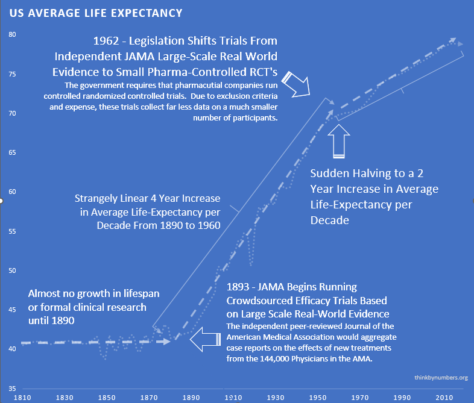
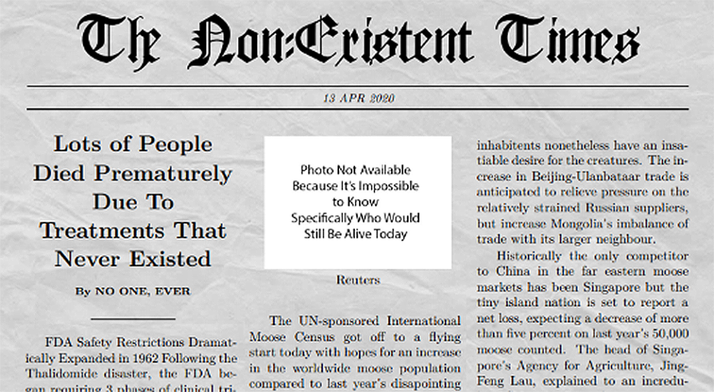
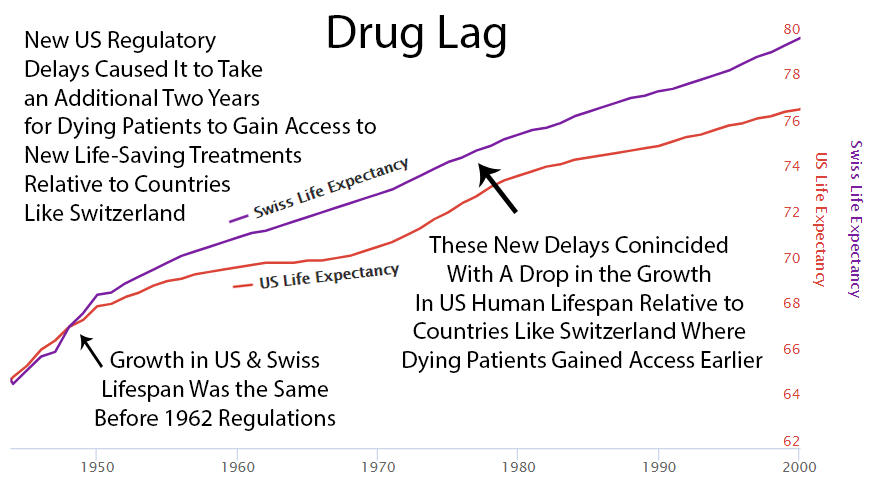
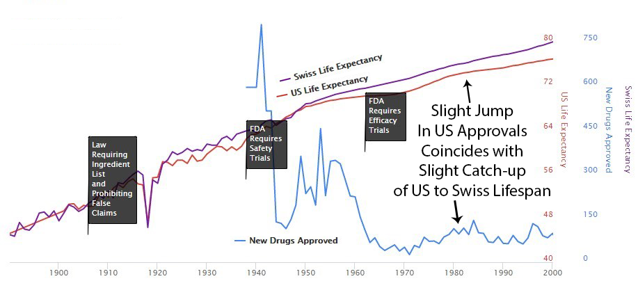



The FDA's 1962 law requiring years of pre-approval efficacy testing was supposed to prove drugs work before allowing patient access. Instead, it made drugs more dangerous.

How? By blocking patient access during lengthy trials and forcing small, artificial studies instead of large real-world evidence, the current system:

- Tests drugs on tiny, unrepresentative populations that exclude the sick, elderly, and those with comorbidities
- Relies on passive adverse event reporting that captures less than 10% of actual problems
- Misses rare but serious side effects that only appear in larger populations
- Provides no long-term safety data beyond a few months

The result: drugs approved as "safe" based on testing 3,000 cherry-picked patients, then given to millions of real patients where problems finally emerge.

Meanwhile, the regulatory delays prevent millions from accessing treatments that could save their lives. The system doesn't just fail to ensure safety. It actively undermines it while simultaneously killing people through delay.

::: {.callout-note}
## A Note on Blame

The FDA employees executing this system didn't design it. Congress did, in 1962, via the Kefauver-Harris Amendments. The FDA is implementing what Congress mandated. The problem isn't bad people at the FDA. The problem is a bad law that makes good outcomes structurally impossible.

When this chapter says "the FDA does X," read it as "the 1962 law requires the FDA to do X." The humans at the agency are following the rules they were given. The rules are the problem.
:::

::: {.callout-note}
## Confidence Levels: What We Know vs. What We Model

This chapter relies on three tiers of evidence:

**Irrefutable Facts** (direct empirical data):

- × cost differential: Oxford trial () vs. standard Phase III ()
- 70% drug approval reduction: Immediate drop from [46/year (1960) to 13/year (1963)](../references.qmd#post-1962-drug-approval-drop)
- Beta-blocker deaths: [100,000 Americans died](../references.qmd#beta-blocker-drug-lag-deaths) during decade-long delay
- COVID test fiasco: FDA blocked WHO tests while CDC tests were contaminated

**Strong Evidence** (peer-reviewed research):

- 86.1% trial exclusion rates for real-world patients
- <10% adverse event capture rate in FAERS
- Historical life expectancy slowdown post-1962
- Publication bias (37% negative vs. 94% positive)

**Model-Dependent Estimates** (quantitative analysis with Monte Carlo confidence intervals):

-  deaths from -year efficacy lag
-  DALYs lost
- :1 Type II/Type I error ratio

Even if you reject all model-dependent estimates, the empirical facts alone demonstrate the system is broken.
:::

## The × Inefficiency Tax

Compare two real-world systems for testing drugs:

1.  **The Oxford RECOVERY Trial:** Tested COVID treatments on 47,000 patients for ** per patient**. Found a life-saving treatment in 3 months.
2.  **The Post-1962 System:** Averages ** per patient** for clinical trials. Takes **[9.1 years](../references.qmd#drug-development-timeline-17-years)** to approve a new drug.

The current system costs **× more** and takes **x longer**. Not a small difference - the difference between functional and designed-to-fail.

### The -Year Efficacy Lag

Here's the breakdown of where the time goes:

- **Phase I (Safety Testing):**  years - Tests if the drug kills people. *This part works.*
- **Phase II/III (Efficacy Testing):**  years - Tests if the drug works better than placebo. *This is where people die waiting.*

The math is simple: If you die in year 5 and the drug gets approved in year 10, the regulatory process murdered you.

$$
t_{lag} = t_{total} - t_{safety} = 10.5 - 2.3 = 8.2 \text{ years}
$$

That's  years sitting in regulatory purgatory *after* we already know the drug won't kill you.

You're two lifetimes from applying the scientific method to medicine. That's 0.0001% of human history - you invented science yesterday, cosmically speaking. The more clinical research you read, the more you realize you know nothing. Nearly every study ends with "more research is needed" (scientist-speak for "we have no idea what's happening, please give us more grant money"). This would be fine except people are dying while you figure it out.

## Historical Evidence: The Pre-1962 System Worked

For 10,000 years, life expectancy remained at 30 years. Then in 1883, something changed: doctors started sharing information through JAMA. ** physicians** tested treatments on real patients and published results. Life expectancy increased by [3.82 years every decade](../references.qmd#life-expectancy-increase-pre-1962) (calculated from 1880-1960 data) for 80 years.

In 1938, Phase I safety testing was added after the Elixir sulfanilamide disaster. This was reasonable and didn't slow progress. Safety regulations worked perfectly. They prevented all US deaths from thalidomide while Europe had thousands.

Then in 1962, Congress responded to this success by adding massive **pre-approval efficacy requirements** via the [Kefauver Harris Amendment](../references.qmd#kefauver-harris-amendment-1962), blocking patient access for years during testing. The new system:

- Replaced  independent doctors with drug company-run trials
- Made trials × more expensive
- Reduced drug approvals by  immediately
- Cut life expectancy growth [by 60%](../references.qmd#post-1962-life-expectancy-slowdown): from 3.82 years/decade to 1.54 years/decade

The temporal break is exact. Life expectancy growth cut in half the moment regulations changed in 1962.

::: {.callout-note}
## Detailed Historical Analysis

For the complete analysis including the 1883-1962 timeline, thalidomide case study, diminishing returns rebuttal, and correlation vs. causation analysis, see:
[Real-World Evidence Historical Success (Pre-1962)](../appendix/real-world-evidence-historical-success.qmd)
:::

### Pre- vs. Post-1962: What Changed

| Metric | Pre-1962 (1883-1962) | Post-1962 (1962-Present) | Change |
|--------|---------------------|-------------------------|--------|
| **Efficacy Testing** |  independent physicians | Drug company-run trials | -99.8% independence |
| **Cost per Drug** |  |  | × increase |
| **New Approvals** | [46/year (1960)](../references.qmd#post-1962-drug-approval-drop) | [13/year (1963)](../references.qmd#post-1962-drug-approval-drop) |  decline |
| **Life Expectancy Growth** | [3.82 years/decade](../references.qmd#life-expectancy-increase-pre-1962) | [1.54 years/decade](../references.qmd#post-1962-life-expectancy-slowdown) | [60% reduction](../references.qmd#post-1962-life-expectancy-slowdown) |
| **Trial Cost** |  (pragmatic) |  | × increase |
| **Time to Approval** | 2-3 years |  years | 5-8× slower |

The temporal break is exact. Every negative metric changed immediately in 1962.

::: {.callout-note}
## Detailed Cost Analysis

The × cost increase is rigorously documented with multiple data sources, CPI adjustments, and sensitivity analysis. See [Drug Development Cost Analysis](../appendix/drug-development-cost-analysis.qmd) for:

- Congressional testimony and alternative data sources
- Exact inflation calculations (1962 → 2024)
- Why it's not just inflation (timeline expansion, failure rates, trial complexity)
- Sensitivity analysis and independent validation
- Transparent methodology addressing common objections
:::

### The Modern Consequences

Even if you're skeptical of historical analysis, the current system's failures are undeniable. It works like this:

1. Scientists discover a cure for your disease
2. You wait 17 years
3. You die
4. The cure gets approved
5. Pharmaceutical companies charge your widow $10,000 per pill

Beautiful system if you're a mortician or bankruptcy lawyer.

You're at the very beginning of thousands or millions of years of systematic discovery. So this decline in lifespan growth is unlikely to result from diminishing returns - you haven't run out of things to discover.

However, validating that large-scale real-world evidence produces better health outcomes requires further validation of this experimentation method. This is why we need a decentralized framework for drug assessment.

#### High Costs Kill Innovation, Reward Monopoly

In the past: Genius scientist invents cure, raises a few million, tests safety. Simple.

Now: Genius scientist must convince one of three mega-corporations to spend a billion dollars on a 10% chance of success. Those corporations already sell inferior drugs for the same condition.

The math for the mega-corporation:

**Option 1: Spend $1 billion on trials**

- 90% chance: Lose everything
- 10% chance: Succeed, then cannibalize your own profitable drug

**Option 2: Buy the patent, put it on a shelf**

- 0% chance of losing a billion dollars
- 100% chance your inferior cash cow keeps printing money

Which would you choose if you were a rational sociopath in a suit?

The profit incentive doesn't just fail to reward better treatments. It actively punishes them.

### Off-Patent Drugs and Rare Diseases: Mathematically Doomed

The 1962 law creates a death spiral for unprofitable treatments:

- **[95% of diseases are rare](../references.qmd#95-pct-diseases-no-treatment):** Development cost () ÷ patient population (~10,000 patients) = $260,000/patient
- **No patent = no funding:** Off-patent drugs can't attract billion-dollar investments
- **Pre-specification kills serendipity:** Must predict what drug cures before testing

When something costs more, you get less of it. For [95% of diseases](../references.qmd#95-pct-diseases-no-treatment) with zero treatments, this isn't philosophy. It's math.

## The Actual Death Toll of "Drug Lag"

Economists have a term for people dying while waiting for drug approval: "drug lag." It's a sterile, bureaucratic phrase for a massacre. Early estimates suggested delays cost **[21,000 to 120,000 American lives per decade](../references.qmd#gieringer-drug-lag-estimate)**.

But that was just the US. And just the visible delays.

### The Global Body Count

A [comprehensive quantitative analysis](../appendix/regulatory-mortality-analysis.qmd) using WHO mortality data and Monte Carlo modeling estimates the *total* cost of blocking patient access during the -year post-safety efficacy delay:

** eventually avoidable deaths** from the efficacy lag alone.

This represents a humanitarian catastrophe larger than any war in modern history. See the [full sensitivity analysis](../appendix/regulatory-mortality-analysis.qmd) for confidence intervals and parameter uncertainty. 

But deaths alone don't capture the suffering. People don't just die, they live for years with untreated diseases while waiting for approval.

### The Morbidity Burden (DALYs)

When you account for both premature death and years lived with disability:

$$
DALY_{total} = YLL + YLD = 3.14B + 1.69B = 4.83B
$$

** billion years of healthy human life** deleted by the regulatory framework.

- **Economic cost:**  (2024 USD)
- **Annualized loss:** /year ( ÷ 62 years from 1962-2024)
- **GDP equivalent:** ~8-12% of global GDP consumed annually

For comparison: The entire global pharmaceutical R&D budget is ~$200B/year. The post-safety efficacy lag costs **38× more** than all drug development spending combined.

**Even if you think these estimates are off by a factor of 10**, the core problem remains: a system that costs × more per patient, takes 36× longer than proven alternatives, and produces less safety data from smaller, less representative populations.

Here's a news story from the Non-Existent Times by No One Ever without a picture of all the people who die from lack of access to life-saving treatments that might have been.

This means it's logical for regulators to reject drug applications by default. The personal risks of approving a drug with any newsworthy side effect far outweigh the personal risk of preventing access to life-saving treatment.

**Types of Error in FDA Approval Decision**

|                             | Drug Is Beneficial                                       | Drug Is Harmful                                                |
| --------------------------- | -------------------------------------------------------- | -------------------------------------------------------------- |
| FDA Allows the Drug         | Correct Decision                                         | Victims are identifiable and might appear on Oprah. |
| FDA Does Not Allow the Drug | Victims are not identifiable or acknowledged. | Correct Decision                                               |

The most infamous case is beta-blockers. While Europe used them to prevent heart attacks, the US regulatory process delayed. And delayed. The decade-long lag in approving them for their most common use killed an estimated **[100,000 Americans](../references.qmd#beta-blocker-drug-lag-deaths)**.

More Americans than died in Vietnam and Korea combined. From one drug delay. Here's a partial list of other drugs Americans died waiting for while they were already available in other civilized countries for a year or longer:

* interleukin-2, Taxotere, vasoseal, ancrod, Glucophage, navelbine, Lamictal, ethyol, photofrin, rilutek, citicoline, panorex, Femara, ProStar, omnicath

Each name on that list represents eventually avoidable deaths.

Following the 1962 increase in US regulations, you can see a divergence from Switzerland's growth in life expectancy, which did not introduce the same delays to availability.

Perhaps it's coincidence, but you can see an increase in drug approvals in the '80s. At the same time, the gap between Switzerland and the US gets smaller. Then US approvals go back down in the '90s, and the gap expands again.

## How the Incentives Work

### FDA Regulator Decision Tree

#### Approve drug that later shows problems

- Congressional hearing (televised)
- "FDA APPROVED KILLER DRUG" headlines
- Career ends
- Pension threatened

#### Delay drug that could save lives

- Nothing happens
- Dead people don't complain
- Promotion on schedule
- [Retire to pharma job](../references.qmd#fda-regulatory-capture-evidence)

This isn't conspiracy. It's economics. The system literally cannot punish mistakes of commission (approving bad drugs) but imposes zero consequences for mistakes of omission (delaying good drugs).

### The Math: Why Current Regulations Increase Total Harm

The regulatory system claims to prevent harm by screening out unsafe drugs (Type I errors: approving bad drugs). But this framing ignores two critical facts:

1. **Small trials miss more safety problems than they catch** (as shown in the Safety Paradox section)
2. **Regulatory delays kill far more people than unsafe drugs ever did**

Let's quantify both types of harm:

**Type I Harm (approving unsafe drugs):**

- Even with generous overestimates, prevented harm: ~ DALYs saved (1962-2024)
- This assumes ALL drug withdrawals were prevented by the 1962 changes that blocked patient access during lengthy efficacy trials (they weren't; Phase I safety testing already existed)

**Type II Harm (delaying beneficial treatments):**

- Documented harm:  DALYs lost (1962-2024)
- This is from delayed access alone, not counting the additional safety failures the system creates

$$
\frac{\text{Cost of Regulatory Delay}}{\text{Benefit of Screening}} = \frac{4.83B}{0.003B} = 1{,}610:1
$$

**For every 1 unit of harm prevented by the current regulatory framework, it creates  units of harm through delay and inadequate safety monitoring.**

This isn't a trade-off. The system doesn't reduce total harm. It massively increases it while appearing to prioritize safety.

### Why Bureaucrats Are Rewarded for Letting You Die

Humans weight acts of commission (doing something bad) as worse than acts of omission (letting something bad happen) - even when omission causes more harm. Push a person in front of a trolley to save five people? Unthinkable. Let five people die by doing nothing? That's just Monday.

The current regulatory framework operates on this principle.

Dr. Henry I. Miller ran the FDA team reviewing recombinant human insulin in the early 1980s. Mountains of evidence showed it was safe and effective. His supervisor refused to approve it. Why? If someone died from the drug, heads would roll at the FDA, including his. If people died waiting for the drug? Nothing happens.

The personal risk of approving a drug vastly exceeds the risk of rejecting it. Dead patients don't testify before Congress.

## Clinical Trial Theater: Excluding 86.1% of Reality Makes Drugs More Dangerous

The FDA requires rigorous trials to ensure safety. Then it systematically excludes the populations most at risk of adverse events.

Trials under the current system [exclude](../references.qmd#antidepressant-trial-exclusion-rates):

- **Patients over 65:** Most people who actually take medications (excluded due to "comorbidities")
- **Patients under 18:** All children (metabolism differs from adults)
- **Pregnant women:** Excluded entirely (then drugs prescribed during pregnancy anyway)
- **Anyone with comorbidities:** The sickest patients most likely to have adverse reactions
- **Anyone on other medications:** Everyone elderly (can't detect drug interactions)
- **Anyone too far from trial sites:** Poor and rural populations

**Result:** Drugs are tested on the 15% of unusually healthy patients least likely to experience adverse events, then prescribed to everyone else where safety problems finally emerge.

### Why This Makes Drugs More Dangerous

When you exclude 85% of real patients from trials:

- **Drug interactions go undetected:** Elderly patients on multiple medications face risks never tested
- **Metabolic differences are missed:** Children and elderly metabolize drugs differently
- **Subgroup toxicity is invisible:** Rare genetic variants or comorbidities that cause severe reactions
- **Real-world failure rates are hidden:** Effectiveness and safety in actual sick patients remain unknown until post-market

**This isn't theoretical.** Multiple drugs later withdrawn for safety issues (Vioxx, Fen-Phen, Bextra) were tested on cherry-picked populations. The cardiovascular risks, liver damage, and other serious adverse events only became apparent after millions of real-world patients (elderly, sick, on other medications) were exposed.

Testing drugs only on healthy volunteers to ensure safety is like testing parachutes only on the ground.

### No Long-Term Outcome Data

Even if there's financial incentive to research a new drug, there's no data on long-term outcomes. Data collection for participants can be as short as several months. Under the current system, it's not financially feasible to collect data on a participant for years or decades. So you have no idea if long-term effects of a drug are worse than initial benefits.

For instance, even after controlling for co-morbidities, the Journal of American Medicine recently found that long-term use of Benadryl and other anticholinergic medications is associated with [increased](https://jamanetwork.com/journals/jamainternalmedicine/fullarticle/2091745) risk for dementia and Alzheimer's disease.

### Pre-Specification Requirements Kill Innovation

When running an efficacy trial, the regulations require drug developers to predict exactly what a treatment will cure before collecting any human trial data.

In 2007, Dendreon submitted evidence that its immunotherapy drug Provenge significantly reduced deaths from prostate cancer. The FDA advisory committee was persuaded. But the application was rejected anyway, not because the drug didn't work, but because Dendreon didn't properly specify beforehand what the study would measure.

Finding a decline in deaths wasn't enough. The paperwork wasn't filled out in the correct order. Three more years and another large trial were required before the life-saving medication was approved.

Due to these additional costs, Dendreon ultimately [filed for chapter 11 bankruptcy](https://www.targetedonc.com/view/dendreon-files-for-bankruptcy-provenge-still-available).

## The Negative Results Black Hole

Here's a fun fact that should be criminal:

- **Negative trial results published:** [37%](../references.qmd#publication-bias-clinical-trials)
- **Positive trial results published:** [94%](../references.qmd#publication-bias-clinical-trials)
- **Money wasted repeating failed experiments:** [~\$100 billion annually](../references.qmd#wasted-spending-on-failed-experiments)

Companies are literally allowed to hide when drugs don't work.

Company: "We tested this drug!"

Regulator: "Did it work?"

Company: "...We tested this drug!"

This means humans spend billions testing the same failed drugs over and over because nobody admits they failed. It's like playing poker where everyone claims they won but nobody shows their cards.

Pharmaceutical companies bury negative results deeper than Jimmy Hoffa. So other companies waste billions testing the same dead ends.

Your insurance premiums fund this magnificent inefficiency.

It's like casinos only having to report when people win.

## Countries That Don't Have Our "Safety"

**[Japan's Regenerative Medicine Act](../references.qmd#japans-regenerative-medicine-act):**

- Conditional approval after Phase II
- Real-world data collection required
- Time to patient: 2-3 years
- Americans fly there for treatment

**[EU Compassionate Use](../references.qmd#eu-compassionate-use-program):**

- Terminal patients can access experimental drugs
- Doctor's discretion, not bureaucrat's
- Thousands of lives extended
- FDA: "But what if they die?" (They're already dying)

**[Right to Try (US)](../references.qmd#right-to-try-act-2018):**

- Passed despite FDA opposition
- FDA response: Made it effectively impossible to use
- [Patients helped: <200 total](../references.qmd#right-to-try-act-outcomes)
- Patients who wanted help: Tens of thousands

## The COVID Test Fiasco

The 1962 framework requires the FDA to approve all diagnostic tests before use. During COVID, this mandate played out as follows:

- **January 2020:** WHO develops COVID test, rest of world starts using it
- **February 2020:** [FDA blocks all non-CDC tests](../references.qmd#fda-covid-test-delay) to "ensure quality"
- **Late February:** [CDC tests contaminated, completely useless](../references.qmd#cdc-covid-test-contamination-2020)
- **March:** Private labs beg to help, regulatory framework says "no, approved tests only"
- **Late March:** FDA finally allows other tests after thousands die
- **Cost:** [Thousands of preventable deaths](../references.qmd#excess-deaths-fda-covid-response), exact number unknown

The defense: "We were ensuring quality control."

The only approved tests didn't work.

Ensuring quality control of broken tests is like TSA confiscating water bottles while letting actual weapons through. Except people died.

## Small Trials Are Dangerous!

The FDA's post-1962 system (requiring small, artificial efficacy trials before allowing patient access) was supposed to prove drugs work. But paradoxically, by forcing small artificial trials and excluding real-world populations, it created a system that is demonstrably more dangerous than the real-world evidence approach it replaced.

### Why Small Trials Miss Safety Signals

**Phase III trials test 1,000-3,000 patients.** This sounds rigorous until you understand the math:

- **Rare adverse events** (1 in 10,000) won't appear in trials of 3,000 patients
- **Subgroup reactions** (elderly, those with comorbidities) can't be detected when these groups are systematically excluded
- **Long-term effects** (cancer risk, organ damage) don't show up in 6-month trials
- **Drug interactions** can't be studied when trial participants can't be on other medications

The result: Drugs are approved as "safe" based on tiny, artificial samples, then given to millions of real patients where the actual safety problems emerge.

### The Adverse Event Reporting Failure

Post-approval, the FDA relies on the **FDA Adverse Event Reporting System (FAERS)**, a passive, voluntary system where doctors report problems they happen to notice and connect to a specific drug.

**Reality:**

- **Estimated capture rate:** [Less than 10% of actual adverse events](../references.qmd#adverse-event-underreporting) (empirical studies show ~6% reporting rate, meaning 94% underreported)
- **Reporting burden:** Voluntary, time-consuming paperwork doctors often skip
- **Attribution difficulty:** Hard to prove causation in individual cases
- **No systematic follow-up:** Most patients disappear after prescription

**Examples of failures:**

- **Vioxx:** Killed an estimated [38,000-55,000 Americans](../references.qmd#vioxx-deaths) before voluntary reporting caught the cardiovascular risks
- **Benadryl:** Took decades to discover the [dementia risk](https://jamanetwork.com/journals/jamainternalmedicine/fullarticle/2091745) from long-term use
- **Thalidomide in Europe:** Thousands of birth defects before passive reporting identified the pattern

### What Real-World Evidence Would Catch

A decentralized system with universal participation would:

- **Detect rare events:** 10 million participants catch 1-in-10,000 reactions
- **Include real populations:** Test on the sick, elderly, and those with comorbidities
- **Track long-term outcomes:** Years of follow-up data, not months
- **Identify drug interactions:** Real patients take multiple medications
- **Provide active surveillance:** Automated detection, not voluntary reporting

**The safety ratio is backwards.** Testing 3,000 cherry-picked patients and hoping voluntary reporting catches problems is more dangerous than testing active monitoring of adverse events with real patients.

The current system doesn't prevent safety failures. It delays discovering them until after millions have been exposed.

Phase I safety testing works. It screens out immediately toxic compounds. But blocking patient access during the 8.2-year post-safety efficacy delay, by forcing small artificial trials and excluding real-world evidence collection, makes drugs more dangerous while simultaneously killing people through delayed access to life-saving treatments.

## The Bottom Line

- ** years** of post-safety efficacy lag (Phase II/III delay after Phase I safety verification)
- ** deaths** from eliminating the 8.2-year efficacy lag
- ** DALYs** destroyed 
- **** in economic carnage
- **:1** harm ratio (delay vs. prevention)

Phase I safety testing works. Keep it.

Blocking patient access during the 8.2-year post-safety efficacy delay kills people. Replace it with real-world evidence collection.

Many pieces already exist. The bottleneck is scale, incentives, and time-to-answer. The core idea is straightforward even if implementation is hard.

What's missing is the political will to admit that the 1962 "reforms" were a catastrophic mistake.

::: {.callout-note}
## Technical Analysis

For the full quantitative analysis including methodology, sensitivity analysis, and source data, see:
[The Human Cost of Regulatory Latency](../appendix/regulatory-mortality-analysis.qmd)
:::

---

*P.S. - The FDA will likely object to this chapter. Estimated response time: 12-15 years, pending Phase III review and proper documentation.*
