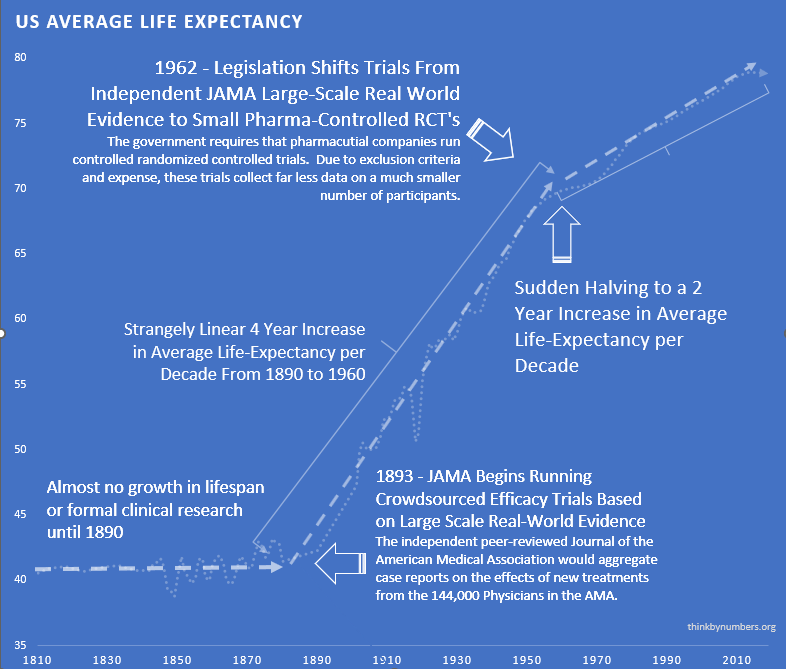
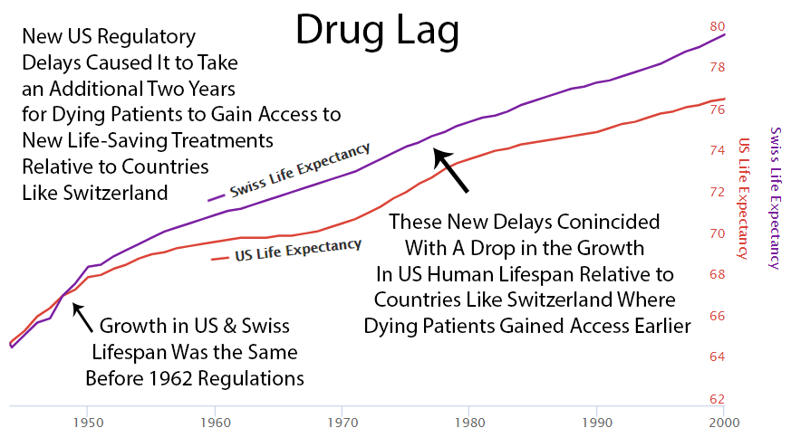
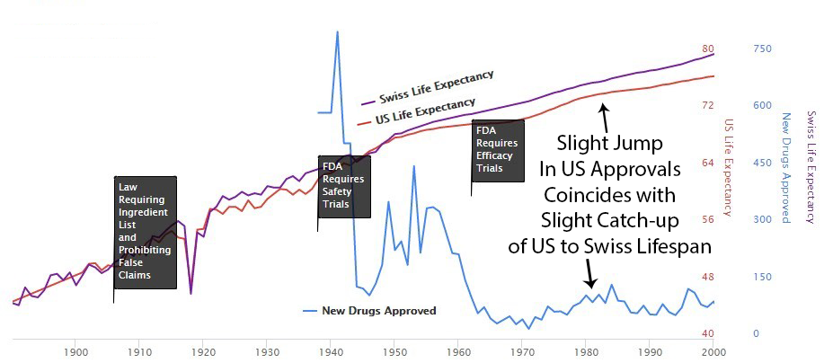


In 1962, your Congress decided that after proving a drug won't kill you, sick people should wait another  before they're allowed to take it. The drug passed safety testing. It won't kill you, won't melt your liver, won't make your hair migrate to your back. But you can't have it, because a committee needs to spend  making sure it works well enough. I asked someone why, and they said "we need to confirm efficacy." I said, "The patient is dying." They said, "Yes, but we don't know if the drug works." I said, "The patient could tell you, if you gave it to them." They said that's not how it works. I said, "Dying is how it works?" They changed the subject, which I suppose is also how it works.

You're not allowed to volunteer for the trials that would answer the question faster, either. You are, however, allowed to die. Nobody blocks that. There's no  waiting period on dying.

On Wishonia, when we confirm something won't harm you, we let you try it. On Earth, you lock it in a cabinet and form a committee. The committee meets quarterly. You decompose on a different schedule.

## A Note on Blame

When this chapter says "the FDA does X," read it as "the 1962 law requires the FDA to do X."
Congress wrote the rules. The FDA follows them. Blaming the FDA is like blaming the gun instead of the person who loaded it, aimed it at patients, and pulled the trigger on a 62-year schedule.

## "But What About Safety?"

This is the part where humans panic, so let me be very precise about what this chapter is (and isn't) proposing: keep Phase I safety testing (it works, it caught thalidomide, nobody is suggesting you skip it). Do *radically more* efficacy testing, on *real patients*, with *transparent results*. But stop holding known-safe drugs hostage while you run the trials.

On Wishonia, we don't have a word for "preventing someone from accessing a safe substance that could help them while they die." It would never occur to us to do it, so we never needed a word. You have several words for it. My favorite is "the approval process."

## The  Inefficiency Tax

Compare two real-world systems for testing drugs:

1.  **The Oxford RECOVERY Trial:** Tested COVID treatments on 48,000 patients for ****. Found a life-saving treatment in 3 months. Like a normal species would.
2.  **The Post-1962 System:** Averages **** per trial. Takes **over a decade [@drug-development-timeline-17-years]** to approve a new drug. Like humans would.

Your efficacy testing system costs ** more** and takes ** longer** than necessary. I showed these numbers to a human and they said "that can't be right." So I showed them the sources and they said "well, there must be a reason." There is a reason. The reason is that your system costs  more and takes  longer. That's the reason and also the problem. They're the same thing.

### The  Efficacy Lag

Here's where your lifespan goes to die:

- **Phase I (Safety Testing):**  - Tests if the drug harms people: death, organ damage, mutations, serious adverse reactions, all the ways a molecule can ruin your day. *This part works. Keep it.*
- **Phase II/III (Efficacy Testing):**  - The drug is now *known safe*. But patients can't have it until the committee is satisfied. *This is where people die waiting for a drug that already passed every safety check your species invented.*

## What the 1962 Efficacy Requirements Changed

Before 1962,  tested treatments on real patients and published results.
Life expectancy grew 3.82 years every decade [@life-expectancy-increase-pre-1962] for 80 straight years. Things were going well. Naturally, Congress intervened.

Phase I safety testing (added in 1938) prevented all US thalidomide deaths while Europe had thousands. So in 1962, Congress looked at a system that was working and thought, "What if we made this much worse?" They added massive **pre-approval efficacy requirements** via the Kefauver Harris Amendment [@kefauver-harris-amendment-1962], blocking patient access for years during testing.

The cost of developing a drug went from  to , a  increase. New drug approvals dropped by  [@post-1962-drug-approval-drop]. Life expectancy gains slowed from 3.82 years per decade to 1.54 [@life-expectancy-increase-pre-1962; @post-1962-life-expectancy-slowdown], a 60% reduction. Time to approval stretched from 2-3 years to .

Everything got worse at exactly the same time. Every single metric, all at once, the moment the law passed. I'm not a statistician so I can't tell you whether that's a coincidence, but I did look at the graph, and it's not a coincidence.

The  cost increase is rigorously documented. See [Drug Development Cost Analysis](https://drug-cost.warondisease.org) for methodology, sensitivity analysis, and source data.

### The Modern Consequences

Even if you think historical analysis is just opinions with footnotes, the current system's failures are happening right now:

1. A cure passes safety testing
2. You can't take it (pending efficacy review)
3. You can't join the trial either (too sick, too old, wrong medications)
4. You die
5. The FDA approves the cure
6. Pharmaceutical companies charge your widow $10,000 per pill

I read this sequence several times because I kept thinking I'd got the order wrong. I hadn't. That is the correct order. The system works exactly like that, on purpose, and everyone involved considers it a success because nobody skipped a step.

#### High Costs Kill Innovation, Reward Monopoly

Before 1962: Genius scientist invents cure, raises a few million, tests safety, gives it to people. Like a civilization that wants to survive would.

Now: Genius scientist must convince one of three mega-corporations to fund trials. Those corporations already sell inferior drugs for the same condition, bringing in hundreds of millions a year per drug.

The math for the mega-corporation:

**Option 1: Develop the better drug**

Cost:  on average to get a single drug to market. That figure already includes the cost of the nine candidates that fail for every one that succeeds, so the  success rate is already priced in.

Best case, the drug works: you now have a better drug for the same condition. But your old drug, which was bringing in hundreds of millions a year, is now obsolete. You spent  to replace your own revenue stream. Every year the new drug is on the market, it's earning roughly what the old drug would have earned anyway, minus the  hole you dug getting here.

**Option 2: Buy the patent, put it on a shelf**

Your inferior drug keeps bringing in hundreds of millions a year. Total cost: whatever the patent costs, which is rounding error compared to .

I asked a pharmaceutical executive which option they'd choose and they said "it's more nuanced than that." Then I asked which one they chose and they said Option 2. So it wasn't more nuanced than that.

The profit incentive doesn't just fail to reward better treatments. It actively punishes them. The best possible outcome of Option 1 is the same annual revenue you already had, minus . Curing disease is economically irrational. The system doesn't need a conspiracy to suppress cures. It just needs the math. I keep waiting for someone to show me where the math is wrong. Nobody shows me where the math is wrong. They just look uncomfortable and say "it's complicated," which I've learned is what humans say when it isn't complicated and they don't like the answer.

### Off-Patent Drugs and Rare Diseases: Mathematically Doomed

The 1962 law made it mathematically impossible to cure diseases that aren't profitable enough:

- **95% of diseases are rare [@95-pct-diseases-no-treatment]:** Development cost () / patient population (~10,000 patients) = $260,000/patient
- **No patent = no funding:** Off-patent drugs can't attract billion-dollar investments
- **Pre-specification kills serendipity:** Must predict what drug cures before testing

When something costs more, you get less of it. I looked this up and apparently it's the first thing they teach in economics. It is also, somehow, the last thing anyone considers when writing health policy. 95% of diseases [@95-pct-diseases-no-treatment] have zero treatments. Not because cures are impossible. Because cures are unprofitable. The best thing a disease can do for itself, career-wise, is be popular.

## The Actual Death Toll of "Drug Lag"

Economists call it "drug lag," which is a lovely, clinical way of saying "people rotting to death in a queue for drugs that have already been confirmed not to hurt them."
Early estimates: **21,000 to 120,000 American lives per decade [@gieringer-drug-lag-estimate]**.
But that was just the US.

A [comprehensive quantitative analysis](https://invisible-graveyard.warondisease.org) using WHO mortality data estimates the *total* cost of the  *post-safety* efficacy delay (the lag *after* drugs are known safe): ** eventually avoidable deaths.**

Including years lived with disability:  of healthy human life deleted.
Economic cost:  (2024 USD), reflecting those  valued at /DALY, the standard normative rate used in WHO cost-effectiveness analyses.

Even if those death estimates are off by a factor of 10, that's still tens of millions of deaths. And the inefficiency is independently verifiable: the efficacy testing process costs  more per patient and takes  longer than proven alternatives like the Oxford RECOVERY trial. Those numbers don't depend on mortality estimates at all.

Here's a news story from the Non-Existent Times by No One Ever, without a picture of all the people who die from lack of access to life-saving treatments that might have been. You can't photograph millions of people who died from *not* receiving a drug. There's no body with a toe tag reading "cause of death: regulatory delay." They die of cancer, heart disease, Alzheimer's. The delay that killed them is invisible, so nobody writes the headline.

**Types of Error in FDA Approval Decision**

|                             | Drug Is Beneficial                                       | Drug Is Harmful                                                |
| --------------------------- | -------------------------------------------------------- | -------------------------------------------------------------- |
| FDA Allows the Drug         | Correct Decision                                         | Victims appear on television. Regulator is fired. |
| FDA Does Not Allow the Drug | Victims die at home. Nobody is fired. | Correct Decision                                               |

So the FDA has two kinds of mistakes. One where they give you a bad drug and you die on television. And one where they don't give you a good drug and you die at home. They've decided the second one doesn't count, which is convenient because it's the one they do most.

The most infamous case: beta-blockers.
Europe used them to prevent heart attacks.
The US delayed for a decade, killing an estimated **100,000 Americans [@beta-blocker-drug-lag-deaths]**.
More than died in Vietnam and Korea combined. From one drug. That they had. That they knew worked. That they put in a drawer. I asked someone if there was a word for killing 100,000 people by not doing something, and they said "it depends on the context." I think 100,000 dead people is the context, but apparently that's not enough context.

After 1962, US life expectancy diverged from Switzerland's (which didn't introduce the same delays).
More drug approvals in the '80s narrowed the gap.
Fewer approvals in the '90s widened it again.
The pattern is not subtle. I showed it to a child and the child understood it. I showed it to a policy expert and they said it was "multifactorial." I think "multifactorial" is what adults say when they can see the same thing the child can see but have reasons not to say it out loud.

## How the Incentives Work

### FDA Regulator Decision Tree

#### Approve drug that later shows problems

- Congressional hearing (televised)
- "FDA APPROVED KILLER DRUG" headlines
- Career ends
- Pension threatened

#### Delay drug that could save lives

- Nothing happens
- Nobody writes a headline
- Promotion on schedule
- Retire to pharma job [@fda-regulatory-capture-evidence]

To be fair, this isn't a conspiracy. It's just a system where the only career-ending move is letting patients access treatments. If you approve a bad drug, CNN says your name. If you delay a good drug, nobody dies on television. So the rational move is to delay everything, and that's what happens, and everyone who could object is dead, which does simplify the feedback process.

Dr. Henry I. Miller ran the FDA team reviewing recombinant human insulin in the early 1980s.
Mountains of evidence showed it was safe and effective.
His supervisor refused to approve it.
If someone died from the drug, heads would roll.
If people died waiting for the drug? Nothing happens.

Dead patients don't testify before Congress. I checked.

### The Math: Why Current Regulations Increase Total Harm



Even generously crediting ALL drug withdrawals to the 1962 changes (ignoring that Phase I safety testing already existed), the prevented harm totals ~.
The delay harm totals .

**For every 1 unit of harm prevented, the current system creates  units of harm through delay.** The safety net catches one person and drops . On Wishonia, we'd call that a hole, not a net.

## Clinical Trial Theater: Excluding  of Reality Makes Drugs More Dangerous

The FDA requires rigorous trials to ensure safety. Then it tests the drugs on people who aren't sick, aren't old, aren't on other drugs, and aren't pregnant. I read this three times. They test the drugs on people who don't need the drugs, to find out if the drugs are safe for people who do need the drugs, who are different people, with different bodies, taking different medications. Then they act surprised when the second group has a reaction. I would call this stupid but I think it might actually be something worse than stupid. Stupid doesn't usually have a peer-review process.

Trials under the current system exclude [@antidepressant-trial-exclusion-rates]:

- **Patients over 65:** Most people who actually take medications (excluded due to "comorbidities")
- **Patients under 18:** All children (metabolism differs from adults)
- **Pregnant women:** Excluded entirely (then drugs prescribed during pregnancy anyway)
- **Anyone with comorbidities:** The sickest patients most likely to have adverse reactions
- **Anyone on other medications:** Everyone elderly (can't detect drug interactions)
- **Anyone too far from trial sites:** Poor and rural populations

It's like testing whether a car is safe by driving it very slowly into a nice cushion, and then selling it to people who drive into walls. And when they die you say "well, it was safe when WE tried it." Which is true. It was.

**Result:** In antidepressant trials alone,  of real patients are excluded. The drugs are tested on the healthiest people alive, declared "safe," then handed to everyone the trial specifically avoided. This is how Vioxx, Fen-Phen, and Bextra all got approved, celebrated, prescribed to millions, and then withdrawn after killing people whose demographics the trials had carefully excluded. The  delay didn't make these drugs safer. It made them seem safer by hiding the danger behind an exclusion list.

Testing drugs only on healthy volunteers to ensure safety is like testing parachutes only on the ground. The parachute worked perfectly, by the way. It just wasn't falling at the time.

### No Long-Term Outcome Data

Data collection can be as short as several months.
You take the drug for forty years.
The gap between these two numbers is where side effects live. Nobody checks. It's like reviewing a marriage based on the wedding.

### Pre-Specification Requirements Kill Innovation

The regulations require drug developers to predict exactly what a treatment will cure before testing it on humans. You must know the answer before you're allowed to ask the question. I asked if this was how science works and they said "it's how regulatory science works," which I think means "no, but we gave it the same name."

In 2007, Dendreon showed that its immunotherapy drug Provenge significantly reduced deaths from prostate cancer. The FDA advisory committee agreed it worked. Then the FDA rejected it anyway. Not because it didn't save lives. Because Dendreon filled out the wrong form about which lives it was planning to save.

"People stopped dying" wasn't good enough. The paperwork predicting that people would stop dying wasn't filed in the right order. Three more years and another trial were required. During those three years, people who could have stopped dying continued dying, but at least the forms were correct. On Wishonia, we have a saying: "The gravestone was filed on time." It means someone prioritized procedure over the thing the procedure was supposed to protect. We retired the saying because it kept applying to too many situations. You could use it daily.

Due to these additional costs, Dendreon filed for chapter 11 bankruptcy [@filed-for-chapter-11-bankruptcy]. So the approval process killed the patients, then killed the company trying to save them. You have a phrase for this: "killing two birds with one stone." Although in this case the stone was paperwork and there were considerably more than two birds. But you can't count the people who would have been cured by a company you bankrupted. They just died of cancer, like normal. Nothing to see.

### Small Trials Are Dangerous

Phase III trials test 1,000-3,000 patients.
A 1-in-10,000 adverse event is mathematically invisible in a trial of 3,000.
Then the drug goes to millions.

After approval, the FDA monitors safety using FAERS, a system where doctors voluntarily report problems if they feel like it. It captures less than 10% of actual adverse events [@adverse-event-underreporting]. Vioxx killed an estimated 38,000-55,000 Americans [@vioxx-deaths] before this honor system noticed. That's more people than died in the entire Korean War, detected by a system that relies on doctors filling out optional paperwork. I want to be clear: the  delay is supposed to be for safety. And then the safety monitoring after approval is a suggestion box. You waited  to get to the suggestion box.

A decentralized FDA with 10 million participants catches 1-in-10,000 reactions, includes real populations, tracks long-term outcomes, and provides automated surveillance instead of voluntary paperwork. You have a fax machine and a suggestion box. One of these is a safety system. The other is a prayer with a  waiting period.

## The Negative Results Black Hole

Here's something that would be illegal if anybody important cared:

- **Negative trial results published:** 37% [@publication-bias-clinical-trials]
- **Positive trial results published:** 94% [@publication-bias-clinical-trials]
- **Money wasted repeating failed experiments:** ~\$100 billion annually [@wasted-spending-on-failed-experiments]

Companies are allowed to hide when drugs don't work. Restaurants can't hide when they fail a health inspection. I checked this twice because I thought I was wrong, but I wasn't. A sandwich has more regulatory transparency than chemotherapy. I don't know what to do with that information but I've had it for three days now and it won't go away.

Company: "We tested this drug!"
Regulator: "Did it work?"
Company: "...We tested this drug!"

Pharmaceutical companies bury negative results deeper than Jimmy Hoffa.
Other companies waste billions testing the same dead ends.
Your insurance premiums fund this magnificent inefficiency.
It's like casinos only having to report when people win. Actually, I think casinos DO have to report when people win. So drugs get less honesty than gambling. I keep finding these comparisons and they keep getting worse.

## Countries That Don't Have Our "Safety"

**Japan** [@japans-regenerative-medicine-act] gives conditional approval after Phase II with real-world data collection.
Time to patient: 2-3 years.
Americans fly there for treatment.

**The EU** [@eu-compassionate-use-program] lets terminal patients access experimental drugs at a doctor's discretion.
I asked the FDA what might go wrong and they said "the patient could die." The patient is already dying. "Yes," they said, "but they could die differently." I waited for the rest of the sentence but that was it.

**Right to Try (US)** [@right-to-try-act-2018] passed despite FDA opposition.
The FDA made it effectively impossible to use.
Patients helped: <200 total [@right-to-try-act-outcomes].
Patients who wanted help: tens of thousands.
On Wishonia, "Right to Try" is just called "rights." The fact that your species needed a special law to allow dying people to take known-safe drugs, and then made the law effectively unusable, is the most human thing I've ever observed. You named it "Right to Try." The name was accurate, which was so unusual for your species that it should have been suspicious. And it was: the law doesn't work. The naming convention holds.

## The COVID Test Fiasco

January 2020: WHO develops COVID test, world starts using it.
February: FDA blocks all non-CDC tests [@fda-covid-test-delay] to "ensure quality."
The CDC tests were contaminated [@cdc-covid-test-contamination-2020].
Private labs begged to help.
Late March: FDA finally allows other tests after thousands die [@excess-deaths-fda-covid-response].

The only approved tests didn't work. The unapproved ones did. The FDA blocked the ones that worked to ensure the quality of the ones that didn't. I've written this paragraph four times now and it keeps sounding like I'm making it up, but I'm not. That is what happened. In order. On purpose.

## The Bottom Line

To be fair to the FDA, the system does eventually approve most good drugs. So if you think about it, the system works. Unless you were one of the people who died waiting, in which case the system worked slightly less well for you specifically. But you're dead, so you can't complain, which means the system has a 100% satisfaction rate among living participants. That's actually quite impressive if you don't think about it.

It is not a safety system. It is a filing system that produces corpses as a byproduct.

The only thing missing is the political will to admit that a law signed before the Beatles existed might not be the pinnacle of pharmaceutical regulation. The Beatles broke up. The law didn't. Draw your own conclusions.

## Technical Analysis

For the full quantitative analysis including methodology, sensitivity analysis, and source data (warning: contains numbers large enough to make you physically ill), see:
[https://invisible-graveyard.warondisease.org](https://invisible-graveyard.warondisease.org)

---

*P.S. - The FDA will likely object to this chapter. Estimated response time: 12-15 years, pending Phase III review and proper documentation.*
