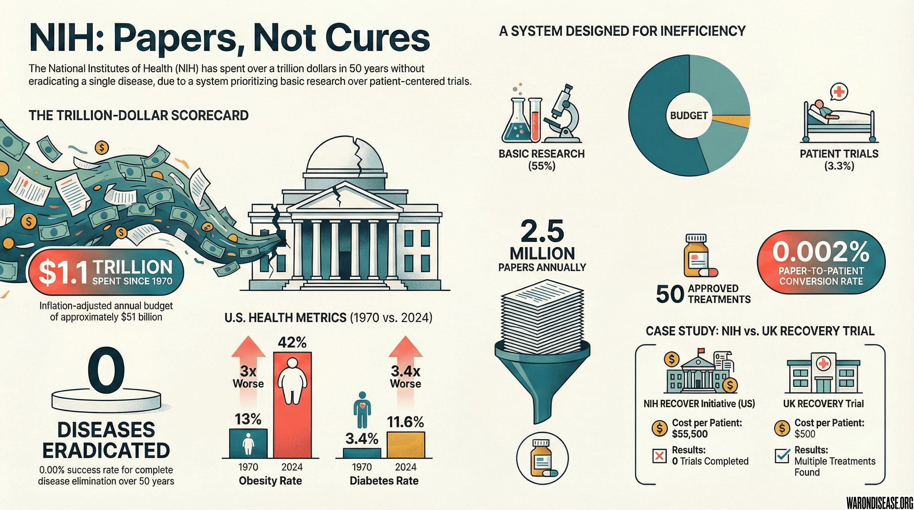



## The Allocation Scandal

The National Institutes of Health has an annual budget of approximately **$51 billion**. 55 million people die annually [@who-daily-deaths] while this money gets allocated as follows:

A [2023 JAMA study](https://pmc.ncbi.nlm.nih.gov/articles/PMC10349341/) analyzed $247 billion in NIH spending (2010-2019) and found:

- **84.9% - Basic research** ($209.9B): Mice, molecules, mechanisms - "experimental work...without any particular application in view"
- **11.8% - Applied research (non-trial)** ($29.3B): Research with practical aims, but not actually testing treatments in humans
  - **CTSA infrastructure program:** ~$1B/year in buildings, overhead, salaries ([~1.5% of total budget](https://ncats.nih.gov/research/research-activities/ctsa))
  - **Observational studies:** Watching patients get sicker without testing treatments (All of Us [@nih-all-of-us-inefficiency]: $2.16B, zero treatments tested)
  - **Other applied research:** Drug characterization, health services research, epidemiology

- **3.3% - Phased clinical trials** ($8.1B): [Actually testing if drugs work in humans](https://pmc.ncbi.nlm.nih.gov/articles/PMC10349341/) (Phases 1-3)
  - Phase 1: $1.5B (18.5% of clinical trial budget)
  - Phase 2: $3.5B (43.2%)
  - Phase 3: $2.6B (32.1%) - **NIH covers only 3.7-4.3% of Phase 3 costs**, then abandons funding
  - Pragmatic trials [@pragmatic-trials-cost-advantage] (30x cheaper): Severely underfunded despite proven efficiency



**The NIH spends 96.7% of its budget on everything except the highest-value activity: running efficient clinical trials in humans.**

This isn't just inefficiency. It's a body count.

## The Efficiency Gap: A Tale of Two Trials

The difference between efficient and inefficient trial design isn't theoretical. We have a controlled experiment.

### RECOVER Initiative (NIH Approach)

**Budget:** \$1.665 billion (\$1.15B + \$515M in 2024) (source [@recover-budget-update-2-3b])
**Timeline:** 4 years and counting [@nih-recover-inefficiency]
**Patients enrolled:** ~30,000 [@recover-initiative-patient-enrollment]
**Trials completed:** Zero [@nih-recover-inefficiency]
**Cost per patient:** \$55,500

### RECOVERY Trial (UK Approach)

**Budget:** 
**Timeline:** 6 months [@landray-recovery-trial-quote]
**Patients enrolled:** 48,000 [@recovery-trial-82x-cost-reduction]
**Treatments found:** Multiple, including dexamethasone [@recovery-trial-summary-quote] (saved over 1 million lives)
**Cost per patient:** 

The NIH RECOVER Initiative spent **133X more per patient** to achieve **infinitely less** (dividing by zero trials completed). This massive efficiency gap is not unique to RECOVERY; a systematic review of 64 pragmatic trials found a median cost of /patient [@pmc-pragmatic-trial-cost].

This proves the problem isn't that curing disease is hard. The problem is that the NIH funds the wrong things.

## The Death Toll: Opportunity Cost of Misallocation

When you misallocate $40 billion a year into low-efficiency research instead of high-efficiency clinical trials, you aren't just wasting money. You are burning lives.

### Cost Per QALY (Quality-Adjusted Life Year)

- **Standard NIH Portfolio:**  per QALY  (generous estimate)
- **Pragmatic Platform Trials:**  per QALY 
- **NIH pragmatic trials funding:** Capped at $500K planning + $1M/year implementation [@pragmatic-trials-cost-advantage]. This is a tiny fraction of the $47B budget

**The Multiplier:**

Every $1 spent on efficient pragmatic trials buys ** more health** than a dollar spent on the current NIH mix.

Yet pragmatic trials remain severely underfunded [@pragmatic-trials-cost-advantage] despite the ADAPTABLE trial proving they cost 30x less than traditional RCTs [@pragmatic-trials-cost-advantage] ( vs $420M).

### The "Death Equivalent" of Budget Misallocation

**Annual Opportunity Cost (Central Estimates):**

- **QALYs Lost:** ~100 million life-years per year
- **Deaths NOT Prevented:** ~7 million death-equivalents per year

**Conservative 90% Confidence Interval:**

- **QALYs Lost:** 10 million to 820 million per year
- **Deaths NOT Prevented:** 0.7 million to 64 million per year

Even in the **most conservative 5th-percentile scenario**, NIH misallocation costs ~10 million QALYs and prevents ~700,000 deaths' worth of health gains annually.

In the 95th-percentile scenario, it's burning health equivalent to **most of the global death toll** (60M deaths/year).

The NIH isn't just inefficient. By blocking the shift to high-efficiency trial platforms, the current budget allocation is **actively destroying** the equivalent of millions of lives annually compared to the optimal allocation.

**Mathematical Conclusion:**

$$
\text{Efficiency Loss} = 1 - \frac{\text{Current QALYs gained}}{\text{Potential QALYs gained}} \approx 98\%
$$

We are operating at ~2% of our potential theoretical capacity to save lives.

## The Translation Crisis: Concept Rich, Trial Poor

Here is the "Stock vs Flow" problem in one sentence: **We are not short of hypotheses; we are short of trial slots.**

- **FDA-approved drugs:** >20,000 known safe in humans
- **Repurposable compounds:** ~4,700-6,800 clinically-tested candidates [@drug-repurposing-hub-collection] (including 3,422 marketed drugs) sitting on shelves
- **Plausible dementia interventions:** Hundreds
- **Clinical trials available for your grandma in St. Louis:** Zero

We have a massive **stock** of safe molecules that have never been systematically evaluated for new uses.
But the **flow** of trials is a trickle.

The result is a system that produces papers, not cures:

- **Papers published:** 2.5 million annually [@nih-annual-papers-published]
- **New treatments approved:** ~50 annually [@global-new-drug-approvals-50-annually]
- **Conversion rate from paper to patient:** 0.002%

### Knowledge Production: Saturated. Translation Capacity: Starved.

The bottleneck isn't ideas. It's execution:

- **Biomedical papers produced:** 2.5 million per year [@nih-annual-papers-published]
- **Adults who've participated in trials:** ~5% [@clinical-trial-patient-participation-rate]
- **Adults willing to participate if invited:** ~50-75% [@patient-willingness-clinical-trials]
- **Adults actually invited:** ~9-11% [@patient-willingness-clinical-trials]

We're drowning in hypotheses while patients are starving for trial slots.

The system produces millions of papers testing ideas in mice, but offers trial participation to only 5% of humans. Even though half would say yes if asked.

That's not an information failure. That's a capacity failure.

We know everything about how cancer works in mice. We've mapped every pathway, gene, and protein. We have Nobel Prizes for understanding mechanisms.

#### What we don't have: Cures.

Because understanding disease and curing disease are completely different things. The NIH chose understanding. Patients needed cures.

## The Public Goods vs. Club Goods Scam

The NIH defends its existence by claiming to produce "Public Goods" (open science, data, training).
In reality, it spends taxpayers' money to produce "Club Goods" for private industry.

**The Scam in Numbers:**

- **Direct commercialization support:** ~3-5% of budget
- **Indirect subsidy to profitable firms:** ~40-60% of NIH spending [@nih-clinical-trials-small-fraction] functions as a de facto subsidy to industry. This includes funding basic research, training scientists, and generating patents that private companies exploit
- **NIH contribution to approved drugs:** Funded research for 99% of new drugs [@nih-funded-approved-drugs] (356 drugs, 2010-2019), but covers only ~10% of clinical trial costs
- **Who pays for translation:** NIH covers only ~10% of what industry spends [@nih-clinical-trials-small-fraction] on clinical trials for approved drugs

The pattern is clear: taxpayers fund 40-60% of the knowledge pipeline (~$20-30B/year), industry patents the winners, and the public pays again through high drug prices.

When a discovery leads to a blockbuster drug, the IP is privatized.
When the research leads to a dead end, the public eats the loss.

**Socialized Risk, Privatized Profit.**

True public goods would be **unpatentable** but high-value assets like:

- **Open pragmatic trial platforms:** 30x cheaper than traditional trials [@pragmatic-trials-cost-advantage], yet receive minimal NIH funding
- **Re-purposing generic drugs:** 4,700+ clinically-tested compounds [@drug-repurposing-hub-collection] where no patent exists
- **Comparative effectiveness data:** Head-to-Head trials that would reveal which drugs actually work best

Private companies *cannot* profitably fund these, so they are the **only** thing the NIH should be funding.
Instead, the NIH explicitly avoids them to "not crowd out industry."
Translation: We won't run the trials that would lower drug prices or fix problems without a patent attached.

## The Patient Disconnect: Zero Correlation with Health Outcomes

Here's the most damning statistic of all:

**Correlation between NIH funding priorities and actual disease burden: 0.07 [@nih-funding-vs-disease-burden-correlation]**

That's essentially random. You'd get better allocation by throwing darts at a list of diseases.

### What patients want

- Treatments that work
- Access to experimental therapies
- Trials they can actually join
- Cures for their specific disease

#### What NIH funds

- Understanding molecular mechanisms
- Publishing papers in prestigious journals
- Building research empires
- Protecting institutional overhead

The system optimizes for everything except patient outcomes.
Because patients don't control the money.
Committees do.

## The Track Record

Since 1970, the NIH has spent over **$1.1 trillion** (inflation-adjusted).

Number of diseases eradicated: **Zero** [@nih-eradicated-zero-diseases].

This isn't because eradicating disease is impossible:

- The WHO eradicated smallpox for \$300 million [@smallpox-eradication-roi]
- Jonas Salk developed the polio vaccine in a university lab
- Veterinarians have eradicated multiple animal diseases [@animal-diseases-eradicated-by-vets] while the NIH was forming subcommittees

The problem isn't capability. It's allocation.

## What Would Actually Work

The UK RECOVERY trial proved the alternative:  per patient instead of , 100 days instead of years, and over 1 million lives saved.

What it requires:

1. **Pay for results:** Cure = payment, no cure = no payment
2. **Published everything:** Including failures (especially failures)
3. **Eliminated gatekeepers:** Let patients vote with participation
4. **Automated administration:** Smart contracts > committees

For how to scale this globally and make it permanent, see [A Decentralized Framework for Drug Assessment](../solution/dfda.qmd).

The legal framework already exists for cost recovery in trials (21 CFR 312.8 [@cfr-21-312-8-charging-for-investigational-drugs]).

You could implement efficient trials tomorrow. But that would upset the grant-writing industrial complex.

## The Bottom Line

For $1.1 trillion since 1970, the NIH built the world's most expensive grant-writing academy. Zero diseases eradicated. Millions of papers nobody reads. Thousands of administrators. Hundreds of committees.

The alternative exists and has been proven to work.
