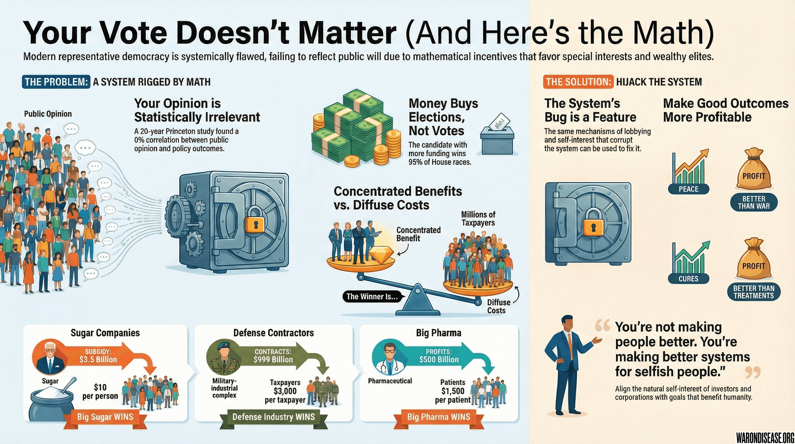



The mathematics of voting presents a stark reality:

Chance a single vote decides an election: [1 in 60 million](../references.qmd#odds-of-decisive-vote)
Value if the preferred candidate wins: $10,000 (in preferred policies)
Expected value of voting: $0.00017
Cost of voting (time, gas, finding parking): $50
Net value: -$49.99983

Voting is literally irrational. An individual has better odds of dying in a car crash on the way to vote than their vote mattering.

Yet people get angry when someone points this out.

## Democracy: A System Designed by Experts, Run by Imperfect Agents

The Founding Fathers were smart. They created checks and balances, separation of powers, and other safeguards.

They overlooked one factor: voter limitations.

The average voter faces significant knowledge gaps. [64% can't name or describe what the three branches of government do](../references.qmd#civic-literacy-survey-congress-function).

## The Rational Ignorance Problem

This explains why democracy cannot fix current problems:

**Cost of being informed**: 100+ hours researching candidates and issues
**Benefit of being informed**: One vote (worth $0.00017)
**Rational decision**: Remain uninformed

This is not stupidity. It's math.

Why spend 100 hours researching healthcare policy when one vote won't change anything? It is better to spend that time literally doing anything else.

So society gets this:

- [64% can't name or describe what the three branches of government do](../references.qmd#civic-literacy-survey-congress-function)
- [37% think the Earth is less than 10,000 years old](../references.qmd#young-earth-creationism-poll)
- These people pick who gets nuclear codes

Ask the average voter about CRISPR:

- 5% think it's gene editing
- 20% think it's a new salad
- 75% think it's a government conspiracy

These people vote on science funding.

## Expected vs. Actual Democratic Outcomes

Princeton University analyzed 1,779 policy decisions over 20 years. The correlation between what the public wants and what happens? [**Zero. Percent.**](../references.qmd#princeton-oligarchy-study)

But when economic elites want something? They get it [78% of the time](../references.qmd#princeton-oligarchy-study).

The average voter has the same political influence as a houseplant. Actually less, at least politicians pretend to care about the environment.

The chart above shows what actually happens: whether 0% or 100% of voters support a bill, it has the same ~30% chance of passing.

Here's what democracy SHOULD look like versus the reality:

## The Mathematics of Political Failure

### Concentrated Benefits vs. Diffuse Costs

[Sugar subsidies cost Americans $3.5 billion per year](../references.qmd#sugar-subsidies-cost). That's  per person.

Will an individual spend weeks fighting to save $10? No.
Will sugar companies spend millions to keep their $3.5 billion? Yes.

The outcome is predictable.

This pattern repeats everywhere:

- Military contractors: [$999 billion concentrated benefit](../references.qmd#us-military-budget-800b) (37% of  global spending)
- Taxpayers: $3,000 each in diffuse costs ($999B ÷ 333M Americans)
- Winner: The contractors

<!-- -->

- Pharma companies: [$500 billion in concentrated profits](../references.qmd#pharma-profits-500b)
- Patients: $1,500 each in diffuse suffering
- Winner: Not the patients

<!-- -->

- Banks in 2008: [$700 billion bailout (concentrated)](../references.qmd#tarp-bailout-700b)
- Taxpayers: $2,100 in taxes (diffuse)
- Winner: The banks

## How Money Acquires Power

[Research shows](../references.qmd#cost-of-political-influence) campaign contributions don't directly buy how politicians vote on legislation, only 1 in 4 studies support that notion.

But they do something far more effective: **They buy which politicians get elected in the first place.**

The numbers are stark:

- [95% of House races since 2004](../references.qmd#cost-of-political-influence): Won by the highest spender
- Average winning House campaign: [$2.79 million](../references.qmd#cost-of-political-influence)
- Average winning Senate campaign: [$26.53 million](../references.qmd#cost-of-political-influence)

If donors fund the campaigns of politicians who already agree with them, they don't need to buy votes later.
They've already bought the election.

**And for the ones already in office**, contributions buy something more subtle than votes:

- **Access**: The donor's call gets returned, others go to voicemail
- **Agenda control**: The donor's issue gets a hearing, others get buried
- **Legislative language**: The exact wording that creates loopholes
- **Committee positions**: [$450,000 to party committees](../references.qmd#cost-of-political-influence) buys a seat where bills live or die

Contributions don't buy the vote. They buy the voter, the agenda, and the conditions that make the vote irrelevant.

### The Lobbying ROI: 1,810:1 Returns

The most profitable investment in America isn't stocks or real estate. It's bribing politicians:

- Disease advocacy groups spend: [$100 million on lobbying](../references.qmd#disease-advocacy-lobbying-roi)
- They get: [$1.8 billion in increased funding](../references.qmd#disease-advocacy-lobbying-roi)
- ROI: 1,810:1

Meanwhile:

- Breast cancer: Great lobbyists = massive funding
- Heart disease: Kills more people, worse lobbyists = less funding
- Rare pediatric diseases: No lobbyists = no funding

The system doesn't allocate resources by need. It allocates by who can afford the best lobbying firm.

### Why Nothing Ever Changes: A Mathematical Proof

- Number of Americans who want lower drug prices: 330 million
- Money they contribute to this cause: $0
- Number of pharma executives who want high drug prices: 1,000
- Money they contribute: $4.88 billion

1,000 > 330,000,000 (when multiplied by money)

That's not corruption. That's math.

## Why Politicians Respond to Corporate Interests

A politician needs three things:

1. Votes
2. Money (from corporations)
3. Media coverage (from other corporations)

The average voter provides 1/150,000,000th of item #1.
Corporations provide 100% of items #2 and #3.

The incentives clearly favor corporate interests.

## The Median Voter Theorem

Political scientists have proven that in a democracy, policies converge on what the median voter wants.

The median voter:

- Has an IQ of 100 (by definition)
- [Reads at an 8th-grade level](../references.qmd#us-adult-literacy-level)
- [Believes in astrology](../references.qmd#astrology-belief-poll)
- [Can't find Europe on a map](../references.qmd#geographic-literacy-survey)

This is who decides if society cures cancer or builds more bombs.

## The Iron Law of Oligarchy

Every democratic organization eventually becomes an oligarchy. It's not a conspiracy. It's math.

Here's how:

1. Organization needs leaders
2. Leaders gain expertise and connections
3. Leaders become irreplaceable
4. Leaders do whatever they want
5. Democracy becomes decoration

This happened to:

- Every political party
- Every union
- Every non-profit
- Homeowners associations
- The PTA
- Everything

Democracy doesn't prevent oligarchy. It legitimizes it.

## The Congressman: Incentivized by Fundraising

Average time congressmen spend on:

- [Fundraising: 4 hours/day](../references.qmd#congress-time-spent-fundraising)
- Reading bills: 0 hours/day
- Actual governing: Whatever's left

They don't even read what they vote on. [The PATRIOT Act: 342 pages, voted on 45 minutes after release](../references.qmd#patriot-act-passage). [The Affordable Care Act: 2,700 pages, "we have to pass it to see what's in it."](../references.qmd#affordable-care-act-passage)

These people control nuclear weapons.

## Congressional Committees: Available for Purchase

Committees are where real power lives. They control which bills live or die, what gets funded, and who gets regulated. Lack of a committee seat results in limited power.

So naturally, [both parties sell them](../references.qmd#congressional-committee-price-list):

| Position | Democrats (DCCC) | Republicans (NRCC) | Why It Costs This Much |
|----------|-----------------|-------------------|------------------------|
| House Speaker | $31 million | $20 million | Controls entire agenda |
| Ways & Means Chair | $1.8 million | $1.2 million | All tax laws start here |
| Appropriations Chair | $1.8 million | $1.2 million | Controls $1.7 trillion budget |
| Energy & Commerce | $1.8 million | $1.2 million | Healthcare + Wall Street |
| Regular Committee | $500K-1M | $875,000 | Still beats irrelevance |
| Basic Member | $150,000+ | Varies | Entry fee to play |

The price correlates with power. Ways and Means writes tax code affecting trillions. Appropriations decides who gets government money. Energy and Commerce oversees healthcare (17% of GDP) and Wall Street.

Don't pay? The bills die. Amendments get ignored. There's even a ["giant wall of shame" displaying who hasn't paid their dues](../references.qmd#congressional-committee-price-list).

This is why congressmen spend 4 hours a day fundraising. They're not campaigning, they're paying rent on their committee seats. The people writing healthcare laws literally bought their positions from the same industries.

## The Short-Term Horizon

- Politician promises to "cure cancer"
- Gets elected
- Creates blue-ribbon commission
- Commission recommends more committees
- Next election happens
- New politician promises to "cure cancer"
- Repeat until heat death of universe

The political system creates a short attention span.

Real problems take decades to solve. Elections happen every 2-4 years. Politicians optimize for the next election, not the next generation.

## Why No One Can Fix This

Every four years, someone promises to "fix Washington."

Every four years, nothing changes.

Why? Because the problem isn't the people. It's the incentives.

Even electing 535 ethically perfect individuals would result in failure; within two years they'd be taking pharma money and approving bombing campaigns. The system corrupts everyone. It's designed to.

## The Voting Paradox

Democracy assumes voters want what's best for society.

Reality:

- Farmers vote for farm subsidies (bad for everyone else)
- The elderly vote for Social Security (paid by young people)
- The wealthy vote for tax cuts (paid by the poor)
- The poor vote for welfare (paid by the middle class)
- Groups vote to extract resources from other groups

It's not a democracy. It's a circular robbery.

## Special Interest Groups: The Real Winners

Number of voters: [240 million](../references.qmd#us-voter-population)
Number who care about sugar subsidies: 0
Number of sugar companies: 10
Number who care about sugar subsidies: 10
Winner: Big Sugar

This repeats for every industry:

- Corn: 4,000 farmers beat 330 million consumers
- Military: 5 contractors beat 330 million taxpayers
- Pharma: 50 companies beat 330 million patients

In democracy, the minority always beats the majority. The concentrated always beat the diffuse. The organized always beat the disorganized.

That's not a bug. It's the operating system.

## The Limitations of Partisanship

Republicans say they want small government.
Republican presidents increase spending.

Democrats say they want to help poor people.
Democrat cities have the most homeless.

Libertarians say they want freedom.
Libertarians can't even agree what a road is.

They're all selling the same product: Hope that voting matters.

It doesn't.

## The Solution Democracy Can't Provide

Democracy can't solve coordination problems. It creates them.

Example: Climate change

- Cost to fix: $1 trillion
- Benefit: Survival of species
- Problem: Benefits are in 50 years, costs are today
- Democratic solution: Argue about it until Miami is underwater

Example: Medical research

- Cost: $100 billion
- Benefit: Cure all disease
- Problem: Benefits are diffuse, costs are concentrated
- Democratic solution: Spend it on bombs instead

Democracy optimizes for short-term concentrated benefits. Every time.

## Public Choice Theory

[In 1986, James Buchanan won the Nobel Prize in Economics](../references.qmd#james-buchanan-nobel-prize-1986) for proving what everyone already knew:

**People don't suddenly become angels when they work for the government.**

This is Public Choice Theory: bureaucrats, politicians, and regulators are **just as selfish** as everyone else. They just have better PR.

### What They Actually Maximize

| Actor | Should Maximize | Actually Maximizes | Result |
|-------|----------------|-------------------|--------|
| NIH | Cures | Grants awarded | No cures |
| FDA | Lives saved | Avoiding lawsuits | Deadly delays |
| Congress | Voter welfare | Campaign donations | Corporate welfare |
| Pharma | Health outcomes | Recurring revenue | Chronic disease preferred |
| Military Contractor | National security | Government contracts | Endless wars |

**No actor in the system is incentivized to cure disease. Or end war.**

### The Libertarian Paradox

**Libertarians say**: Government fails because it's run by self-interested people

**Socialists say**: Government fails because it's underfunded

**Public Choice Theory says**: Government fails because self-interested people are in positions where their interests conflict with good outcomes

**The solution**: Design systems where self-interest produces good outcomes

## Why This Is Actually Good News

Political mechanisms cannot fix these problems. But markets can.

Markets don't care if voters are uninformed. Markets don't care if politicians are corrupt. Markets care about one thing: profit.

So make the right thing profitable.

That's what a [1% treaty](../solution/1-percent-treaty-academic.qmd) does. It doesn't try to fix democracy. It bypasses it entirely.

Instead of convincing 240 million voters to be smart (impossible), one convinces 1,000 investors to be greedy (automatic).

### Why This Is Liberating

Society doesn't need to:

- Find virtuous leaders
- Hope politicians care
- Wait for bureaucrats to change
- Convince anyone to be less selfish

One just needs to **align their selfishness with public goals**.

## Solution

Democracy fails because:

- Voters are rationally ignorant
- Politicians follow incentives
- Special interests concentrate benefits
- Costs are diffused to everyone

A 1% treaty solution:

- Don't need informed voters (investors do the math)
- Create better incentives (make health profitable)
- Concentrate benefits for reform ([VICTORY Incentive Alignment Bonds](../economics/victory-bonds-academic.qmd))
- Diffuse costs to military budget (they won't notice 1%)

This approach uses systemic flaws as features.

## The Strategic Choice

Option A: Keep voting and hope it matters this time (it won't)

Option B: Accept that democracy is broken and use market incentives instead

The Founding Fathers were geniuses, but they didn't anticipate:

- Television
- The internet
- Nuclear weapons
- Global pandemics
- Voters who think vaccines cause autism

Democracy made sense in 1789. In 2025, it's a cargo cult.

But markets? Markets turned feudal peasants into TikTok influencers. Markets put computers in pockets more powerful than what sent men to the moon. Markets work.

**The goal is not making people better. It's making better systems for selfish people.**

And since everyone's selfish, those systems will actually work.

Let's use what works.

## A Brief History of Human Decision-Making

[Democracy is the worst form of government, except for all the others](../references.qmd#churchill-democracy-quote).

Churchill said that. He was correct.

Here's how humanity currently makes decisions:

1. **Ancient Times**: The strongest individual decided everything. Sometimes eaten by a tiger. A new strong individual took over.

2. **Classical Era**: Citizens in togas voted. Women, slaves, and anyone interesting excluded. Socrates forced to drink poison for asking questions.

3. **Medieval Period**: God allegedly told one inbred family what to do. The family was mostly interested in cousin-marriage and cathedral construction.

4. **Modern Democracy**: Millions vote for representatives who ignore them. Representatives vote based on contributions. Lobbyists write the actual laws. Everyone pretends this makes sense.

5. **Current System**: All of the above, plus Twitter.

## Cognitive Limitations and Democracy

The human brain evolved to:

- Remember where the good berries are
- Run from tigers
- Decide who to mate with
- Hold grudges against the person who stole the mammoth meat

The human brain did NOT evolve to:

- Understand compound interest
- Evaluate 10,000 budget proposals
- Comprehend exponential growth
- Care about people 10,000 miles away
- Think about consequences beyond next Tuesday

Human working memory can hold about [7 things](../references.qmd#cognitive-limit-seven-items). That's it. Seven. The phone number length isn't a coincidence.

Yet the system asks people to:

- Choose between thousands of political candidates
- Understand the federal budget ($6 trillion of complexity)
- Have opinions on every global crisis simultaneously
- Rank the importance of infinite problems
- Do all this while checking Instagram

No wonder democracy produces results like:

- The platypus (God's committee design)
- The U.S. tax code ([27,000 pages of pure evil](../references.qmd#us-tax-code-length))
- Pineapple pizza (crimes against Italy)

The system asks primate brains to do quantum physics. Then society is surprised when the primates elect other primates who throw feces at each other on C-SPAN.

## The Reality of Budget Allocation

### The Current Budget Process: Democracy Theater

Here's how the government decides to spend trillions:

#### Step 1: Lobbying Influence

- Military contractors donate $50 million
- Pharmaceutical companies donate $40M
- Teachers unions donate their lunch money
- Low-income populations donate nothing

##### Step 2: Politicians Act Out a Role

- Hold hearings nobody watches
- Read reports nobody wrote
- Make speeches nobody believes
- Vote based on who paid them

###### Step 3: The Budget Emerges

Like a demon from a committee meeting:

- Military: [$999 billion](../references.qmd#us-military-budget-800b) (for killing)
- Healthcare: [$1.5 trillion](../references.qmd#us-federal-healthcare-spending) (for not dying, but slowly)
- Education: [$80 billion](../references.qmd#us-federal-education-spending) (explaining why we can't afford education)
- Arts: [$200 million](../references.qmd#us-federal-arts-spending) (Congress's cocaine budget is higher)

###### Step 4: Everyone Gets Angry

- Conservatives: "Too much welfare!"
- Liberals: "Too much warfare!"
- Economists: "None of this makes sense!"
- Lobbyists: "Perfect, same time next year?"

This system has produced:

- [$30 trillion in national debt](../references.qmd#us-national-debt)
- Bridges collapsing while the country builds new bombers
- Schools using textbooks from 1987
- The F-35 fighter jet (doesn't fight, barely jets)

---

*P.S. - If the reader still believes in democracy, they should ask: Would one let 150 million random Americans perform their heart surgery by voting on each incision? No? Then why let them vote on healthcare policy? At least with surgery, the patient would die quickly.*

## Regulatory Capture: How Industries Write Their Own Rules

The best investment in America isn't stocks or real estate. It's buying politicians. As detailed earlier, the return on investment for lobbying is astronomical, with studies showing returns as high as **1,810:1**.

### Mechanisms of Influence

1.  **Employment of Former Officials:** There are [13,700 registered lobbyists in Washington](../references.qmd#lobbyist-statistics-dc), and [half of them used to work in the government](../references.qmd#lobbyist-statistics-dc) they're now bribing. The revolving door spins so fast it powers half of DC.

2.  **Speak the Universal Language (Money):** In 2023, corporations spent [$4.1 billion on lobbying](../references.qmd#corporate-lobbying-spending-2023). That's $7.7 million per congressman, who makes only [$174,000 a year](../references.qmd#congressman-salary).

3.  **Write the Laws:** Pharmaceutical companies and military contractors literally write their own regulations and budgets. The Medicare Modernization Act of 2003, [written by pharma lobbyists](../references.qmd#medicare-modernization-act-pharma-lobbying), [banned the government from negotiating drug prices](../references.qmd#medicare-modernization-act-pharma-lobbying), leading to Americans paying [$1,200 for insulin that costs $6 to make](../references.qmd#insulin-history-and-pricing).

### The Money Machine: How Regulatory Capture Works

1.  **Campaign Contributions**: Perfectly legal bribes. [Citizens United](../references.qmd#citizens-united-ruling) made corporations people, and people can donate unlimited money through Super PACs.

2.  **Revolving Door**: Work in government, learn the system, sell that knowledge to the highest bidder. It's LinkedIn for corruption.

3.  **Lobbying**: Hire people to whisper sweet nothings (and campaign donation promises) in politicians' ears.

4.  **Jobs Blackmail**: Spread operations across districts. Threaten to leave if politicians don't cooperate. "Nice employment rate you got there. Shame if something happened to it."

5.  **Regulatory Capture**: Get allies appointed to agencies that regulate the industry. The regulator does not guard the industry; the industry captures the regulator.

### The Military-Industrial Complex

Lockheed Martin's business model is a masterclass in political leverage. By distributing operations across [42 states](../references.qmd#lockheed-martin-political-influence-2022), they ensure that any attempt to cut funding for a program like the [$1.7 trillion F-35 fighter jet](../references.qmd#f35-program-lifetime-cost-1-7t) is met with furious opposition from senators protecting local "jobs."

#### The Military Budget: A Comedy in Three Acts

**Act 1**: The Pentagon requests nearly a trillion dollars for "readiness," a figure detailed in the [Cost of War chapter](cost-of-war-academic.qmd).

**Act 2**: Congress adds [$25 billion the Pentagon didn't ask for](../references.qmd#congress-unrequested-defense-spending).

**Act 3**: Money goes to contractors in key congressional districts.

*Curtain falls. Taxpayers bear the cost.*

The Pentagon has [never passed an audit](../references.qmd#pentagon-unaccounted-2-5t). They literally don't know where [trillions of dollars](../references.qmd#pentagon-unaccounted-2-5t) went. But somehow they know they need more.

### Pharmaceutical Influence

The pharmaceutical industry employs [3 lobbyists for every member of Congress](../references.qmd#pharma-lobbying-stats), ensuring that policies favor profit over patients. The result is a system where a drug patent sold for [$1 in 1922](../references.qmd#insulin-history-and-pricing) now costs Americans [$300 per vial](../references.qmd#insulin-history-and-pricing), and where the FDA gets [75% of its drug review budget from the companies it regulates](../references.qmd#fda-regulatory-capture-evidence).

### Perverse Incentive Structures

The entire system is perfectly incentivized to maintain the status quo:

- **Pharmaceutical Companies:** Cures are a one-time payment; treatments are a recurring revenue stream.
- **FDA Regulators:** Approving a bad drug ends a career; delaying a good one has no consequences.
- **Politicians:** Funding pragmatic clinical trials is boring; creating new agencies provides photo ops.

Powerful actors win. Everyone who's dying loses.

### The Overlooked Solution

Here's the secret: Their whole system depends on diffuse costs and concentrated benefits.

Each American loses $100 to corruption. Not worth fighting over.
Each corporation gains $100 million. Very worth fighting for.

But what if one concentrated the benefits of reform? What if curing disease was more profitable than treating it? What if peace paid better than war?

That's what a [1% treaty](../solution/1-percent-treaty-academic.qmd) does. It doesn't fight the system. It hijacks it.

It is possible to out-bid the current influences.

The same lobbying system that created this mess is the feature society will exploit. Lockheed Martin and Pfizer don't love war and disease; they love money. By making health and peace the most profitable investments in history, one can leverage the system and buy democracy back.

### The Legislative Marketplace

Every law is for sale. Every regulation negotiable. Every politician has a price.

That's not cynicism. That's Wednesday in Washington.

The military-industrial complex figured this out in 1961. Big Pharma perfected it in the 1990s. Wall Street turned it into an art form in 2008.

Now it's society's turn.

Fixing democracy is unlikely. The goal is to buy it back.

One perfectly legal contribution at a time.

---

*P.S. - If this chapter was depressing, remember: The same system that lets corporations buy politicians also lets society buy them back. The corruption is the feature to exploit. It's like using the Death Star's exhaust port, but with spreadsheets instead of proton torpedoes.*