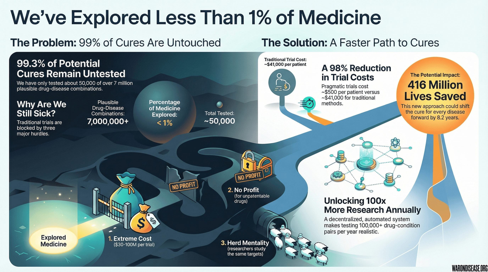



### Or: Medicine is Standing in the Parking Lot of Disney World

Society believes it has explored medicine. In reality, researchers are standing in the parking lot of Disney World bragging about how fun the pavement is. They have taken pictures of the asphalt. They have written dissertations about the parking stripes. They have never gone inside.

After a century of pharmacology, most beneficial effects of molecules on diseases remain unexplored. Not because biology is constrained. Because clinical trials are slow, expensive, and run by administrators who mistake "urgency" for a brand of perfume.

Here is the math. It is painful but brief.

## The Current Therapeutic Sandbox

Here is everything humanity considers "medicine" after 5,000 years of civilization:

* **Prescriptions:**  products approved in the U.S. This sounds impressive until one realizes most are minor variations of existing drugs; "Tylenol, but blue."
* **Unique Ingredients:** These products contain only  unique active ingredients. That is fewer ingredients than a decent French bakery uses.
* **Investigational Drugs:** Pipeline analyses suggest  compounds have passed Phase I globally.
* **Safe Stuff:** The FDA GRAS list contains  substances.

**Total unique compounds humanity knows are safe-ish: .**

That is it. That is the global medicine cabinet after five millennia.

## The Target List (Ways The Body Breaks)

* **Codes:** The ICD-10 has  codes for ways human flesh can malfunction.
* **Real Targets:** Consolidation gives  trial-relevant diseases worth fixing.

## The Math The Field Ignores

Taking the  safe compounds and multiplying by  diseases yields the "Combinatorial Space." This is academic language for "interventions that could be tested immediately if administrative burdens did not exist."

** compounds ×  diseases =  plausible drug-condition combinations.**

### Current Testing Status

* **Approved uses:**  unique approved drug-disease pairings.
* **Repurposed uses:**  of drugs gain at least one new indication after initial approval.
* **Failed trials:** Let us be generous and assume researchers tested 10 times as many things that failed.

**Total tested:  relationships.**

### The Scorecard

 tested /  possibilities = 

**Humanity has explored less than 1% of the theoretically testable drug-disease space.**

Medicine is missing  of the picture.

This is comparable to reading the first page of *War and Peace* and writing a book report claiming "It's About a Party." Technically accurate. Cosmically insufficient.

## Is The Untested Space Useful?

Critics might argue, "Maybe the other 99% is useless!"

Biology disagrees.

* **Undrugged Targets:** Mapping 350,000+ clinical trials showed that only  of the human interactome has ever been targeted by drugs. Current science ignores 88% of human biology. It is like owning a 100-room mansion and never leaving the bathroom.
* **Polypharmacology:** Drugs are messy. They hit multiple targets. FDA-approved drugs often bind to things not intended. This means "side effects" are often "cures for something else" that go unnoticed. Every headache pill might cure Alzheimer's. Science will not know until it checks.
* **Network Overlap:** [Diseases cluster on shared biological networks](../references.qmd#disease-network-overlap). A drug for arthritis might cure Alzheimer's. Researchers won't know until they check. But nobody is checking.

## The Universe is Big. Humanity is Small.

So far this has only counted molecules humanity *already has*. If one looks at what is chemically possible, the results are embarrassing.

* **Chemical Space:** Estimated [10^23 to 10^60](../references.qmd#chemical-space-size) drug-like molecules.
* **Virtual Libraries:** [ZINC-22 contains tens of billions](../references.qmd#zinc-22-database) of purchasable virtual molecules.
* **Synthesized:** Chemists have made **<10^(-40)** of possible molecules.

**Tested / Possible = ~10^-20 to 10^-50.**

**Effectively zero.** The field hasn't even started.

This is comparable to exploring Earth by examining one grain of sand on a beach in New Jersey, then declaring one has "seen the world." They haven't. They have seen a grain of sand. In New Jersey.

## Why Sickness Persists

It is not because science is hard. It is because:

1. **Trials Cost Too Much:** A typical Phase II-III RCT costs **$30-$100M** (Median cost per patient [~$41,000](../references.qmd#trial-cost-41k)). At that price, sponsors only test "sure things." They test the equivalent of betting a house that the sun will rise. Safe bets. Boring bets. Bets that don't cure cancer.

2. **Herd Mentality:** Trials overwhelmingly test the same few biological targets due to [preferential attachment dynamics](../references.qmd#preferential-target-attachment). Researchers study what everyone else is studying because that is how one gets grants. This is as if every explorer visited only France because France already had good reviews on TripAdvisor.

3. **No Profit:** Most molecules have no patent. No patent = no $100M trial = no approval. A potential cure for cancer might be aspirin plus vitamin D, but nobody will ever test it because nobody can patent aspirin plus vitamin D. This is a system designed by people who seem to despise the sick.

4. **Neglect:** If a patient has a rare disease with no market, they do not get a drug. Sorry. Their cells malfunction in an unprofitable way. The invisible hand of the market has determined these deaths are not worth preventing.

## The Fix

The Oxford RECOVERY Trial (COVID-19) proved that large-scale pragmatic trials can run for [~$500 per patient](../references.qmd#recovery-cost-500) and deliver results in [<100 days](../references.qmd#recovery-trial-100-days-to-cure).

$500 vs $41,000. 

If society automates this via a decentralized framework for drug assessment:

* Researchers can run **100x-1,000x more trials per year**.
* Testing **100,000+ drug-condition pairs** becomes realistic.
* The field stops guessing and starts exploring the "dark matter" of medical therapeutics.
* Humanity enters the theme park instead of photographing the parking lot.

## The Bottom Line

**Humanity has empirically tested less than 1% of the drug-disease relationships that can be tested using existing safe compounds.**

**If one includes the larger chemical universe, humanity has explored roughly one-quadrillionth to one-quintillionth of what is possible (10^-12 to 10^-50).**

**The overwhelming majority of therapeutic potential remains untouched. Not because cures are impossible. Because trials are too expensive and too slow.**

**A decentralized, automated pragmatic trial system is the only route to systematically explore the remaining 99.999...% of medical space.**

Medicine is not in the parking lot because there is nothing inside Disney World. Medicine is in the parking lot because the entrance fee is $100 million and requires 17 years.

The rides are inside. The cures are inside. Society just needs to open the gate.