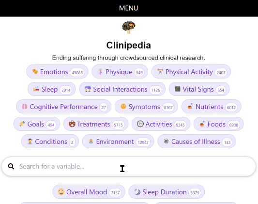
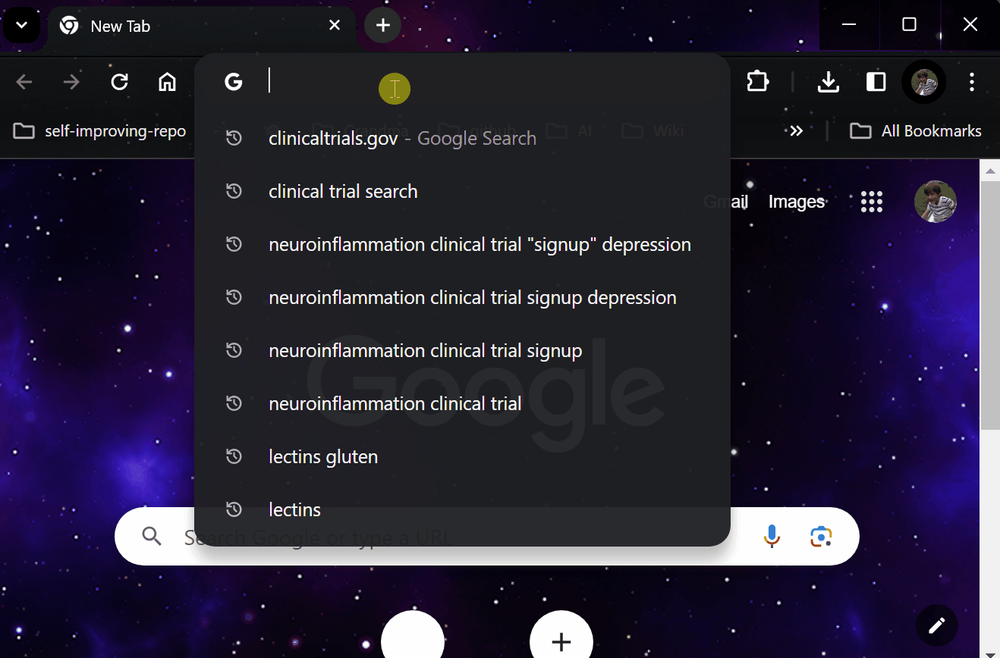
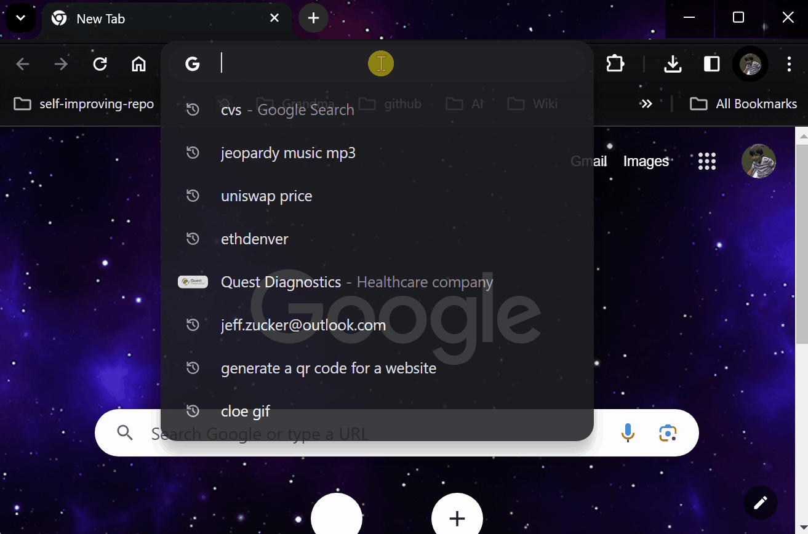
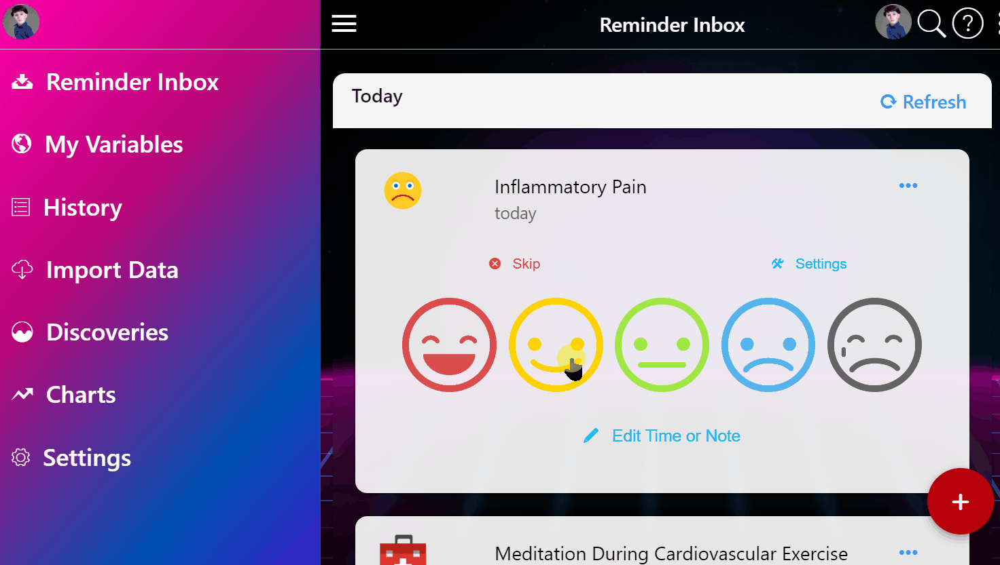
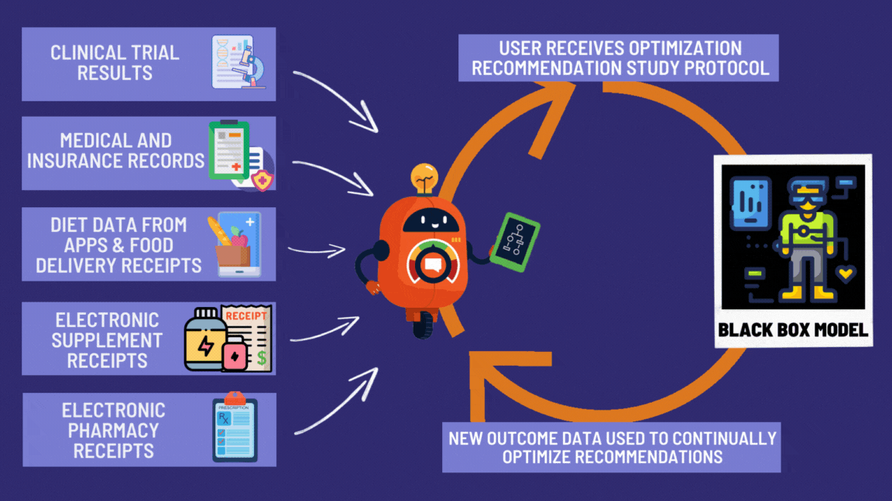
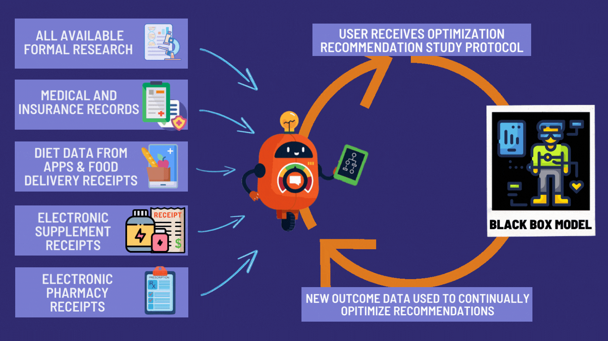




On Wishonia, we eliminated disease 4,000 years ago. Every citizen has access to every treatment. Every outcome is recorded. Every disease gets studied. It's not complicated. You let sick people try things and write down what happens. But since your planet somehow hasn't figured this out, here's the instruction manual.

Out of  with chronic disease, only  participate in trials annually [@global-trial-participant-capacity]. That's ****.

 would volunteer [@patient-willingness-clinical-trials] if they could. Only  currently participate.

This isn't because people don't want to help find cures. It's because your system was designed by someone who hates sick people. Trials cost , require traveling to major medical centers, and reject  of actual patients [@antidepressant-trial-exclusion-rates]. You built a hospital you can't get into. Impressive, in a genocidal sort of way.

Meanwhile, the system that's supposed to catch dangerous side effects misses 90-99% of them. Only 1-10% of adverse drug events are ever reported to the FDA [@adverse-event-underreporting]. No denominator data. No effect sizes. No way to calculate how often a drug actually hurts people. The safety monitoring system is a suggestion box that nobody uses.

**You don't have a recruitment problem. You have a capacity problem.**

## The Solution: Consumer Reports for Drugs

On Wishonia, this is just called "medicine." You type in what's wrong with you, see what worked for everyone else, and try it. The outcomes get recorded automatically. We've had this for millennia. You have all the technology to build it right now, and somehow haven't.

Your decentralized FDA is an **open coordination protocol**. It connects companies with treatments to patients who need them. It's HTTP for clinical trials. A standard that lets all the existing systems talk to each other and share outcomes.
You invented the internet over three decades ago and somehow forgot to plug medicine into it.

## How It Works: Just Let People Try Stuff (Carefully)

Yes, the FDA exists because patent medicine salesmen were literally poisoning people, and thalidomide gave "birth defect" a whole new meaning. Nobody's arguing for no regulation; we're arguing for regulation that doesn't kill more people than it saves.

Here's a thought that apparently never occurred to anyone in Washington:

What if sick people could just... try treatments?

And then we could... write down what happens?

And then other sick people could... see what worked?

Your current system leaves 95% of rare diseases [@95-pct-diseases-no-treatment] with zero approved treatments. It bars over 85% of patients [@fda-trial-patient-exclusion-criteria; @antidepressant-trial-exclusion-rates] from the trials that might save them. We've perfected a system where only the healthy and compliant test cures for the sick and desperate. It's genius, in a suicidal sort of way.

Trials are designed to test drugs on people who don't actually exist. To get into a study for an antidepressant, you can't have any other pesky problems like anxiety or PTSD. You can't have a history of drug or alcohol use. You can't be on other medications. You have to be the *perfect* kind of sick. The result? Only about 14% [@pubmed-14628985; @antidepressant-trial-exclusion-rates] of real-world patients with depression would actually qualify. The rest of us are too messy for their pristine, clean data.

On top of excluding everyone with a pulse, these "definitive" studies run on comically small groups. They'll test a new heart drug on 275 people [@us-trial-enrollment-targets-2009]. A cancer drug on just 20 people [@us-trial-enrollment-targets-2009]. A diabetes drug on 100 people [@us-trial-enrollment-targets-2009]. Then they prescribe the winner to millions.

You're basing survival on sample sizes smaller than kindergarten classes. So instead of studying mythical, perfectly sick unicorns, what if you just collected data from everyone who's *actually* sick?

### The Power of Real-World Evidence (Or: Spying on Sick People for a Good Cause)

This framework is built on a slightly creepy idea: analyzing data from real patients in the real world. Real-World Evidence (RWE). A fancy term for "watching what happens."

Skeptics say, "Correlation isn't causation!" They say this while dying of diseases nobody bothered to study properly. They point to flip-flopping egg advice as proof this is voodoo. They're not wrong about the old way. Old studies couldn't tell if eggs killed people or if egg-eaters just smoked three packs a day.

But now there's enough data and computing power to make each person their own control group. Track arthritis pain for a month. Take Turmeric, stop, start again. The pattern reveals whether it works or if it's coincidence.

A landmark meta-analysis in the New England Journal of Medicine [@meta-analysis-in-the-new-england-journal-of-medicine] quietly ended this argument while nobody was listening. Researchers compared observational studies against randomized controlled trials across 19 different treatments. Cardiac surgery, cancer, ophthalmology, obstetrics. The result: nearly identical effect sizes. The cheap method and the expensive method found the same answers. You've been overpaying for data like tourists at an airport restaurant.

Each pair of dots represents the same treatment tested two ways: one observational (cheap, fast, real patients) and one randomized controlled (expensive, slow, cherry-picked patients). In nearly every comparison, the confidence intervals overlap. Both methods found the same treatments work and the same treatments don't.

### The Two-Stage Pipeline: Watch First, Then Test

Observational data finds the signals. But correlation still isn't proof (even you know that). So the framework uses a two-stage pipeline:

**Stage 1 (Signal Detection):** Aggregate data from millions of patients. Score each treatment-outcome relationship using six Bradford Hill causality criteria [@bradford-hill-1965]: How strong is the effect? How consistent across people? Does the treatment come before the improvement? Is there a dose-response pattern? Cost: ~ per patient.

**Stage 2 (Confirmation):** The top signals (the 0.1-1% most promising) proceed to pragmatic trials embedded in routine care. Simple randomization. Real patients. Real conditions. Cost: ~ per patient. This eliminates confounding and proves causation.

Stage 1 filters millions of possibilities for almost nothing. Stage 2 confirms the winners for 1/44th the cost of traditional trials. The result: every treatment gets an evidence grade.

- **Validated**: Confirmed by pragmatic trial
- **Promising**: Strong observational signal, awaiting trial
- **Signal**: Hypothesis only, needs more data

The cheap stage does the hard work of searching. The expensive stage only runs on candidates that deserve it. Instead of spending $57 million testing one drug, you spend pennies watching a million treatments and under a thousand dollars confirming the ones that work.

## Proof It Works (While the FDA Wasn't Looking)

### The Oxford Recovery Trial: How the British Accidentally Saved Medicine

During COVID, while America was filling out forms, Oxford University did something crazy. They just tested drugs on dying people to see if they stopped dying.

Cost per patient:

- Normal clinical trials: 
- Oxford pragmatic trials: 

That's not a typo. Five hundred dollars. The cost of a nice dinner in Manhattan to save a human life.

Results:

- Found that steroids cut COVID deaths by 30% [@recovery-trial-dexamethasone-results]
- Saved over  globally [@recovery-trial-summary-quote]
- Took  [@recovery-trial-100-days-to-cure] instead of 3 years
- Cost less than one Super Bowl commercial

The FDA's response: "But did they file the correct paperwork?"

RECOVERY wasn't a fluke. A Harvard meta-analysis of 108 embedded pragmatic trials [@embedded-pragmatic-trials-meta-analysis] found median costs of just $97 per patient. The PCORnet ADAPTABLE trial enrolled 15,076 patients across 40 clinical sites at  per patient [@pragmatic-trials-cost-advantage]. This model works across therapeutic areas, across countries, across decades. The evidence base for cheap, fast, embedded trials isn't one study. It's 108 and counting.

## What You'd See: FDA.gov 2.0

The protocol upgrades FDA.gov from a digital cemetery to something useful. Cost: Less than one fighter jet that doesn't work.

### Step 1: Type in What's Killing You

Revolutionary feature: A search box. The FDA's current website doesn't have this because they assume you've already died.

### Step 2: See What Actually Works (Based on Reality, Not Theory)

::: {.content-hidden when-format="epub"}
::: {.content-hidden when-format="pdf"}

:::
:::

Instead of "This drug is approved for exactly this condition in exactly these patients on exactly Tuesdays," you get:

"Here's what happened to 50,000 people who tried this:

- 40% got much better
- 30% got somewhat better
- 20% no change
- 10% grew a third nipple (but a useful one)"

It's like Consumer Reports, but for not dying.

**Treatment Rankings: Every Option, Ranked by Reality**

Search any condition and see every treatment ranked by real-world effectiveness:

- **FDA Approved treatments** with effectiveness scores from actual patients
- **Phase 3 and Phase 2 trials** you can join right now
- **Experimental options** with preliminary data
- One-click access to join available trials

No more guessing which treatment your doctor half-remembers from a conference. Just clear rankings based on what actually worked for people like you. The current system never publishes negative results. Humanity wastes billions repeating the same failed ideas.

### Step 3: Join a Trial from Your Couch (While Dying Comfortably)

::: {.content-hidden when-format="epub"}
::: {.content-hidden when-format="pdf"}

:::
:::

Current system: Drive 500 miles to a university hospital, wait 6 months, get rejected for having the wrong kind of dying.

New system: Click button. Get pills. Report if you die.

Revolutionary!

### Step 4: Get Drugs Delivered Like Pizza (But More Life-Saving)

::: {.content-hidden when-format="epub"}
::: {.content-hidden when-format="pdf"}

:::
:::

Amazon can deliver a banana costume in 2 hours but experimental medications take 6 months and require seven forms of ID?

Your framework fixes that. Your pharmacy becomes a trial site. Your doctor becomes a researcher. Your dying becomes data.

### Step 5: Publish Results

::: {.content-hidden when-format="epub"}
::: {.content-hidden when-format="pdf"}

:::
:::

Current system: 500-page case report forms that ask questions like "Rate your suffering on a scale of mauve to burnt sienna."

New system:

- "Are you dead?" Yes/No
- "If no, how dead do you feel?" Slider bar
- "Any new body parts?" Check all that apply

### Step 6: Everyone Benefits from Everyone's Suffering

::: {.content-hidden when-format="epub"}
::: {.content-hidden when-format="pdf"}

:::
:::

Your data helps the next person. Their data helps you.

Every pill becomes a tiny experiment. Every patient becomes a scientist. Every outcome gets recorded.

You should have done this when you invented writing in 3000 BC.

## Outcome Labels: Nutrition Facts for Drugs

Food has nutrition labels. Cigarettes have warning labels. Drugs have... incomprehensible 40-page inserts written by lawyers having seizures.

**Outcome Labels** fix that. Clear, data-driven summaries showing exactly what happens when real people try a treatment:

No marketing spin. No 40-page legal disclaimers. Just clear data about what actually happens to people like you.

Here's what an Outcome Label for depression would actually look like:

**OUTCOME LABEL: Depression Severity**

*Based on 47,832 participants*

**Treatments Ranked by Effect Size**

| Rank | Treatment | Effect | Sample Size | Optimal Dose |
|:-----|:----------|:-------|:------------|:-------------|
| 1 | Bupropion | -28.3% | 2,847 | 300mg |
| 2 | Sertraline | -24.7% | 5,123 | 100mg |
| 3 | Venlafaxine | -21.2% | 1,892 | 150mg |
| ... | ... | ... | ... | ... |

Every treatment ranked. Drugs, supplements, lifestyle interventions, off-label uses. All compared head-to-head using the same outcome data. No marketing budget required.

## Your Personal Death-Prevention Assistant: The FDAi

On Wishonia, every citizen gets one of these at birth. It monitors their health, finds treatments matched to their biology, and adjusts dosing in real time. We've had them for 3,000 years. You've had the technology for nearly two decades and used it to count steps.

Everyone gets a superintelligent doctor that lives in their phone and doesn't judge them for Googling "is my poop normal?"

The **FDAi** (Food and Drug Artificial intelligence) is like Siri, but instead of telling you the weather, it tells you how not to die.

**You**: "I have diabetes and my foot fell off."
**FDAi**: "Based on 50,000 similar cases, here's what worked:

- 60% success: Reattachment surgery + Drug A
- 30% success: Prosthetic foot + Drug B
- 10% success: Hopping lessons + Prayer
- 0% success: Essential oils (but your remaining foot will smell lavender-fresh)"

It connects to your wearables, apps, and medical records to find what's killing you while your doctor is still trying to remember your name. Every doctor who ever lived, in your pocket, and they actually agree on something.

It also does something no doctor can: precision dosing. By analyzing what dose preceded your best outcomes, it generates personalized recommendations. Not "take some magnesium." Instead: "Your sleep quality was highest after 400mg of Magnesium over the previous 24 hours." Optimal doses derived from your data, not a study of 36 college students in 1997.

## Making It Legal to Not Die

This solution requires a law: the [Right to Trial and FDA Upgrade Act](../appendix/right-to-trial-fda-upgrade-act.qmd). It says dying people can try things that might help them not die, and what happens gets written down so other dying people can see what worked.

The fact that this requires a law tells you everything about your species.

## The Business Model: How Everyone Profits Except Disease

### How Companies Register Treatments (5 Minutes, Zero Approval Needed)

**Any company** - pharma, supplements, food, interventions - can instantly create a trial:

1. **Register treatment** on a public portal (name, ingredients, condition, price)
2. **Set treatment price** (what you charge patients - covers manufacturing + delivery)
3. **Get automatic liability insurance** (built into protocol governance)
4. **Trial goes live immediately** - appears in search results, ranked by existing data
5. **Patients join** based on rankings → You collect zero-cost data on whether it works

#### Net cost to company: $0

**Why?**

- Patients pay for treatment (covers manufacturing/delivery)
- Patients provide data (eliminates data collection cost ~/patient)
- Protocol enables standardized analysis (eliminates analysis cost)
- Insurance is built-in (eliminates liability cost)

### The Payment Flow

**Patient pays:** Treatment cost + Refundable deposit
**Patient receives:** Subsidy (from a 1% Treaty Fund)
**Patient reports:** Outcomes via simple app
**Deposit refunded:** When trial complete
**Net cost to patient:** zero. Some patients profit up to $50.

#### Example

- Patient joins trial for experimental migraine treatment ($100/month)
- Pays: $100 treatment + $50 deposit = $150
- Receives: $125 subsidy
- Out of pocket: $25
- Completes trial, reports outcomes
- Gets back: $50 deposit
- **Net: +$25 profit + potentially cures migraines**

#### Company receives

- $100/month from patient
- Manufacturing cost: $20/month
- Profit: $80/month per patient
- Plus: Free clinical trial data worth /patient in traditional system

### Why This Creates Unlimited Research Capacity

| | Traditional Model | Decentralized Protocol |
| :--- | :--- | :--- |
| **Start** | Research ideas | Research ideas |
| **Gatekeeping** | Grant committees select the few | Register instantly |
| **Enrollment** | Recruit from limited pool | Patients decide by joining |
| **Cost to company** | $57M per trial | $0 (patients pay for treatment) |
| **Throughput** | ~10 trials/year per company | Unlimited trials simultaneously |

**This is why 95% of rare diseases have no treatments.** Traditional funding can't afford to test everything. This decentralized protocol enables testing EVERYTHING because:

- No approval bottleneck (instant registration)
- No funding bottleneck (patients pay for treatment)
- No data collection bottleneck (patients provide data)
- No disease too rare (if 100 patients exist globally, trial can run profitably)

**Traditional trial:** Pharma spends $57M, tests most profitable drug only
**Decentralized trial:** Pharma spends $0, tests everything including supplements, food, lifestyle, off-patent drugs

A 1% Treaty Fund doesn't fund pragmatic clinical trials directly. **It subsidizes participation, which unlocks a self-sustaining ecosystem that funds ALL research.**

## The Money Shot: How to Save 95% on Not Killing People

| Problem to Fix | Current Insanity | New Reality | Money Saved | Lives Saved |
| :--- | :--- | :--- | :--- | :--- |
| Clinical Phase Timeline | **Over a decade [@drug-development-timeline-17-years]** | **2-3 years** | ~7 years of waiting eliminated | ~50,000/year [@beta-blocker-drug-lag-deaths] |
| Cost per trial | **$57 million** [@clinical-trial-cost-breakdown] | **$2 million** | $55 million | Infinite ROI |
| Who can participate | **13.9% of patients [@antidepressant-trial-exclusion-rates]** | **100% of patients** |  exclusion rate eliminated | Everyone |
| Rare diseases with treatments | **5% [@95-pct-diseases-no-treatment]** | **Eventually 100%** | Priceless | Millions |

### The Itemized Receipt of Eliminated Stupidity



This eliminates $55 million per trial.

## The Partnership Approach: Building Rails, Not Trains

Here's what you're NOT doing: building a government platform that competes with existing medical technology companies.

Here's what you ARE doing: building an open protocol that lets all existing platforms talk to each other.

Think of it like the internet. We didn't build one website that everyone has to use. We built HTTP, the protocol that lets all websites connect. Same idea.

**How your decentralized FDA gets funded:** An implementation of this framework is one of many campaigns competing for funding from the 1% Treaty Fund via [Wishocracy](wishocracy.qmd). It has no independent budget authority. If a particular implementation gets captured or fails to deliver, the community can fund alternative implementations instead. This prevents the "new FDA" problem.

### The Players Already in the Game

Multiple companies have already built decentralized clinical trial platforms. They've collectively raised hundreds of millions in venture funding [@dct-platform-funding-others]. They're good at it. They have users. They have infrastructure.

Why compete with them? That would be very human of you. Partner instead.

**The protocol provides**:

- Open protocol for data exchange (like email protocols)
- Federated data network (data stays in Epic/Cerner/Apple Health systems)
- Treatment ranking algorithms (open source, anyone can verify)
- Trial matching services (connects patients to ANY platform)

**Existing platforms provide**:

- Patient-facing apps and interfaces
- Trial management tools
- Sponsor relationships
- Regional expertise

### Federated, Not Centralized

Data doesn't move to a central database. It stays where it is. Everyone keeps their toys.

- Epic systems keep their data
- Apple Health keeps its data
- Cerner keeps its data

Your framework's protocol just lets you run queries ACROSS systems without moving data. Like asking every library in the world a question without stealing their books. Federated data networks already do this with 300M+ patient records.

This solves:

- GDPR/HIPAA compliance (data never leaves source)
- Privacy concerns (no central honeypot to hack)
- Vendor cooperation (they keep control)
- Patient trust (data doesn't go to "the cloud")

## Why This Works: The Mathematical Impossibility of Committees

~200 FDA bureaucrats [@fda-reviewer-count] decide what  people can try when dying. Here's the math on why that can't work:

**The FDA approves ~50 new drugs per year.** There are 10,000 known diseases. At that rate, covering every disease once takes 200 years. And that's before you account for the fact that different patients respond differently to the same drug based on genetics, age, comorbidities, and whether they had breakfast.

**The real bottleneck isn't speed; it's information.** Centralized approval assumes a 200-person committee can evaluate what works for  genetically unique humans. They can't. A decentralized system where millions of patients generate real-world evidence simultaneously processes more therapeutic information in a month than the FDA generates in a decade.

The FDA doesn't know:

- What disease **you** have (they haven't met you)
- How **your** body responds to treatments (genetics are unique)
- What risks **you're** willing to take (some prefer death to side effects, others the reverse)
- Whether **you'd** rather die trying or die waiting (only you can answer this)

But they decide for you anyway. This isn't ideology. It's information theory. You mathematically cannot centralize medical decisions for  unique people.

## The Future: Where Death Becomes Embarrassing

### 2027: The Beginning of the End of Dying Slowly

FDA.gov becomes actually useful. Millions join trials from home. The first "Wikipedia disease" gets cured entirely through crowdsourced trials. The FDA claims credit.

### 2030: Big Pharma Pivots or Dies

Pharmaceutical companies realize they can't charge $10,000 for pills that cost $1 to make when everyone can see the data. Some adapt. Some become museums. The gift shop sells expired painkillers at original markup.

### 2035: The Great Revelation

Humanity could have done this all along. The internet existed since 1990. Computers since 1950.

Five thousand years of letting people die while filling out forms. History books will call this "The Paperwork Age." Children will laugh.

### 2050: Death Becomes Opt-In

Diseases are mostly solved. Death becomes a choice, like smoking or voting Republican. The FDA's job becomes preventing people from becoming immortal too quickly (traffic is bad enough).

The last FDA form is filled out. It's immediately lost. Nobody notices.

### How Your Decentralized FDA Actually Works

::: {.content-hidden when-format="epub"}
::: {.content-hidden when-format="pdf"}

:::
:::

This approach is ** more cost-efficient** than the current system, driven by:

- **Cost per patient**:  vs the current 
- **Time to results**: 2 years vs the current 17 years
- **Patient access**: Universal access vs  excluded currently


